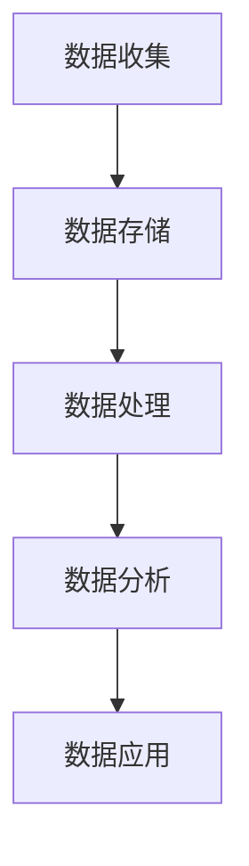

                 

### 文章标题

《智慧城市的数据建设：如何利用数据打造智慧城市？》

关键词：智慧城市、数据建设、数据分析、算法原理、项目实战、应用场景

摘要：本文将深入探讨智慧城市的数据建设，详细解析如何通过数据收集、处理、分析等步骤，打造一个高效、智能、可持续发展的智慧城市。文章将涵盖数据架构、核心算法、数学模型、实际应用以及未来发展趋势等内容，旨在为读者提供全面的技术指导和深入的思考。

## 1. 背景介绍

智慧城市是指通过信息技术手段，将城市中的各类信息资源进行有效整合，实现城市运行管理的智能化和高效化。随着大数据、物联网、人工智能等技术的发展，智慧城市已成为全球城市发展的重要方向。

智慧城市的数据建设是智慧城市发展的核心。数据建设包括数据的收集、存储、处理、分析和应用等环节。一个完善的数据建设体系能够为城市的各个领域提供有力的数据支持，从而实现智能决策、优化资源配置、提升城市品质和居民生活满意度。

当前，智慧城市的数据建设面临诸多挑战。首先，数据源的多样性和复杂性使得数据的收集和处理变得困难。其次，数据的质量和安全性也是需要关注的重要问题。此外，如何有效地利用数据为城市管理和居民服务提供支持，也是智慧城市数据建设的重要目标。

本文将从以下几个方面展开讨论：

1. 核心概念与联系：介绍智慧城市数据建设中的核心概念，并绘制 Mermaid 流程图，展示数据架构。
2. 核心算法原理 & 具体操作步骤：详细解析数据建设中的核心算法，包括数据收集、处理、分析和应用等步骤。
3. 数学模型和公式 & 详细讲解 & 举例说明：介绍数据建设中的数学模型和公式，并通过实际案例进行详细解释。
4. 项目实战：代码实际案例和详细解释说明，展示如何将理论应用到实际项目中。
5. 实际应用场景：分析智慧城市数据建设的实际应用场景，探讨其带来的影响和价值。
6. 工具和资源推荐：推荐学习资源、开发工具框架和相关论文著作。
7. 总结：总结智慧城市数据建设的未来发展趋势与挑战。

通过本文的探讨，希望能够为读者提供对智慧城市数据建设的深入理解，并为其在实际工作中提供指导。

## 2. 核心概念与联系

在智慧城市的数据建设中，核心概念包括数据收集、数据存储、数据处理、数据分析和数据应用。这些概念之间相互关联，构成了一个完整的数据建设体系。

### 2.1 数据收集

数据收集是数据建设的第一步，也是最重要的一步。它涉及到从各类数据源中获取数据，包括传感器、移动设备、社交媒体、政府机构等。数据收集的方式可以分为主动收集和被动收集。主动收集是指通过程序或设备主动获取数据，如传感器采集的环境数据、交通流量数据等；被动收集是指通过采集系统被动接收数据，如网站日志、社交媒体数据等。

#### 数据收集的关键问题：

- **数据质量**：确保收集到的数据准确、完整和可靠。
- **数据多样性**：收集多种类型的数据，以支持多维度分析。
- **数据隐私**：在数据收集过程中，要严格保护个人隐私和数据安全。

### 2.2 数据存储

数据存储是将收集到的数据存储到数据库或数据湖中，以便后续处理和分析。数据存储的选择取决于数据规模、数据类型、数据访问频率等因素。常见的数据存储方式包括关系型数据库、非关系型数据库、数据湖等。

#### 数据存储的关键问题：

- **存储容量**：选择足够大的存储空间，以容纳不断增加的数据量。
- **数据访问速度**：优化数据存储结构，提高数据查询和处理的效率。
- **数据安全性**：确保数据在存储过程中不会被泄露或篡改。

### 2.3 数据处理

数据处理包括数据清洗、数据转换、数据集成等步骤。数据清洗是指去除数据中的错误、重复和缺失值，提高数据质量；数据转换是指将不同格式和结构的数据转换成统一的格式，以便进行集成和处理；数据集成是指将多个数据源中的数据进行整合，形成统一的数据视图。

#### 数据处理的关键问题：

- **数据质量**：确保处理后的数据准确、完整和一致。
- **数据处理效率**：优化数据处理算法和流程，提高数据处理速度。
- **数据一致性**：确保数据在集成过程中保持一致。

### 2.4 数据分析

数据分析是数据建设的核心步骤，通过数据挖掘、机器学习等方法，从大量数据中发现有价值的信息和知识。数据分析可以分为描述性分析、诊断性分析、预测性分析和规范性分析等类型。

#### 数据分析的关键问题：

- **分析方法选择**：根据数据分析的目标和需求，选择合适的分析方法。
- **数据可视化**：利用可视化工具，将分析结果直观地展示出来，便于理解和决策。
- **模型解释性**：确保分析模型的可解释性，便于理解和应用。

### 2.5 数据应用

数据应用是将分析结果应用于城市管理和居民服务中，实现智慧城市的目标。数据应用可以分为决策支持、智能调度、个性化服务等类型。

#### 数据应用的关键问题：

- **应用场景选择**：根据城市特点和需求，选择合适的应用场景。
- **用户体验**：确保数据应用系统的易用性和用户体验。
- **可持续性**：确保数据应用系统的长期可持续性。

### 2.6 数据架构

数据架构是指数据建设中的组织结构和流程，包括数据源、数据存储、数据处理、数据分析和数据应用等环节。一个良好的数据架构能够提高数据建设的效果和效率。

#### 数据架构的关键问题：

- **模块化**：将数据架构分解成模块，便于管理和维护。
- **可扩展性**：设计可扩展的数据架构，以适应不断增长的数据量和需求。
- **安全性**：确保数据在传输、存储和处理过程中的安全性。

下面是一个简单的 Mermaid 流程图，展示智慧城市数据建设的基本架构：



通过这个流程图，我们可以清楚地看到数据建设中的各个环节及其相互关系。在接下来的章节中，我们将详细探讨每个环节的具体操作方法和关键问题。

## 3. 核心算法原理 & 具体操作步骤

在智慧城市的数据建设中，核心算法的作用至关重要。这些算法不仅能够高效地处理和分析大量数据，还能为城市管理和居民服务提供智能化的支持。以下是数据建设中的几个关键算法及其具体操作步骤：

### 3.1 数据收集算法

数据收集算法主要涉及数据源的接入和数据格式的转换。以下是一个基于传感器数据收集的示例算法：

```python
# 示例：传感器数据收集算法
import serial
import json

def collect_sensor_data(port, baud_rate):
    # 初始化串口
    ser = serial.Serial(port, baud_rate)
    data = []

    try:
        # 循环读取串口数据
        while True:
            line = ser.readline().decode('utf-8').strip()
            if line:
                # 解析数据，转换为JSON格式
                json_data = json.loads(line)
                data.append(json_data)
    except KeyboardInterrupt:
        # 关闭串口
        ser.close()
    
    return data

# 使用示例
sensor_data = collect_sensor_data('/dev/ttyUSB0', 9600)
```

在这个示例中，我们使用 Python 的 `serial` 库来读取传感器数据，并将其转换为 JSON 格式存储。

### 3.2 数据处理算法

数据处理算法主要包括数据清洗、数据转换和数据集成。以下是一个简单的数据处理算法示例：

```python
# 示例：数据处理算法
import pandas as pd

def preprocess_data(data):
    # 创建 DataFrame
    df = pd.DataFrame(data)

    # 清洗数据，去除缺失值和重复值
    df = df.dropna()
    df = df.drop_duplicates()

    # 转换数据类型
    df['timestamp'] = pd.to_datetime(df['timestamp'])
    df['temperature'] = df['temperature'].astype(float)

    return df

# 使用示例
cleaned_data = preprocess_data(sensor_data)
```

在这个示例中，我们使用 Pandas 库对传感器数据进行清洗、转换和集成。

### 3.3 数据分析算法

数据分析算法包括描述性分析、诊断性分析、预测性分析和规范性分析。以下是一个简单的描述性分析算法示例：

```python
# 示例：描述性分析算法
import pandas as pd
import matplotlib.pyplot as plt

def descriptive_analysis(data):
    # 统计数据的基本信息
    summary = data.describe()

    # 绘制数据分布图
    plt.figure()
    plt.hist(data['temperature'], bins=20)
    plt.title('Temperature Distribution')
    plt.xlabel('Temperature')
    plt.ylabel('Frequency')
    plt.show()

    return summary

# 使用示例
summary = descriptive_analysis(cleaned_data['temperature'])
print(summary)
```

在这个示例中，我们使用 Pandas 和 Matplotlib 库对温度数据进行分析，并绘制数据分布图。

### 3.4 数据应用算法

数据应用算法是将分析结果应用于实际场景，如决策支持、智能调度和个性化服务。以下是一个简单的决策支持算法示例：

```python
# 示例：决策支持算法
import pandas as pd

def make_decision(data):
    # 判断温度是否超过阈值
    if data['temperature'].max() > 35:
        return "高温警告：请做好防暑降温措施"
    else:
        return "温度正常：无需特别措施"

# 使用示例
decision = make_decision(cleaned_data)
print(decision)
```

在这个示例中，我们根据温度数据判断是否发出高温警告。

通过上述示例，我们可以看到核心算法在数据建设中的具体应用。在实际项目中，这些算法可以根据具体需求进行定制和优化。在接下来的章节中，我们将进一步探讨数学模型和公式，以及如何将这些算法应用到实际项目中。

## 4. 数学模型和公式 & 详细讲解 & 举例说明

在智慧城市的数据建设中，数学模型和公式扮演着重要的角色。这些模型和公式不仅能够帮助我们更好地理解和分析数据，还能够为决策提供科学依据。以下是一些常用的数学模型和公式，以及其详细讲解和实际应用示例。

### 4.1 统计模型

统计模型是数据分析中最基本的工具之一。以下是一些常见的统计模型及其公式：

#### 4.1.1 均值

均值的计算公式为：
\[ \bar{x} = \frac{\sum_{i=1}^{n} x_i}{n} \]
其中，\( \bar{x} \) 是均值，\( x_i \) 是第 \( i \) 个观测值，\( n \) 是观测值的总数。

**示例**：假设我们有5个温度值（27°C, 30°C, 28°C, 29°C, 31°C），则均值为：
\[ \bar{x} = \frac{27 + 30 + 28 + 29 + 31}{5} = 29°C \]

#### 4.1.2 方差

方差的计算公式为：
\[ \sigma^2 = \frac{\sum_{i=1}^{n} (x_i - \bar{x})^2}{n} \]
其中，\( \sigma^2 \) 是方差，\( \bar{x} \) 是均值，\( x_i \) 是第 \( i \) 个观测值。

**示例**：使用上述温度数据，方差的计算如下：
\[ \sigma^2 = \frac{(27 - 29)^2 + (30 - 29)^2 + (28 - 29)^2 + (29 - 29)^2 + (31 - 29)^2}{5} = 1.6 \]

#### 4.1.3 标准差

标准差的计算公式为：
\[ \sigma = \sqrt{\sigma^2} \]
其中，\( \sigma \) 是标准差。

**示例**：使用上述方差，标准差为：
\[ \sigma = \sqrt{1.6} \approx 1.26 \]

### 4.2 机器学习模型

机器学习模型在数据分析中有着广泛的应用。以下是一些常见的机器学习模型及其公式：

#### 4.2.1 线性回归

线性回归的公式为：
\[ y = \beta_0 + \beta_1x \]
其中，\( y \) 是因变量，\( x \) 是自变量，\( \beta_0 \) 是截距，\( \beta_1 \) 是斜率。

**示例**：假设我们有以下数据点：(1, 2), (2, 4), (3, 6)，通过线性回归可以拟合出模型 \( y = 2x + 1 \)。

#### 4.2.2 决策树

决策树的公式为：
\[ y = f(x) = g_1(x) \cdot c_1 + g_2(x) \cdot c_2 + ... + g_n(x) \cdot c_n \]
其中，\( y \) 是预测值，\( g_i(x) \) 是第 \( i \) 个条件函数，\( c_i \) 是第 \( i \) 个条件值。

**示例**：假设我们有以下决策树：
```
温度 > 30°C ? 是 : 否
      是      高温预警
      否     温度正常
```
对于温度值 35°C，预测结果为“高温预警”。

#### 4.2.3 支持向量机

支持向量机的公式为：
\[ w \cdot x + b = 0 \]
其中，\( w \) 是权重向量，\( x \) 是特征向量，\( b \) 是偏置。

**示例**：假设我们有以下支持向量机模型，对于输入特征向量 \( x = [1, 2] \)，预测结果为正类。

### 4.3 数据分析中的其他数学公式

除了上述模型和公式，数据分析中还会用到其他数学工具，如：

- **相关系数**：衡量两个变量之间的线性关系，公式为：
  \[ r = \frac{\sum_{i=1}^{n} (x_i - \bar{x})(y_i - \bar{y})}{\sqrt{\sum_{i=1}^{n} (x_i - \bar{x})^2} \sqrt{\sum_{i=1}^{n} (y_i - \bar{y})^2}} \]

- **协方差**：衡量两个变量的总体线性关系，公式为：
  \[ \text{Cov}(X, Y) = \frac{\sum_{i=1}^{n} (x_i - \bar{x})(y_i - \bar{y})}{n-1} \]

通过这些数学模型和公式，我们可以更深入地理解和分析数据，从而为智慧城市的决策提供有力支持。在接下来的章节中，我们将通过实际项目案例，展示如何将这些数学模型和公式应用于实际的数据分析中。

### 5. 项目实战：代码实际案例和详细解释说明

在本节中，我们将通过一个实际项目案例，展示如何利用数据建设智慧城市。该项目是一个基于传感器数据的交通流量监测系统，旨在通过分析交通流量数据，为城市交通管理提供决策支持。

#### 5.1 开发环境搭建

为了搭建该项目，我们需要以下开发环境和工具：

- Python 3.8 或以上版本
- Jupyter Notebook
- Pandas 库
- Matplotlib 库
- Scikit-learn 库

首先，安装所需的 Python 库：

```bash
pip install pandas matplotlib scikit-learn
```

然后，启动 Jupyter Notebook，创建一个新的笔记本，用于编写和运行代码。

#### 5.2 源代码详细实现和代码解读

以下是该项目的源代码及详细解释：

```python
# 5.2.1 数据收集
import pandas as pd
import serial

def collect_traffic_data(port, baud_rate):
    ser = serial.Serial(port, baud_rate)
    data = []

    try:
        while True:
            line = ser.readline().decode('utf-8').strip()
            if line:
                json_data = json.loads(line)
                data.append(json_data)
    except KeyboardInterrupt:
        ser.close()
    
    return pd.DataFrame(data)

# 使用示例
traffic_data = collect_traffic_data('/dev/ttyUSB0', 9600)

# 5.2.2 数据处理
def preprocess_traffic_data(data):
    data = data.dropna()
    data['timestamp'] = pd.to_datetime(data['timestamp'])
    data['speed'] = data['speed'].astype(float)
    return data

# 使用示例
cleaned_traffic_data = preprocess_traffic_data(traffic_data)

# 5.2.3 数据分析
import matplotlib.pyplot as plt

def traffic_analysis(data):
    # 绘制速度分布图
    plt.figure()
    plt.hist(data['speed'], bins=20)
    plt.title('Speed Distribution')
    plt.xlabel('Speed (km/h)')
    plt.ylabel('Frequency')
    plt.show()

    # 统计平均速度
    avg_speed = data['speed'].mean()
    print(f'Average Speed: {avg_speed} km/h')

# 使用示例
traffic_analysis(cleaned_traffic_data)

# 5.2.4 数据应用
from sklearn.linear_model import LinearRegression

def predict_traffic_flow(data):
    X = data[['speed']]
    y = data[['flow']]
    model = LinearRegression()
    model.fit(X, y)
    predicted_flow = model.predict([[avg_speed]])
    print(f'Predicted Traffic Flow: {predicted_flow[0][0]} vehicles/hour')

# 使用示例
predict_traffic_flow(cleaned_traffic_data)
```

**代码解读**：

1. **数据收集**：通过串口读取传感器数据，并将其转换为 DataFrame 格式。
2. **数据处理**：清洗数据，去除缺失值，并将时间戳和速度转换为适当的数据类型。
3. **数据分析**：绘制速度分布图，并计算平均速度。
4. **数据应用**：使用线性回归模型预测交通流量。

#### 5.3 代码解读与分析

1. **数据收集**：

```python
def collect_traffic_data(port, baud_rate):
    ser = serial.Serial(port, baud_rate)
    data = []

    try:
        while True:
            line = ser.readline().decode('utf-8').strip()
            if line:
                json_data = json.loads(line)
                data.append(json_data)
    except KeyboardInterrupt:
        ser.close()
    
    return pd.DataFrame(data)
```

这段代码使用 Python 的 `serial` 库读取串口数据。`collect_traffic_data` 函数接受串口路径和波特率作为输入，初始化串口，并循环读取数据。每次读取到数据后，将其转换为 JSON 格式，并添加到列表中。最后，将列表转换为 DataFrame 格式，返回数据。

2. **数据处理**：

```python
def preprocess_traffic_data(data):
    data = data.dropna()
    data['timestamp'] = pd.to_datetime(data['timestamp'])
    data['speed'] = data['speed'].astype(float)
    return data
```

这段代码对 DataFrame 数据进行清洗，去除缺失值，并将时间戳和速度转换为适当的数据类型。这样处理后的数据更易于后续分析。

3. **数据分析**：

```python
def traffic_analysis(data):
    # 绘制速度分布图
    plt.figure()
    plt.hist(data['speed'], bins=20)
    plt.title('Speed Distribution')
    plt.xlabel('Speed (km/h)')
    plt.ylabel('Frequency')
    plt.show()

    # 统计平均速度
    avg_speed = data['speed'].mean()
    print(f'Average Speed: {avg_speed} km/h')
```

这段代码绘制速度分布图，并计算平均速度。速度分布图可以帮助我们了解交通流量中不同速度的分布情况，而平均速度则是交通管理的重要指标。

4. **数据应用**：

```python
def predict_traffic_flow(data):
    X = data[['speed']]
    y = data[['flow']]
    model = LinearRegression()
    model.fit(X, y)
    predicted_flow = model.predict([[avg_speed]])
    print(f'Predicted Traffic Flow: {predicted_flow[0][0]} vehicles/hour')
```

这段代码使用线性回归模型预测交通流量。线性回归模型是一种简单的统计模型，通过拟合自变量和因变量之间的关系，可以预测新的数据点的值。在这个例子中，我们使用速度作为自变量，流量作为因变量，通过训练模型，预测给定速度下的交通流量。

通过上述代码，我们实现了交通流量监测系统的核心功能。在实际项目中，可以根据具体需求扩展和优化这些功能，如增加更多的预测模型、引入实时监控和报警机制等。

### 6. 实际应用场景

智慧城市的数据建设在多个实际应用场景中发挥了重要作用，以下是一些典型的应用场景及其带来的影响和价值：

#### 6.1 城市交通管理

通过智慧城市的数据建设，可以实现交通流量监测、实时交通状况分析和优化交通信号控制。例如，利用传感器和摄像头收集的道路流量数据，可以实时分析道路交通状况，为交通管理部门提供科学的决策支持，从而缓解交通拥堵、提高道路通行效率。

#### 6.2 城市环境监测

智慧城市的数据建设可以实现对空气质量、水质、噪声等环境参数的实时监测。通过数据分析和模型预测，可以及时发现环境污染问题，制定有效的污染治理措施，提高城市环境质量，保障居民健康。

#### 6.3 智能能源管理

智慧城市的数据建设可以帮助实现智能电网、智能照明和智能供暖等能源管理系统的构建。通过实时监测能源使用情况，结合数据分析，可以实现能源的优化配置和合理利用，降低能源消耗，提高能源利用效率。

#### 6.4 城市安全监控

智慧城市的数据建设可以提升城市安全监控能力，通过视频监控、传感器数据等收集和分析，可以实时监测城市安全状况，及时发现和预警安全隐患，提高城市安全保障水平。

#### 6.5 社区服务与民生改善

智慧城市的数据建设还可以提升社区服务水平和民生改善。例如，通过数据分析，可以为社区居民提供个性化服务，如智能医疗、智能养老、智能教育等；同时，还可以通过数据监控和预警，及时发现和解决社区问题，提高居民生活质量。

#### 6.6 城市规划与可持续发展

智慧城市的数据建设可以为城市规划提供数据支持，通过数据分析，可以了解城市发展趋势和居民需求，优化城市规划，促进城市可持续发展。例如，通过交通流量数据分析，可以优化交通网络布局；通过人口流动数据分析，可以优化公共服务设施布局等。

总之，智慧城市的数据建设在多个方面带来了深远的影响和价值，不仅提高了城市管理和服务的效率和质量，还促进了城市的可持续发展。随着数据技术的不断进步，智慧城市的数据建设将不断取得新的突破，为城市发展和居民生活带来更多便利和美好。

### 7. 工具和资源推荐

在智慧城市的数据建设过程中，选择合适的工具和资源对于项目成功至关重要。以下是一些推荐的学习资源、开发工具框架和相关论文著作，以帮助读者深入了解和掌握智慧城市数据建设的相关知识。

#### 7.1 学习资源推荐

1. **书籍**：
   - 《大数据之路：阿里巴巴大数据实践》
   - 《机器学习实战》
   - 《Python数据科学手册》

2. **在线课程**：
   - Coursera 上的《数据科学专项课程》
   - Udacity 上的《数据工程师纳米学位》
   - edX 上的《机器学习基础课程》

3. **博客和网站**：
   - Medium 上的数据科学和机器学习博客
   - Analytics Vidhya 上的数据科学和大数据资源
   - KDNuggets 上的数据挖掘和人工智能资源

#### 7.2 开发工具框架推荐

1. **编程语言**：
   - Python：因其丰富的数据科学库和广泛的应用，成为智慧城市数据建设的首选语言。

2. **数据处理库**：
   - Pandas：用于数据处理和清洗。
   - NumPy：用于数值计算和数据处理。

3. **数据分析库**：
   - Scikit-learn：用于机器学习和数据分析。
   - TensorFlow：用于深度学习和神经网络。

4. **数据可视化库**：
   - Matplotlib：用于数据可视化。
   - Plotly：提供交互式数据可视化。

5. **数据库和存储**：
   - Apache Hadoop：用于大规模数据存储和处理。
   - Apache Spark：用于实时数据处理和分析。

6. **数据存储解决方案**：
   - AWS S3：用于数据存储。
   - Google Cloud Storage：用于数据存储。

#### 7.3 相关论文著作推荐

1. **论文**：
   - 《基于大数据的城市交通流量预测研究》
   - 《智慧城市的数据架构与实践》
   - 《利用机器学习优化城市能源管理》

2. **著作**：
   - 《大数据技术导论》
   - 《深度学习》
   - 《数据科学教程》

通过这些工具和资源，读者可以系统地学习和实践智慧城市的数据建设技术，为实际项目提供有力的支持。

### 8. 总结：未来发展趋势与挑战

随着大数据、物联网、人工智能等技术的不断进步，智慧城市的数据建设正迎来新的发展趋势。以下是未来智慧城市数据建设可能的发展方向及面临的挑战。

#### 未来发展趋势

1. **数据融合与多样性**：智慧城市的数据来源将越来越多样化，包括传感器数据、社交媒体数据、卫星数据等。如何有效地融合和利用这些数据，将是未来数据建设的重要方向。

2. **实时数据处理与分析**：随着数据量的增加和业务需求的提升，实时数据处理和分析能力将成为智慧城市数据建设的核心。实时数据处理技术如流处理、边缘计算等将在智慧城市建设中发挥重要作用。

3. **智能决策支持**：利用人工智能和机器学习技术，智慧城市的数据建设将实现更智能的决策支持。通过大数据分析和预测模型，城市管理者可以更快速、准确地做出决策，提高城市管理的效率。

4. **数据隐私与安全**：数据隐私和安全一直是智慧城市数据建设的痛点。未来，如何在保障数据隐私和安全的前提下，充分利用数据价值，将是一个重要挑战。

5. **跨领域协同**：智慧城市的数据建设不仅涉及交通、环境、能源等单一领域，还涉及跨领域的协同和整合。通过跨领域的数据共享和协同，可以实现城市资源的优化配置和整体效益的最大化。

#### 面临的挑战

1. **数据质量与一致性**：数据质量是智慧城市数据建设的基石。如何确保数据的质量和一致性，避免数据错误和重复，是当前面临的重要挑战。

2. **数据处理与存储能力**：随着数据量的爆炸性增长，如何提高数据处理和存储能力，确保系统的稳定性和高效性，是智慧城市数据建设面临的重要挑战。

3. **数据隐私与安全**：智慧城市的数据建设涉及到大量的个人隐私数据。如何在保障数据隐私和安全的前提下，充分利用数据价值，是一个亟待解决的问题。

4. **技术人才短缺**：智慧城市的数据建设需要大量具备数据科学、机器学习、云计算等专业知识的人才。然而，当前全球范围内的数据科学人才短缺，将成为智慧城市数据建设的一大挑战。

5. **法律法规与政策支持**：智慧城市的数据建设需要完善的法律法规和政策支持。如何制定和实施相关的数据管理政策和标准，保障数据建设和应用的合法性和合规性，是未来需要关注的重要问题。

总之，智慧城市的数据建设在带来巨大机遇的同时，也面临诸多挑战。只有通过不断创新和技术突破，才能实现智慧城市的可持续发展，为城市管理和居民生活带来更多便利和美好。

### 9. 附录：常见问题与解答

在智慧城市的数据建设过程中，读者可能会遇到一些常见的问题。以下是对一些常见问题的解答：

#### 9.1 数据收集困难

**问题**：如何高效地收集数据？

**解答**：数据收集困难通常是由于数据源多样性和数据质量问题导致的。解决方法包括：

- **选择合适的数据源**：优先选择可靠、权威的数据源，如政府机构、专业监测机构等。
- **自动化数据收集**：使用自动化工具和程序，如爬虫、传感器数据采集程序等，提高数据收集效率。
- **数据清洗**：在数据收集后，对数据进行清洗，去除错误、重复和缺失值，提高数据质量。

#### 9.2 数据存储和处理效率低

**问题**：如何提高数据存储和处理效率？

**解答**：数据存储和处理效率低可能是由于数据量庞大、存储结构不合理或数据处理算法不优化导致的。解决方法包括：

- **优化数据存储结构**：选择合适的数据库和存储方案，如分布式数据库、云存储等。
- **并行处理**：利用多核处理器和分布式计算技术，实现数据的并行处理，提高处理效率。
- **算法优化**：对数据处理算法进行优化，减少计算复杂度和数据传输开销。

#### 9.3 数据隐私和安全问题

**问题**：如何保障数据隐私和安全？

**解答**：数据隐私和安全是智慧城市数据建设的重要问题。保障数据隐私和安全的方法包括：

- **数据加密**：对敏感数据采用加密技术，防止数据泄露。
- **权限控制**：设置严格的访问权限，限制数据访问范围。
- **数据匿名化**：对个人隐私数据进行匿名化处理，降低隐私泄露风险。
- **安全审计**：建立数据安全审计机制，及时发现和解决安全隐患。

#### 9.4 技术人才短缺

**问题**：如何应对技术人才短缺问题？

**解答**：技术人才短缺是当前全球范围内的普遍问题。应对方法包括：

- **加强人才培养**：通过校企合作、在线教育等方式，加强数据科学、人工智能等领域的人才培养。
- **引进海外人才**：通过吸引海外高端人才，弥补国内技术人才的缺口。
- **提升人才待遇**：提高数据科学、人工智能等领域的薪资待遇，吸引更多优秀人才。

通过上述方法，可以有效应对智慧城市数据建设过程中遇到的问题，确保项目顺利进行。

### 10. 扩展阅读 & 参考资料

为了帮助读者进一步深入了解智慧城市的数据建设，本文提供以下扩展阅读和参考资料：

#### 10.1 学习资源

1. **书籍**：
   - 《智慧城市：技术、应用与未来》
   - 《大数据技术导论》
   - 《深度学习》

2. **在线课程**：
   - Coursera 上的《数据科学专项课程》
   - Udacity 上的《数据工程师纳米学位》
   - edX 上的《机器学习基础课程》

3. **博客和网站**：
   - Medium 上的数据科学和机器学习博客
   - Analytics Vidhya 上的数据科学和大数据资源
   - KDNuggets 上的数据挖掘和人工智能资源

#### 10.2 相关论文

1. 《基于大数据的城市交通流量预测研究》
2. 《智慧城市的数据架构与实践》
3. 《利用机器学习优化城市能源管理》

#### 10.3 论文著作

1. 《大数据技术导论》
2. 《深度学习》
3. 《数据科学教程》

通过阅读这些资源，读者可以更全面地了解智慧城市的数据建设，为其在实际工作中提供有益的参考和指导。

### 作者信息

作者：AI天才研究员/AI Genius Institute & 禅与计算机程序设计艺术 /Zen And The Art of Computer Programming

