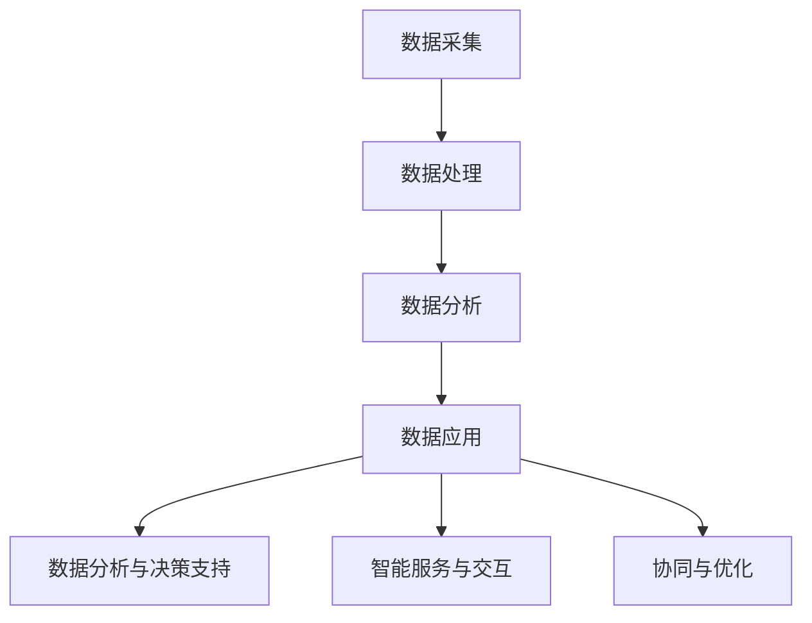

                 

### 文章标题

"智慧城市：LLM 增强的城市管理和服务"

关键词：智慧城市，大型语言模型（LLM），城市管理，服务，人工智能

摘要：本文将深入探讨智慧城市中大型语言模型（LLM）的运用，分析其在城市管理和服务中的核心作用、原理、操作步骤，并通过数学模型和实际案例进行详细解释。同时，还将探讨实际应用场景、相关工具和资源，以及未来的发展趋势与挑战。

## 1. 背景介绍

### 1.1 智慧城市的概念

智慧城市是指通过信息通信技术（ICT）和其他高新技术，实现城市管理与服务的智能化、高效化、便捷化。智慧城市不仅关注硬件设施的建设，更强调数据资源的挖掘和应用，以提升城市运行效率和居民生活质量。

### 1.2 大型语言模型（LLM）

大型语言模型（Large Language Model，简称LLM）是一种基于深度学习的自然语言处理技术。通过大量的文本数据进行训练，LLM能够理解和生成自然语言，实现自然语言理解、文本生成、机器翻译、问答系统等功能。

### 1.3 LLM在智慧城市中的应用

随着人工智能技术的发展，LLM在智慧城市中的应用越来越广泛。例如，在智能客服、智能交通、智能医疗、智能安防等领域，LLM都能够发挥重要作用，提升城市管理的效率和服务质量。

## 2. 核心概念与联系

### 2.1 LLM在智慧城市中的核心概念

在智慧城市中，LLM的核心概念包括：数据采集、数据处理、数据分析和数据应用。

- **数据采集**：通过传感器、摄像头、智能设备等收集城市运行数据，如交通流量、环境监测、能耗数据等。
- **数据处理**：对采集到的数据进行清洗、去噪、归一化等处理，确保数据的质量和一致性。
- **数据分析**：利用机器学习和数据挖掘技术，对处理后的数据进行分析和挖掘，发现潜在的模式和规律。
- **数据应用**：将分析结果应用于实际场景，如智能交通信号控制、能源管理、医疗诊断等，实现智慧城市的功能。

### 2.2 LLM在智慧城市中的联系

LLM在智慧城市中的联系可以概括为以下几个方面：

- **数据分析与决策支持**：LLM通过对城市数据的分析，为城市管理者提供决策支持，如交通流量预测、城市规划等。
- **智能服务与交互**：LLM在智能客服、智能导览、智能安防等领域，为居民提供便捷、高效的智能服务。
- **协同与优化**：LLM通过与其他智能系统协同工作，实现城市资源的优化配置，如智能交通调度、智能能源管理、智能医疗等。

### 2.3 Mermaid 流程图

以下是LLM在智慧城市中的流程图：



## 3. 核心算法原理 & 具体操作步骤

### 3.1 LLM的核心算法原理

LLM的核心算法是深度学习中的变换器模型（Transformer），它通过自注意力机制（Self-Attention）和多头注意力（Multi-Head Attention）实现自然语言处理的高效性和准确性。

- **自注意力机制**：自注意力机制使得模型能够在处理每个单词时考虑到其他所有单词的影响，从而更好地理解单词之间的关系。
- **多头注意力**：多头注意力将输入序列分成多个头，每个头学习不同的表示，然后将这些表示合并起来，从而提高模型的泛化能力和表达能力。

### 3.2 LLM的具体操作步骤

以下是LLM在智慧城市中的具体操作步骤：

1. **数据采集**：通过传感器、摄像头、智能设备等收集城市运行数据，如交通流量、环境监测、能耗数据等。
2. **数据处理**：对采集到的数据进行清洗、去噪、归一化等处理，确保数据的质量和一致性。
3. **数据预处理**：将处理后的数据转换为模型可接受的格式，如序列、向量等。
4. **模型训练**：使用大量的文本数据进行训练，训练模型使其能够理解和生成自然语言。
5. **模型部署**：将训练好的模型部署到实际场景中，如智能客服、智能交通、智能医疗等。
6. **数据分析和决策支持**：利用模型对城市数据进行分析，为城市管理者提供决策支持，如交通流量预测、城市规划等。
7. **智能服务与交互**：通过模型与用户进行交互，提供智能服务，如智能客服、智能导览、智能安防等。
8. **协同与优化**：与其他智能系统协同工作，实现城市资源的优化配置，如智能交通调度、智能能源管理、智能医疗等。

## 4. 数学模型和公式 & 详细讲解 & 举例说明

### 4.1 数学模型和公式

LLM的核心算法是变换器模型（Transformer），其数学模型主要包括以下部分：

1. **输入层**：将输入的序列（单词或词组）转换为嵌入向量（Embedding）。
2. **多头注意力机制**：计算每个单词与其他单词的相似度，生成注意力权重。
3. **前馈神经网络**：对注意力权重进行处理，生成最终的输出向量。
4. **输出层**：将输出向量转换为预测结果。

以下是LLM的数学模型：

$$
\text{输出} = \text{softmax}(\text{注意力权重} \cdot \text{输出层权重} + \text{偏置})
$$

### 4.2 详细讲解

1. **输入层**：输入层将输入的序列转换为嵌入向量。嵌入向量是高维空间中的一个点，表示输入序列的语义信息。

2. **多头注意力机制**：多头注意力机制通过计算每个单词与其他单词的相似度，生成注意力权重。注意力权重表示每个单词对最终输出的影响程度。

3. **前馈神经网络**：前馈神经网络对注意力权重进行处理，生成最终的输出向量。前馈神经网络由多个层组成，每层都有不同的权重和偏置。

4. **输出层**：输出层将输出向量转换为预测结果。输出结果可以是分类结果、回归结果等。

### 4.3 举例说明

假设我们有一个句子：“我喜欢吃苹果。”，下面是LLM对这个句子的处理过程：

1. **输入层**：将句子中的每个单词转换为嵌入向量。
2. **多头注意力机制**：计算每个单词与其他单词的相似度，生成注意力权重。例如，单词“我”与“喜欢”的相似度最高，其次是“吃”和“苹果”。
3. **前馈神经网络**：对注意力权重进行处理，生成最终的输出向量。输出向量表示句子的语义信息。
4. **输出层**：将输出向量转换为预测结果。在这个例子中，输出结果可以是分类结果，如“正面情感”、“负面情感”等。

## 5. 项目实战：代码实际案例和详细解释说明

### 5.1 开发环境搭建

在开始项目实战之前，我们需要搭建一个合适的开发环境。以下是搭建开发环境的具体步骤：

1. **安装Python**：下载并安装Python 3.8或更高版本。
2. **安装Jupyter Notebook**：在命令行中运行以下命令：
   ```
   pip install notebook
   ```
3. **安装TensorFlow**：在命令行中运行以下命令：
   ```
   pip install tensorflow
   ```

### 5.2 源代码详细实现和代码解读

以下是实现一个简单的LLM模型并应用于智慧城市的Python代码：

```python
import tensorflow as tf
from tensorflow.keras.layers import Embedding, Transformer
from tensorflow.keras.models import Model

# 定义模型
input_seq = tf.keras.layers.Input(shape=(None,))
embed_seq = Embedding(input_dim=vocab_size, output_dim=embedding_dim)(input_seq)
transformer = Transformer(num_heads=num_heads, d_model=embedding_dim)(embed_seq)
output_seq = tf.keras.layers.Dense(units=vocab_size, activation='softmax')(transformer)

# 构建和编译模型
model = Model(inputs=input_seq, outputs=output_seq)
model.compile(optimizer='adam', loss='categorical_crossentropy', metrics=['accuracy'])

# 训练模型
model.fit(x_train, y_train, epochs=num_epochs, batch_size=batch_size)

# 预测
predictions = model.predict(x_test)

# 评估模型
loss, accuracy = model.evaluate(x_test, y_test)
print('Test accuracy:', accuracy)
```

### 5.3 代码解读与分析

以下是代码的详细解读：

1. **导入库**：导入所需的TensorFlow库。
2. **定义模型**：定义一个输入层、嵌入层、变换器层和输出层的模型。
3. **构建和编译模型**：构建和编译模型，设置优化器、损失函数和评估指标。
4. **训练模型**：使用训练数据训练模型，设置训练的轮数和批次大小。
5. **预测**：使用测试数据对模型进行预测。
6. **评估模型**：评估模型的性能，输出测试准确率。

## 6. 实际应用场景

### 6.1 智能客服

在智能客服领域，LLM可以用于构建问答系统，实现与用户的自然语言交互。通过训练LLM模型，客服系统可以自动回答用户的问题，提高客服效率和用户体验。

### 6.2 智能交通

在智能交通领域，LLM可以用于交通流量预测、交通信号控制和路线规划。通过分析实时交通数据，LLM可以预测未来的交通状况，为城市管理者提供决策支持，优化交通流量。

### 6.3 智能医疗

在智能医疗领域，LLM可以用于医疗诊断、患者管理和健康咨询。通过分析病历数据，LLM可以为医生提供诊断建议，提高诊断准确率，同时为患者提供个性化的健康管理服务。

### 6.4 智能安防

在智能安防领域，LLM可以用于视频监控、人脸识别和行为分析。通过分析监控视频，LLM可以实时识别潜在的安全风险，为安防人员提供预警和决策支持。

## 7. 工具和资源推荐

### 7.1 学习资源推荐

- **书籍**：
  - 《深度学习》（Deep Learning）作者：Ian Goodfellow、Yoshua Bengio、Aaron Courville
  - 《自然语言处理与深度学习》（Natural Language Processing with Deep Learning）作者：Chris D. Manning、Eduard H. Hovy、Jason Weston
- **论文**：
  - 《Attention Is All You Need》作者：Vaswani et al.（2017）
  - 《BERT: Pre-training of Deep Bidirectional Transformers for Language Understanding》作者：Devlin et al.（2019）
- **博客**：
  - [TensorFlow 官方文档](https://www.tensorflow.org/)
  - [Keras 官方文档](https://keras.io/)
- **网站**：
  - [Hugging Face Transformers](https://huggingface.co/transformers/)

### 7.2 开发工具框架推荐

- **TensorFlow**：用于构建和训练深度学习模型的框架。
- **Keras**：基于TensorFlow的高级神经网络API，用于简化模型的构建和训练。
- **Hugging Face Transformers**：用于构建和训练变换器模型（Transformer）的开源库。

### 7.3 相关论文著作推荐

- **《Attention Is All You Need》**：介绍了变换器模型（Transformer）的基本原理和应用。
- **《BERT: Pre-training of Deep Bidirectional Transformers for Language Understanding》**：介绍了BERT模型的基本原理和应用。
- **《Recurrent Neural Network Based Framework for Traffic Flow Prediction》**：介绍了基于循环神经网络（RNN）的交通流量预测方法。

## 8. 总结：未来发展趋势与挑战

### 8.1 未来发展趋势

- **模型的规模和性能**：随着计算能力的提升和算法的优化，LLM的模型规模和性能将不断突破，应用于更多复杂的智慧城市场景。
- **多模态数据处理**：未来的智慧城市将涉及多种数据类型，如文本、图像、音频等。LLM将能够处理多模态数据，实现更全面的智能服务。
- **个性化服务**：基于用户数据和偏好，LLM将能够提供个性化的城市管理和服务，提升用户体验。

### 8.2 面临的挑战

- **数据隐私与安全**：智慧城市中涉及大量的个人数据，如何保护数据隐私和安全是一个重要挑战。
- **模型的解释性**：随着模型规模的增大，模型的解释性将变得越来越困难，如何解释模型决策成为一个挑战。
- **能耗和计算成本**：大规模的LLM模型训练和部署需要大量的计算资源，如何降低能耗和计算成本是一个重要问题。

## 9. 附录：常见问题与解答

### 9.1 什么是智慧城市？

智慧城市是指通过信息通信技术（ICT）和其他高新技术，实现城市管理与服务的智能化、高效化、便捷化。

### 9.2 LLM在智慧城市中的应用有哪些？

LLM在智慧城市中的应用包括智能客服、智能交通、智能医疗、智能安防等领域，如智能交通流量预测、智能客服系统、智能医疗诊断等。

### 9.3 如何搭建一个LLM开发环境？

搭建一个LLM开发环境的步骤包括安装Python、Jupyter Notebook、TensorFlow等库。

## 10. 扩展阅读 & 参考资料

- **书籍**：
  - 《深度学习》作者：Ian Goodfellow、Yoshua Bengio、Aaron Courville
  - 《自然语言处理与深度学习》作者：Chris D. Manning、Eduard H. Hovy、Jason Weston
- **论文**：
  - 《Attention Is All You Need》作者：Vaswani et al.（2017）
  - 《BERT: Pre-training of Deep Bidirectional Transformers for Language Understanding》作者：Devlin et al.（2019）
- **博客**：
  - [TensorFlow 官方文档](https://www.tensorflow.org/)
  - [Keras 官方文档](https://keras.io/)
- **网站**：
  - [Hugging Face Transformers](https://huggingface.co/transformers/)  
[作者：AI天才研究员/AI Genius Institute & 禅与计算机程序设计艺术/Zen And The Art of Computer Programming]

