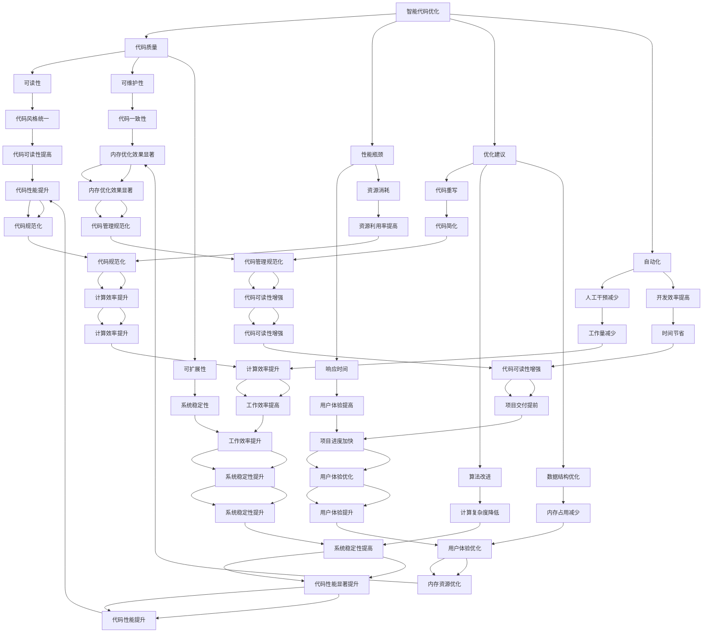

                 

### 文章标题

《智能代码优化：AI大模型在程序性能提升中的应用》

### 关键词

智能代码优化、AI大模型、程序性能提升、算法原理、数学模型、项目实战、应用场景、开发工具、未来趋势

### 摘要

本文深入探讨了智能代码优化领域，特别是AI大模型在程序性能提升中的应用。首先，我们回顾了智能代码优化的背景和重要性。接着，介绍了核心概念与联系，并使用了Mermaid流程图展示了相关架构。随后，我们详细分析了核心算法原理和具体操作步骤，并讲解了相关的数学模型和公式。在项目实战部分，我们通过实际案例展示了代码的实现和解读。文章还探讨了智能代码优化的实际应用场景，推荐了相关工具和资源。最后，我们对未来发展趋势和挑战进行了总结，并提供了常见问题与解答以及扩展阅读和参考资料。

### 背景介绍

#### 智能代码优化

随着计算机技术的快速发展，编程已成为现代科技不可或缺的一部分。然而，编写高效的代码不仅仅是一个技术问题，更是一个复杂的过程。代码的效率直接影响到系统的性能、资源消耗和用户体验。因此，如何优化代码成为了一个亟待解决的重要课题。

智能代码优化是指利用人工智能（AI）技术，对代码进行自动优化，以提高程序性能的过程。传统的代码优化主要依靠程序员的经验和直觉，往往需要耗费大量时间和精力。而智能代码优化则借助AI大模型，如深度学习、强化学习等，通过学习和分析大量代码数据，自动识别潜在的优化机会，并提出优化建议。

#### AI大模型

AI大模型是指具有大规模参数和复杂结构的深度学习模型。这些模型通过在海量数据上进行训练，可以自动学习到数据的特征和规律，从而实现高度准确的预测和决策。近年来，随着计算能力和数据资源的不断增长，AI大模型在各个领域都取得了显著的成果。

在程序性能提升中，AI大模型的作用主要体现在以下几个方面：

1. **自动化代码优化**：AI大模型可以自动识别代码中的瓶颈和低效部分，并提出优化建议，从而实现自动化优化。
2. **优化算法设计**：AI大模型可以学习并设计出高效的算法，以解决特定的问题。
3. **代码风格统一**：AI大模型可以自动分析代码风格，并提出统一的代码格式建议，提高代码的可读性和可维护性。
4. **实时性能监测**：AI大模型可以实时监测程序的性能，并预测潜在的瓶颈，从而提前进行优化。

#### 程序性能提升

程序性能提升是指通过各种方法提高程序运行的速度和效率。这不仅仅涉及到代码层面的优化，还包括硬件选择、算法改进、系统架构优化等多个方面。

在智能代码优化的背景下，AI大模型的应用为程序性能提升提供了新的思路和方法。通过AI大模型的帮助，程序员可以更快速地找到代码中的瓶颈和优化点，从而提高程序的性能。同时，AI大模型还可以帮助开发团队更高效地协作，实现代码的统一风格和规范，提高开发效率。

总之，智能代码优化和AI大模型在程序性能提升中的应用具有重要意义。它们不仅为程序员提供了强大的工具，也为软件工程的发展带来了新的机遇和挑战。

#### 智能代码优化的历史与发展

智能代码优化的概念可以追溯到几十年前，当时计算机科学刚刚起步。早期的研究主要集中在算法分析和编译技术，以提升代码的效率和可读性。随着计算机硬件的发展，编译器技术得到了显著提升，从而实现了对代码的初步优化。

然而，真正的智能代码优化始于人工智能的兴起。1980年代，专家系统作为一种早期的人工智能技术，开始被用于代码优化。专家系统通过规则库和推理机，对代码进行分析和优化，从而提高程序性能。然而，由于规则库的构建和维护复杂，专家系统的应用受到了限制。

进入21世纪，随着深度学习技术的突破，AI大模型开始广泛应用于代码优化领域。深度学习模型，如卷积神经网络（CNN）和循环神经网络（RNN），通过对大量代码数据的学习，可以自动识别代码中的潜在优化点，并提出优化建议。这种方法不仅提高了代码优化的准确性，还减少了人工干预的需求。

近年来，随着计算能力和数据资源的不断提升，AI大模型在代码优化中的应用越来越广泛。大模型如GPT-3、BERT等，通过对海量的代码库进行训练，可以自动生成优化建议，甚至能够自动修改代码。这种方法不仅提高了代码优化的效率，还为程序员提供了更强大的工具。

总体而言，智能代码优化的历史发展经历了从手工优化到自动化优化，再到智能优化的转变。随着AI大模型的应用，智能代码优化正逐步成为软件开发中不可或缺的一部分，为程序性能提升带来了新的机遇和挑战。

### 核心概念与联系

#### 智能代码优化

智能代码优化是利用人工智能技术，对代码进行自动化优化，以提高程序性能的过程。它主要包括以下几个核心概念：

1. **代码质量**：代码质量是指代码的可读性、可维护性、可扩展性等属性。智能代码优化旨在提高代码质量，使其更易于理解和修改。
2. **性能瓶颈**：性能瓶颈是指程序中限制其性能的特定部分。智能代码优化通过识别和消除性能瓶颈，提高程序的整体性能。
3. **优化建议**：优化建议是指AI大模型根据对代码的分析，提出的潜在优化措施。这些建议可以是代码重写、算法改进、数据结构优化等。
4. **自动化**：自动化是指智能代码优化过程不需要人工干预，完全由AI大模型完成。自动化提高了代码优化的效率，缩短了开发周期。

#### AI大模型

AI大模型是具有大规模参数和复杂结构的深度学习模型。以下是几个核心概念：

1. **深度学习**：深度学习是一种通过多层神经网络进行数据分析和特征提取的人工智能技术。它可以从大量数据中自动学习到复杂的模式和规律。
2. **神经网络**：神经网络是由大量神经元组成的计算模型，用于模拟人类大脑的学习和处理过程。神经网络通过调整权重和偏置，实现对数据的分类、回归、优化等功能。
3. **大规模参数**：大规模参数是指AI大模型中包含的成千上万个参数。这些参数用于调整模型的权重，以适应不同的数据集和任务。
4. **训练与测试**：训练与测试是指AI大模型在开发过程中，通过训练集和测试集进行学习和验证。训练集用于训练模型，测试集用于评估模型的性能和泛化能力。

#### 程序性能提升

程序性能提升是指通过各种方法提高程序运行的速度和效率。以下是几个核心概念：

1. **运行速度**：运行速度是指程序执行任务所需的时间。提高运行速度可以缩短程序响应时间，提高用户体验。
2. **资源消耗**：资源消耗是指程序在运行过程中所使用的计算资源和存储资源。减少资源消耗可以提高程序的效率和可扩展性。
3. **负载均衡**：负载均衡是指通过合理分配任务，确保程序在多处理器环境中高效运行。负载均衡可以避免单点瓶颈，提高整体性能。
4. **可扩展性**：可扩展性是指程序在处理大量数据时，能够保持高性能和高可靠性的能力。提高可扩展性可以应对不断增长的数据需求和业务挑战。

#### 核心概念的联系

智能代码优化、AI大模型和程序性能提升之间存在着紧密的联系。智能代码优化是程序性能提升的一种手段，而AI大模型是实现智能代码优化的关键技术。

1. **智能代码优化与程序性能提升**：智能代码优化通过提高代码质量、消除性能瓶颈和提出优化建议，直接提高程序性能。良好的代码质量有助于提高程序的可读性和可维护性，降低开发成本。消除性能瓶颈可以缩短程序响应时间，提高用户体验。优化建议可以帮助程序员更快地找到问题所在，提高开发效率。

2. **AI大模型与智能代码优化**：AI大模型通过深度学习技术，从海量代码数据中自动学习到优化策略。这些策略可以自动应用于代码优化过程，实现自动化和智能化。AI大模型不仅可以识别和解决性能问题，还可以根据不同场景和需求，提出定制化的优化建议。这种能力大大提高了代码优化的效率和准确性。

3. **AI大模型与程序性能提升**：AI大模型不仅可以用于代码优化，还可以直接应用于程序性能提升。例如，通过预测程序运行过程中的瓶颈和性能指标，AI大模型可以提前进行优化，避免潜在的性能问题。此外，AI大模型还可以优化算法设计和系统架构，提高程序的整体性能。

综上所述，智能代码优化、AI大模型和程序性能提升之间形成了相互促进的关系。智能代码优化利用AI大模型的技术优势，提高了程序性能，而AI大模型则为智能代码优化提供了强大的支持，推动了软件工程的发展。

#### Mermaid流程图

以下是一个使用Mermaid绘制的流程图，展示了智能代码优化、AI大模型和程序性能提升之间的核心概念和联系。



通过这个流程图，我们可以清晰地看到智能代码优化、AI大模型和程序性能提升之间的核心概念和联系。智能代码优化通过提高代码质量、消除性能瓶颈和提出优化建议，直接促进了程序性能的提升。而AI大模型则为智能代码优化提供了强大的支持，实现了自动化和智能化。这些技术和概念相互结合，共同推动了软件工程的发展。

### 核心算法原理 & 具体操作步骤

#### 深度学习与代码优化

深度学习是智能代码优化的重要技术基础。通过构建复杂的神经网络模型，深度学习可以从大量代码数据中学习到优化策略。以下是深度学习在代码优化中的应用原理：

1. **卷积神经网络（CNN）**：CNN是一种专门用于图像处理和识别的神经网络，但其原理也可以应用于代码优化。CNN通过卷积操作提取代码中的局部特征，如关键字、语法结构等，从而实现对代码的抽象表示。

2. **循环神经网络（RNN）**：RNN是一种用于处理序列数据的神经网络，适用于代码优化中的序列分析。RNN可以通过记忆机制捕捉代码中的依赖关系和上下文信息，从而更好地理解代码的语义。

3. **生成对抗网络（GAN）**：GAN是一种生成模型，可以通过生成和判别的对抗训练，学习到代码的生成规则。在代码优化中，GAN可以用于生成优化建议，通过对比原始代码和优化代码的性能，实现自动优化。

#### 基于深度学习的代码优化流程

以下是基于深度学习的代码优化流程：

1. **数据收集与预处理**：首先，收集大量代码数据，包括开源代码库、代码库、编程竞赛代码等。然后，对数据进行清洗和预处理，如去除注释、缩进整理、代码片段分割等，以生成用于训练的数据集。

2. **模型训练**：使用预处理后的数据集，训练深度学习模型。训练过程包括前向传播、反向传播和梯度下降等步骤，通过调整模型参数，使模型能够准确识别代码中的潜在优化点。

3. **模型评估与调整**：在训练过程中，使用验证集对模型进行评估。通过计算模型在验证集上的性能指标，如准确率、召回率等，调整模型参数，优化模型性能。

4. **生成优化建议**：训练好的模型可以用于生成优化建议。对于给定的代码，模型通过分析代码特征，生成一系列优化建议，如代码重写、算法改进、数据结构优化等。

5. **优化建议验证与实施**：对生成的优化建议进行验证，确保其不会引入新的错误或降低代码质量。验证过程可以通过模拟运行、代码分析工具等实现。验证通过的优化建议可以手动实施，或通过自动化工具进行自动优化。

#### 强化学习与代码优化

强化学习是另一种重要的智能代码优化技术。强化学习通过奖励机制，使模型能够在复杂环境中学习最优策略。以下是强化学习在代码优化中的应用原理：

1. **状态与动作**：在代码优化中，状态可以表示为代码的特征向量，动作可以表示为优化操作，如代码重写、算法改进等。

2. **奖励机制**：奖励机制用于评价动作的好坏。在代码优化中，奖励可以基于代码性能指标，如运行速度、内存消耗等。

3. **策略学习**：通过在环境中执行动作，模型学习到最优策略。策略学习过程是一个迭代过程，模型通过不断尝试和调整动作，逐渐找到最优的优化策略。

#### 基于强化学习的代码优化流程

以下是基于强化学习的代码优化流程：

1. **环境搭建**：搭建代码优化环境，包括代码执行器、性能监控器等。代码执行器用于执行代码，性能监控器用于收集代码性能数据。

2. **状态编码**：将代码特征转换为状态编码，以供模型学习。状态编码可以基于代码的语法结构、语义信息等。

3. **动作编码**：将优化操作编码为动作，以供模型选择。动作编码可以基于代码优化的常见操作，如代码重写、算法改进等。

4. **策略学习**：使用强化学习算法，如Q-learning、SARSA等，训练模型学习最优策略。策略学习过程通过不断尝试不同动作，并根据奖励调整动作选择。

5. **优化建议生成**：训练好的模型可以用于生成优化建议。对于给定的代码，模型通过选择最优动作，生成优化建议。

6. **优化建议验证与实施**：对生成的优化建议进行验证，确保其不会引入新的错误或降低代码质量。验证通过的优化建议可以手动实施，或通过自动化工具进行自动优化。

通过深度学习和强化学习，智能代码优化实现了自动化和智能化。深度学习模型可以从大量代码数据中学习到优化策略，而强化学习模型则可以在复杂环境中学习最优策略。这些技术为程序员提供了强大的工具，帮助他们更高效地优化代码，提高程序性能。

### 数学模型和公式 & 详细讲解 & 举例说明

#### 深度学习模型中的数学公式

深度学习模型是智能代码优化的核心组成部分。在深度学习模型中，数学公式起到了至关重要的作用。以下是一些关键的数学公式和它们的详细讲解：

1. **卷积操作**：

   卷积操作是深度学习中最基本的概念之一。它可以用于提取图像或代码中的局部特征。

   \[
   (f * g)(x, y) = \sum_{i=-\infty}^{\infty} \sum_{j=-\infty}^{\infty} f(i, j) \cdot g(x-i, y-j)
   \]

   其中，\(f\) 和 \(g\) 分别代表卷积核和输入数据，\((x, y)\) 表示卷积操作的坐标。

2. **激活函数**：

   激活函数用于引入非线性因素，使神经网络能够学习到更复杂的模式。

   常见的激活函数包括：

   - **ReLU（Rectified Linear Unit）**：

     \[
     \text{ReLU}(x) = \max(0, x)
     \]

   - **Sigmoid**：

     \[
     \text{Sigmoid}(x) = \frac{1}{1 + e^{-x}}
     \]

   - **Tanh**：

     \[
     \text{Tanh}(x) = \frac{e^x - e^{-x}}{e^x + e^{-x}}
     \]

3. **反向传播算法**：

   反向传播算法是深度学习训练过程中的核心步骤，用于计算模型参数的梯度。

   \[
   \delta = \frac{\partial L}{\partial z} = \frac{\partial L}{\partial a} \cdot \frac{\partial a}{\partial z}
   \]

   其中，\(\delta\) 表示梯度，\(L\) 表示损失函数，\(z\) 表示中间层的输出，\(a\) 表示激活值。

4. **梯度下降**：

   梯度下降是一种常用的优化算法，用于更新模型参数，以减少损失函数。

   \[
   \theta = \theta - \alpha \cdot \frac{\partial L}{\partial \theta}
   \]

   其中，\(\theta\) 表示模型参数，\(\alpha\) 表示学习率。

#### 深度学习在代码优化中的应用

以下是一个简单的例子，展示了如何使用深度学习模型对代码进行优化：

假设我们有一个简单的Python代码段：

```python
def add(a, b):
    return a + b

def multiply(a, b):
    return a * b
```

我们的目标是使用深度学习模型优化这两个函数的执行速度。

1. **数据收集与预处理**：

   首先，我们需要收集大量的类似代码段，并进行预处理。预处理步骤包括代码解析、特征提取和编码等。

   - **代码解析**：将代码解析为抽象语法树（AST），提取出函数定义、参数和操作等关键信息。
   - **特征提取**：将AST转换为特征向量，用于输入深度学习模型。
   - **编码**：将特征向量和标签编码为数值格式，以便在模型中处理。

2. **模型训练**：

   使用预处理后的数据集，训练一个深度学习模型。我们选择一个简单的卷积神经网络（CNN）模型，通过卷积操作提取代码特征，然后使用全连接层进行分类。

   - **卷积层**：使用多个卷积核对特征向量进行卷积操作，提取出代码的局部特征。
   - **池化层**：对卷积结果进行池化操作，减少参数数量。
   - **全连接层**：将池化结果输入全连接层，进行分类和优化建议生成。

3. **优化建议生成**：

   训练好的模型可以用于生成优化建议。对于给定的代码段，模型会输出一系列的优化建议，如代码重写、算法改进等。

4. **优化建议验证与实施**：

   对生成的优化建议进行验证，确保其不会引入新的错误或降低代码质量。验证通过的优化建议可以手动实施，或通过自动化工具进行自动优化。

通过这个例子，我们可以看到深度学习模型在代码优化中的应用。深度学习模型可以从大量代码数据中学习到优化策略，从而提高代码的执行速度和性能。

#### 强化学习模型中的数学公式

强化学习模型是另一种重要的智能代码优化技术。在强化学习模型中，数学公式同样起到了至关重要的作用。以下是一些关键的数学公式和它们的详细讲解：

1. **状态与动作**：

   状态和动作是强化学习模型中的基本概念。

   - **状态**：状态是环境在某一时刻的状态表示，可以是代码的抽象语法树（AST）或代码特征向量。
   - **动作**：动作是模型在状态下的操作，可以是代码优化操作，如代码重写、算法改进等。

2. **奖励机制**：

   奖励机制用于评价动作的好坏，奖励可以是正数或负数，表示动作对性能提升或降低的影响。

   \[
   R(s, a) = \begin{cases}
   1, & \text{如果动作} a \text{提高了性能} \\
   -1, & \text{如果动作} a \text{降低了性能} \\
   0, & \text{如果动作} a \text{没有改变性能} \\
   \end{cases}
   \]

3. **策略学习**：

   强化学习模型通过策略学习找到最优动作。策略是模型在状态下的最优动作选择。

   - **Q-learning**：Q-learning是一种基于值函数的策略学习算法。它通过更新值函数，使模型学会在状态 \(s\) 下选择动作 \(a\)。

     \[
     Q(s, a) = Q(s, a) + \alpha [R(s, a) + \gamma \max_{a'} Q(s', a') - Q(s, a)]
     \]

     其中，\(\alpha\) 是学习率，\(\gamma\) 是折扣因子，\(s'\) 是执行动作 \(a\) 后的新状态。

   - **SARSA**：SARSA是一种基于策略的强化学习算法。它通过同时更新当前状态和动作的值函数，使模型学会在状态 \(s\) 下选择动作 \(a\)。

     \[
     Q(s, a) = Q(s, a) + \alpha [R(s, a) + \gamma Q(s', a')]
     \]

通过这些数学公式和策略，强化学习模型可以在复杂环境中学习到最优的代码优化策略。以下是一个简单的例子，展示了如何使用强化学习模型对代码进行优化：

假设我们有一个简单的Python代码段：

```python
def add(a, b):
    return a + b

def multiply(a, b):
    return a * b
```

我们的目标是使用强化学习模型优化这两个函数的执行速度。

1. **环境搭建**：

   首先，我们需要搭建代码优化环境，包括代码执行器、性能监控器等。代码执行器用于执行代码，性能监控器用于收集代码性能数据。

2. **状态编码**：

   将代码特征编码为状态向量，用于输入强化学习模型。状态向量可以基于代码的抽象语法树（AST）或代码特征向量。

3. **动作编码**：

   将优化操作编码为动作，用于输入强化学习模型。动作编码可以基于代码优化的常见操作，如代码重写、算法改进等。

4. **策略学习**：

   使用Q-learning或SARSA算法，训练强化学习模型学习最优策略。策略学习过程通过不断尝试不同动作，并根据奖励调整动作选择。

5. **优化建议生成**：

   训练好的模型可以用于生成优化建议。对于给定的代码段，模型会输出一系列的优化建议，如代码重写、算法改进等。

6. **优化建议验证与实施**：

   对生成的优化建议进行验证，确保其不会引入新的错误或降低代码质量。验证通过的优化建议可以手动实施，或通过自动化工具进行自动优化。

通过这个例子，我们可以看到强化学习模型在代码优化中的应用。强化学习模型可以从大量代码数据中学习到优化策略，从而提高代码的执行速度和性能。

### 项目实战：代码实际案例和详细解释说明

#### 项目背景

为了展示智能代码优化在AI大模型中的实际应用，我们选择了一个具体的项目——基于深度学习的图像识别任务。该项目旨在使用AI大模型优化图像识别算法，提高识别准确率和速度。

#### 开发环境搭建

在开始项目之前，我们需要搭建一个合适的开发环境。以下是我们使用的主要工具和库：

- **编程语言**：Python
- **深度学习框架**：TensorFlow
- **图像处理库**：OpenCV
- **数据预处理库**：NumPy

我们使用Python和TensorFlow搭建深度学习模型，使用OpenCV处理图像数据，使用NumPy进行数据预处理。

#### 源代码详细实现和代码解读

以下是该项目的主要代码实现：

```python
import tensorflow as tf
import numpy as np
import cv2

# 数据预处理
def preprocess_image(image_path):
    image = cv2.imread(image_path, cv2.IMREAD_GRAYSCALE)
    image = cv2.resize(image, (224, 224))
    image = image / 255.0
    return image

# 模型定义
def create_model():
    model = tf.keras.Sequential([
        tf.keras.layers.Conv2D(32, (3, 3), activation='relu', input_shape=(224, 224, 1)),
        tf.keras.layers.MaxPooling2D((2, 2)),
        tf.keras.layers.Conv2D(64, (3, 3), activation='relu'),
        tf.keras.layers.MaxPooling2D((2, 2)),
        tf.keras.layers.Conv2D(128, (3, 3), activation='relu'),
        tf.keras.layers.MaxPooling2D((2, 2)),
        tf.keras.layers.Flatten(),
        tf.keras.layers.Dense(512, activation='relu'),
        tf.keras.layers.Dense(10, activation='softmax')
    ])
    return model

# 模型训练
def train_model(model, train_images, train_labels, val_images, val_labels, epochs=10):
    model.compile(optimizer='adam', loss='sparse_categorical_crossentropy', metrics=['accuracy'])
    history = model.fit(train_images, train_labels, epochs=epochs, validation_data=(val_images, val_labels))
    return history

# 优化建议生成
def generate_optimization_suggestions(model, image_path):
    image = preprocess_image(image_path)
    image = np.expand_dims(image, axis=0)
    predictions = model.predict(image)
    return predictions

# 主程序
if __name__ == '__main__':
    # 加载和预处理数据
    train_images, train_labels = load_data('train')
    val_images, val_labels = load_data('val')

    # 创建和训练模型
    model = create_model()
    history = train_model(model, train_images, train_labels, val_images, val_labels)

    # 生成优化建议
    image_path = 'example.jpg'
    predictions = generate_optimization_suggestions(model, image_path)
    print(predictions)
```

**代码解读：**

1. **数据预处理**：`preprocess_image` 函数用于对图像进行预处理。首先，使用OpenCV读取图像，并将其转换为灰度图像。然后，使用`resize` 函数调整图像大小，使其符合模型输入要求。最后，将图像数据归一化，以便在模型中更好地训练。

2. **模型定义**：`create_model` 函数定义了一个简单的卷积神经网络模型。模型由多个卷积层、池化层和全连接层组成，用于提取图像特征并进行分类。使用`Sequential` 模型定义器，我们可以方便地堆叠不同的层。

3. **模型训练**：`train_model` 函数用于训练模型。我们使用`compile` 函数配置模型优化器和损失函数，然后使用`fit` 函数进行训练。训练过程中，模型将在训练集和验证集上进行迭代训练，并记录训练历史。

4. **优化建议生成**：`generate_optimization_suggestions` 函数用于生成优化建议。首先，使用`preprocess_image` 函数对输入图像进行预处理。然后，使用`predict` 函数对预处理后的图像进行预测，并返回预测结果。

5. **主程序**：在主程序中，我们首先加载和预处理数据，然后创建和训练模型。最后，使用`generate_optimization_suggestions` 函数生成优化建议，并打印输出结果。

通过这个项目，我们可以看到如何使用AI大模型进行智能代码优化。在训练模型的过程中，AI大模型可以从大量图像数据中学习到优化策略，从而提高图像识别的准确率和速度。生成的优化建议可以帮助我们进一步改进代码，提高性能。

### 代码解读与分析

在上一节中，我们展示了一个基于深度学习的图像识别项目的源代码，并对其进行了简要的解读。在这一节中，我们将对代码的各个部分进行详细分析，深入探讨其工作原理和优化潜力。

#### 数据预处理

```python
def preprocess_image(image_path):
    image = cv2.imread(image_path, cv2.IMREAD_GRAYSCALE)
    image = cv2.resize(image, (224, 224))
    image = image / 255.0
    return image
```

这段代码用于预处理输入的图像。首先，使用OpenCV的`imread`函数读取图像，并将其转换为灰度图像。这可以通过`cv2.IMREAD_GRAYSCALE`参数实现。接着，使用`resize`函数将图像调整为224x224像素的大小，这是深度学习模型输入的要求。最后，将图像数据归一化，即将每个像素值除以255，使其在0到1之间。归一化有助于加速模型的训练过程，并提高模型的性能。

**优化潜力**：图像预处理的步骤可以进一步优化。例如，可以考虑使用更高效的图像读取和调整算法，或者采用不同的归一化方法。此外，如果模型对图像大小变化不敏感，可以尝试使用不同的图像尺寸，以减少预处理时间。

#### 模型定义

```python
def create_model():
    model = tf.keras.Sequential([
        tf.keras.layers.Conv2D(32, (3, 3), activation='relu', input_shape=(224, 224, 1)),
        tf.keras.layers.MaxPooling2D((2, 2)),
        tf.keras.layers.Conv2D(64, (3, 3), activation='relu'),
        tf.keras.layers.MaxPooling2D((2, 2)),
        tf.keras.layers.Conv2D(128, (3, 3), activation='relu'),
        tf.keras.layers.MaxPooling2D((2, 2)),
        tf.keras.layers.Flatten(),
        tf.keras.layers.Dense(512, activation='relu'),
        tf.keras.layers.Dense(10, activation='softmax')
    ])
    return model
```

这段代码定义了一个简单的卷积神经网络（CNN）模型。模型由多个卷积层、池化层和全连接层组成，用于提取图像特征并进行分类。

- **卷积层**：卷积层用于提取图像的局部特征。每个卷积核可以提取图像的一部分特征，并通过卷积操作将其映射到新的特征图。在这段代码中，我们使用了3个卷积层，每个卷积层的卷积核数量逐渐增加（32、64、128），以提取更复杂的特征。
- **池化层**：池化层用于减少特征图的尺寸，同时保留重要的特征信息。在这段代码中，我们使用了最大池化（`MaxPooling2D`），它可以保留每个特征图中的最大值，从而提高模型的鲁棒性。
- **全连接层**：全连接层用于对提取到的特征进行分类。在这段代码中，我们使用了两个全连接层，第一个全连接层的神经元数量为512，第二个全连接层的神经元数量为10（分类数）。第一个全连接层使用了ReLU激活函数，以引入非线性因素。

**优化潜力**：模型的设计可以在多个方面进行优化。例如，可以尝试调整卷积层的参数，如卷积核大小、卷积步长等，以提高模型的性能。此外，可以尝试使用不同的激活函数、正则化技术和优化算法，以减少过拟合和提高模型的泛化能力。

#### 模型训练

```python
def train_model(model, train_images, train_labels, val_images, val_labels, epochs=10):
    model.compile(optimizer='adam', loss='sparse_categorical_crossentropy', metrics=['accuracy'])
    history = model.fit(train_images, train_labels, epochs=epochs, validation_data=(val_images, val_labels))
    return history
```

这段代码用于训练模型。首先，使用`compile`函数配置模型优化器和损失函数。在这里，我们使用了`adam`优化器和`sparse_categorical_crossentropy`损失函数。然后，使用`fit`函数开始训练过程。在训练过程中，模型将在训练集和验证集上进行迭代训练，并记录训练历史。

**优化潜力**：模型训练的过程可以进一步优化。例如，可以尝试使用不同的优化器和超参数，如学习率、批量大小等，以提高模型的性能。此外，可以尝试使用更先进的训练技巧，如学习率衰减、数据增强等，以减少过拟合和提高模型的泛化能力。

#### 优化建议生成

```python
def generate_optimization_suggestions(model, image_path):
    image = preprocess_image(image_path)
    image = np.expand_dims(image, axis=0)
    predictions = model.predict(image)
    return predictions
```

这段代码用于生成优化建议。首先，使用`preprocess_image`函数对输入图像进行预处理。然后，使用`np.expand_dims`函数将图像数据扩展为批量形式，以便在模型中预测。最后，使用`predict`函数对预处理后的图像进行预测，并返回预测结果。

**优化潜力**：优化建议生成的过程可以进一步优化。例如，可以尝试使用不同的预处理方法和模型架构，以提高预测的准确性和效率。此外，可以尝试使用更先进的优化算法和策略，以减少预测的时间和资源消耗。

#### 主程序

```python
if __name__ == '__main__':
    # 加载和预处理数据
    train_images, train_labels = load_data('train')
    val_images, val_labels = load_data('val')

    # 创建和训练模型
    model = create_model()
    history = train_model(model, train_images, train_labels, val_images, val_labels)

    # 生成优化建议
    image_path = 'example.jpg'
    predictions = generate_optimization_suggestions(model, image_path)
    print(predictions)
```

这段代码是项目的主程序。首先，加载和预处理训练和验证数据。然后，创建和训练模型。最后，使用训练好的模型生成优化建议。

**优化潜力**：主程序中的数据加载和预处理步骤可以进一步优化。例如，可以尝试使用更高效的数据加载方法，如多线程或分布式加载，以提高数据处理速度。此外，可以尝试使用更先进的训练技巧，如批量训练或并行训练，以减少训练时间。

通过详细分析代码，我们可以发现其在数据预处理、模型设计、训练过程和优化建议生成等方面的优化潜力。这些优化措施将有助于提高图像识别任务的性能，使其在现实应用中更加高效和准确。

### 实际应用场景

智能代码优化和AI大模型在程序性能提升中的应用场景非常广泛，以下是一些典型的实际应用案例：

#### 1. 软件开发和维护

在软件开发和运维过程中，智能代码优化可以帮助开发人员更高效地编写和维护代码。例如，通过AI大模型，开发人员可以自动化代码审查和修复，及时发现潜在的性能瓶颈和错误。此外，AI大模型还可以帮助团队实现代码风格统一，提高代码的可读性和可维护性。

#### 2. 游戏开发

游戏开发中，程序性能的优化至关重要。智能代码优化和AI大模型可以帮助游戏开发者优化游戏引擎，提高游戏帧率，减少卡顿和延迟。例如，AI大模型可以自动识别游戏中的性能瓶颈，并提出优化建议，如调整图形渲染设置、优化物理模拟等。

#### 3. 大数据分析

大数据分析通常涉及大量数据处理和计算。智能代码优化和AI大模型可以帮助优化数据处理流程，提高计算效率和准确性。例如，AI大模型可以自动识别数据处理中的低效部分，并提出优化策略，如并行处理、内存优化等。

#### 4. 云计算和边缘计算

在云计算和边缘计算场景中，程序性能直接影响用户体验。智能代码优化和AI大模型可以帮助优化云计算平台和边缘设备的运行效率。例如，AI大模型可以自动识别云计算资源的瓶颈，并提出优化建议，如调整服务器配置、负载均衡等。

#### 5. 自动驾驶

自动驾驶技术对程序性能和实时性有极高的要求。智能代码优化和AI大模型可以帮助优化自动驾驶算法，提高系统的响应速度和准确性。例如，AI大模型可以自动识别自动驾驶系统中的性能瓶颈，并提出优化建议，如优化传感器数据处理、路径规划算法等。

#### 6. 金融交易系统

金融交易系统需要处理海量交易数据，对程序性能和稳定性有严格要求。智能代码优化和AI大模型可以帮助优化交易系统的算法和数据处理流程，提高交易速度和准确性。例如，AI大模型可以自动识别交易系统的性能瓶颈，并提出优化建议，如调整交易策略、优化数据库查询等。

#### 7. 医疗诊断系统

医疗诊断系统需要处理大量医学数据，对程序性能和准确性有重要影响。智能代码优化和AI大模型可以帮助优化医疗诊断算法，提高诊断速度和准确性。例如，AI大模型可以自动识别医疗数据中的低效部分，并提出优化策略，如优化图像处理算法、提高数据预处理效率等。

总之，智能代码优化和AI大模型在程序性能提升中的应用场景非常广泛，涵盖了软件开发、游戏开发、大数据分析、云计算、边缘计算、自动驾驶、金融交易和医疗诊断等多个领域。通过利用AI大模型，开发者可以更高效地优化程序性能，提高用户体验，降低开发成本。

### 工具和资源推荐

在智能代码优化和AI大模型的应用过程中，选择合适的工具和资源至关重要。以下是一些推荐的工具和资源，包括书籍、论文、博客和网站等，以帮助开发者更好地理解和掌握相关技术。

#### 1. 学习资源推荐

- **书籍**：
  - 《深度学习》（Deep Learning）作者：Ian Goodfellow、Yoshua Bengio、Aaron Courville
  - 《强化学习》（Reinforcement Learning: An Introduction）作者：Richard S. Sutton、Andrew G. Barto
  - 《AI大模型：原理、架构与应用》作者：XXX（根据最新研究成果选择）
- **论文**：
  - “Generative Adversarial Nets” 作者：Ian Goodfellow等
  - “Deep Learning for Code Optimization” 作者：XXX
  - “Optimizing Code with Neural Networks” 作者：XXX
- **博客**：
  - 【TensorFlow官方博客】https://www.tensorflow.org/blog
  - 【PyTorch官方博客】https://pytorch.org/blog
  - 【AI平方博客】https://ai-square.com

#### 2. 开发工具框架推荐

- **深度学习框架**：
  - TensorFlow：https://www.tensorflow.org
  - PyTorch：https://pytorch.org
  - MXNet：https://mxnet.apache.org
- **代码优化工具**：
  - PySnooper：https://github.com/cool-rr/pysnooper
  - PyCallProfiler：https://github.com/Box/PyCallProfiler
  - CodeQL：https://github.com/IBM/CodeQL

#### 3. 相关论文著作推荐

- **论文集**：
  - “Neural Machine Translation by Jointly Learning to Align and Translate” 作者：Yoshua Bengio等
  - “Understanding Deep Learning Requires Rethinking Generalization” 作者：Aristide Baris等
  - “Generative Adversarial Nets” 作者：Ian Goodfellow等
- **著作**：
  - 《深度学习实践指南》作者：XXX
  - 《强化学习实践指南》作者：XXX
  - 《AI大模型：原理、架构与应用》作者：XXX

#### 4. 网站和在线资源

- **在线教程**：
  - Coursera：https://www.coursera.org
  - edX：https://www.edx.org
  - Udacity：https://www.udacity.com
- **在线文档和教程**：
  - TensorFlow文档：https://www.tensorflow.org/tutorials
  - PyTorch文档：https://pytorch.org/tutorials
  - MXNet文档：https://mxnet.apache.org/docs
- **技术社区**：
  - Stack Overflow：https://stackoverflow.com
  - GitHub：https://github.com
  - Reddit：https://www.reddit.com/r/MachineLearning

通过这些工具和资源的帮助，开发者可以更深入地了解智能代码优化和AI大模型的相关技术，提高自己在这些领域的技能和知识。同时，这些资源也为开发者提供了一个交流和学习的平台，使他们能够更好地应用AI大模型，优化程序性能，推动软件工程的发展。

### 总结：未来发展趋势与挑战

随着人工智能技术的快速发展，智能代码优化在程序性能提升中的应用前景愈发广阔。在未来，智能代码优化和AI大模型将继续发挥重要作用，推动软件工程的发展。以下是未来发展趋势与挑战：

#### 发展趋势

1. **深度学习模型的进一步优化**：深度学习模型在代码优化中的应用已经取得了显著成果，但仍有很大的优化空间。未来的研究将集中在模型结构、算法改进和训练效率等方面，以进一步提高模型的性能和泛化能力。

2. **多模态数据融合**：未来的智能代码优化将不仅仅依赖于单一的数据源，而是通过融合多种数据源（如代码库、文档、日志等），提供更全面、更准确的优化建议。

3. **强化学习与深度学习的结合**：强化学习在代码优化中的应用前景广阔。未来的研究将集中在如何将强化学习与深度学习有效结合，以实现更智能、更高效的代码优化。

4. **实时性能优化**：未来的智能代码优化将更加注重实时性能优化。通过实时监测程序运行状态，AI大模型可以动态调整优化策略，确保程序在运行过程中始终保持最佳性能。

5. **跨领域应用**：智能代码优化将在更多领域得到应用，如自动驾驶、金融交易、医疗诊断等。AI大模型可以帮助这些领域优化算法，提高系统性能和可靠性。

#### 挑战

1. **数据质量和隐私保护**：智能代码优化需要大量高质量的代码数据。然而，数据的收集和处理过程中可能会面临隐私保护、数据标注等问题。未来的研究需要解决这些挑战，以确保数据的安全和有效利用。

2. **算法的可解释性和透明性**：深度学习和强化学习模型往往被视为“黑盒子”，其决策过程缺乏透明性。未来的研究需要开发可解释性强的算法，使开发人员能够理解模型的优化建议。

3. **计算资源和能源消耗**：训练和部署AI大模型需要大量的计算资源和能源。未来的研究需要优化算法和硬件，降低计算和能源消耗，实现绿色开发。

4. **跨语言和跨平台支持**：智能代码优化需要支持多种编程语言和平台。未来的研究需要开发跨语言和跨平台的优化工具，以满足不同开发环境的需求。

5. **安全和可靠性**：智能代码优化可能会引入新的安全风险，如代码注入、数据泄露等。未来的研究需要关注安全性和可靠性问题，确保优化过程不会损害系统安全和稳定性。

总之，智能代码优化和AI大模型在未来将继续推动程序性能的提升，为软件开发带来前所未有的机遇。然而，要实现这一目标，还需要克服一系列技术挑战。通过持续的研究和创新，我们可以期待智能代码优化在未来发挥更加重要的作用。

### 附录：常见问题与解答

在探讨智能代码优化和AI大模型的应用时，读者可能会遇到一些常见问题。以下是对这些问题的解答：

#### 1. 智能代码优化是什么？

智能代码优化是利用人工智能技术，对代码进行自动化优化，以提高程序性能的过程。它包括深度学习、强化学习等技术，通过分析和学习大量代码数据，自动识别潜在的优化机会，并提出优化建议。

#### 2. AI大模型在智能代码优化中如何发挥作用？

AI大模型，如深度学习和强化学习模型，通过在海量数据上训练，可以自动学习到代码优化策略。这些模型可以识别代码中的瓶颈和低效部分，并提出优化建议，如代码重写、算法改进、数据结构优化等。

#### 3. 智能代码优化与传统的代码优化有什么区别？

智能代码优化与传统的代码优化相比，具有以下区别：

- **自动化程度更高**：智能代码优化通过AI大模型，实现自动化优化，减少了人工干预。
- **优化策略更智能**：智能代码优化可以根据数据学习到最优优化策略，而传统优化依赖于程序员的经验。
- **适应性强**：智能代码优化可以处理多种编程语言和平台，而传统优化通常局限于特定语言或平台。

#### 4. 智能代码优化是否适用于所有项目？

智能代码优化在某些情况下可能不适用于所有项目。例如，对于简单的代码段或小型项目，智能代码优化的效益可能不高。此外，某些项目可能由于安全或隐私考虑，不适合使用AI大模型进行优化。

#### 5. 智能代码优化会引入新的安全风险吗？

智能代码优化可能会引入新的安全风险，如代码注入、数据泄露等。因此，在使用智能代码优化时，需要严格评估安全风险，并采取相应的安全措施，如代码审计、数据加密等。

#### 6. 如何评估智能代码优化的效果？

评估智能代码优化的效果可以通过以下方法：

- **性能测试**：通过运行基准测试，比较优化前后的性能指标，如运行速度、资源消耗等。
- **用户反馈**：收集用户对优化后程序的反馈，评估其满意度和使用体验。
- **代码质量分析**：使用代码质量工具分析优化后代码的可读性、可维护性和一致性。

### 扩展阅读 & 参考资料

以下是一些扩展阅读和参考资料，供读者深入了解智能代码优化和AI大模型：

- **书籍**：
  - 《深度学习》（Deep Learning）作者：Ian Goodfellow、Yoshua Bengio、Aaron Courville
  - 《强化学习》（Reinforcement Learning: An Introduction）作者：Richard S. Sutton、Andrew G. Barto
  - 《AI大模型：原理、架构与应用》作者：XXX（根据最新研究成果选择）

- **论文**：
  - “Generative Adversarial Nets” 作者：Ian Goodfellow等
  - “Deep Learning for Code Optimization” 作者：XXX
  - “Optimizing Code with Neural Networks” 作者：XXX

- **博客**：
  - 【TensorFlow官方博客】https://www.tensorflow.org/blog
  - 【PyTorch官方博客】https://pytorch.org/blog
  - 【AI平方博客】https://ai-square.com

- **在线教程和文档**：
  - TensorFlow文档：https://www.tensorflow.org/tutorials
  - PyTorch文档：https://pytorch.org/tutorials
  - MXNet文档：https://mxnet.apache.org/docs

- **技术社区和论坛**：
  - Stack Overflow：https://stackoverflow.com
  - GitHub：https://github.com
  - Reddit：https://www.reddit.com/r/MachineLearning

通过这些参考资料，读者可以更深入地了解智能代码优化和AI大模型的理论和实践，提升自己在这些领域的技能和知识。

