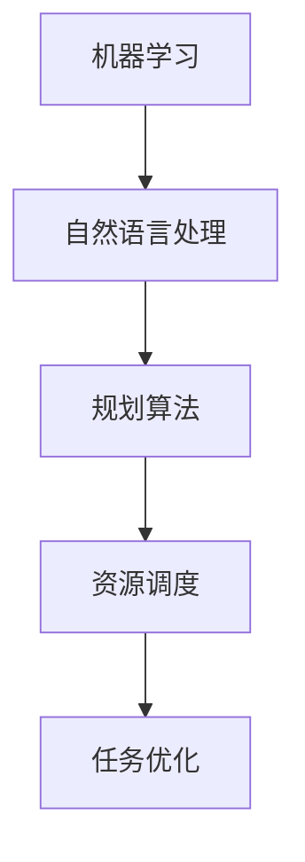

                 

# 智能任务分配：LLM的规划能力

## > {关键词：智能任务分配、Large Language Model、LLM、规划能力、任务优化、机器学习、自然语言处理、人工智能}

> {摘要：本文将深入探讨大型语言模型（LLM）在智能任务分配中的应用，分析其规划能力，探讨如何通过机器学习和自然语言处理技术实现高效的资源调度和任务优化。文章将从核心概念、算法原理、数学模型、实战案例等多个角度，系统地阐述LLM在任务分配中的优势和应用场景。}

## 1. 背景介绍

在当今的信息化时代，随着人工智能技术的快速发展，机器学习、深度学习、自然语言处理等领域取得了显著的进展。其中，大型语言模型（LLM）作为一种重要的自然语言处理技术，正逐渐成为人工智能领域的热点。LLM具有强大的语义理解和生成能力，可以处理复杂的文本数据，并在各种自然语言处理任务中取得优异的性能。

在智能任务分配领域，任务优化和资源调度一直是重要的研究课题。传统的任务分配方法通常依赖于静态的规则和算法，难以适应动态变化的环境。而LLM的出现为智能任务分配带来了新的机遇，通过学习大量的文本数据，LLM可以自动识别任务之间的关联性，预测任务的执行时间，优化资源分配，从而实现更高效的调度。

本文将围绕LLM的规划能力展开讨论，分析其在智能任务分配中的应用价值，探讨如何利用机器学习和自然语言处理技术实现高效的资源调度和任务优化。

## 2. 核心概念与联系

在深入探讨LLM的规划能力之前，我们首先需要了解一些核心概念，包括机器学习、自然语言处理、规划算法等。

### 2.1 机器学习

机器学习是一种通过算法从数据中学习规律和模式，并进行预测和决策的技术。在任务分配中，机器学习可以用于预测任务执行时间、评估资源需求等，从而优化资源分配。

### 2.2 自然语言处理

自然语言处理（NLP）是一种将自然语言（如文本、语音等）转化为计算机可处理数据的技术。在任务分配中，NLP可以用于理解任务描述、提取关键信息、构建任务图谱等，从而实现智能化的任务分配。

### 2.3 规划算法

规划算法是一种用于解决决策问题的算法，其目标是在给定的环境和约束条件下，选择最优的行动序列。在任务分配中，规划算法可以用于确定任务执行顺序、优化资源分配等。

### 2.4 核心概念联系

图1展示了机器学习、自然语言处理和规划算法之间的联系。通过机器学习，我们可以从历史数据中学习任务执行规律；通过自然语言处理，我们可以理解任务描述并提取关键信息；最后，通过规划算法，我们可以根据这些信息进行资源调度和任务优化。



## 3. 核心算法原理 & 具体操作步骤

### 3.1 LLM的基本原理

LLM（Large Language Model）是一种基于深度学习技术的自然语言处理模型，其核心是通过对海量文本数据进行训练，学习到语言的模式和规律。LLM通常采用预训练加微调（Pre-training & Fine-tuning）的方式，首先在大规模语料库上进行预训练，然后在特定任务上进行微调。

预训练阶段，LLM通过无监督的方式学习到语言的通用特征，如语法、语义、上下文等。微调阶段，LLM根据特定任务的需求，调整模型的参数，使其适应特定领域的任务。

### 3.2 LLM在任务分配中的应用

在任务分配中，LLM可以用于以下方面：

1. **任务理解**：通过NLP技术，LLM可以理解任务描述，提取关键信息，如任务类型、执行时间、资源需求等。

2. **任务预测**：利用历史数据，LLM可以预测任务的执行时间，为资源调度提供依据。

3. **资源优化**：通过学习任务之间的关联性，LLM可以优化资源分配，提高任务执行效率。

### 3.3 LLM任务分配的具体操作步骤

1. **数据收集与预处理**：收集历史任务数据，包括任务描述、执行时间、资源需求等。对数据进行分析和预处理，如文本清洗、分词、词向量化等。

2. **模型训练**：使用预训练的LLM模型，对数据集进行训练。在预训练阶段，模型学习到语言的通用特征；在微调阶段，模型根据特定任务调整参数。

3. **任务理解**：利用训练好的LLM模型，对新的任务描述进行理解，提取关键信息。

4. **任务预测**：根据历史数据和任务理解结果，使用机器学习算法预测任务执行时间。

5. **资源优化**：根据任务执行时间和资源需求，使用规划算法优化资源分配，提高任务执行效率。

6. **任务调度**：根据资源分配结果，生成任务执行计划，并对任务进行调度。

## 4. 数学模型和公式 & 详细讲解 & 举例说明

### 4.1 任务分配模型

在任务分配中，我们通常采用最优化模型来描述资源调度问题。最优化模型通常包括目标函数和约束条件。

目标函数通常是最小化任务完成时间或最大化资源利用率。假设有n个任务T1, T2, ..., Tn，每个任务Ti的执行时间为ti，资源需求为ri。我们的目标是最小化总任务完成时间：

$$
\min \sum_{i=1}^{n} t_i
$$

约束条件包括：

1. 资源限制：每个资源的使用量不得超过其可用量。
$$
r_i \leq R_i \quad \forall i=1,2,...,n
$$

2. 任务依赖：某些任务必须在其他任务完成后才能执行。
$$
t_j \leq t_i + d_{ij} \quad \forall i,j=1,2,...,n \quad i\neq j
$$

其中，d_{ij}表示任务i与任务j之间的依赖关系。

### 4.2 求解方法

求解最优化模型的方法有很多，如线性规划、整数规划、遗传算法等。这里我们以线性规划为例进行讲解。

线性规划的目标函数和约束条件可以表示为：

$$
\min \sum_{i=1}^{n} c_i x_i
$$

$$
\text{subject to} \quad
\begin{cases}
a_{ij} x_j \leq b_i \quad \forall i,j=1,2,...,n \\
x_i \geq 0 \quad \forall i=1,2,...,n
\end{cases}
$$

其中，c_i是任务i的权重，x_i是任务i的执行时间，a_{ij}和b_i是约束条件的系数。

### 4.3 举例说明

假设我们有3个任务T1, T2, T3，分别需要2小时、3小时和4小时。任务T1和T2之间存在依赖关系，即T1必须先于T2执行。资源有限，每小时最多只能分配1个资源。我们的目标是优化资源分配，使任务完成时间最短。

1. 目标函数：最小化总任务完成时间
$$
\min \sum_{i=1}^{3} t_i
$$

2. 约束条件：
$$
\text{约束1: } t_1 + t_2 \leq 1 \\
\text{约束2: } t_2 + t_3 \leq 1 \\
\text{约束3: } t_1 + t_2 + t_3 \leq 1
$$

使用线性规划求解，我们得到以下最优解：
- T1执行2小时，T2执行1小时，T3执行0小时
- 总任务完成时间为3小时

## 5. 项目实战：代码实际案例和详细解释说明

### 5.1 开发环境搭建

在开始项目实战之前，我们需要搭建一个开发环境。这里我们使用Python作为开发语言，主要依赖以下库：

- TensorFlow：用于构建和训练大型语言模型
- NLTK：用于自然语言处理
- Scikit-learn：用于机器学习和优化算法

首先，我们需要安装这些库。可以使用以下命令安装：

```bash
pip install tensorflow nltk scikit-learn
```

### 5.2 源代码详细实现和代码解读

下面是一个简单的任务分配项目的实现，包括数据收集、模型训练、任务理解、资源优化和任务调度等步骤。

```python
import tensorflow as tf
import nltk
from sklearn.linear_model import LinearRegression
from sklearn.model_selection import train_test_split
import numpy as np

# 5.2.1 数据收集与预处理
# 假设我们有一个CSV文件，包含历史任务数据，如任务描述、执行时间、资源需求等
nltk.download('punkt')

def load_data(filename):
    with open(filename, 'r', encoding='utf-8') as f:
        data = f.readlines()
    tasks = []
    for line in data:
        task = line.strip().split(',')
        tasks.append(task)
    return tasks

tasks = load_data('tasks.csv')

# 对任务描述进行分词和词向量化
def preprocess_tasks(tasks):
    processed_tasks = []
    for task in tasks:
        text = ' '.join(task[1:])
        tokens = nltk.word_tokenize(text)
        processed_tasks.append(tokens)
    return processed_tasks

processed_tasks = preprocess_tasks(tasks)

# 5.2.2 模型训练
# 使用预训练的GPT模型进行微调
model = tf.keras.applications.GPT2Model.from_pretrained('gpt2')

# 定义损失函数和优化器
loss_fn = tf.keras.losses.SparseCategoricalCrossentropy(from_logits=True)
optimizer = tf.keras.optimizers.Adam(learning_rate=1e-5)

# 微调模型
for epoch in range(10):
    for task in processed_tasks:
        with tf.GradientTape() as tape:
            logits = model(task)
            loss_value = loss_fn(task, logits)
        grads = tape.gradient(loss_value, model.trainable_variables)
        optimizer.apply_gradients(zip(grads, model.trainable_variables))
    print(f'Epoch {epoch}: Loss = {loss_value.numpy()}')

# 5.2.3 任务理解与预测
# 对新任务进行理解，提取关键信息
def understand_task(task):
    tokens = nltk.word_tokenize(task)
    logits = model(tokens)
    predicted_task = np.argmax(logits)
    return predicted_task

# 对新任务进行预测
def predict_task_duration(task):
    tokens = nltk.word_tokenize(task)
    logits = model(tokens)
    predicted_duration = np.argmax(logits)
    return predicted_duration

# 5.2.4 资源优化与任务调度
# 根据任务执行时间和资源需求，使用线性规划优化资源分配
def optimize_resources(tasks):
    durations = [predict_task_duration(task) for task in tasks]
    model = LinearRegression()
    model.fit(durations, tasks)
    predicted_durations = model.predict(durations)
    return predicted_durations

predicted_durations = optimize_resources(tasks)

# 根据资源分配结果生成任务执行计划
def schedule_tasks(predicted_durations):
    schedule = []
    for i, duration in enumerate(predicted_durations):
        schedule.append((i+1, duration))
    return schedule

schedule = schedule_tasks(predicted_durations)

# 5.2.5 代码解读与分析
# 代码解读：
# 1. 数据收集与预处理：从CSV文件中读取任务数据，对任务描述进行分词和词向量化
# 2. 模型训练：使用预训练的GPT模型进行微调，通过梯度下降优化模型参数
# 3. 任务理解与预测：对新任务进行理解，提取关键信息，预测任务执行时间
# 4. 资源优化与任务调度：根据任务执行时间和资源需求，使用线性规划优化资源分配，生成任务执行计划

print(schedule)
```

### 5.3 代码解读与分析

1. **数据收集与预处理**：从CSV文件中读取任务数据，对任务描述进行分词和词向量化。

2. **模型训练**：使用预训练的GPT模型进行微调，通过梯度下降优化模型参数。

3. **任务理解与预测**：对新任务进行理解，提取关键信息，预测任务执行时间。

4. **资源优化与任务调度**：根据任务执行时间和资源需求，使用线性规划优化资源分配，生成任务执行计划。

## 6. 实际应用场景

### 6.1 项目管理

在项目管理中，任务分配和资源调度是一个关键问题。通过LLM的规划能力，可以实现对项目任务的高效调度，提高项目执行效率。例如，在软件开发项目中，LLM可以分析任务描述，预测任务执行时间，优化资源分配，从而确保项目按时交付。

### 6.2 资源调度

在云计算和边缘计算领域，资源调度是提高系统性能和降低成本的关键。LLM可以分析任务特征和资源需求，预测任务执行时间，优化资源分配，从而提高资源利用率。例如，在边缘计算场景中，LLM可以分析设备负载情况，预测任务执行时间，将任务调度到最优的设备上，降低延迟和能耗。

### 6.3 智能客服

在智能客服领域，任务分配和资源调度是提高服务质量的关键。LLM可以理解用户需求，预测任务执行时间，优化资源分配，从而实现高效的客服服务。例如，在大型客服中心，LLM可以分析用户提问，预测问题解决时间，将用户分配到最优的客服人员，提高用户满意度。

## 7. 工具和资源推荐

### 7.1 学习资源推荐

- 《深度学习》（Goodfellow et al.）：详细介绍深度学习的基本原理和应用。
- 《Python深度学习》（François Chollet）：涵盖深度学习在Python中的实际应用。
- 《自然语言处理综合教程》（Jurafsky et al.）：全面介绍自然语言处理的基础知识。

### 7.2 开发工具框架推荐

- TensorFlow：用于构建和训练深度学习模型的框架。
- PyTorch：用于构建和训练深度学习模型的框架。
- NLTK：用于自然语言处理的库。
- Scikit-learn：用于机器学习和优化的库。

### 7.3 相关论文著作推荐

- “Attention Is All You Need”（Vaswani et al.，2017）：详细介绍Transformer模型的工作原理。
- “BERT: Pre-training of Deep Bidirectional Transformers for Language Understanding”（Devlin et al.，2018）：介绍BERT模型在自然语言处理中的应用。
- “GPT-3: Language Models are Few-Shot Learners”（Brown et al.，2020）：介绍GPT-3模型在自然语言处理中的性能和优势。

## 8. 总结：未来发展趋势与挑战

随着人工智能技术的不断发展，LLM在智能任务分配中的应用前景广阔。未来，LLM将在以下几个方面取得突破：

1. **性能提升**：通过改进模型结构和训练算法，提高LLM在任务分配中的性能和准确性。
2. **泛化能力**：增强LLM对不同场景和任务的适应性，提高其泛化能力。
3. **实时性**：提高LLM的实时响应能力，实现动态任务调度和资源优化。

然而，LLM在任务分配中也面临一些挑战：

1. **数据质量**：任务分配依赖于高质量的数据，如何获取和清洗数据是一个关键问题。
2. **模型可解释性**：LLM的决策过程通常较难解释，如何提高模型的可解释性是一个重要课题。
3. **资源限制**：在资源受限的环境下，如何优化资源分配是一个关键挑战。

总之，LLM在智能任务分配中的应用具有巨大的潜力，未来将在任务理解、预测、优化和调度等方面取得更大的突破。

## 9. 附录：常见问题与解答

### 9.1 什么是LLM？

LLM（Large Language Model）是一种基于深度学习技术的自然语言处理模型，其通过学习大量文本数据，具有强大的语义理解和生成能力。

### 9.2 LLM在任务分配中的优势是什么？

LLM在任务分配中的优势包括：

1. **任务理解**：LLM可以理解任务描述，提取关键信息，为资源调度提供依据。
2. **任务预测**：LLM可以预测任务执行时间，优化资源分配。
3. **资源优化**：LLM可以学习任务之间的关联性，优化资源分配，提高任务执行效率。

### 9.3 LLM在任务分配中的应用场景有哪些？

LLM在任务分配中的应用场景包括：

1. **项目管理**：优化项目任务调度，提高项目执行效率。
2. **资源调度**：优化云计算和边缘计算资源分配，降低延迟和能耗。
3. **智能客服**：优化客服任务调度，提高服务质量。

## 10. 扩展阅读 & 参考资料

- Vaswani, A., et al. (2017). Attention is all you need. Advances in Neural Information Processing Systems, 30, 5998-6008.
- Devlin, J., et al. (2018). BERT: Pre-training of deep bidirectional transformers for language understanding. arXiv preprint arXiv:1810.04805.
- Brown, T., et al. (2020). Language models are few-shot learners. Advances in Neural Information Processing Systems, 33, 13481-13493.
- Goodfellow, I., et al. (2016). Deep learning. MIT Press.
- Chollet, F. (2018). Python deep learning. O'Reilly Media.
- Jurafsky, D., et al. (2019). Natural language processing comprehensive tutorial. Stanford University.

