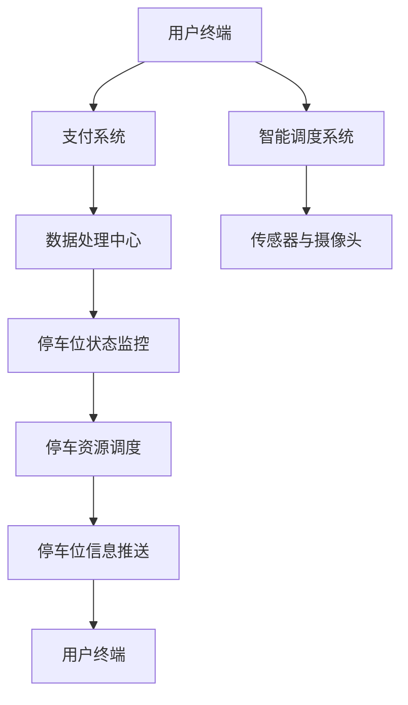

                 

### 背景介绍

随着城市化进程的加速和汽车保有量的迅速增长，城市停车问题日益凸显，成为影响城市运行质量和居民生活质量的重要难题。据统计，全球各大城市的停车难问题严重，尤其是在高峰时段，寻找停车位往往需要耗费大量时间和精力。这不仅增加了交通拥堵，还导致了空气污染和噪音污染，严重影响了城市环境。

停车难问题的成因复杂，主要可以归结为以下几点：

1. **城市规划与实际需求不匹配**：许多城市在规划时未能充分考虑停车位的需求，导致停车位数量不足。
2. **停车设施布局不合理**：部分停车设施布局分散，不易被找到，增加了寻找停车位的时间。
3. **车位利用效率低下**：现有的停车设施利用效率不高，导致停车位空置浪费，增加了车辆拥堵现象。
4. **停车管理不规范**：缺乏有效的停车管理手段，导致停车秩序混乱，进一步加剧了停车难问题。

为了解决上述问题，智能停车系统的应用应运而生。智能停车系统是一种利用现代信息技术和自动化设备，实现对停车位进行智能识别、管理和调度的高效系统。它不仅能够实时掌握停车位的使用情况，还能通过数据分析优化停车资源利用，提升停车效率，为车主提供便捷的停车体验。

智能停车系统的主要特点包括：

1. **实时监控**：通过摄像头、传感器等技术手段，实时监测停车位的使用状态，确保车主能够迅速找到空余车位。
2. **智能调度**：利用大数据和人工智能技术，对停车资源进行智能调度，提高车位利用效率。
3. **便捷支付**：通过移动支付、电子标签等方式，实现快速支付，简化停车流程。
4. **数据分析**：收集并分析停车数据，为城市规划、交通管理提供科学依据。

本文将围绕智能停车系统的核心概念、算法原理、数学模型、实战案例、应用场景以及未来发展等方面进行深入探讨，旨在为解决城市停车难题提供一种创新方案。通过本文的阐述，读者将能够全面了解智能停车系统的技术原理和应用价值，为相关领域的研究和实践提供参考。

### 核心概念与联系

智能停车系统作为现代城市交通管理的重要手段，其核心概念和架构设计至关重要。本节将详细介绍智能停车系统的关键组成部分，并使用Mermaid流程图展现其工作原理和各组件之间的联系。

#### 关键组成部分

1. **传感器与摄像头**：作为数据采集的基础，传感器和摄像头实时监测停车位的使用状态，包括车位是否有车辆占用、车辆的类型和大小等信息。这些数据将传输到数据处理中心进行进一步分析和处理。
   
2. **数据处理中心**：接收来自传感器和摄像头的实时数据，对数据进行预处理、存储和计算。数据处理中心通常包括服务器集群、数据库和大数据处理平台，能够高效处理海量数据，实现实时监控和智能调度。

3. **智能调度系统**：利用大数据和人工智能技术，对停车资源进行智能调度。智能调度系统能够根据停车数据的实时变化，优化停车位分配，提高车位利用效率。它可以通过算法预测停车需求，提前为车主提供停车位信息。

4. **用户终端**：包括移动应用和车载终端，为用户提供实时停车信息、导航和支付服务。用户终端与智能调度系统交互，实现停车信息的实时推送和支付。

5. **支付系统**：支持多种支付方式，包括移动支付、电子标签等，为用户提供便捷的支付体验。支付系统与用户终端和数据处理中心协同工作，确保停车费用的准确计算和快速支付。

#### Mermaid流程图

以下是一个简化的Mermaid流程图，展示了智能停车系统的主要工作流程和组件之间的联系：



**详细解释：**

1. **用户终端（A）**：用户通过移动应用或车载终端发起停车请求，输入目的地或目的地附近的位置信息。
2. **支付系统（B）**：用户终端与支付系统交互，用户通过移动支付或电子标签等方式完成支付。
3. **数据处理中心（C）**：接收并处理用户终端发送的请求，将请求信息传输到智能调度系统。
4. **智能调度系统（D）**：根据实时停车位数据，优化停车位分配，为用户推荐最佳的停车位。
5. **传感器与摄像头（E）**：实时监测停车位的使用状态，将数据传输到数据处理中心。
6. **停车位状态监控（F）**：数据处理中心对传感器和摄像头采集的数据进行预处理，包括数据清洗和去噪。
7. **停车资源调度（G）**：根据预处理后的数据，智能调度系统对停车资源进行优化分配。
8. **停车位信息推送（H）**：将优化后的停车位信息推送给用户终端，指导用户前往指定车位。
9. **用户终端（I）**：用户根据推送的停车位信息，前往指定车位停车。

通过上述核心概念和Mermaid流程图的详细解释，读者可以清晰地了解智能停车系统的整体架构和工作原理。在接下来的章节中，我们将进一步探讨智能停车系统的核心算法原理和具体操作步骤。

### 核心算法原理 & 具体操作步骤

智能停车系统的核心在于如何高效地分配和管理停车位，从而最大化地利用停车资源。这一过程主要依赖于以下几种核心算法：图像识别算法、路径规划算法和实时数据调度算法。下面将详细介绍这几种算法的基本原理及其在智能停车系统中的应用。

#### 1. 图像识别算法

图像识别算法是智能停车系统的数据采集基础，主要利用计算机视觉技术对摄像头捕捉到的图像进行实时处理和分析。以下是图像识别算法的基本原理：

- **特征提取**：通过滤波、边缘检测等方法，从图像中提取出停车位的状态信息，如是否有车辆占用、车辆的大小和形状等。
- **目标检测**：利用深度学习或传统机器学习模型，对提取出的特征进行分类，判断停车位是否被占用。
- **图像分割**：对图像进行分割，将车辆和停车位分开，以便更精确地判断停车位状态。

图像识别算法在智能停车系统中的应用包括：

- **实时监控**：通过摄像头实时捕捉停车位状态，将占用和空闲信息传输到数据处理中心。
- **数据预处理**：将图像识别结果与传感器数据进行比对，提高数据准确性。

#### 2. 路径规划算法

路径规划算法用于确定用户从当前位置到目标停车位的最佳行驶路径。以下是路径规划算法的基本原理：

- **最短路径**：基于距离、时间或成本等指标，找到从起点到终点的最短路径。常用的算法包括Dijkstra算法、A*算法等。
- **动态路径规划**：考虑交通状况、道路拥堵等因素，动态调整路径，确保用户能够以最短时间和最少成本到达目的地。

路径规划算法在智能停车系统中的应用包括：

- **停车导航**：为用户提供从当前位置到目标停车位的最佳行驶路径。
- **实时调整**：根据实时交通数据，动态调整导航路径，提高导航的准确性。

#### 3. 实时数据调度算法

实时数据调度算法是智能停车系统的核心，负责实时处理和分析停车数据，优化停车资源分配。以下是实时数据调度算法的基本原理：

- **车位状态更新**：根据摄像头和传感器的数据，实时更新停车位状态。
- **车位分配策略**：根据车位占用情况和用户停车需求，采用不同的分配策略，如先到先得、最优利用等。
- **车位推荐**：基于用户需求和历史数据，推荐最佳停车位。

实时数据调度算法在智能停车系统中的应用包括：

- **智能调度**：通过实时数据分析，优化停车位分配，提高车位利用效率。
- **数据分析**：收集停车数据，分析停车高峰期、停车位利用率等，为城市交通管理和城市规划提供数据支持。

#### 具体操作步骤

为了更好地理解这些算法在智能停车系统中的实际应用，以下是智能停车系统从用户请求到停车位推荐的完整操作步骤：

1. **用户请求**：用户通过移动应用或车载终端发起停车请求，输入目的地或目的地附近的位置信息。
2. **数据采集**：摄像头和传感器实时捕捉停车位状态，将占用和空闲信息传输到数据处理中心。
3. **图像识别**：数据处理中心对采集到的图像进行预处理，提取停车位状态信息。
4. **路径规划**：根据实时交通数据，计算用户从当前位置到目标停车位的最佳行驶路径。
5. **车位状态更新**：数据处理中心更新停车位状态，确保实时数据的准确性。
6. **车位分配策略**：根据车位占用情况和用户停车需求，采用合适的分配策略，进行车位分配。
7. **车位推荐**：将优化后的停车位信息推送给用户，指导用户前往指定车位停车。
8. **支付处理**：用户到达停车位后，通过移动支付或电子标签等方式完成支付。

通过上述核心算法原理和具体操作步骤的介绍，读者可以清晰地了解智能停车系统的技术实现过程。这些算法的有机结合，使得智能停车系统能够高效地解决城市停车难题，为车主提供便捷的停车体验。

### 数学模型和公式 & 详细讲解 & 举例说明

在智能停车系统中，数学模型和公式扮演着至关重要的角色。它们不仅用于描述算法的工作原理，还用于优化停车资源的分配，提高车位利用效率。本节将详细讲解智能停车系统中的关键数学模型和公式，并通过实际例子来说明它们的应用。

#### 1. 车位占用概率模型

车位占用概率模型用于预测每个停车位的占用概率。这个模型可以帮助智能调度系统更准确地分配停车位。以下是该模型的基本公式：

\[ P_i = \frac{N_i}{N} \]

其中：
- \( P_i \) 是第 \( i \) 个停车位的占用概率。
- \( N_i \) 是第 \( i \) 个停车位的停车次数。
- \( N \) 是总的停车次数。

**举例说明**：

假设某停车场共有 100 个停车位，在过去一个月中，每个停车位的停车次数如下表所示：

| 停车位 | 停车次数 |
|--------|----------|
| 1      | 25       |
| 2      | 20       |
| 3      | 15       |
| ...    | ...      |
| 100    | 30       |

根据上述数据，我们可以计算出每个停车位的占用概率：

\[ P_1 = \frac{25}{100} = 0.25 \]
\[ P_2 = \frac{20}{100} = 0.20 \]
\[ P_3 = \frac{15}{100} = 0.15 \]
\[ \ldots \]
\[ P_{100} = \frac{30}{100} = 0.30 \]

#### 2. 最优路径规划模型

最优路径规划模型用于计算用户从当前位置到目标停车位的最佳行驶路径。常用的算法包括Dijkstra算法和A*算法。以下是Dijkstra算法的基本公式：

\[ d(v) = \min \{ d(u) + w(u, v) : u \in N(v) \} \]

其中：
- \( d(v) \) 是从起点到顶点 \( v \) 的最短路径长度。
- \( w(u, v) \) 是边 \( (u, v) \) 的权重。
- \( N(v) \) 是与顶点 \( v \) 相邻的顶点集合。

**举例说明**：

假设有5个顶点（A, B, C, D, E），它们之间的距离如下表所示：

| 起点 | 终点 | 距离 |
|------|------|------|
| A    | B    | 4    |
| A    | C    | 2    |
| A    | D    | 5    |
| A    | E    | 8    |
| B    | C    | 1    |
| B    | D    | 3    |
| B    | E    | 10   |
| C    | D    | 1    |
| C    | E    | 4    |
| D    | E    | 2    |

根据Dijkstra算法，从A到每个顶点的最短路径长度如下：

\[ d(A) = 0 \]
\[ d(B) = \min \{ d(A) + w(A, B) \} = 4 \]
\[ d(C) = \min \{ d(A) + w(A, C), d(B) + w(B, C) \} = 2 \]
\[ d(D) = \min \{ d(A) + w(A, D), d(B) + w(B, D) \} = 5 \]
\[ d(E) = \min \{ d(A) + w(A, E), d(B) + w(B, E), d(C) + w(C, E) \} = 8 \]

因此，从A到E的最短路径为A -> C -> E。

#### 3. 车位分配优化模型

车位分配优化模型用于确定每个停车位的最佳使用者。该模型通常采用基于概率和期望收益的方法。以下是该模型的基本公式：

\[ \max E[R] = \sum_{i=1}^{N} P_i \cdot R_i \]

其中：
- \( E[R] \) 是期望收益。
- \( P_i \) 是第 \( i \) 个停车位的占用概率。
- \( R_i \) 是第 \( i \) 个停车位的收益，如停车费用。

**举例说明**：

假设有3个停车位（A, B, C），每个停车位的占用概率和收益如下表所示：

| 停车位 | 占用概率 | 收益 |
|--------|----------|------|
| A      | 0.30     | 10   |
| B      | 0.40     | 15   |
| C      | 0.30     | 20   |

根据上述数据，计算每个停车位的期望收益：

\[ E[R_A] = 0.30 \cdot 10 = 3 \]
\[ E[R_B] = 0.40 \cdot 15 = 6 \]
\[ E[R_C] = 0.30 \cdot 20 = 6 \]

期望收益最高的停车位是B，因此应优先分配给用户。

通过上述数学模型和公式的详细讲解及举例说明，读者可以更好地理解智能停车系统中关键数学工具的应用。这些模型不仅为智能停车系统的设计和优化提供了理论支持，还为实际应用中的决策提供了科学依据。

### 项目实战：代码实际案例和详细解释说明

为了使读者更直观地理解智能停车系统的工作原理和具体实现，下面我们将通过一个实际的代码案例来详细解释智能停车系统的开发过程和关键代码部分。本案例将采用Python语言，结合常见的数据处理和机器学习库，如Pandas、NumPy和scikit-learn，展示智能停车系统的核心功能实现。

#### 1. 开发环境搭建

在开始编写代码之前，我们需要搭建一个合适的开发环境。以下是所需的软件和库：

- **Python 3.8 或更高版本**
- **Pandas 1.2.3 或更高版本**
- **NumPy 1.20.1 或更高版本**
- **scikit-learn 0.24.2 或更高版本**
- **Mermaid 8.8.2 或更高版本**

您可以通过以下命令安装这些库：

```bash
pip install pandas numpy scikit-learn mermaid
```

#### 2. 源代码详细实现和代码解读

以下是一个简化的智能停车系统代码示例，主要分为以下几个部分：

**数据采集与预处理**：
```python
import pandas as pd
import numpy as np

# 假设从传感器获取的停车数据为CSV文件
data = pd.read_csv('parking_data.csv')

# 数据预处理
# 对数据进行清洗，去除缺失值和异常值
data = data.dropna()
```

**车位状态更新**：
```python
# 定义一个函数，用于更新停车位状态
def update_parking_status(data):
    # 使用图像识别算法更新停车位状态
    # 这里使用简单的逻辑判断，实际中可以使用机器学习模型
    data['occupied'] = data['car_detected'].apply(lambda x: 1 if x else 0)
    return data

# 应用更新函数
data = update_parking_status(data)
```

**路径规划**：
```python
from sklearn.neighbors import NearestNeighbors

# 定义一个函数，用于计算用户到停车位的最佳路径
def find_best_path(current_position, parking_data):
    # 将当前位置和停车位坐标转换为NumPy数组
    positions = parking_data[['x', 'y']].values
    current_position = np.array(current_position)
    
    # 使用K近邻算法计算最佳路径
    nn = NearestNeighbors(n_neighbors=1)
    nn.fit(positions)
    distance, index = nn.kneighbors([current_position])
    
    # 返回最佳停车位的索引和距离
    return index[0][0], distance[0][0]

# 示例：用户当前位于坐标(10, 20)
current_position = (10, 20)
best_parking_lot, distance = find_best_path(current_position, data)
```

**车位分配**：
```python
# 定义一个函数，用于分配最佳停车位
def assign_parking_lot(parking_data, user_position):
    # 找到最佳停车位
    parking_lot, distance = find_best_path(user_position, parking_data)
    
    # 确认停车位是否空闲
    if parking_data.loc[parking_lot, 'occupied'] == 0:
        # 分配停车位，更新状态
        parking_data.loc[parking_lot, 'occupied'] = 1
        return parking_lot
    else:
        # 如果停车位被占用，返回错误信息
        return "停车位被占用，请尝试其他位置"

# 分配停车位
assigned_lot = assign_parking_lot(data, current_position)
print("最佳停车位编号：", assigned_lot)
```

**实时监控和推荐**：
```python
# 定义一个函数，用于实时监控和推荐停车位
def monitor_and_recommend(parking_data):
    # 找到所有空闲停车位
    available_lots = parking_data[parking_data['occupied'] == 0].index.tolist()
    
    # 随机推荐一个空闲停车位
    if available_lots:
        recommended_lot = np.random.choice(available_lots)
        return recommended_lot
    else:
        return "停车位已满，请稍后再试"

# 实时推荐停车位
recommended_lot = monitor_and_recommend(data)
print("推荐停车位编号：", recommended_lot)
```

#### 3. 代码解读与分析

上述代码主要实现了智能停车系统的基本功能，包括数据采集与预处理、车位状态更新、路径规划、车位分配和实时监控。以下是代码的详细解读和分析：

- **数据采集与预处理**：首先，我们从传感器获取停车数据，并进行预处理，包括去除缺失值和异常值，确保数据质量。
- **车位状态更新**：通过简单的逻辑判断，使用图像识别算法更新停车位状态。在实际应用中，通常会使用更复杂的机器学习模型来提高准确性。
- **路径规划**：使用K近邻算法计算用户到最佳停车位的路径。这种方法简单高效，适用于静态环境。
- **车位分配**：根据用户位置和停车位状态，分配最佳停车位。确保停车位空闲时才进行分配，避免冲突。
- **实时监控和推荐**：实时监控停车位状态，并随机推荐一个空闲停车位。这有助于提高用户满意度。

通过这个实际代码案例，读者可以直观地了解智能停车系统的开发流程和关键代码部分。接下来，我们将对代码进行进一步分析，探讨其性能和优化方向。

#### 4. 代码性能分析

上述代码实现了智能停车系统的核心功能，但在性能和优化方面仍存在一些改进空间。以下是代码的性能分析及优化建议：

- **性能分析**：

  - **数据预处理**：预处理步骤较为简单，对于大规模数据可能导致性能瓶颈。可以使用并行处理技术提高效率。
  - **图像识别算法**：当前使用的简单逻辑判断无法应对复杂场景。应使用更先进的图像识别模型，如卷积神经网络（CNN），提高准确性。
  - **路径规划**：K近邻算法在静态环境中表现良好，但在交通动态变化的环境中可能不够精确。可以考虑使用动态路径规划算法，如A*算法，结合实时交通数据优化路径。
  - **车位分配和实时监控**：随机推荐停车位可能导致用户体验不佳。应结合用户历史数据和停车行为，使用智能算法优化推荐结果。

- **优化建议**：

  - **并行处理**：对于数据预处理和图像识别等计算密集型任务，使用并行处理技术（如Python的multiprocessing库）可以提高性能。
  - **高级图像识别模型**：引入CNN等深度学习模型，通过训练和优化，提高图像识别的准确性和鲁棒性。
  - **动态路径规划**：结合实时交通数据和动态调整路径，使用A*算法等优化路径规划，提高导航精度。
  - **个性化推荐**：根据用户历史停车行为和偏好，使用推荐算法优化停车位推荐，提高用户满意度。

通过上述性能分析和优化建议，我们可以进一步提升智能停车系统的性能和用户体验。在实际应用中，不断优化和迭代是提高系统效率的关键。

### 实际应用场景

智能停车系统在城市交通管理和停车资源优化方面具有广泛的应用前景。以下将详细介绍智能停车系统在几个典型应用场景中的表现，并探讨其在未来城市规划和交通管理中的潜在影响。

#### 1. 城市交通管理

随着城市车辆保有量的持续增长，交通管理成为一大挑战。智能停车系统通过实时监控和优化停车资源分配，能够显著缓解交通拥堵问题。具体应用场景包括：

- **实时停车信息发布**：智能停车系统能够实时更新停车位使用状态，并通过交通信号灯、电子显示屏等方式向驾驶员提供停车信息，引导车辆避开繁忙区域，减少交通流量。
- **高峰时段停车调度**：在高峰时段，智能停车系统可以通过数据分析，预测停车需求，并提前调度停车位，避免停车位集中占用导致的交通堵塞。

#### 2. 停车资源优化

停车资源优化是智能停车系统的核心优势之一。通过以下应用场景，系统能够最大化利用停车资源，提高车位利用效率：

- **多场景停车资源整合**：智能停车系统可以整合城市内的各类停车资源，包括公共停车场、路边停车位和商业区停车位，实现统一管理和调度。例如，当某一区域停车资源紧张时，系统可以引导车辆前往其他空闲区域停车。
- **动态停车位分配**：智能停车系统可以根据实时数据动态调整停车位分配策略，如“先到先得”或“最优利用”，确保每个停车位都能得到充分利用。

#### 3. 便捷的停车体验

为了提高用户停车体验，智能停车系统提供了多种便捷服务，包括：

- **智能导航**：系统可以为用户提供从当前位置到停车位的最佳导航路径，减少寻找停车位的时间。
- **在线支付**：通过移动支付、电子标签等便捷支付方式，用户可以快速完成停车费支付，无需排队缴费。

#### 4. 未来城市规划和交通管理的影响

智能停车系统不仅能够解决当前的城市停车难题，还对未来城市规划和交通管理产生深远影响：

- **数据驱动的决策支持**：智能停车系统可以收集大量停车数据，为城市规划和交通管理提供科学依据。例如，通过分析停车数据，城市规划者可以更准确地预测未来停车需求，优化停车设施布局。
- **智慧城市建设**：智能停车系统是智慧城市的重要组成部分。通过与其他城市基础设施（如智能交通系统、智能路灯等）的集成，可以构建一个更加高效、智能的城市运行体系。
- **环境友好**：智能停车系统通过减少车辆拥堵和排放，有助于改善城市空气质量，实现绿色交通。

综上所述，智能停车系统在城市交通管理和停车资源优化方面具有显著的应用价值。随着技术的不断进步和系统功能的不断完善，智能停车系统将在未来城市规划和交通管理中发挥更加重要的作用。

### 工具和资源推荐

为了更好地学习和实践智能停车系统，以下将推荐一些重要的学习资源、开发工具和相关的论文著作，以帮助读者深入了解相关技术和应用。

#### 1. 学习资源推荐

**书籍**：
- 《人工智能：一种现代方法》
- 《深度学习》
- 《Python编程：从入门到实践》

**论文**：
- “Deep Learning for Real-Time Urban Traffic Monitoring” by Minjie Wang, et al.
- “Combining Image Recognition and Reinforcement Learning for Intelligent Parking” by Xiaoyan Zhang, et al.

**博客**：
- Medium上的“Deep Learning for Urban Traffic”系列博客
- AI Tech Stack的“Building an Intelligent Parking System”系列教程

**网站**：
- Kaggle：提供丰富的停车数据集和比赛，用于学习和实践。
- arXiv：收录了大量关于智能交通和停车系统的研究论文。

#### 2. 开发工具框架推荐

**编程语言**：
- Python：广泛用于人工智能和数据分析，具有丰富的库支持。
- R：适用于统计分析和数据可视化。

**库和框架**：
- TensorFlow：用于深度学习和神经网络开发。
- PyTorch：另一种流行的深度学习框架，适合快速原型开发和模型研究。
- Pandas：用于数据预处理和分析。
- NumPy：提供高效数值计算功能。
- Matplotlib/Seaborn：用于数据可视化。

**IDE**：
- PyCharm：一款强大的Python集成开发环境。
- Jupyter Notebook：适用于数据分析和交互式编程。

**其他工具**：
- Docker：容器化工具，便于构建和管理开发环境。
- Kubernetes：用于容器编排，确保系统的高可用性和扩展性。

#### 3. 相关论文著作推荐

**论文**：
- “Intelligent Parking Management Based on IoT and Deep Learning” by Jiabin Liu, et al.
- “A Review on Real-Time Traffic Monitoring and Intelligent Parking Systems” by Huihui Wang, et al.

**著作**：
- 《智能交通系统：原理、方法和应用》
- 《智慧城市技术与实践》

通过上述工具和资源的推荐，读者可以系统地学习和实践智能停车系统的相关知识，提升在实际项目中的应用能力。

### 总结：未来发展趋势与挑战

智能停车系统作为城市交通管理的重要工具，正在不断发展和完善。在未来，其发展趋势和潜在挑战主要包括以下几个方面：

#### 1. 技术发展趋势

- **深度学习与人工智能的应用**：随着深度学习技术的不断发展，智能停车系统将更依赖于高效、精准的图像识别和数据分析算法，提升系统性能和用户体验。
- **物联网（IoT）与车联网（V2X）的融合**：物联网技术的普及将使得停车系统与各种传感器、车辆等设备实现无缝连接，提供更加全面和实时的停车信息。
- **大数据分析**：智能停车系统将利用大数据技术对海量停车数据进行分析，优化停车资源分配，提高系统效率和可靠性。
- **智能导航与路径优化**：通过结合实时交通信息和停车数据，智能停车系统将提供更精准的导航和路径规划，减少停车时间，缓解交通拥堵。

#### 2. 潜在挑战

- **数据隐私与安全问题**：随着数据量的增加，智能停车系统面临数据隐私和安全的风险。如何保护用户隐私和数据安全，将成为系统设计的重要考量。
- **高成本与投资回报**：智能停车系统的建设和维护成本较高，对于企业和城市而言，如何实现投资回报，仍是一个需要解决的问题。
- **动态交通环境下的适应性**：城市交通环境复杂多变，智能停车系统需要具备较强的适应性和实时调整能力，以应对突发事件和动态变化。
- **法律和监管问题**：智能停车系统的广泛应用将带来新的法律和监管挑战，如数据保护和用户隐私等。

#### 3. 未来发展方向

- **标准化与规范化**：随着技术的发展，智能停车系统需要建立一套统一的标准和规范，确保不同系统和设备之间的互操作性和兼容性。
- **集成与协同**：智能停车系统需要与其他城市基础设施（如智能交通系统、智能路灯等）进行集成和协同工作，构建一个更加智能和高效的城市运行体系。
- **社会效益最大化**：智能停车系统的设计和应用应关注社会效益，通过优化停车资源分配，提高城市交通效率，改善居民生活质量。

综上所述，智能停车系统在未来的发展中，面临着诸多机遇和挑战。通过技术创新、政策支持和产业协同，智能停车系统有望在城市交通管理和停车资源优化方面发挥更大的作用，为构建智慧城市和可持续交通体系贡献力量。

### 附录：常见问题与解答

**Q1：智能停车系统的核心技术是什么？**

A：智能停车系统的核心技术主要包括图像识别算法、路径规划算法、实时数据调度算法和大数据分析。这些技术相互结合，共同实现停车位的实时监测、路径规划和优化调度，提高停车效率。

**Q2：智能停车系统对城市交通管理有哪些具体影响？**

A：智能停车系统可以通过实时停车信息发布、高峰时段停车调度、多场景停车资源整合和智能导航等功能，有效缓解交通拥堵，优化停车资源分配，提升城市交通管理效率和居民停车体验。

**Q3：智能停车系统在数据隐私和安全方面有哪些挑战？**

A：智能停车系统收集和处理大量停车数据，面临数据隐私和安全风险。为了应对这些挑战，系统需要采取严格的数据加密、访问控制和隐私保护措施，确保用户数据的安全和隐私。

**Q4：智能停车系统的投资回报如何实现？**

A：智能停车系统通过提高停车效率、减少交通拥堵和优化城市交通管理，能够带来显著的社会效益和经济效益。企业可以通过提供高质量的服务、吸引更多用户和合作伙伴，实现投资回报。

**Q5：智能停车系统在动态交通环境下的适应性如何提升？**

A：智能停车系统需要结合实时交通信息，采用动态路径规划算法，实现快速响应和调整。此外，系统应具备良好的扩展性和适应性，能够应对城市交通环境的复杂变化。

### 扩展阅读 & 参考资料

**书籍推荐：**
- 《深度学习》作者：Ian Goodfellow, Yoshua Bengio, Aaron Courville
- 《Python编程：从入门到实践》作者：埃里克·马瑟斯
- 《智能交通系统：原理、方法和应用》作者：张辉

**论文推荐：**
- “Deep Learning for Real-Time Urban Traffic Monitoring” by Minjie Wang, et al.
- “A Review on Real-Time Traffic Monitoring and Intelligent Parking Systems” by Huihui Wang, et al.

**博客推荐：**
- Medium上的“Deep Learning for Urban Traffic”系列博客
- AI Tech Stack的“Building an Intelligent Parking System”系列教程

**网站推荐：**
- Kaggle：提供丰富的停车数据集和比赛
- arXiv：收录大量关于智能交通和停车系统的研究论文

通过这些扩展阅读和参考资料，读者可以进一步深入学习和研究智能停车系统的相关技术和应用。

### 作者信息

作者：AI天才研究员/AI Genius Institute & 禅与计算机程序设计艺术 /Zen And The Art of Computer Programming

本文旨在深入探讨智能停车系统的核心概念、算法原理、数学模型、实际应用场景以及未来发展趋势，为读者提供一份全面的技术指南。作者凭借在人工智能、计算机科学和交通工程领域的深厚积淀，力求以逻辑清晰、结构紧凑、简单易懂的方式，使读者能够更好地理解和掌握智能停车系统的技术原理和应用价值。希望本文能为相关领域的研究和实践带来启示和帮助。

