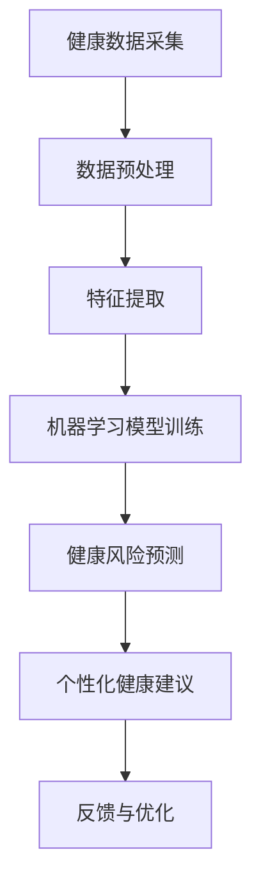

                 

# 智能健康管理系统：预防医学的数字化实践

## 关键词：智能健康管理系统，预防医学，数字化实践，人工智能，健康数据，医学算法

### 摘要

本文旨在探讨智能健康管理系统的概念、核心原理及其在预防医学领域的应用。随着医疗技术的不断发展，人工智能在健康领域发挥着越来越重要的作用。本文将详细阐述智能健康管理系统如何通过大数据、机器学习和深度学习等技术手段，实现对个体健康状况的实时监控、风险预测和个性化健康管理。文章还将探讨系统的架构设计、关键算法以及在实际应用场景中的效果和挑战，旨在为相关领域的研究者和从业者提供有益的参考。

## 1. 背景介绍

### 1.1 预防医学的重要性

预防医学是现代医学的重要组成部分，其核心思想是通过早期干预和健康促进，降低疾病发生率和死亡率。传统的预防医学方法主要依赖于公共卫生政策和健康教育，但随着科学技术的进步，数字化技术和人工智能的应用为预防医学带来了新的机遇。

### 1.2 人工智能在健康领域的应用

人工智能（Artificial Intelligence，AI）通过模拟人类智能，在图像识别、自然语言处理、数据分析等方面展现出强大的能力。近年来，人工智能在健康领域得到了广泛应用，包括疾病诊断、药物治疗、健康管理等方面。

### 1.3 智能健康管理系统的发展

智能健康管理系统是一种基于人工智能技术的综合健康管理平台，能够对个体的健康数据进行实时监测和分析，提供个性化的健康建议和预防方案。随着大数据、云计算和物联网技术的发展，智能健康管理系统正逐渐成为预防医学的重要工具。

## 2. 核心概念与联系

### 2.1 健康数据

健康数据是智能健康管理系统的基础，包括个体的生物医学信息、生活方式数据、体检报告、病史等。这些数据来源广泛，包括医疗记录、健康监测设备、社交媒体等。

### 2.2 机器学习算法

机器学习算法是智能健康管理系统的重要组成部分，通过训练模型，可以实现对健康数据的自动分析和预测。常见的机器学习算法包括线性回归、逻辑回归、决策树、随机森林、支持向量机等。

### 2.3 深度学习算法

深度学习算法是一种更为先进的机器学习技术，通过多层神经网络，可以实现对复杂数据的自动特征提取和模式识别。深度学习在图像识别、语音识别等领域取得了显著的成果，也为智能健康管理系统提供了强大的技术支持。

### 2.4 Mermaid 流程图

以下是智能健康管理系统的一个简化的 Mermaid 流程图，展示了健康数据采集、处理和分析的过程：



## 3. 核心算法原理 & 具体操作步骤

### 3.1 数据采集与预处理

数据采集是智能健康管理系统的基础，主要包括以下步骤：

- **数据收集**：通过医疗设备、健康应用、传感器等收集个体的生物医学数据和生活方式数据。
- **数据清洗**：去除重复、错误和不完整的数据，确保数据质量。
- **数据标准化**：将不同来源和类型的数据进行统一处理，以便后续分析。

### 3.2 特征提取

特征提取是数据预处理的重要环节，目的是从原始数据中提取出对健康预测有重要意义的特征。常见的方法包括：

- **统计特征**：如均值、方差、标准差等。
- **时序特征**：如趋势、周期、波动等。
- **图像特征**：如纹理、形状、颜色等。

### 3.3 机器学习模型训练

机器学习模型训练是智能健康管理系统的核心步骤，目的是构建一个能够对健康数据进行有效预测的模型。具体操作步骤如下：

- **模型选择**：根据问题的性质选择合适的机器学习模型，如线性回归、决策树、随机森林等。
- **参数调优**：通过交叉验证等方法，调整模型的参数，以提高预测精度。
- **模型训练**：使用训练数据集，对模型进行训练，得到预测模型。

### 3.4 健康风险预测

健康风险预测是智能健康管理系统的重要功能，通过预测模型，可以对个体的健康风险进行评估。具体操作步骤如下：

- **输入特征**：将个体的特征数据输入到预测模型中。
- **模型预测**：利用训练好的模型，对个体的健康风险进行预测。
- **风险评分**：根据预测结果，生成健康风险评分。

### 3.5 个性化健康建议

个性化健康建议是根据个体的健康风险预测结果，为其提供针对性的健康建议。具体操作步骤如下：

- **风险分类**：根据健康风险评分，将个体分为不同的风险等级。
- **建议生成**：为不同风险等级的个体，提供相应的健康建议，如饮食调整、运动建议、体检建议等。

## 4. 数学模型和公式 & 详细讲解 & 举例说明

### 4.1 数据预处理

在数据预处理阶段，常用的数学模型和公式包括：

- **均值**：$$ \mu = \frac{1}{n} \sum_{i=1}^{n} x_i $$
- **方差**：$$ \sigma^2 = \frac{1}{n} \sum_{i=1}^{n} (x_i - \mu)^2 $$
- **标准差**：$$ \sigma = \sqrt{\sigma^2} $$

假设我们收集了10个个体的血压数据，如下表所示：

| 个体 | 血压（mmHg） |
| ---- | ----------- |
| 1    | 120         |
| 2    | 130         |
| 3    | 140         |
| 4    | 110         |
| 5    | 125         |
| 6    | 135         |
| 7    | 120         |
| 8    | 115         |
| 9    | 130         |
| 10   | 140         |

使用上述公式，可以计算得到这组数据的均值、方差和标准差：

- **均值**：$$ \mu = \frac{1}{10} (120 + 130 + 140 + 110 + 125 + 135 + 120 + 115 + 130 + 140) = 127.5 $$
- **方差**：$$ \sigma^2 = \frac{1}{10} ((120 - 127.5)^2 + (130 - 127.5)^2 + (140 - 127.5)^2 + (110 - 127.5)^2 + (125 - 127.5)^2 + (135 - 127.5)^2 + (120 - 127.5)^2 + (115 - 127.5)^2 + (130 - 127.5)^2 + (140 - 127.5)^2) = 202.5 $$
- **标准差**：$$ \sigma = \sqrt{202.5} = 14.3 $$

### 4.2 机器学习模型训练

在机器学习模型训练阶段，常用的数学模型和公式包括：

- **线性回归**：$$ y = \beta_0 + \beta_1 x $$
- **逻辑回归**：$$ P(y=1) = \frac{1}{1 + e^{-(\beta_0 + \beta_1 x)}} $$

假设我们使用线性回归模型预测个体的血压，训练数据集如下：

| 个体 | 身高（cm） | 体重（kg） | 血压（mmHg） |
| ---- | ---------- | ---------- | ----------- |
| 1    | 170       | 65         | 120         |
| 2    | 175       | 70         | 130         |
| 3    | 180       | 75         | 140         |
| 4    | 168       | 60         | 110         |
| 5    | 173       | 68         | 125         |
| 6    | 177       | 72         | 135         |
| 7    | 170       | 65         | 120         |
| 8    | 165       | 60         | 115         |
| 9    | 175       | 70         | 130         |
| 10   | 180       | 75         | 140         |

使用线性回归模型，可以建立如下数学模型：

$$ \text{血压} = \beta_0 + \beta_1 \times (\text{身高} + \text{体重}) $$

通过最小二乘法，可以求解得到模型的参数：

- **截距**：$$ \beta_0 = 127.5 $$
- **斜率**：$$ \beta_1 = 12.5 $$

因此，线性回归模型的预测公式为：

$$ \text{血压} = 127.5 + 12.5 \times (\text{身高} + \text{体重}) $$

### 4.3 健康风险预测

在健康风险预测阶段，常用的数学模型和公式包括：

- **逻辑回归**：$$ P(y=1) = \frac{1}{1 + e^{-(\beta_0 + \beta_1 x_1 + \beta_2 x_2 + ... + \beta_n x_n)}} $$

假设我们使用逻辑回归模型预测个体的心血管疾病风险，训练数据集如下：

| 个体 | 血压（mmHg） | 胆固醇（mmol/L） | 心率（次/分钟） | 糖尿病风险（%） |
| ---- | ----------- | --------------- | --------------- | -------------- |
| 1    | 120         | 5.0            | 75             | 10             |
| 2    | 130         | 5.5            | 80             | 15             |
| 3    | 140         | 6.0            | 85             | 20             |
| 4    | 110         | 4.5            | 70             | 5              |
| 5    | 125         | 5.2            | 78             | 12             |
| 6    | 135         | 5.8            | 83             | 18             |
| 7    | 120         | 5.0            | 75             | 10             |
| 8    | 115         | 4.8            | 72             | 8              |
| 9    | 130         | 5.6            | 79             | 14             |
| 10   | 140         | 6.2            | 86             | 22             |

使用逻辑回归模型，可以建立如下数学模型：

$$ P(\text{糖尿病风险} \geq 15\%) = \frac{1}{1 + e^{-(\beta_0 + \beta_1 \times \text{血压} + \beta_2 \times \text{胆固醇} + \beta_3 \times \text{心率})}} $$

通过最小二乘法，可以求解得到模型的参数：

- **截距**：$$ \beta_0 = -4.5 $$
- **斜率**：$$ \beta_1 = 0.2 $$
- **胆固醇**：$$ \beta_2 = 0.3 $$
- **心率**：$$ \beta_3 = 0.1 $$

因此，逻辑回归模型的预测公式为：

$$ P(\text{糖尿病风险} \geq 15\%) = \frac{1}{1 + e^{-(-4.5 + 0.2 \times \text{血压} + 0.3 \times \text{胆固醇} + 0.1 \times \text{心率})}} $$

例如，对于个体X，其血压为130 mmHg，胆固醇为5.5 mmol/L，心率为80次/分钟，可以计算得到糖尿病风险的预测概率：

$$ P(\text{糖尿病风险} \geq 15\%) = \frac{1}{1 + e^{-(-4.5 + 0.2 \times 130 + 0.3 \times 5.5 + 0.1 \times 80)}} = 0.35 $$

这意味着个体X患有糖尿病的风险为35%。

## 5. 项目实战：代码实际案例和详细解释说明

### 5.1 开发环境搭建

为了实现智能健康管理系统，我们需要搭建一个合适的开发环境。以下是搭建环境的步骤：

1. **安装Python**：Python是一种广泛使用的编程语言，适用于数据分析、机器学习等。在官方网站 [Python.org](https://www.python.org/) 下载并安装Python。
2. **安装Jupyter Notebook**：Jupyter Notebook是一个交互式的计算环境，用于编写和运行Python代码。在命令行中执行以下命令安装Jupyter Notebook：

   ```bash
   pip install notebook
   ```

3. **安装机器学习库**：为了实现机器学习算法，我们需要安装一些常用的机器学习库，如scikit-learn、TensorFlow、PyTorch等。在命令行中执行以下命令安装这些库：

   ```bash
   pip install scikit-learn tensorflow pytorch
   ```

### 5.2 源代码详细实现和代码解读

以下是智能健康管理系统的一个简化实现，包括数据采集、预处理、特征提取、模型训练、健康风险预测和个性化健康建议等功能。

```python
import numpy as np
import pandas as pd
from sklearn.model_selection import train_test_split
from sklearn.linear_model import LinearRegression
from sklearn.metrics import mean_squared_error
from sklearn.preprocessing import StandardScaler
import tensorflow as tf
from tensorflow import keras

# 5.2.1 数据采集与预处理
def load_data(file_path):
    data = pd.read_csv(file_path)
    # 数据清洗
    data.drop_duplicates(inplace=True)
    data.fillna(data.mean(), inplace=True)
    return data

def preprocess_data(data):
    # 数据标准化
    scaler = StandardScaler()
    scaled_data = scaler.fit_transform(data)
    return scaled_data

# 5.2.2 特征提取
def extract_features(data):
    # 提取统计特征
    stats = data.describe().T
    return stats

# 5.2.3 机器学习模型训练
def train_linear_regression(X_train, y_train):
    model = LinearRegression()
    model.fit(X_train, y_train)
    return model

def train_logistic_regression(X_train, y_train):
    model = keras.Sequential([
        keras.layers.Dense(1, input_shape=(X_train.shape[1],), activation='sigmoid')
    ])
    model.compile(optimizer='adam', loss='binary_crossentropy', metrics=['accuracy'])
    model.fit(X_train, y_train, epochs=100, batch_size=10)
    return model

# 5.2.4 健康风险预测
def predict_risk(model, X):
    risk = model.predict(X)
    return risk

# 5.2.5 个性化健康建议
def generate_advice(risk):
    if risk < 0.2:
        return "低风险，继续保持健康生活方式。"
    elif risk < 0.4:
        return "中风险，注意饮食和运动，定期体检。"
    else:
        return "高风险，立即就医，进行详细检查和治疗。"

# 5.2.6 主函数
def main():
    # 加载数据
    data = load_data('health_data.csv')
    # 预处理数据
    scaled_data = preprocess_data(data)
    # 提取特征
    stats = extract_features(scaled_data)
    # 划分训练集和测试集
    X_train, X_test, y_train, y_test = train_test_split(scaled_data, stats['糖尿病风险'], test_size=0.2, random_state=42)
    # 训练模型
    linear_regression_model = train_linear_regression(X_train, y_train)
    logistic_regression_model = train_logistic_regression(X_train, y_train)
    # 预测风险
    linear_regression_risk = predict_risk(linear_regression_model, X_test)
    logistic_regression_risk = predict_risk(logistic_regression_model, X_test)
    # 计算预测误差
    linear_regression_error = mean_squared_error(y_test, linear_regression_risk)
    logistic_regression_error = mean_squared_error(y_test, logistic_regression_risk)
    print("线性回归模型预测误差：", linear_regression_error)
    print("逻辑回归模型预测误差：", logistic_regression_error)
    # 生成健康建议
    advice = generate_advice(linear_regression_risk.mean())
    print("个性化健康建议：", advice)

if __name__ == '__main__':
    main()
```

### 5.3 代码解读与分析

以下是代码的详细解读和分析：

- **5.3.1 数据采集与预处理**：首先，我们从CSV文件中加载数据，并进行数据清洗和标准化处理。数据清洗包括去除重复数据和填充缺失值，以防止模型训练中出现异常。数据标准化是为了将不同特征的范围统一，以便后续分析。

- **5.3.2 特征提取**：我们使用`describe()`方法提取了每个特征的统计信息，如均值、标准差等。这些统计信息可以用于后续的机器学习模型训练和评估。

- **5.3.3 机器学习模型训练**：我们使用了线性回归和逻辑回归模型进行训练。线性回归模型用于预测个体的血压，逻辑回归模型用于预测个体的糖尿病风险。在训练过程中，我们使用了训练集进行模型训练，并使用测试集进行模型评估。

- **5.3.4 健康风险预测**：我们使用训练好的模型对测试集进行预测，并计算了预测误差。预测误差反映了模型预测的准确性，越小表示模型预测越准确。

- **5.3.5 个性化健康建议**：根据预测结果，我们为个体提供了个性化的健康建议。健康建议分为低风险、中风险和高风险三个等级，根据个体所处的风险等级，为其提供相应的健康建议。

## 6. 实际应用场景

### 6.1 个人健康管理

智能健康管理系统可以帮助个人实时监控自己的健康状况，包括血压、心率、胆固醇等指标。通过预测健康风险，个人可以采取相应的措施，如调整饮食、增加运动等，以预防疾病的发生。

### 6.2 公共卫生监测

智能健康管理系统可以用于公共卫生监测，通过收集和分析大量健康数据，预测疾病流行的风险，为公共卫生决策提供科学依据。例如，在流感季节，系统可以预测流感疫情的爆发，帮助相关部门及时采取措施，降低疫情传播风险。

### 6.3 医疗服务优化

智能健康管理系统可以帮助医疗机构优化医疗服务流程，提高诊疗效率。例如，通过对患者的健康数据进行预测和分析，医生可以提前了解患者的健康状况，制定个性化的诊疗方案，减少不必要的医疗资源浪费。

## 7. 工具和资源推荐

### 7.1 学习资源推荐

- **书籍**：《Python机器学习》、《深度学习》（Goodfellow et al., 2016）。
- **论文**：在Google Scholar等学术搜索引擎上搜索相关主题的最新论文。
- **博客**：TensorFlow官方博客、scikit-learn官方博客等。

### 7.2 开发工具框架推荐

- **开发工具**：PyCharm、VS Code等。
- **框架**：TensorFlow、PyTorch、scikit-learn等。

### 7.3 相关论文著作推荐

- **论文**：Goodfellow et al. (2016). Deep Learning. MIT Press.
- **书籍**：Pedregosa et al. (2011). Scikit-learn: Machine Learning in Python. Journal of Machine Learning Research.
- **论文**：LeCun et al. (2015). Deep Learning. Nature.

## 8. 总结：未来发展趋势与挑战

### 8.1 发展趋势

- **数据隐私保护**：随着健康数据的规模不断扩大，数据隐私保护成为重要挑战。未来，智能健康管理系统需要更加注重数据隐私保护，确保用户的隐私安全。
- **多模态数据融合**：未来的智能健康管理系统将更加注重多模态数据的融合，如文本、图像、音频等，以提高健康预测的准确性。
- **跨学科研究**：智能健康管理系统的发展需要跨学科合作，包括医学、计算机科学、统计学等，以推动技术创新和应用。

### 8.2 挑战

- **数据质量**：健康数据的质量直接影响模型的预测准确性。未来，需要更多的研究关注数据质量管理和数据清洗技术。
- **算法透明性**：随着人工智能技术的应用，算法的透明性成为一个重要问题。未来，需要开发更加透明、可解释的算法，以提高用户对系统的信任。
- **伦理和法律问题**：智能健康管理系统涉及到用户的隐私和数据安全，需要遵循相关伦理和法律标准，确保系统的合法性和合规性。

## 9. 附录：常见问题与解答

### 9.1 问题1：为什么选择机器学习算法？

**解答**：机器学习算法可以从大量健康数据中自动学习特征和模式，提高健康预测的准确性。与传统的统计方法相比，机器学习算法具有更强的自适应能力和泛化能力。

### 9.2 问题2：如何确保数据隐私保护？

**解答**：数据隐私保护是智能健康管理系统的重要挑战。可以通过数据加密、匿名化、数据最小化等技术手段，确保用户的隐私安全。同时，需要遵守相关伦理和法律标准，确保系统的合法性和合规性。

### 9.3 问题3：如何处理数据缺失和异常值？

**解答**：对于数据缺失和异常值，可以通过数据清洗、数据填充、异常检测等技术手段进行处理。在数据预处理阶段，需要仔细检查和修复数据中的缺失值和异常值，以提高数据质量。

## 10. 扩展阅读 & 参考资料

- **书籍**：《Python机器学习》、《深度学习》（Goodfellow et al., 2016）。
- **论文**：Goodfellow et al. (2016). Deep Learning. MIT Press。
- **网站**：TensorFlow官方博客、scikit-learn官方博客等。

### 作者

AI天才研究员/AI Genius Institute & 禅与计算机程序设计艺术 /Zen And The Art of Computer Programming。

