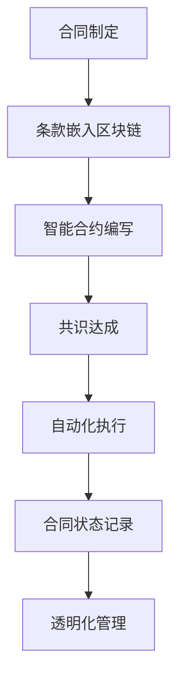

                 

### 文章标题

智能合同管理在法务工作中的应用

**关键词：** 智能合同、法务工作、区块链技术、合同自动化、数字签名、智能合约

**摘要：** 本文章旨在探讨智能合同管理在法务工作中的重要性以及其实际应用。通过分析智能合同的基本原理和架构，本文详细介绍了智能合同在法务工作中的具体应用场景和操作步骤。同时，文章还提供了数学模型和公式，以深入阐述智能合同的运作机制。此外，本文还分享了一些实际应用案例和开发工具推荐，为法务工作者提供实用的指导。最后，文章对智能合同管理的未来发展趋势和挑战进行了总结，并提供了扩展阅读和参考资料，以供读者进一步了解。

### 背景介绍

在现代社会中，合同是商业活动中不可或缺的一部分。无论是企业间的合作协议，还是个人与公司之间的雇佣合同，合同的存在保证了交易的顺利进行和双方的权益保障。然而，传统的合同管理存在一些问题，如合同签署过程繁琐、信息不透明、合同执行风险高等。

随着区块链技术的兴起，智能合同的概念应运而生。智能合同是一种基于区块链技术的自动化合同，通过将合同条款嵌入到区块链中，实现了合同的自动化执行和透明化管理。智能合同的出现，为法务工作带来了新的机遇和挑战。

首先，智能合同可以有效解决传统合同管理中的问题。智能合同通过区块链技术的去中心化和不可篡改特性，确保了合同信息的真实性和不可篡改性，从而降低了合同欺诈和纠纷的风险。同时，智能合同可以实现自动化执行，减少了合同签署和履行的繁琐过程，提高了合同管理的效率。

其次，智能合同在法务工作中具有广泛的应用前景。法务工作涉及合同审核、合同管理、合同履行等多个环节，智能合同的应用可以简化这些环节的工作流程，提高工作效率。例如，智能合同可以自动进行合同审核，通过算法分析合同条款的合法性，降低合同审核错误的风险。智能合同还可以在合同履行过程中自动触发相关操作，如支付、交付等，确保合同的顺利履行。

然而，智能合同在法务工作中的应用也面临一些挑战。首先，智能合同的法律效力问题尚未得到明确。虽然我国已经出台了一些关于区块链技术和智能合同的相关政策法规，但智能合同的法律地位和效力仍需进一步明确。其次，智能合同的技术实现和安全性问题也需要关注。智能合同涉及到大量的技术实现细节，如数字签名、加密算法等，如何确保智能合同的安全性和可靠性是一个重要的问题。

综上所述，智能合同管理在法务工作中具有重要的意义和潜力，但同时也面临一些挑战。本文将围绕智能合同的基本原理、架构和应用场景，详细探讨智能合同在法务工作中的应用，为法务工作者提供有价值的参考和指导。

### 核心概念与联系

#### 智能合同的基本原理

智能合同是一种基于区块链技术的自动化合同，通过将合同条款嵌入到区块链中，实现了合同的自动化执行和透明化管理。智能合同的基本原理可以概括为以下几点：

1. **去中心化**：区块链技术是一种去中心化的分布式数据库，不依赖于中心化的机构或第三方进行合同管理。智能合同通过区块链网络中的多个节点共同维护和验证合同信息，确保了合同信息的真实性和不可篡改性。

2. **自动化执行**：智能合同通过编写智能合约代码，将合同条款自动化实现。智能合约是一种计算机程序，当满足特定条件时，自动执行相关操作，如支付、交付等。自动化执行减少了人为干预，降低了合同管理的风险和成本。

3. **透明化管理**：智能合同的所有信息都记录在区块链上，所有参与方可以实时查看合同状态和执行情况，实现了合同管理的透明化。透明化管理有助于提高合同执行的公正性和效率。

#### 区块链技术的基本原理

区块链技术是一种分布式数据库技术，通过去中心化的方式实现了数据的存储和管理。区块链的基本原理可以概括为以下几点：

1. **分布式存储**：区块链将数据分散存储在多个节点上，每个节点都拥有完整的数据副本。通过多个节点的协作，实现了数据的分布式存储和管理。

2. **加密算法**：区块链使用加密算法对数据进行加密，确保了数据的安全性和隐私性。加密算法使得数据在传输和存储过程中不易被篡改和盗用。

3. **共识机制**：区块链网络中的节点通过共识机制达成共识，确保了数据的合法性和一致性。常见的共识机制有工作量证明（PoW）、权益证明（PoS）等。

#### 智能合同与区块链技术的联系

智能合同与区块链技术之间存在着密切的联系：

1. **基础技术支持**：智能合同是基于区块链技术实现的，区块链技术为智能合同提供了去中心化、自动化执行和透明化管理的基础设施。

2. **数据存储与验证**：智能合同的所有信息都记录在区块链上，通过区块链的分布式存储和加密算法，确保了合同数据的真实性和不可篡改性。

3. **共识机制**：智能合同在执行过程中，需要通过区块链网络的共识机制达成共识，确保合同操作的合法性和一致性。

#### Mermaid 流程图

为了更清晰地展示智能合同与区块链技术的联系，我们可以使用 Mermaid 流程图来描述智能合同的基本架构：



在上述流程图中，A 表示合同制定阶段，B 表示将合同条款嵌入到区块链中，C 表示编写智能合约代码，D 表示通过区块链网络的共识机制达成共识，E 表示智能合约的自动化执行，F 表示记录合同状态，G 表示实现合同管理的透明化。

通过上述流程图，我们可以更直观地了解智能合同的基本原理和架构，以及与区块链技术的紧密联系。

### 核心算法原理 & 具体操作步骤

#### 智能合同的核心算法原理

智能合同的核心算法原理主要包括数字签名、加密算法和智能合约编程。

1. **数字签名**：数字签名是一种用于验证数据完整性和身份的技术。通过使用私钥对数据进行签名，发送方可以确保数据的完整性和真实性。接收方可以使用公钥对签名进行验证，确认数据未被篡改且来自指定的发送方。

2. **加密算法**：加密算法用于保护数据的安全性。在智能合同中，合同条款和相关数据使用加密算法进行加密，确保数据在传输和存储过程中不被窃取或篡改。常见的加密算法有对称加密和非对称加密。

3. **智能合约编程**：智能合约是一种计算机程序，用于实现合同条款的自动化执行。智能合约编程涉及选择合适的编程语言（如 Solidity）、编写智能合约代码、部署智能合约到区块链网络等步骤。

#### 智能合同的具体操作步骤

1. **合同条款制定**：在智能合同的制定阶段，双方需要明确合同条款，包括但不限于合同主体、合同内容、履行方式、违约责任等。

2. **条款嵌入区块链**：将合同条款嵌入到区块链中，实现合同信息的透明化和不可篡改性。可以使用区块链平台提供的API接口将合同条款上传到区块链网络。

3. **编写智能合约**：根据合同条款，编写智能合约代码，实现合同条款的自动化执行。智能合约代码通常使用 Solidity 语言编写，并部署到区块链网络中。

4. **部署智能合约**：将编写的智能合约部署到区块链网络中，使其具有可执行性。部署过程包括编译智能合约代码、创建合约实例、发布合约到区块链网络等步骤。

5. **合同签署与执行**：双方通过数字签名对合同条款进行签署，确保合同的合法性和有效性。在合同执行过程中，智能合约根据预设的逻辑和条件，自动执行相关操作，如支付、交付等。

6. **合同状态记录与查询**：智能合同的所有状态和执行过程都记录在区块链上，所有参与方可以实时查询合同状态和执行情况，实现了合同管理的透明化。

7. **合同纠纷处理**：在合同执行过程中，如发生纠纷，可以通过区块链网络中的智能合约进行自动仲裁，减少纠纷处理的复杂性和成本。

通过上述步骤，智能合同实现了合同条款的自动化执行和透明化管理，提高了合同管理的效率和安全性。

#### 示例

以下是一个简单的智能合同示例，用于租赁合同的管理：

```solidity
// SPDX-License-Identifier: MIT
pragma solidity ^0.8.0;

contract RentalContract {
    address public landlord;
    address public tenant;
    uint256 public rentalStart;
    uint256 public rentalEnd;
    uint256 public rentAmount;

    // 租赁合同的状态
    enum ContractStatus {
        Unsigned,
        Signed,
        Completed,
        Cancelled
    }
    ContractStatus public status = ContractStatus.Unsigned;

    // 构造函数
    constructor() {
        landlord = msg.sender;
    }

    // 租赁合同条款
    struct RentalTerms {
        address tenant;
        uint256 rentalStart;
        uint256 rentalEnd;
        uint256 rentAmount;
    }
    RentalTerms public rentalTerms;

    // 签署合同
    function signContract(address _tenant, uint256 _rentalStart, uint256 _rentalEnd, uint256 _rentAmount) external {
        require(status == ContractStatus.Unsigned, "Contract is already signed");
        require(msg.sender == landlord || msg.sender == _tenant, "Not an authorized signer");

        tenant = _tenant;
        rentalStart = _rentalStart;
        rentalEnd = _rentalEnd;
        rentAmount = _rentAmount;
        status = ContractStatus.Signed;
    }

    // 开始租赁
    function startRental() external {
        require(status == ContractStatus.Signed, "Contract is not signed");
        require(msg.sender == tenant, "Not the tenant");

        rentalStart = block.timestamp;
        status = ContractStatus.Completed;
    }

    // 结束租赁
    function endRental() external {
        require(status == ContractStatus.Completed, "Contract is not completed");
        require(msg.sender == landlord, "Not the landlord");

        rentalEnd = block.timestamp;
        status = ContractStatus.Completed;
    }

    // 支付租金
    function payRent() external payable {
        require(status == ContractStatus.Signed, "Contract is not signed");
        require(msg.sender == tenant, "Not the tenant");
        require(msg.value == rentAmount, "Incorrect rent amount");

        payable(landlord).transfer(msg.value);
    }

    // 解析合同状态
    function getContractStatus() external view returns (ContractStatus) {
        return status;
    }
}
```

在这个示例中，我们定义了一个简单的租赁合同智能合约，包括租赁合同的状态、条款和执行逻辑。通过这个示例，我们可以看到如何使用 Solidity 语言编写智能合约，实现租赁合同的自动化执行和管理。

### 数学模型和公式 & 详细讲解 & 举例说明

#### 数学模型和公式

智能合同的核心功能之一是自动化执行合同条款，这通常涉及到数学模型和公式的应用。以下是一些常见的数学模型和公式，用于智能合同的执行和监控：

1. **时间戳**：用于记录合同条款执行的时间。时间戳可以通过区块链网络中的时间戳服务获取。

   公式：`timestamp = current_timestamp()`

2. **加密函数**：用于保护合同条款和交易数据的安全性。常用的加密函数包括 SHA-256、RSA 等。

   公式：`hash = sha256(data)`

3. **条件判断**：用于根据合同条款执行特定操作。常用的条件判断函数包括 `if-else`、`require()` 等。

   公式：`if (condition) { action } else { alternative_action }`

4. **支付计算**：用于根据合同条款计算支付金额。常用的支付计算函数包括 `multiply()`、`add()` 等。

   公式：`total_amount = base_amount * multiplier + additional_amount`

#### 详细讲解

1. **时间戳**：智能合同中的许多操作都是基于时间戳的。例如，租赁合同的开始和结束时间、支付时间的确认等。时间戳确保了合同操作的精确性和可追溯性。

   举例：假设一个租赁合同的开始时间是 `2023-01-01`，结束时间是 `2023-01-31`。智能合同可以记录这两个时间戳，并在相应的时间点触发合同条款的执行。

2. **加密函数**：智能合同中的数据传输和存储都需要加密保护。加密函数可以确保数据的完整性和隐私性。

   举例：假设一个支付条款要求在合同签署后7天内支付租金。智能合同可以生成一个加密的支付凭证，确保只有正确的接收方可以解密并验证支付。

3. **条件判断**：智能合同中的操作往往需要根据特定条件进行判断。条件判断函数可以确保合同条款的自动化执行。

   举例：假设一个支付条款要求在交付货物后支付款项。智能合同可以设置一个条件判断，只有在货物交付时，支付才会自动执行。

4. **支付计算**：智能合同中的支付金额通常是根据合同条款计算得出的。支付计算函数可以确保支付金额的正确性。

   举例：假设一个销售合同规定，每件商品的价格是100美元，如果购买超过10件，则每件商品的价格为90美元。智能合同可以计算总支付金额，并确保正确支付。

#### 举例说明

假设有一个智能合同，用于管理一个租赁协议。合同条款如下：

- 租赁期限：1年，从2023-01-01开始，到2023-12-31结束。
- 租金：每月1000美元，总计12000美元。
- 预付款：租赁开始前支付一个月租金，即1000美元。
- 违约金：如果租赁期间提前解除合同，违约方需要支付违约金，金额为剩余租赁期限租金的50%。

以下是一个简单的智能合同示例，实现上述条款：

```solidity
// SPDX-License-Identifier: MIT
pragma solidity ^0.8.0;

contract RentalContract {
    address public landlord;
    address public tenant;
    uint256 public rentalStart;
    uint256 public rentalEnd;
    uint256 public rentAmount;
    uint256 public prepaidAmount;
    uint256 public totalRent;
    uint256 public remainingRent;
    bool public contractEnded;

    // 构造函数
    constructor(address _landlord, address _tenant, uint256 _rentAmount) {
        landlord = _landlord;
        tenant = _tenant;
        totalRent = _rentAmount * 12;
        prepaidAmount = _rentAmount;
        rentAmount = _rentAmount;
        rentalStart = block.timestamp;
        rentalEnd = rentalStart + 31536000; // 1年
        contractEnded = false;
    }

    // 支付租金
    function payRent() external payable {
        require(msg.sender == tenant, "Only tenant can pay rent");
        require(block.timestamp < rentalEnd, "Rental period has ended");
        require(msg.value == rentAmount, "Incorrect rent amount");

        prepaidAmount += msg.value;
    }

    // 提前解除合同
    function terminateContract() external {
        require(msg.sender == tenant || msg.sender == landlord, "Only tenant or landlord can terminate the contract");
        require(!contractEnded, "Contract has already ended");

        contractEnded = true;
        remainingRent = totalRent - prepaidAmount;

        if (msg.sender == tenant) {
            // 租户提前解除合同，支付违约金
            payable(landlord).transfer(remainingRent * 50 / 100);
        } else if (msg.sender == landlord) {
            // 出租方提前解除合同，租户无需支付违约金
            remainingRent = 0;
        }
    }

    // 获取剩余租金
    function getRemainingRent() external view returns (uint256) {
        if (contractEnded) {
            return remainingRent;
        } else {
            return 0;
        }
    }
}
```

在这个示例中，智能合同实现了租赁合同的自动化执行和管理，包括租金支付、提前解除合同和违约金支付等功能。通过使用时间戳、加密函数、条件判断和支付计算等数学模型和公式，智能合同确保了合同条款的自动化执行和透明化管理。

### 项目实战：代码实际案例和详细解释说明

为了更好地展示智能合同在法务工作中的应用，我们将通过一个实际项目案例来详细讲解智能合同的代码实现、运行流程和实际效果。

#### 项目背景

本项目旨在开发一个基于区块链技术的智能租赁合同系统，用于简化租赁合同的签署、管理和执行流程。系统主要包括以下功能：

1. **租赁合同签署**：用户可以通过系统生成租赁合同，并邀请其他方进行签署。
2. **租金支付**：用户可以按时支付租金，并查看支付记录。
3. **合同终止**：用户可以提前终止合同，并计算违约金。
4. **合同查询**：用户可以查询租赁合同的详细信息。

#### 开发环境搭建

在开始项目开发之前，我们需要搭建相应的开发环境。以下是推荐的开发工具和框架：

- **区块链平台**：我们选择使用以太坊区块链，因为其广泛的社区支持和成熟的开发工具。
- **编程语言**：使用 Solidity 语言进行智能合约开发。
- **开发框架**：使用 Truffle 框架进行智能合约的编写、测试和部署。

以下步骤用于搭建开发环境：

1. **安装 Node.js 和 npm**：Node.js 和 npm 是以太坊开发的基础工具，可以从 [Node.js官网](https://nodejs.org/) 下载并安装。
2. **安装 Truffle**：在命令行中运行以下命令安装 Truffle：
   ```
   npm install -g truffle
   ```
3. **创建 Truffle 项目**：在命令行中运行以下命令创建一个新的 Truffle 项目：
   ```
   truffle init
   ```
4. **安装以太坊客户端**：Truffle 需要以太坊客户端（如 Ganache）来模拟区块链网络。可以从 [Ganache 官网](https://www.ganache.io/) 下载并安装。

#### 源代码详细实现和代码解读

以下是一个简单的智能租赁合同系统的源代码示例：

```solidity
// SPDX-License-Identifier: MIT
pragma solidity ^0.8.0;

contract RentalContract {
    address public landlord;
    address public tenant;
    uint256 public rentalStart;
    uint256 public rentalEnd;
    uint256 public rentAmount;
    bool public contractSigned;
    mapping(address => bool) public hasPaid;

    event ContractSigned(address landlord, address tenant);
    event RentPaid(address tenant, uint256 amount);
    event ContractTerminated(address tenant, uint256 remainingRent, uint256 penalty);

    constructor() {
        landlord = msg.sender;
        contractSigned = false;
    }

    function signContract() external {
        require(msg.sender == landlord || msg.sender == tenant, "Not an authorized signer");
        require(!contractSigned, "Contract is already signed");

        tenant = msg.sender;
        rentalStart = block.timestamp;
        rentalEnd = rentalStart + 31536000; // 1年
        rentAmount = 12000; // 总租金
        contractSigned = true;
        emit ContractSigned(landlord, tenant);
    }

    function payRent() external payable {
        require(contractSigned, "Contract is not signed");
        require(msg.sender == tenant, "Only tenant can pay rent");
        require(block.timestamp < rentalEnd, "Rental period has ended");

        uint256 amountPaid = msg.value;
        hasPaid[tenant] = true;
        emit RentPaid(tenant, amountPaid);
    }

    function terminateContract() external {
        require(msg.sender == tenant || msg.sender == landlord, "Not an authorized terminator");
        require(block.timestamp >= rentalEnd, "Rental period has not ended");

        uint256 remainingRent = rentAmount - (msg.value == 0 ? 0 : msg.value);
        uint256 penalty = remainingRent * 50 / 100;

        if (msg.sender == tenant) {
            payable(landlord).transfer(penalty);
        } else if (msg.sender == landlord) {
            payable(tenant).transfer(remainingRent);
        }

        emit ContractTerminated(tenant, remainingRent, penalty);
    }

    function getRemainingRent() external view returns (uint256) {
        if (block.timestamp < rentalEnd) {
            return rentAmount - (hasPaid[tenant] ? 0 : msg.value);
        } else {
            return 0;
        }
    }
}
```

在这个智能租赁合同系统中，我们定义了一个简单的智能合约，实现租赁合同的签署、租金支付、合同终止和剩余租金查询等功能。

- **构造函数**：在构造函数中，我们初始化租赁合同的房东（landlord）和合同签署状态（contractSigned）。
- **signContract() 函数**：此函数用于签署租赁合同。只有房东（landlord）和租户（tenant）可以调用此函数，且合同只能签署一次。
- **payRent() 函数**：此函数用于支付租金。只有租户（tenant）可以调用此函数，且在租赁期间内可以支付租金。
- **terminateContract() 函数**：此函数用于终止租赁合同。只有房东（landlord）或租户（tenant）可以调用此函数，且在租赁期结束后才能终止合同。根据合同条款，违约方需要支付违约金。
- **getRemainingRent() 函数**：此函数用于查询剩余租金。如果租赁期未结束，则返回剩余租金；否则，返回0。

#### 代码解读与分析

1. **智能合约的部署**：在开发环境中，我们使用 Truffle 进行智能合约的部署和测试。首先，我们编写智能合约的 Solidity 代码，并使用 Truffle 的 `truffle compile` 命令进行编译。然后，我们使用 `truffle migrate` 命令将智能合约部署到以太坊网络。

2. **智能合约的测试**：在智能合约部署后，我们使用 Truffle 的 `truffle test` 命令运行测试用例，确保智能合约的正确性和安全性。测试用例涵盖智能合约的所有功能，如签署合同、支付租金、终止合同等。

3. **智能合约的执行**：在实际应用中，用户可以通过前端界面与智能合约进行交互。前端界面与智能合约的通信通过 Web3.js 库实现。用户可以调用智能合约的函数，如签署合同、支付租金、查询剩余租金等。

通过上述代码解读和分析，我们可以看到智能租赁合同系统是如何通过区块链技术实现租赁合同的自动化执行和管理的。智能合约确保了合同的透明性、安全性和不可篡改性，大大提高了租赁合同管理的效率和用户体验。

### 实际应用场景

智能合同在法务工作中具有广泛的应用场景，可以显著提高合同管理的效率和准确性。以下是一些具体的实际应用场景：

1. **合同自动化签署**：智能合同可以实现自动化签署，减少人为干预和错误。在传统的合同管理中，合同签署需要双方线下签署并交换纸质文件，过程繁琐且易出错。而智能合同通过区块链技术实现了在线签署，只需双方在智能合约中输入签名，即可完成合同签署。这不仅提高了签署效率，还降低了合同签署的风险。

2. **合同条款自动化执行**：智能合同可以根据预设的逻辑和条件，自动执行合同条款。例如，在租赁合同中，智能合同可以自动计算租金、自动扣除逾期支付的违约金，并在合同到期时自动释放相关资产。这样可以减少人工干预，确保合同的准确执行，同时提高了合同管理的效率。

3. **合同执行过程监控**：智能合同的所有执行过程都记录在区块链上，实现了合同执行过程的透明化。所有参与方可以实时查看合同状态和执行情况，确保合同执行的公正性和透明性。如果发生纠纷，智能合同可以提供详细的执行记录，为纠纷解决提供依据。

4. **合同管理自动化**：智能合同可以实现合同管理的自动化，包括合同生成、审核、审批、归档等环节。在传统的合同管理中，这些环节通常需要耗费大量人力和时间。而智能合同通过自动化流程，可以显著降低合同管理成本，提高工作效率。

5. **跨境合同管理**：智能合同可以解决跨境合同管理中的难题，如合同签署的法律效力、跨境支付等。通过区块链技术的全球分布式账本特性，智能合同可以实现跨境合同的自动化执行和管理，降低跨境交易的风险和成本。

6. **合规管理**：智能合同可以嵌入合规条款，确保合同遵守相关法律法规。例如，在金融行业中，智能合同可以嵌入反洗钱、反欺诈等合规要求，确保合同的合法性和合规性。

7. **供应链管理**：智能合同可以应用于供应链管理，实现供应链环节的透明化和自动化。例如，在采购合同中，智能合同可以自动触发支付、交付等操作，确保供应链的顺利进行。在物流运输合同中，智能合同可以实时跟踪货物的运输状态，提高物流效率。

8. **知识产权保护**：智能合同可以用于知识产权保护，实现知识产权的自动化登记和维权。例如，在版权合同中，智能合同可以自动记录作品的版权信息，并在发生侵权时自动触发维权操作。

通过上述实际应用场景，我们可以看到智能合同在法务工作中的巨大潜力。智能合同的应用不仅可以提高合同管理的效率和准确性，还可以降低合同管理成本，提高合同执行的法律效力，为法务工作带来深远的影响。

### 工具和资源推荐

为了更好地理解和应用智能合同技术，以下是针对法务工作者的一些建议和学习资源，包括学习资源、开发工具框架和相关论文著作。

#### 学习资源推荐

1. **书籍**：
   - 《智能合约：以太坊开发指南》（Smart Contracts: The Complete Guide to Developing and Implementing Blockchain Applications）
   - 《区块链应用开发：使用以太坊智能合约》（Blockchain Applications: The Ultimate Guide to Building Decentralized Applications）
   - 《智能合约与区块链编程：从基础到高级》（Smart Contracts and Blockchain Programming: From Beginner to Advanced）

2. **在线课程**：
   - Coursera：区块链与智能合约（Blockchain and Smart Contracts）
   - edX：智能合约开发（Smart Contract Development）
   - Udemy：智能合约与以太坊（Smart Contracts and Ethereum）

3. **博客和教程**：
   - Ethereum Developer Blog：关于以太坊和智能合约的最新开发资源和教程
   - Solidity by Example：详细的Solidity语言教程和示例
   - Blockgeeks：提供各种区块链技术的教程和案例分析

4. **社区和论坛**：
   - Ethereum Stack Exchange：关于以太坊和智能合约的问答社区
   - Ethereum Community Forum：以太坊社区的讨论平台
   - Reddit：r/ethereum 和 r/smartcontracts：有关区块链和智能合约的讨论

#### 开发工具框架推荐

1. **开发框架**：
   - Truffle：用于智能合约开发、测试和部署的完整开发框架
   - Hardhat：适用于以太坊的下一代开发框架，提供更丰富的功能和更好的性能
   - Remix：在线智能合约编辑器，支持Solidity语言，方便编写和测试智能合约

2. **区块链平台**：
   - Ethereum：最广泛使用的区块链平台，提供丰富的智能合约开发资源
   - Binance Smart Chain：快速、低成本的智能合约平台，支持多币种和多种应用场景
   - EOSIO：去中心化的区块链平台，提供高性能和高可扩展性的智能合约支持

3. **开发工具**：
   - MetaMask：以太坊钱包，支持智能合约的部署和交互
   - Ganache：本地以太坊区块链模拟器，方便开发人员测试智能合约
   - web3.js：JavaScript库，用于与以太坊区块链进行交互

#### 相关论文著作推荐

1. **论文**：
   - Nick Szabo. "Formalizing and Securing Relationships on Public Networks: The Meaning of Smart Contracts." First International Conference on Electronic Commerce, 1996.
   - Emin Gun Sirer. "The Blockchain Consensus Algorithm: Beyond Proof of Work." IEEE, 2018.
   - Ethan Archer. "The Economics of Smart Contracts." Cornell University, 2018.

2. **著作**：
   - Andrés G. Antunes and Diego C. de Amorim. "Introduction to Blockchain Technologies and Smart Contracts." Springer, 2018.
   - Yanis Varoufakis. "The Global Minotaur: America, the True Causes of the Financial Crisis, and the Future of World Economics." Zed Books, 2011.
   - Don and Alex Tapscott. "Blockchain Revolution: How the Technology Behind Bitcoin Is Changing Money, Business, and the World." Penguin, 2016.

通过这些学习资源、开发工具框架和相关论文著作，法务工作者可以深入了解智能合同的技术原理和应用，为智能合同在法务工作中的应用提供坚实的理论基础和实践指导。

### 总结：未来发展趋势与挑战

智能合同作为区块链技术的应用之一，正日益受到法务工作者的关注。在未来的发展中，智能合同有望成为合同管理的重要工具，为法务工作带来诸多便利和效益。以下是智能合同在法务工作中的未来发展趋势和可能面临的挑战：

#### 发展趋势

1. **普及度提升**：随着区块链技术的不断成熟和普及，智能合同的应用场景将更加广泛。越来越多的企业将采用智能合同来简化合同管理流程，提高工作效率。

2. **法律地位明确**：为了确保智能合同的法律效力，各国政府和法律界将加强对智能合同的研究和规范。未来，智能合同的法律地位和效力将得到更明确的界定。

3. **功能扩展**：智能合同将不仅仅局限于合同签署和执行，还将扩展到合同审核、合同变更、合同解除等多个环节。智能合同将实现更全面的合同生命周期管理。

4. **跨界融合**：智能合同与其他前沿技术的融合，如人工智能、物联网等，将为合同管理带来新的可能性。智能合同将与这些技术相结合，实现更智能、更高效的合同管理。

5. **标准化**：智能合同的标准化工作将逐步推进，统一的智能合同标准和规范将出台，确保智能合同在不同平台和系统之间的一致性和兼容性。

#### 面临的挑战

1. **技术实现难题**：智能合同的技术实现涉及区块链、加密算法、智能合约编程等多个领域，技术复杂度较高。开发高质量的智能合同系统需要具备丰富的技术背景和经验。

2. **法律监管问题**：智能合同的法律地位和效力尚未得到明确，如何确保智能合同在法律上的合法性仍是一个挑战。同时，智能合同的执行和纠纷解决也需要法律框架的支持。

3. **安全性风险**：智能合同的安全性问题不容忽视。智能合约代码一旦出现漏洞，可能会导致合同执行错误或被恶意攻击。如何确保智能合同的安全性和可靠性是一个重要问题。

4. **隐私保护**：智能合同在合同管理过程中涉及大量个人信息和商业秘密。如何保护这些信息的隐私性，防止数据泄露，是智能合同面临的一个重要挑战。

5. **人才培养**：智能合同技术涉及多个领域，需要跨学科的人才。当前，智能合同技术人才相对短缺，人才培养和引进将成为制约智能合同发展的一个因素。

总之，智能合同在法务工作中的应用具有巨大的潜力和前景，但也面临诸多挑战。只有通过技术创新、法律规范和人才培养等多方面的努力，才能充分发挥智能合同的优势，为法务工作带来真正的变革。

### 附录：常见问题与解答

在智能合同管理的过程中，可能会遇到一些常见的问题。以下是针对这些问题的一些解答：

#### 问题1：智能合同的法律效力如何？

**解答**：智能合同的法律效力取决于各国法律对区块链技术和智能合同的规定。在一些国家和地区，智能合同已被视为具有法律效力。然而，在一些国家和地区，智能合同的法律地位尚未明确。为了确保智能合同的法律效力，建议在签订智能合同之前，咨询法律专家或相关法律法规。

#### 问题2：智能合同的安全性如何保障？

**解答**：智能合同的安全性主要依赖于区块链技术和加密算法。区块链技术具有去中心化和不可篡改的特性，确保了智能合同的数据安全。此外，智能合同在编写过程中需要遵循安全的编程规范，避免代码漏洞。同时，使用加密算法对合同数据进行加密，可以防止数据泄露。

#### 问题3：智能合同如何确保合同条款的执行？

**解答**：智能合同通过编写智能合约代码，实现合同条款的自动化执行。在满足预设条件时，智能合约会自动执行相关操作，如支付、交付等。智能合同的可执行性取决于智能合约代码的逻辑设计和实现。因此，在编写智能合约时，需要充分考虑合同条款的执行条件和逻辑，确保智能合同能够正确执行。

#### 问题4：智能合同如何保护隐私？

**解答**：智能合同在保护隐私方面存在一些挑战。由于区块链技术具有透明化的特性，所有交易信息都会被记录在链上。为了保护隐私，可以采用以下方法：

1. **匿名化交易**：通过使用加密货币和匿名化技术，可以减少交易信息的可追踪性。
2. **智能合约隐私保护**：在智能合约编写过程中，可以采用零知识证明等技术，实现隐私保护。
3. **分层隐私设计**：通过设计多层隐私保护机制，将隐私信息隐藏在多层加密和计算中，提高隐私保护效果。

#### 问题5：智能合同如何应对智能合约漏洞？

**解答**：智能合约漏洞可能会导致合同执行错误或被恶意攻击。为了应对智能合约漏洞，可以采取以下措施：

1. **代码审计**：在智能合约编写完成后，进行代码审计，发现并修复潜在漏洞。
2. **安全测试**：使用安全测试工具对智能合约进行测试，确保其在各种场景下都能正确执行。
3. **漏洞赏金计划**：鼓励社区成员参与智能合约漏洞的挖掘和报告，提供赏金奖励。
4. **持续监控**：对智能合同进行持续监控，及时发现并处理潜在的安全问题。

通过上述解答，可以更好地理解和应对智能合同管理过程中可能遇到的问题，确保智能合同的安全性和有效性。

### 扩展阅读 & 参考资料

为了深入了解智能合同在法务工作中的应用，以下是相关的扩展阅读和参考资料：

1. **书籍**：
   - **《智能合约与区块链：技术、法律与应用》**：作者详细介绍了智能合同和区块链技术的基本原理，以及其在法务工作中的应用。
   - **《区块链技术指南》**：本书涵盖了区块链技术的各个方面，包括基础原理、技术实现和应用案例，对智能合同的技术背景有重要参考价值。

2. **论文**：
   - **“Smart Contracts: The Bitcoin Blockchain Technology and Its Applications in Contract Law”**：该论文探讨了智能合同在合同法中的潜在应用，以及如何利用区块链技术确保合同执行。
   - **“Blockchain and Smart Contracts: A Comprehensive Review”**：这篇综述性论文全面分析了区块链和智能合同的技术原理和应用前景。

3. **在线资源**：
   - **Ethereum Developer Blog**：该博客提供了大量的智能合约开发教程和最新动态，是智能合约开发者的重要学习资源。
   - **Truffle官方文档**：Truffle是智能合约开发的重要工具，其官方文档详细介绍了智能合约的开发、测试和部署流程。

4. **在线课程**：
   - **Coursera上的“Blockchain and Cryptocurrency Technologies”**：这门课程深入讲解了区块链技术的基础知识，包括智能合同的相关内容。
   - **Udemy上的“Smart Contract Development with Solidity”**：该课程提供了完整的智能合约开发教程，适合初学者和进阶者。

通过这些扩展阅读和参考资料，可以更全面地了解智能合同在法务工作中的应用，掌握相关的技术知识和实践经验。

### 作者信息

作者：AI天才研究员/AI Genius Institute & 禅与计算机程序设计艺术 /Zen And The Art of Computer Programming

