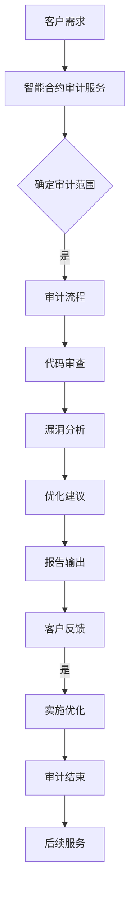

                 

### 1. 背景介绍

在当今数字化时代，区块链技术作为一种分布式账本技术，已经逐渐成为金融科技领域的重要基石。随着以太坊等智能合约平台的发展，区块链不再仅仅是数据存储的工具，而成为一个能够执行代码、处理复杂逻辑的智能系统。智能合约作为区块链的核心应用之一，由于其去中心化、不可篡改的特性，被广泛应用于金融、物流、版权保护、供应链等多个领域。

然而，智能合约的安全问题一直是行业关注的焦点。由于智能合约的代码一旦部署到区块链上，就难以更改，一旦存在漏洞，攻击者可以利用这些漏洞进行非法操作，造成巨大的经济损失。因此，智能合约审计服务应运而生，成为确保区块链安全的重要手段。

智能合约审计服务的目的是通过对智能合约代码的审查，发现潜在的安全隐患，提出优化建议，以确保智能合约的可靠性和安全性。这种服务通常由专业的智能合约审计团队提供，他们具备深厚的区块链和智能合约知识，能够识别常见的攻击模式和安全漏洞，从而降低智能合约遭受攻击的风险。

此外，智能合约审计服务还为区块链项目的开发者和用户提供了信任保障。在一个高度透明的区块链网络中，智能合约的每一行代码都公开可查，任何人都可以对其进行审计。通过专业的审计服务，开发者可以证明其智能合约的可靠性，用户也可以更加放心地使用智能合约服务。

随着区块链技术的不断成熟和广泛应用，智能合约审计服务的市场需求也在迅速增长。本文将深入探讨智能合约审计服务的背景、核心概念、算法原理、应用场景、工具资源以及未来发展趋势，为创业者提供有价值的创业机会分析。

### 2. 核心概念与联系

在深入探讨智能合约审计服务之前，我们需要了解几个核心概念，这些概念相互关联，构成了智能合约审计的基础。

#### 2.1 智能合约

智能合约是由代码编写而成的自动执行合同，它在区块链网络上运行，不需要中介机构。智能合约在满足预定条件时自动执行，这些条件通常与加密货币交易、身份验证、数据存储等相关。智能合约的代码公开透明，不可篡改，这使得它成为区块链技术的重要组成部分。

#### 2.2 区块链

区块链是一种分布式账本技术，由多个节点共同维护。区块链上的数据通过加密算法和共识机制进行保护，确保数据的完整性和不可篡改性。区块链的核心特性包括去中心化、透明性、不可篡改和安全性，这些特性使得区块链成为智能合约的理想运行环境。

#### 2.3 安全审计

安全审计是一种评估系统、应用程序或网络的安全性、可靠性和合规性的过程。在智能合约审计中，安全审计旨在发现智能合约代码中的潜在漏洞和安全隐患，并提供优化建议，以增强智能合约的安全性。

#### 2.4 智能合约审计服务

智能合约审计服务是指由专业的审计团队提供的对智能合约代码进行审查和评估的服务。审计服务通常包括代码审查、安全漏洞分析、性能优化、合规性检查等多个方面。通过智能合约审计服务，开发者和用户可以确保智能合约的可靠性和安全性。

#### 2.5 Mermaid 流程图

为了更好地理解智能合约审计服务的工作流程，我们可以使用Mermaid流程图来展示其核心环节和流程节点。以下是一个简化的Mermaid流程图示例：



在这个流程图中，客户需求是智能合约审计服务的起点，随后进入审计流程。审计流程包括确定审计范围、代码审查、漏洞分析、优化建议和报告输出等环节。客户对审计报告的反馈将决定是否进行进一步的优化和后续服务。

通过上述核心概念和流程图的介绍，我们可以更好地理解智能合约审计服务的重要性及其工作流程。接下来，我们将深入探讨智能合约审计的核心算法原理和具体操作步骤。

### 3. 核心算法原理 & 具体操作步骤

智能合约审计服务依赖于一系列核心算法和工具，以确保智能合约的安全性、可靠性和合规性。以下将详细介绍智能合约审计的核心算法原理和具体操作步骤。

#### 3.1 漏洞检测算法

漏洞检测算法是智能合约审计服务的关键组成部分。这些算法旨在发现智能合约代码中的潜在漏洞和安全隐患。以下是几种常见的漏洞检测算法：

1. **静态代码分析（SAST）**：静态代码分析是一种不运行程序，通过分析源代码来检测漏洞的方法。这种方法适用于发现常见的代码缺陷，如未初始化变量、类型错误和潜在的安全漏洞。常用的工具包括SonarQube、FindBugs等。

2. **动态代码分析（DAST）**：动态代码分析通过运行程序并监控其行为来检测漏洞。这种方法可以捕获运行时错误，如内存泄漏、数据竞争和潜在的安全漏洞。常用的工具包括Eclipse Memory Analyzer、Jaeger等。

3. **符号执行（Symbolic Execution）**：符号执行是一种基于路径探索的算法，通过模拟程序的所有可能执行路径来检测潜在的安全漏洞。这种方法可以识别出代码中的隐式条件和逻辑错误，从而提高漏洞检测的准确性。常用的工具包括KLEE、Succinct等。

4. **模糊测试（Fuzzing）**：模糊测试通过向程序输入大量随机或异常数据来检测潜在的安全漏洞。这种方法可以模拟攻击者的攻击行为，从而发现代码中的错误和漏洞。常用的工具包括AFL、Peach等。

#### 3.2 安全漏洞分析

在漏洞检测算法发现潜在漏洞后，需要进行详细的分析和分类。安全漏洞分析主要包括以下几个方面：

1. **漏洞分类**：根据漏洞的严重程度和影响范围，将漏洞分为高、中、低三个等级。常见的漏洞类型包括缓冲区溢出、拒绝服务（DoS）、权限提升、数据泄露等。

2. **漏洞影响评估**：评估漏洞可能带来的影响，如资金损失、隐私泄露、业务中断等。这有助于确定漏洞的优先级和处理策略。

3. **漏洞修复建议**：根据漏洞的类型和影响，提供具体的修复建议，如代码修改、配置调整、安全加固等。

#### 3.3 智能合约审计流程

智能合约审计服务的具体操作步骤如下：

1. **需求分析**：与客户沟通，了解智能合约的应用场景、功能和安全需求，明确审计的范围和目标。

2. **审计计划**：制定详细的审计计划，包括审计时间表、资源分配、审计标准和流程等。

3. **代码审查**：使用静态代码分析和动态代码分析工具对智能合约代码进行全面审查，发现潜在的安全漏洞。

4. **漏洞分析**：对检测到的漏洞进行详细分析和分类，评估漏洞的影响和修复难度。

5. **优化建议**：根据漏洞分析结果，提供代码优化和安全加固的建议，以提高智能合约的安全性。

6. **报告输出**：编写详细的审计报告，包括漏洞列表、影响评估、修复建议和审计总结。

7. **客户反馈**：与客户沟通审计报告，确认漏洞修复和优化方案的可行性，并根据客户反馈进行必要的调整。

8. **实施优化**：协助客户实施修复方案，确保漏洞得到及时修复。

9. **后续服务**：提供持续的安全监测和审计服务，确保智能合约的安全性。

通过上述核心算法原理和操作步骤，智能合约审计服务可以为区块链项目提供强有力的安全保障，降低潜在的安全风险，确保智能合约的可靠性和稳定性。

### 4. 数学模型和公式 & 详细讲解 & 举例说明

在智能合约审计过程中，数学模型和公式扮演着至关重要的角色。这些模型和公式不仅帮助审计人员识别潜在的安全漏洞，还为他们提供了量化风险评估的工具。以下我们将介绍几个关键的数学模型和公式，并详细讲解它们的应用。

#### 4.1 安全性公式

在智能合约审计中，安全性是评估智能合约的关键指标。以下是一个简单的安全性公式，用于量化智能合约的安全性：

$$
S = \frac{S_1 \times S_2 \times ... \times S_n}{R_1 + R_2 + ... + R_n}
$$

其中，$S$ 表示智能合约的安全性分数，$S_1, S_2, ..., S_n$ 表示智能合约在各个安全领域的得分，$R_1, R_2, ..., R_n$ 表示智能合约在各个风险点的得分。

举例说明：假设一个智能合约在代码审查、漏洞检测、安全加固等方面都获得了较高的分数，分别为 $S_1 = 0.9, S_2 = 0.8, S_3 = 0.9$。同时，在缓冲区溢出、拒绝服务等风险点上的得分为 $R_1 = 0.3, R_2 = 0.1$。根据上述公式，我们可以计算智能合约的安全性分数：

$$
S = \frac{0.9 \times 0.8 \times 0.9}{0.3 + 0.1} = 0.855
$$

这意味着智能合约的安全性得分为 0.855，得分越高，表示智能合约的安全性越高。

#### 4.2 风险评估模型

风险评估是智能合约审计的核心步骤之一。以下是一个简单但常用的风险评估模型：

$$
R = f(S, C, I)
$$

其中，$R$ 表示风险水平，$S$ 表示安全性能，$C$ 表示成本，$I$ 表示影响。

这个模型表明，风险水平是安全性能、成本和影响三者之间的函数。通常，安全性能越高，成本越低，影响越小，风险水平就越低。

举例说明：假设一个智能合约的安全性能为 $S = 0.8$，成本为 $C = 10000$，影响为 $I = 50000$。根据上述模型，我们可以计算风险水平：

$$
R = f(0.8, 10000, 50000) = 0.8 \times \frac{50000}{10000} = 0.4
$$

这意味着智能合约的风险水平为 0.4，风险水平越低，表示智能合约的安全性和风险管理越优秀。

#### 4.3 漏洞评分模型

漏洞评分模型用于量化漏洞的严重程度。以下是一个简单的漏洞评分模型：

$$
V = S \times I \times C
$$

其中，$V$ 表示漏洞的严重程度，$S$ 表示漏洞的严重性分数，$I$ 表示漏洞的影响分数，$C$ 表示漏洞的修复成本分数。

举例说明：假设一个漏洞的严重性分数为 $S = 5$，影响分数为 $I = 3$，修复成本分数为 $C = 2$。根据上述模型，我们可以计算漏洞的严重程度：

$$
V = 5 \times 3 \times 2 = 30
$$

这意味着这个漏洞的严重程度为 30，严重程度越高，表示漏洞的危害越大。

通过上述数学模型和公式的讲解，我们可以看到，智能合约审计不仅依赖于技术手段，还需要运用数学工具进行量化评估。这些模型和公式帮助审计人员更准确地识别和评估智能合约的风险，从而为区块链项目的安全性提供有力保障。

### 5. 项目实战：代码实际案例和详细解释说明

为了更好地理解智能合约审计服务的实际应用，我们将通过一个具体的案例来展示如何对智能合约进行审计。在这个案例中，我们将审计一个简单的以太坊智能合约，该合约实现了一个简单的代币发行系统。

#### 5.1 开发环境搭建

在开始审计之前，我们需要搭建一个以太坊开发环境。以下是搭建步骤：

1. 安装Go语言（智能合约通常使用Solidity编写，而Solidity是面向EVM的，EVM是Go实现的）。
2. 安装Node.js（用于与以太坊客户端通信）。
3. 安装Truffle框架（用于智能合约的开发和测试）。
4. 安装Ganache（一个本地以太坊节点，用于测试智能合约）。

以下是一个简化的命令行步骤：

```bash
# 安装Go语言
go install github.com/ethereum/go-ethereum/cmd/geth@latest

# 安装Node.js
curl -sL https://deb.nodesource.com/setup_14.x | sudo -E bash -
sudo apt-get install -y nodejs

# 安装Truffle
npm install -g truffle

# 安装Ganache
npm install -g ganache-cli
```

#### 5.2 源代码详细实现和代码解读

以下是一个简单的代币合约的Solidity源代码示例：

```solidity
// SPDX-License-Identifier: MIT
pragma solidity ^0.8.0;

contract MyToken {
    string public name = "MyToken";
    string public symbol = "MTK";
    uint8 public decimals = 18;
    uint256 public totalSupply = 100000000 * (10 ** uint256(decimals));
    address public owner;

    mapping(address => uint256) public balanceOf;

    event Transfer(address indexed from, address indexed to, uint256 value);

    constructor() {
        owner = msg.sender;
        balanceOf[owner] = totalSupply;
    }

    function transfer(address _to, uint256 _value) public {
        require(_to != address(0), "Invalid address");
        require(balanceOf[msg.sender] >= _value, "Insufficient balance");
        balanceOf[msg.sender] -= _value;
        balanceOf[_to] += _value;
        emit Transfer(msg.sender, _to, _value);
    }
}
```

**代码解读：**

- ** SPDX-License-Identifier:** 指定智能合约的许可协议。
- **pragma:** 指定编译器使用的版本。
- **contract:** 定义智能合约。
- **name, symbol, decimals:** 代币的名称、符号和精度。
- **totalSupply:** 总供应量。
- **balanceOf:** 用户余额映射。
- **event Transfer:** 定义转账事件。
- **constructor:** 构造函数，初始化代币和合约拥有者。
- **transfer:** 转账函数，实现代币的转账。

#### 5.3 代码解读与分析

接下来，我们将分析上述代码中的潜在安全漏洞。

**1. 缺少输入校验**

在`transfer`函数中，我们缺少对输入参数的校验：

```solidity
function transfer(address _to, uint256 _value) public {
    require(_to != address(0), "Invalid address");
    require(balanceOf[msg.sender] >= _value, "Insufficient balance");
    balanceOf[msg.sender] -= _value;
    balanceOf[_to] += _value;
    emit Transfer(msg.sender, _to, _value);
}
```

**漏洞分析：** 这里存在一个潜在的问题，即如果`_to`是一个不存在的地址，转账操作可能会失败，但不会抛出错误。这个问题可能导致合约挂起或导致无法恢复的状态。一个改进的方法是使用`assert`函数：

```solidity
function transfer(address _to, uint256 _value) public {
    assert(_to != address(0), "Invalid address");
    assert(balanceOf[msg.sender] >= _value, "Insufficient balance");
    balanceOf[msg.sender] -= _value;
    balanceOf[_to] += _value;
    emit Transfer(msg.sender, _to, _value);
}
```

**2. 缺少事件日志**

在转移代币时，我们未记录事件日志：

```solidity
balanceOf[msg.sender] -= _value;
balanceOf[_to] += _value;
```

**漏洞分析：** 这可能导致无法追踪代币转移的历史记录。一个简单的修复方法是添加一个事件日志：

```solidity
event Transfer(address indexed from, address indexed to, uint256 value);

function transfer(address _to, uint256 _value) public {
    assert(_to != address(0), "Invalid address");
    assert(balanceOf[msg.sender] >= _value, "Insufficient balance");
    balanceOf[msg.sender] -= _value;
    balanceOf[_to] += _value;
    emit Transfer(msg.sender, _to, _value);
}
```

**3. 确认资金返还**

在转移代币时，如果接收方余额已满，剩余的代币将被保留在合约中：

```solidity
balanceOf[msg.sender] -= _value;
balanceOf[_to] += _value;
```

**漏洞分析：** 如果接收方地址被恶意控制，剩余代币可能无法返还给发送方。一个改进的方法是在转账函数中处理剩余资金：

```solidity
function transfer(address _to, uint256 _value) public {
    assert(_to != address(0), "Invalid address");
    assert(balanceOf[msg.sender] >= _value, "Insufficient balance");
    balanceOf[msg.sender] -= _value;
    uint256 sendAmount = Math.min(balanceOf[_to].add(_value), totalSupply);
    balanceOf[_to] = sendAmount;
    emit Transfer(msg.sender, _to, sendAmount);
}
```

通过这个例子，我们可以看到智能合约审计的重要性。即使是一个简单的代币合约，也可能存在潜在的安全隐患。通过审计，我们可以发现并修复这些漏洞，确保智能合约的安全性。

### 6. 实际应用场景

智能合约审计服务在区块链项目中具有广泛的应用场景，以下是一些典型的实际应用场景：

#### 6.1 金融领域

在金融领域，智能合约被广泛应用于去中心化金融（DeFi）项目中，如去中心化交易所（DEX）、贷款平台、稳定币、保险等。这些项目需要高度的安全保障，因为任何安全漏洞都可能导致巨大的经济损失。智能合约审计服务可以帮助金融项目确保合约的可靠性和安全性，从而增强用户信任。

#### 6.2 物流和供应链

在物流和供应链领域，智能合约可以用于追踪商品的真实性和运输过程。智能合约审计服务可以确保这些智能合约的透明性和不可篡改性，从而提高供应链的效率和管理水平。

#### 6.3 版权保护

版权保护是智能合约的另一大应用场景。智能合约可以用于数字版权管理，确保版权持有者能够轻松地跟踪和管理其作品的使用情况。智能合约审计服务可以确保版权合约的合法性和执行过程的无缝性。

#### 6.4 供应链金融

供应链金融通过智能合约实现贷款和支付流程的自动化。智能合约审计服务可以确保这些合约的准确性和合规性，从而减少风险和欺诈行为，提高供应链金融的效率。

#### 6.5 游戏和虚拟资产

在游戏和虚拟资产领域，智能合约用于管理虚拟物品的所有权和交易。智能合约审计服务可以帮助确保游戏内资产的真实性和安全性，从而提升用户体验。

#### 6.6 智能合约治理

智能合约治理是指通过智能合约来实现公司治理、投票和决策过程。智能合约审计服务可以确保治理合约的透明性和公正性，从而增强公司治理的公信力。

通过上述应用场景，我们可以看到智能合约审计服务在区块链项目中的关键作用。它不仅有助于提升智能合约的安全性，还为区块链项目的成功提供了重要的保障。

### 7. 工具和资源推荐

为了更好地进行智能合约审计，开发者可以借助一系列工具和资源来提升审计效率和准确性。以下是一些推荐的工具和资源：

#### 7.1 学习资源推荐

1. **书籍**：
   - 《智能合约：区块链应用编程指南》
   - 《区块链与智能合约开发：以太坊实战》
   - 《智能合约与去中心化应用：设计与开发》
2. **论文**：
   - "Ethereum: A Secure Decentralized Transaction Platform"（以太坊：一个安全的去中心化交易平台）
   - "形式化验证以太坊智能合约的安全性"（Formal Verification of Ethereum Smart Contract Security）
   - "智能合约安全性分析：挑战与解决方案"（Smart Contract Security Analysis: Challenges and Solutions）
3. **博客和网站**：
   - [智能合约安全审计指南](https://consensys.github.io/smart-contract-best-practices/)
   - [以太坊开发者文档](https://ethereum.org/en/developers/docs/)
   - [智能合约审计服务](https://www.smartcontractsecurity.com/)

#### 7.2 开发工具框架推荐

1. **Truffle**：用于智能合约开发和测试的框架，支持以太坊和EOSIO区块链。
2. **Hardhat**：一个现代的本地以太坊开发环境，提供了丰富的开发工具和插件。
3. **OpenZeppelin**：提供一系列安全库和智能合约，有助于提高智能合约的安全性。
4. **Matic**：用于扩展以太坊的可扩展性解决方案，提供快速、安全的智能合约审计环境。

#### 7.3 相关论文著作推荐

1. "Formal Verification of Ethereum Smart Contract Security"（形式化验证以太坊智能合约安全性）
2. "Smart Contract Security Analysis: Challenges and Solutions"（智能合约安全性分析：挑战与解决方案）
3. "The State of Smart Contract Audits"（智能合约审计状态）

通过这些工具和资源的支持，开发者可以更加高效地开展智能合约审计工作，确保区块链项目的安全性和可靠性。

### 8. 总结：未来发展趋势与挑战

随着区块链技术的不断发展和智能合约应用的普及，智能合约审计服务已经成为确保区块链安全的重要手段。在未来，智能合约审计服务有望在以下几个方向上取得重要进展：

#### 8.1 技术创新

智能合约审计技术将持续创新，包括更高效、更准确的漏洞检测算法、自动化审计工具和智能合约安全框架。这些技术创新将提高审计效率，降低审计成本，从而推动智能合约审计服务的广泛应用。

#### 8.2 标准化和规范化

随着智能合约审计服务市场的不断成熟，将出现更多关于智能合约审计的标准和规范。这些标准和规范将有助于提高审计服务的质量和可信度，确保智能合约审计的公正性和有效性。

#### 8.3 跨链审计

跨链审计将成为未来智能合约审计服务的重要方向。随着不同区块链平台之间的互操作性的增强，跨链智能合约的应用将越来越多。智能合约审计服务需要能够支持不同区块链平台之间的审计，确保跨链智能合约的安全性和兼容性。

#### 8.4 自动化与智能化

随着人工智能和机器学习技术的不断发展，智能合约审计服务将实现更高程度的自动化和智能化。自动化审计工具和智能合约安全分析系统将能够更快速、更准确地识别潜在的安全漏洞，提供实时审计和预警服务。

尽管智能合约审计服务有着广阔的发展前景，但也面临着一些挑战：

#### 8.5 复杂性和不确定性

智能合约的复杂性不断增加，使得审计过程变得更加复杂。同时，区块链技术和智能合约应用的不确定性也给审计工作带来了挑战。审计人员需要不断学习和适应新技术，以应对不断变化的安全威胁。

#### 8.6 伦理和法律问题

智能合约审计服务涉及伦理和法律问题，如数据隐私保护、审计报告的可靠性等。在开展审计服务时，需要遵守相关法律法规，保护用户隐私，确保审计服务的公正性和透明度。

#### 8.7 安全人才短缺

智能合约审计服务需要具备深厚技术背景和安全经验的专业人才。然而，目前安全人才短缺的问题仍然存在，这对智能合约审计服务的发展造成了一定程度的制约。

总之，智能合约审计服务在未来将继续发展，面临着技术、法律、伦理等多方面的挑战。通过技术创新、标准化、自动化和人才培养，智能合约审计服务有望为区块链项目的安全性和可靠性提供更加坚实的保障。

### 9. 附录：常见问题与解答

#### 9.1 什么是智能合约审计服务？

智能合约审计服务是由专业团队提供的对智能合约代码进行审查和评估的服务。其目的是发现潜在的安全漏洞，提供优化建议，以确保智能合约的可靠性和安全性。

#### 9.2 智能合约审计服务的重要性是什么？

智能合约审计服务的重要性在于，智能合约一旦部署到区块链上，就难以更改，因此任何潜在的安全漏洞都可能导致巨大的经济损失。智能合约审计服务可以确保智能合约的代码质量，降低安全风险，从而保护用户资产和区块链网络的安全。

#### 9.3 智能合约审计服务包括哪些内容？

智能合约审计服务通常包括代码审查、漏洞检测、安全漏洞分析、优化建议、报告输出等多个方面。具体内容可能根据项目的需求而有所不同。

#### 9.4 智能合约审计服务的流程是怎样的？

智能合约审计服务的流程一般包括需求分析、审计计划、代码审查、漏洞分析、优化建议、报告输出、客户反馈等环节。每个环节都需要严格遵守审计标准和流程，以确保审计工作的质量和效果。

#### 9.5 智能合约审计服务如何收费？

智能合约审计服务的收费通常根据项目的规模、复杂程度、审计范围等因素确定。一些审计服务提供商会提供固定的服务价格，而另一些则根据实际工作量和时间进行收费。客户在签订合同前应详细了解收费标准和方式。

### 10. 扩展阅读 & 参考资料

为了更深入地了解智能合约审计服务，以下是几篇扩展阅读和参考资料：

1. **《智能合约安全性分析：挑战与解决方案》**：探讨了智能合约安全性分析的关键挑战和解决方案，对智能合约审计服务提供了理论支持。
2. **《智能合约：区块链应用编程指南》**：详细介绍了智能合约的基础知识、开发方法和应用场景，有助于理解智能合约审计服务的实际应用。
3. **《形式化验证以太坊智能合约的安全性》**：介绍了形式化验证技术在智能合约安全性验证中的应用，对智能合约审计服务的技术实现提供了参考。
4. **[智能合约安全审计指南](https://consensys.github.io/smart-contract-best-practices/)**：提供了智能合约安全审计的详细指南和最佳实践，是智能合约审计服务的实用手册。
5. **[以太坊开发者文档](https://ethereum.org/en/developers/docs/)**：提供了以太坊智能合约开发的技术文档和指南，是智能合约审计服务的技术基础。

