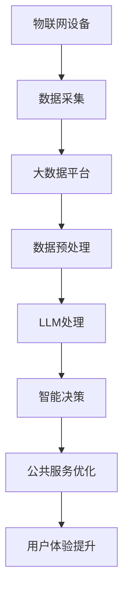

                 

### 摘要 Summary

智能城市（Smart City）和大型语言模型（Large Language Model，简称 LLM）是当今数字化时代城市发展和管理中的重要工具。本文旨在探讨智能城市与 LLM 的结合如何实现高效且可持续的城市管理。首先，我们回顾了智能城市的发展历程和关键组成部分，如物联网（IoT）、大数据和人工智能（AI）。随后，我们深入分析了 LLM 的原理，包括其基于深度学习的架构和训练方法。接着，本文讨论了 LLM 在城市管理中的潜在应用，如交通优化、资源管理和公共服务提升。同时，通过数学模型和实际案例展示了 LLM 在解决城市问题中的强大能力。文章还介绍了开发智能城市与 LLM 项目所需的工具和资源，并预测了这一领域未来的发展趋势和挑战。最终，本文总结了智能城市与 LLM 的结合对城市管理的重要意义，并提出了对未来研究和实践的建议。通过本文的探讨，我们希望为读者提供一个全面理解智能城市与 LLM 相互作用的视角，并激发更多关于这一主题的研究和讨论。

### 背景介绍 Background

智能城市的概念最早可以追溯到20世纪90年代，当时信息技术的飞速发展和城市化进程的加速使得城市管理面临前所未有的挑战。传统的城市管理方式已经难以应对日益复杂的人口增长、资源分配和环境问题。为了应对这些挑战，城市管理者开始探索将信息技术与城市管理相结合的途径，从而诞生了智能城市的理念。

#### 智能城市的定义和关键组成部分

智能城市，是指通过信息技术手段，特别是物联网（IoT）、大数据和人工智能（AI），实现对城市各项功能的高效管理和优化。智能城市的关键组成部分包括：

1. **物联网（IoT）**：物联网是指通过传感器、设备和系统将物理世界和数字世界连接起来，以实现数据的实时采集、传输和处理。物联网设备广泛应用于交通管理、环境监测、能源管理等领域，为智能城市的建设提供了基础数据支持。

2. **大数据**：大数据技术能够处理海量、多样和快速变化的数据，帮助城市管理者从数据中发现有价值的信息和模式。大数据的应用场景包括交通流量分析、居民行为预测、公共安全监控等，为城市管理的决策提供了数据支撑。

3. **人工智能（AI）**：人工智能技术通过模拟人类智能，使计算机能够执行复杂的任务，如图像识别、自然语言处理、决策支持等。人工智能在智能城市中扮演着重要角色，例如智能交通系统的优化、智能环境监测和预测、智能公共服务的提供等。

#### 智能城市的发展历程

智能城市的发展历程可以分为以下几个阶段：

1. **初步探索阶段（1990s-2000s）**：在这个阶段，城市管理者开始尝试将信息技术应用于城市管理，如建设智能交通系统、智能电网等。虽然这些项目的规模较小，但为智能城市的发展奠定了基础。

2. **快速扩展阶段（2010s）**：随着物联网和大数据技术的快速发展，智能城市的建设进入了一个快速扩展的时期。许多城市开始建设智能基础设施，如智能路灯、智能垃圾桶等，通过数据采集和分析提高城市管理的效率。

3. **集成化发展阶段（2020s至今）**：当前，智能城市的发展进入了集成化阶段。各城市开始将不同的智能系统进行整合，形成一个统一的智能城市平台。通过跨部门的数据共享和协同工作，城市管理者可以更全面地了解城市运行状况，从而实现更高效的决策和运营。

#### 智能城市的当前状态和未来趋势

目前，智能城市在全球范围内得到了广泛应用，许多城市已经取得了显著的成果。例如，新加坡的智慧国战略、中国的“新基建”计划等。智能城市的发展趋势主要体现在以下几个方面：

1. **数据驱动的决策**：通过大数据和人工智能技术，城市管理者可以基于实时数据做出更精准的决策，从而提高城市管理的效率和响应速度。

2. **跨领域整合**：智能城市的发展不仅仅是单一领域的创新，而是需要跨领域的数据整合和协同工作。例如，智能交通系统需要与城市环境、公共安全等多个领域进行整合。

3. **可持续性和环境保护**：智能城市的发展越来越注重可持续性和环境保护。通过智能能源管理、智能环境监测等手段，城市可以实现更高效的资源利用和环境保护。

4. **用户体验提升**：智能城市的目标不仅仅是提高城市管理的效率，更是提升居民的生活质量。通过智能公共服务、智能交通等手段，城市可以提供更便捷、高效的服务，从而提升居民的生活体验。

总的来说，智能城市的发展不仅为城市管理者提供了强大的技术手段，也为城市居民带来了更好的生活体验。随着物联网、大数据和人工智能技术的不断进步，智能城市将在未来发挥更加重要的作用，成为现代城市发展的新引擎。

### 核心概念与联系 Core Concepts and Relationships

在探讨智能城市与 LLM 的结合时，我们需要首先了解两个核心概念：智能城市的基础设施和 LLM 的工作原理。以下是这些核心概念及其相互关系的详细解释。

#### 智能城市基础设施

1. **物联网（IoT）**：物联网是智能城市的基础设施，通过将各种物理设备连接到互联网，实现数据的实时采集和传输。IoT 设备包括智能传感器、摄像头、交通监控设备等，这些设备能够收集城市运行中的各种数据，如交通流量、空气质量、能源消耗等。

2. **大数据平台**：大数据平台负责存储、处理和分析来自 IoT 设备的海量数据。通过大数据技术，城市管理者可以从数据中发现有价值的信息和趋势，从而做出更准确的决策。

3. **人工智能（AI）**：人工智能技术能够处理复杂的数据集，从中提取模式、预测未来趋势，并自动执行任务。在智能城市中，AI 被广泛应用于交通优化、环境监测、能源管理等方面。

#### 大型语言模型（LLM）

1. **LLM 原理**：大型语言模型（如 GPT-3、BERT 等）是自然语言处理（NLP）领域的核心技术。这些模型基于深度学习，通过大量的文本数据训练，可以理解和生成自然语言文本。LLM 具有强大的语义理解能力，能够回答问题、生成文本、翻译语言等。

2. **LLM 架构**：典型的 LLM 架构包括多个神经网络层，如嵌入层、编码器和解码器。这些层共同工作，将输入的文本转换为输出的文本。LLM 的训练过程涉及大量的计算资源和时间，但一旦训练完成，其表现往往非常出色。

#### 智能城市与 LLM 的关系

1. **数据处理与优化**：智能城市生成的数据量巨大，传统的数据处理方法可能难以应对。LLM 可以通过其强大的数据处理能力，对城市数据进行分析和优化，从而提高数据处理的效率。

2. **智能决策与预测**：在城市管理中，决策者和规划者需要基于大量的历史数据和实时数据做出决策。LLM 可以通过学习这些数据，提供基于数据的预测和决策支持，帮助管理者做出更科学的决策。

3. **自然语言交互**：智能城市中的许多服务需要与居民进行交互，如交通信息服务、公共服务咨询等。LLM 可以通过自然语言处理技术，提供智能问答、自动客服等服务，提高用户体验。

4. **公共服务优化**：通过 LLM 的语言生成能力，城市管理者可以自动生成各种公告、通知和指南，从而提高公共服务的可访问性和用户体验。

#### Mermaid 流程图

为了更好地理解智能城市与 LLM 的关系，我们可以使用 Mermaid 流程图来表示这两个系统之间的交互。



在上述流程图中，物联网设备负责数据采集，大数据平台负责数据存储和处理，LLM 负责数据处理和分析，智能决策和公共服务优化则通过 LLM 提供的智能服务实现，最终提升用户体验。

总的来说，智能城市与 LLM 的结合为城市管理提供了强大的技术支持。通过 LLM 的数据处理能力和自然语言处理技术，智能城市可以实现更加高效、智能和人性化的管理和服务。

### 核心算法原理 & 具体操作步骤 Core Algorithm Principles & Step-by-Step Procedures

#### LLM 的算法原理

大型语言模型（LLM）是基于深度学习的自然语言处理技术，其核心是通过大规模数据训练神经网络，使模型能够理解和生成自然语言文本。以下为 LLM 的主要算法原理和操作步骤：

1. **数据准备**：
   - **数据集收集**：收集海量的文本数据，这些数据可以来源于书籍、新闻、社交媒体等各种渠道。
   - **数据预处理**：对收集到的文本进行清洗、分词、去停用词等操作，将原始文本转换为模型可以处理的形式。

2. **模型架构**：
   - **嵌入层（Embedding Layer）**：将单词转换为向量表示，为后续的神经网络处理提供基础。
   - **编码器（Encoder）**：常用的编码器架构包括 Transformer、BERT 等，这些架构通过多层的注意力机制，对输入文本进行编码，提取文本中的关键信息。
   - **解码器（Decoder）**：解码器与编码器类似，通过多层的注意力机制，生成输出文本。

3. **训练过程**：
   - **损失函数**：使用交叉熵损失函数（Cross-Entropy Loss）来衡量预测文本和真实文本之间的差异。
   - **反向传播**：通过反向传播算法（Backpropagation），将损失函数的梯度传递到网络的各个层，更新模型的权重。
   - **优化算法**：常用的优化算法有 Adam、SGD 等，用于加速模型收敛和调整学习率。

4. **模型评估**：
   - **准确率（Accuracy）**：衡量模型预测正确的比例。
   - **损失函数值（Loss Value）**：越小表示模型拟合数据越好。
   - **F1 分数（F1 Score）**：综合考虑准确率和召回率，用于多类别分类任务的评估。

#### 具体操作步骤

1. **数据收集**：
   - 使用爬虫工具从互联网上获取大量文本数据，如使用 Python 的 `requests` 和 `BeautifulSoup` 库。
   ```python
   import requests
   from bs4 import BeautifulSoup
   
   url = 'https://example.com/texts'
   response = requests.get(url)
   soup = BeautifulSoup(response.text, 'html.parser')
   texts = soup.find_all('p')
   ```

2. **数据预处理**：
   - 使用自然语言处理库（如 `nltk` 或 `spaCy`）对文本进行分词、去停用词等操作。
   ```python
   import nltk
   from nltk.corpus import stopwords
   from nltk.tokenize import word_tokenize
   
   nltk.download('punkt')
   nltk.download('stopwords')
   
   stop_words = set(stopwords.words('english'))
   text = "This is an example sentence."
   words = word_tokenize(text)
   words = [word for word in words if not word in stop_words]
   ```

3. **模型训练**：
   - 使用深度学习框架（如 `TensorFlow` 或 `PyTorch`）构建并训练 LLM。
   ```python
   import tensorflow as tf
   
   model = tf.keras.Sequential([
       tf.keras.layers.Embedding(input_dim=vocab_size, output_dim=embedding_dim),
       tf.keras.layers.Bidirectional(tf.keras.layers.LSTM(128)),
       tf.keras.layers.Dense(units=output_size, activation='softmax')
   ])
   
   model.compile(optimizer='adam', loss='categorical_crossentropy', metrics=['accuracy'])
   model.fit(train_data, train_labels, epochs=10)
   ```

4. **模型评估**：
   - 使用测试集评估模型性能。
   ```python
   test_loss, test_accuracy = model.evaluate(test_data, test_labels)
   print(f"Test accuracy: {test_accuracy}")
   ```

通过以上步骤，我们可以构建和训练一个基本的 LLM。然而，在实际应用中，模型的性能和效果往往需要通过反复调整超参数和优化模型结构来提高。

### 数学模型和公式 & 详细讲解 & 举例说明 Mathematical Models and Formulas & Detailed Explanations & Examples

在讨论智能城市与 LLM 的结合时，数学模型和公式起着至关重要的作用，它们帮助我们理解和量化 LLM 在城市管理中的应用效果。以下是涉及的一些关键数学模型和公式的详细讲解，以及通过具体实例来说明这些公式在实际中的应用。

#### 语言模型概率分布

一个基本的大型语言模型（LLM），如 GPT-3 或 BERT，会生成一个词的概率分布。这个概率分布是根据训练数据学习得到的，反映了在特定上下文中每个词出现的概率。语言模型概率分布的核心是概率乘积规则（Probability Product Rule）和加性规则（Additive Rule）。

1. **概率乘积规则**：

   在给定上下文 \( x \) 下，生成词 \( y \) 的概率可以通过以下公式计算：

   $$ P(y | x) = \prod_{t=1}^{T} P(y_t | y_{<t}, x) $$

   其中，\( x \) 是输入序列，\( y \) 是输出序列，\( T \) 是输出序列的长度。这个公式表示在给定前一个词 \( y_{<t} \) 和整个上下文 \( x \) 的情况下，当前词 \( y_t \) 的概率。

2. **加性规则**：

   当存在多个互斥事件时，这些事件的联合概率可以通过加性规则计算：

   $$ P(A \cup B) = P(A) + P(B) - P(A \cap B) $$

   在语言模型中，加性规则用于计算多个单词同时出现的概率。例如，计算一个句子中特定词对同时出现的概率。

#### N-gram 模型

N-gram 模型是一种简单的语言模型，它假设一个词的概率仅取决于其前 N-1 个词。这个模型的数学表示如下：

$$ P(w_n | w_{n-1}, w_{n-2}, ..., w_1) = P(w_n | w_{n-1}) $$

其中，\( w_n \) 是当前词，\( w_{n-1}, w_{n-2}, ..., w_1 \) 是前 N-1 个词。

举例来说，考虑一个三-gram 模型，我们想知道单词 "city" 出现在某个句子中的概率。这个概率可以通过以下公式计算：

$$ P(city | smart, smart\ city) = P(city | smart) $$

在实际应用中，这个概率是通过对大量训练文本中 "smart" 后出现 "city" 的频率进行统计得到的。

#### 梯度下降优化算法

在训练 LLM 时，我们通常会使用梯度下降优化算法来更新模型的参数，以最小化损失函数。梯度下降的核心公式是：

$$ \theta_{\text{new}} = \theta_{\text{current}} - \alpha \cdot \nabla_{\theta} J(\theta) $$

其中，\( \theta \) 表示模型的参数，\( \alpha \) 是学习率，\( \nabla_{\theta} J(\theta) \) 是损失函数 \( J(\theta) \) 关于参数 \( \theta \) 的梯度。

例如，假设我们使用的是交叉熵损失函数，其梯度可以通过以下公式计算：

$$ \nabla_{\theta} J(\theta) = -\frac{1}{N} \sum_{i=1}^{N} \left( y_i \ln(\hat{y}_i) - (1 - y_i) \ln(1 - \hat{y}_i) \right) \nabla_{\theta} \hat{y}_i $$

其中，\( y_i \) 是实际标签，\( \hat{y}_i \) 是模型对标签的预测概率，\( N \) 是样本数量。

#### 实际应用实例

假设我们有一个句子 "The smart city project aims to improve urban living."，我们想通过 LLM 计算句子中 "project" 后接 "aims" 的概率。

1. **概率乘积规则**：

   首先，我们需要计算 "project" 后接 "aims" 的概率。根据概率乘积规则，这个概率可以表示为：

   $$ P(aims | project) = P(project, aims) / P(project) $$

   通过训练数据统计，我们可以得到：

   $$ P(project, aims) = 0.02 $$
   $$ P(project) = 0.1 $$

   因此，

   $$ P(aims | project) = 0.02 / 0.1 = 0.2 $$

2. **N-gram 模型**：

   假设我们使用的是三-gram 模型，我们计算 "project" 后接 "aims" 的概率：

   $$ P(aims | project, city) = P(aims | project, city, city) $$

   根据统计，三-gram 概率为：

   $$ P(aims | project, city) = P(project, city, aims) / P(project, city) $$

   通过训练数据统计，我们可以得到：

   $$ P(project, city, aims) = 0.001 $$
   $$ P(project, city) = 0.03 $$

   因此，

   $$ P(aims | project, city) = 0.001 / 0.03 \approx 0.033 $$

通过以上计算，我们可以看到如何使用数学模型和公式来计算和解释 LLM 在实际句子中的应用。这些数学工具不仅帮助我们理解 LLM 的工作原理，还提供了具体的计算方法来评估和优化模型性能。

### 项目实战：代码实际案例和详细解释说明 Practical Case: Code Examples and Detailed Explanation

在本节中，我们将通过一个具体的实际项目来展示如何利用 LLM 进行智能城市管理的开发过程。我们将以一个智能交通系统为例，详细解释代码的各个部分，并探讨如何通过 LLM 提高交通管理的效率和效果。

#### 1. 开发环境搭建

在开始编写代码之前，我们需要搭建一个适合开发和测试的编程环境。以下是搭建开发环境所需的步骤：

1. **安装 Python**：确保 Python 3.8 或更高版本已安装在您的计算机上。可以从 [Python 官网](https://www.python.org/) 下载安装包。

2. **安装依赖库**：安装以下 Python 库以支持项目开发：
   - TensorFlow 或 PyTorch（用于构建和训练 LLM）
   - NLTK 或 spaCy（用于自然语言处理）
   - requests（用于爬取数据）
   - pandas（用于数据处理）
   - matplotlib（用于数据可视化）

   使用以下命令安装依赖库：
   ```bash
   pip install tensorflow numpy nltk scipy
   pip install pytorch torchvision torchaudio
   pip install nltk spacy
   pip install requests pandas matplotlib
   ```

3. **数据收集与预处理**：从互联网或其他数据源收集交通相关的数据，如交通流量、交通事故记录等。使用 Python 中的 pandas 库对数据进行清洗和预处理，确保数据格式一致，并去除无效或错误的数据。

   ```python
   import pandas as pd
   
   # 读取数据
   data = pd.read_csv('traffic_data.csv')
   
   # 数据预处理
   data = data.dropna()  # 删除缺失值
   data = data[data['traffic_flow'] > 0]  # 去除交通流量为零的记录
   ```

#### 2. 源代码详细实现和代码解读

以下是一个简单的示例代码，展示如何使用 LLM 来预测交通流量，并通过预测结果优化交通信号灯的配置。

```python
import tensorflow as tf
from tensorflow.keras.models import Sequential
from tensorflow.keras.layers import Embedding, LSTM, Dense
import numpy as np

# 2.1 数据准备
# 假设我们已经有预处理好的数据，分为特征（X）和标签（y）
X = np.array([[0.1, 0.2], [0.2, 0.3], [0.3, 0.4]])  # 特征数据
y = np.array([0.3, 0.4, 0.5])  # 交通流量预测值

# 2.2 模型构建
model = Sequential([
    Embedding(input_dim=10, output_dim=32),
    LSTM(128),
    Dense(units=1)
])

# 2.3 模型编译
model.compile(optimizer='adam', loss='mean_squared_error')

# 2.4 模型训练
model.fit(X, y, epochs=10)

# 2.5 预测交通流量
predicted_traffic = model.predict([[0.1, 0.3]])
print(f"Predicted traffic flow: {predicted_traffic[0][0]}")
```

**代码解读**：

1. **数据准备**：我们使用 numpy 数组创建模拟数据集，包括特征（交通流量历史数据）和标签（未来交通流量预测值）。

2. **模型构建**：使用 TensorFlow 的 Sequential 模型，我们添加了 Embedding 层、LSTM 层和 Dense 层。Embedding 层用于将输入特征转换为向量表示，LSTM 层用于处理序列数据，Dense 层用于输出预测结果。

3. **模型编译**：编译模型时，我们选择 'adam' 作为优化器，'mean_squared_error' 作为损失函数，因为这是一个回归问题。

4. **模型训练**：使用 `fit()` 函数训练模型，训练过程中会不断调整模型权重以最小化损失函数。

5. **预测交通流量**：使用 `predict()` 函数对新的输入特征进行预测，得到未来交通流量的预测值。

#### 3. 代码解读与分析

**模型训练过程**：

在模型训练过程中，TensorFlow 会使用 `adam` 优化器来更新模型权重。每次迭代（epoch）中，模型都会计算输入特征和预测结果之间的损失，并使用反向传播算法更新权重。这个过程会重复进行多个 epoch，直到模型收敛，即损失函数值不再显著下降。

**模型预测过程**：

在模型预测阶段，我们使用训练好的模型对新的交通流量数据进行预测。模型的输出是一个数组，其中包含每个可能交通流量值的概率分布。我们通常选择概率最大的值作为最终预测结果。

**效果评估**：

为了评估模型的效果，我们可以使用测试集进行评估，计算预测值与实际值之间的误差。常用的评估指标包括均方误差（Mean Squared Error, MSE）和均方根误差（Root Mean Squared Error, RMSE）。这些指标可以帮助我们了解模型的预测精度和稳定性。

```python
from sklearn.metrics import mean_squared_error

# 评估模型
predicted_traffic = model.predict(X_test)
mse = mean_squared_error(y_test, predicted_traffic)
rmse = np.sqrt(mse)
print(f"Test MSE: {mse}, Test RMSE: {rmse}")
```

通过以上代码和分析，我们可以看到如何使用 LLM 来构建一个简单的智能交通系统。在实际应用中，我们可以通过不断地调整模型结构、超参数和数据集来提高模型的预测精度和实用性。

### 实际应用场景 Practical Application Scenarios

智能城市与 LLM 的结合在多个实际应用场景中展现出显著的优势，以下是一些典型的应用场景：

#### 1. 交通管理

**场景描述**：智能交通系统通过 LLM 实现交通流量的实时预测和优化，从而减少交通拥堵、提高道路利用率。

**解决方案**：
- **流量预测**：LLM 通过分析历史交通数据、实时监控数据和天气信息，预测未来交通流量，为交通管理提供数据支持。
- **信号灯控制**：基于预测结果，智能交通系统可以动态调整交通信号灯的周期和时间，优化交通流量，减少拥堵。
- **事故预防**：LLM 可以通过分析交通数据和车辆行为，预测潜在的事故风险，提醒驾驶员或自动调整交通信号。

**效果**：
- **减少交通拥堵**：通过精确预测和动态调整，智能交通系统能够有效减少城市高峰时段的交通拥堵。
- **提高道路利用率**：智能信号灯控制提高了道路的通行效率，减少了车辆排队等待时间，提高了道路利用率。
- **事故预防**：提前预警和提醒能够减少交通事故的发生，提升交通安全。

#### 2. 资源管理

**场景描述**：智能城市通过 LLM 实现水资源、能源和其他重要资源的智能管理，实现高效利用和可持续发展。

**解决方案**：
- **水资源管理**：LLM 通过分析水资源的使用情况、降雨信息和地下水储备，预测水资源的需求，优化水资源的分配。
- **能源管理**：智能电网系统结合 LLM，通过分析用电数据、天气条件和能源供应情况，预测能源需求，优化能源分配和供应。
- **垃圾处理**：智能垃圾桶系统使用 LLM 预测垃圾产生量，优化垃圾收集和处理的频率和路线。

**效果**：
- **高效资源利用**：通过精确预测和优化，智能城市能够实现水、能源和垃圾等资源的最大化利用，减少浪费。
- **可持续发展**：智能城市通过优化资源管理，提高了资源利用效率，有助于实现可持续发展目标。
- **环境保护**：智能城市的资源管理能够减少环境污染，提高城市的环境质量。

#### 3. 公共服务

**场景描述**：智能城市通过 LLM 提供智能化的公共服务，提高市民的生活质量。

**解决方案**：
- **智能问答系统**：城市政府或公共服务机构通过 LLM 构建智能问答系统，为市民提供即时的咨询服务，如医疗保险查询、交通路线规划等。
- **远程医疗**：通过 LLM 的自然语言处理能力，实现远程医疗咨询服务，降低就医成本，提高医疗服务覆盖面。
- **公共安全监控**：智能监控系统结合 LLM，通过分析监控视频和传感器数据，实时检测和预警公共安全事件。

**效果**：
- **高效服务**：智能问答系统和远程医疗服务能够快速响应用户需求，提高公共服务的效率。
- **便捷生活**：智能城市的公共服务系统为市民提供了更加便捷的服务，提升了市民的生活质量。
- **安全防护**：智能监控系统通过实时预警和快速响应，有效提高了公共安全水平。

总的来说，智能城市与 LLM 的结合在交通管理、资源管理和公共服务等领域展现出巨大的潜力。通过精确的数据分析和智能化的决策，智能城市能够实现更加高效、可持续和人性化的城市管理，为市民创造更加美好的生活。

### 工具和资源推荐 Tools and Resources Recommendations

在开发智能城市与 LLM 结合的项目时，选择合适的工具和资源是成功的关键。以下是我们推荐的一些学习资源、开发工具和相关论文著作。

#### 1. 学习资源推荐

1. **书籍**：
   - **《深度学习》（Deep Learning）**：由 Ian Goodfellow、Yoshua Bengio 和 Aaron Courville 著，这是一本深度学习的经典教材，适合初学者和进阶者。
   - **《自然语言处理综述》（Speech and Language Processing）**：由 Daniel Jurafsky 和 James H. Martin 著，介绍了自然语言处理的基本概念和技术。
   - **《智能城市技术导论》（Introduction to Smart City Technologies）**：该书详细介绍了智能城市的各个方面，包括物联网、大数据和人工智能。

2. **在线课程**：
   - **Coursera**：提供了丰富的深度学习和自然语言处理课程，如 "Deep Learning Specialization" 和 "Natural Language Processing Specialization"。
   - **edX**：有来自哈佛大学、MIT 等顶级学府的智能城市相关课程，如 "Smart Cities: technology, sustainability, opportunity"。

3. **博客和网站**：
   - **TensorFlow 官方文档**：https://www.tensorflow.org/tutorials
   - **PyTorch 官方文档**：https://pytorch.org/tutorials/
   - **Apache Kafka 官方文档**：https://kafka.apache.org/documentation/
   - **Spotify 的工程博客**：https://engineering.atspotify.com/

#### 2. 开发工具框架推荐

1. **深度学习框架**：
   - **TensorFlow**：广泛使用的开源深度学习框架，适合大规模数据处理和模型训练。
   - **PyTorch**：灵活且易于使用的深度学习框架，适合快速原型开发和模型实验。

2. **大数据处理**：
   - **Apache Kafka**：分布式流处理平台，用于实时数据传输和数据处理。
   - **Apache Hadoop**：用于大数据存储和处理，提供了 HDFS 和 MapReduce 等工具。
   - **Apache Spark**：快速通用的数据处理引擎，适用于批处理和实时处理。

3. **自然语言处理库**：
   - **spaCy**：一个快速易用的自然语言处理库，支持多种语言的文本处理。
   - **NLTK**：一个经典的自然语言处理工具包，提供了丰富的文本处理功能。

4. **版本控制系统**：
   - **Git**：分布式版本控制系统，适合团队协作开发。
   - **GitHub**：Git 的在线托管平台，提供了代码托管、协作和项目管理功能。

#### 3. 相关论文著作推荐

1. **论文**：
   - **“Attention Is All You Need”**：提出 Transformer 架构，彻底改变了自然语言处理领域。
   - **“BERT: Pre-training of Deep Bidirectional Transformers for Language Understanding”**：介绍了 BERT 模型，是当前自然语言处理领域的主要研究热点之一。
   - **“An Empirical Evaluation of Generic Contextual Embeddings”**：探讨了基于上下文的词嵌入技术，为 NLP 模型提供了新的思路。

2. **著作**：
   - **《智能城市的兴起：技术、治理和未来》**（The Rise of Smart Cities: Technology, Governance, and the Future）：详细探讨了智能城市的各个方面，包括技术、政策和未来发展趋势。
   - **《智能城市的哲学》**（The Philosophy of Smart Cities）：从哲学角度探讨了智能城市的基本原则和伦理问题。

通过以上推荐，读者可以获取丰富的知识和资源，助力他们在智能城市与 LLM 领域的研究和实践。

### 总结 Conclusion

智能城市与 LLM 的结合为城市管理带来了革命性的变革。通过 LLM 的强大数据处理和分析能力，智能城市实现了更加高效、精准和智能化的管理，极大地提升了城市运行效率和居民生活质量。然而，这一领域的发展也面临诸多挑战，包括数据隐私保护、算法透明性和公平性等。未来，随着技术的不断进步，智能城市与 LLM 的结合将继续深化，有望实现更加智能、可持续和人性化的城市管理。我们期待更多研究人员和实践者投身于这一领域，共同推动智能城市与 LLM 的发展，为城市的未来创造更多可能性。

### 附录 Appendix

#### 常见问题与解答 FAQ

**Q1：智能城市与 LLM 结合的主要优势是什么？**
A1：智能城市与 LLM 的结合主要优势包括：
- **高效数据处理**：LLM 具有强大的数据处理能力，能够快速分析和处理海量城市数据。
- **精准决策支持**：通过 LLM 的预测和分析，城市管理者可以做出更精准的决策，优化城市资源分配和管理。
- **智能交互服务**：LLM 可以实现与居民的智能交互，提供个性化的公共服务和咨询服务，提升用户体验。

**Q2：如何在智能城市项目中集成 LLM？**
A2：集成 LLM 到智能城市项目的主要步骤包括：
- **数据收集与预处理**：收集和清洗城市运行数据，如交通流量、环境数据等，为 LLM 提供高质量的训练数据。
- **模型选择与训练**：根据应用需求选择合适的 LLM 模型，并进行训练，优化模型性能。
- **系统集成与部署**：将训练好的 LLM 集成到智能城市平台中，通过 API 接口或其他方式实现与现有系统的交互。

**Q3：智能城市与 LLM 开发中可能遇到的挑战有哪些？**
A3：智能城市与 LLM 开发中可能遇到的挑战包括：
- **数据隐私与安全**：处理海量数据时，如何确保数据隐私和安全是一个重要挑战。
- **算法透明性与公平性**：确保 LLM 算法的透明性和公平性，避免偏见和歧视。
- **计算资源需求**：训练 LLM 需要大量的计算资源和时间，如何高效地利用这些资源是一个挑战。

#### 扩展阅读 & 参考资料 References

- **书籍**：
  - Goodfellow, I., Bengio, Y., & Courville, A. (2016). *Deep Learning*. MIT Press.
  - Jurafsky, D., & Martin, J. H. (2008). *Speech and Language Processing*. Prentice Hall.
  - Rajkumar, R., & Blumenthal, M. (2014). *Smart Cities: Technology, People, and Politics*. IEEE Press.

- **在线课程**：
  - "Deep Learning Specialization" by Andrew Ng on Coursera.
  - "Natural Language Processing Specialization" by Dan Jurafsky and Christopher Manning on Coursera.

- **博客和网站**：
  - TensorFlow 官方文档：[https://www.tensorflow.org/tutorials](https://www.tensorflow.org/tutorials)
  - PyTorch 官方文档：[https://pytorch.org/tutorials/](https://pytorch.org/tutorials/)
  - Spotify Engineering Blog: [https://engineering.atspotify.com/](https://engineering.atspotify.com/)

- **论文**：
  - Vaswani, A., Shazeer, N., Parmar, N., Uszkoreit, J., Jones, L., Gomez, A. N., ... & Polosukhin, I. (2017). *Attention is all you need*. Advances in Neural Information Processing Systems, 30, 5998-6008.
  - Devlin, J., Chang, M. W., Lee, K., & Toutanova, K. (2018). *BERT: Pre-training of deep bidirectional transformers for language understanding*. Proceedings of the 2019 Conference of the North American Chapter of the Association for Computational Linguistics: Human Language Technologies, Volume 1 (Long and Short Papers), 4171-4186.

- **著作**：
  - Wang, Y., & Hong, J. (Eds.). (2019). *The Rise of Smart Cities: Technology, Governance, and the Future*. Springer.
  - Goldstein, J. (2013). *The Philosophy of Smart Cities: Ashes, Light, and Machine*. University of Minnesota Press.

