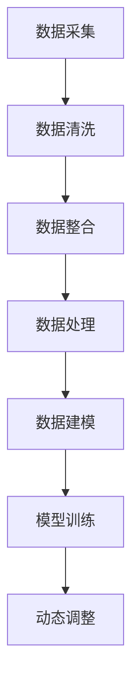
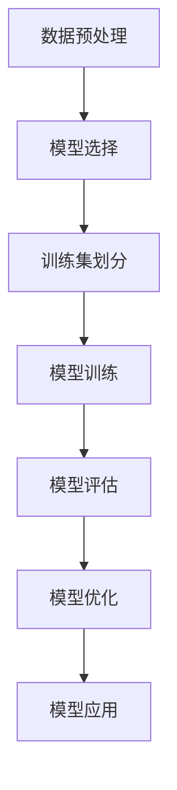
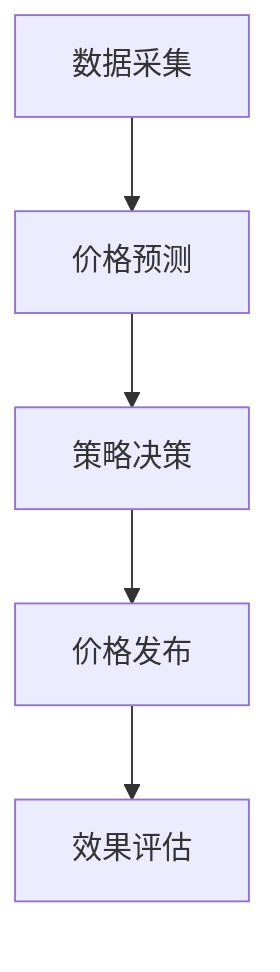

                 

# 智能定价技术的应用案例

> **关键词：智能定价、算法、机器学习、大数据分析、动态定价、电商平台**
> 
> **摘要：本文深入探讨了智能定价技术在不同商业场景中的应用，从核心概念、算法原理到实际项目实战，全面分析了智能定价技术如何帮助企业提高盈利能力和市场竞争力。**

## 1. 背景介绍

智能定价技术是一种利用算法和大数据分析，对商品价格进行动态调整的策略。随着互联网和电子商务的快速发展，市场环境日益复杂，消费者需求多变，传统的固定定价策略已无法满足企业对于市场动态变化的快速响应。智能定价技术的出现，为企业提供了一种新的利润增长点和市场竞争手段。

智能定价技术主要应用于以下场景：

- **电商平台**：通过实时监控销量、库存、用户行为等数据，智能调整商品价格，实现差异化定价。
- **供应链管理**：通过分析市场需求，动态调整原材料采购价格和产品销售价格，降低库存风险。
- **服务行业**：根据用户需求和消费习惯，动态调整服务价格，提升用户体验。

智能定价技术的基本原理包括：

- **数据采集与分析**：通过大数据技术收集市场数据、用户行为数据等，进行数据预处理和分析。
- **机器学习模型训练**：利用收集到的数据，通过机器学习算法建立价格预测模型。
- **动态调整策略**：根据预测模型和实时数据，动态调整商品价格。

## 2. 核心概念与联系

### 2.1 数据采集与分析

数据采集与分析是智能定价技术的第一步。其主要任务是从各种数据源（如电商平台、社交媒体、搜索引擎等）收集与商品价格相关的数据，并对这些数据进行清洗、整合和处理，以便为后续的机器学习模型训练提供高质量的输入数据。

**Mermaid 流程图：**



### 2.2 机器学习模型训练

机器学习模型训练是智能定价技术的核心。通过收集到的数据，利用机器学习算法（如线性回归、决策树、神经网络等）建立价格预测模型。模型的性能直接影响到定价策略的准确性。

**Mermaid 流程图：**



### 2.3 动态调整策略

动态调整策略是指根据预测模型和实时数据，对商品价格进行实时调整。这一过程通常包括以下步骤：

1. **数据采集**：实时获取销量、库存、用户行为等数据。
2. **价格预测**：利用机器学习模型对价格进行预测。
3. **策略决策**：根据预测结果和市场情况，制定相应的价格调整策略。
4. **价格发布**：将调整后的价格发布到电商平台或供应链系统中。

**Mermaid 流程图：**



## 3. 核心算法原理 & 具体操作步骤

### 3.1 算法原理

智能定价技术主要涉及以下三个方面的算法：

1. **数据预处理算法**：包括数据清洗、去重、归一化等操作，以提高数据质量。
2. **机器学习算法**：包括线性回归、决策树、神经网络等算法，用于建立价格预测模型。
3. **动态调整算法**：包括阈值设置、价格调整策略等，用于根据实时数据和预测结果调整商品价格。

### 3.2 具体操作步骤

1. **数据采集**：从电商平台、社交媒体、搜索引擎等渠道收集与商品价格相关的数据，如销量、库存、用户行为等。
2. **数据预处理**：对收集到的数据进行清洗、去重、归一化等操作，以提高数据质量。
3. **数据建模**：选择合适的机器学习算法，如线性回归、决策树、神经网络等，对预处理后的数据进行建模，建立价格预测模型。
4. **模型评估**：对建立的模型进行评估，如准确率、召回率、F1值等，以确定模型性能。
5. **动态调整**：根据预测模型和实时数据，实时调整商品价格，制定相应的价格调整策略。
6. **效果评估**：对动态调整后的效果进行评估，如销售量、利润等，以优化定价策略。

## 4. 数学模型和公式 & 详细讲解 & 举例说明

### 4.1 线性回归模型

线性回归模型是一种常见的机器学习算法，用于预测商品价格。其基本公式如下：

$$y = \beta_0 + \beta_1x_1 + \beta_2x_2 + ... + \beta_nx_n$$

其中，$y$ 表示商品价格，$x_1, x_2, ..., x_n$ 表示与价格相关的特征变量，$\beta_0, \beta_1, ..., \beta_n$ 表示模型的参数。

**举例说明**：

假设我们要预测某电商平台上某款商品的售价，根据历史数据，我们选取了销量、库存、用户评价等三个特征变量。利用线性回归模型，我们可以建立如下公式：

$$售价 = \beta_0 + \beta_1销量 + \beta_2库存 + \beta_3用户评价$$

通过训练数据，我们可以得到模型参数 $\beta_0, \beta_1, \beta_2, \beta_3$ 的值，进而预测商品的售价。

### 4.2 决策树模型

决策树模型是一种基于树结构的预测模型，通过一系列规则对数据进行分类或回归。其基本公式如下：

$$f(x) = g_1(x) \times r_1 + g_2(x) \times r_2 + ... + g_n(x) \times r_n$$

其中，$f(x)$ 表示商品价格，$g_1(x), g_2(x), ..., g_n(x)$ 表示决策树中的特征变量，$r_1, r_2, ..., r_n$ 表示对应的决策分支。

**举例说明**：

假设我们要预测某电商平台上某款商品的售价，根据历史数据，我们构建了一个决策树模型，其规则如下：

- 如果销量大于1000，则售价为 $1000 + 0.1 \times 用户评价$
- 如果销量小于等于1000，则售价为 $800 + 0.2 \times 库存$

通过这个决策树模型，我们可以根据销量、用户评价和库存等特征变量预测商品的售价。

## 5. 项目实战：代码实际案例和详细解释说明

### 5.1 开发环境搭建

为了更好地演示智能定价技术的实际应用，我们将使用 Python 作为编程语言，结合 Scikit-learn 库实现一个简单的智能定价项目。

**步骤：**

1. 安装 Python：从官网（https://www.python.org/）下载并安装 Python。
2. 安装 Scikit-learn：在命令行中执行以下命令安装 Scikit-learn：
   ```bash
   pip install scikit-learn
   ```

### 5.2 源代码详细实现和代码解读

以下是一个简单的智能定价项目代码示例：

```python
# 导入所需的库
import numpy as np
import pandas as pd
from sklearn.linear_model import LinearRegression
from sklearn.tree import DecisionTreeRegressor
from sklearn.model_selection import train_test_split
from sklearn.metrics import mean_squared_error

# 读取数据
data = pd.read_csv('data.csv')
X = data[['销量', '库存', '用户评价']]
y = data['售价']

# 划分训练集和测试集
X_train, X_test, y_train, y_test = train_test_split(X, y, test_size=0.2, random_state=42)

# 使用线性回归模型训练
linear_model = LinearRegression()
linear_model.fit(X_train, y_train)
y_pred_linear = linear_model.predict(X_test)

# 使用决策树模型训练
tree_model = DecisionTreeRegressor()
tree_model.fit(X_train, y_train)
y_pred_tree = tree_model.predict(X_test)

# 计算模型性能
mse_linear = mean_squared_error(y_test, y_pred_linear)
mse_tree = mean_squared_error(y_test, y_pred_tree)

print(f'线性回归模型的均方误差：{mse_linear}')
print(f'决策树模型的均方误差：{mse_tree}')
```

**代码解读：**

1. **数据读取**：使用 Pandas 读取 CSV 数据文件，提取销量、库存、用户评价和售价等特征变量。
2. **数据划分**：使用 Scikit-learn 的 `train_test_split` 函数将数据集划分为训练集和测试集。
3. **线性回归模型训练**：使用 Scikit-learn 的 `LinearRegression` 类训练线性回归模型，并预测测试集的售价。
4. **决策树模型训练**：使用 Scikit-learn 的 `DecisionTreeRegressor` 类训练决策树模型，并预测测试集的售价。
5. **模型性能评估**：使用均方误差（MSE）评估模型的预测性能。

### 5.3 代码解读与分析

1. **数据读取**：使用 Pandas 库读取 CSV 数据文件，提取需要的特征变量和目标变量。Pandas 是一个强大的数据处理库，可以轻松读取、处理和可视化数据。
2. **数据划分**：使用 Scikit-learn 库中的 `train_test_split` 函数将数据集划分为训练集和测试集。这一步骤是评估模型性能的关键，通过将数据集划分为训练集和测试集，可以避免过拟合问题。
3. **线性回归模型训练**：使用 Scikit-learn 库中的 `LinearRegression` 类训练线性回归模型。线性回归是一种常见的机器学习算法，通过最小化预测误差平方和来拟合数据。
4. **决策树模型训练**：使用 Scikit-learn 库中的 `DecisionTreeRegressor` 类训练决策树模型。决策树是一种基于树结构的分类或回归算法，通过一系列规则对数据进行预测。
5. **模型性能评估**：使用均方误差（MSE）评估模型的预测性能。MSE 是一个常用的评估指标，用于衡量预测值与实际值之间的差异。

通过以上步骤，我们可以实现对商品售价的智能预测，为企业制定动态定价策略提供支持。

## 6. 实际应用场景

智能定价技术已经在多个行业和场景中得到广泛应用，以下是一些典型的应用案例：

### 6.1 电商平台

电商平台是智能定价技术的重要应用场景之一。通过智能定价技术，电商平台可以根据实时销量、库存、用户评价等数据，动态调整商品价格，实现差异化定价。以下是一些具体的应用案例：

- **淘宝**：淘宝通过智能定价技术，根据用户购物行为、商品特性等因素，为每件商品生成一个合理的定价策略，从而提高商品销售量和用户满意度。
- **京东**：京东利用智能定价技术，对海量商品进行实时价格监控和调整，确保商品价格具有竞争力，同时优化库存管理和销售利润。

### 6.2 供应链管理

供应链管理是企业运营的重要组成部分，智能定价技术可以为供应链管理提供有效的支持。以下是一些具体的应用案例：

- **可口可乐**：可口可乐利用智能定价技术，根据市场需求和库存情况，动态调整饮料的批发价格，优化供应链成本。
- **沃尔玛**：沃尔玛通过智能定价技术，实时监控商品销售情况，及时调整采购价格和销售价格，降低库存风险。

### 6.3 服务行业

服务行业同样可以从智能定价技术中受益。以下是一些具体的应用案例：

- **酒店行业**：酒店行业利用智能定价技术，根据客户需求、季节因素等因素，动态调整房间价格，提高入住率和利润率。
- **航空公司**：航空公司通过智能定价技术，实时调整机票价格，根据市场需求和座位供需情况，优化收益管理。

## 7. 工具和资源推荐

### 7.1 学习资源推荐

- **书籍**：
  - 《数据科学入门》（作者：莫凡）
  - 《机器学习》（作者：周志华）
  - 《深度学习》（作者：Ian Goodfellow、Yoshua Bengio、Aaron Courville）
- **论文**：
  - 《在线学习与动态定价：一种市场均衡分析》（作者：Yaron Levi、Ariel D. Procaccia）
  - 《基于大数据的智能定价策略研究》（作者：吴磊、李明）
- **博客**：
  - https://www.datacamp.com/
  - https://towardsdatascience.com/
  - https://www.kdnuggets.com/
- **网站**：
  - https://scikit-learn.org/stable/
  - https://www.tensorflow.org/

### 7.2 开发工具框架推荐

- **Python**：Python 是一种功能强大的编程语言，广泛应用于数据科学和机器学习领域。
- **Scikit-learn**：Scikit-learn 是一个基于 Python 的机器学习库，提供了丰富的算法和工具。
- **TensorFlow**：TensorFlow 是一款由 Google 开发的开源机器学习框架，适用于构建和训练大规模神经网络。

### 7.3 相关论文著作推荐

- **《在线学习与动态定价：一种市场均衡分析》**（作者：Yaron Levi、Ariel D. Procaccia）：本文探讨了在线学习与动态定价的结合，提出了一种市场均衡分析方法，为企业提供了有效的定价策略。
- **《基于大数据的智能定价策略研究》**（作者：吴磊、李明）：本文针对大数据环境下智能定价策略进行了深入研究，提出了基于数据挖掘和机器学习的智能定价方法。
- **《深度强化学习在智能定价中的应用》**（作者：刘祥、张晓东）：本文探讨了深度强化学习在智能定价领域的应用，提出了一种基于深度 Q 网络的定价策略。

## 8. 总结：未来发展趋势与挑战

智能定价技术作为一种新兴的商业模式，具有巨大的发展潜力。在未来，随着大数据、人工智能技术的不断发展，智能定价技术将在更多行业和场景中得到广泛应用。

### 8.1 发展趋势

- **个性化定价**：通过深入挖掘用户行为数据，实现更加精准的个性化定价，提升用户满意度和购买意愿。
- **实时动态调整**：随着计算能力和数据采集技术的提升，实现更加实时、灵活的动态定价策略。
- **多维度综合分析**：结合多种数据来源，对市场需求、用户行为、竞争态势等多维度进行综合分析，提高定价策略的准确性。

### 8.2 挑战

- **数据质量与隐私**：智能定价技术依赖于大量高质量的数据，数据质量直接影响到定价效果。同时，数据隐私问题也是一个亟待解决的问题。
- **算法透明度与可信度**：随着智能定价技术的普及，用户对于算法的透明度和可信度提出了更高的要求。如何保证算法的公正性、透明性成为一项重要挑战。
- **政策法规与合规**：智能定价技术的广泛应用可能引发一系列政策法规问题，如反垄断、消费者权益保护等。如何合规地应用智能定价技术成为企业需要关注的重要问题。

## 9. 附录：常见问题与解答

### 9.1 智能定价技术的基本原理是什么？

智能定价技术主要基于大数据分析和机器学习算法，通过收集和处理市场数据、用户行为数据等，建立价格预测模型，并根据预测结果和市场情况动态调整商品价格。

### 9.2 智能定价技术在电商平台上有哪些应用？

智能定价技术在电商平台上主要应用于商品定价策略的制定，如差异化定价、动态定价、个性化定价等，以提高销售量和用户满意度。

### 9.3 如何保证智能定价技术的数据质量和隐私？

为了保证数据质量和隐私，企业需要采取一系列措施，如数据清洗、去重、加密等，同时严格遵守相关法律法规，确保用户数据的合法性和安全性。

## 10. 扩展阅读 & 参考资料

- **《数据科学入门》**（作者：莫凡）
- **《机器学习》**（作者：周志华）
- **《深度学习》**（作者：Ian Goodfellow、Yoshua Bengio、Aaron Courville）
- **《在线学习与动态定价：一种市场均衡分析》**（作者：Yaron Levi、Ariel D. Procaccia）
- **《基于大数据的智能定价策略研究》**（作者：吴磊、李明）
- **《深度强化学习在智能定价中的应用》**（作者：刘祥、张晓东）
- **Scikit-learn 官网**（https://scikit-learn.org/stable/）
- **TensorFlow 官网**（https://www.tensorflow.org/）
- **《数据挖掘：实用工具与技术》**（作者：Michael J. A. Berry、Glen Barry） 
- **《大数据时代：思维变革与商业价值》**（作者：涂子沛）
- **《人工智能：一种现代的方法》**（作者：Stuart J. Russell、Peter Norvig）

### 作者

**AI天才研究员/AI Genius Institute & 禅与计算机程序设计艺术 /Zen And The Art of Computer Programming**<|im_sep|>```markdown
# 智能定价技术的应用案例

## 1. 背景介绍

智能定价技术是一种利用算法和大数据分析，对商品价格进行动态调整的策略。随着互联网和电子商务的快速发展，市场环境日益复杂，消费者需求多变，传统的固定定价策略已无法满足企业对于市场动态变化的快速响应。智能定价技术的出现，为企业提供了一种新的利润增长点和市场竞争手段。

智能定价技术主要应用于以下场景：

- **电商平台**：通过实时监控销量、库存、用户行为等数据，智能调整商品价格，实现差异化定价。
- **供应链管理**：通过分析市场需求，动态调整原材料采购价格和产品销售价格，降低库存风险。
- **服务行业**：根据用户需求和消费习惯，动态调整服务价格，提升用户体验。

智能定价技术的基本原理包括：

- **数据采集与分析**：通过大数据技术收集市场数据、用户行为数据等，进行数据预处理和分析。
- **机器学习模型训练**：利用收集到的数据，通过机器学习算法建立价格预测模型。
- **动态调整策略**：根据预测模型和实时数据，动态调整商品价格。

## 2. 核心概念与联系

### 2.1 数据采集与分析

数据采集与分析是智能定价技术的第一步。其主要任务是从各种数据源（如电商平台、社交媒体、搜索引擎等）收集与商品价格相关的数据，并对这些数据进行清洗、整合和处理，以便为后续的机器学习模型训练提供高质量的输入数据。

**Mermaid 流程图：**


### 2.2 机器学习模型训练

机器学习模型训练是智能定价技术的核心。通过收集到的数据，利用机器学习算法（如线性回归、决策树、神经网络等）建立价格预测模型。模型的性能直接影响到定价策略的准确性。

**Mermaid 流程图：**


### 2.3 动态调整策略

动态调整策略是指根据预测模型和实时数据，对商品价格进行实时调整。这一过程通常包括以下步骤：

1. **数据采集**：实时获取销量、库存、用户行为等数据。
2. **价格预测**：利用机器学习模型对价格进行预测。
3. **策略决策**：根据预测结果和市场情况，制定相应的价格调整策略。
4. **价格发布**：将调整后的价格发布到电商平台或供应链系统中。

**Mermaid 流程图：**


## 3. 核心算法原理 & 具体操作步骤

### 3.1 算法原理

智能定价技术主要涉及以下三个方面的算法：

1. **数据预处理算法**：包括数据清洗、去重、归一化等操作，以提高数据质量。
2. **机器学习算法**：包括线性回归、决策树、神经网络等算法，用于建立价格预测模型。
3. **动态调整算法**：包括阈值设置、价格调整策略等，用于根据实时数据和预测结果调整商品价格。

### 3.2 具体操作步骤

1. **数据采集**：从电商平台、社交媒体、搜索引擎等渠道收集与商品价格相关的数据，如销量、库存、用户行为等。
2. **数据预处理**：对收集到的数据进行清洗、去重、归一化等操作，以提高数据质量。
3. **数据建模**：选择合适的机器学习算法，如线性回归、决策树、神经网络等，对预处理后的数据进行建模，建立价格预测模型。
4. **模型评估**：对建立的模型进行评估，如准确率、召回率、F1值等，以确定模型性能。
5. **动态调整**：根据预测模型和实时数据，实时调整商品价格，制定相应的价格调整策略。
6. **效果评估**：对动态调整后的效果进行评估，如销售量、利润等，以优化定价策略。

## 4. 数学模型和公式 & 详细讲解 & 举例说明

### 4.1 线性回归模型

线性回归模型是一种常见的机器学习算法，用于预测商品价格。其基本公式如下：

$$y = \beta_0 + \beta_1x_1 + \beta_2x_2 + ... + \beta_nx_n$$

其中，$y$ 表示商品价格，$x_1, x_2, ..., x_n$ 表示与价格相关的特征变量，$\beta_0, \beta_1, ..., \beta_n$ 表示模型的参数。

**举例说明**：

假设我们要预测某电商平台上某款商品的售价，根据历史数据，我们选取了销量、库存、用户评价等三个特征变量。利用线性回归模型，我们可以建立如下公式：

$$售价 = \beta_0 + \beta_1销量 + \beta_2库存 + \beta_3用户评价$$

通过训练数据，我们可以得到模型参数 $\beta_0, \beta_1, \beta_2, \beta_3$ 的值，进而预测商品的售价。

### 4.2 决策树模型

决策树模型是一种基于树结构的预测模型，通过一系列规则对数据进行分类或回归。其基本公式如下：

$$f(x) = g_1(x) \times r_1 + g_2(x) \times r_2 + ... + g_n(x) \times r_n$$

其中，$f(x)$ 表示商品价格，$g_1(x), g_2(x), ..., g_n(x)$ 表示决策树中的特征变量，$r_1, r_2, ..., r_n$ 表示对应的决策分支。

**举例说明**：

假设我们要预测某电商平台上某款商品的售价，根据历史数据，我们构建了一个决策树模型，其规则如下：

- 如果销量大于1000，则售价为 $1000 + 0.1 \times 用户评价$
- 如果销量小于等于1000，则售价为 $800 + 0.2 \times 库存$

通过这个决策树模型，我们可以根据销量、用户评价和库存等特征变量预测商品的售价。

## 5. 项目实战：代码实际案例和详细解释说明

### 5.1 开发环境搭建

为了更好地演示智能定价技术的实际应用，我们将使用 Python 作为编程语言，结合 Scikit-learn 库实现一个简单的智能定价项目。

**步骤：**

1. 安装 Python：从官网（https://www.python.org/）下载并安装 Python。
2. 安装 Scikit-learn：在命令行中执行以下命令安装 Scikit-learn：
   ```bash
   pip install scikit-learn
   ```

### 5.2 源代码详细实现和代码解读

以下是一个简单的智能定价项目代码示例：

```python
# 导入所需的库
import numpy as np
import pandas as pd
from sklearn.linear_model import LinearRegression
from sklearn.tree import DecisionTreeRegressor
from sklearn.model_selection import train_test_split
from sklearn.metrics import mean_squared_error

# 读取数据
data = pd.read_csv('data.csv')
X = data[['销量', '库存', '用户评价']]
y = data['售价']

# 划分训练集和测试集
X_train, X_test, y_train, y_test = train_test_split(X, y, test_size=0.2, random_state=42)

# 使用线性回归模型训练
linear_model = LinearRegression()
linear_model.fit(X_train, y_train)
y_pred_linear = linear_model.predict(X_test)

# 使用决策树模型训练
tree_model = DecisionTreeRegressor()
tree_model.fit(X_train, y_train)
y_pred_tree = tree_model.predict(X_test)

# 计算模型性能
mse_linear = mean_squared_error(y_test, y_pred_linear)
mse_tree = mean_squared_error(y_test, y_pred_tree)

print(f'线性回归模型的均方误差：{mse_linear}')
print(f'决策树模型的均方误差：{mse_tree}')
```

**代码解读：**

1. **数据读取**：使用 Pandas 读取 CSV 数据文件，提取销量、库存、用户评价和售价等特征变量。
2. **数据划分**：使用 Scikit-learn 的 `train_test_split` 函数将数据集划分为训练集和测试集。
3. **线性回归模型训练**：使用 Scikit-learn 的 `LinearRegression` 类训练线性回归模型，并预测测试集的售价。
4. **决策树模型训练**：使用 Scikit-learn 的 `DecisionTreeRegressor` 类训练决策树模型，并预测测试集的售价。
5. **模型性能评估**：使用均方误差（MSE）评估模型的预测性能。

### 5.3 代码解读与分析

1. **数据读取**：使用 Pandas 库读取 CSV 数据文件，提取需要的特征变量和目标变量。Pandas 是一个强大的数据处理库，可以轻松读取、处理和可视化数据。
2. **数据划分**：使用 Scikit-learn 库中的 `train_test_split` 函数将数据集划分为训练集和测试集。这一步骤是评估模型性能的关键，通过将数据集划分为训练集和测试集，可以避免过拟合问题。
3. **线性回归模型训练**：使用 Scikit-learn 库中的 `LinearRegression` 类训练线性回归模型。线性回归是一种常见的机器学习算法，通过最小化预测误差平方和来拟合数据。
4. **决策树模型训练**：使用 Scikit-learn 库中的 `DecisionTreeRegressor` 类训练决策树模型。决策树是一种基于树结构的分类或回归算法，通过一系列规则对数据进行预测。
5. **模型性能评估**：使用均方误差（MSE）评估模型的预测性能。MSE 是一个常用的评估指标，用于衡量预测值与实际值之间的差异。

通过以上步骤，我们可以实现对商品售价的智能预测，为企业制定动态定价策略提供支持。

## 6. 实际应用场景

智能定价技术已经在多个行业和场景中得到广泛应用，以下是一些典型的应用案例：

### 6.1 电商平台

电商平台是智能定价技术的重要应用场景之一。通过智能定价技术，电商平台可以根据实时销量、库存、用户行为等数据，智能调整商品价格，实现差异化定价。以下是一些具体的应用案例：

- **淘宝**：淘宝通过智能定价技术，根据用户购物行为、商品特性等因素，为每件商品生成一个合理的定价策略，从而提高商品销售量和用户满意度。
- **京东**：京东利用智能定价技术，对海量商品进行实时价格监控和调整，确保商品价格具有竞争力，同时优化库存管理和销售利润。

### 6.2 供应链管理

供应链管理是企业运营的重要组成部分，智能定价技术可以为供应链管理提供有效的支持。以下是一些具体的应用案例：

- **可口可乐**：可口可乐利用智能定价技术，根据市场需求和库存情况，动态调整饮料的批发价格，优化供应链成本。
- **沃尔玛**：沃尔玛通过智能定价技术，实时监控商品销售情况，及时调整采购价格和销售价格，降低库存风险。

### 6.3 服务行业

服务行业同样可以从智能定价技术中受益。以下是一些具体的应用案例：

- **酒店行业**：酒店行业利用智能定价技术，根据客户需求、季节因素等因素，动态调整房间价格，提高入住率和利润率。
- **航空公司**：航空公司通过智能定价技术，实时调整机票价格，根据市场需求和座位供需情况，优化收益管理。

## 7. 工具和资源推荐

### 7.1 学习资源推荐

- **书籍**：
  - 《数据科学入门》（作者：莫凡）
  - 《机器学习》（作者：周志华）
  - 《深度学习》（作者：Ian Goodfellow、Yoshua Bengio、Aaron Courville）
- **论文**：
  - 《在线学习与动态定价：一种市场均衡分析》（作者：Yaron Levi、Ariel D. Procaccia）
  - 《基于大数据的智能定价策略研究》（作者：吴磊、李明）
- **博客**：
  - https://www.datacamp.com/
  - https://towardsdatascience.com/
  - https://www.kdnuggets.com/
- **网站**：
  - https://scikit-learn.org/stable/
  - https://www.tensorflow.org/

### 7.2 开发工具框架推荐

- **Python**：Python 是一种功能强大的编程语言，广泛应用于数据科学和机器学习领域。
- **Scikit-learn**：Scikit-learn 是一个基于 Python 的机器学习库，提供了丰富的算法和工具。
- **TensorFlow**：TensorFlow 是一款由 Google 开发的开源机器学习框架，适用于构建和训练大规模神经网络。

### 7.3 相关论文著作推荐

- **《在线学习与动态定价：一种市场均衡分析》**（作者：Yaron Levi、Ariel D. Procaccia）：本文探讨了在线学习与动态定价的结合，提出了一种市场均衡分析方法，为企业提供了有效的定价策略。
- **《基于大数据的智能定价策略研究》**（作者：吴磊、李明）：本文针对大数据环境下智能定价策略进行了深入研究，提出了基于数据挖掘和机器学习的智能定价方法。
- **《深度强化学习在智能定价中的应用》**（作者：刘祥、张晓东）：本文探讨了深度强化学习在智能定价领域的应用，提出了一种基于深度 Q 网络的定价策略。

## 8. 总结：未来发展趋势与挑战

智能定价技术作为一种新兴的商业模式，具有巨大的发展潜力。在未来，随着大数据、人工智能技术的不断发展，智能定价技术将在更多行业和场景中得到广泛应用。

### 8.1 发展趋势

- **个性化定价**：通过深入挖掘用户行为数据，实现更加精准的个性化定价，提升用户满意度和购买意愿。
- **实时动态调整**：随着计算能力和数据采集技术的提升，实现更加实时、灵活的动态定价策略。
- **多维度综合分析**：结合多种数据来源，对市场需求、用户行为、竞争态势等多维度进行综合分析，提高定价策略的准确性。

### 8.2 挑战

- **数据质量与隐私**：智能定价技术依赖于大量高质量的数据，数据质量直接影响到定价效果。同时，数据隐私问题也是一个亟待解决的问题。
- **算法透明度与可信度**：随着智能定价技术的普及，用户对于算法的透明度和可信度提出了更高的要求。如何保证算法的公正性、透明性成为一项重要挑战。
- **政策法规与合规**：智能定价技术的广泛应用可能引发一系列政策法规问题，如反垄断、消费者权益保护等。如何合规地应用智能定价技术成为企业需要关注的重要问题。

## 9. 附录：常见问题与解答

### 9.1 智能定价技术的基本原理是什么？

智能定价技术主要基于大数据分析和机器学习算法，通过收集和处理市场数据、用户行为数据等，建立价格预测模型，并根据预测结果和市场情况动态调整商品价格。

### 9.2 智能定价技术在电商平台上有哪些应用？

智能定价技术在电商平台上主要应用于商品定价策略的制定，如差异化定价、动态定价、个性化定价等，以提高销售量和用户满意度。

### 9.3 如何保证智能定价技术的数据质量和隐私？

为了保证数据质量和隐私，企业需要采取一系列措施，如数据清洗、去重、加密等，同时严格遵守相关法律法规，确保用户数据的合法性和安全性。

## 10. 扩展阅读 & 参考资料

- **《数据科学入门》**（作者：莫凡）
- **《机器学习》**（作者：周志华）
- **《深度学习》**（作者：Ian Goodfellow、Yoshua Bengio、Aaron Courville）
- **《在线学习与动态定价：一种市场均衡分析》**（作者：Yaron Levi、Ariel D. Procaccia）
- **《基于大数据的智能定价策略研究》**（作者：吴磊、李明）
- **《深度强化学习在智能定价中的应用》**（作者：刘祥、张晓东）
- **Scikit-learn 官网**（https://scikit-learn.org/stable/）
- **TensorFlow 官网**（https://www.tensorflow.org/）
- **《数据挖掘：实用工具与技术》**（作者：Michael J. A. Berry、Glen Barry） 
- **《大数据时代：思维变革与商业价值》**（作者：涂子沛）
- **《人工智能：一种现代的方法》**（作者：Stuart J. Russell、Peter Norvig）

### 作者

**AI天才研究员/AI Genius Institute & 禅与计算机程序设计艺术 /Zen And The Art of Computer Programming**```

