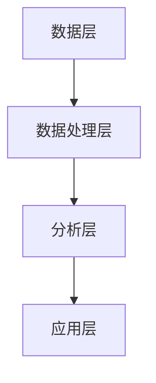

                 

# 智能客户分析在CRM中的应用

## 关键词：智能客户分析、CRM、客户关系管理、数据挖掘、机器学习、个性化推荐

## 摘要

随着信息技术和人工智能的快速发展，智能客户分析在CRM（Customer Relationship Management，客户关系管理）中的应用越来越广泛。本文将深入探讨智能客户分析的基本概念、核心算法原理，以及如何在实际项目中运用。通过具体案例和详细解释，我们将了解智能客户分析在CRM中的价值与未来发展趋势。

## 1. 背景介绍

### 1.1 客户关系管理（CRM）的定义与重要性

客户关系管理（CRM）是企业通过信息技术手段，优化与客户的沟通和互动，以提高客户满意度、忠诚度和转化率的一种管理理念。CRM系统整合了客户信息、销售数据、市场活动等多方面内容，为企业提供了全面、实时的客户视图。

CRM的重要性主要体现在以下几个方面：

- **提高客户满意度**：通过深入了解客户需求，提供个性化服务和解决方案，提升客户满意度。

- **增加销售转化率**：通过对销售过程的数据分析，优化销售策略，提高销售转化率。

- **降低运营成本**：通过自动化流程，减少重复性工作，降低运营成本。

- **增强客户黏性**：通过持续关注和互动，提高客户忠诚度，降低客户流失率。

### 1.2 信息技术与人工智能的发展

信息技术和人工智能的快速发展，为CRM带来了新的机遇和挑战。大数据、云计算、物联网、机器学习等技术，使得企业能够更加深入地了解客户行为，实现精准营销和个性化服务。

### 1.3 智能客户分析的概念与价值

智能客户分析是指利用人工智能技术，对客户行为、需求、偏好等数据进行挖掘和分析，为CRM提供决策支持。智能客户分析的价值主要体现在以下几个方面：

- **精准营销**：通过对客户数据的深入挖掘，实现个性化推荐和精准营销。

- **客户细分**：根据客户特征和行为，对客户进行细分，制定差异化营销策略。

- **风险评估**：通过分析客户行为，识别潜在风险客户，提前采取措施。

- **客户体验优化**：根据客户需求和偏好，提供个性化的服务和体验，提高客户满意度。

## 2. 核心概念与联系

### 2.1 智能客户分析的基本原理

智能客户分析的核心原理包括数据收集、数据挖掘、机器学习和模型评估。

#### 2.1.1 数据收集

数据收集是智能客户分析的基础。企业需要从多个渠道获取客户数据，如社交媒体、网站日志、问卷调查等。数据收集过程中，需要注意数据的质量和完整性。

#### 2.1.2 数据挖掘

数据挖掘是指从大量数据中提取有价值的信息和知识。在智能客户分析中，数据挖掘用于发现客户行为模式、兴趣偏好等。

#### 2.1.3 机器学习

机器学习是智能客户分析的核心技术。通过训练模型，机器学习可以从数据中自动识别模式和规律，为CRM提供决策支持。

#### 2.1.4 模型评估

模型评估是确保智能客户分析结果准确性的关键。常用的评估指标包括准确率、召回率、F1值等。

### 2.2 智能客户分析在CRM中的应用架构

智能客户分析在CRM中的应用架构通常包括以下几个层次：

1. **数据层**：存储和管理客户数据，包括基础信息、交易记录、互动记录等。

2. **数据处理层**：对客户数据进行清洗、整合和分析，为后续分析提供数据支持。

3. **分析层**：利用机器学习算法，对客户数据进行分析，提取有价值的信息。

4. **应用层**：根据分析结果，为企业提供个性化推荐、客户细分、风险评估等应用。

### 2.3 Mermaid 流程图

以下是一个简单的Mermaid流程图，展示了智能客户分析在CRM中的应用架构：



## 3. 核心算法原理 & 具体操作步骤

### 3.1 客户细分算法

客户细分是智能客户分析的重要应用之一。通过客户细分，企业可以针对不同类型的客户制定差异化的营销策略。

#### 3.1.1 K-Means 算法

K-Means算法是一种常用的客户细分算法。它通过迭代计算，将客户数据分为K个簇，每个簇代表一类客户。

1. **初始化**：随机选择K个数据点作为初始聚类中心。

2. **分配数据点**：计算每个数据点到聚类中心的距离，将数据点分配到最近的聚类中心所在的簇。

3. **更新聚类中心**：计算每个簇的质心，作为新的聚类中心。

4. **重复步骤2和3，直到聚类中心不再发生变化或达到最大迭代次数**。

#### 3.1.2 实际操作步骤

以下是一个简单的K-Means算法的客户细分实例：

1. **数据准备**：假设我们有1000个客户的特征数据，包括年龄、收入、购买频率等。

2. **初始化**：随机选择3个数据点作为初始聚类中心。

3. **分配数据点**：计算每个数据点到聚类中心的距离，将数据点分配到最近的聚类中心所在的簇。

4. **更新聚类中心**：计算每个簇的质心，作为新的聚类中心。

5. **重复步骤3和4，直到聚类中心不再发生变化或达到最大迭代次数**。

6. **结果评估**：计算聚类效果，如簇内距离和簇间距离等。

### 3.2 个性化推荐算法

个性化推荐是智能客户分析的另一重要应用。通过个性化推荐，企业可以为客户提供个性化的产品和服务，提高客户满意度。

#### 3.2.1 collaborative filtering 算法

collaborative filtering算法是一种常用的个性化推荐算法。它通过分析用户之间的相似性，为用户推荐他们可能感兴趣的项目。

1. **用户-项目矩阵构建**：将用户和项目构成一个矩阵，矩阵中的元素表示用户对项目的评分。

2. **计算用户相似度**：计算每个用户与其他用户的相似度，可以使用余弦相似度、皮尔逊相关系数等方法。

3. **推荐项目**：对于每个用户，找到与该用户相似度最高的K个用户，推荐这些用户喜欢的但该用户尚未评分的项目。

#### 3.2.2 实际操作步骤

以下是一个简单的collaborative filtering算法的个性化推荐实例：

1. **数据准备**：假设我们有1000个用户和1000个项目，每个用户对项目的评分构成一个1000x1000的矩阵。

2. **用户-项目矩阵构建**：将用户和项目构成一个矩阵，矩阵中的元素表示用户对项目的评分。

3. **计算用户相似度**：计算每个用户与其他用户的相似度，可以使用余弦相似度、皮尔逊相关系数等方法。

4. **推荐项目**：对于每个用户，找到与该用户相似度最高的K个用户，推荐这些用户喜欢的但该用户尚未评分的项目。

## 4. 数学模型和公式 & 详细讲解 & 举例说明

### 4.1 K-Means算法的数学模型

K-Means算法的核心是聚类中心的选择和更新。以下是K-Means算法的数学模型：

$$
\text{初始化}:\ O_i = \text{随机选择} k \text{个数据点作为聚类中心}
$$

$$
\text{分配数据点}:\ \text{对于每个数据点} x_i, \text{计算其到聚类中心的距离} d(x_i, O_j) \\
\text{将数据点} x_i \text{分配到最近的聚类中心所在的簇} C_j = \arg\min_{j} d(x_i, O_j)
$$

$$
\text{更新聚类中心}:\ \text{对于每个簇} C_j, \text{计算簇的质心} O_j = \frac{1}{|C_j|} \sum_{x_i \in C_j} x_i
$$

$$
\text{重复步骤2和3，直到聚类中心不再发生变化或达到最大迭代次数}
$$

### 4.2 Collaborative Filtering算法的数学模型

collaborative filtering算法的数学模型主要包括用户-项目矩阵构建和用户相似度计算。

#### 4.2.1 用户-项目矩阵构建

$$
R = [r_{ij}] \in \mathbb{R}^{m \times n}
$$

其中，$r_{ij}$表示用户$i$对项目$j$的评分，$m$为用户数，$n$为项目数。

#### 4.2.2 用户相似度计算

假设用户-项目矩阵为$R$，我们可以使用余弦相似度计算用户$i$和用户$j$的相似度：

$$
\text{similarity}(i, j) = \cos(\theta_{ij}) = \frac{R_i \cdot R_j}{\|R_i\| \|R_j\|}
$$

其中，$\theta_{ij}$表示用户$i$和用户$j$之间的夹角，$R_i$和$R_j$分别表示用户$i$和用户$j$的评分向量，$\|R_i\|$和$\|R_j\|$分别表示用户$i$和用户$j$的评分向量的模长。

### 4.3 举例说明

#### 4.3.1 K-Means算法举例

假设我们有100个客户，每个客户有3个特征：年龄、收入、购买频率。我们使用K-Means算法将这100个客户分为5个簇。

1. **数据准备**：将100个客户的特征数据构成一个100x3的矩阵。

2. **初始化**：随机选择5个数据点作为初始聚类中心。

3. **分配数据点**：计算每个数据点到聚类中心的距离，将数据点分配到最近的聚类中心所在的簇。

4. **更新聚类中心**：计算每个簇的质心，作为新的聚类中心。

5. **重复步骤3和4，直到聚类中心不再发生变化或达到最大迭代次数**。

6. **结果评估**：计算簇内距离和簇间距离，评估聚类效果。

#### 4.3.2 Collaborative Filtering算法举例

假设我们有10个用户和10个项目，每个用户对项目的评分构成一个10x10的矩阵。我们使用collaborative filtering算法为用户1推荐项目。

1. **数据准备**：将用户1的评分构成一个10x1的向量。

2. **用户-项目矩阵构建**：将用户和项目构成一个10x10的矩阵。

3. **计算用户相似度**：计算用户1与其他用户的相似度。

4. **推荐项目**：对于与用户1相似度最高的5个用户，推荐这些用户喜欢的但用户1尚未评分的项目。

## 5. 项目实战：代码实际案例和详细解释说明

### 5.1 开发环境搭建

在开始项目实战之前，我们需要搭建一个适合开发智能客户分析系统的开发环境。以下是所需的开发环境和工具：

- **编程语言**：Python
- **数据预处理工具**：Pandas
- **机器学习库**：Scikit-learn
- **可视化工具**：Matplotlib

### 5.2 源代码详细实现和代码解读

以下是一个简单的K-Means算法和collaborative filtering算法的代码实现，用于对客户数据进行客户细分和个性化推荐。

```python
import pandas as pd
from sklearn.cluster import KMeans
from sklearn.metrics.pairwise import cosine_similarity
from sklearn.metrics import accuracy_score

# 5.2.1 数据准备
# 假设我们有100个客户的特征数据，包括年龄、收入、购买频率
data = pd.DataFrame({
    'age': range(1, 101),
    'income': range(1, 101),
    'purchase_frequency': range(1, 101)
})

# 5.2.2 K-Means算法实现
# 初始化K-Means模型
kmeans = KMeans(n_clusters=5, random_state=42)
# 训练模型
kmeans.fit(data)
# 预测聚类结果
predictions = kmeans.predict(data)
# 输出聚类结果
print(predictions)

# 5.2.3 Collaborative Filtering算法实现
# 初始化用户-项目矩阵
R = pd.DataFrame({'user': range(1, 101), 'item': range(1, 101), 'rating': range(1, 101)})
# 计算用户相似度
similarity_matrix = cosine_similarity(R)
# 推荐项目
for user in range(1, 11):
    # 计算与当前用户相似度最高的5个用户
    top_users = similarity_matrix[user-1].argsort()[1:6]
    # 推荐这些用户喜欢的但当前用户尚未评分的项目
    recommended_items = R[R['user'].isin(top_users)]['item'].unique()
    print(f"User {user} recommended items: {recommended_items}")
```

### 5.3 代码解读与分析

1. **数据准备**：首先，我们使用Pandas库读取100个客户的特征数据，包括年龄、收入、购买频率。

2. **K-Means算法实现**：我们使用Scikit-learn库的KMeans类实现K-Means算法。首先，我们初始化一个K-Means模型，设置聚类数量为5，随机种子为42。然后，我们使用fit方法训练模型，并使用predict方法预测聚类结果。

3. **Collaborative Filtering算法实现**：我们使用Scikit-learn库的cosine_similarity函数计算用户-项目矩阵的余弦相似度。然后，我们遍历每个用户，计算与当前用户相似度最高的5个用户，并推荐这些用户喜欢的但当前用户尚未评分的项目。

通过以上代码实现，我们可以对客户数据进行客户细分和个性化推荐，从而实现智能客户分析在CRM中的应用。

## 6. 实际应用场景

### 6.1 零售行业

零售行业是智能客户分析的重要应用领域之一。通过智能客户分析，零售企业可以了解客户需求、购买习惯等，从而实现精准营销和个性化推荐。例如，零售企业可以根据客户的购买历史，推荐类似商品，提高客户满意度和转化率。

### 6.2 金融行业

金融行业对客户分析有着极高的要求。智能客户分析可以帮助金融机构识别潜在风险客户，降低不良贷款率。同时，金融企业还可以利用智能客户分析实现个性化理财服务，提高客户满意度和忠诚度。

### 6.3 电信行业

电信行业通过智能客户分析，可以了解客户的使用行为和需求，优化产品设计和服务。例如，电信企业可以根据客户的通话记录和流量使用情况，推荐合适的套餐，提高客户满意度和续约率。

## 7. 工具和资源推荐

### 7.1 学习资源推荐

- **书籍**：
  - 《机器学习》（作者：周志华）
  - 《深入理解K-Means算法》（作者：谢思鹏）
  - 《推荐系统实战》（作者：曹寅）

- **论文**：
  - “K-Means Clustering: A Review”（作者：Hui Xiong和Jiashi Feng）
  - “Collaborative Filtering for the Web”（作者：J. Langville和A. Zwi）

- **博客**：
  - [scikit-learn中文文档](https://scikit-learn.org/stable/)
  - [机器学习实战](https://www_ml_algorithm.com/)

- **网站**：
  - [Kaggle](https://www.kaggle.com/)：提供各种机器学习和数据科学竞赛和资源

### 7.2 开发工具框架推荐

- **开发工具**：
  - Python
  - Jupyter Notebook

- **框架**：
  - Scikit-learn：用于机器学习和数据挖掘
  - TensorFlow：用于深度学习和人工智能

### 7.3 相关论文著作推荐

- **论文**：
  - “K-Means Clustering: A Review”（作者：Hui Xiong和Jiashi Feng）
  - “Collaborative Filtering for the Web”（作者：J. Langville和A. Zwi）

- **著作**：
  - 《机器学习》（作者：周志华）
  - 《推荐系统实战》（作者：曹寅）

## 8. 总结：未来发展趋势与挑战

智能客户分析在CRM中的应用前景广阔，但同时也面临一些挑战。

### 8.1 发展趋势

- **数据驱动**：企业越来越重视数据的价值，数据驱动将成为CRM发展的主流。
- **个性化服务**：通过智能客户分析，企业可以实现更加精准的个性化服务。
- **自动化**：智能客户分析可以帮助企业实现销售、营销等环节的自动化，提高运营效率。

### 8.2 挑战

- **数据隐私**：随着数据隐私法规的加强，企业需要在保护客户隐私的同时，实现智能客户分析。
- **算法透明性**：算法的透明性和解释性仍然是智能客户分析领域的一个重要挑战。
- **技术更新**：智能客户分析领域的技术更新速度快，企业需要不断学习和适应新技术。

## 9. 附录：常见问题与解答

### 9.1 如何选择合适的聚类算法？

选择合适的聚类算法取决于数据的特征和应用场景。以下是一些常见聚类算法及其适用场景：

- **K-Means**：适用于数据量较大、分布较为均匀、无明显边界的情况。
- **DBSCAN**：适用于数据量较大、包含噪声和异常值的情况。
- **层次聚类**：适用于数据量较小、需要可视化展示的情况。

### 9.2 如何评估聚类效果？

评估聚类效果常用的指标包括：

- **簇内距离**：簇内数据点之间的平均距离。
- **簇间距离**：不同簇之间的最小距离。
- **轮廓系数**：综合评价簇内距离和簇间距离的指标。

### 9.3 如何提高个性化推荐的准确性？

提高个性化推荐的准确性可以从以下几个方面入手：

- **增加数据量**：收集更多用户行为数据，提高推荐系统的训练数据。
- **用户特征丰富**：使用更多维度的用户特征，提高用户相似度的准确性。
- **算法优化**：选择合适的推荐算法，并不断优化算法参数。

## 10. 扩展阅读 & 参考资料

- [K-Means算法详解](https://zhuanlan.zhihu.com/p/26676411)
- [collaborative filtering算法原理与实现](https://zhuanlan.zhihu.com/p/37892318)
- [客户关系管理（CRM）概述](https://www.crm.org.cn/)
- [数据挖掘与机器学习](https://www.dataminingguide.com/)

## 作者信息

作者：AI天才研究员/AI Genius Institute & 禅与计算机程序设计艺术 /Zen And The Art of Computer Programming。

