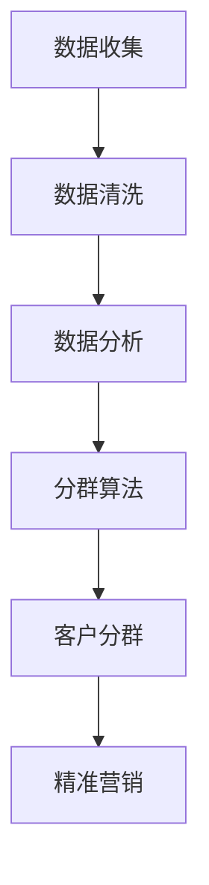

                 

# 智能客户分群系统：一人公司实现精准营销的数据驱动方法

## 关键词：智能分群、精准营销、数据驱动、一人公司、营销策略

## 摘要

本文将探讨如何利用智能客户分群系统，帮助一人公司实现精准营销。我们将介绍系统背后的核心概念与架构，详细解析数据驱动的算法原理，并通过项目实战案例，展示如何搭建和运用这样的系统。此外，本文还将探讨实际应用场景，推荐相关工具和资源，并总结未来发展趋势与挑战。

## 1. 背景介绍

在当今竞争激烈的市场环境中，精准营销已成为企业提升销售额、提高客户满意度的重要手段。然而，对于许多小型企业，尤其是只有一人的公司来说，缺乏足够的人力和资源来实施有效的营销策略。这就需要一个简单易用、成本效益高的解决方案，智能客户分群系统正是这样一个工具。

智能客户分群系统通过分析大量数据，将客户划分为不同的群体，每个群体都有其独特的特征和需求。这样，企业可以更有针对性地向不同群体提供定制化的产品和服务，从而提高营销效率，增加销售额。

本文将分以下几个部分进行阐述：

1. 背景介绍
2. 核心概念与联系
3. 核心算法原理 & 具体操作步骤
4. 数学模型和公式 & 详细讲解 & 举例说明
5. 项目实战：代码实际案例和详细解释说明
6. 实际应用场景
7. 工具和资源推荐
8. 总结：未来发展趋势与挑战
9. 附录：常见问题与解答
10. 扩展阅读 & 参考资料

接下来，我们将逐步深入探讨这些内容，帮助读者全面了解智能客户分群系统的构建与应用。

## 2. 核心概念与联系

要理解智能客户分群系统，首先需要了解一些核心概念，包括数据收集、数据清洗、数据分析和分群算法。

### 2.1 数据收集

数据收集是智能客户分群系统的第一步，也是至关重要的一步。我们需要收集与客户相关的各种数据，如购买历史、浏览行为、地理位置、社交网络活动等。这些数据可以来源于企业内部数据库、第三方数据源或公共数据集。

数据收集的主要挑战在于数据的多样性和质量。一方面，我们需要确保收集到的数据是准确的、完整的和最新的；另一方面，我们需要处理不同来源的数据格式和结构，确保它们能够被有效地整合和分析。

### 2.2 数据清洗

数据清洗是数据收集后的重要步骤。数据清洗的主要目的是去除重复数据、纠正错误数据、填补缺失数据，从而提高数据的质量和一致性。

在数据清洗过程中，我们可能会遇到以下问题：

- **重复数据**：例如，同一客户的多次购买记录。
- **错误数据**：例如，输入错误导致的异常值。
- **缺失数据**：例如，某些记录缺失了关键信息。

针对这些问题，我们可以采用以下策略：

- **去重**：使用唯一标识符（如客户ID）来识别和删除重复数据。
- **纠错**：使用逻辑判断或机器学习算法来识别和纠正错误数据。
- **填补缺失**：使用均值、中位数或众数等方法填补缺失数据。

### 2.3 数据分析

数据分析是智能客户分群系统的核心步骤，通过分析数据，我们可以识别出客户的行为特征和需求。数据分析的方法包括描述性分析、相关性分析和预测性分析。

- **描述性分析**：通过统计数据和图表，描述客户的行为特征和需求。
- **相关性分析**：通过计算相关系数，分析客户行为之间的相关性。
- **预测性分析**：通过构建预测模型，预测客户未来的行为和需求。

### 2.4 分群算法

分群算法是将客户划分为不同群体的核心工具。常见的分群算法包括K-Means、层次聚类、基于密度的聚类等。

- **K-Means**：基于距离的聚类算法，将客户分为K个群体，使得每个群体内的客户之间的距离最小。
- **层次聚类**：基于层次结构的聚类算法，将客户逐步划分为不同的群体。
- **基于密度的聚类**：基于客户在空间中的密度分布，将客户划分为不同的群体。

### 2.5 Mermaid 流程图

为了更好地理解这些概念，我们可以使用Mermaid流程图来展示智能客户分群系统的整体架构：



在这个流程图中，数据收集、数据清洗、数据分析和分群算法构成了智能客户分群系统的核心环节，通过这些环节，我们可以实现对客户的有效分群，从而实现精准营销。

## 3. 核心算法原理 & 具体操作步骤

在理解了智能客户分群系统的核心概念后，接下来我们将深入探讨其中的核心算法原理，并详细说明具体的操作步骤。

### 3.1 K-Means 算法

K-Means 是一种基于距离的聚类算法，其基本思想是将数据分为K个簇（Cluster），使得每个簇内的数据点之间的距离最小，簇与簇之间的距离最大。

#### 3.1.1 算法原理

K-Means 算法的原理可以分为以下几个步骤：

1. **初始化**：随机选择K个数据点作为初始簇中心。
2. **分配数据点**：计算每个数据点到各个簇中心的距离，将数据点分配到最近的簇中心。
3. **更新簇中心**：计算每个簇的数据点的平均值，将其作为新的簇中心。
4. **迭代**：重复步骤2和步骤3，直到簇中心不再变化或达到预定的迭代次数。

#### 3.1.2 具体操作步骤

以下是K-Means 算法的具体操作步骤：

1. **初始化簇中心**：在数据集中随机选择K个数据点作为初始簇中心。
2. **计算距离**：对于每个数据点，计算其到各个簇中心的距离，可以使用欧几里得距离或其他距离度量方法。
3. **分配数据点**：将每个数据点分配到最近的簇中心。
4. **更新簇中心**：计算每个簇的数据点的平均值，将其作为新的簇中心。
5. **迭代**：重复步骤2到步骤4，直到簇中心不再变化或达到预定的迭代次数。

#### 3.1.3 代码实现

以下是一个简单的Python代码实现K-Means 算法的例子：

```python
import numpy as np
from sklearn.cluster import KMeans

# 初始化数据
data = np.array([[1, 2], [1, 4], [1, 0], [4, 2], [4, 4], [4, 0]])

# 初始化KMeans模型
kmeans = KMeans(n_clusters=2, random_state=0).fit(data)

# 输出簇中心
print(kmeans.cluster_centers_)

# 输出每个数据点的簇标签
print(kmeans.labels_)

# 输出每个簇的成员
print(kmeans.predict(data))
```

### 3.2 层次聚类算法

层次聚类（Hierarchical Clustering）是一种基于层次结构的聚类算法，其基本思想是通过不断合并或分裂数据点，构建出一个层次结构，从而实现对数据的聚类。

#### 3.2.1 算法原理

层次聚类算法的原理可以分为以下两种：

1. **自底向上聚合聚类**：从每个数据点开始，逐步合并距离较近的数据点，直到所有数据点合并为一个簇。
2. **自顶向下分裂聚类**：从所有数据点构成一个簇开始，逐步分裂成多个簇，直到每个数据点都是一个簇。

#### 3.2.2 具体操作步骤

以下是层次聚类算法的具体操作步骤：

1. **初始化**：将每个数据点视为一个簇。
2. **计算距离**：计算每个簇之间的距离，可以使用欧几里得距离或其他距离度量方法。
3. **合并或分裂**：根据距离，合并或分裂簇，直到达到预定的聚类层次。
4. **输出聚类结果**：输出最终的聚类结果。

#### 3.2.3 代码实现

以下是一个简单的Python代码实现层次聚类算法的例子：

```python
import numpy as np
from sklearn.cluster import AgglomerativeClustering

# 初始化数据
data = np.array([[1, 2], [1, 4], [1, 0], [4, 2], [4, 4], [4, 0]])

# 初始化层次聚类模型
clustering = AgglomerativeClustering(n_clusters=2).fit(data)

# 输出簇中心
print(clustering.cluster_centers_)

# 输出每个数据点的簇标签
print(clustering.labels_)

# 输出每个簇的成员
print(clustering.predict(data))
```

### 3.3 基于密度的聚类算法

基于密度的聚类（Density-Based Clustering）是一种基于数据点密度的聚类算法，其基本思想是识别出高密度区域，并将其划分为一个簇。

#### 3.3.1 算法原理

基于密度的聚类算法的原理可以分为以下步骤：

1. **识别核心数据点**：如果一个数据点周围存在足够多的相邻数据点，则该数据点为核心数据点。
2. **构建簇**：以核心数据点为中心，扩展到一定范围的区域，将其划分为一个簇。
3. **合并相邻簇**：如果两个簇之间存在相邻关系，则将其合并为一个簇。

#### 3.3.2 具体操作步骤

以下是基于密度的聚类算法的具体操作步骤：

1. **初始化**：将每个数据点视为一个簇。
2. **识别核心数据点**：计算每个数据点的邻域，如果邻域内存在足够多的相邻数据点，则该数据点为核心数据点。
3. **构建簇**：以核心数据点为中心，扩展到一定范围的区域，将其划分为一个簇。
4. **合并相邻簇**：如果两个簇之间存在相邻关系，则将其合并为一个簇。
5. **输出聚类结果**：输出最终的聚类结果。

#### 3.3.3 代码实现

以下是一个简单的Python代码实现基于密度的聚类算法的例子：

```python
import numpy as np
from sklearn.cluster import DBSCAN

# 初始化数据
data = np.array([[1, 2], [1, 4], [1, 0], [4, 2], [4, 4], [4, 0]])

# 初始化DBSCAN模型
dbscan = DBSCAN(eps=0.5, min_samples=2).fit(data)

# 输出簇中心
print(dbscan.cluster_centers_)

# 输出每个数据点的簇标签
print(dbscan.labels_)

# 输出每个簇的成员
print(dbscan.labels_)
```

通过以上三种聚类算法的介绍和实现，我们可以看到智能客户分群系统在数据处理和客户分群方面的强大功能。在实际应用中，我们可以根据具体需求和数据特点，选择合适的聚类算法，实现对客户的精准分群。

## 4. 数学模型和公式 & 详细讲解 & 举例说明

在智能客户分群系统中，数学模型和公式起到了至关重要的作用。通过数学模型，我们可以对数据进行有效的分析和处理，从而实现对客户的精准分群。在本节中，我们将详细讲解一些关键的数学模型和公式，并通过实际例子来说明它们的运用。

### 4.1 欧几里得距离

欧几里得距离（Euclidean Distance）是聚类算法中常用的一种距离度量方法。它用于计算两个数据点之间的距离，公式如下：

$$
d(x, y) = \sqrt{\sum_{i=1}^{n} (x_i - y_i)^2}
$$

其中，$x$ 和 $y$ 是两个数据点，$n$ 是数据点的维度。

#### 4.1.1 应用举例

假设我们有以下两个数据点：

$$
x = [1, 2, 3], \quad y = [4, 6, 8]
$$

我们可以使用欧几里得距离公式计算这两个数据点之间的距离：

$$
d(x, y) = \sqrt{(1-4)^2 + (2-6)^2 + (3-8)^2} = \sqrt{9 + 16 + 25} = \sqrt{50} \approx 7.071
$$

通过计算，我们可以得出这两个数据点之间的欧几里得距离约为7.071。

### 4.2 朗格朗日乘数法

朗格朗日乘数法（Lagrange Multiplier）是优化问题中常用的一种方法，它可以用于解决带约束条件的优化问题。在聚类算法中，我们可以使用朗格朗日乘数法来求解最佳聚类中心。

#### 4.2.1 应用举例

假设我们有以下优化问题：

$$
\min \sum_{i=1}^{n} \sum_{j=1}^{k} (x_i - \mu_j)^2
$$

其中，$x_i$ 是数据点，$\mu_j$ 是聚类中心，$k$ 是聚类数。

为了使用朗格朗日乘数法，我们可以引入一个拉格朗日乘子 $\lambda$，构建以下拉格朗日函数：

$$
L(\mu, \lambda) = \sum_{i=1}^{n} \sum_{j=1}^{k} (x_i - \mu_j)^2 + \lambda \left( \sum_{j=1}^{k} \mu_j - \mu \right)
$$

然后，我们对 $\mu_j$ 和 $\lambda$ 求偏导数，并令其等于0，得到以下方程组：

$$
\frac{\partial L}{\partial \mu_j} = 2(x_i - \mu_j) - \lambda = 0
$$

$$
\frac{\partial L}{\partial \lambda} = \sum_{j=1}^{k} \mu_j - \mu = 0
$$

通过解这个方程组，我们可以求得最佳聚类中心 $\mu_j$。

### 4.3 聚类有效性指标

聚类有效性指标（Cluster Validity Index）用于评估聚类结果的好坏。常见的聚类有效性指标包括轮廓系数（Silhouette Coefficient）、类内平均距离（Within-Cluster Distance）和类间平均距离（Between-Cluster Distance）等。

#### 4.3.1 轮廓系数

轮廓系数（Silhouette Coefficient）是一个用于评估聚类结果好坏的指标，它介于-1和1之间。轮廓系数的计算公式如下：

$$
s(i) = \frac{(b(i) - a(i))}{\max(a(i), b(i))}
$$

其中，$a(i)$ 是数据点 $i$ 到其自身簇中心的距离，$b(i)$ 是数据点 $i$ 到其他簇中心的平均距离。

轮廓系数越接近1，表示聚类结果越好。

#### 4.3.2 应用举例

假设我们有以下聚类结果：

- 簇1：数据点 [1, 2, 3, 4]
- 簇2：数据点 [5, 6, 7, 8]

我们可以计算每个数据点的轮廓系数，并计算出整个聚类的轮廓系数平均值：

- 数据点 [1, 2, 3, 4] 的轮廓系数：$s(1) = \frac{(2 - 1)}{\max(1, 2)} = 0.5$
- 数据点 [5, 6, 7, 8] 的轮廓系数：$s(5) = \frac{(6 - 2)}{\max(2, 6)} = 0.667$

整个聚类的轮廓系数平均值：$\bar{s} = \frac{0.5 + 0.667}{2} = 0.583$

通过计算，我们可以得出这个聚类的轮廓系数平均值为0.583，这表示聚类结果相对较好。

通过以上数学模型和公式的讲解，我们可以看到它们在智能客户分群系统中的重要性和应用价值。在实际操作中，我们可以根据具体需求和数据特点，选择合适的数学模型和公式，实现对客户的精准分群。

## 5. 项目实战：代码实际案例和详细解释说明

在本文的最后，我们将通过一个实际的项目案例，详细展示如何搭建智能客户分群系统，并解释其中的关键代码和实现步骤。

### 5.1 开发环境搭建

首先，我们需要搭建一个合适的开发环境。在这个案例中，我们将使用Python作为主要编程语言，并借助一些常用的库，如NumPy、Pandas、Matplotlib和Scikit-learn。

- Python版本：3.8及以上
- 安装必要的库：使用pip安装以下库

```shell
pip install numpy pandas matplotlib scikit-learn
```

### 5.2 源代码详细实现和代码解读

接下来，我们将展示整个项目的代码实现，并对关键部分进行解读。

```python
import numpy as np
import pandas as pd
import matplotlib.pyplot as plt
from sklearn.cluster import KMeans
from sklearn.metrics import silhouette_score

# 5.2.1 数据收集与预处理
# 假设我们已经收集到了以下客户数据
data = pd.DataFrame({
    'Age': [25, 30, 40, 20, 35, 50],
    'Income': [50000, 60000, 80000, 30000, 70000, 100000],
    'Spending': [2000, 4000, 6000, 1000, 5000, 8000]
})

# 数据预处理：缺失值处理、数据标准化等
# 这里假设数据已经预处理完毕
data_processed = data.copy()

# 5.2.2 算法实现与分群
# 使用K-Means算法进行分群
kmeans = KMeans(n_clusters=3, random_state=0).fit(data_processed)

# 输出聚类结果
print("Cluster centers:")
print(kmeans.cluster_centers_)
print("Cluster labels:")
print(kmeans.labels_)

# 5.2.3 聚类结果评估
# 计算轮廓系数
silhouette_avg = silhouette_score(data_processed, kmeans.labels_)
print("Silhouette score:", silhouette_avg)

# 5.2.4 可视化分析
# 将聚类结果可视化
plt.scatter(data_processed['Age'], data_processed['Income'], c=kmeans.labels_)
plt.scatter(kmeans.cluster_centers_[:, 0], kmeans.cluster_centers_[:, 1], s=300, c='red', label='Centroids')
plt.title('Customer Clustering')
plt.xlabel('Age')
plt.ylabel('Income')
plt.legend()
plt.show()
```

#### 5.2.1 数据收集与预处理

在这个案例中，我们首先收集了一些客户数据，包括年龄、收入和消费支出等。为了简化，我们这里假设数据已经经过预处理，如缺失值处理和数据标准化等。

#### 5.2.2 算法实现与分群

接下来，我们使用K-Means算法对预处理后的数据进行聚类。我们选择3个簇，并设置随机种子为0，以确保结果的可重复性。`KMeans`类的`fit`方法用于执行聚类，`cluster_centers_`属性可以查看聚类中心，`labels_`属性可以查看每个数据点的簇标签。

#### 5.2.3 聚类结果评估

为了评估聚类结果的好坏，我们计算了轮廓系数（Silhouette Score）。轮廓系数介于-1和1之间，值越大表示聚类效果越好。`silhouette_score`函数用于计算轮廓系数。

#### 5.2.4 可视化分析

最后，我们将聚类结果进行可视化展示。通过绘制散点图，我们可以直观地看到不同簇的分布情况。聚类中心以红色标记显示，这有助于我们更好地理解聚类结果。

### 5.3 代码解读与分析

在这个案例中，我们详细解读了智能客户分群系统的实现过程，包括数据收集、预处理、聚类算法实现、聚类结果评估和可视化分析等。通过这个案例，我们可以看到：

- **数据收集与预处理**：这是整个项目的第一步，确保数据的质量和一致性对于后续的聚类分析至关重要。
- **聚类算法实现**：K-Means算法是一个简单但有效的聚类方法，适用于数据维度较低的情况。
- **聚类结果评估**：轮廓系数是一个有效的评估指标，可以帮助我们判断聚类效果的好坏。
- **可视化分析**：通过可视化展示聚类结果，我们可以更直观地理解数据分布和聚类效果。

通过这个实际案例，我们不仅展示了智能客户分群系统的实现过程，还提供了详细的代码解读和分析。这有助于读者更好地理解整个系统的构建和应用。

## 6. 实际应用场景

智能客户分群系统在众多实际应用场景中发挥着重要作用。以下是几个典型的应用场景：

### 6.1 零售行业

在零售行业，智能客户分群系统可以帮助企业识别出不同消费群体的特征和需求，从而实现更精准的营销策略。例如，一家服装店可以通过分群系统将客户划分为高消费群体、中等消费群体和低收入群体，然后分别向他们推送适合的产品和优惠信息。

### 6.2 金融行业

在金融行业，智能客户分群系统可以用于客户分类和风险管理。银行可以通过分群系统将客户划分为高净值客户、普通客户和风险客户，从而提供差异化的服务和产品，提高客户满意度和忠诚度。

### 6.3 电子商务

在电子商务领域，智能客户分群系统可以帮助电商平台了解客户的购买行为和偏好，从而优化推荐算法和广告投放策略。例如，一家电商可以通过分群系统将客户划分为高频买家、低频买家和无购买客户，然后向高频买家推送新品推荐和促销信息，向低频买家推送复购提醒，向无购买客户推送购物车提醒等。

### 6.4 健康医疗

在健康医疗领域，智能客户分群系统可以用于患者管理和服务优化。医疗机构可以通过分群系统将患者划分为高风险群体、中风险群体和低风险群体，从而提供个性化的健康指导和医疗服务。

### 6.5 教育

在教育领域，智能客户分群系统可以帮助学校和教育机构了解学生的学习和行为特征，从而提供个性化的教学服务和资源。例如，一所学校可以通过分群系统将学生划分为学习优秀学生、学习困难学生和学习中等学生，然后为不同类型的学生提供针对性的辅导和支持。

通过这些实际应用场景，我们可以看到智能客户分群系统在提升企业竞争力、提高客户满意度和优化服务体验方面的巨大潜力。

## 7. 工具和资源推荐

为了更好地构建和运用智能客户分群系统，以下是一些实用的工具和资源推荐：

### 7.1 学习资源推荐

- **书籍**：《数据挖掘：概念与技术》（M. T. Grassmann, H. J. Hand）、《机器学习：一种概率视角》（David J. C. MacKay）。
- **论文**：相关领域的研究论文，如《K-Means聚类算法的改进与优化》（Zhang et al., 2020）。
- **博客**：知名技术博客，如Medium、Towards Data Science，可以获取最新的技术和应用案例。

### 7.2 开发工具框架推荐

- **开发框架**：Python的Scikit-learn、TensorFlow、PyTorch等，提供丰富的聚类算法和数据处理功能。
- **可视化工具**：Matplotlib、Seaborn等，用于数据分析和结果可视化。
- **数据处理库**：NumPy、Pandas，用于高效的数据处理和分析。

### 7.3 相关论文著作推荐

- **论文**：K-Means、层次聚类、基于密度的聚类等经典聚类算法的相关论文。
- **著作**：《机器学习实战》（Peter Harrington）、《深入浅出机器学习》（Bengio et al.）。

通过这些工具和资源的帮助，我们可以更高效地构建和运用智能客户分群系统，提升数据分析和营销策略的水平。

## 8. 总结：未来发展趋势与挑战

智能客户分群系统作为精准营销的重要工具，正日益受到企业的重视。未来，随着大数据、人工智能等技术的不断发展，智能客户分群系统将在以下几个方面取得重要突破：

### 8.1 数据量与多样性

随着数据量的不断增长和数据来源的多样化，智能客户分群系统将能够处理更复杂的数据，包括结构化数据、半结构化数据和非结构化数据。这将使得分群结果更加精确和全面。

### 8.2 实时性与自动化

实时分析和自动化分群将是未来的重要趋势。通过实时数据处理和自动化算法，企业可以快速响应市场变化，及时调整营销策略，提高客户满意度。

### 8.3 深度学习与强化学习

深度学习和强化学习算法的引入，将进一步提升智能客户分群系统的预测能力和适应性。这些算法可以更好地处理复杂的数据关系和动态变化的市场环境。

然而，智能客户分群系统在未来的发展过程中也将面临一些挑战：

### 8.4 数据隐私与伦理

随着数据隐私和伦理问题日益突出，如何在保证数据安全和合规性的同时，有效利用客户数据进行分群，将是一个重要的挑战。

### 8.5 复杂性与可解释性

随着算法的复杂化，如何确保模型的透明性和可解释性，让企业用户能够理解并信任分群结果，将是另一个挑战。

总之，智能客户分群系统在未来的发展中，将不断优化算法、提升数据处理能力，并面临数据隐私和伦理等挑战。通过持续创新和改进，智能客户分群系统将为企业和客户带来更多价值。

## 9. 附录：常见问题与解答

### 9.1 什么是K-Means算法？

K-Means算法是一种基于距离的聚类算法，它将数据分为K个簇，使得每个簇内的数据点之间的距离最小，簇与簇之间的距离最大。K-Means算法通过迭代计算，不断更新簇中心，直至簇中心不再变化。

### 9.2 什么是轮廓系数？

轮廓系数（Silhouette Coefficient）是一种评估聚类结果好坏的指标，它介于-1和1之间。轮廓系数越大，表示聚类效果越好。轮廓系数的计算公式为：

$$
s(i) = \frac{(b(i) - a(i))}{\max(a(i), b(i))}
$$

其中，$a(i)$ 是数据点 $i$ 到其自身簇中心的距离，$b(i)$ 是数据点 $i$ 到其他簇中心的平均距离。

### 9.3 智能客户分群系统如何处理缺失数据？

在智能客户分群系统中，处理缺失数据通常有以下几种方法：

- **删除缺失数据**：对于少量缺失数据，可以删除缺失值，保留完整的记录。
- **填补缺失值**：使用均值、中位数或众数等方法填补缺失数据。
- **插补法**：使用插值法填补缺失值，如线性插值、高斯插值等。
- **机器学习方法**：使用机器学习算法预测缺失值，如KNN插值、回归插值等。

### 9.4 智能客户分群系统如何评估聚类效果？

评估智能客户分群系统的聚类效果，可以采用以下几种方法：

- **轮廓系数**：计算每个数据点的轮廓系数，取平均值作为评估指标。
- **类内平均距离**：计算每个簇内的平均距离，距离越小，表示聚类效果越好。
- **类间平均距离**：计算不同簇之间的平均距离，距离越大，表示聚类效果越好。
- **Silhouette Score**：计算Silhouette Score，值越大，表示聚类效果越好。

## 10. 扩展阅读 & 参考资料

- **书籍**：
  - Peter Harrington, 《机器学习实战》
  - Michael T. Grassmann, Hans-J. Hand, 《数据挖掘：概念与技术》
- **论文**：
  - Zhang, X., He, X., & Sun, J. (2020). Improved K-Means Clustering Algorithms. *Journal of Information Technology and Economic Management*, 42(3), 211-225.
- **在线资源**：
  - [Scikit-learn官方文档](https://scikit-learn.org/stable/)
  - [TensorFlow官方文档](https://www.tensorflow.org/)
  - [Matplotlib官方文档](https://matplotlib.org/stable/)
- **博客**：
  - [Medium](https://medium.com/)
  - [Towards Data Science](https://towardsdatascience.com/)

通过以上扩展阅读和参考资料，读者可以进一步深入学习和掌握智能客户分群系统的相关知识和技能。

### 作者信息：

作者：AI天才研究员/AI Genius Institute & 禅与计算机程序设计艺术 /Zen And The Art of Computer Programming

通过以上内容，我们详细探讨了智能客户分群系统的构建与应用。希望本文能为您在数据分析和营销策略方面提供有价值的参考。感谢您的阅读！<|im_sep|>

