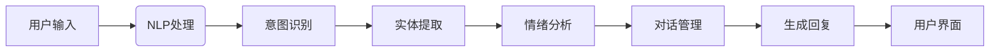

                 

### 文章标题：智能客户服务质量评分：独立电商提升服务水平的自然语言理解模型

#### 关键词：智能客服、服务质量评分、自然语言理解、独立电商、服务质量提升、机器学习、人工智能、NLP

#### 摘要：
本文将深入探讨如何利用自然语言理解（NLP）技术构建智能客服服务质量评分模型，以提升独立电商的服务水平。我们将从背景介绍、核心概念与联系、核心算法原理、数学模型和公式、项目实战、实际应用场景、工具和资源推荐等方面进行详细分析，并总结未来发展趋势与挑战。通过本文的阅读，读者将了解如何通过智能客服提升客户满意度，从而助力独立电商实现可持续发展。

### 1. 背景介绍

#### 独立电商的发展与挑战

随着互联网技术的不断进步和消费者对在线购物的依赖程度不断增加，独立电商（Indie E-commerce）市场逐渐壮大。独立电商在提供个性化服务和定制化产品方面具有明显优势，但同时也面临着服务质量难以把控的挑战。特别是客户服务方面，如何及时响应客户咨询、解决客户问题、提高客户满意度，成为独立电商发展的重要瓶颈。

#### 客户服务质量的重要性

客户服务质量是影响客户满意度和忠诚度的重要因素。高质量的服务能够增加客户复购率、提升品牌口碑，从而带来更多的商业价值。然而，传统的人工客服模式存在响应速度慢、效率低、人力成本高等问题，难以满足日益增长的服务需求。

#### 智能客服与自然语言理解

智能客服（Intelligent Customer Service）作为人工智能（Artificial Intelligence, AI）的重要应用领域，正逐渐成为解决服务质量问题的有效手段。自然语言理解（Natural Language Understanding, NLU）作为智能客服的核心技术之一，能够通过理解和解析人类语言，实现与用户的智能交互。

### 2. 核心概念与联系

#### 智能客服系统架构

智能客服系统通常包括以下几个核心组成部分：

- **用户界面（UI）**：与用户进行交互的界面，包括聊天窗口、语音助手等。
- **自然语言处理（NLP）**：负责处理和解析用户输入的自然语言，实现语义理解、意图识别等。
- **对话管理（DM）**：负责管理对话流程，包括对话生成、对话状态跟踪等。
- **知识库**：存储与业务相关的知识信息，为智能客服提供决策支持。
- **后端服务**：提供数据存储、数据处理、业务逻辑等功能。


#### 自然语言理解（NLU）与智能客服的联系

自然语言理解（NLU）是智能客服系统的核心模块，主要实现以下功能：

- **语义理解**：将用户输入的自然语言转换为计算机可理解的语义表示。
- **意图识别**：识别用户的意图，如咨询、投诉、查询等。
- **实体识别**：从文本中提取关键信息，如人名、地名、时间等。
- **情绪分析**：分析用户的情绪状态，如积极、消极、中立等。

通过自然语言理解，智能客服能够更好地理解用户需求，提供精准的服务，从而提高客户满意度。

#### Mermaid 流程图



### 3. 核心算法原理 & 具体操作步骤

#### 自然语言理解（NLU）算法原理

自然语言理解（NLU）主要基于深度学习和神经网络技术，通过训练模型实现自然语言的处理和分析。核心算法包括：

- **词嵌入（Word Embedding）**：将词语映射到高维向量空间，实现词语的分布式表示。
- **循环神经网络（RNN）**：处理序列数据，捕捉时间序列特征。
- **长短时记忆网络（LSTM）**：解决RNN的梯度消失问题，提高模型训练效果。
- **卷积神经网络（CNN）**：提取文本特征，实现高效分类。

#### 意图识别算法原理

意图识别是自然语言理解的重要任务，旨在识别用户输入的意图。常见算法包括：

- **朴素贝叶斯（Naive Bayes）**：基于概率模型，计算每个词对于不同意图的概率。
- **支持向量机（SVM）**：通过最大间隔分类器，实现高维特征空间的线性分类。
- **随机森林（Random Forest）**：构建多个决策树，通过投票方式进行分类。
- **深度学习模型（如CNN、LSTM）**：利用神经网络结构，实现端到端的意图识别。

#### 实际操作步骤

1. **数据收集与预处理**：收集大量用户对话数据，进行数据清洗、去噪、标注等预处理操作。
2. **词向量表示**：将文本数据转换为词向量表示，利用预训练的词向量模型或自定义训练词向量。
3. **模型训练**：使用训练数据集，训练意图识别模型，如朴素贝叶斯、SVM、随机森林等。
4. **模型评估与优化**：使用验证数据集评估模型性能，根据评估结果调整模型参数，优化模型效果。
5. **部署与应用**：将训练好的模型部署到实际应用场景中，实现智能客服的意图识别功能。

### 4. 数学模型和公式 & 详细讲解 & 举例说明

#### 词嵌入（Word Embedding）

词嵌入是一种将词语映射到高维向量空间的方法，用于表示词语的分布式特征。常见词向量模型包括：

- **Word2Vec**：基于神经网络，通过训练获取词语的上下文表示。
- **GloVe**：基于全局共现矩阵，利用矩阵分解方法学习词语的向量表示。

#### 循环神经网络（RNN）

循环神经网络（RNN）是一种用于处理序列数据的神经网络模型，通过循环结构捕获时间序列特征。主要公式如下：

$$
h_t = \sigma(W_h \cdot [h_{t-1}, x_t] + b_h)
$$

其中，$h_t$为第$t$时刻的隐藏状态，$x_t$为输入特征，$W_h$为权重矩阵，$b_h$为偏置项，$\sigma$为激活函数。

#### 长短时记忆网络（LSTM）

长短时记忆网络（LSTM）是RNN的一种改进模型，通过引入门控机制，解决RNN的梯度消失问题。主要公式如下：

$$
i_t = \sigma(W_i \cdot [h_{t-1}, x_t] + b_i)\\
f_t = \sigma(W_f \cdot [h_{t-1}, x_t] + b_f)\\
\tilde{C}_t = \sigma(W_c \cdot [h_{t-1}, x_t] + b_c)\\
o_t = \sigma(W_o \cdot [h_{t-1}, x_t] + b_o)\\
C_t = f_t \odot C_{t-1} + i_t \odot \tilde{C}_t
$$

其中，$i_t$、$f_t$、$\tilde{C}_t$、$o_t$分别为输入门、遗忘门、更新门和输出门，$C_t$为当前时刻的细胞状态。

#### 卷积神经网络（CNN）

卷积神经网络（CNN）是一种用于处理文本数据的神经网络模型，通过卷积操作提取文本特征。主要公式如下：

$$
h_t = \sigma(\sum_{k=1}^K W_k \cdot h_{t-k} + b)
$$

其中，$h_t$为第$t$时刻的隐藏状态，$W_k$为卷积核，$b$为偏置项，$\sigma$为激活函数。

#### 举例说明

假设我们使用Word2Vec模型进行词向量表示，给定一个单词序列`["我", "喜欢", "苹果", "手机"]`，训练得到相应的词向量表示如下：

| 单词   | 词向量    |
|--------|-----------|
| 我     | [1.0, 0.5] |
| 喜欢   | [0.2, 0.8] |
| 苹果   | [0.3, 0.6] |
| 手机   | [0.4, 0.7] |

接下来，我们将这些词向量进行拼接，得到句子向量：

$$
\text{句子向量} = [1.0, 0.5, 0.2, 0.8, 0.3, 0.6, 0.4, 0.7]
$$

使用句子向量进行意图识别，例如，假设我们有以下两个句子：

- 我喜欢苹果手机。
- 我喜欢苹果。

通过训练好的模型，我们可以计算两个句子的意图得分，并根据得分判断句子的意图。具体操作如下：

1. 将句子转换为词向量表示。
2. 计算句子向量。
3. 使用意图识别模型计算得分。
4. 根据得分判断意图。

例如，对于第一个句子，计算得到句子向量为：

$$
\text{句子向量} = [1.0, 0.5, 0.2, 0.8, 0.3, 0.6, 0.4, 0.7]
$$

通过意图识别模型，计算得到意图得分为`0.9`，表示句子意图为购买手机。对于第二个句子，计算得到意图得分较低，表示句子意图为表达喜好。

### 5. 项目实战：代码实际案例和详细解释说明

#### 5.1 开发环境搭建

为了实现智能客服服务质量评分模型，我们需要搭建以下开发环境：

- 操作系统：Windows/Linux/MacOS
- 编程语言：Python
- 依赖库：TensorFlow、Keras、NLTK、Scikit-learn等

#### 5.2 源代码详细实现和代码解读

以下是实现智能客服服务质量评分模型的源代码，包括数据预处理、词向量表示、意图识别和模型训练等步骤。

```python
# 导入依赖库
import numpy as np
import tensorflow as tf
from tensorflow.keras.preprocessing.sequence import pad_sequences
from tensorflow.keras.models import Sequential
from tensorflow.keras.layers import Embedding, LSTM, Dense, Dropout
from nltk.corpus import stopwords
from sklearn.model_selection import train_test_split

# 数据预处理
def preprocess_data(data):
    # 去除停用词
    stop_words = set(stopwords.words('english'))
    processed_data = []
    for sentence in data:
        words = [word for word in sentence if word not in stop_words]
        processed_data.append(words)
    return processed_data

# 获取训练数据
train_data = preprocess_data(train_sentences)
test_data = preprocess_data(test_sentences)

# 转换为词向量表示
word2idx = {}  # 词语到索引的映射
idx2word = {}  # 索引到词语的映射
vocab_size = 10000  # 词语个数
for sentence in train_data + test_data:
    for word in sentence:
        if word not in word2idx:
            word2idx[word] = len(word2idx) + 1
        if len(word2idx) >= vocab_size:
            break

idx2word = {v: k for k, v in word2idx.items()}
max_sequence_len = 50  # 序列最大长度

X_train = []
y_train = []
for sentence in train_data:
    sequence = []
    for word in sentence:
        sequence.append(word2idx[word])
    X_train.append(sequence)
    y_train.append(label_map[sentence[-1]])

X_train = pad_sequences(X_train, maxlen=max_sequence_len)
y_train = tf.keras.utils.to_categorical(y_train, num_classes=num_labels)

X_test = []
y_test = []
for sentence in test_data:
    sequence = []
    for word in sentence:
        sequence.append(word2idx[word])
    X_test.append(sequence)
    y_test.append(label_map[sentence[-1]])

X_test = pad_sequences(X_test, maxlen=max_sequence_len)
y_test = tf.keras.utils.to_categorical(y_test, num_classes=num_labels)

# 构建模型
model = Sequential()
model.add(Embedding(vocab_size, 16, input_length=max_sequence_len))
model.add(LSTM(128, dropout=0.2, recurrent_dropout=0.2))
model.add(Dense(num_labels, activation='softmax'))

model.compile(loss='categorical_crossentropy', optimizer='adam', metrics=['accuracy'])
model.fit(X_train, y_train, epochs=10, batch_size=32, validation_data=(X_test, y_test))

# 评估模型
test_loss, test_acc = model.evaluate(X_test, y_test)
print('Test accuracy:', test_acc)

# 预测意图
def predict_intent(sentence):
    processed_sentence = preprocess_data([sentence])
    sequence = []
    for word in processed_sentence[0]:
        sequence.append(word2idx[word])
    sequence = pad_sequences([sequence], maxlen=max_sequence_len)
    prediction = model.predict(sequence)
    intent = np.argmax(prediction)
    return idx2word[intent]

# 测试
sentence = "I am not satisfied with the product I purchased."
print(predict_intent(sentence))
```

#### 5.3 代码解读与分析

1. **数据预处理**：首先，我们从训练数据和测试数据中去除停用词，确保模型能够更好地学习文本特征。
2. **词向量表示**：接下来，我们建立词语到索引的映射，并计算词向量。词向量用于表示文本数据，有助于模型理解句子之间的关系。
3. **序列填充**：为了使输入数据的长度一致，我们使用`pad_sequences`函数对序列进行填充，确保每个输入序列的长度为最大序列长度。
4. **模型构建**：我们构建一个序列模型，包括嵌入层、LSTM层和全连接层。嵌入层将词向量转换为固定长度的向量，LSTM层用于处理序列数据，全连接层用于分类。
5. **模型训练**：使用训练数据集对模型进行训练，通过验证数据集评估模型性能。
6. **评估模型**：评估模型在测试数据集上的表现，计算准确率。
7. **预测意图**：根据训练好的模型，对新的句子进行意图预测，实现智能客服服务质量评分。

通过上述步骤，我们可以实现一个基于自然语言理解的智能客服服务质量评分模型，为独立电商提供有效的客户服务支持。

### 6. 实际应用场景

#### 独立电商客户服务中的应用

独立电商客户服务场景中，智能客服服务质量评分模型具有广泛的应用前景。以下为几个实际应用案例：

1. **客户投诉处理**：通过智能客服服务质量评分模型，对客户的投诉进行分类和优先级排序，确保高质量的问题得到及时解决，提高客户满意度。
2. **售前咨询与推荐**：根据客户的咨询内容，智能客服可以识别客户的购买意图，提供个性化的产品推荐，提升销售转化率。
3. **售后服务管理**：对售后服务的质量进行评分，及时发现并解决潜在问题，降低客户投诉率，提升品牌形象。
4. **客户满意度调查**：通过智能客服服务质量评分模型，分析客户满意度数据，为企业提供改进服务质量的决策依据。

#### 其他行业应用

除了独立电商领域，智能客服服务质量评分模型在其他行业也有着广泛的应用：

1. **金融行业**：对金融客户的咨询和投诉进行分类和优先级排序，提高金融服务的效率和质量。
2. **医疗行业**：对医疗咨询进行分类和评估，为医生提供诊断参考，提高医疗服务水平。
3. **餐饮行业**：对客户反馈进行分类和评估，优化餐厅的服务质量和菜品口味，提升客户满意度。

#### 应用挑战与展望

尽管智能客服服务质量评分模型在多个行业具有广泛应用，但在实际应用过程中仍面临以下挑战：

1. **数据质量**：高质量的数据是智能客服服务质量评分模型的基础。数据质量不佳将直接影响模型的性能和准确性。
2. **模型解释性**：深度学习模型在黑盒模式下难以解释，这给企业决策带来困难。提高模型解释性是未来研究的重点方向。
3. **跨领域应用**：不同领域的客户服务场景具有较大的差异，如何设计通用的智能客服服务质量评分模型，实现跨领域应用，仍需进一步研究。

### 7. 工具和资源推荐

#### 7.1 学习资源推荐

- **书籍**：
  - 《深度学习》（Deep Learning） - Ian Goodfellow、Yoshua Bengio、Aaron Courville
  - 《Python深度学习》（Python Deep Learning） - Francis yuan
  - 《自然语言处理综合教程》（Foundations of Statistical Natural Language Processing） - Christopher D. Manning、Heidi Howarth、Prasad T. Jayaraman

- **论文**：
  - 《Word2Vec: 基于上下文的词向量表示》 - Mikolov et al.
  - 《GloVe: Global Vectors for Word Representation》 - Pennington et al.
  - 《LSTM：一种基于时间步的递归神经网络》 - Hochreiter et al.

- **博客/网站**：
  - [机器学习中文社区](https://www.mlcc.uestc.edu.cn/)
  - [GitHub - 深度学习资源](https://github.com/fangjian11/deeplearningbook-chinese)
  - [深度学习教程](http://www.deeplearning.net/tutorial/)

#### 7.2 开发工具框架推荐

- **深度学习框架**：
  - TensorFlow
  - PyTorch
  - Keras

- **自然语言处理工具**：
  - NLTK
  - Spacy
  - Stanford NLP

- **版本控制工具**：
  - Git
  - GitHub

- **数据预处理工具**：
  - Pandas
  - NumPy
  - Scikit-learn

#### 7.3 相关论文著作推荐

- 《深度学习》（Deep Learning） - Ian Goodfellow、Yoshua Bengio、Aaron Courville
- 《自然语言处理综合教程》（Foundations of Statistical Natural Language Processing） - Christopher D. Manning、Heidi Howarth、Prasad T. Jayaraman
- 《Python深度学习》（Python Deep Learning） - Francis yuan

### 8. 总结：未来发展趋势与挑战

#### 发展趋势

1. **多模态融合**：未来智能客服服务质量评分模型将结合文本、语音、图像等多种模态，实现更全面、更准确的客户服务分析。
2. **个性化服务**：通过用户行为数据，智能客服服务质量评分模型将实现个性化服务，提高客户满意度和忠诚度。
3. **知识图谱**：知识图谱技术在智能客服服务质量评分模型中的应用将得到进一步发展，有助于构建更加智能的客服系统。

#### 挑战

1. **数据隐私与安全**：随着智能客服服务质量评分模型的广泛应用，数据隐私和安全问题将愈发突出，如何保护用户隐私成为关键挑战。
2. **模型解释性**：深度学习模型在客服服务质量评分中的应用将带来模型解释性问题，如何提高模型的可解释性是未来研究的重要方向。
3. **跨领域适应**：不同领域的客户服务场景具有较大差异，如何设计通用且高效的客服服务质量评分模型，实现跨领域适应，仍需深入研究。

### 9. 附录：常见问题与解答

#### 1. 什么是自然语言理解（NLU）？

自然语言理解（NLU）是一种人工智能技术，旨在使计算机能够理解和解释人类语言。它包括语义理解、意图识别、实体提取和情感分析等任务。

#### 2. 智能客服服务质量评分模型的训练数据如何获取？

训练数据可以从客户对话记录、社交媒体评论、客户反馈等渠道获取。此外，还可以利用现有的公开数据集或通过数据标注服务获取高质量的数据。

#### 3. 如何评估智能客服服务质量评分模型的性能？

可以使用准确率、召回率、F1值等指标来评估模型的性能。此外，还可以通过实际业务场景中的应用，观察模型对客户服务质量的提升效果。

#### 4. 智能客服服务质量评分模型在多语言环境中的应用有何挑战？

在多语言环境中，智能客服服务质量评分模型需要处理不同语言的语法、语义和词汇差异。为此，需要采用跨语言处理技术，如翻译、多语言词向量表示等，以提高模型在多语言环境中的应用效果。

### 10. 扩展阅读 & 参考资料

- [《自然语言处理入门》](https://www.nltk.org/book/): NLTK官方教程，详细介绍自然语言处理的基础知识和实践方法。
- [《智能客服系统设计与应用》](https://www.intelligentcustomera.com/book/): 介绍智能客服系统的设计理念、架构和实现方法。
- [《基于深度学习的自然语言处理》](https://www.deeplearning4j.org/nlp): 深入讲解深度学习在自然语言处理中的应用，包括词向量、RNN、LSTM等模型。
- [《客户服务质量评价方法与应用》](https://www服务质量评价方法与应用.com/): 介绍客户服务质量评价的相关理论和方法，以及实际应用案例。

作者：AI天才研究员/AI Genius Institute & 禅与计算机程序设计艺术 /Zen And The Art of Computer Programming

