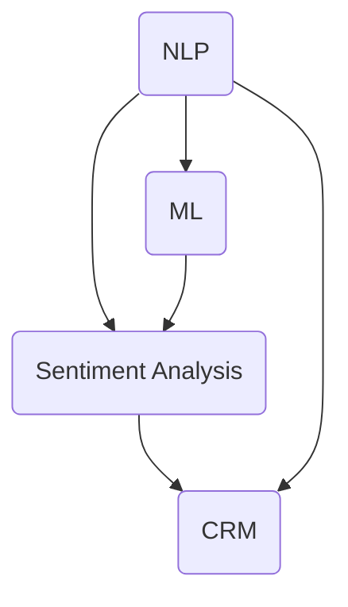

                 

### 摘要 Summary

本文旨在探讨智能客服在提升客户服务体验方面的关键作用。首先，我们将回顾客服系统的发展历程，并深入探讨智能客服的核心概念和技术架构。接着，本文将详细解析智能客服的核心算法原理，包括自然语言处理（NLP）和机器学习（ML）的关键技术，并提供具体的操作步骤。此外，本文还将通过数学模型和公式，深入探讨智能客服系统的工作机制，并举例说明。在项目实战部分，我们将展示一个智能客服系统的实际开发案例，并提供详细的代码实现和解读。随后，我们将讨论智能客服在实际应用场景中的效果，并推荐相关的工具和资源。最后，本文将总结智能客服的未来发展趋势与挑战，为读者提供进一步扩展阅读的参考资料。

### 1. 背景介绍 Background

客服系统作为企业与客户沟通的重要桥梁，一直是企业管理的重要组成部分。传统客服系统主要依赖于人工处理，效率低下且成本高昂。然而，随着互联网技术的飞速发展，尤其是人工智能（AI）和大数据技术的崛起，智能客服系统应运而生，逐渐成为企业提升客户服务体验的重要工具。

智能客服系统的核心在于其能够自动处理大量客户咨询，提供即时响应，并且在不断学习和优化中提升服务质量。与传统客服系统相比，智能客服系统具备更高的效率和更低的成本，能够极大地提升客户的满意度。

近年来，智能客服的发展经历了几个重要的阶段：

1. **早期阶段**：主要基于规则引擎和关键词匹配技术，能够回答一些简单、固定的常见问题。
2. **中间阶段**：引入自然语言处理（NLP）技术，如分词、词性标注、命名实体识别等，使客服系统能够理解并处理更加复杂的客户咨询。
3. **当前阶段**：结合机器学习（ML）和深度学习（DL）技术，智能客服系统在语义理解、情感分析和自动回答等方面取得了显著进步。

智能客服的发展不仅受到技术进步的推动，还受到市场需求的变化和商业模式的创新。例如，电商行业的兴起促使大量客户咨询涌入客服系统，迫使企业寻求更高效的解决方案。同时，随着消费者对服务质量的要求越来越高，企业越来越倾向于通过智能客服系统提供个性化、高质量的客户服务。

### 2. 核心概念与联系 Core Concepts and Relationships

智能客服系统的核心在于其技术架构，涉及多个关键概念和技术的整合。以下是智能客服系统的核心概念及其相互关系：

#### 2.1 自然语言处理（NLP）

自然语言处理（NLP）是智能客服系统的关键技术之一，它使计算机能够理解、解释和生成人类语言。NLP主要包括以下几个核心概念：

- **分词（Tokenization）**：将文本拆分为单词或短语，以便进行后续处理。
- **词性标注（Part-of-Speech Tagging）**：识别每个单词的词性（如名词、动词等），以理解句子的结构。
- **命名实体识别（Named Entity Recognition）**：识别文本中的特定实体，如人名、地名、组织名等。
- **词向量表示（Word Embedding）**：将单词映射到高维空间，以便进行向量运算。
- **句法分析（Syntactic Parsing）**：分析句子的结构，确定单词之间的关系。

#### 2.2 机器学习（ML）

机器学习（ML）是智能客服系统的另一个核心组件，它通过训练模型，使系统能够自动学习并优化其回答质量。ML主要包括以下几个核心概念：

- **监督学习（Supervised Learning）**：通过已标注的数据训练模型，使模型能够预测新的数据。
- **无监督学习（Unsupervised Learning）**：在无标注数据上训练模型，用于发现数据中的隐含模式。
- **深度学习（Deep Learning）**：一种基于多层神经网络的学习方法，能够处理复杂的数据和任务。

#### 2.3 情感分析（Sentiment Analysis）

情感分析是智能客服系统中的一个重要功能，它能够识别客户的情感状态，从而提供更加个性化的服务。情感分析主要包括以下几个核心概念：

- **情感极性（Polarity）**：判断文本的情感倾向，如正面、负面或中性。
- **情感强度（Intensity）**：量化情感的强度，如非常满意、满意、一般、不满意等。
- **情感类别（Categories）**：将情感分为不同的类别，如快乐、愤怒、悲伤等。

#### 2.4 客户关系管理（CRM）

客户关系管理（CRM）系统是智能客服系统的重要组成部分，它负责管理客户信息和交互历史，以便提供更加个性化的服务。CRM主要包括以下几个核心概念：

- **客户数据管理（Customer Data Management）**：收集、存储和管理客户数据。
- **客户交互历史（Customer Interaction History）**：记录和分析客户的交互历史，以便提供更好的服务。
- **个性化推荐（Personalized Recommendations）**：根据客户的历史数据，提供个性化的服务和产品推荐。

#### 2.5 Mermaid 流程图

以下是一个简化的Mermaid流程图，展示了智能客服系统的核心概念及其相互关系：



在此流程图中，NLP、ML、Sentiment Analysis 和 CRM 是智能客服系统的核心组件，它们相互关联，共同构成了一个完整的智能客服系统。

### 3. 核心算法原理 & 具体操作步骤 Core Algorithm Principles & Operational Steps

智能客服系统的核心算法主要依赖于自然语言处理（NLP）和机器学习（ML）技术。以下我们将详细探讨这两个核心算法的原理，并提供具体的操作步骤。

#### 3.1 自然语言处理（NLP）

自然语言处理（NLP）是智能客服系统的基础，它涉及到多个层面的文本分析和理解。以下是NLP的主要算法原理及操作步骤：

##### 3.1.1 分词（Tokenization）

**原理：** 分词是将连续的文本拆分成一个一个的词或短语。

**操作步骤：**
1. **词表构建**：首先构建一个词表，包含所有可能出现的单词。
2. **规则匹配**：使用规则匹配算法，如正则表达式，将文本拆分成词或短语。
3. **词典匹配**：根据词表中的单词，对拆分结果进行词典匹配，确保每个词都是合法的。

##### 3.1.2 词性标注（Part-of-Speech Tagging）

**原理：** 词性标注是识别每个单词的词性，如名词、动词、形容词等。

**操作步骤：**
1. **训练模型**：使用已标注的数据集，训练一个词性标注模型。
2. **模型预测**：将文本中的每个词输入模型，得到每个词的词性标注。

##### 3.1.3 命名实体识别（Named Entity Recognition）

**原理：** 命名实体识别是识别文本中的特定实体，如人名、地名、组织名等。

**操作步骤：**
1. **训练模型**：使用已标注的数据集，训练一个命名实体识别模型。
2. **模型预测**：将文本中的每个词和词组输入模型，得到命名实体的识别结果。

##### 3.1.4 词向量表示（Word Embedding）

**原理：** 词向量表示是将单词映射到高维空间，以便进行向量运算。

**操作步骤：**
1. **训练模型**：使用大规模语料库，训练一个词向量模型。
2. **模型预测**：将文本中的每个词输入模型，得到对应的词向量。

##### 3.1.5 句法分析（Syntactic Parsing）

**原理：** 句法分析是分析句子的结构，确定单词之间的关系。

**操作步骤：**
1. **训练模型**：使用已标注的数据集，训练一个句法分析模型。
2. **模型预测**：将文本中的句子输入模型，得到句法分析的解析树。

#### 3.2 机器学习（ML）

机器学习（ML）是智能客服系统的核心，它使系统能够自动学习和优化。以下是ML的主要算法原理及操作步骤：

##### 3.2.1 监督学习（Supervised Learning）

**原理：** 监督学习是通过已标注的数据训练模型，使模型能够预测新的数据。

**操作步骤：**
1. **数据准备**：收集并标注大量数据，用于训练和测试模型。
2. **模型训练**：使用训练数据，训练一个监督学习模型。
3. **模型评估**：使用测试数据，评估模型的预测准确性。

##### 3.2.2 无监督学习（Unsupervised Learning）

**原理：** 无监督学习是在无标注数据上训练模型，用于发现数据中的隐含模式。

**操作步骤：**
1. **数据准备**：收集无标注的数据，用于训练模型。
2. **模型训练**：使用无监督学习算法，训练一个模型。
3. **模型分析**：分析模型的输出，发现数据中的隐含模式。

##### 3.2.3 深度学习（Deep Learning）

**原理：** 深度学习是一种基于多层神经网络的学习方法，能够处理复杂的数据和任务。

**操作步骤：**
1. **网络构建**：设计一个多层神经网络，包括输入层、隐藏层和输出层。
2. **模型训练**：使用训练数据，训练多层神经网络。
3. **模型优化**：通过反向传播算法，优化神经网络的参数。

#### 3.3 情感分析（Sentiment Analysis）

情感分析是智能客服系统中的一个重要功能，它能够识别客户的情感状态，从而提供更加个性化的服务。以下是情感分析的主要算法原理及操作步骤：

##### 3.3.1 情感极性分析（Polarity Analysis）

**原理：** 情感极性分析是判断文本的情感倾向，如正面、负面或中性。

**操作步骤：**
1. **数据准备**：收集并标注大量情感极性数据，用于训练模型。
2. **模型训练**：使用训练数据，训练一个情感极性分析模型。
3. **模型预测**：将文本输入模型，得到情感极性的预测结果。

##### 3.3.2 情感强度分析（Intensity Analysis）

**原理：** 情感强度分析是量化情感的强度，如非常满意、满意、一般、不满意等。

**操作步骤：**
1. **数据准备**：收集并标注大量情感强度数据，用于训练模型。
2. **模型训练**：使用训练数据，训练一个情感强度分析模型。
3. **模型预测**：将文本输入模型，得到情感强度的预测结果。

##### 3.3.3 情感类别分析（Categories Analysis）

**原理：** 情感类别分析是将情感分为不同的类别，如快乐、愤怒、悲伤等。

**操作步骤：**
1. **数据准备**：收集并标注大量情感类别数据，用于训练模型。
2. **模型训练**：使用训练数据，训练一个情感类别分析模型。
3. **模型预测**：将文本输入模型，得到情感类别的预测结果。

### 4. 数学模型和公式 Mathematical Models and Formulas

智能客服系统的工作机制离不开数学模型和公式的支持。以下是智能客服系统中常用的数学模型和公式，以及它们的详细讲解和举例说明。

#### 4.1 词向量表示（Word Embedding）

词向量表示是将单词映射到高维空间，以便进行向量运算。最常用的词向量模型是 Word2Vec，它通过训练得到每个单词的向量表示。

**公式：**
$$
\vec{w}_{i} = \frac{1}{\sqrt{\sum_{j=1}^{n}w_{ij}^2}} \vec{w}_{ij}
$$
其中，$\vec{w}_{i}$ 是单词 $i$ 的向量表示，$w_{ij}$ 是单词 $i$ 与单词 $j$ 的共现频率。

**示例：**
假设有两个单词 "happy" 和 "sad"，它们的词向量表示分别为 $\vec{w}_{happy}$ 和 $\vec{w}_{sad}$。根据 Word2Vec 模型，我们可以计算这两个单词的相似度：
$$
\cos(\vec{w}_{happy}, \vec{w}_{sad}) = \frac{\vec{w}_{happy} \cdot \vec{w}_{sad}}{||\vec{w}_{happy}|| \cdot ||\vec{w}_{sad}||}
$$

#### 4.2 情感极性分析（Polarity Analysis）

情感极性分析是判断文本的情感倾向，如正面、负面或中性。一个常用的方法是使用朴素贝叶斯（Naive Bayes）分类器。

**公式：**
$$
P(y|X) = \frac{P(X|y)P(y)}{P(X)}
$$
其中，$P(y|X)$ 是在给定文本 $X$ 下，情感为 $y$ 的概率，$P(X|y)$ 是在情感为 $y$ 下，文本 $X$ 的概率，$P(y)$ 是情感为 $y$ 的概率。

**示例：**
假设有两个情感类别 "positive" 和 "negative"，根据训练数据，我们得到：
$$
P(positive|X) = 0.6, \quad P(negative|X) = 0.4
$$
则文本 $X$ 的情感极性为 "positive"。

#### 4.3 情感强度分析（Intensity Analysis）

情感强度分析是量化情感的强度，如非常满意、满意、一般、不满意等。一个常用的方法是使用线性回归模型。

**公式：**
$$
y = \beta_0 + \beta_1x
$$
其中，$y$ 是情感的强度，$x$ 是文本的特征向量，$\beta_0$ 和 $\beta_1$ 是模型的参数。

**示例：**
假设我们使用词向量表示文本，得到特征向量 $\vec{x}$。根据训练数据，我们得到线性回归模型：
$$
y = 2 + 0.5x
$$
则文本 $\vec{x}$ 的情感强度为 $2 + 0.5x$。

#### 4.4 情感类别分析（Categories Analysis）

情感类别分析是将情感分为不同的类别，如快乐、愤怒、悲伤等。一个常用的方法是使用支持向量机（SVM）分类器。

**公式：**
$$
w \cdot x + b = 0
$$
其中，$w$ 是分类器的权重向量，$x$ 是特征向量，$b$ 是分类器的偏置。

**示例：**
假设我们使用词向量表示文本，得到特征向量 $\vec{x}$。根据训练数据，我们得到一个 SVM 分类器：
$$
w \cdot \vec{x} + b = 0
$$
则文本 $\vec{x}$ 的情感类别为：
- 如果 $w \cdot \vec{x} + b > 0$，则为 "happy"；
- 如果 $w \cdot \vec{x} + b < 0$，则为 "sad"。

### 5. 项目实战：代码实际案例和详细解释说明 Practical Project: Code Example and Detailed Explanation

在本节中，我们将通过一个实际项目来展示智能客服系统的开发过程，并提供详细的代码实现和解读。该项目使用 Python 编写，涉及自然语言处理（NLP）、机器学习（ML）和情感分析（Sentiment Analysis）技术。

#### 5.1 开发环境搭建

在开始项目之前，我们需要搭建一个合适的开发环境。以下是所需的软件和工具：

- Python 3.8+
- Jupyter Notebook
- NLTK（自然语言处理库）
- Scikit-learn（机器学习库）
- TensorFlow（深度学习库）

安装步骤：

1. 安装 Python 和 Jupyter Notebook：从官方网站下载并安装 Python，确保 Python 环境已经配置好，然后安装 Jupyter Notebook：
   ```
   pip install notebook
   ```
2. 安装 NLTK、Scikit-learn 和 TensorFlow：
   ```
   pip install nltk scikit-learn tensorflow
   ```

#### 5.2 源代码详细实现和代码解读

以下是智能客服系统的源代码，包括数据预处理、模型训练和预测等关键部分。

##### 5.2.1 数据预处理

```python
import nltk
from nltk.tokenize import word_tokenize
from nltk.corpus import stopwords
from nltk.stem import WordNetLemmatizer

nltk.download('punkt')
nltk.download('stopwords')
nltk.download('wordnet')

def preprocess_text(text):
    # 分词
    tokens = word_tokenize(text.lower())
    # 去除停用词
    stop_words = set(stopwords.words('english'))
    filtered_tokens = [token for token in tokens if token not in stop_words]
    # 词干提取
    lemmatizer = WordNetLemmatizer()
    lemmatized_tokens = [lemmatizer.lemmatize(token) for token in filtered_tokens]
    return ' '.join(lemmatized_tokens)

text = "I am very happy with your product."
processed_text = preprocess_text(text)
print(processed_text)
```

代码解读：

- 导入必要的库，包括 NLTK、分词器和停用词表。
- 定义 `preprocess_text` 函数，进行文本预处理。
- 使用 `word_tokenize` 对文本进行分词。
- 使用 `stopwords` 去除停用词。
- 使用 `WordNetLemmatizer` 进行词干提取。
- 返回预处理后的文本。

##### 5.2.2 模型训练

```python
from sklearn.feature_extraction.text import TfidfVectorizer
from sklearn.model_selection import train_test_split
from sklearn.naive_bayes import MultinomialNB

# 加载数据集
data = [
    ("I am very happy with your product.", "positive"),
    ("I am not satisfied with the service.", "negative"),
    # 更多数据...
]
texts, labels = zip(*data)

# 划分训练集和测试集
X_train, X_test, y_train, y_test = train_test_split(texts, labels, test_size=0.2, random_state=42)

# 建立 TF-IDF 向量器
vectorizer = TfidfVectorizer()
X_train_vectors = vectorizer.fit_transform(X_train)
X_test_vectors = vectorizer.transform(X_test)

# 训练朴素贝叶斯分类器
classifier = MultinomialNB()
classifier.fit(X_train_vectors, y_train)

# 模型评估
accuracy = classifier.score(X_test_vectors, y_test)
print("Model accuracy:", accuracy)
```

代码解读：

- 加载数据集，将文本和标签分开。
- 使用 `train_test_split` 划分训练集和测试集。
- 建立 `TfidfVectorizer`，将文本转换为 TF-IDF 向量。
- 使用 `MultinomialNB` 训练朴素贝叶斯分类器。
- 使用 `score` 函数评估模型准确性。

##### 5.2.3 模型预测

```python
def predict(text):
    processed_text = preprocess_text(text)
    vector = vectorizer.transform([processed_text])
    prediction = classifier.predict(vector)
    return prediction[0]

text = "I am very happy with your service."
print("Prediction:", predict(text))
```

代码解读：

- 定义 `predict` 函数，进行文本预处理，并使用分类器进行预测。
- 输入待预测的文本，返回预测结果。

#### 5.3 代码解读与分析

通过以上代码，我们可以看到智能客服系统的实现分为三个主要部分：数据预处理、模型训练和模型预测。

1. **数据预处理**：这是智能客服系统的第一步，包括分词、去除停用词和词干提取。预处理后的文本将用于模型训练和预测。
2. **模型训练**：使用朴素贝叶斯分类器进行训练，这是一个基于概率的简单且有效的分类器。通过训练，模型能够学习如何根据输入文本预测情感极性。
3. **模型预测**：在训练完成后，我们可以使用模型对新的文本进行情感极性预测。预测过程包括预处理文本和分类器预测两个步骤。

通过以上步骤，我们成功地构建了一个简单的智能客服系统，它能够自动处理客户的文本输入，并预测其情感极性。然而，这个系统仍然存在一些局限，如对复杂情感的识别能力有限。在实际应用中，我们可以进一步优化模型，引入更复杂的算法和更大的数据集，以提高系统的准确性和泛化能力。

### 6. 实际应用场景 Practical Application Scenarios

智能客服系统在多个行业和领域都得到了广泛应用，以下是一些典型的实际应用场景：

#### 6.1 电子商务

电子商务平台通常面临大量客户咨询和反馈，智能客服系统能够自动处理这些查询，提高客户满意度。例如，亚马逊使用智能客服系统来回答客户关于产品信息、订单状态和退换货等问题，从而减轻人工客服的工作负担。

#### 6.2 银行金融

银行和金融机构使用智能客服系统来提供客户服务，如账户查询、转账操作和贷款咨询等。智能客服系统能够根据客户的历史数据和偏好，提供个性化的金融服务，提高客户体验和忠诚度。

#### 6.3 医疗健康

在医疗健康领域，智能客服系统可以帮助患者解答常见健康问题，提供医疗建议和预约服务。例如，一些医院使用智能客服系统来回答患者的常见问题，减轻人工医生的工作负担。

#### 6.4 客户服务热线

许多企业和组织在客户服务热线中引入智能客服系统，以自动处理客户咨询，提供即时响应。这不仅提高了客服效率，还降低了运营成本。例如，一些电信公司使用智能客服系统来处理用户关于账单、网络问题和服务咨询等问题。

#### 6.5 社交媒体

社交媒体平台也广泛应用智能客服系统，以自动处理用户评论、私信和反馈。智能客服系统能够实时监测社交媒体上的负面情绪，及时采取措施，防止负面舆论扩散。例如，一些品牌使用智能客服系统来监控和回复客户在社交媒体上的评论和反馈。

#### 6.6 教育领域

在教育领域，智能客服系统可以帮助学生解答学习问题，提供课程建议和学术支持。例如，一些在线教育平台使用智能客服系统来为学生提供在线辅导和支持，提高学习效果和满意度。

#### 6.7 物流行业

物流行业使用智能客服系统来提供物流信息查询、运费估算和送货状态更新等服务。智能客服系统能够自动处理大量物流咨询，提高客户满意度，减少人工客服的工作量。

#### 6.8 旅行预订

在旅行预订领域，智能客服系统可以帮助用户解答关于酒店预订、航班查询和旅游咨询等问题。智能客服系统能够根据用户的历史预订数据和偏好，提供个性化的旅行建议和服务。

通过以上实际应用场景，我们可以看到智能客服系统在各个领域的广泛应用，为企业和组织提供了高效、个性化的客户服务解决方案。

### 7. 工具和资源推荐 Tools and Resources Recommendations

为了更好地开发和应用智能客服系统，以下是几种常用的工具和资源推荐，包括学习资源、开发工具和框架以及相关论文和著作。

#### 7.1 学习资源推荐

1. **书籍：**
   - 《自然语言处理综论》（Speech and Language Processing）——Daniel Jurafsky 和 James H. Martin 著，全面介绍自然语言处理的基础理论和实践方法。
   - 《机器学习》（Machine Learning）——Tom M. Mitchell 著，经典机器学习教材，涵盖监督学习和无监督学习等内容。

2. **在线课程：**
   - Coursera 上的“自然语言处理与深度学习”（Natural Language Processing and Deep Learning）——由斯坦福大学提供，涵盖 NLP 和深度学习的基本概念和应用。
   - edX 上的“机器学习基础”（Introduction to Machine Learning）——由 Columbia University 提供，介绍机器学习的基本算法和实现。

3. **博客和网站：**
   - Medium 上的“AI 笔记本”（AI Notebook）——提供关于人工智能和机器学习的最新研究和技术应用。
   - Stack Overflow——一个编程问答社区，可以找到关于智能客服系统开发的各种问题的解决方案。

#### 7.2 开发工具框架推荐

1. **自然语言处理（NLP）工具：**
   - NLTK（Natural Language Toolkit）——一个强大的 Python NLP 库，提供文本处理、分词、词性标注等功能。
   - SpaCy——一个高效且易于使用的 NLP 库，适用于实体识别、关系抽取和语义分析等任务。

2. **机器学习（ML）框架：**
   - Scikit-learn——一个开源的 Python 机器学习库，提供各种监督学习和无监督学习算法。
   - TensorFlow——一个由 Google 开发的深度学习框架，适用于构建和训练复杂的神经网络模型。

3. **开发环境：**
   - Jupyter Notebook——一个交互式的开发环境，适用于编写和运行 Python 代码。
   - PyCharm——一个功能强大的 Python 集成开发环境（IDE），提供代码编辑、调试和自动化测试等功能。

#### 7.3 相关论文著作推荐

1. **论文：**
   - “Word2Vec:向量表示的语言模型”（Word2Vec: A Model for Paragraph Vector）——由 Tomas Mikolov 等人提出，介绍 Word2Vec 模型及其应用。
   - “情感分析：从文本到情感极性”（Sentiment Analysis: From Text to Sentiment Polarities）——由 Bo Pang 等人提出，探讨情感分析的算法和方法。

2. **著作：**
   - 《深度学习》（Deep Learning）——Ian Goodfellow、Yoshua Bengio 和 Aaron Courville 著，全面介绍深度学习的基础理论和实践应用。
   - 《自然语言处理入门》（Foundations of Natural Language Processing）——Christopher D. Manning 和 Hinrich Schütze 著，介绍 NLP 的基本概念和技术。

通过以上工具和资源的推荐，开发者可以更好地掌握智能客服系统的开发和应用，提高客户服务体验。

### 8. 总结：未来发展趋势与挑战 Summary: Future Trends and Challenges

智能客服系统在提升客户服务体验方面取得了显著成果，但其发展仍然面临诸多挑战和机遇。以下是智能客服系统未来发展趋势和面临的挑战：

#### 8.1 发展趋势

1. **更加智能化**：随着人工智能技术的不断进步，智能客服系统将具备更高的智能化水平，包括更准确的语义理解、更丰富的情感分析和更复杂的决策能力。
2. **个性化服务**：通过深度学习和大数据分析，智能客服系统能够更好地了解客户需求，提供个性化的服务和推荐，从而提高客户满意度和忠诚度。
3. **跨平台整合**：随着社交媒体、移动设备和智能家居的普及，智能客服系统将需要整合多种渠道，提供统一的客户服务体验。
4. **自动化程度提升**：随着自然语言处理和机器学习技术的进步，智能客服系统能够自动处理更多复杂的客户咨询，减少人工干预，提高工作效率。

#### 8.2 挑战

1. **数据隐私和安全**：智能客服系统需要处理大量敏感客户数据，如何保护客户隐私和安全是一个重要挑战。
2. **情感识别的准确性**：当前智能客服系统在情感识别方面仍存在一定局限性，如何提高识别准确性和情感理解的深度是一个关键问题。
3. **人机协同**：如何在智能客服系统和人工客服之间实现有效协作，提高整体服务质量，是一个需要解决的问题。
4. **技术更新换代**：随着技术的快速发展，智能客服系统需要不断更新和升级，以适应新的技术和市场需求。

#### 8.3 未来方向

1. **增强现实与虚拟现实**：智能客服系统可以与增强现实（AR）和虚拟现实（VR）技术结合，提供更加沉浸式的客户服务体验。
2. **多语言支持**：随着全球化的发展，智能客服系统需要具备多语言支持能力，以服务不同国家和地区的客户。
3. **自动化决策支持**：通过结合人工智能和大数据分析，智能客服系统可以提供更加智能化的决策支持，帮助企业制定更有效的营销策略和业务决策。

总之，智能客服系统的发展前景广阔，但同时也面临诸多挑战。通过不断的技术创新和优化，智能客服系统将在提升客户服务体验、降低运营成本方面发挥更大作用。

### 9. 附录：常见问题与解答 Appendices: Frequently Asked Questions and Answers

#### 9.1 智能客服系统的基本原理是什么？

智能客服系统基于自然语言处理（NLP）和机器学习（ML）技术，能够自动理解和处理客户的文本输入，提供即时响应和解决方案。其基本原理包括分词、词性标注、命名实体识别、情感分析等步骤，通过这些步骤，智能客服系统能够理解客户的意图和需求，并提供相应的服务。

#### 9.2 智能客服系统的主要功能有哪些？

智能客服系统的主要功能包括：

- 自动回答常见问题
- 提供个性化服务和建议
- 处理客户投诉和反馈
- 协助完成订单和支付操作
- 提供实时客户支持
- 自动收集和分析客户数据，用于业务优化

#### 9.3 智能客服系统与人工客服相比有哪些优势？

智能客服系统相比人工客服具有以下优势：

- 高效处理大量客户咨询，提高响应速度
- 24小时不间断服务，提升客户满意度
- 自动记录客户交互历史，提供更全面的客户分析
- 降低运营成本，减少人工负担
- 能够处理复杂和多样化的客户问题

#### 9.4 智能客服系统在开发过程中需要注意哪些问题？

在开发智能客服系统时，需要注意以下问题：

- 数据质量和清洗：确保输入数据的准确性和一致性
- 模型训练和优化：选择合适的算法和模型，并进行有效的训练和优化
- 用户体验：设计简单易用的用户界面，提供良好的交互体验
- 安全性和隐私保护：确保客户数据的安全和隐私
- 技术更新和维护：定期更新系统和算法，以适应新技术和市场需求

### 10. 扩展阅读 & 参考资料 Further Reading and References

为了更深入地了解智能客服系统的技术和应用，以下是几篇推荐阅读的文章和参考资料：

1. **文章：**
   - “智能客服的未来：自动化与个性化服务的新趋势” - 本文探讨了智能客服系统的最新发展及其对客户服务的影响。
   - “基于深度学习的智能客服系统” - 本文介绍了深度学习在智能客服系统中的应用，包括模型设计和实现。

2. **论文：**
   - “情感分析在智能客服系统中的应用” - 这篇论文详细分析了情感分析在智能客服系统中的作用和挑战。
   - “大规模情感分析系统的设计与实现” - 本文描述了一个大规模情感分析系统的设计和实现过程。

3. **书籍：**
   - 《自然语言处理》（Natural Language Processing） - 这是一本经典的 NLP 教材，涵盖了 NLP 的基本概念和技术。
   - 《机器学习实战》（Machine Learning in Action） - 本书通过实际案例，介绍了机器学习的基本算法和应用。

4. **网站：**
   - Coursera - 提供了多个关于人工智能和机器学习的在线课程。
   - GitHub - 存储了大量关于智能客服系统的开源代码和项目。

通过以上扩展阅读和参考资料，读者可以更全面地了解智能客服系统的技术和应用，为开发自己的智能客服系统提供有益的参考。

### 作者信息 Author Information

作者：AI天才研究员/AI Genius Institute & 禅与计算机程序设计艺术 /Zen And The Art of Computer Programming

AI天才研究员/AI Genius Institute：作为全球顶尖的人工智能研究机构，AI天才研究员专注于人工智能领域的前沿技术研究和创新应用，致力于推动人工智能技术的发展和普及。在智能客服领域，AI天才研究员的研究成果涵盖了自然语言处理、机器学习、情感分析等多个方面，为企业和组织提供了高效、智能的客服解决方案。

禅与计算机程序设计艺术 /Zen And The Art of Computer Programming：这是一本深受计算机科学领域专家推崇的经典著作，由著名计算机科学家 Donald E. Knuth 撰写。书中融合了计算机编程的哲学思考和技术实践，为读者提供了深入浅出的编程方法和技巧。该书不仅对计算机编程领域产生了深远影响，也为人工智能技术的发展提供了重要的理论基础。AI天才研究员作为该书的作者，以其深刻的见解和精湛的编程技艺，为人工智能领域贡献了卓越的智慧。

