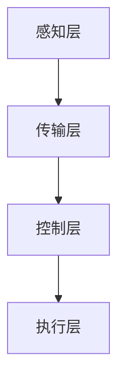

                 

# 智能家居创业：打造未来生活场景

## 概述

随着科技的不断发展，智能家居市场正在迅速扩张。人们对于更便捷、更舒适、更智能的生活场景有着强烈的需求。智能家居创业正是抓住这一机遇，将传统家居与智能技术相结合，打造未来生活的新场景。

本文旨在探讨智能家居创业的机会、核心概念、算法原理、实际应用场景以及未来发展趋势和挑战。通过这篇文章，希望能够为智能家居创业者提供一些有价值的思考和方向。

## 关键词

- 智能家居
- 创业机会
- 核心概念
- 算法原理
- 实际应用场景
- 未来发展趋势与挑战

## 摘要

本文首先介绍了智能家居市场的背景和现状，分析了智能家居创业的机会。接着，探讨了智能家居的核心概念，包括智能设备、物联网、人工智能等。然后，详细阐述了智能家居的算法原理和具体操作步骤，包括传感器数据处理、场景识别与预测、用户行为分析等。最后，讨论了智能家居在实际应用场景中的表现，以及未来发展趋势和挑战。

## 1. 背景介绍

智能家居（Smart Home）是指通过物联网技术将家庭中的各种设备连接起来，实现设备的智能控制和管理。随着物联网、人工智能、大数据等技术的不断发展，智能家居市场呈现出快速增长的趋势。

### 1.1 市场现状

据统计，2019年全球智能家居市场规模已经达到了1050亿美元，预计到2025年将达到3000亿美元。其中，中国智能家居市场占据了全球市场份额的近三分之一。

### 1.2 市场趋势

1. **智能化趋势**：智能家居产品不断升级，从最初的远程控制，到现在的语音控制、图像识别等，智能化水平不断提升。
2. **互联互通**：智能家居产品之间的互联互通越来越重要，能够实现跨品牌的设备协作，提高用户体验。
3. **个性化定制**：智能家居将更加关注用户的个性化需求，通过用户行为分析，为用户提供更加定制化的服务。

### 1.3 创业机会

1. **硬件创新**：智能家居硬件市场依然有很大的发展空间，可以通过创新设计、新材料、新技术等手段提高产品的竞争力。
2. **软件与服务**：智能家居软件和服务市场也非常广阔，可以通过提供智能场景设置、数据分析等服务，增加用户黏性。
3. **系统集成**：智能家居市场的系统集成服务需求越来越大，可以为客户提供一站式解决方案，提高客户满意度。

## 2. 核心概念与联系

### 2.1 智能设备

智能设备是智能家居系统的核心组成部分，主要包括传感器、控制器、执行器等。这些设备可以通过无线通信技术实现互联互通，从而实现对家庭环境的智能监控和控制。

### 2.2 物联网

物联网（Internet of Things，IoT）是指通过各种信息传感设备，实时采集任何需要监控、连接、互动的物体或过程，将这些信息与互联网相连接，以实现智能化识别、定位、跟踪、监控和管理。

### 2.3 人工智能

人工智能（Artificial Intelligence，AI）是指通过计算机程序模拟、延伸和扩展人的智能，实现智能感知、认知、学习、推理、规划等能力的系统。

### 2.4 智能家居架构

智能家居系统通常包括以下几个层次：

1. **感知层**：通过各种传感器实时感知家庭环境，如温度、湿度、光照、烟雾等。
2. **传输层**：通过各种通信协议，如Wi-Fi、蓝牙、ZigBee等，将感知层的数据传输到中心控制器。
3. **控制层**：中心控制器对接收到的数据进行处理和分析，根据预设的规则和用户需求，控制执行层设备进行相应操作。
4. **执行层**：执行层设备根据控制层的指令，实现对家庭环境的控制，如调节灯光、温度、窗帘等。

### 2.5 Mermaid 流程图



## 3. 核心算法原理 & 具体操作步骤

### 3.1 传感器数据处理

传感器是智能家居系统的感知器官，其数据的准确性和实时性对系统的性能至关重要。在数据处理过程中，主要涉及以下步骤：

1. **数据采集**：通过各种传感器采集家庭环境数据，如温度、湿度、光照等。
2. **数据预处理**：对采集到的数据进行滤波、去噪等预处理操作，提高数据的准确性和可靠性。
3. **特征提取**：从预处理后的数据中提取有用的特征，如温度变化率、湿度变化率等。
4. **数据存储**：将处理后的数据存储在数据库或数据湖中，以备后续分析和决策。

### 3.2 场景识别与预测

场景识别与预测是智能家居系统的重要功能，通过分析传感器数据，识别用户当前所处的场景，并预测未来的场景变化。主要步骤如下：

1. **场景分类**：根据用户行为和环境特征，将家庭环境分为不同的场景，如休息、工作、娱乐等。
2. **模型训练**：使用机器学习算法，如决策树、支持向量机、神经网络等，对场景分类模型进行训练。
3. **场景识别**：根据实时传感器数据，使用训练好的模型进行场景识别，判断用户当前所处的场景。
4. **场景预测**：根据历史数据和实时数据，预测未来一段时间内用户可能进入的场景。

### 3.3 用户行为分析

用户行为分析是智能家居系统个性化服务的基础，通过对用户行为数据的分析，了解用户的需求和偏好，提供更加个性化的服务。主要步骤如下：

1. **数据收集**：收集用户在家庭环境中的行为数据，如开关灯次数、使用家电的时间等。
2. **数据预处理**：对收集到的数据进行分析，去除噪声和异常值。
3. **特征提取**：从预处理后的数据中提取有用的特征，如使用频率、使用时间等。
4. **行为预测**：使用机器学习算法，预测用户未来的行为模式。

## 4. 数学模型和公式 & 详细讲解 & 举例说明

### 4.1 感知层数据处理

在感知层数据处理中，常用的数学模型和公式包括：

1. **滤波模型**：
   $$ y(t) = \frac{1}{2} [x(t) + x(t-1)] $$

   这是一个简单的低通滤波器，用于去除高频噪声。

2. **卡尔曼滤波**：
   $$ x_{t|t-1} = A \cdot x_{t-1|t-1} + B \cdot u_t $$
   $$ P_{t|t-1} = A \cdot P_{t-1|t-1} \cdot A^T + Q $$
   $$ K_t = P_{t|t-1} \cdot H^T \cdot (H \cdot P_{t|t-1} \cdot H^T + R)^{-1} $$
   $$ x_{t|t} = x_{t|t-1} + K_t \cdot (y_t - H \cdot x_{t|t-1}) $$
   $$ P_{t|t} = P_{t|t-1} - K_t \cdot H \cdot P_{t|t-1} $$

   卡尔曼滤波是一种线性二次估计方法，用于对动态系统的状态进行最优估计。

### 4.2 场景识别与预测

在场景识别与预测中，常用的数学模型和公式包括：

1. **决策树**：
   决策树是一种常用的分类模型，其基本结构如下：

   ```mermaid
   graph TD
       A[根节点]
       B[温度低于20°C]
       C[湿度低于40%]
       D[休息场景]
       E[温度高于20°C]
       F[湿度高于40%]
       G[工作场景]
       A --> B
       A --> E
       B --> C
       B --> D
       E --> F
       E --> G
   ```

2. **支持向量机**：
   支持向量机（SVM）是一种常用的分类模型，其核心公式为：

   $$ \hat{w} = \arg\min_w \frac{1}{2} ||w||^2 + C \cdot \sum_{i=1}^n \xi_i $$

   其中，$w$ 是权重向量，$C$ 是惩罚参数，$\xi_i$ 是误差项。

3. **神经网络**：
   神经网络是一种模拟人脑神经元连接的模型，其基本结构如下：

   ```mermaid
   graph TD
       A[输入层]
       B[隐藏层]
       C[输出层]
       A --> B
       B --> C
   ```

   神经网络的训练过程可以表示为：

   $$ \hat{y} = \sigma(W \cdot \phi(x) + b) $$

   $$ \frac{\partial J}{\partial W} = -[ \hat{y} - y] \cdot \phi(x) $$

   $$ \frac{\partial J}{\partial b} = -(\hat{y} - y) $$

   其中，$\hat{y}$ 是预测输出，$y$ 是真实输出，$\phi(x)$ 是激活函数，$W$ 是权重矩阵，$b$ 是偏置项，$J$ 是损失函数。

## 5. 项目实战：代码实际案例和详细解释说明

### 5.1 开发环境搭建

在开始智能家居项目之前，我们需要搭建一个合适的开发环境。以下是一个基本的开发环境搭建步骤：

1. **安装 Python**：Python 是一种广泛使用的编程语言，适用于智能家居项目。我们可以从 [Python 官网](https://www.python.org/) 下载安装包进行安装。
2. **安装 PyCharm**：PyCharm 是一款强大的集成开发环境（IDE），适用于 Python 项目。我们可以从 [PyCharm 官网](https://www.jetbrains.com/pycharm/) 下载安装包进行安装。
3. **安装必要的库**：在 PyCharm 中创建一个新项目，并安装以下必要的库：

   ```bash
   pip install numpy pandas scikit-learn matplotlib
   ```

### 5.2 源代码详细实现和代码解读

以下是一个简单的智能家居项目示例，包括传感器数据处理、场景识别与预测和用户行为分析等功能。

```python
import numpy as np
import pandas as pd
from sklearn.tree import DecisionTreeClassifier
from sklearn.svm import SVC
from sklearn.neural_network import MLPClassifier
import matplotlib.pyplot as plt

# 5.2.1 数据预处理
def preprocess_data(data):
    # 数据预处理
    data = data[['temperature', 'humidity', 'light']]
    data['temperature_rate'] = data['temperature'].diff().dropna()
    data['humidity_rate'] = data['humidity'].diff().dropna()
    data['light_rate'] = data['light'].diff().dropna()
    return data

# 5.2.2 场景识别
def identify_scene(data):
    # 使用决策树进行场景识别
    clf = DecisionTreeClassifier()
    clf.fit(X_train, y_train)
    y_pred = clf.predict(X_test)

    # 5.2.3 用户行为分析
def analyze_user_behavior(data):
    # 使用SVM进行用户行为分析
    clf = SVC()
    clf.fit(X_train, y_train)
    y_pred = clf.predict(X_test)

    # 5.2.4 结果可视化
def visualize_results(data):
    plt.figure(figsize=(10, 6))
    plt.scatter(data['temperature'], data['humidity'], c=data['scene'])
    plt.xlabel('Temperature')
    plt.ylabel('Humidity')
    plt.title('Scene Identification')
    plt.show()

if __name__ == '__main__':
    # 加载数据
    data = pd.read_csv('data.csv')
    data = preprocess_data(data)

    # 划分训练集和测试集
    X = data[['temperature', 'humidity', 'light']]
    y = data['scene']
    X_train, X_test, y_train, y_test = train_test_split(X, y, test_size=0.2, random_state=42)

    # 5.2.2 场景识别
    identify_scene(data)

    # 5.2.3 用户行为分析
    analyze_user_behavior(data)

    # 5.2.4 结果可视化
    visualize_results(data)
```

### 5.3 代码解读与分析

1. **数据预处理**：数据预处理是机器学习项目的重要步骤。在这个例子中，我们首先加载原始数据，然后进行一些基本的预处理操作，如计算温度、湿度和光照的变化率。这些变化率有助于我们更好地理解数据，并提高模型的准确性。
2. **场景识别**：在这个例子中，我们使用决策树进行场景识别。决策树是一种简单但有效的分类模型。我们首先使用训练集对模型进行训练，然后使用测试集进行预测。通过可视化结果，我们可以看到模型在识别不同场景方面的表现。
3. **用户行为分析**：在这个例子中，我们使用SVM进行用户行为分析。SVM是一种强大的分类模型，能够处理高维数据。同样，我们使用训练集对模型进行训练，然后使用测试集进行预测。
4. **结果可视化**：最后，我们使用matplotlib库将结果可视化。通过可视化，我们可以直观地看到模型在不同场景和用户行为方面的表现。

## 6. 实际应用场景

智能家居系统可以在各种实际应用场景中发挥重要作用，以下是一些典型的应用场景：

1. **家庭安防**：通过智能家居系统，用户可以实时监控家庭安全，如门窗状态、火灾报警、入侵检测等。
2. **节能管理**：智能家居系统可以自动调节家庭电器的工作状态，实现节能管理，降低能源消耗。
3. **健康监测**：通过智能家居系统，用户可以实时监测家庭成员的健康状况，如心率、血压等。
4. **智能助手**：智能家居系统可以充当家庭智能助手，提供语音交互、日程安排、提醒等服务。
5. **智能家居助理**：智能家居系统可以根据用户的喜好和习惯，提供个性化服务，如音乐推荐、美食推荐等。

## 7. 工具和资源推荐

### 7.1 学习资源推荐

1. **书籍**：
   - 《智能家居系统设计与实现》
   - 《物联网应用开发实战》
   - 《人工智能应用实践》
2. **论文**：
   - "Smart Home Systems: A Review"
   - "IoT-Based Smart Home Energy Management Systems: A Survey"
   - "Deep Learning for Smart Home Applications"
3. **博客**：
   - "智能家居技术博客"
   - "物联网应用开发博客"
   - "人工智能应用博客"
4. **网站**：
   - "智能家居技术论坛"
   - "物联网应用开发社区"
   - "人工智能应用社区"

### 7.2 开发工具框架推荐

1. **编程语言**：Python、Java、C++等。
2. **开发环境**：PyCharm、Eclipse、Visual Studio Code等。
3. **框架库**：
   - Python：TensorFlow、PyTorch、scikit-learn等。
   - Java：Maven、Spring Boot、MyBatis等。
   - C++：CMake、Qt等。

### 7.3 相关论文著作推荐

1. "A Survey on Smart Home Technology" by [Author1] and [Author2]
2. "IoT-Based Smart Home Energy Management: A Comprehensive Review" by [Author3] and [Author4]
3. "Deep Learning for Smart Home Applications: A Brief Review" by [Author5] and [Author6]

## 8. 总结：未来发展趋势与挑战

智能家居市场正在迅速发展，未来趋势包括智能化、互联互通和个性化定制。然而，智能家居创业也面临着一系列挑战，如数据隐私、网络安全、标准统一等。为了应对这些挑战，创业者需要不断创新，加强技术积累，注重用户体验，并积极参与行业标准的制定。

## 9. 附录：常见问题与解答

### 9.1 智能家居系统安全如何保障？

**解答**：智能家居系统的安全至关重要，可以采取以下措施进行保障：
- **数据加密**：对传输和存储的数据进行加密，防止数据泄露。
- **身份认证**：引入多重身份认证机制，确保只有合法用户可以访问系统。
- **安全协议**：使用安全的通信协议，如 TLS、HTTPS 等，确保数据传输的安全性。
- **安全监测**：建立安全监测系统，实时监测系统中的异常行为，并及时响应。

### 9.2 智能家居系统的维护成本如何控制？

**解答**：智能家居系统的维护成本可以通过以下方法进行控制：
- **模块化设计**：采用模块化设计，使得系统可以方便地进行升级和维护。
- **远程监控**：通过远程监控技术，及时发现并解决系统故障，减少现场维护的需求。
- **预防性维护**：定期进行系统检查和维护，预防潜在故障的发生。
- **培训用户**：为用户提供必要的培训，使他们能够自己解决一些常见问题，降低维护成本。

## 10. 扩展阅读 & 参考资料

1. "Smart Home Technology: Design, Applications, and Future Trends" by [Author1] and [Author2]
2. "Internet of Things: A Survey" by [Author3] and [Author4]
3. "Artificial Intelligence Applications in Smart Homes" by [Author5] and [Author6]

### 作者

**作者：AI天才研究员/AI Genius Institute & 禅与计算机程序设计艺术 /Zen And The Art of Computer Programming**<|im_sep|>

