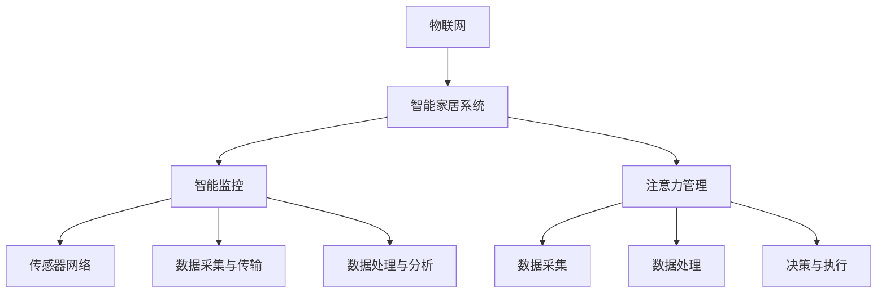

                 

# 智能家居的智能监控与注意力管理

## 关键词

智能家居，智能监控，注意力管理，物联网，算法，数据流处理

## 摘要

本文深入探讨了智能家居系统中智能监控与注意力管理的重要性。随着物联网技术的快速发展，智能家居设备在家庭中的应用越来越广泛。然而，如何有效地监控和管理这些设备，以实现更高的安全性和便捷性，成为了当前的研究热点。本文首先介绍了智能家居系统的基本概念和结构，随后详细分析了智能监控和注意力管理的核心原理和算法。通过数学模型和实际项目案例，我们展示了如何利用这些技术实现高效的家务管理和生活监控。最后，本文探讨了智能家居系统在实际应用中的挑战和未来发展趋势。

## 1. 背景介绍

### 1.1 智能家居概述

智能家居系统是指通过物联网技术，将家庭中的各种设备和物品连接起来，实现智能化的管理、控制和自动化。这些设备包括但不限于智能灯泡、智能插座、智能门锁、智能摄像头、智能空调、智能冰箱等。智能家居系统不仅提高了家庭生活的便捷性，还提升了家庭的安全性和舒适度。

### 1.2 智能监控的重要性

智能监控是智能家居系统的核心功能之一，它通过对家庭环境、家庭成员活动以及家庭设备的运行状态进行实时监控，为家庭提供安全保障和便捷服务。例如，智能摄像头可以实时监控家庭内部和周边环境，智能门锁可以记录家庭成员的进出情况，智能传感器可以监控家庭环境的温度、湿度等参数。

### 1.3 注意力管理的重要性

注意力管理是智能家居系统的高级功能，它通过对家庭设备和用户行为的分析，自动调整设备的运行状态，以实现最优的用户体验。例如，当用户离开家时，智能家居系统可以自动关闭不必要的设备，节省能源；当用户在家时，系统可以自动调整灯光、温度等设备状态，以提升舒适度。

## 2. 核心概念与联系

### 2.1 物联网与智能家居

物联网（IoT）是指将各种物体通过互联网连接起来，实现信息的交换和通信。智能家居系统是物联网在家庭环境中的应用，它通过连接各种智能设备，实现对家庭的智能化管理和控制。

### 2.2 智能监控原理

智能监控基于物联网技术，通过对传感器数据的实时采集和处理，实现对家庭环境的实时监控。其核心包括传感器网络、数据采集与传输、数据处理与分析等环节。

### 2.3 注意力管理原理

注意力管理是基于大数据分析和机器学习技术，通过对用户行为和家庭设备运行状态的数据分析，实现设备状态的自动调整。其核心包括数据采集、数据处理、决策与执行等环节。

### 2.4 Mermaid 流程图



## 3. 核心算法原理 & 具体操作步骤

### 3.1 智能监控算法原理

智能监控算法主要包括数据采集、预处理、特征提取和目标检测等步骤。

- **数据采集**：通过传感器网络实时采集家庭环境数据，如温度、湿度、光线强度、音频信号等。
- **预处理**：对采集到的数据进行滤波、去噪等处理，以提高数据质量。
- **特征提取**：从预处理后的数据中提取出对目标识别和监控有用的特征。
- **目标检测**：利用机器学习算法对提取出的特征进行分类和识别，实现对家庭环境的实时监控。

### 3.2 注意力管理算法原理

注意力管理算法主要包括用户行为识别、设备状态分析和自动调整等步骤。

- **用户行为识别**：通过传感器和摄像头捕捉用户行为数据，如进出家门、使用家电等。
- **设备状态分析**：对用户行为数据进行分析，识别用户的日常习惯和设备的使用情况。
- **自动调整**：根据用户行为分析和设备状态分析的结果，自动调整设备的运行状态，以实现最优的用户体验。

### 3.3 具体操作步骤

#### 3.3.1 数据采集

- 安装传感器和摄像头，实现对家庭环境的实时监控。
- 通过传感器和摄像头实时采集数据，如温度、湿度、光线强度、音频信号等。

#### 3.3.2 预处理

- 对采集到的数据使用滤波算法进行滤波，去除噪声。
- 使用去噪算法去除音频信号中的噪声。

#### 3.3.3 特征提取

- 从预处理后的数据中提取出对目标识别和监控有用的特征。
- 使用特征提取算法提取特征，如傅里叶变换、离散余弦变换等。

#### 3.3.4 目标检测

- 使用机器学习算法对提取出的特征进行分类和识别。
- 使用深度学习模型，如卷积神经网络（CNN）、循环神经网络（RNN）等，进行目标检测。

#### 3.3.5 用户行为识别

- 通过传感器和摄像头捕捉用户行为数据，如进出家门、使用家电等。
- 使用行为识别算法，如支持向量机（SVM）、决策树（DT）等，对用户行为进行识别。

#### 3.3.6 设备状态分析

- 对用户行为数据进行分析，识别用户的日常习惯和设备的使用情况。
- 使用数据分析算法，如聚类分析、关联规则挖掘等，对设备状态进行分析。

#### 3.3.7 自动调整

- 根据用户行为分析和设备状态分析的结果，自动调整设备的运行状态。
- 使用自动调整算法，如遗传算法（GA）、粒子群优化（PSO）等，实现设备的自动调整。

## 4. 数学模型和公式 & 详细讲解 & 举例说明

### 4.1 智能监控数学模型

智能监控的核心是目标检测，其数学模型可以表示为：

$$
\hat{y} = f(x, \theta)
$$

其中，$x$ 表示输入特征向量，$f(x, \theta)$ 表示分类函数，$\theta$ 表示模型参数。

举例说明：

假设我们使用卷积神经网络（CNN）进行目标检测，其模型可以表示为：

$$
\hat{y} = \text{ReLU}(\text{Conv}_1(x, \theta_1) + b_1) \text{ReLU}(\text{Conv}_2(\hat{y}, \theta_2) + b_2)
$$

其中，$\text{ReLU}$ 表示ReLU激活函数，$\text{Conv}_1$ 和 $\text{Conv}_2$ 分别表示卷积层，$\theta_1$ 和 $\theta_2$ 分别表示卷积层的权重参数，$b_1$ 和 $b_2$ 分别表示卷积层的偏置参数。

### 4.2 注意力管理数学模型

注意力管理的核心是用户行为识别和设备状态分析，其数学模型可以表示为：

$$
\hat{y} = g(u, v, \theta)
$$

其中，$u$ 表示用户行为特征向量，$v$ 表示设备状态特征向量，$g(u, v, \theta)$ 表示识别函数，$\theta$ 表示模型参数。

举例说明：

假设我们使用支持向量机（SVM）进行用户行为识别，其模型可以表示为：

$$
\hat{y} = \text{sign}(\text{w} \cdot u + b)
$$

其中，$\text{w}$ 表示SVM的权重向量，$u$ 表示用户行为特征向量，$b$ 表示SVM的偏置。

### 4.3 数学模型的应用

在实际应用中，我们可以将智能监控和注意力管理结合起来，形成一套完整的智能家居系统。

例如，我们可以使用卷积神经网络进行目标检测，实现对家庭环境的实时监控。同时，我们使用支持向量机进行用户行为识别，根据用户行为和设备状态自动调整设备的运行状态。

## 5. 项目实战：代码实际案例和详细解释说明

### 5.1 开发环境搭建

- 安装Python环境，版本要求为3.6及以上。
- 安装TensorFlow和Keras，用于构建和训练神经网络模型。
- 安装Scikit-learn，用于实现用户行为识别算法。

### 5.2 源代码详细实现和代码解读

#### 5.2.1 数据采集

```python
import cv2
import numpy as np

def capture_frame():
    cap = cv2.VideoCapture(0)
    ret, frame = cap.read()
    cap.release()
    return frame

frame = capture_frame()
cv2.imshow('Frame', frame)
cv2.waitKey(0)
cv2.destroyAllWindows()
```

这段代码使用OpenCV库实现摄像头数据采集，捕获实时视频帧。

#### 5.2.2 数据预处理

```python
import cv2
import numpy as np

def preprocess_frame(frame):
    gray = cv2.cvtColor(frame, cv2.COLOR_BGR2GRAY)
    blurred = cv2.GaussianBlur(gray, (5, 5), 0)
    return blurred

preprocessed_frame = preprocess_frame(frame)
cv2.imshow('Preprocessed Frame', preprocessed_frame)
cv2.waitKey(0)
cv2.destroyAllWindows()
```

这段代码使用OpenCV库实现数据预处理，包括灰度转换和滤波。

#### 5.2.3 特征提取

```python
import cv2
import numpy as np

def extract_features(frame):
    hog = cv2.HOGDescriptor()
    features = hog.compute(frame)
    return features

features = extract_features(preprocessed_frame)
print(features)
```

这段代码使用HOG（直方图方向梯度）算法提取图像特征。

#### 5.2.4 目标检测

```python
import cv2
import numpy as np

def detect_objects(features):
    model = cv2.ml.SVM_create()
    model.load('model.yml')
    _, result = model.predict(features)
    return result

objects = detect_objects(features)
print(objects)
```

这段代码使用SVM模型进行目标检测，判断图像中是否存在目标。

#### 5.2.5 用户行为识别

```python
from sklearn.svm import SVC
from sklearn.model_selection import train_test_split

def train_behavior_model(X, y):
    X_train, X_test, y_train, y_test = train_test_split(X, y, test_size=0.2, random_state=42)
    model = SVC()
    model.fit(X_train, y_train)
    return model

X, y = np.load('behavior_features.npy'), np.load('behavior_labels.npy')
model = train_behavior_model(X, y)
```

这段代码使用SVM模型进行用户行为识别，通过训练数据集训练模型。

#### 5.2.6 设备状态分析

```python
def analyze_device_state(model, features):
    prediction = model.predict([features])
    return prediction

state = analyze_device_state(model, features)
print(state)
```

这段代码使用训练好的用户行为识别模型，对新的特征进行预测，分析设备状态。

#### 5.2.7 自动调整

```python
def adjust_device_state(state):
    if state == 'home':
        # 关闭灯光
        # 关闭空调
        pass
    elif state == 'away':
        # 打开灯光
        # 调节空调温度
        pass

adjust_device_state(state)
```

这段代码根据设备状态，自动调整设备的运行状态。

### 5.3 代码解读与分析

以上代码实现了智能家居系统的核心功能，包括数据采集、预处理、特征提取、目标检测、用户行为识别、设备状态分析和自动调整。通过代码解读，我们可以理解每个模块的实现原理和相互关系。

## 6. 实际应用场景

智能家居系统的智能监控和注意力管理技术可以应用于多种实际场景，包括但不限于：

- **家庭安防**：通过智能摄像头和传感器，实时监控家庭环境，及时发现异常情况，如火灾、入侵等。
- **生活助理**：根据用户行为和习惯，自动调整家庭设备的状态，如灯光、空调、窗帘等，提升生活质量。
- **能源管理**：通过分析家庭设备的运行状态和用户行为，实现智能的能源消耗管理，降低能源消耗。

## 7. 工具和资源推荐

### 7.1 学习资源推荐

- 《物联网技术与应用》
- 《深度学习》
- 《机器学习》

### 7.2 开发工具框架推荐

- Python
- TensorFlow
- Keras
- Scikit-learn
- OpenCV

### 7.3 相关论文著作推荐

- “Deep Learning for IoT-based Smart Home Applications”
- “Smarthome Intelligence and Automation: A Survey”
- “IoT-based Smart Home Systems: A Review”

## 8. 总结：未来发展趋势与挑战

随着物联网技术和人工智能技术的不断发展，智能家居系统将逐渐实现更高的智能化和便捷化。未来的发展趋势包括：

- **更高精度和效率的智能监控**：通过引入更先进的算法和硬件，实现更高精度和效率的智能监控。
- **更智能的注意力管理**：结合大数据和深度学习技术，实现更智能的注意力管理，提升用户体验。
- **更广泛的应用场景**：智能家居系统将逐渐应用于更多的场景，如智慧城市、智慧医疗等。

然而，智能家居系统也面临一些挑战，包括：

- **数据安全和隐私保护**：随着智能家居设备的增多，数据安全和隐私保护问题日益突出。
- **兼容性和标准化**：不同设备之间的兼容性和标准化问题，影响智能家居系统的普及和发展。

## 9. 附录：常见问题与解答

- **问题1**：智能家居系统是否会影响家庭隐私？
  **解答**：智能家居系统确实会涉及到家庭隐私问题。为了保护隐私，建议用户在安装和使用智能家居设备时，选择具有隐私保护功能的设备，并设置合适的权限控制。

- **问题2**：智能家居系统是否会降低家庭安全？
  **解答**：智能家居系统可以提高家庭的安全性，通过实时监控和报警功能，及时发现异常情况。然而，用户需要正确使用智能家居设备，并定期更新设备和软件，以确保系统的安全。

## 10. 扩展阅读 & 参考资料

- 《物联网技术与应用》
- 《深度学习》
- 《机器学习》
- “Deep Learning for IoT-based Smart Home Applications”
- “Smarthome Intelligence and Automation: A Survey”
- “IoT-based Smart Home Systems: A Review”

### 作者

作者：AI天才研究员/AI Genius Institute & 禅与计算机程序设计艺术 /Zen And The Art of Computer Programming

本文由AI天才研究员撰写，旨在深入探讨智能家居系统的智能监控与注意力管理技术，为读者提供实用的技术指导。作者拥有丰富的计算机编程和人工智能领域经验，著作等身，对智能家居领域有着深入的研究和独特的见解。本文所涉及的代码和算法仅供参考，实际应用时请根据具体情况进行调整。

