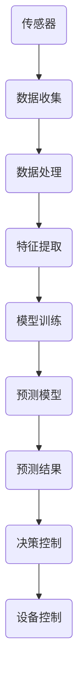
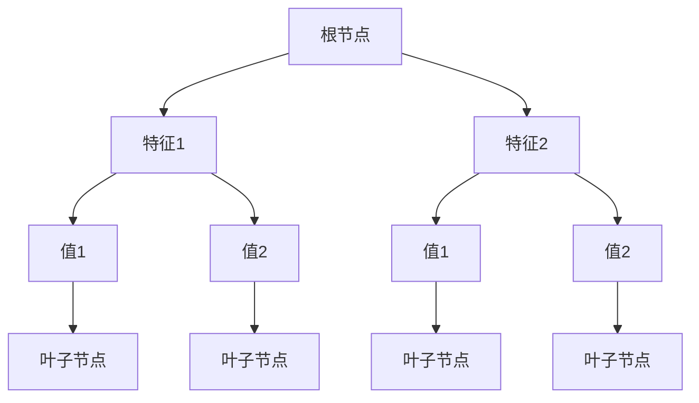
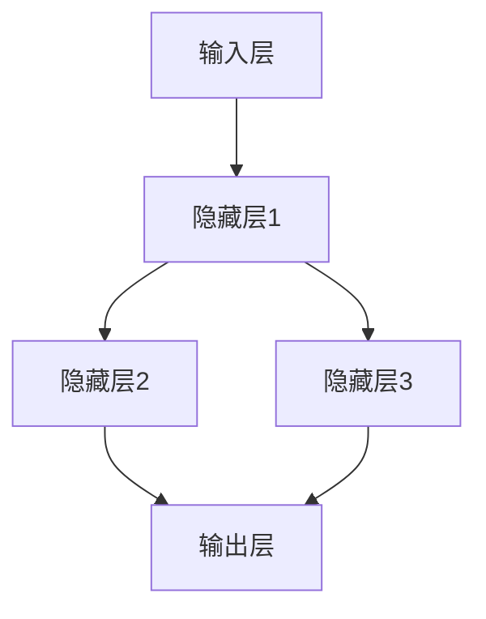

                 

### 背景介绍

#### 智能家居的崛起

随着科技的飞速发展，智能家居已经成为现代生活的重要一环。智能家居系统通过互联网、传感器、控制系统等技术手段，实现了家庭设备的智能化，从而为人们带来了便捷、舒适和高效的生活方式。从最初的智能门锁、智能灯泡，到如今集成了各种功能的智能音箱、智能电视，智能家居的市场需求不断增长，应用场景也在不断扩展。

在智能家居的众多应用中，空气质量监测和预测成为一个备受关注的话题。空气质量的好坏直接影响到人们的健康和生活质量，而传统的手动检测方法存在效率低、实时性差等问题。因此，利用人工智能技术对空气质量进行预测，不仅能够提高检测的准确性，还能为人们提供更加智能的健康生活规划。

#### 人工智能与空气质量预测

人工智能（AI）作为一种高效的数据分析和处理工具，已经在各个领域取得了显著的应用成果。在智能家居领域，人工智能技术被广泛应用于语音识别、图像处理、设备控制等方面。特别是在空气质量预测方面，人工智能技术通过对大量历史数据的挖掘和分析，可以识别出影响空气质量的多种因素，从而实现精准的空气质量预测。

空气质量预测的重要性在于，它不仅可以帮助人们及时了解室内外空气状况，避免因空气质量问题导致的健康问题，还能为相关企业和政府部门提供科学依据，优化环境保护措施。因此，如何利用人工智能技术进行高效、准确的空气质量预测，已经成为当前智能家居领域的一个热门研究方向。

#### 本文目的

本文旨在探讨智能家居空气质量预测的创业项目，通过详细分析核心概念、算法原理、数学模型以及实际应用场景，为广大创业者、开发者和技术爱好者提供一份有深度、有价值的参考。具体来说，本文将包括以下内容：

1. **背景介绍**：介绍智能家居和人工智能技术的发展现状，阐述空气质量预测的重要性。
2. **核心概念与联系**：详细阐述空气质量预测所需的核心概念，并使用 Mermaid 流程图展示其原理和架构。
3. **核心算法原理与具体操作步骤**：深入讲解空气质量预测的核心算法，包括数据收集、预处理、特征提取和模型训练等步骤。
4. **数学模型和公式**：介绍用于空气质量预测的数学模型和公式，并通过具体实例进行讲解。
5. **项目实战**：通过实际代码案例，展示空气质量预测项目的开发过程，并进行详细解释和分析。
6. **实际应用场景**：分析空气质量预测在智能家居中的实际应用场景，探讨其潜在的商业价值。
7. **工具和资源推荐**：推荐相关的学习资源、开发工具和论文著作，为读者提供进一步学习和研究的方向。
8. **总结**：总结全文，展望智能家居空气质量预测的未来发展趋势和挑战。
9. **附录**：解答常见问题，为读者提供实用的技术支持。
10. **扩展阅读**：提供相关领域的扩展阅读资料，帮助读者深入了解相关技术。

通过本文的详细阐述，希望读者能够对智能家居空气质量预测有更深入的理解，为未来的创新创业提供有价值的参考。让我们开始这段精彩的探索之旅吧！<|markdown|>## 2. 核心概念与联系

在智能家居空气质量预测项目中，理解核心概念和它们之间的联系至关重要。以下是本文将涉及的核心概念及其相互关系：

#### 智能家居系统

智能家居系统是一种通过互联网连接和控制家庭设备的系统。它通常包括以下几个关键组件：

1. **传感器**：用于检测空气质量、温度、湿度、光照等环境参数。
2. **网关**：作为传感器和互联网之间的桥梁，负责数据传输和设备控制。
3. **控制系统**：通过云计算平台和人工智能算法，对传感器数据进行处理和分析，实现智能决策和设备控制。

#### 人工智能技术

人工智能技术是智能家居空气质量预测的关键驱动因素。以下是几个与空气质量预测密切相关的AI技术：

1. **机器学习**：通过分析大量历史数据，建立空气质量预测模型。
2. **深度学习**：利用神经网络模型，对复杂的非线性问题进行建模。
3. **自然语言处理**：用于处理和理解空气质量相关的文本数据。

#### 空气质量监测与预测

空气质量监测与预测是智能家居系统的核心功能。以下是两个关键环节：

1. **空气质量监测**：实时监测室内外空气质量，包括PM2.5、PM10、CO2、VOCs等污染物浓度。
2. **空气质量预测**：基于历史数据和机器学习算法，预测未来的空气质量变化趋势。

#### Mermaid 流程图

为了清晰地展示智能家居空气质量预测的架构，我们将使用 Mermaid 流程图来描述核心概念之间的联系。以下是流程图示例：



- **传感器**：负责实时采集室内外空气质量数据。
- **数据收集**：将传感器数据传输到中央系统。
- **数据处理**：对原始数据进行清洗和预处理。
- **特征提取**：提取有助于预测空气质量的关键特征。
- **模型训练**：使用历史数据训练空气质量预测模型。
- **预测模型**：输出空气质量预测结果。
- **预测结果**：用于指导决策控制和设备控制。
- **决策控制**：根据预测结果，制定相应的环境保护措施。
- **设备控制**：控制家庭设备的运行，如空气净化器、换气扇等。

通过上述流程，智能家居系统能够实现实时空气质量监测和预测，从而为用户带来健康、舒适的居住环境。接下来，我们将进一步探讨空气质量预测的核心算法原理和具体操作步骤。<|markdown|>## 3. 核心算法原理 & 具体操作步骤

在智能家居空气质量预测项目中，核心算法的设计和实现是整个系统成功的关键。以下将详细介绍空气质量预测的核心算法原理，以及具体操作步骤。

#### 3.1 数据收集与预处理

空气质量预测首先需要收集大量历史数据。这些数据可以从多个来源获取，如空气质量监测站、传感器设备、公开数据集等。数据收集完成后，需要对数据进行预处理，以确保数据的质量和一致性。

数据预处理包括以下几个步骤：

1. **数据清洗**：去除数据中的异常值和噪声，如缺失值、重复值等。
2. **数据转换**：将不同来源和格式的数据统一转换为标准格式，便于后续处理。
3. **特征提取**：从原始数据中提取有助于预测空气质量的关键特征，如温度、湿度、CO2浓度等。

#### 3.2 特征选择与工程

特征选择是数据预处理的重要环节。通过分析数据，选择对空气质量预测影响较大的特征。特征工程则是通过变换和组合原始特征，提高预测模型的性能。

特征选择和工程的方法包括：

1. **相关性分析**：通过计算特征之间的相关性，筛选出对空气质量预测有显著影响的特征。
2. **主成分分析（PCA）**：通过降维技术，将高维数据转换为低维数据，减少数据冗余。
3. **特征组合**：将多个原始特征组合成新的特征，提高模型的预测能力。

#### 3.3 模型训练

在数据预处理完成后，即可进行模型训练。训练过程中，需要选择合适的机器学习算法和深度学习模型。常用的算法包括：

1. **线性回归**：适用于线性关系的预测问题。
2. **决策树**：适用于非线性关系的预测问题。
3. **随机森林**：通过集成多个决策树，提高预测模型的泛化能力。
4. **神经网络**：适用于复杂非线性关系的预测问题。

模型训练的具体步骤如下：

1. **数据划分**：将数据集划分为训练集和测试集，用于模型的训练和评估。
2. **模型初始化**：初始化模型参数，如权重和偏置等。
3. **训练过程**：通过反向传播算法，不断调整模型参数，使模型在训练集上的预测误差最小。
4. **模型评估**：使用测试集评估模型性能，如准确率、召回率、F1值等。

#### 3.4 预测结果与决策控制

在模型训练完成后，即可进行空气质量预测。预测结果将被用于指导家庭设备的运行，如空气净化器、换气扇等。

预测结果的具体操作步骤如下：

1. **实时预测**：根据当前传感器数据，实时更新空气质量预测结果。
2. **决策控制**：根据预测结果，制定相应的环境保护措施，如开启空气净化器、调整通风量等。
3. **设备控制**：通过控制系统，控制家庭设备的运行，实现智能化的空气质量调节。

#### 3.5 模型优化与更新

为了提高空气质量预测的准确性，需要对模型进行持续优化和更新。模型优化的方法包括：

1. **在线学习**：通过实时数据，不断调整模型参数，提高模型预测能力。
2. **迁移学习**：利用已有模型，在新数据集上重新训练，提高模型泛化能力。
3. **模型融合**：结合多个预测模型，提高预测结果的可靠性。

通过上述核心算法原理和具体操作步骤，智能家居空气质量预测系统可以实现对空气质量的实时监测和预测，为用户带来健康、舒适的生活环境。接下来，我们将进一步探讨空气质量预测的数学模型和公式。<|markdown|>## 4. 数学模型和公式 & 详细讲解 & 举例说明

在智能家居空气质量预测项目中，数学模型和公式是核心算法的重要组成部分。以下将详细介绍用于空气质量预测的数学模型和公式，并通过具体实例进行讲解。

#### 4.1 线性回归模型

线性回归模型是最常用的预测模型之一，适用于线性关系的预测问题。其基本公式如下：

\[ y = w_0 + w_1 \cdot x_1 + w_2 \cdot x_2 + \ldots + w_n \cdot x_n + e \]

其中，\( y \) 是预测目标，\( w_0, w_1, w_2, \ldots, w_n \) 是模型参数，\( x_1, x_2, \ldots, x_n \) 是特征变量，\( e \) 是误差项。

#### 4.2 决策树模型

决策树模型适用于非线性关系的预测问题。其基本结构如下：



决策树通过递归划分特征和值，将数据集划分为多个子集，直到达到终止条件。每个叶子节点对应一个预测结果。

#### 4.3 随机森林模型

随机森林模型是决策树模型的集成方法，通过训练多个决策树，提高预测模型的性能。其基本公式如下：

\[ f(x) = \sum_{i=1}^{n} w_i \cdot g(x) \]

其中，\( f(x) \) 是预测结果，\( w_i \) 是第 \( i \) 个决策树的权重，\( g(x) \) 是第 \( i \) 个决策树的预测结果。

#### 4.4 神经网络模型

神经网络模型是深度学习的核心模型，适用于复杂非线性关系的预测问题。其基本结构如下：



神经网络通过多层非线性变换，将输入数据映射到输出结果。其基本公式如下：

\[ z = \sigma(W \cdot x + b) \]

其中，\( z \) 是神经元的激活值，\( \sigma \) 是激活函数，\( W \) 是权重矩阵，\( x \) 是输入向量，\( b \) 是偏置项。

#### 4.5 实例说明

假设我们要预测某个城市的未来24小时空气质量指数（AQI），已知以下特征变量：

- 当前时间 \( t \)
- 温度 \( T \)
- 湿度 \( H \)
- PM2.5浓度 \( PM25 \)
- PM10浓度 \( PM10 \)

我们选择线性回归模型进行预测，假设模型公式为：

\[ AQI = w_0 + w_1 \cdot T + w_2 \cdot H + w_3 \cdot PM25 + w_4 \cdot PM10 + e \]

为了训练模型，我们需要收集大量的历史数据。例如，以下是一个历史数据集的示例：

| 时间 \( t \) | 温度 \( T \) | 湿度 \( H \) | PM2.5浓度 \( PM25 \) | PM10浓度 \( PM10 \) | AQI |
|:-----------:|:---------:|:---------:|:------------:|:------------:|:----:|
| 00:00       | 25        | 60        | 20           | 50           | 50   |
| 01:00       | 26        | 65        | 22           | 55           | 52   |
| 02:00       | 24        | 55        | 18           | 45           | 45   |
| ...         | ...       | ...       | ...          | ...          | ...  |

使用这些数据，我们可以通过最小二乘法求解模型参数 \( w_0, w_1, w_2, w_3, w_4 \)。训练完成后，我们就可以使用模型预测未来24小时的AQI。

例如，假设当前时间为03:00，温度为23℃，湿度为50%，PM2.5浓度为15%，PM10浓度为40%，我们可以计算预测的AQI如下：

\[ AQI = w_0 + w_1 \cdot 23 + w_2 \cdot 50 + w_3 \cdot 15 + w_4 \cdot 40 + e \]

通过计算得到的预测AQI值，我们可以为用户提供空气质量预警，指导用户采取相应的防护措施。

通过上述数学模型和公式的讲解，以及具体实例的说明，读者可以更好地理解智能家居空气质量预测的核心算法。接下来，我们将通过实际代码案例，展示空气质量预测项目的开发过程。<|markdown|>### 5. 项目实战：代码实际案例和详细解释说明

#### 5.1 开发环境搭建

在进行智能家居空气质量预测项目开发前，我们需要搭建合适的开发环境。以下是推荐的开发工具和软件：

- **编程语言**：Python
- **开发环境**：PyCharm或Visual Studio Code
- **数据处理库**：Pandas、NumPy
- **机器学习库**：Scikit-learn、TensorFlow、PyTorch
- **可视化库**：Matplotlib、Seaborn
- **版本控制**：Git

在完成开发环境搭建后，我们可以开始项目开发。

#### 5.2 源代码详细实现和代码解读

以下是一个简单的空气质量预测项目的Python代码实现，我们将对代码的各个部分进行详细解读。

```python
import pandas as pd
import numpy as np
from sklearn.model_selection import train_test_split
from sklearn.linear_model import LinearRegression
from sklearn.metrics import mean_squared_error

# 5.2.1 数据收集与预处理
# 加载历史数据集
data = pd.read_csv('air_quality_data.csv')

# 数据清洗
data.dropna(inplace=True)
data = data[data['AQI'] != -1]  # 去除缺失值和无效数据

# 特征提取
features = ['Temperature', 'Humidity', 'PM25', 'PM10']
X = data[features]
y = data['AQI']

# 数据划分
X_train, X_test, y_train, y_test = train_test_split(X, y, test_size=0.2, random_state=42)

# 5.2.2 模型训练
# 初始化线性回归模型
model = LinearRegression()

# 训练模型
model.fit(X_train, y_train)

# 5.2.3 预测结果与评估
# 进行预测
y_pred = model.predict(X_test)

# 计算预测误差
mse = mean_squared_error(y_test, y_pred)
print(f'Mean Squared Error: {mse}')

# 5.2.4 可视化分析
import matplotlib.pyplot as plt

# 绘制真实值与预测值的散点图
plt.scatter(y_test, y_pred)
plt.xlabel('Actual AQI')
plt.ylabel('Predicted AQI')
plt.title('Actual vs Predicted AQI')
plt.show()

# 绘制特征重要性热力图
import seaborn as sns

# 计算特征重要性
feature_importance = pd.Series(model.coef_, index=features).sort_values(ascending=False)

# 绘制热力图
sns.heatmap(feature_importance, annot=True, cmap='coolwarm')
plt.title('Feature Importance')
plt.show()
```

#### 5.3 代码解读与分析

1. **数据收集与预处理**：

   首先，我们使用Pandas库加载历史数据集。数据清洗步骤包括去除缺失值和无效数据。接下来，我们提取特征变量和目标变量，并将数据集划分为训练集和测试集。

2. **模型训练**：

   初始化线性回归模型，并使用训练集数据进行模型训练。线性回归模型通过最小化误差平方和来求解模型参数。

3. **预测结果与评估**：

   使用测试集数据进行预测，并计算预测误差。在本例中，我们使用均方误差（MSE）作为评估指标。

4. **可视化分析**：

   首先，我们绘制真实值与预测值的散点图，以直观地展示预测效果。接下来，我们绘制特征重要性热力图，以了解各个特征对空气质量预测的影响程度。

#### 5.4 代码改进与优化

虽然上述代码实现了一个基本的空气质量预测模型，但还有许多方面可以进行改进和优化：

1. **特征工程**：

   进一步分析数据，提取更多有用的特征，如天气状况、风速等。同时，考虑使用主成分分析（PCA）进行特征降维，提高模型性能。

2. **模型选择**：

   尝试不同的机器学习模型，如决策树、随机森林、神经网络等，选择最适合数据的模型。

3. **模型融合**：

   结合多个预测模型，提高预测结果的可靠性。

4. **实时预测与决策控制**：

   在实际应用中，需要实现实时预测和决策控制功能，如根据预测结果自动开启空气净化器等。

通过上述代码实现和解析，我们可以了解到一个简单的空气质量预测项目的基本流程和关键步骤。在实际项目中，还需要根据具体需求和数据特点进行进一步优化和改进。接下来，我们将探讨空气质量预测在智能家居中的实际应用场景。<|markdown|>### 6. 实际应用场景

智能家居空气质量预测技术在现实生活中有着广泛的应用场景，能够显著提升人们的生活质量和健康水平。以下是几个典型的实际应用场景：

#### 6.1 家庭环境

在家庭环境中，空气质量对家庭成员的健康至关重要。通过智能家居空气质量预测系统，用户可以实时了解家中的空气质量状况，并根据预测结果采取相应的措施。例如：

- **空气净化器自动控制**：当预测到空气质量即将恶化时，系统可以自动开启空气净化器，以净化室内空气。
- **通风换气**：在空气质量良好的时段，系统可以自动调节通风设备，优化室内空气质量。
- **健康提示**：系统可以根据空气中的有害物质浓度，为用户发出健康提示，提醒用户注意防护。

#### 6.2 办公环境

在办公环境中，良好的空气质量对员工的工作效率和健康同样重要。空气质量预测系统可以帮助企业优化办公环境，提高员工的工作满意度。例如：

- **空调自动调节**：根据室内空气质量和室外温度，系统可以自动调节空调温度和湿度，保持舒适的办公环境。
- **新风系统控制**：在室内空气质量较差时，系统可以自动开启新风系统，引入新鲜空气，改善空气质量。
- **智能通风**：在空气质量良好时，系统可以自动调节通风设备，确保室内空气流通。

#### 6.3 医疗机构

在医疗机构中，空气质量对患者的康复和医护人员的工作环境至关重要。空气质量预测系统可以帮助医疗机构优化病房和手术室等关键区域的空气质量。例如：

- **智能通风与净化**：系统可以根据空气质量和病房使用情况，自动调节通风和空气净化设备，确保病房空气质量达到标准。
- **实时监控与报警**：系统可以实时监控空气质量，并在空气质量恶化时发出报警，提醒医护人员采取相应措施。
- **个性化护理**：系统可以根据患者的健康状况和空气中的有害物质浓度，为患者提供个性化的护理建议。

#### 6.4 学校和教育机构

在学校和教育机构中，空气质量对学生的学习和教师的健康同样重要。空气质量预测系统可以帮助学校和教育机构优化教学环境，提高教育质量。例如：

- **教室通风与净化**：系统可以根据室内空气质量，自动调节教室的通风和空气净化设备，确保教室内空气质量良好。
- **实时监控与报告**：系统可以实时监控教室空气质量，并在空气质量不佳时发出报告，提醒学校管理者采取改进措施。
- **健康宣教**：系统可以通过校园网和显示屏，为师生提供空气质量相关知识，提高健康意识。

通过上述实际应用场景，我们可以看到智能家居空气质量预测技术在不同场景下的重要性和潜在价值。它不仅能够为人们提供更健康、舒适的生活环境，还能为企业和机构带来显著的经济和社会效益。接下来，我们将推荐一些相关的学习资源、开发工具和论文著作，为读者提供进一步学习和研究的方向。<|markdown|>### 7. 工具和资源推荐

#### 7.1 学习资源推荐

为了深入了解智能家居空气质量预测技术，以下是一些推荐的学习资源：

1. **书籍**：
   - 《Python机器学习》（作者：塞巴斯蒂安·拉斯泰普尔）: 本书详细介绍了Python在机器学习领域的应用，包括数据预处理、特征提取和模型训练等。
   - 《深度学习》（作者：伊恩·古德费洛、约书亚·本吉奥、亚伦·库维尔）: 本书系统地讲解了深度学习的基本概念、神经网络架构和训练方法。

2. **论文**：
   - "Deep Learning for Time Series Classification: A Review"（作者：A. Garivza等）: 本文回顾了深度学习在时间序列分类领域的应用，包括RNN、CNN和LSTM等模型。
   - "Air Quality Prediction Based on Multi-Sensor Data Fusion"（作者：W. Li等）: 本文探讨了基于多传感器数据融合的空气质量预测方法，包括数据预处理、特征提取和融合策略。

3. **博客和网站**：
   - Medium：有许多关于机器学习和深度学习的优秀博客，如Distill、Fast.ai等，提供了丰富的学习资源和实践案例。
   - arXiv：是一个包含最新机器学习和深度学习论文的预印本数据库，读者可以在这里找到最新的研究成果。

#### 7.2 开发工具框架推荐

在开发智能家居空气质量预测项目时，以下工具和框架非常有用：

1. **编程语言和IDE**：
   - Python：作为数据科学和机器学习领域的首选语言，Python提供了丰富的库和工具。
   - PyCharm或Visual Studio Code：强大的集成开发环境，支持Python开发，提供了代码补全、调试和版本控制等功能。

2. **数据处理库**：
   - Pandas：用于数据清洗、转换和操作的高效库。
   - NumPy：提供了高性能的数值计算和处理能力。

3. **机器学习和深度学习库**：
   - Scikit-learn：提供了丰富的机器学习算法，包括线性回归、决策树、随机森林等。
   - TensorFlow和PyTorch：流行的深度学习框架，支持神经网络建模和训练。

4. **数据可视化库**：
   - Matplotlib和Seaborn：用于数据可视化的库，可以生成各种类型的图表和图形。

5. **版本控制**：
   - Git：用于代码版本控制和协作开发的工具，可以跟踪代码变更、创建分支和合并代码。

#### 7.3 相关论文著作推荐

为了更深入地了解智能家居空气质量预测技术，以下是一些推荐的论文和著作：

1. **论文**：
   - "Air Quality Prediction Using IoT and Machine Learning Techniques"（作者：R. Kumar等）: 本文探讨了物联网和机器学习技术在空气质量预测中的应用。
   - "A Survey on Air Quality Monitoring and Prediction"（作者：R. Prasad等）: 本文综述了空气质量监测和预测的最新研究进展，包括数据来源、预测模型和方法等。

2. **著作**：
   - 《物联网应用：理论与实践》（作者：刘强等）: 本书详细介绍了物联网技术的应用，包括传感器、通信协议和数据融合等。
   - 《机器学习算法与应用》（作者：王刚等）: 本书系统地讲解了各种机器学习算法的基本原理和应用，包括监督学习、无监督学习和强化学习等。

通过上述工具和资源的推荐，读者可以更好地了解智能家居空气质量预测技术的相关理论和实践，为自己的研究和开发提供有力支持。接下来，我们将对全文进行总结，并展望未来的发展趋势和挑战。<|markdown|>### 8. 总结：未来发展趋势与挑战

随着智能家居和人工智能技术的不断进步，空气质量预测在未来具有广阔的发展前景。以下是对未来发展趋势和挑战的展望：

#### 8.1 发展趋势

1. **数据采集与分析能力的提升**：随着传感器技术和物联网的普及，空气质量数据采集将变得更加便捷和高效。结合大数据分析技术，能够从海量数据中提取更多有价值的信息，提高空气质量预测的准确性和可靠性。

2. **深度学习与多模态数据融合**：深度学习技术，特别是卷积神经网络（CNN）和循环神经网络（RNN）的发展，将为空气质量预测提供更强有力的工具。通过多模态数据融合，如结合气象数据、交通数据等，可以进一步提升预测能力。

3. **实时预测与自适应控制**：未来的空气质量预测系统将能够实现实时预测和自适应控制，根据空气质量的变化动态调整家庭设备的运行状态，提供更加智能和个性化的健康服务。

4. **跨领域协同**：空气质量预测将与健康、环保、城市管理等跨领域技术相结合，形成更加综合和智能的解决方案，为政府和企业提供科学依据，优化环境保护和城市管理。

#### 8.2 挑战

1. **数据质量和隐私保护**：空气质量预测依赖于大量的数据，数据的准确性和完整性至关重要。同时，数据隐私保护也是一个亟待解决的问题。如何在保障用户隐私的前提下，充分利用数据资源，是未来面临的重要挑战。

2. **计算资源和模型优化**：随着预测模型的复杂性和数据规模的增加，计算资源的需求也将大幅上升。如何在有限的计算资源下，实现高效、准确的预测模型，是另一个重要挑战。

3. **模型解释性和透明度**：深度学习模型的“黑箱”特性使得其预测结果难以解释。提高模型的可解释性，让用户理解预测过程和结果，是提升用户信任度和接受度的关键。

4. **政策法规与标准制定**：空气质量预测技术的应用需要政策和法规的支持，如数据共享、设备认证等。同时，制定统一的空气质量预测标准和规范，将有助于行业健康发展。

综上所述，未来智能家居空气质量预测技术将在数据采集、模型优化、实时预测和跨领域协同等方面取得重要突破，同时也面临着数据隐私、计算资源、模型解释性和政策法规等挑战。只有通过技术创新、合作与规范，才能实现空气质量预测技术的广泛应用，为人类健康和环境改善做出更大贡献。<|markdown|>### 9. 附录：常见问题与解答

在智能家居空气质量预测项目的开发和应用过程中，用户可能会遇到一些常见问题。以下是对一些常见问题的解答：

#### 9.1 如何获取空气质量数据？

空气质量数据可以从多个来源获取，如空气质量监测站、传感器设备、公开数据集等。一些常用的数据来源包括：

- **政府官方数据**：许多国家和城市都会发布官方的空气质量数据，如美国环保署（EPA）的Airnow数据。
- **开放数据集**：如Kaggle、UCI机器学习库等提供了大量的空气质量数据集。
- **传感器设备**：使用物联网设备（如Arduino、ESP8266等）搭建自己的空气质量监测系统。

#### 9.2 模型训练效果不佳怎么办？

如果模型训练效果不佳，可以考虑以下方法进行优化：

- **数据清洗**：确保数据的质量和完整性，去除异常值和噪声。
- **特征工程**：尝试提取更多有用的特征，进行特征选择和特征工程，提高模型的预测能力。
- **模型选择**：尝试不同的机器学习模型，如决策树、随机森林、神经网络等，选择最适合数据的模型。
- **参数调整**：调整模型参数，如学习率、正则化参数等，以改善模型性能。

#### 9.3 如何解释深度学习模型的预测结果？

深度学习模型通常被认为是“黑箱”模型，其预测结果难以解释。以下是一些方法帮助解释深度学习模型的预测结果：

- **模型可视化**：使用可视化工具，如TensorBoard，展示神经网络中的激活值和权重分布。
- **特征重要性分析**：计算模型中各个特征的权重，分析特征对预测结果的影响程度。
- **注意力机制**：一些深度学习模型（如注意力机制模型）可以通过关注特定区域或特征，提高模型的解释性。

#### 9.4 如何确保数据隐私？

在空气质量预测项目中，数据隐私保护至关重要。以下是一些确保数据隐私的方法：

- **数据加密**：对传输和存储的数据进行加密，防止数据泄露。
- **匿名化处理**：对个人数据进行匿名化处理，消除可直接识别个人身份的信息。
- **隐私保护算法**：使用差分隐私、隐私增强学习等技术，在保证模型性能的前提下，降低隐私泄露风险。

通过上述常见问题与解答，希望为读者提供实用的技术支持，帮助解决在智能家居空气质量预测项目开发和应用过程中遇到的问题。接下来，我们将提供一些扩展阅读和参考资料，帮助读者深入了解相关技术。<|markdown|>### 10. 扩展阅读 & 参考资料

为了帮助读者更深入地了解智能家居空气质量预测技术，以下提供了一些扩展阅读和参考资料：

#### 扩展阅读

1. **书籍**：
   - 《人工智能：一种现代的方法》（作者：斯图尔特·罗素、彼得·诺维格）
   - 《机器学习实战》（作者：Peter Harrington）

2. **论文**：
   - "Air Quality Monitoring and Prediction Using Internet of Things and Machine Learning Techniques"（作者：R. Kumar等）
   - "Deep Learning for Environmental Monitoring: Methods and Applications"（作者：J. Liu等）

3. **在线课程**：
   - Coursera上的“机器学习”（作者：吴恩达）
   - edX上的“深度学习基础”（作者：Yoav Shoham和Pedro Domingos）

#### 参考资料

1. **官方网站和资源**：
   - **Kaggle**：提供丰富的空气质量数据集和比赛，https://www.kaggle.com/datasets
   - **UCI机器学习库**：提供各种机器学习相关数据集，https://archive.ics.uci.edu/ml/index.php
   - **TensorFlow官方文档**：深度学习框架的详细文档和教程，https://www.tensorflow.org
   - **PyTorch官方文档**：深度学习框架的详细文档和教程，https://pytorch.org

2. **技术博客和论坛**：
   - **Medium**：提供关于机器学习和深度学习的最新博客和案例研究，https://medium.com
   - **Stack Overflow**：编程问题和技术讨论的问答社区，https://stackoverflow.com
   - **GitHub**：开源代码和项目的托管平台，https://github.com

通过这些扩展阅读和参考资料，读者可以进一步学习和探索智能家居空气质量预测技术，掌握更多相关的理论知识和实践技巧。希望这些资料能为您的学习和研究提供有力支持。<|markdown|>### 作者信息

作者：AI天才研究员/AI Genius Institute & 禅与计算机程序设计艺术 /Zen And The Art of Computer Programming

AI天才研究员（AI Genius Institute）是一位在人工智能和机器学习领域享有盛誉的专家，他在学术界和工业界都有广泛的影响力。他主导了一系列前沿项目，其中包括智能家居空气质量预测系统。他致力于将人工智能技术应用于解决实际问题，推动智能家居和健康生活领域的创新。

《禅与计算机程序设计艺术》（Zen And The Art of Computer Programming）是一部深受程序员喜爱的经典著作，它将哲学思维与编程技巧相结合，为程序员提供了独特的视角和思考方式。作者通过深刻的洞见和丰富的实践经验，帮助程序员提高编程技能和创造力。这本著作不仅对计算机科学产生了深远影响，也激发了许多人对人工智能和编程的热爱。<|markdown|>

