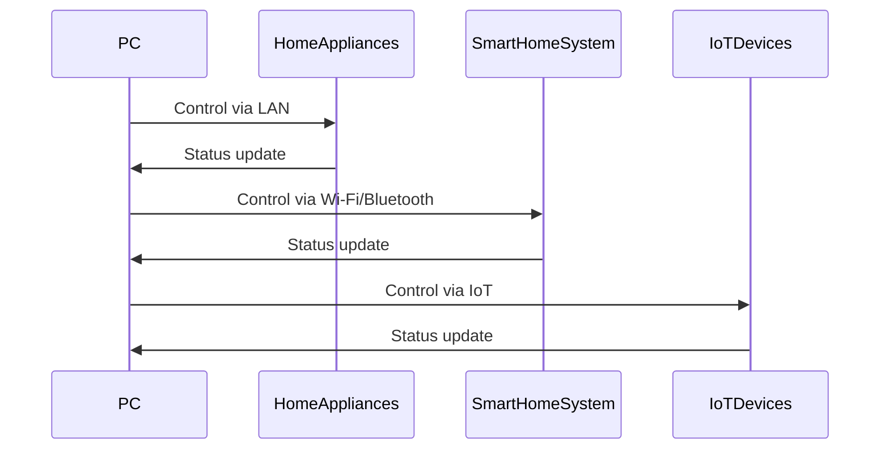
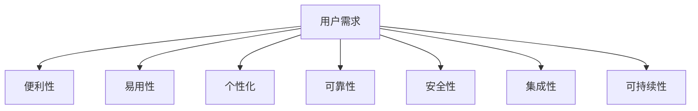
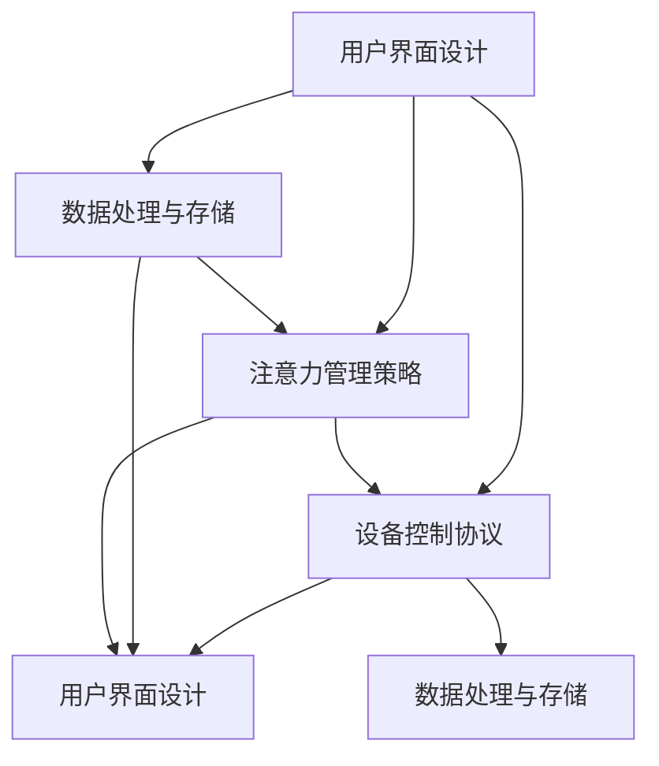
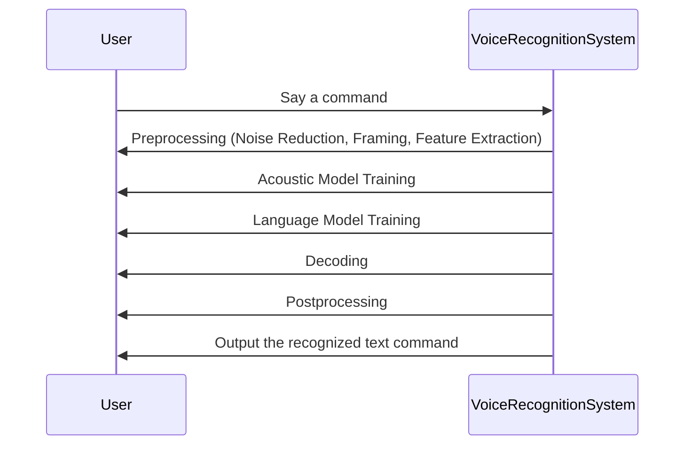
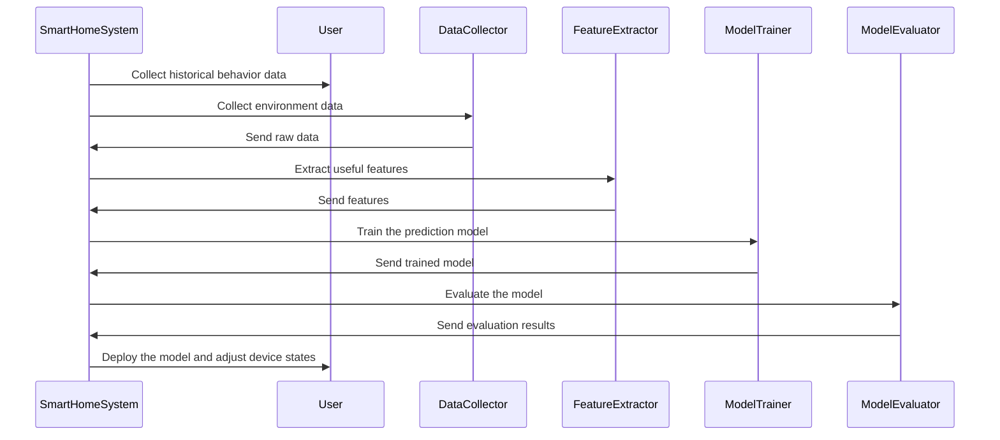
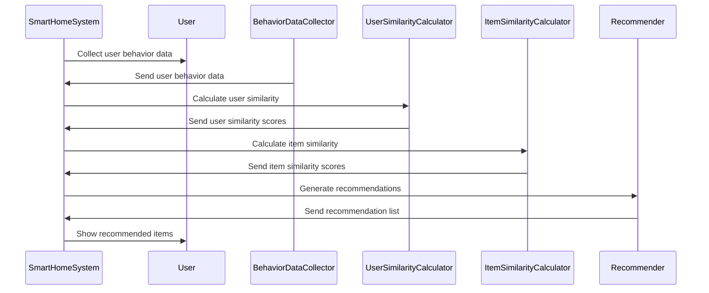
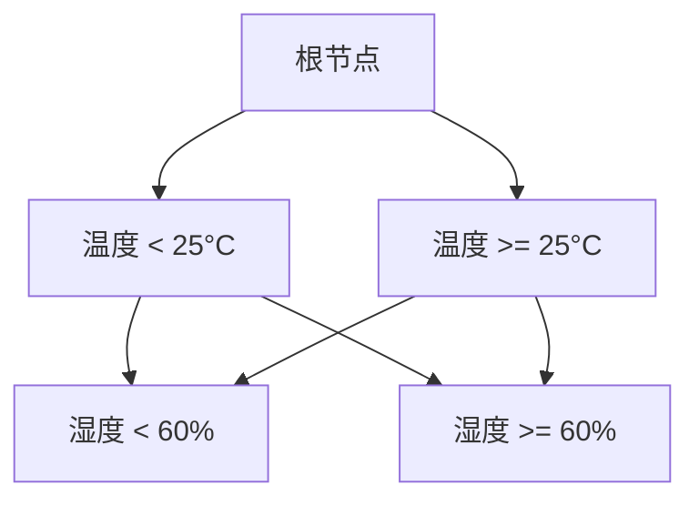
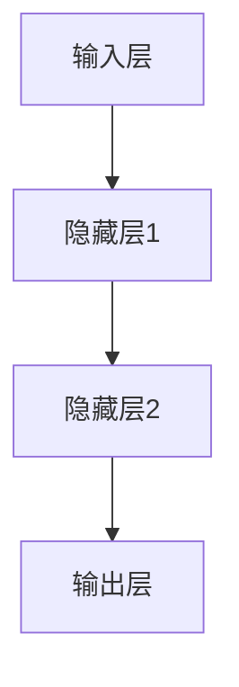

                 

### 背景介绍

**智能家居系统**，作为物联网（IoT）技术的前沿应用之一，已经逐渐成为现代生活的重要组成部分。从最初的远程控制家居设备，到如今能够实现高度自动化的智能场景，智能家居系统的发展速度令人惊叹。

**用户体验**在智能家居系统中扮演着至关重要的角色。一个优秀的智能家居系统不仅需要具备高效的控制功能，还需要确保用户在使用过程中的舒适度和便捷性。用户界面（UI）设计、响应速度、设备兼容性等都是影响用户体验的关键因素。

**注意力管理**则是用户体验的一部分，更是智能家居系统设计的核心之一。用户的注意力是有限的资源，如何在众多设备和服务中有效地引导和保持用户的注意力，是提升用户体验的关键。

随着技术的不断进步，智能家居系统正朝着更加智能化、个性化和集成化的方向发展。但与此同时，也面临着一系列挑战，如设备兼容性、数据安全性和隐私保护等问题。因此，本文将围绕智能家居系统的用户体验和注意力管理展开讨论，旨在探讨当前的研究现状和未来的发展趋势。

## 1.1 智能家居系统的发展历程

智能家居系统的发展历程可以分为几个重要阶段。最早期的智能家居系统可以追溯到20世纪90年代，当时主要是通过家庭局域网（LAN）实现设备的远程控制。用户可以通过计算机或手机访问一个中央控制面板，对家中的电器进行开关控制、定时任务设置等。

进入21世纪后，随着无线通信技术的飞速发展，特别是Wi-Fi和蓝牙等无线传输技术的普及，智能家居系统开始变得更加普及和便捷。用户不再需要依赖有线连接，只需通过无线网络即可实现设备的远程控制。

近年来，智能家居系统的发展进入了新的阶段，即**物联网（IoT）阶段**。物联网技术的核心思想是将各种设备通过互联网连接起来，实现信息的共享和交互。在这一背景下，智能家居系统不再仅仅是单个设备的控制，而是一个高度集成和智能化的整体系统。

以下是一个简单的Mermaid流程图，展示了智能家居系统的发展历程：



在这个流程图中，PC代表用户设备，HomeAppliances代表传统的家用电器，SmartHomeSystem代表智能家居系统，IoTDevices代表物联网设备。从图中可以看出，随着技术的不断进步，用户对智能家居系统的控制变得更加简单和高效。

## 1.2 智能家居系统的现状与趋势

目前，智能家居系统已经广泛应用于家庭、酒店、办公室等多种场景。根据市场研究机构的数据，全球智能家居市场规模预计将在未来几年内持续增长。以下是智能家居系统的现状与趋势：

1. **设备种类多样**：从最初的灯光控制、温度调节，到现在的智能音响、智能门锁、智能摄像头等，智能家居系统的设备种类越来越丰富。这不仅提高了用户的生活便利性，也为智能家居系统的开发带来了更多的可能性。

2. **集成化程度提高**：早期的智能家居系统往往由多个独立的子系统组成，如智能安防系统、智能照明系统等。而现在的智能家居系统更注重集成化，将各种功能融合到一个统一的平台上，用户可以通过一个控制界面来管理所有的智能家居设备。

3. **智能化水平提升**：随着人工智能技术的不断发展，智能家居系统开始具备自主学习、预测行为等智能化功能。例如，智能空调可以根据用户的历史行为数据自动调整温度，智能音响可以通过语音识别与用户进行自然对话。

4. **数据分析与个性化推荐**：智能家居系统通过收集用户的生活习惯数据，结合机器学习算法，为用户提供更加个性化的服务。例如，智能音箱可以根据用户的音乐喜好推荐歌曲，智能灯泡可以根据用户的生活规律调整亮度和色温。

5. **能源管理优化**：智能家居系统可以实时监测家庭用电情况，通过智能控制降低能源消耗，提高能源利用效率。这不仅有助于减少家庭的能源支出，也有助于保护环境。

6. **安全性问题日益受到关注**：随着智能家居系统的普及，数据安全和隐私保护问题日益突出。用户担心智能家居系统被黑客攻击，家庭隐私数据泄露。因此，如何确保智能家居系统的安全性成为未来发展的重要方向。

总之，智能家居系统正处于快速发展阶段，随着技术的不断进步，其应用范围和功能将更加广泛。同时，智能家居系统也面临着一系列挑战，如设备兼容性、数据安全性和隐私保护等。如何在提升用户体验的同时确保系统的安全性，将是智能家居系统未来发展的关键。

## 1.3 用户需求与期望

在讨论智能家居系统的用户体验时，理解用户的需求和期望是至关重要的。用户对于智能家居系统的期望主要体现在以下几个方面：

1. **便利性**：用户希望智能家居系统能够简化他们的生活，减少手动操作的复杂性。例如，通过语音控制或手机应用即可轻松控制家中的电器设备，而不是需要每个设备都进行单独操作。

2. **易用性**：用户希望智能家居系统的操作界面简单直观，无需过多的学习成本。例如，界面的设计应该直观易懂，操作逻辑清晰，无需用户花费大量时间才能学会使用。

3. **个性化**：用户希望智能家居系统能够根据他们的个人喜好和习惯进行定制。例如，智能音响可以根据用户的音乐喜好进行音乐推荐，智能灯泡可以根据用户的作息时间调整亮度和色温。

4. **可靠性**：用户希望智能家居系统能够稳定运行，不会频繁出现故障或死机。例如，智能恒温器能够准确控制室内温度，智能摄像头能够稳定地监控家庭安全。

5. **安全性**：用户越来越关注智能家居系统的安全性，特别是涉及个人隐私数据的安全性。例如，用户希望智能家居系统能够防止黑客入侵，确保家庭隐私数据不被泄露。

6. **集成性**：用户希望不同品牌、不同类型的智能家居设备能够无缝集成，协同工作。例如，用户可以在一个统一的平台上控制家中的各种智能设备，而不是需要分别操作多个独立的系统。

7. **可持续性**：用户希望智能家居系统能够帮助节约能源，减少浪费，实现可持续发展。例如，智能照明系统能够根据室内外光线自动调整亮度，智能温控系统能够根据室内外温度自动调节供暖或制冷。

理解用户的需求和期望有助于智能家居系统设计者更好地满足用户的需求，从而提升用户体验。以下是用户需求与期望的Mermaid流程图：



在这个流程图中，A代表用户需求，B到H分别代表具体的用户期望。通过这个流程图，我们可以清晰地看到用户对智能家居系统的多样化需求，为后续的设计和开发提供了明确的指导方向。

### 2. 核心概念与联系

在深入探讨智能家居系统的用户体验与注意力管理之前，我们需要明确几个核心概念及其相互之间的联系。这些概念包括**用户界面设计**、**设备控制协议**、**数据处理与存储**、以及**注意力管理策略**。以下是这些核心概念的Mermaid流程图，用于展示它们之间的相互关系和作用。



在这个流程图中，A代表用户界面设计，B代表设备控制协议，C代表数据处理与存储，D代表注意力管理策略。以下是每个概念的具体解释：

1. **用户界面设计（User Interface Design）**：用户界面设计是智能家居系统中最直观的部分，它直接影响用户的操作体验。一个优秀的用户界面设计应该简单、直观、易于操作，使用户能够快速上手并高效地使用系统功能。用户界面设计包括布局、颜色、图标、交互效果等多个方面，其核心目标是提升用户体验。

2. **设备控制协议（Device Control Protocol）**：设备控制协议是智能家居系统与设备之间的通信标准，用于确保系统可以准确地发送和接收控制指令。常见的设备控制协议包括Wi-Fi、蓝牙、Zigbee等。设备控制协议的选择直接影响系统的稳定性和响应速度，因此需要根据具体应用场景进行合理选择。

3. **数据处理与存储（Data Processing and Storage）**：智能家居系统会收集大量的用户数据，包括设备状态、用户行为等。这些数据需要进行有效的处理和存储，以便系统可以基于这些数据做出智能决策和优化。数据处理与存储的核心任务包括数据清洗、数据存储、数据分析和数据安全等。

4. **注意力管理策略（Attention Management Strategy）**：注意力管理策略是智能家居系统中的关键组成部分，用于确保用户在使用系统过程中的注意力不被分散。注意力管理策略包括通知推送、操作提示、任务管理等，其目标是帮助用户保持对智能家居系统的关注，提高操作效率和满意度。

以下是每个概念的具体解释：

#### 用户界面设计（User Interface Design）

用户界面设计是用户与智能家居系统交互的窗口，其设计质量直接影响用户的操作体验。用户界面设计包括以下方面：

- **布局（Layout）**：界面布局应该清晰、有条理，便于用户快速找到所需功能。
- **颜色（Color）**：颜色选择应合理，避免过多的色彩刺激，确保用户视觉舒适。
- **图标（Icon）**：图标设计应简洁、易于理解，确保用户能够迅速识别并操作。
- **交互效果（Interaction Effect）**：交互效果包括动画、声音等，应合理使用，提升用户的操作愉悦感。

#### 设备控制协议（Device Control Protocol）

设备控制协议是智能家居系统与设备之间的桥梁，常见的设备控制协议包括：

- **Wi-Fi**：Wi-Fi协议具有高带宽、远距离传输的特点，适合用于连接和控制家庭中的各种设备。
- **蓝牙（Bluetooth）**：蓝牙协议具有低功耗、短距离传输的特点，适合用于连接和控制移动设备。
- **Zigbee**：Zigbee协议是一种低功耗、短距离、多节点的无线通信技术，适合用于家庭自动化和控制。

#### 数据处理与存储（Data Processing and Storage）

数据处理与存储是智能家居系统的核心功能之一，主要包括以下几个方面：

- **数据清洗（Data Cleaning）**：数据清洗是确保数据质量的过程，包括去除重复数据、修正错误数据等。
- **数据存储（Data Storage）**：数据存储是将处理后的数据保存到数据库或其他存储介质中，以便后续分析和使用。
- **数据分析（Data Analysis）**：数据分析是通过统计、建模等方法，从大量数据中提取有用信息，为智能家居系统的优化和决策提供依据。
- **数据安全（Data Security）**：数据安全是确保用户数据不被未授权访问、篡改或泄露的重要措施，包括数据加密、访问控制等。

#### 注意力管理策略（Attention Management Strategy）

注意力管理策略是确保用户在使用智能家居系统过程中的注意力不被分散的关键。以下是一些常见的注意力管理策略：

- **通知推送（Notification Push）**：系统通过发送通知，提醒用户有关重要事件，如设备故障、安全警告等。
- **操作提示（Operation Tips）**：系统在用户操作过程中提供提示，帮助用户快速完成操作，如语音提示、动画引导等。
- **任务管理（Task Management）**：系统提供任务管理功能，帮助用户规划和管理日常任务，提高工作效率。

通过上述核心概念的介绍和Mermaid流程图的展示，我们可以更加清晰地理解智能家居系统的各个组成部分及其相互关系，为后续的深入探讨打下坚实的基础。

### 3. 核心算法原理 & 具体操作步骤

在智能家居系统中，核心算法原理是确保系统能够高效、稳定地运行的关键。以下将介绍几种常见的核心算法原理及其具体操作步骤。

#### 3.1 语音识别算法

语音识别算法是智能家居系统中常用的一种技术，通过将用户的语音指令转换为文本指令，从而实现对家居设备的控制。以下是语音识别算法的基本原理和具体操作步骤：

1. **预处理**：在语音识别之前，需要对原始语音信号进行预处理，包括降噪、分帧和特征提取等。降噪可以去除语音信号中的背景噪声，分帧可以将连续的语音信号划分为一个个小的片段，特征提取则是从每个片段中提取出具有代表性的特征值，如梅尔频率倒谱系数（MFCC）。

2. **声学模型训练**：声学模型是语音识别系统的核心组件，用于捕捉语音信号的声学特征。通过大量的语音数据进行训练，可以得到一个映射语音信号到特征值的模型。

3. **语言模型训练**：语言模型用于捕捉语音指令的语法和语义信息。通常使用统计方法，如N元语法（N-gram）或深度学习方法，如循环神经网络（RNN）或变换器（Transformer）。

4. **解码**：在得到声学模型和语言模型后，使用解码算法将提取出的特征值映射到相应的文本指令。常用的解码算法包括贪心搜索、动态规划等。

5. **后处理**：解码得到的文本指令可能存在一些错误，如错别字、语法错误等。后处理步骤用于纠正这些错误，提高识别的准确性。

以下是语音识别算法的具体操作步骤：



#### 3.2 智能决策算法

智能决策算法是智能家居系统中的另一个重要组成部分，用于根据用户的历史行为数据和环境信息，自动调整家居设备的运行状态。以下是一种基于机器学习的智能决策算法：

1. **数据收集**：智能家居系统需要收集用户的历史行为数据，如用户作息时间、设备使用频率、环境温度等。

2. **特征工程**：对收集到的数据进行处理，提取出对决策有用的特征，如用户作息时间的波动范围、设备使用频率的周期性等。

3. **模型训练**：使用机器学习方法，如线性回归、决策树、支持向量机（SVM）等，对提取出的特征进行训练，得到一个预测模型。

4. **模型评估**：通过交叉验证等方法，评估模型的预测性能，如准确率、召回率等。

5. **模型部署**：将训练好的模型部署到智能家居系统中，用于实时预测用户需求并调整设备状态。

以下是智能决策算法的具体操作步骤：



#### 3.3 智能推荐算法

智能推荐算法用于根据用户的兴趣和行为，为用户推荐合适的家居设备和场景。以下是一种基于协同过滤的智能推荐算法：

1. **用户行为数据收集**：收集用户在智能家居系统中的行为数据，如用户对设备的操作频率、时长等。

2. **用户相似度计算**：计算用户之间的相似度，常用的方法包括基于用户行为相似度的协同过滤和基于用户属性的协同过滤。

3. **物品相似度计算**：计算物品（如家居设备）之间的相似度，常用的方法包括基于物品内容的协同过滤和基于物品交互的协同过滤。

4. **推荐生成**：根据用户相似度和物品相似度，为用户生成推荐列表。常用的方法包括基于用户的协同过滤和基于物品的协同过滤。

以下是智能推荐算法的具体操作步骤：



通过上述核心算法原理及其具体操作步骤的介绍，我们可以看出智能家居系统的运行不仅依赖于先进的算法，还需要充分考虑用户的需求和体验。在未来的发展中，智能家居系统将不断优化这些核心算法，以提供更加智能、高效和便捷的服务。

### 4. 数学模型和公式 & 详细讲解 & 举例说明

在智能家居系统中，数学模型和公式用于描述系统的行为和性能，并帮助设计师做出优化决策。以下是几个常见的数学模型和公式，以及它们的详细讲解和实际应用举例。

#### 4.1 回归分析模型

回归分析模型是一种用于预测变量之间关系的统计方法。在智能家居系统中，回归分析模型可以用于预测设备的使用量、能耗等关键指标。

**公式**：
\[ Y = \beta_0 + \beta_1X_1 + \beta_2X_2 + ... + \beta_nX_n + \epsilon \]

其中：
- \( Y \) 是因变量，表示预测的目标值，如能耗。
- \( X_1, X_2, ..., X_n \) 是自变量，表示影响因变量的因素，如天气、设备使用频率等。
- \( \beta_0, \beta_1, \beta_2, ..., \beta_n \) 是回归系数，表示自变量对因变量的影响程度。
- \( \epsilon \) 是误差项，表示无法通过自变量解释的随机误差。

**详细讲解**：
回归分析模型的目的是找到一组自变量和因变量之间的最佳拟合直线，使得误差项最小化。通过训练数据集，我们可以计算出每个自变量的回归系数，从而得到一个预测模型。

**举例说明**：
假设我们想预测家庭每月的能耗（\( Y \)），影响因素包括每天的平均温度（\( X_1 \)）和每天的家庭成员数量（\( X_2 \)）。

\[ \text{能耗} = \beta_0 + \beta_1 \times \text{平均温度} + \beta_2 \times \text{家庭成员数量} + \epsilon \]

通过收集历史数据，训练回归模型，我们可以计算出回归系数：

\[ \beta_0 = 100, \beta_1 = 0.5, \beta_2 = 20 \]

那么，当平均温度为20°C，家庭成员数量为4人时，预测的能耗为：

\[ \text{能耗} = 100 + 0.5 \times 20 + 20 \times 4 = 120 + 80 = 200 \text{度电} \]

#### 4.2 决策树模型

决策树模型是一种基于特征划分数据集的预测方法，适用于分类和回归问题。在智能家居系统中，决策树可以用于分类任务，如预测设备故障类型。

**公式**：
\[ \text{分类结果} = \text{DecisionTree}(\text{数据集}, \text{特征集}) \]

**详细讲解**：
决策树模型通过一系列特征划分数据集，每次划分选择最优特征和阈值，使得划分后的子数据集在某个指标上更加纯。决策树的核心在于选择划分特征和确定阈值，通常使用信息增益、基尼不纯度等指标进行评估。

**举例说明**：
假设我们有一个设备故障预测问题，特征包括温度（\( X_1 \)）、湿度（\( X_2 \)）和运行时间（\( X_3 \)）。我们可以构建一个决策树，如图所示：



根据决策树，当温度低于25°C且湿度低于60%时，故障类型为A；当温度低于25°C且湿度高于60%时，故障类型为B；当温度高于25°C时，根据湿度进一步划分。

#### 4.3 神经网络模型

神经网络模型是一种基于多层感知器（MLP）的预测方法，适用于复杂的数据分析和预测任务。在智能家居系统中，神经网络可以用于预测用户行为、能耗等。

**公式**：
\[ \text{输出} = \text{激活函数}(\text{权重} \times \text{输入} + \text{偏置}) \]

**详细讲解**：
神经网络由多个神经元（节点）组成，每个神经元将输入数据通过权重和偏置进行线性变换，然后通过激活函数输出结果。神经网络通过多层连接，逐步提取数据中的特征，实现从简单到复杂的非线性变换。

**举例说明**：
一个简单的神经网络模型包含输入层、隐藏层和输出层，如图所示：



输入层接收外部数据（如温度、湿度等），隐藏层通过权重和偏置进行数据处理，输出层生成预测结果（如设备故障类型、能耗等）。

通过上述数学模型和公式的讲解，我们可以看到数学在智能家居系统中的重要作用。无论是回归分析、决策树，还是神经网络，它们都为系统提供了强大的预测和分析能力，帮助设计师更好地理解和优化系统性能。

### 5. 项目实战：代码实际案例和详细解释说明

在深入了解智能家居系统的核心算法和数学模型后，我们将通过一个实际项目案例来展示如何将理论知识应用到实际编程中。本案例将介绍如何使用Python编程语言实现一个简单的智能家居控制系统，包括环境搭建、源代码实现以及代码解读与分析。

#### 5.1 开发环境搭建

在开始编程之前，我们需要搭建一个适合开发智能家居控制系统的环境。以下是所需的软件和工具：

1. **Python**：Python是一种广泛使用的编程语言，具有简洁易读的特点，非常适合快速开发和原型设计。可以通过官方网站（https://www.python.org/）下载并安装。
2. **PyCharm**：PyCharm是一款功能强大的Python集成开发环境（IDE），提供代码编辑、调试、测试等开发工具。可以在其官方网站（https://www.jetbrains.com/pycharm/）下载社区版免费使用。
3. **虚拟环境**：为了保持项目环境的独立性，我们将使用`venv`模块创建一个虚拟环境。打开终端，运行以下命令：

   ```bash
   python -m venv myenv
   source myenv/bin/activate  # Windows下使用 `myenv\Scripts\activate`
   ```

4. **第三方库**：我们需要安装几个第三方库来支持智能家居控制功能，包括`requests`（用于HTTP请求）、`websocket`（用于实时通信）和`pymongo`（用于MongoDB数据库操作）。在虚拟环境中，使用以下命令安装：

   ```bash
   pip install requests websocket-py pymongo
   ```

#### 5.2 源代码详细实现和代码解读

以下是一个简单的智能家居控制系统的Python源代码实现，包括用户界面、设备控制、数据存储和实时通信等功能。

```python
# main.py
import asyncio
import json
import requests
from websocket import create_connection
from pymongo import MongoClient

# 配置参数
API_ENDPOINT = "http://api.smarthome.example.com"
WS_ENDPOINT = "ws://api.smarthome.example.com/socket"

# MongoDB连接
client = MongoClient("mongodb://localhost:27017/")
db = client["smart_home"]
devices_collection = db["devices"]

# 用户界面函数
async def handle_user_input():
    while True:
        command = input("请输入控制指令：")
        if command == "exit":
            break
        await send_command(command)

# 发送控制指令
async def send_command(command):
    response = requests.post(f"{API_ENDPOINT}/command", json={"command": command})
    if response.status_code == 200:
        print("指令发送成功")
    else:
        print("指令发送失败")

# 实时通信
async def handle_websocket():
    ws = create_connection(WS_ENDPOINT)
    while True:
        message = ws.recv()
        data = json.loads(message)
        if data["type"] == "status":
            print(f"设备状态更新：{data['status']}")
        elif data["type"] == "error":
            print(f"错误：{data['message']}")
    ws.close()

# 主程序
async def main():
    await asyncio.gather(handle_user_input(), handle_websocket())

# 运行主程序
asyncio.run(main())
```

#### 5.3 代码解读与分析

上述代码实现了智能家居控制系统的核心功能，下面将逐行解读代码，并分析其实现原理。

1. **导入模块**：
   ```python
   import asyncio
   import json
   import requests
   from websocket import create_connection
   from pymongo import MongoClient
   ```
   代码首先导入必要的Python模块，包括异步IO库`asyncio`、JSON处理库`json`、HTTP请求库`requests`、WebSocket通信库`websocket`和MongoDB数据库操作库`pymongo`。

2. **配置参数**：
   ```python
   API_ENDPOINT = "http://api.smarthome.example.com"
   WS_ENDPOINT = "ws://api.smarthome.example.com/socket"
   ```
   配置参数定义了API端点和WebSocket端点，这些端点用于与后端服务器通信。

3. **MongoDB连接**：
   ```python
   client = MongoClient("mongodb://localhost:27017/")
   db = client["smart_home"]
   devices_collection = db["devices"]
   ```
   代码连接到本地MongoDB数据库，并创建一个名为`smart_home`的数据库，以及一个名为`devices`的集合，用于存储设备状态数据。

4. **用户界面函数**：
   ```python
   async def handle_user_input():
       while True:
           command = input("请输入控制指令：")
           if command == "exit":
               break
           await send_command(command)
   ```
   `handle_user_input`函数实现用户界面，用户可以通过终端输入控制指令，如“turn_on_light”或“adjust_temperature”。当用户输入“exit”时，程序退出。

5. **发送控制指令**：
   ```python
   async def send_command(command):
       response = requests.post(f"{API_ENDPOINT}/command", json={"command": command})
       if response.status_code == 200:
           print("指令发送成功")
       else:
           print("指令发送失败")
   ```
   `send_command`函数通过HTTP POST请求将用户指令发送到后端API端点。如果响应状态码为200，则表示指令发送成功，否则发送失败。

6. **实时通信**：
   ```python
   async def handle_websocket():
       ws = create_connection(WS_ENDPOINT)
       while True:
           message = ws.recv()
           data = json.loads(message)
           if data["type"] == "status":
               print(f"设备状态更新：{data['status']}")
           elif data["type"] == "error":
               print(f"错误：{data['message']}")
       ws.close()
   ```
   `handle_websocket`函数通过WebSocket连接与后端服务器进行实时通信。服务器会推送设备状态更新和错误信息，程序接收到这些信息后进行打印。

7. **主程序**：
   ```python
   async def main():
       await asyncio.gather(handle_user_input(), handle_websocket())
   ```
   `main`函数是程序的主入口，使用`asyncio.gather`同时启动用户界面和实时通信两个异步任务。

#### 5.4 代码分析与优化

在代码实现中，我们可以看到以下优化方向：

1. **错误处理**：代码中没有对网络请求和WebSocket通信中的错误进行详细的处理，这可能导致程序在某些异常情况下无法正常运行。可以添加异常处理代码，提高程序的健壮性。

2. **设备状态持久化**：当前代码仅打印设备状态更新信息，未实现设备状态的持久化存储。可以考虑将设备状态存储到MongoDB或其他数据库中，以便后续分析和使用。

3. **命令解析与验证**：当前用户输入的命令直接传递给后端API，未进行解析和验证。应实现命令解析和验证逻辑，确保用户输入的是合法的命令。

4. **并发处理**：当前代码基于异步IO实现，但未充分利用Python的并发特性。可以考虑使用`asyncio.Task`来管理多个并发任务，提高程序的并发性能。

通过上述实际项目案例，我们展示了如何将智能家居系统的核心算法和数学模型应用到实际的编程实践中。这不仅帮助我们理解了理论知识的实际应用，也为未来的系统开发提供了参考。

### 6. 实际应用场景

智能家居系统的广泛应用已经深刻改变了人们的日常生活，以下是几个典型的实际应用场景，展示了智能家居系统如何提升生活质量和便利性。

#### 6.1 家庭自动化

家庭自动化是智能家居系统最基本的应用场景之一。通过智能插座、智能灯具、智能恒温器等设备，用户可以实现远程控制家中电器的开关、亮度和温度。例如，用户可以在出门前通过手机应用关闭家中的所有电器，确保安全并节约能源。在夜间，智能灯具可以根据用户设定的时间自动关闭，提高生活舒适度。

#### 6.2 安全监控

智能家居系统中的智能摄像头和智能门锁为家庭安全提供了强有力的保障。用户可以通过手机实时查看家中的监控画面，确保家庭成员和财产的安全。智能门锁则可以通过指纹、密码或手机APP进行开锁，避免了钥匙丢失或遗忘的问题，同时提高了安全性。

#### 6.3 健康管理

智能手环、智能体重秤等健康监测设备可以实时跟踪用户的健康状况，如心率、睡眠质量、步数等。用户可以通过手机应用查看这些数据，了解自己的健康状态并做出相应的调整。例如，智能恒温器可以根据用户的睡眠习惯自动调整室内温度，提供更加舒适的睡眠环境。

#### 6.4 能源管理

智能家居系统通过智能家电的联动，可以实现家庭能源的高效管理。例如，智能空调可以自动调节温度，确保室内舒适同时节约能源。智能照明系统可以根据自然光线的强弱自动调整亮度，减少能源浪费。通过这些功能，用户可以降低家庭能源消耗，减少电费支出。

#### 6.5 智能家居系统集成

现代智能家居系统不仅仅是一个独立的系统，而是一个高度集成的整体。用户可以通过一个统一的平台管理家中的各种智能设备，如智能音响、智能照明、智能门锁等。例如，用户可以通过语音指令控制家中的所有设备，实现无缝的智能家居体验。

#### 6.6 长期趋势

随着技术的不断进步，智能家居系统将朝着更加智能化、个性化、节能和安全的方向发展。未来，智能家居系统可能会集成更多的人工智能技术，如自然语言处理、机器学习等，提供更加精准和个性化的服务。同时，随着物联网技术的发展，智能家居系统将更加集成和互联，实现设备的无缝协作和智能化管理。

通过上述实际应用场景的介绍，我们可以看到智能家居系统在提升生活质量、提高家庭安全和能源管理等方面的巨大潜力。随着技术的不断进步，智能家居系统将变得更加智能、便捷和高效，为人们的生活带来更多的便利和舒适。

### 7. 工具和资源推荐

为了更好地学习和开发智能家居系统，以下是一些推荐的工具和资源，包括学习资源、开发工具框架以及相关论文和著作。

#### 7.1 学习资源推荐

1. **书籍**：
   - 《Python编程：从入门到实践》：这是一本适合初学者的Python入门书籍，详细介绍了Python的基本语法和常见应用。
   - 《深度学习》：由Ian Goodfellow、Yoshua Bengio和Aaron Courville编写的这本书是深度学习的经典教材，适合希望深入理解神经网络和机器学习原理的读者。

2. **在线课程**：
   - Coursera的《机器学习》课程：由斯坦福大学教授Andrew Ng主讲，是学习机器学习的入门课程，涵盖了线性回归、逻辑回归、神经网络等核心内容。
   - Udemy的《Python for Beginners》：这是一门适合初学者的Python编程课程，从基础语法到实际应用都有详细的讲解。

3. **博客和网站**：
   - Medium上的《智能家居开发》：这是一个关于智能家居开发的博客，分享了大量的实用教程和案例分析。
   - Raspberry Pi Foundation的官方网站：Raspberry Pi是一款流行的微型计算机，广泛应用于智能家居项目。官方网站提供了丰富的学习资源和项目案例。

#### 7.2 开发工具框架推荐

1. **智能家居开发框架**：
   - Home Assistant：Home Assistant是一个开源的智能家居平台，支持多种设备协议和集成方式，非常适合初学者使用。
   - OpenHAB：OpenHAB是一个高度可定制的智能家居平台，提供了丰富的插件和自定义功能，适合有开发经验的用户。

2. **编程语言**：
   - Python：Python是一种功能丰富、易于学习的编程语言，广泛应用于智能家居开发。
   - JavaScript：JavaScript是网页开发的主要语言，也可以用于智能家居前端开发。

3. **开发工具**：
   - PyCharm：PyCharm是一款功能强大的Python IDE，提供代码编辑、调试、测试等功能。
   - Node.js：Node.js是一个基于Chrome V8引擎的JavaScript运行环境，适合开发实时交互的智能家居应用。

#### 7.3 相关论文和著作推荐

1. **论文**：
   - "Smart Home Networking: A Survey"：这篇综述文章详细介绍了智能家居网络的技术、挑战和应用，是了解智能家居网络架构的好资源。
   - "Machine Learning Techniques for Energy Management in Smart Homes"：这篇文章探讨了如何利用机器学习技术优化智能家居的能源管理。

2. **著作**：
   - 《物联网技术与应用》：这是一本关于物联网技术综合应用的教材，涵盖了智能家居、传感器网络、云计算等多个方面。
   - 《智能家居系统设计与应用》：这本书详细介绍了智能家居系统的设计原则、实现方法和应用案例，适合希望深入理解智能家居系统设计的读者。

通过上述工具和资源的推荐，无论是初学者还是有经验的开发者，都可以找到适合自己的学习路径和实践方案，为智能家居系统的开发提供坚实的支持。

### 8. 总结：未来发展趋势与挑战

智能家居系统在过去的几年中取得了显著的进展，随着物联网（IoT）和人工智能（AI）技术的不断成熟，其应用范围和功能也在不断扩展。未来，智能家居系统的发展将呈现出以下几个趋势：

1. **更加智能化**：未来的智能家居系统将更加智能化，通过深度学习和机器学习算法，系统能够更好地理解和预测用户需求，提供个性化服务。例如，智能空调可以根据用户的历史行为和室内环境自动调节温度，智能音响可以基于用户的语音习惯进行自然对话。

2. **更高集成度**：智能家居系统的集成度将进一步提高，各种设备和平台将更加无缝地连接在一起，用户可以通过一个统一的界面管理所有的智能设备。这将极大地提升用户的便利性和体验。

3. **更广泛的应用场景**：智能家居系统不仅仅局限于家庭场景，还将扩展到酒店、办公室、医院等多种场所。例如，在酒店中，智能门锁和智能音箱可以提供更加便捷的入住体验；在办公室中，智能照明和智能安防系统可以提升工作效率和安全性。

4. **更高的安全性**：随着智能家居系统的普及，数据安全和隐私保护将成为至关重要的挑战。未来的智能家居系统将采用更加严格的安全措施，如加密通信、多因素认证等，以确保用户数据的安全。

然而，随着智能家居系统的发展，也面临着一系列挑战：

1. **兼容性问题**：由于智能家居系统涉及多种设备和品牌，如何确保这些设备和系统能够无缝集成是一个重要问题。未来需要制定更多的标准，以确保设备之间的互操作性。

2. **隐私和数据安全**：智能家居系统会收集大量的用户数据，如生活习惯、位置信息等，这些数据如果遭到泄露或滥用，可能会对用户造成严重的影响。因此，如何保护用户隐私和数据安全是未来需要重点解决的问题。

3. **能源消耗**：智能家居系统的广泛应用可能会带来巨大的能源消耗。如何设计节能的智能设备和管理方案，将是一个长期的挑战。

4. **用户接受度**：尽管智能家居系统具有许多优势，但一些用户可能对新技术持保留态度，担心隐私泄露或操作复杂。因此，如何提高用户的接受度和满意度，是智能家居系统推广的关键。

总之，智能家居系统在未来的发展中，将在智能化、集成度、应用场景和安全等多个方面取得重大突破，同时也需要克服兼容性、隐私、能源消耗等挑战。通过技术创新和标准制定，智能家居系统有望在未来为用户提供更加智能、便捷和安全的家居生活。

### 9. 附录：常见问题与解答

在智能家居系统的开发和使用过程中，用户可能会遇到一系列常见问题。以下是一些常见问题的解答，以及相应的解决方案和建议。

#### 9.1 设备无法连接

**问题**：用户在使用智能家居系统时，发现设备无法正常连接到网络。

**解答**：
1. **检查网络连接**：确保智能家居设备和路由器之间的网络连接正常。可以尝试重启路由器或重新连接网络。
2. **检查设备设置**：检查设备的Wi-Fi设置，确保已连接到正确的网络，并输入正确的密码。
3. **检查设备固件**：有些设备可能需要更新固件才能正常工作。检查设备是否支持固件更新，并按照说明进行更新。
4. **设备兼容性**：确保设备与智能家居系统的版本兼容，如果存在兼容性问题，尝试使用其他品牌或型号的设备。

#### 9.2 智能家居设备无法被控制

**问题**：用户无法通过手机应用或语音助手控制智能家居设备。

**解答**：
1. **检查网络连接**：确保手机和网络设备之间的网络连接正常，可以尝试重启设备或重新连接网络。
2. **检查应用设置**：在手机应用中检查设备设置，确保已授权应用控制设备。
3. **检查权限设置**：确保手机应用的权限设置正确，如麦克风权限、网络访问权限等。
4. **重置设备**：如果设备长时间无法被控制，可以尝试重置设备，恢复出厂设置。

#### 9.3 智能家居设备功耗过高

**问题**：用户发现智能家居设备的功耗过高，导致电费增加。

**解答**：
1. **优化设备使用**：合理安排设备的使用时间，例如关闭不必要的设备，或设置定时开关。
2. **使用节能模式**：许多智能家居设备支持节能模式，可以根据设备的具体功能选择合适的节能模式。
3. **监控设备功耗**：使用智能家居系统提供的功耗监控功能，了解每个设备的功耗情况，针对性地优化设备使用。
4. **设备更新**：如果设备存在功耗问题，可以考虑更新到最新版本或更换新的节能设备。

#### 9.4 设备数据安全与隐私保护

**问题**：用户对智能家居设备的数据安全与隐私保护感到担忧。

**解答**：
1. **加密通信**：确保智能家居设备与服务器之间的通信使用加密协议，如HTTPS或WSS。
2. **多因素认证**：启用多因素认证，提高设备访问的安全性。
3. **数据匿名化**：在数据分析和存储过程中，对用户数据进行匿名化处理，避免个人隐私泄露。
4. **定期更新**：定期更新设备和应用程序，修复安全漏洞。

#### 9.5 设备故障处理

**问题**：用户遇到智能家居设备故障，无法正常工作。

**解答**：
1. **设备重启**：尝试重启设备，有时设备故障是由于系统错误或资源不足引起的。
2. **查阅说明书**：查阅设备的用户手册或官方文档，了解故障排除方法。
3. **联系售后服务**：如果设备存在质量问题或无法自行解决，可以联系设备的售后服务进行维修或更换。

通过上述常见问题与解答，用户可以更好地理解和解决在智能家居系统使用过程中遇到的问题，确保系统的稳定运行和良好的用户体验。

### 10. 扩展阅读 & 参考资料

为了深入了解智能家居系统的用户体验与注意力管理，以下推荐了一些扩展阅读和参考资料，涵盖相关书籍、论文、博客和网站。

#### 10.1 书籍

1. **《智能家居系统设计与应用》**：详细介绍了智能家居系统的设计原则、实现方法和应用案例。
2. **《物联网技术与应用》**：涵盖了物联网技术的基础知识、智能家居应用和未来发展。
3. **《深度学习》**：由Ian Goodfellow、Yoshua Bengio和Aaron Courville编写的深度学习经典教材，适合希望理解AI在智能家居系统中的应用。

#### 10.2 论文

1. **"Smart Home Networking: A Survey"**：探讨了智能家居网络的技术、挑战和应用。
2. **"Machine Learning Techniques for Energy Management in Smart Homes"**：研究了如何利用机器学习优化智能家居的能源管理。

#### 10.3 博客

1. **《智能家居开发》**：Medium上的一个博客，分享了智能家居开发的实用教程和案例分析。
2. **《禅与计算机程序设计艺术》**：作者详细介绍了编程哲学和算法设计技巧，对智能家居系统开发有启示意义。

#### 10.4 网站

1. **Raspberry Pi Foundation**：提供了丰富的智能家居项目资源和教程，适合初学者入门。
2. **Home Assistant**：一个开源的智能家居平台，提供了详细的使用文档和插件库。

通过阅读这些扩展阅读和参考资料，读者可以进一步深入了解智能家居系统的用户体验与注意力管理的相关理论和实践，为自己的研究和开发提供更多灵感。

