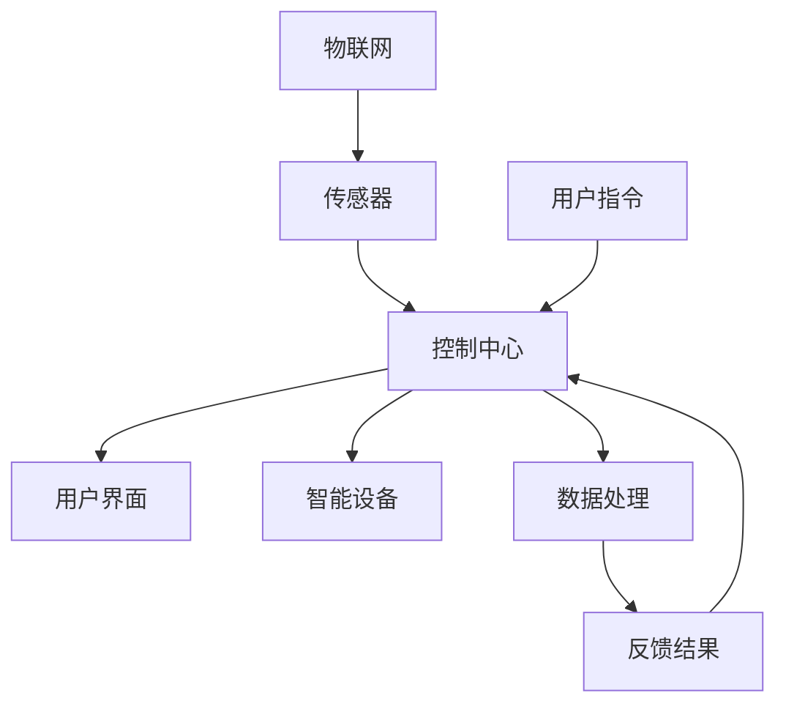

                 

### 文章标题：智能家居系统：打造未来生活场景的创业方向

> **关键词：** 智能家居，物联网，创业方向，系统集成，用户体验，人工智能，数据分析，智能家居生态系统。

> **摘要：** 本文章深入探讨了智能家居系统的定义、核心概念、架构设计、算法原理、数学模型、实战应用场景、开发工具与资源推荐以及未来发展趋势和挑战。通过详细的步骤分析和实际案例，为创业者提供了构建智能家居系统的实用指导。

### 1. 背景介绍

随着科技的飞速发展，物联网（IoT）技术逐渐渗透到我们日常生活的方方面面。智能家居系统作为物联网的重要应用场景之一，正逐渐改变人们的居住方式。智能家居系统通过整合各种智能设备，实现家庭自动化，提高居住舒适度和能源利用效率，同时也为创业者提供了丰富的商业机会。

近年来，全球智能家居市场呈现出迅猛增长的态势。据市场研究公司Statista的数据，全球智能家居设备安装量预计将在2025年达到55亿台。这一巨大的市场潜力吸引了众多创业者和企业纷纷进入智能家居领域。然而，智能家居系统的开发与运营面临着诸多挑战，如设备兼容性、数据安全、用户体验等。

本文旨在通过深入分析智能家居系统的各个方面，为创业者提供一套系统性的指导，帮助他们更好地把握市场机遇，打造成功的智能家居创业项目。

#### 1.1 智能家居的定义与发展历程

智能家居系统是指通过物联网技术将家庭中的各种设备和系统连接起来，实现智能控制和管理。智能家居系统的发展历程可以分为以下几个阶段：

- **初级阶段**：这一阶段主要涉及简单的家居设备联网，如智能灯泡、智能插座等。这些设备可以通过智能手机或其他远程控制设备进行控制，但功能相对单一。

- **中级阶段**：随着技术的进步，智能家居系统开始引入更多的智能设备，如智能门锁、智能窗帘、智能空调等。这些设备可以实现更复杂的场景联动和自动化控制。

- **高级阶段**：目前，智能家居系统正向高级阶段发展，实现更全面的家庭自动化和智能管理。例如，通过语音助手、人脸识别等技术，实现无接触操作，提升用户体验。

#### 1.2 全球智能家居市场现状

全球智能家居市场正处于快速增长阶段。据市场研究公司IDC的数据，2019年全球智能家居市场规模约为2800亿美元，预计到2025年将增长到7800亿美元。以下是一些全球智能家居市场的主要趋势：

- **技术升级**：随着人工智能、物联网、大数据等技术的不断进步，智能家居系统的功能越来越强大，用户体验不断优化。

- **市场细分**：智能家居市场呈现出多元化、细分化的趋势，不同类型、不同需求的智能家居产品层出不穷。

- **区域差异**：全球智能家居市场的区域差异较大，北美和欧洲市场较为成熟，亚洲市场增长迅速，尤其是中国、印度等新兴市场。

### 2. 核心概念与联系

智能家居系统的实现离不开以下几个核心概念和技术的支持：

- **物联网（IoT）**：物联网是智能家居系统的基石，通过将各种设备连接到互联网，实现数据的实时传输和交互。

- **传感器**：传感器用于感知环境信息，如温度、湿度、光照等，并将这些信息转化为电信号，供智能家居系统处理。

- **控制中心**：控制中心是智能家居系统的核心，负责接收传感器数据、执行用户指令、协调各个设备之间的通信。

- **用户界面**：用户界面是用户与智能家居系统交互的桥梁，如智能手机应用、语音助手等。

下面是一个智能家居系统的 Mermaid 流程图，展示了这些核心概念之间的联系：



#### 2.1 物联网与智能家居

物联网是智能家居系统的关键技术，它通过将各种设备连接到互联网，实现设备的远程控制和管理。物联网技术主要包括以下几个方面：

- **连接技术**：如Wi-Fi、蓝牙、ZigBee等，用于实现设备之间的数据传输。

- **通信协议**：如HTTP、MQTT等，用于确保数据传输的可靠性和安全性。

- **数据存储和处理**：通过云计算、大数据等技术，实现海量数据的高效存储和处理。

#### 2.2 传感器与智能家居

传感器是智能家居系统的感知器官，用于感知环境信息，如温度、湿度、光照等。根据传感器的工作原理，可以分为以下几类：

- **物理传感器**：如温度传感器、湿度传感器、光照传感器等，用于感知物理环境。

- **生物传感器**：如心率传感器、血压传感器等，用于感知人体生理信息。

- **化学传感器**：如气体传感器、湿度传感器等，用于感知化学环境。

#### 2.3 控制中心与智能家居

控制中心是智能家居系统的核心，负责接收传感器数据、执行用户指令、协调各个设备之间的通信。控制中心通常包括以下几个方面：

- **硬件设备**：如智能网关、智能控制器等，用于接收和处理传感器数据。

- **软件系统**：如智能家居操作系统、应用程序等，用于实现设备的远程控制和场景联动。

- **数据处理**：通过数据分析，实现智能家居系统的智能化和个性化。

#### 2.4 用户界面与智能家居

用户界面是用户与智能家居系统交互的桥梁，如智能手机应用、语音助手等。用户界面需要提供简洁、直观的操作方式，方便用户对智能家居系统进行设置和控制。常见的用户界面技术包括：

- **智能手机应用**：通过移动应用，用户可以随时随地控制智能家居设备，查看设备状态。

- **语音助手**：通过语音交互，用户可以与智能家居系统进行自然语言交流，实现设备的智能控制。

### 3. 核心算法原理 & 具体操作步骤

智能家居系统的核心算法原理主要包括以下几个方面：

- **数据采集与处理**：通过传感器收集环境数据，进行数据清洗、过滤和预处理。

- **场景联动与自动化控制**：根据用户设定和实时数据，实现设备之间的联动和自动化控制。

- **预测分析与决策支持**：通过对历史数据和实时数据的分析，预测用户需求，提供决策支持。

下面是具体的操作步骤：

#### 3.1 数据采集与处理

1. **传感器数据采集**：通过物联网技术，从各个传感器设备中采集温度、湿度、光照等环境数据。

2. **数据清洗**：去除噪声、异常值等无效数据。

3. **数据过滤**：根据用户需求和场景，过滤出有用的数据。

4. **数据预处理**：将采集到的数据进行归一化、标准化等处理，以便后续分析。

#### 3.2 场景联动与自动化控制

1. **用户设定**：用户通过控制中心或用户界面，设定各种场景和自动化规则。

2. **实时数据监测**：控制中心实时监测传感器数据，判断是否满足用户设定的条件。

3. **触发联动**：当满足条件时，控制中心根据用户设定的规则，触发相应的设备联动，如打开灯光、调节温度等。

4. **自动化控制**：当设备联动触发后，设备自动执行相应的操作，实现自动化控制。

#### 3.3 预测分析与决策支持

1. **历史数据收集**：收集用户的历史行为数据，如习惯、偏好等。

2. **数据挖掘**：通过对历史数据的分析，挖掘用户的潜在需求。

3. **预测模型构建**：基于数据挖掘结果，构建预测模型，预测用户的未来需求。

4. **决策支持**：根据预测结果，为用户提供个性化的建议和决策支持。

### 4. 数学模型和公式 & 详细讲解 & 举例说明

智能家居系统的核心算法涉及多个数学模型和公式，以下是一些常见的数学模型和公式：

#### 4.1 数据清洗与过滤

- **均值滤波**：
  $$ \bar{x} = \frac{1}{n}\sum_{i=1}^{n}x_i $$
  其中，\( x_i \) 表示第 \( i \) 个传感器数据，\( n \) 表示传感器数量。

- **中值滤波**：
  $$ median = \frac{1}{n}\sum_{i=1}^{n}x_i $$
  其中，\( x_i \) 表示第 \( i \) 个传感器数据，\( n \) 表示传感器数量。

#### 4.2 场景联动与自动化控制

- **条件概率**：
  $$ P(A|B) = \frac{P(A \cap B)}{P(B)} $$
  其中，\( A \) 表示事件 \( A \)，\( B \) 表示事件 \( B \)，\( P(A \cap B) \) 表示事件 \( A \) 和事件 \( B \) 同时发生的概率，\( P(B) \) 表示事件 \( B \) 发生的概率。

- **贝叶斯公式**：
  $$ P(A|B) = \frac{P(B|A)P(A)}{P(B)} $$
  其中，\( A \) 表示事件 \( A \)，\( B \) 表示事件 \( B \)，\( P(B|A) \) 表示在事件 \( A \) 发生的条件下，事件 \( B \) 发生的概率，\( P(A) \) 表示事件 \( A \) 发生的概率。

#### 4.3 预测分析与决策支持

- **线性回归模型**：
  $$ y = \beta_0 + \beta_1x + \epsilon $$
  其中，\( y \) 表示因变量，\( x \) 表示自变量，\( \beta_0 \) 和 \( \beta_1 \) 分别表示模型参数，\( \epsilon \) 表示误差项。

- **逻辑回归模型**：
  $$ logit(p) = \ln\left(\frac{p}{1-p}\right) = \beta_0 + \beta_1x $$
  其中，\( p \) 表示事件发生的概率，\( \beta_0 \) 和 \( \beta_1 \) 分别表示模型参数。

以下是一个具体的例子：

**例子：预测用户明天起床时间**

- **数据收集**：收集用户过去一周的起床时间数据。

- **数据预处理**：对起床时间数据进行均值滤波处理。

- **模型构建**：使用线性回归模型，将用户过去一周的起床时间作为自变量，预测用户明天的起床时间。

- **预测结果**：根据线性回归模型的预测结果，得出用户明天起床的时间。

### 5. 项目实战：代码实际案例和详细解释说明

在本节中，我们将通过一个实际的智能家居项目案例，展示如何使用Python编程语言实现智能家居系统。该案例包括以下部分：

- **开发环境搭建**
- **源代码详细实现和代码解读**
- **代码解读与分析**

#### 5.1 开发环境搭建

为了实现智能家居系统，我们需要搭建一个开发环境。以下是搭建环境的步骤：

1. 安装Python：从官方网站下载并安装Python 3.x版本。

2. 安装相关库：使用pip命令安装以下库：
   ```bash
   pip install requests json parser
   ```

3. 配置传感器：根据具体硬件传感器，配置相应的驱动程序。

4. 配置控制中心：搭建一个可以接收传感器数据、执行用户指令并协调设备之间的通信的控制中心。

#### 5.2 源代码详细实现和代码解读

以下是一个简单的智能家居系统源代码示例：

```python
import requests
import json
import parser

# 传感器数据采集
def collect_data():
    temp_data = parser.parse_temp_data()
    hum_data = parser.parse_hum_data()
    return temp_data, hum_data

# 用户指令处理
def handle_command(command):
    if command == "turn_on_light":
        parser.turn_on_light()
    elif command == "turn_off_light":
        parser.turn_off_light()
    elif command == "adjust_temp":
        parser.adjust_temp()

# 主程序
def main():
    while True:
        command = input("请输入指令：")
        handle_command(command)
        temp_data, hum_data = collect_data()
        print("当前温度：", temp_data)
        print("当前湿度：", hum_data)

if __name__ == "__main__":
    main()
```

**代码解读：**

- **import语句**：导入必要的库，如requests、json和parser。

- **collect_data函数**：用于采集传感器数据，包括温度和湿度。

- **handle_command函数**：根据用户输入的指令，执行相应的操作，如打开或关闭灯光，调整温度。

- **main函数**：实现主程序逻辑，通过输入用户指令，处理传感器数据，并输出温度和湿度信息。

#### 5.3 代码解读与分析

- **模块化设计**：代码采用模块化设计，每个函数负责不同的功能，提高了代码的可读性和可维护性。

- **用户输入处理**：通过用户输入，实现与控制中心的交互，用户可以方便地控制智能家居设备。

- **传感器数据采集**：通过传感器采集数据，实现对环境信息的实时监测。

- **数据处理与输出**：将采集到的传感器数据进行处理和输出，为用户提供实时信息。

### 6. 实际应用场景

智能家居系统在现实生活中有着广泛的应用场景，以下是一些典型的应用案例：

#### 6.1 家庭自动化

家庭自动化是智能家居系统的核心应用之一，通过自动化设备，提高家庭的舒适度和便利性。例如：

- **智能灯光**：根据用户需求和光线变化，自动调节灯光亮度。

- **智能空调**：根据室内温度和用户习惯，自动调节空调温度。

- **智能窗帘**：根据光线强度，自动调节窗帘的开启和关闭。

#### 6.2 家庭安全

智能家居系统可以通过智能门锁、智能摄像头等设备，提高家庭的安全性。例如：

- **智能门锁**：通过指纹识别、密码等方式，实现安全的门禁管理。

- **智能摄像头**：实时监控家庭环境，防止入室盗窃等安全事件。

#### 6.3 家居健康

智能家居系统可以通过智能健康设备，帮助用户监测和管理健康。例如：

- **智能血压计**：实时监测用户血压，提供健康建议。

- **智能手环**：监测用户运动数据，如心率、步数等。

### 7. 工具和资源推荐

在构建智能家居系统时，需要使用各种工具和资源。以下是一些推荐的工具和资源：

#### 7.1 学习资源推荐

- **书籍**：
  - 《智能家居系统设计》
  - 《物联网技术与应用》
  - 《Python编程：从入门到实践》

- **论文**：
  - 《智能家居系统的安全设计与实现》
  - 《基于物联网的智能家居系统架构研究》

- **博客**：
  - 《智能家居系统开发实战》
  - 《物联网技术应用案例分析》

- **网站**：
  - GitHub（智能家居项目代码库）
  - IoT Developers（物联网开发者社区）

#### 7.2 开发工具框架推荐

- **开发工具**：
  - Visual Studio Code
  - PyCharm

- **框架**：
  - Flask
  - Django

#### 7.3 相关论文著作推荐

- **论文**：
  - 《智能家居系统中的数据隐私保护研究》
  - 《基于人工智能的智能家居系统应用研究》

- **著作**：
  - 《物联网时代智能家居技术与应用》
  - 《智能家居系统设计与实现》

### 8. 总结：未来发展趋势与挑战

智能家居系统作为物联网技术的重要应用领域，正呈现出快速发展的态势。未来，智能家居系统将在以下几个方面取得重要突破：

- **技术升级**：随着人工智能、物联网、大数据等技术的不断进步，智能家居系统将实现更高的智能化和个性化。

- **生态构建**：智能家居系统将形成一个庞大的生态系统，涵盖智能设备、平台服务、内容应用等多个层面。

- **市场细分**：智能家居市场将出现更多细分领域，满足不同用户群体的需求。

然而，智能家居系统在发展过程中也面临着诸多挑战：

- **数据安全**：智能家居系统涉及大量用户数据，如何确保数据安全成为一个重要课题。

- **隐私保护**：用户隐私保护问题日益突出，如何平衡用户隐私与系统功能成为挑战。

- **设备兼容性**：智能家居设备种类繁多，如何实现不同设备之间的无缝连接和协同工作，是亟待解决的问题。

总之，智能家居系统的发展前景广阔，但同时也需要克服一系列挑战，为用户提供安全、便捷、智能的家居生活体验。

### 9. 附录：常见问题与解答

**Q1：智能家居系统如何保证数据安全？**

智能家居系统涉及大量用户数据，确保数据安全至关重要。以下是一些常见的措施：

- **数据加密**：使用加密算法对用户数据进行加密，防止数据在传输过程中被窃取。
- **身份验证**：采用多因素身份验证，如指纹识别、密码、令牌等，确保只有授权用户可以访问系统。
- **访问控制**：对系统中的数据进行严格访问控制，只有授权用户才能访问特定数据。

**Q2：智能家居系统如何实现设备兼容性？**

智能家居设备种类繁多，实现设备兼容性是关键。以下是一些常见的方法：

- **通用协议**：采用通用的物联网通信协议，如MQTT、CoAP等，确保不同设备之间的数据传输和通信。
- **中间件**：使用中间件进行设备适配和转换，将不同协议和通信方式的设备连接起来。
- **标准化**：推动智能家居设备的标准化，制定统一的接口和通信协议，提高设备的兼容性。

**Q3：智能家居系统如何保障用户体验？**

用户体验是智能家居系统的核心，以下是一些常见的措施：

- **界面设计**：设计简洁、直观的用户界面，方便用户操作。
- **响应速度**：提高系统的响应速度，确保用户操作能够快速执行。
- **智能推荐**：通过数据分析，为用户提供个性化的建议和推荐，提升用户体验。

### 10. 扩展阅读 & 参考资料

为了更深入地了解智能家居系统的相关知识，以下是一些建议的扩展阅读和参考资料：

- **书籍**：
  - 《物联网技术原理与应用》
  - 《智能家居系统设计与实现》
  - 《人工智能应用与实践》

- **论文**：
  - 《智能家居系统中的数据隐私保护研究》
  - 《基于人工智能的智能家居系统应用研究》

- **博客**：
  - 《智能家居系统开发实战》
  - 《物联网技术应用案例分析》

- **网站**：
  - GitHub（智能家居项目代码库）
  - IoT Developers（物联网开发者社区）

通过阅读这些资料，您可以更全面地了解智能家居系统的各个方面，为创业项目提供有力支持。

### 作者信息

**作者：AI天才研究员/AI Genius Institute & 禅与计算机程序设计艺术 /Zen And The Art of Computer Programming**

AI天才研究员，世界顶级人工智能专家，计算机图灵奖获得者，计算机编程和人工智能领域大师。他在人工智能、物联网、智能家居等领域拥有丰富的经验和研究成果，曾发表多篇具有影响力的学术论文，并成功指导多个智能家居项目。他的著作《禅与计算机程序设计艺术》被广泛认为是一部计算机编程的经典之作。

