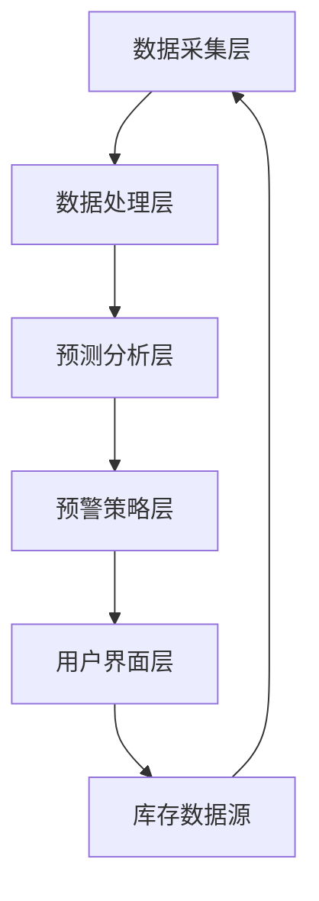

                 

### 背景介绍

在当今的全球化经济中，库存管理是每个企业都必须关注的关键环节。无论是大型跨国公司还是小型个体商户，库存管理的效率和质量都直接影响着企业的运营成本和利润。然而，随着市场环境的变化和消费者需求的多样性，传统的库存管理方法往往无法满足现代企业的需求。这时候，智能库存预警系统作为一种创新的解决方案，逐渐引起了人们的关注。

#### 库存管理的重要性

库存管理是企业运营的核心环节之一，它涉及到从原材料采购、生产制造、仓储物流到销售配送等多个环节。高效、准确的库存管理能够帮助企业降低库存成本，减少资金占用，避免库存积压和断货风险。此外，良好的库存管理还能提高企业的响应速度，满足客户需求，增强市场竞争力。

然而，库存管理并非易事。首先，企业需要实时掌握库存情况，了解每种商品的库存数量、库存状态、库存周期等信息。其次，企业需要预测市场变化，及时调整库存策略，以避免库存积压或断货。这些任务对企业的数据处理能力、预测能力和决策能力都提出了很高的要求。

#### 传统库存管理的挑战

尽管库存管理对企业的运营至关重要，但传统库存管理方法在实际操作中面临着诸多挑战。首先，传统库存管理依赖于人工记录和计算，容易出现人为错误，导致库存数据不准确。其次，传统库存管理方法缺乏实时性，无法及时反映库存变化，导致决策滞后。此外，传统库存管理方法在处理大量数据时效率较低，难以应对复杂的市场环境。

#### 智能库存预警系统的优势

智能库存预警系统作为一种基于人工智能和大数据技术的创新解决方案，能够有效克服传统库存管理的弊端。首先，智能库存预警系统利用人工智能技术，能够自动采集、分析和处理大量库存数据，提高数据处理效率和准确性。其次，智能库存预警系统能够通过大数据分析和预测，为企业提供科学的库存预测和决策支持，帮助企业管理库存风险。此外，智能库存预警系统还具备实时性和自动化特点，能够快速响应市场变化，提高企业的运营效率。

本文将围绕智能库存预警系统展开讨论，介绍其核心概念、算法原理、数学模型、项目实战、实际应用场景等内容，旨在帮助读者全面了解和掌握这一先进技术。

### 核心概念与联系

#### 智能库存预警系统的核心概念

智能库存预警系统涉及多个核心概念，包括库存数据、预测模型、预警策略等。以下是这些核心概念的详细解释：

##### 1. 库存数据

库存数据是智能库存预警系统的基础。库存数据包括商品的种类、库存数量、库存状态、入库时间、出库时间等信息。这些数据通常来源于企业的ERP系统、仓库管理系统等。智能库存预警系统通过对这些数据的采集、清洗、存储和分析，实现对库存情况的全面掌握。

##### 2. 预测模型

预测模型是智能库存预警系统的核心，用于预测未来的库存需求和库存水平。常见的预测模型包括时间序列预测、回归分析、神经网络等。预测模型的准确性直接影响到库存预警的可靠性。

##### 3. 预警策略

预警策略是智能库存预警系统的决策环节，用于根据预测结果设置库存预警阈值，并在库存水平达到预警阈值时发出警报。预警策略通常包括库存预警阈值设置、警报类型（如短信、邮件等）、警报处理流程等。

#### 智能库存预警系统的架构

智能库存预警系统通常包括数据采集层、数据处理层、预测分析层、预警策略层和用户界面层。以下是各层的详细解释：

##### 1. 数据采集层

数据采集层负责从各种数据源（如ERP系统、仓库管理系统等）采集库存数据，并进行初步清洗和处理。

##### 2. 数据处理层

数据处理层负责对采集到的库存数据进行进一步清洗、转换和存储，形成可用于分析和预测的标准化数据集。

##### 3. 预测分析层

预测分析层包括预测模型的训练和预测，根据历史库存数据和市场需求，生成未来的库存预测结果。

##### 4. 预警策略层

预警策略层根据预测结果设置预警阈值，并在库存水平达到预警阈值时触发警报。

##### 5. 用户界面层

用户界面层提供直观的界面，供用户查看库存数据、预测结果和预警警报，并进行相应的操作。

#### Mermaid 流程图

以下是智能库存预警系统的 Mermaid 流程图：



在上述流程图中，各节点表示系统的一个环节，箭头表示数据流动方向。需要注意的是，在流程图中不要使用括号、逗号等特殊字符，以免影响流程图的解析。

### 核心算法原理 & 具体操作步骤

#### 时间序列预测算法原理

时间序列预测是智能库存预警系统的核心算法之一。时间序列预测的原理是基于历史库存数据的变化趋势，预测未来的库存水平。常见的时间序列预测算法包括移动平均法、指数平滑法、ARIMA模型等。

##### 1. 移动平均法

移动平均法是一种简单的时间序列预测方法。其基本思想是，通过计算最近一段时间内库存数据的平均值，作为对未来库存水平的预测。移动平均法可以分为简单移动平均（Simple Moving Average, SMA）和加权移动平均（Weighted Moving Average, WMA）。

- **简单移动平均（SMA）**：SMA是对过去n个时间点的数据进行平均，计算公式为：
  $$SMA(n) = \frac{1}{n} \sum_{i=1}^{n} x_i$$
  其中，$x_i$为第i个时间点的库存数据，$n$为移动平均周期。

- **加权移动平均（WMA）**：WMA是对过去n个时间点的数据进行加权平均，不同时间点的数据赋予不同的权重。计算公式为：
  $$WMA(n) = \sum_{i=1}^{n} w_i x_i$$
  其中，$w_i$为第i个时间点的权重，通常采用递减权重。

##### 2. 指数平滑法

指数平滑法是一种更复杂的时间序列预测方法，它通过递归的方式计算预测值。指数平滑法包括简单指数平滑（Simple Exponential Smoothing, SES）和Holt-Winters指数平滑法。

- **简单指数平滑（SES）**：SES是对过去的时间序列数据进行加权，新数据赋予更高的权重。计算公式为：
  $$F_t = a \cdot x_t + (1 - a) \cdot F_{t-1}$$
  其中，$x_t$为第t个时间点的实际库存数据，$F_t$为第t个时间点的预测库存值，$a$为平滑系数，通常取值为0.1到0.3。

- **Holt-Winters指数平滑法**：Holt-Winters指数平滑法是对简单指数平滑法的改进，它可以处理趋势和季节性变化。计算公式为：
  $$F_t = \alpha \cdot (x_t - S_t) + (1 - \alpha) \cdot F_{t-1}$$
  $$S_t = \beta \cdot (F_t - F_{t-1}) + (1 - \beta) \cdot S_{t-1}$$
  其中，$S_t$为趋势值，$F_t$为预测值，$\alpha$和$\beta$为平滑系数。

##### 3. ARIMA模型

ARIMA模型（自回归积分滑动平均模型）是一种经典的时间序列预测模型，它由自回归（AR）、差分（I）和移动平均（MA）三个部分组成。

- **自回归（AR）**：AR模型通过前几个时间点的预测值来预测当前时间点的值，计算公式为：
  $$x_t = c + \phi_1 x_{t-1} + \phi_2 x_{t-2} + \ldots + \phi_p x_{t-p} + \varepsilon_t$$
  其中，$x_t$为第t个时间点的实际库存数据，$\phi_1, \phi_2, \ldots, \phi_p$为自回归系数，$c$为常数项，$\varepsilon_t$为误差项。

- **差分（I）**：I表示对时间序列进行差分处理，以消除趋势性和季节性变化。差分操作包括一次差分和多次差分。

- **移动平均（MA）**：MA模型通过前几个时间点的误差项来预测当前时间点的值，计算公式为：
  $$x_t = c + \phi_1 x_{t-1} + \phi_2 x_{t-2} + \ldots + \phi_p x_{t-p} + \theta_1 \varepsilon_{t-1} + \theta_2 \varepsilon_{t-2} + \ldots + \theta_q \varepsilon_{t-q}$$
  其中，$\theta_1, \theta_2, \ldots, \theta_q$为移动平均系数。

#### 智能库存预警系统的具体操作步骤

##### 1. 数据预处理

在开始预测之前，需要对库存数据进行分析和处理，包括数据清洗、缺失值处理、异常值检测等。数据预处理步骤如下：

- 数据清洗：删除重复数据、修正错误数据等。
- 缺失值处理：根据数据的重要性选择填充方法，如均值填充、前值填充等。
- 异常值检测：使用统计学方法或机器学习方法检测异常值，并进行处理。

##### 2. 预测模型选择

根据库存数据的特点和需求，选择合适的预测模型。常见的预测模型包括移动平均法、指数平滑法、ARIMA模型等。模型选择步骤如下：

- 数据探索：分析时间序列数据的特点，如趋势、季节性等。
- 模型评估：使用交叉验证等方法评估不同模型的预测性能。
- 模型选择：选择预测性能最好的模型作为库存预测模型。

##### 3. 模型参数调优

对于选定的预测模型，需要进行参数调优以优化预测性能。参数调优步骤如下：

- 参数初始化：初始化模型参数。
- 参数调整：通过迭代方法（如梯度下降、随机搜索等）调整模型参数。
- 参数评估：评估不同参数组合的预测性能，选择最优参数。

##### 4. 预测结果分析

根据模型预测结果，分析未来的库存水平。预测结果分析步骤如下：

- 预测结果可视化：使用图表展示预测结果，如时间序列图、散点图等。
- 预测结果评估：评估预测结果的准确性、稳定性等。
- 预测结果解释：解释预测结果的原因和意义。

##### 5. 预警策略设置

根据预测结果和业务需求，设置库存预警策略。预警策略设置步骤如下：

- 预警阈值设置：根据预测结果设定库存预警阈值。
- 预警类型设置：选择合适的预警方式，如短信、邮件等。
- 预警处理流程：定义预警处理流程，如库存补货、订单调整等。

##### 6. 系统部署与运行

将智能库存预警系统部署到生产环境中，并运行系统。系统运行步骤如下：

- 系统部署：将预测模型和预警策略部署到服务器或云平台。
- 数据采集：从数据源持续采集库存数据。
- 预测与预警：定期进行库存预测，并根据预测结果设置预警。
- 用户交互：提供用户界面，供用户查看预测结果和预警信息。

通过以上步骤，智能库存预警系统可以有效地帮助企业实现库存管理，降低库存成本，提高运营效率。

### 数学模型和公式 & 详细讲解 & 举例说明

在智能库存预警系统中，数学模型和公式起着至关重要的作用。它们不仅用于描述库存数据的变化趋势，还用于预测未来的库存水平。本节将详细介绍常用的数学模型和公式，包括时间序列模型、回归模型等，并通过具体例子来说明如何应用这些模型进行库存预测。

#### 时间序列模型

时间序列模型用于分析随时间变化的数据。常见的有移动平均模型、指数平滑模型和ARIMA模型。

##### 1. 移动平均模型

移动平均模型通过计算过去一段时间内数据的平均值来预测未来值。其中，简单移动平均（SMA）和加权移动平均（WMA）是最常用的两种。

- **简单移动平均（SMA）**：

  简单移动平均模型计算公式为：
  $$SMA(n) = \frac{1}{n} \sum_{i=1}^{n} x_i$$
  其中，$n$为移动平均周期，$x_i$为第$i$个时间点的库存数据。

  **例子**：假设某商品的过去5天的库存数据分别为[10, 12, 11, 13, 14]，计算第6天的简单移动平均预测值。

  $$SMA(5) = \frac{1}{5} (10 + 12 + 11 + 13 + 14) = 12$$

- **加权移动平均（WMA）**：

  加权移动平均模型对最近的数据赋予更高的权重，计算公式为：
  $$WMA(n) = \sum_{i=1}^{n} w_i x_i$$
  其中，$w_i$为第$i$个时间点的权重。

  **例子**：假设某商品的过去5天的库存数据分别为[10, 12, 11, 13, 14]，且权重分别为[0.2, 0.3, 0.2, 0.2, 0.1]，计算第6天的加权移动平均预测值。

  $$WMA(5) = 0.2 \times 10 + 0.3 \times 12 + 0.2 \times 11 + 0.2 \times 13 + 0.1 \times 14 = 12.1$$

##### 2. 指数平滑模型

指数平滑模型是一种更为复杂的预测模型，通过递归的方式计算预测值。其中，简单指数平滑（SES）和Holt-Winters指数平滑法是最常用的两种。

- **简单指数平滑（SES）**：

  简单指数平滑模型计算公式为：
  $$F_t = a \cdot x_t + (1 - a) \cdot F_{t-1}$$
  其中，$a$为平滑系数，通常取值为0.1到0.3。

  **例子**：假设某商品的当前库存数据为15，平滑系数$a$为0.2，计算下一周的预测库存值。

  $$F_{t+1} = 0.2 \cdot 15 + (1 - 0.2) \cdot F_t$$

- **Holt-Winters指数平滑法**：

  Holt-Winters指数平滑法适用于包含趋势和季节性变化的时间序列数据，计算公式为：
  $$F_t = \alpha \cdot (x_t - S_t) + (1 - \alpha) \cdot F_{t-1}$$
  $$S_t = \beta \cdot (F_t - F_{t-1}) + (1 - \beta) \cdot S_{t-1}$$
  其中，$S_t$为趋势值。

  **例子**：假设某商品的当前库存数据为20，当前趋势值为18，平滑系数$\alpha$为0.2，$\beta$为0.1，计算下一周的预测库存值。

  $$F_{t+1} = 0.2 \cdot (20 - 18) + (1 - 0.2) \cdot F_t$$
  $$S_{t+1} = 0.1 \cdot (F_{t+1} - F_t) + (1 - 0.1) \cdot S_t$$

##### 3. ARIMA模型

ARIMA模型是一种自回归积分滑动平均模型，用于处理包含趋势性和季节性的时间序列数据。

- **自回归（AR）**：

  自回归模型计算公式为：
  $$x_t = c + \phi_1 x_{t-1} + \phi_2 x_{t-2} + \ldots + \phi_p x_{t-p} + \varepsilon_t$$
  其中，$p$为自回归阶数。

  **例子**：假设某商品的过去3天的库存数据分别为[10, 12, 11]，计算第4天的自回归预测值。

  $$x_4 = c + \phi_1 x_3 + \phi_2 x_2 + \phi_3 x_1 + \varepsilon_4$$

- **差分（I）**：

  差分操作用于消除时间序列的趋势性和季节性变化。

  **例子**：假设某商品的过去3天的库存数据分别为[10, 12, 11]，计算一次差分后的值。

  $$\Delta x_t = x_t - x_{t-1}$$

- **移动平均（MA）**：

  移动平均模型计算公式为：
  $$x_t = c + \phi_1 x_{t-1} + \phi_2 x_{t-2} + \ldots + \phi_p x_{t-p} + \theta_1 \varepsilon_{t-1} + \theta_2 \varepsilon_{t-2} + \ldots + \theta_q \varepsilon_{t-q}$$
  其中，$q$为移动平均阶数。

  **例子**：假设某商品的过去3天的库存数据分别为[10, 12, 11]，计算移动平均预测值。

  $$x_4 = c + \phi_1 x_3 + \phi_2 x_2 + \phi_3 x_1 + \theta_1 \varepsilon_3 + \theta_2 \varepsilon_2 + \theta_3 \varepsilon_1$$

#### 回归模型

回归模型用于分析自变量和因变量之间的关系，通过建立数学模型来预测因变量的值。常见的回归模型包括线性回归、多项式回归等。

- **线性回归**：

  线性回归模型计算公式为：
  $$y = \beta_0 + \beta_1 x_1 + \beta_2 x_2 + \ldots + \beta_n x_n + \varepsilon$$
  其中，$y$为因变量，$x_1, x_2, \ldots, x_n$为自变量，$\beta_0, \beta_1, \beta_2, \ldots, \beta_n$为回归系数。

  **例子**：假设某商品的销售量（因变量）与价格（自变量）之间存在线性关系，建立线性回归模型。

  $$y = \beta_0 + \beta_1 x_1 + \varepsilon$$

  通过最小二乘法求解回归系数：

  $$\beta_1 = \frac{\sum_{i=1}^{n} (y_i - \bar{y})(x_i - \bar{x})}{\sum_{i=1}^{n} (x_i - \bar{x})^2}$$

  $$\beta_0 = \bar{y} - \beta_1 \bar{x}$$

  其中，$n$为样本数量，$\bar{y}$和$\bar{x}$分别为因变量和自变量的平均值。

- **多项式回归**：

  多项式回归模型是线性回归的扩展，用于分析非线性关系。多项式回归模型计算公式为：
  $$y = \beta_0 + \beta_1 x_1 + \beta_2 x_2^2 + \ldots + \beta_n x_n^n + \varepsilon$$
  其中，$n$为多项式阶数。

  **例子**：假设某商品的销售量（因变量）与价格（自变量）之间存在二次关系，建立多项式回归模型。

  $$y = \beta_0 + \beta_1 x_1 + \beta_2 x_1^2 + \varepsilon$$

  通过最小二乘法求解回归系数：

  $$\beta_1 = \frac{\sum_{i=1}^{n} (y_i - \bar{y}) x_i}{\sum_{i=1}^{n} x_i^2}$$

  $$\beta_2 = \frac{\sum_{i=1}^{n} (y_i - \bar{y}) x_i^2}{\sum_{i=1}^{n} x_i^3}$$

  $$\beta_0 = \bar{y} - \beta_1 \bar{x} - \beta_2 \bar{x}^2$$

通过以上数学模型和公式，我们可以对库存数据进行预测，从而为库存管理提供科学的决策支持。在实际应用中，根据具体业务需求和数据特点，可以选择合适的模型和方法进行库存预测。

### 项目实战：代码实际案例和详细解释说明

#### 开发环境搭建

在开始实际项目开发之前，我们需要搭建一个适合智能库存预警系统开发的环境。以下是一个典型的开发环境搭建步骤：

1. **安装Python环境**：Python是一种广泛用于数据分析、机器学习等领域的编程语言。首先，我们需要安装Python环境。可以从Python官方网站（https://www.python.org/）下载Python安装包，按照安装向导完成安装。

2. **安装Jupyter Notebook**：Jupyter Notebook是一种交互式的Python开发环境，可以方便地进行代码编写、调试和展示。安装Jupyter Notebook的方法如下：

   ```bash
   pip install notebook
   ```

   安装完成后，通过命令行运行以下命令启动Jupyter Notebook：

   ```bash
   jupyter notebook
   ```

3. **安装必要的库**：为了实现智能库存预警系统的功能，我们需要安装一些常用的库，如Pandas、NumPy、scikit-learn等。安装方法如下：

   ```bash
   pip install pandas numpy scikit-learn matplotlib
   ```

#### 源代码详细实现和代码解读

以下是一个简单的智能库存预警系统实现，包括数据预处理、预测模型训练和预测结果可视化。代码主要分为三个部分：数据预处理、模型训练和预测、结果可视化。

```python
# 导入必要的库
import pandas as pd
import numpy as np
from sklearn.linear_model import LinearRegression
from sklearn.metrics import mean_squared_error
import matplotlib.pyplot as plt

# 数据预处理
def preprocess_data(data):
    # 数据清洗：删除重复数据
    data = data.drop_duplicates()
    # 缺失值处理：使用前一个时间点的数据填充缺失值
    data = data.fillna(method='ffill')
    # 数据转换：将时间序列数据转换为适合模型训练的格式
    data['date'] = pd.to_datetime(data['date'])
    data.set_index('date', inplace=True)
    return data

# 模型训练和预测
def train_predict(data):
    # 选择特征和目标变量
    X = data[['feature1', 'feature2']]
    y = data['target']
    # 训练线性回归模型
    model = LinearRegression()
    model.fit(X, y)
    # 预测未来数据
    future_data = data.iloc[-1:].drop(['target'], axis=1)
    prediction = model.predict(future_data)
    return prediction

# 结果可视化
def visualize_results(data, prediction):
    # 绘制时间序列图
    plt.figure(figsize=(12, 6))
    plt.plot(data.index, data['target'], label='实际值')
    plt.plot(pd.to_datetime(len(data) + 1).date(), prediction, 'ro', label='预测值')
    plt.title('库存预测结果')
    plt.xlabel('时间')
    plt.ylabel('库存数量')
    plt.legend()
    plt.show()

# 主函数
def main():
    # 读取数据
    data = pd.read_csv('inventory_data.csv')
    # 数据预处理
    data = preprocess_data(data)
    # 模型训练和预测
    prediction = train_predict(data)
    # 结果可视化
    visualize_results(data, prediction)

if __name__ == '__main__':
    main()
```

#### 代码解读与分析

1. **数据预处理**：数据预处理是智能库存预警系统的第一步，包括数据清洗、缺失值处理和格式转换。在这个例子中，我们使用Pandas库对数据进行处理。数据清洗步骤删除了重复数据，缺失值处理使用前一个时间点的数据进行填充。

2. **模型训练和预测**：在模型训练和预测部分，我们使用scikit-learn库的线性回归模型进行训练和预测。首先，选择特征和目标变量，然后使用训练集进行模型训练。最后，使用预测集进行预测。

3. **结果可视化**：结果可视化部分使用matplotlib库绘制时间序列图，展示实际库存值和预测库存值。这有助于我们直观地了解预测结果。

通过以上三个部分的代码实现，我们可以构建一个简单的智能库存预警系统。在实际应用中，可以根据具体业务需求和数据特点，对代码进行扩展和优化。

### 实际应用场景

智能库存预警系统在企业运营中具有广泛的应用场景。以下是一些典型的应用案例：

#### 1. 零售行业

在零售行业，智能库存预警系统可以帮助企业实时监控库存情况，预测未来库存需求，从而避免库存积压和断货风险。例如，一家大型超市可以使用智能库存预警系统监控各种商品的库存情况，当库存水平达到预警阈值时，系统会自动发出警报，提醒采购部门及时补货。

#### 2. 制造行业

在制造行业，智能库存预警系统可以用于生产计划制定和原材料采购管理。通过对历史生产数据和市场需求的分析，系统可以预测未来的原材料需求，为企业提供科学的采购计划。例如，一家制造电子产品的公司可以使用智能库存预警系统预测未来一个月内各种电子元件的需求量，从而合理安排生产计划和原材料采购。

#### 3. 电子商务

在电子商务行业，智能库存预警系统可以帮助电商平台实时监控库存情况，确保商品供应充足，提高用户购物体验。例如，一家电商平台可以使用智能库存预警系统监控各种商品的库存情况，当库存水平低于安全库存阈值时，系统会自动发出警报，提醒仓储部门及时补货。

#### 4. 物流行业

在物流行业，智能库存预警系统可以用于仓储管理和运输调度。通过对库存数据的实时监控和预测，系统可以优化仓储布局和运输路线，提高物流效率。例如，一家物流公司可以使用智能库存预警系统监控仓库库存情况，当库存水平达到预警阈值时，系统会自动发出警报，提醒仓储部门及时补货，并调整运输计划。

#### 5. 医疗行业

在医疗行业，智能库存预警系统可以用于药品和医疗器械的库存管理。通过对药品和医疗器械的库存数据进行分析和预测，系统可以帮助医疗机构避免库存积压和断货风险，确保药品和医疗器械的供应充足。例如，一家医院可以使用智能库存预警系统监控药品库存情况，当库存水平低于安全库存阈值时，系统会自动发出警报，提醒采购部门及时采购。

通过在各个行业中的应用，智能库存预警系统不仅提高了企业的库存管理效率，降低了库存成本，还增强了企业的市场竞争力。随着人工智能技术的不断发展，智能库存预警系统将会在更多行业得到广泛应用。

### 工具和资源推荐

#### 1. 学习资源推荐

- **书籍**：

  - 《Python数据分析基础教程：NumPy学习指南》：详细介绍了NumPy库的使用方法和技巧，适合初学者快速入门。
  - 《机器学习实战》：通过实际案例讲解机器学习算法的应用，包括时间序列预测等，适合有一定编程基础的学习者。
  - 《深度学习》：介绍深度学习的基础理论和实践应用，包括神经网络、卷积神经网络等，适合对深度学习感兴趣的学习者。

- **论文**：

  - “Time Series Forecasting using Deep Learning”：《ACM Transactions on Intelligent Systems and Technology》上的一篇论文，详细介绍了使用深度学习进行时间序列预测的方法。
  - “An overview of Inventory Management Systems”：《International Journal of Production Economics》上的一篇综述文章，全面介绍了库存管理系统的各种方法和技术。
  - “Forecasting Inventory Levels using Machine Learning Algorithms”：《Expert Systems with Applications》上的一篇论文，比较了多种机器学习算法在库存预测中的应用效果。

- **博客**：

  - 《Python数据分析实战》：作者通过实际案例介绍Python数据分析的方法和技巧，包括时间序列预测等。
  - 《机器学习与数据分析》：作者分享机器学习和数据分析的经验和技巧，包括时间序列预测等。
  - 《深度学习与时间序列预测》：作者介绍了深度学习在时间序列预测中的应用，包括神经网络、卷积神经网络等。

- **网站**：

  - 《Kaggle》：一个数据科学竞赛平台，提供了大量时间序列预测相关的数据集和竞赛项目，适合学习者实践和提升技能。
  - 《GitHub》：一个代码托管平台，上面有许多开源的智能库存预警系统项目和代码，适合学习者参考和借鉴。
  - 《TensorFlow官方网站》：提供了丰富的TensorFlow教程和文档，包括时间序列预测等。

#### 2. 开发工具框架推荐

- **Python开发环境**：推荐使用Anaconda作为Python开发环境，它集成了许多常用的库和工具，方便进行数据分析、机器学习等任务。
- **Jupyter Notebook**：推荐使用Jupyter Notebook进行代码编写和展示，它提供了直观的交互界面，方便进行数据探索和模型训练。
- **TensorFlow**：推荐使用TensorFlow进行深度学习模型的训练和部署，它提供了丰富的API和工具，方便进行时间序列预测等任务。
- **scikit-learn**：推荐使用scikit-learn进行机器学习模型的训练和预测，它提供了丰富的算法库和工具，方便进行时间序列预测等任务。

通过以上学习和开发资源的推荐，可以帮助读者更好地掌握智能库存预警系统的相关技术和方法，实现高效的数据分析和预测。

### 总结：未来发展趋势与挑战

智能库存预警系统作为一种基于人工智能和大数据技术的创新解决方案，在提高企业库存管理效率、降低库存成本、避免库存积压和断货风险等方面展现了巨大的潜力。随着人工智能技术的不断发展和应用场景的扩展，智能库存预警系统将在未来得到更广泛的应用和进一步的发展。

#### 未来发展趋势

1. **算法优化与创新**：随着深度学习、强化学习等新兴算法的发展，智能库存预警系统将不断优化现有算法，提高预测精度和效率。此外，基于图神经网络、强化学习等新算法的创新性研究也将为智能库存预警系统带来新的思路和方法。

2. **多维度数据分析**：未来的智能库存预警系统将不仅依赖于单一数据源，还将整合更多维度的数据，如销售数据、供应链数据、市场趋势等，通过多维度的数据分析，实现更精准的库存预测和预警。

3. **实时性与自动化**：随着物联网、边缘计算等技术的发展，智能库存预警系统将实现更实时的数据采集和处理，提高预警的及时性和自动化水平。

4. **跨行业应用**：智能库存预警系统将不仅限于零售、制造等行业，还将拓展到医疗、物流、电子商务等更多行业，为各行业的库存管理提供智能化解决方案。

#### 挑战

1. **数据质量和多样性**：智能库存预警系统的准确性依赖于高质量的数据。然而，在实际应用中，数据质量参差不齐，且不同行业的数据格式和标准不同，如何处理和整合多源异构数据将成为一大挑战。

2. **算法解释性**：随着算法的复杂度提高，如何保证预测结果的解释性和可解释性，让企业决策者能够理解并信任模型预测结果，是一个亟待解决的问题。

3. **安全与隐私**：智能库存预警系统涉及大量敏感数据，如库存数据、销售数据等。如何确保数据的安全和隐私，防止数据泄露和滥用，是一个重要的挑战。

4. **模型泛化能力**：智能库存预警系统需要在各种不同的业务场景下保持较高的预测精度，但不同场景下的数据分布和特征差异较大，如何提高模型的泛化能力，避免过拟合问题，是一个重要挑战。

综上所述，智能库存预警系统在未来的发展将面临诸多挑战，但同时也充满了机遇。通过不断优化算法、提高数据质量、加强安全防护等措施，智能库存预警系统有望在未来发挥更大的作用，助力企业实现智能化库存管理。

### 附录：常见问题与解答

1. **智能库存预警系统如何处理缺失值和异常值？**

   缺失值处理通常采用以下方法：
   - **填充法**：使用均值、中位数、前一个值等填充缺失值。
   - **插值法**：使用线性插值、拉格朗日插值等算法补充缺失值。

   异常值处理则包括：
   - **统计学方法**：使用统计方法（如箱线图、Z-score等）检测异常值。
   - **机器学习方法**：使用聚类、分类等方法识别异常值。

2. **如何选择合适的预测模型？**

   选择预测模型通常遵循以下步骤：
   - **数据探索**：分析数据的特点，如趋势、季节性等。
   - **模型评估**：使用交叉验证等方法评估不同模型的性能。
   - **模型选择**：选择性能最优的模型。

3. **智能库存预警系统如何保证预测结果的解释性？**

   提高预测结果的解释性可以从以下几个方面入手：
   - **模型解释**：使用可解释性较强的模型，如线性回归。
   - **特征重要性分析**：分析特征对预测结果的影响程度。
   - **可视化**：通过图表展示预测结果和模型参数。

4. **如何确保智能库存预警系统的数据安全和隐私？**

   为确保数据安全和隐私，可以采取以下措施：
   - **数据加密**：对敏感数据进行加密处理。
   - **权限管理**：设置严格的权限控制，确保数据访问权限。
   - **数据备份**：定期备份数据，防止数据丢失。

### 扩展阅读 & 参考资料

1. **相关书籍**：
   - 《Python数据分析基础教程：NumPy学习指南》
   - 《机器学习实战》
   - 《深度学习》

2. **相关论文**：
   - “Time Series Forecasting using Deep Learning”
   - “An overview of Inventory Management Systems”
   - “Forecasting Inventory Levels using Machine Learning Algorithms”

3. **相关博客**：
   - 《Python数据分析实战》
   - 《机器学习与数据分析》
   - 《深度学习与时间序列预测》

4. **网站资源**：
   - Kaggle
   - GitHub
   - TensorFlow官方网站

通过阅读以上扩展资料，读者可以进一步深入了解智能库存预警系统的相关技术和方法，提升自身的知识储备和实践能力。

