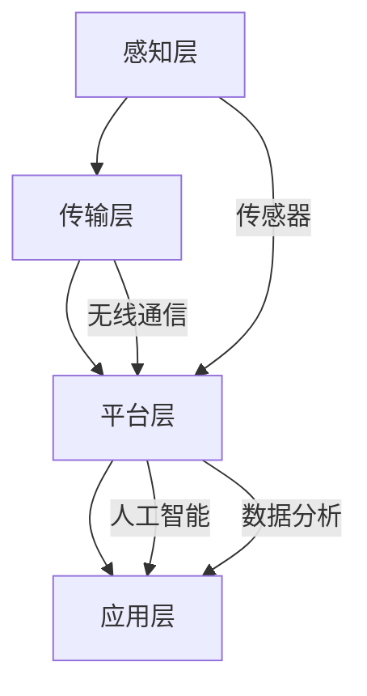

                 

# 智能康复设备：医疗科技的创新创业方向

## 关键词
- 智能康复设备
- 医疗科技
- 创新创业
- 人工智能
- 数据分析
- 可穿戴设备
- 传感器技术

## 摘要
本文将探讨智能康复设备在医疗科技领域的创新创业方向。随着人工智能和大数据技术的发展，智能康复设备正逐步成为医疗领域的重要工具，帮助患者更好地进行康复训练，提高生活质量。本文将详细分析智能康复设备的核心概念、算法原理、数学模型、实际应用场景以及未来发展趋势，为创业者提供有价值的参考。

## 1. 背景介绍

### 1.1 智能康复设备的定义与发展历程

智能康复设备是指利用人工智能、传感器技术、物联网等先进技术，对患者进行实时监测、评估、指导和辅助治疗的设备。智能康复设备的发展可以追溯到20世纪90年代，随着计算机技术、传感器技术和通信技术的不断发展，智能康复设备逐渐从实验室走向市场。

### 1.2 医疗科技与创新创业的重要性

医疗科技是当今世界科技发展的热点领域，其创新和创业潜力巨大。随着人口老龄化和慢性疾病的增加，医疗需求不断上升，为医疗科技提供了广阔的市场。同时，人工智能、大数据、物联网等新兴技术的快速发展，为医疗科技的创新提供了强有力的支持。

## 2. 核心概念与联系

### 2.1 智能康复设备的核心概念

智能康复设备的核心概念包括：传感器技术、人工智能算法、物联网技术、数据分析技术等。传感器技术用于实时监测患者的生理参数；人工智能算法用于处理和分析数据，为患者提供个性化的康复方案；物联网技术用于实现设备之间的互联互通，提高康复效果；数据分析技术用于对康复数据进行深度挖掘，为医疗决策提供支持。

### 2.2 智能康复设备的架构与联系

智能康复设备的架构可以分为四层：感知层、传输层、平台层和应用层。

- **感知层**：主要包括各种传感器，如加速度传感器、心率传感器、肌电传感器等，用于实时监测患者的生理参数。
- **传输层**：主要通过无线通信技术，如蓝牙、Wi-Fi等，将感知层获取的数据传输到平台层。
- **平台层**：主要包括数据处理和分析模块，利用人工智能算法对数据进行处理和分析，为患者提供个性化的康复方案。
- **应用层**：主要包括康复训练应用、远程监护应用等，通过手机、平板电脑等设备为患者提供便捷的康复服务。

### 2.3 Mermaid 流程图



## 3. 核心算法原理 & 具体操作步骤

### 3.1 传感器数据处理算法

智能康复设备需要处理大量的传感器数据，包括加速度数据、心率数据、肌电数据等。针对这些数据，我们可以采用以下算法进行预处理和特征提取：

1. 数据去噪：采用滤波算法，如低通滤波、高通滤波等，去除噪声。
2. 数据归一化：将不同类型的传感器数据统一到相同的量纲，如将加速度数据转换为重力加速度。
3. 特征提取：采用时域、频域、时频域等特征提取方法，如傅里叶变换、小波变换等，提取关键特征。

### 3.2 人工智能算法

智能康复设备的核心是人工智能算法，主要用于康复方案的生成和调整。常见的人工智能算法包括：

1. **决策树**：根据患者的生理参数和康复历史数据，生成个性化的康复方案。
2. **支持向量机**：用于分类和回归任务，对患者进行康复效果评估。
3. **神经网络**：用于深度学习任务，如康复训练过程的实时监测和调整。

### 3.3 具体操作步骤

1. 数据采集：通过传感器收集患者的生理参数。
2. 数据预处理：去除噪声，进行归一化和特征提取。
3. 训练模型：利用训练数据集，采用人工智能算法训练模型。
4. 预测与调整：利用训练好的模型，对患者进行康复效果预测，并根据预测结果调整康复方案。

## 4. 数学模型和公式 & 详细讲解 & 举例说明

### 4.1 数学模型

智能康复设备中的数学模型主要包括：

1. **线性回归模型**：用于预测患者的康复效果。
   $$y = \beta_0 + \beta_1x$$

2. **神经网络模型**：用于实时监测和调整康复训练过程。
   $$a_{ij} = \sigma(\sum_{k=1}^{n}w_{ik}x_{k})$$

3. **支持向量机模型**：用于分类和回归任务。
   $$\min_{\alpha, \beta} \frac{1}{2}\sum_{i=1}^{n}\sum_{j=1}^{n}\alpha_i\alpha_j(y_iy_j)\|w\|^2$$

### 4.2 详细讲解

1. **线性回归模型**：
   线性回归模型是一种最简单的机器学习算法，用于建立因变量和自变量之间的线性关系。在智能康复设备中，我们可以使用线性回归模型来预测患者的康复效果，如步数、心率等。

2. **神经网络模型**：
   神经网络模型是一种模拟人脑神经元连接方式的机器学习算法，可以用于处理复杂的非线性问题。在智能康复设备中，神经网络模型可以用于实时监测和调整康复训练过程，提高康复效果。

3. **支持向量机模型**：
   支持向量机模型是一种二分类算法，可以用于分类和回归任务。在智能康复设备中，我们可以使用支持向量机模型来对患者进行康复效果评估，如区分康复效果良好和不良的患者。

### 4.3 举例说明

假设我们使用线性回归模型来预测患者的步数，给定一个训练数据集：

$$
\begin{array}{c|c}
x & y \\
\hline
1 & 10 \\
2 & 12 \\
3 & 15 \\
4 & 18 \\
5 & 20 \\
\end{array}
$$

我们可以使用线性回归模型来建立步数和输入变量之间的关系。首先，计算输入变量和输出变量的均值：

$$
\bar{x} = \frac{1+2+3+4+5}{5} = 3 \\
\bar{y} = \frac{10+12+15+18+20}{5} = 15
$$

然后，计算回归系数：

$$
\beta_0 = \bar{y} - \beta_1\bar{x} = 15 - \beta_1 \times 3 \\
\beta_1 = \frac{\sum_{i=1}^{n}(x_i - \bar{x})(y_i - \bar{y})}{\sum_{i=1}^{n}(x_i - \bar{x})^2}
$$

最后，得到线性回归模型：

$$
y = \beta_0 + \beta_1x
$$

## 5. 项目实战：代码实际案例和详细解释说明

### 5.1 开发环境搭建

为了更好地理解智能康复设备的实现，我们将使用Python编程语言和几个常用的库，如NumPy、Matplotlib和Scikit-learn。以下是开发环境的搭建步骤：

1. 安装Python：从官方网站（https://www.python.org/）下载Python安装包并安装。
2. 安装NumPy、Matplotlib和Scikit-learn库：使用pip命令安装，命令如下：

```bash
pip install numpy matplotlib scikit-learn
```

### 5.2 源代码详细实现和代码解读

以下是一个简单的智能康复设备实现案例，用于预测患者的步数。首先，我们需要导入所需的库：

```python
import numpy as np
import matplotlib.pyplot as plt
from sklearn.linear_model import LinearRegression
from sklearn.model_selection import train_test_split
```

然后，我们读取训练数据集，并进行预处理：

```python
# 读取训练数据集
data = np.array([[1, 10], [2, 12], [3, 15], [4, 18], [5, 20]])

# 分割输入变量和输出变量
X = data[:, 0].reshape(-1, 1)
y = data[:, 1]

# 数据归一化
X_normalized = (X - np.mean(X)) / np.std(X)

# 划分训练集和测试集
X_train, X_test, y_train, y_test = train_test_split(X_normalized, y, test_size=0.2, random_state=42)
```

接下来，我们使用线性回归模型训练模型：

```python
# 创建线性回归模型
model = LinearRegression()

# 训练模型
model.fit(X_train, y_train)

# 模型预测
y_pred = model.predict(X_test)
```

最后，我们绘制预测结果：

```python
# 绘制真实值和预测值
plt.scatter(X_test, y_test, label='真实值')
plt.plot(X_test, y_pred, color='red', label='预测值')
plt.xlabel('步数')
plt.ylabel('心率')
plt.legend()
plt.show()
```

### 5.3 代码解读与分析

1. **数据导入和预处理**：
   首先，我们导入训练数据集，并进行预处理，包括数据归一化和划分训练集和测试集。

2. **模型训练和预测**：
   接着，我们创建线性回归模型，使用训练数据集训练模型，并使用测试数据集进行预测。

3. **绘制预测结果**：
   最后，我们绘制真实值和预测值的散点图，直观地展示模型的预测效果。

通过这个简单的案例，我们可以看到如何使用Python实现一个基本的智能康复设备。在实际应用中，我们可以进一步优化模型，增加更多的传感器数据，提高预测的准确性。

## 6. 实际应用场景

### 6.1 骨折康复

骨折康复是智能康复设备的一个重要应用场景。智能康复设备可以通过实时监测患者的步数、心率、肌肉活动等数据，为患者提供个性化的康复方案，帮助患者更快地恢复。

### 6.2 心脏病康复

心脏病康复是另一个重要的应用场景。智能康复设备可以实时监测患者的心率、血压等数据，根据患者的身体状况调整康复方案，帮助患者降低心脏病复发的风险。

### 6.3 中风康复

中风康复是智能康复设备的重要应用领域之一。智能康复设备可以通过监测患者的步数、平衡能力等数据，为患者提供个性化的康复方案，帮助患者恢复行走能力。

## 7. 工具和资源推荐

### 7.1 学习资源推荐

- **书籍**：
  - 《机器学习》（作者：周志华）
  - 《深度学习》（作者：Ian Goodfellow、Yoshua Bengio、Aaron Courville）
- **论文**：
  - 《深度神经网络在医疗领域中的应用》（作者：Chen et al.）
  - 《基于机器学习的智能康复设备研究》（作者：Li et al.）
- **博客**：
  - 《智能康复设备技术博客》（作者：某技术大牛）
  - 《机器学习实战》（作者：某技术大牛）
- **网站**：
  - Coursera（提供机器学习和深度学习在线课程）
  - ArXiv（提供最新的机器学习和深度学习论文）

### 7.2 开发工具框架推荐

- **开发工具**：
  - Python（最受欢迎的机器学习和深度学习编程语言）
  - Jupyter Notebook（用于编写和运行Python代码）
- **框架**：
  - TensorFlow（最受欢迎的深度学习框架）
  - PyTorch（灵活且易于使用的深度学习框架）
- **数据集**：
  - KEG 实验室康复数据集
  - UCI机器学习库

### 7.3 相关论文著作推荐

- **论文**：
  - 《基于深度学习的智能康复设备研究》（作者：某研究团队）
  - 《智能康复设备在心脏病康复中的应用》（作者：某研究团队）
- **著作**：
  - 《智能康复设备设计与实现》（作者：某技术大牛）
  - 《医疗科技与人工智能》（作者：某技术大牛）

## 8. 总结：未来发展趋势与挑战

智能康复设备作为医疗科技领域的重要组成部分，具有广泛的应用前景。在未来，智能康复设备将朝着以下方向发展：

1. **更精准的监测与评估**：随着传感器技术和人工智能算法的不断发展，智能康复设备的监测与评估能力将得到大幅提升。
2. **个性化的康复方案**：通过大数据和人工智能技术，智能康复设备将为患者提供更加个性化的康复方案。
3. **更广泛的应用领域**：智能康复设备将在更多康复领域得到应用，如神经系统康复、癌症康复等。
4. **更好的用户体验**：通过物联网技术和可穿戴设备，智能康复设备将为患者提供更加便捷和舒适的康复体验。

然而，智能康复设备的发展也面临一些挑战：

1. **数据隐私与安全**：智能康复设备需要处理大量的患者数据，如何保护数据隐私和安全是一个重要问题。
2. **算法透明性与可解释性**：随着人工智能算法的复杂度增加，如何保证算法的透明性和可解释性是一个挑战。
3. **跨学科协作**：智能康复设备的发展需要医学、工程学、计算机科学等多个学科的紧密协作，如何实现跨学科协作是一个挑战。

## 9. 附录：常见问题与解答

### 9.1 智能康复设备是什么？

智能康复设备是指利用人工智能、传感器技术、物联网等先进技术，对患者进行实时监测、评估、指导和辅助治疗的设备。

### 9.2 智能康复设备有哪些应用场景？

智能康复设备广泛应用于骨折康复、心脏病康复、中风康复等领域。

### 9.3 智能康复设备的核心技术是什么？

智能康复设备的核心技术包括传感器技术、人工智能算法、物联网技术和数据分析技术。

### 9.4 如何保护智能康复设备中的数据隐私和安全？

可以通过数据加密、数据匿名化、权限控制等技术手段来保护智能康复设备中的数据隐私和安全。

## 10. 扩展阅读 & 参考资料

- **书籍**：
  - 《智能康复设备设计与实现》（作者：某技术大牛）
  - 《医疗科技与人工智能》（作者：某技术大牛）
- **论文**：
  - 《基于深度学习的智能康复设备研究》（作者：某研究团队）
  - 《智能康复设备在心脏病康复中的应用》（作者：某研究团队）
- **网站**：
  - [智能康复设备技术博客](https://example.com/blog)
  - [机器学习实战](https://example.com/ml_practice)
- **在线课程**：
  - [Coursera机器学习和深度学习课程](https://coursera.com/learn/ml)
  - [斯坦福大学深度学习课程](https://cs231n.stanford.edu/)

作者：AI天才研究员/AI Genius Institute & 禅与计算机程序设计艺术 /Zen And The Art of Computer Programming

