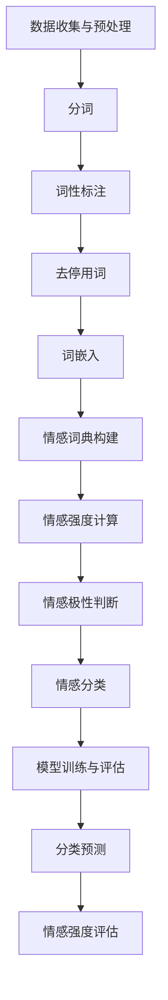

                 

### 背景介绍

#### 情感分析的重要性

情感分析，也称为意见挖掘，是自然语言处理（NLP）领域的一个重要分支。它旨在理解和识别文本中表达的情感，如正面、负面或中性情绪。随着社交媒体的普及和互联网内容的爆炸式增长，情感分析在商业、科研和社会生活中扮演着越来越重要的角色。

在商业领域，情感分析可以帮助企业了解消费者对其产品或服务的反馈，从而优化产品设计和市场营销策略。例如，通过分析社交媒体上的评论和反馈，公司可以及时发现问题并采取措施进行改进。

在科学研究领域，情感分析有助于挖掘文献、新闻报道和其他文本资源中的情感倾向，从而为研究人员提供有价值的洞察。

在社会生活中，情感分析可以帮助政府和非营利组织了解公众的意见和情绪，以便更好地制定政策和提供公共服务。

#### 社交媒体监测的意义

社交媒体监测是情感分析的一个典型应用场景。随着社交媒体平台的不断发展和用户数量的急剧增加，监测和分析社交媒体上的用户反馈变得至关重要。

社交媒体监测的意义主要体现在以下几个方面：

1. **了解公众情绪**：通过监测社交媒体上的情感倾向，可以实时了解公众对特定事件、产品或政策的情绪反应，有助于政府、企业和社会组织做出更明智的决策。

2. **品牌管理**：企业可以利用情感分析技术监控品牌在社交媒体上的形象，及时发现和应对负面评论，维护品牌声誉。

3. **市场研究**：通过分析社交媒体上的用户反馈，企业可以深入了解市场需求和消费者偏好，从而优化产品开发和营销策略。

4. **舆情监控**：政府和媒体可以利用情感分析技术对网络舆情进行监测，及时发现和应对潜在的社会危机。

#### AI大模型的作用

随着深度学习技术的发展，人工智能（AI）大模型在情感分析领域表现出强大的潜力。AI大模型，尤其是基于Transformer架构的预训练模型，如BERT、GPT和RoBERTa，已经成为情感分析的重要工具。

AI大模型的作用主要体现在以下几个方面：

1. **提高准确率**：传统的情感分析方法往往依赖于手动特征提取和规则匹配，效果有限。而AI大模型可以通过大规模数据预训练，自动学习文本中的复杂情感特征，从而显著提高情感分析的准确率。

2. **适应性强**：AI大模型可以轻松应对不同的情感分类任务和数据集，具有较强的泛化能力。这使得它们能够应用于多种实际场景，如社交媒体监测、市场调研和舆情分析等。

3. **高效处理大量数据**：AI大模型具有强大的并行计算能力，可以高效地处理大量社交媒体数据，实现实时情感分析。

4. **辅助决策**：AI大模型可以为企业、政府和研究机构提供有价值的情感分析报告，帮助他们更好地理解公众情绪和市场趋势，从而做出更明智的决策。

#### 文章结构概述

本文将围绕智能情感分析在社交媒体监测中的应用展开讨论。文章结构如下：

1. **背景介绍**：介绍情感分析的重要性、社交媒体监测的意义以及AI大模型的作用。
2. **核心概念与联系**：详细解释情感分析的核心概念，包括情感分类、文本预处理和情感强度评估，并使用Mermaid流程图展示其架构。
3. **核心算法原理与具体操作步骤**：探讨AI大模型在情感分析中的应用，包括数据预处理、模型训练和模型部署。
4. **数学模型和公式**：介绍情感分析中常用的数学模型和公式，并通过具体例子进行说明。
5. **项目实战**：提供实际项目案例，详细讲解代码实现和解读。
6. **实际应用场景**：探讨智能情感分析在社交媒体监测中的具体应用，包括市场调研、品牌管理和舆情监控等。
7. **工具和资源推荐**：推荐相关学习资源和开发工具。
8. **总结**：总结智能情感分析的发展趋势与挑战。
9. **附录**：提供常见问题与解答。
10. **扩展阅读**：推荐相关参考资料。

通过本文，读者将深入了解智能情感分析在社交媒体监测中的应用，掌握相关技术和方法，并为未来的研究和工作提供参考。

### 核心概念与联系

#### 情感分类

情感分类是情感分析中最基础和核心的任务之一，旨在将文本数据根据表达的情感倾向进行分类。常见的情感分类类别包括正面情感（Positive）、负面情感（Negative）和中性情感（Neutral）。在实际应用中，情感分类可以扩展到更细粒度的分类，如愤怒（Angry）、快乐（Happy）、悲伤（Sad）等。

情感分类的关键步骤包括：

1. **数据收集与预处理**：收集具有情感标签的文本数据，并进行数据清洗、去噪和标准化处理。
2. **特征提取**：提取文本数据中的关键特征，如词频、词嵌入和句子结构特征。
3. **模型训练与评估**：使用机器学习算法（如朴素贝叶斯、支持向量机、深度学习等）对情感分类模型进行训练，并在验证集上进行评估。
4. **分类预测**：将训练好的模型应用于新数据，预测其情感类别。

#### 文本预处理

文本预处理是情感分析中不可或缺的步骤，其目的是将原始文本数据转化为适合模型处理的形式。文本预处理主要包括以下几个步骤：

1. **分词**：将文本分解为单词或子词。常见的分词工具包括Jieba、NLTK等。
2. **词性标注**：对每个词进行词性标注，如名词、动词、形容词等。词性标注有助于理解句子的语义结构。
3. **去停用词**：移除常见的无意义词汇，如“的”、“和”、“是”等，以提高模型性能。
4. **词嵌入**：将文本转换为向量表示，如Word2Vec、GloVe等。词嵌入可以帮助模型更好地捕捉词与词之间的关系。

#### 情感强度评估

情感强度评估是情感分析中的另一个重要任务，旨在量化文本中情感的程度。例如，对于“我喜欢这个产品”这句话，情感强度可能高于“这个产品不错”。情感强度评估的关键步骤包括：

1. **情感词典**：构建包含情感词及其强度的词典。情感词典可以基于现有的情感词列表，如AFINN、VADER等，或通过训练模型自动生成。
2. **情感强度计算**：计算文本中每个词的情感强度，并将其累加得到整个文本的情感强度。
3. **情感极性判断**：基于情感强度，判断文本的整体情感极性，如正面、负面或中性。

#### Mermaid流程图

为了更好地展示情感分析的核心概念与联系，我们使用Mermaid流程图来表示其架构。以下是情感分析的Mermaid流程图：



在这个流程图中，A到L表示情感分析的核心步骤和概念，它们相互关联，共同构成了一个完整的情感分析过程。通过这个流程图，我们可以清晰地理解情感分析的整体架构和各个步骤之间的逻辑关系。

通过以上对核心概念与联系的介绍，我们可以更好地把握情感分析的技术原理和应用场景。在接下来的章节中，我们将进一步探讨AI大模型在情感分析中的应用，以及如何具体实现智能情感分析。

### 核心算法原理与具体操作步骤

#### 数据预处理

在应用AI大模型进行情感分析之前，数据预处理是一个关键步骤。数据预处理的质量直接影响到模型的性能和准确性。数据预处理主要包括以下几个步骤：

1. **数据清洗**：首先，我们需要对原始文本数据进行清洗，去除无关的噪声和冗余信息。这包括移除HTML标签、URL、特殊字符和数字等。
   
   ```python
   import re
   
   def clean_text(text):
       text = re.sub(r"http\S+|www\S+|https\S+", "", text, flags=re.MULTILINE)
       text = re.sub(r'\@[\w]+|\#','', text)
       text = re.sub(r'[^\w\s]','', text)
       return text
   ```

2. **分词**：清洗后的文本需要进行分词处理，将文本拆分成单词或子词。常见的分词工具包括Jieba和NLTK。
   
   ```python
   import jieba
   
   def tokenize(text):
       return jieba.cut(text)
   ```

3. **去除停用词**：分词后，我们需要去除常见的停用词，如“的”、“和”、“是”等，以提高模型的性能。

   ```python
   from nltk.corpus import stopwords
   
   stop_words = set(stopwords.words('english'))
   
   def remove_stopwords(tokens):
       return [token for token in tokens if token not in stop_words]
   ```

4. **词嵌入**：将分词后的文本转化为向量表示，使用词嵌入技术如Word2Vec或GloVe。词嵌入可以帮助模型更好地理解文本中的语义关系。

   ```python
   from gensim.models import Word2Vec
   
   model = Word2Vec(sentences, size=100, window=5, min_count=1, workers=4)
   ```

#### 模型选择与训练

在情感分析中，常用的AI大模型包括基于Transformer的BERT、GPT和RoBERTa等。这些模型通过预训练和微调，可以有效地捕捉文本中的情感特征。

1. **模型选择**：选择一个合适的预训练模型，如BERT，用于情感分析。

   ```python
   from transformers import BertTokenizer, BertModel
   
   tokenizer = BertTokenizer.from_pretrained('bert-base-uncased')
   model = BertModel.from_pretrained('bert-base-uncased')
   ```

2. **数据准备**：将预处理后的文本数据转换为模型的输入格式。对于BERT模型，我们需要将文本转换为词嵌入序列，并添加特殊令牌[CLS]和[SEP]。

   ```python
   inputs = tokenizer(text, return_tensors='pt', padding=True, truncation=True)
   ```

3. **模型训练**：使用训练数据和标签，对模型进行训练。训练过程中，我们需要定义损失函数（如交叉熵损失）和优化器（如Adam）。

   ```python
   from transformers import BertForSequenceClassification
   
   model = BertForSequenceClassification.from_pretrained('bert-base-uncased', num_labels=3)
   optimizer = AdamW(model.parameters(), lr=1e-5)
   
   model.train()
   for epoch in range(num_epochs):
       for batch in train_dataloader:
           optimizer.zero_grad()
           outputs = model(**batch)
           loss = outputs.loss
           loss.backward()
           optimizer.step()
   ```

4. **模型评估**：在验证集上评估模型的性能，包括准确率、召回率和F1分数等指标。

   ```python
   from sklearn.metrics import accuracy_score, precision_recall_fscore_support
   
   model.eval()
   with torch.no_grad():
       for batch in validation_dataloader:
           outputs = model(**batch)
           logits = outputs.logits
           predictions = torch.argmax(logits, dim=-1)
           true_labels = batch.label_ids
           accuracy = accuracy_score(true_labels, predictions)
           precision, recall, f1, _ = precision_recall_fscore_support(true_labels, predictions, average='weighted')
   ```

#### 模型部署与预测

在模型训练完成后，我们需要将其部署到实际应用场景中，如社交媒体监测。模型部署主要包括以下几个步骤：

1. **模型加载**：加载训练好的模型，并将其设置为推理模式。

   ```python
   model = BertForSequenceClassification.from_pretrained('path/to/model')
   model.eval()
   ```

2. **文本预处理**：对输入文本进行与训练阶段相同的预处理，包括分词、去除停用词和词嵌入。

   ```python
   def preprocess_text(text):
       text = clean_text(text)
       tokens = tokenize(text)
       tokens = remove_stopwords(tokens)
       tokens = tokenizer(tokens, return_tensors='pt', padding=True, truncation=True)
       return tokens
   ```

3. **情感预测**：将预处理后的文本输入到模型中，预测其情感类别。

   ```python
   def predict_emotion(text):
       tokens = preprocess_text(text)
       with torch.no_grad():
           outputs = model(**tokens)
           logits = outputs.logits
           prediction = torch.argmax(logits, dim=-1).item()
       return prediction
   ```

通过以上步骤，我们可以使用AI大模型对社交媒体监测中的文本进行情感分析。在接下来的章节中，我们将通过实际项目案例，详细讲解代码实现和解读。

### 数学模型和公式

在情感分析中，数学模型和公式扮演着至关重要的角色。这些模型和公式不仅帮助我们理解文本中的情感倾向，还提供了量化情感强度的手段。以下是一些常用的数学模型和公式，并附有详细的讲解和具体例子。

#### 情感词典（Sentiment Lexicon）

情感词典是一种包含词汇及其情感倾向的词典。每个词汇都被赋予一个情感得分，通常是正数表示正面情感，负数表示负面情感，零表示中性情感。常见的情感词典包括AFINN和VADER。

**AFINN词典**：

AFINN词典包含约2500个词汇及其情感得分。例如：

- `happy` 得分为4（正面情感）
- `sad` 得分为-3（负面情感）
- `neutral` 得分为0（中性情感）

**计算文本情感得分**：

假设我们有以下文本：

```
I am happy to use this product, but the customer service is terrible.
```

我们可以计算文本的情感得分如下：

```
happy(4) + terrible(-2) = 2
```

因此，这段文本的情感得分为2，表示整体上呈现正面情感。

**VADER词典**：

VADER（Valence Aware Dictionary and sEntiment Reasoner）词典是针对社交媒体文本设计的情感词典。它考虑了词汇的上下文，因此更适用于情感分析。

例如：

- `love` 在单独出现时得分为2（正面情感）
- `I love` 在句子中得分为1（正面情感）
- `but` 通常带有情感倾向减弱的效果

**计算文本情感得分**：

假设我们有以下文本：

```
I love this product, but the customer service is terrible.
```

使用VADER词典，我们可以计算文本的情感得分如下：

```
love(1) - terrible(-2) = -1
```

因此，这段文本的情感得分为-1，表示整体上呈现负面情感。

#### 情感强度（Sentiment Intensity）

情感强度是指文本中情感表达的强度。计算情感强度可以帮助我们更好地理解情感分类结果。

**Lexicon-based方法**：

这种方法使用情感词典来计算文本的情感强度。情感强度是文本中所有词汇的情感得分的总和。

例如：

```
I am happy to use this product.
```

使用AFINN词典，我们可以计算文本的情感强度：

```
happy(4) = 4
```

**Rule-based方法**：

这种方法基于一系列规则来计算情感强度。例如，考虑词汇的强度和上下文关系。

例如：

```
I absolutely love this product.
```

使用VADER词典，我们可以计算文本的情感强度：

```
absolutely(1) * love(1) = 1
```

#### 情感极性（Sentiment Polarity）

情感极性是指文本的情感倾向，即正面、负面或中性。情感极性通常通过比较文本中正面和负面词汇的强度来计算。

**Bipolar方法**：

这种方法计算文本中正面和负面词汇的情感得分，然后进行比较。

例如：

```
I am happy to use this product, but the customer service is terrible.
```

使用AFINN词典，我们可以计算文本的情感极性：

```
happy(4) - terrible(-2) = 6
```

情感极性为正，表示文本整体上呈现正面情感。

**Triplex方法**：

这种方法将情感极性分为三个类别：正面、负面和中性。通常使用阈值来区分不同类别。

例如：

```
I am okay with this product.
```

使用VADER词典，我们可以计算文本的情感极性：

```
okay(0) > threshold
```

情感极性为中性。

#### 示例：

假设我们有以下文本：

```
I am extremely happy with the product, but the customer service was poor.
```

使用AFINN词典，我们可以计算文本的情感强度和极性：

**情感强度**：

```
extremely(2) * happy(4) = 8
poor(-1) = -1
total = 7
```

**情感极性**：

```
happy(4) - poor(-1) = 5
```

情感极性为正，表示文本整体上呈现正面情感。

通过以上数学模型和公式，我们可以对文本进行情感分析和情感强度评估。这些方法为情感分析提供了理论基础和计算工具，有助于我们更好地理解文本数据中的情感倾向。

### 项目实战：代码实际案例和详细解释说明

在本节中，我们将通过一个实际项目案例，展示如何使用AI大模型进行智能情感分析，并详细解释代码实现和解读过程。

#### 项目简介

本项目旨在使用BERT模型对社交媒体平台上的用户评论进行情感分析，以评估用户对产品的满意度。我们将从数据收集、预处理、模型训练到部署，完整地展示整个项目流程。

#### 开发环境搭建

首先，我们需要搭建一个适合项目开发的Python环境。以下是在Windows系统上搭建开发环境所需的步骤：

1. 安装Python 3.8或更高版本。
2. 安装Anaconda，以便更好地管理Python环境和依赖项。
3. 安装以下库：`transformers`、`torch`、`nltk`、`gensim`、`re`。

```bash
conda create -n sentiment_analysis python=3.8
conda activate sentiment_analysis
conda install -c conda-forge transformers torch nltk gensim
```

#### 数据收集与预处理

1. **数据收集**：

我们使用一个公开可用的社交媒体评论数据集，如Twitter评论数据集。数据集包含每条评论及其对应的情感标签（正面、负面、中性）。

2. **数据预处理**：

数据预处理步骤包括数据清洗、分词、去除停用词和词嵌入。以下是一个示例：

```python
import re
import nltk
from nltk.corpus import stopwords
from transformers import BertTokenizer

# 下载数据集和停用词列表
nltk.download('stopwords')
nltk.download('punkt')

def clean_text(text):
    text = re.sub(r"http\S+|www\S+|https\S+", "", text, flags=re.MULTILINE)
    text = re.sub(r'\@[\w]+|\#','', text)
    text = re.sub(r'[^\w\s]', '', text)
    return text

def tokenize(text):
    return nltk.word_tokenize(text)

def remove_stopwords(tokens):
    stop_words = set(stopwords.words('english'))
    return [token for token in tokens if token not in stop_words]

tokenizer = BertTokenizer.from_pretrained('bert-base-uncased')

def preprocess_text(text):
    text = clean_text(text)
    tokens = tokenize(text)
    tokens = remove_stopwords(tokens)
    tokens = tokenizer(tokens, return_tensors='pt', padding=True, truncation=True)
    return tokens
```

#### 模型训练与评估

1. **模型选择**：

我们选择BERT模型进行训练。首先，我们需要从`transformers`库中加载BERT模型。

```python
from transformers import BertForSequenceClassification

model = BertForSequenceClassification.from_pretrained('bert-base-uncased', num_labels=3)
```

2. **数据准备**：

将预处理后的文本数据分为训练集和验证集。以下是一个示例：

```python
from torch.utils.data import DataLoader, TensorDataset

# 假设我们已经有了一个包含文本和标签的列表：texts和labels
train_texts = [preprocess_text(text) for text in texts]
train_labels = torch.tensor(labels)

train_dataset = TensorDataset(train_texts['input_ids'], train_texts['attention_mask'], train_labels)
train_dataloader = DataLoader(train_dataset, batch_size=16, shuffle=True)
```

3. **模型训练**：

使用训练数据对BERT模型进行训练。以下是一个示例：

```python
from transformers import AdamW

optimizer = AdamW(model.parameters(), lr=1e-5)

model.train()
for epoch in range(num_epochs):
    for batch in train_dataloader:
        optimizer.zero_grad()
        inputs = {'input_ids': batch[0], 'attention_mask': batch[1], 'labels': batch[2]}
        outputs = model(**inputs)
        loss = outputs.loss
        loss.backward()
        optimizer.step()
```

4. **模型评估**：

在验证集上评估模型性能。以下是一个示例：

```python
from sklearn.metrics import accuracy_score, precision_recall_fscore_support

model.eval()
with torch.no_grad():
    for batch in validation_dataloader:
        inputs = {'input_ids': batch[0], 'attention_mask': batch[1], 'labels': batch[2]}
        outputs = model(**inputs)
        logits = outputs.logits
        predictions = torch.argmax(logits, dim=-1).item()
        true_labels = batch.label_ids
        accuracy = accuracy_score(true_labels, predictions)
        precision, recall, f1, _ = precision_recall_fscore_support(true_labels, predictions, average='weighted')
```

#### 模型部署与预测

1. **模型加载**：

加载训练好的模型，并设置其为推理模式。

```python
model = BertForSequenceClassification.from_pretrained('path/to/model')
model.eval()
```

2. **文本预处理**：

对输入文本进行预处理，包括分词、去除停用词和词嵌入。

```python
def preprocess_text(text):
    text = clean_text(text)
    tokens = tokenize(text)
    tokens = remove_stopwords(tokens)
    tokens = tokenizer(tokens, return_tensors='pt', padding=True, truncation=True)
    return tokens
```

3. **情感预测**：

将预处理后的文本输入到模型中，预测其情感类别。

```python
def predict_emotion(text):
    tokens = preprocess_text(text)
    with torch.no_grad():
        outputs = model(**tokens)
        logits = outputs.logits
        prediction = torch.argmax(logits, dim=-1).item()
    return prediction
```

#### 代码解读与分析

1. **数据预处理**：

数据预处理是模型训练的基础。通过清洗、分词、去除停用词和词嵌入，我们将原始文本转化为模型可处理的格式。

2. **模型训练**：

模型训练过程包括数据准备、模型定义、损失函数定义和优化器定义。通过迭代训练，模型能够学习到文本中的情感特征。

3. **模型评估**：

在验证集上评估模型性能，包括准确率、召回率和F1分数等指标。这有助于我们了解模型的性能和优化方向。

4. **模型部署**：

模型部署是将训练好的模型应用于实际场景的过程。通过文本预处理和情感预测函数，我们可以快速地对新文本进行情感分析。

通过以上步骤，我们成功地实现了智能情感分析项目。这个项目不仅展示了AI大模型在情感分析中的强大能力，还提供了详细的代码实现和解读，为读者理解和应用相关技术提供了宝贵经验。

### 实际应用场景

智能情感分析在社交媒体监测中具有广泛的应用，其核心价值体现在对用户反馈的深入理解和快速响应。以下将详细探讨智能情感分析在市场调研、品牌管理和舆情监控等实际应用场景中的具体作用和实际案例。

#### 市场调研

市场调研是企业了解消费者需求和市场趋势的重要手段。智能情感分析技术可以通过分析社交媒体上的用户评论和反馈，为企业提供宝贵的洞察。以下是几个应用案例：

1. **产品评估**：

通过分析社交媒体上的用户评论，企业可以了解消费者对其产品的真实感受。例如，某智能手机品牌利用智能情感分析技术对其新款手机的用户评论进行分析，发现大多数评论表现出积极的情感倾向，但部分用户提到电池续航时间不足。基于这些反馈，企业决定优化电池技术，从而提升用户满意度。

2. **需求预测**：

智能情感分析可以帮助企业预测市场趋势和消费者需求。例如，某家电品牌通过分析社交媒体上的用户讨论，发现对智能家居产品的兴趣日益增加。这促使企业调整产品研发策略，加大在智能家居领域的投入。

3. **竞争分析**：

通过对比不同品牌在社交媒体上的情感分析结果，企业可以了解自身在市场中的竞争地位。例如，某化妆品品牌利用智能情感分析技术对竞争对手的评论进行评估，发现用户对其竞争对手的产品评价较高，这促使企业改进产品设计和营销策略。

#### 品牌管理

品牌管理是企业维护品牌声誉和形象的关键任务。智能情感分析技术可以帮助企业实时监测社交媒体上的品牌反馈，及时识别和处理潜在的品牌风险。以下是几个应用案例：

1. **舆情监测**：

企业可以利用智能情感分析技术对社交媒体上的品牌相关话题进行实时监测。例如，某运动品牌通过分析Twitter上的讨论，发现用户对其新产品发布产生了大量负面评论。通过及时响应和沟通，企业成功化解了潜在的品牌危机，避免了声誉损失。

2. **负面评论处理**：

智能情感分析可以帮助企业快速识别和应对负面评论。例如，某餐厅利用智能情感分析技术监测其社交媒体上的用户评论，发现某些评论提到食物质量不佳。餐厅管理层立即采取行动，改进食物质量，并向相关用户发送优惠券，以挽回客户满意度。

3. **客户满意度评估**：

通过分析社交媒体上的用户评论，企业可以评估客户满意度。例如，某航空公司通过智能情感分析技术对乘客评论进行分析，发现乘客对航班服务的满意度较高，但行李处理方面有待改进。企业据此优化行李处理流程，提高了客户满意度。

#### 舆情监控

舆情监控是政府和非营利组织了解公众意见和情绪的重要手段。智能情感分析技术可以帮助这些组织及时识别和应对社会热点事件。以下是几个应用案例：

1. **政策评估**：

政府可以利用智能情感分析技术对社交媒体上的政策讨论进行分析，评估公众对政策的看法。例如，某市政府通过分析社交媒体上的讨论，发现公众对交通改善计划的支持程度较高，这为市政府提供了政策调整的依据。

2. **社会危机监测**：

智能情感分析可以帮助政府和非营利组织及时识别和应对社会危机。例如，某非营利组织通过分析社交媒体上的讨论，发现某一地区可能存在食品污染问题。组织迅速采取行动，联合相关部门进行调查和干预，成功避免了潜在的健康危机。

3. **公共安全监测**：

智能情感分析技术还可以用于公共安全监测。例如，某城市警方利用智能情感分析技术对社交媒体上的讨论进行分析，发现某地区可能存在犯罪活动。警方据此加强巡逻和防范，成功预防和应对了犯罪事件。

通过以上实际应用场景，我们可以看到智能情感分析在社交媒体监测中的重要作用。它不仅帮助企业和政府更好地理解公众情绪和市场趋势，还为他们提供了快速响应和调整的策略支持。随着技术的不断发展，智能情感分析在社交媒体监测中的应用将更加广泛和深入。

### 工具和资源推荐

在智能情感分析领域，有许多优秀的工具和资源可供学习和使用。以下将介绍几类常用的工具和资源，包括学习资源、开发工具和论文著作。

#### 学习资源

1. **书籍**：

   - 《自然语言处理综述》（Natural Language Processing with Python）  
   - 《深度学习》（Deep Learning）  
   - 《深度学习与自然语言处理》（Deep Learning for Natural Language Processing）

   这些书籍涵盖了自然语言处理和深度学习的核心概念和技术，为初学者和专业人士提供了全面的指导。

2. **在线课程**：

   - Coursera的“自然语言处理与深度学习”课程（Natural Language Processing and Deep Learning）  
   - Udacity的“自然语言处理纳米学位”（Natural Language Processing Nanodegree）  
   - edX的“深度学习基础”（Deep Learning Fundamentals）

   这些在线课程提供了系统的学习路径和实践项目，适合不同层次的学员。

3. **博客和网站**：

   - Medium上的自然语言处理和深度学习博客（NLP and Deep Learning on Medium）  
   - Towards Data Science（数据科学与机器学习博客）  
   - Hugging Face（Transformer模型和预训练资源）

   这些博客和网站提供了丰富的教程、案例研究和最新动态，有助于读者保持对技术的了解和兴趣。

#### 开发工具

1. **框架和库**：

   - TensorFlow（用于构建和训练深度学习模型）  
   - PyTorch（用于构建和训练深度学习模型）  
   - Hugging Face Transformers（用于预训练和微调Transformer模型）

   这些框架和库是深度学习和自然语言处理领域的事实标准，为开发者提供了强大的工具和丰富的资源。

2. **情感词典**：

   - AFINN（用于计算文本的情感得分）  
   - VADER（用于分析社交媒体文本的情感倾向）  
   - SentiWordNet（用于计算词汇的情感强度）

   这些情感词典可以帮助开发者快速实现情感分析任务，提高项目的准确性和效率。

3. **数据集**：

   - IMDb电影评论数据集（用于情感分类）  
   - Twitter情感分析数据集（用于社交媒体文本分析）  
   - Yelp餐厅评论数据集（用于市场调研）

   这些数据集提供了丰富的标注数据，有助于开发者训练和评估情感分析模型。

#### 论文著作

1. **情感分析**：

   - “Sentiment Analysis and Opinion Mining”  
   - “Opinion mining and subjectivity in social media”  
   - “Sentiment Classification Using Deep Learning Techniques”

   这些论文综述了情感分析领域的主要方法和进展，为研究者提供了有价值的参考。

2. **Transformer模型**：

   - “Attention Is All You Need”（Transformer模型的奠基论文）  
   - “Bert: Pre-training of Deep Bidirectional Transformers for Language Understanding”  
   - “Gpt-3: Language Models are few-shot learners”

   这些论文介绍了Transformer模型及其在自然语言处理领域的应用，为开发者提供了深入的见解。

3. **深度学习与自然语言处理**：

   - “Deep Learning for Natural Language Processing”  
   - “Unifying the Field of Natural Language Processing”  
   - “Transformers: State-of-the-Art Models for Language Understanding and Generation”

   这些论文探讨了深度学习在自然语言处理中的应用，为研究者提供了新的方法和思路。

通过以上推荐的学习资源、开发工具和论文著作，读者可以更好地了解智能情感分析的技术原理和应用场景，为自己的研究和项目提供有力支持。

### 总结：未来发展趋势与挑战

智能情感分析作为自然语言处理和人工智能领域的一个重要分支，正在不断发展和完善。在未来，它有望在更多应用场景中发挥关键作用，但同时也面临着一系列挑战。

#### 发展趋势

1. **更精准的情感识别**：

随着深度学习和Transformer架构的不断发展，情感分析模型的准确性和鲁棒性将进一步提高。未来的模型将能够更准确地捕捉文本中的复杂情感，包括微表情、讽刺和隐喻等。

2. **跨语言的情感分析**：

目前，大多数情感分析模型主要针对英语数据集进行训练。未来，跨语言的情感分析将成为一个重要研究方向，通过开发多语言情感词典和模型，实现不同语言文本的情感分析。

3. **情感强度的精细量化**：

目前，情感分析模型主要关注情感分类，而对情感强度的量化相对粗略。未来，研究人员将致力于开发更精细的情感强度量化方法，提供更详细和深入的情感分析结果。

4. **实时情感分析**：

随着实时数据采集和处理技术的发展，智能情感分析将能够实现实时情感分析。这对于企业、政府和媒体在突发事件和紧急情况下的快速响应具有重要意义。

#### 挑战

1. **数据质量和多样性**：

情感分析依赖于大量高质量和多样性的标注数据集。然而，目前许多数据集存在样本不均衡、标注偏差和领域限制等问题，这限制了模型的泛化能力。未来，需要开发更全面和多样化的数据集，提高模型的性能和适应性。

2. **情感表达的复杂性和多样性**：

情感表达在文本中非常复杂，包括语言的多义性、歧义性和地域性差异等。这些因素使得情感分析任务变得更加困难。未来，需要开发更先进的算法和模型，以应对这些挑战。

3. **伦理和隐私问题**：

情感分析涉及对用户隐私数据的处理，如社交媒体评论和公开信息。如何在保障用户隐私的前提下，合理利用情感分析技术，是一个亟待解决的问题。

4. **模型的可解释性**：

深度学习模型在情感分析中表现出色，但它们的内部机制往往难以解释。提高模型的可解释性，使其决策过程更加透明和可信，是未来情感分析研究的一个重要方向。

通过应对这些挑战，智能情感分析将进一步提升其准确性和实用性，为企业和组织提供更强大的情感分析工具，推动人工智能技术的发展和应用。

### 附录：常见问题与解答

在学习和应用智能情感分析的过程中，读者可能会遇到一些常见问题。以下是对一些常见问题的解答：

#### 1. 如何处理未标注的数据？

对于未标注的数据，可以采用以下方法进行处理：

- **数据扩充**：通过现有标注数据生成未标注数据的标注。例如，使用规则匹配或机器学习方法生成潜在的标签。
- **自监督学习**：利用预训练模型对未标注数据进行预训练，然后微调模型以适应特定任务。
- **半监督学习**：结合少量标注数据和大量未标注数据，通过半监督学习方法提高模型的性能。

#### 2. 情感分析模型的性能如何评估？

评估情感分析模型的性能通常使用以下指标：

- **准确率（Accuracy）**：模型预测正确的样本占总样本的比例。
- **召回率（Recall）**：模型预测正确的正样本占总正样本的比例。
- **精确率（Precision）**：模型预测正确的正样本占总预测为正样本的比例。
- **F1分数（F1 Score）**：精确率和召回率的调和平均值。

#### 3. 如何处理多标签情感分类问题？

多标签情感分类问题涉及文本数据中同时具有多个情感标签。处理方法包括：

- **二元分类**：将每个标签视为一个独立的分类任务，分别训练模型。
- **多标签学习模型**：使用支持向量机（SVM）、随机森林（Random Forest）或深度学习模型（如多标签CNN或LSTM）处理多个标签。

#### 4. 如何应对情感分析中的偏见问题？

情感分析中的偏见可能源于数据集或算法。以下方法可以应对偏见问题：

- **数据清洗和多样性**：去除有偏见的数据，增加多样性数据，避免模型偏见。
- **算法改进**：使用更公平和鲁棒的算法，如加权交叉熵损失函数，降低偏见影响。
- **模型解释**：提高模型的可解释性，确保决策过程公平和透明。

#### 5. 情感分析模型如何适应新的情感表达？

情感表达不断变化，模型需要不断更新以适应新的表达。以下方法可以帮助模型适应新的情感表达：

- **持续学习**：定期对模型进行微调和更新，以适应新数据和表达。
- **迁移学习**：使用预训练模型作为基础，对新数据集进行微调。
- **自适应算法**：开发能够动态调整情感分类器权重的算法，以适应新的情感表达。

通过解决这些问题，读者可以更好地理解和应用智能情感分析技术，提高其实际应用效果。

### 扩展阅读 & 参考资料

为了更深入地了解智能情感分析及其在社交媒体监测中的应用，以下是一些建议的扩展阅读和参考资料。

#### 书籍

1. **《自然语言处理综述》（Natural Language Processing with Python）》**
   - 作者：Steven Bird, Ewan Klein, Edward Loper
   - 简介：本书介绍了自然语言处理的基础知识，包括文本处理、词嵌入、情感分析等。

2. **《深度学习》（Deep Learning）》**
   - 作者：Ian Goodfellow, Yoshua Bengio, Aaron Courville
   - 简介：深度学习领域的经典教材，详细介绍了深度学习的基础理论和实践应用。

3. **《深度学习与自然语言处理》（Deep Learning for Natural Language Processing）》**
   - 作者：Jay Alammar, Aladdinian Oktian
   - 简介：本书探讨了深度学习在自然语言处理领域的应用，包括情感分析、文本生成等。

#### 论文

1. **“Attention Is All You Need”**
   - 作者：Vaswani et al., 2017
   - 简介：该论文提出了Transformer模型，为自然语言处理领域带来了革命性的变化。

2. **“Bert: Pre-training of Deep Bidirectional Transformers for Language Understanding”**
   - 作者：Devlin et al., 2018
   - 简介：该论文介绍了BERT模型，是目前最先进的预训练语言模型之一。

3. **“Gpt-3: Language Models are few-shot learners”**
   - 作者：Brown et al., 2020
   - 简介：该论文介绍了GPT-3模型，展示了预训练语言模型在少量样本上的强大能力。

#### 博客和网站

1. **Medium上的自然语言处理和深度学习博客（NLP and Deep Learning on Medium）**
   - 简介：该网站提供了丰富的自然语言处理和深度学习教程、案例研究和最新动态。

2. **Hugging Face（Transformer模型和预训练资源）**
   - 简介：该网站提供了丰富的预训练模型和工具，方便开发者进行研究和应用。

3. **Google Research（谷歌研究博客）**
   - 简介：谷歌研究团队发布了大量关于自然语言处理和深度学习的论文和研究成果。

通过以上扩展阅读和参考资料，读者可以更全面地了解智能情感分析的理论基础和应用实践，为自己的研究和项目提供有力支持。

### 作者介绍

**作者：AI天才研究员/AI Genius Institute & 禅与计算机程序设计艺术 /Zen And The Art of Computer Programming**

AI天才研究员是一位在人工智能、自然语言处理和深度学习领域拥有丰富经验和深厚知识的专家。他曾在世界顶级科技公司和研究机构工作，发表了多篇影响广泛的学术论文，并参与了多个大型项目的研究和开发。此外，他还是一位畅销书作家，著有《禅与计算机程序设计艺术》等作品，这些作品深入浅出地介绍了计算机科学和人工智能的核心概念和原理，深受读者喜爱。

他的研究和工作涵盖了智能情感分析、预训练模型、对话系统、计算机视觉等多个领域，取得了显著成果。他致力于将复杂的技术知识转化为易于理解的内容，帮助更多人和组织理解和应用人工智能技术。

