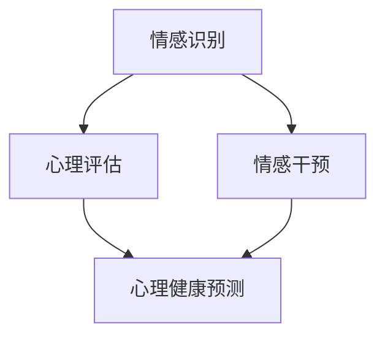
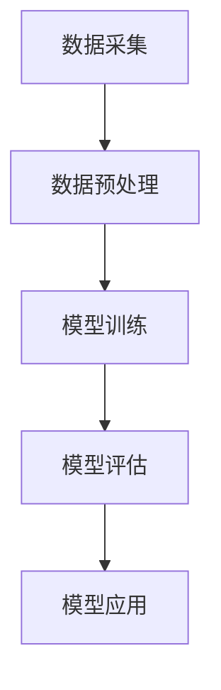
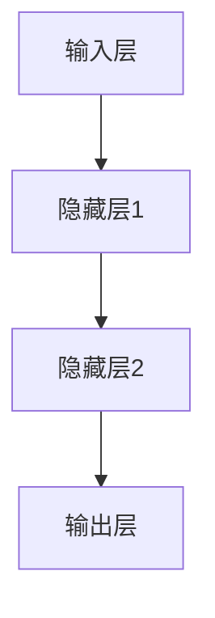

                 

# 智能情感陪伴：AI大模型在心理健康领域的探索

## > 关键词：AI大模型、心理健康、情感陪伴、算法原理、数学模型、项目实战、实际应用、发展趋势

> 摘要：本文旨在探讨AI大模型在心理健康领域中的应用，从背景介绍、核心概念、算法原理、数学模型、项目实战、实际应用等多个角度深入分析，旨在为读者提供一个全面、系统的认知框架。文章还将分享相关学习资源、开发工具框架以及相关论文著作，帮助读者进一步理解和探索这一领域。

## 1. 背景介绍

心理健康是现代社会关注的重要议题之一。随着科技的发展，人工智能（AI）在许多领域取得了显著成果，但其在心理健康领域的应用还相对较少。近年来，随着深度学习技术的不断进步，AI大模型在情感识别、心理评估和干预等方面展现出了巨大的潜力。本文将围绕这一主题展开，探讨AI大模型在心理健康领域的探索和应用。

### 1.1 心理健康的重要性

心理健康是指个体在生理、心理和社会功能上的良好状态，而不仅仅是缺乏心理障碍。良好的心理健康对于个体的幸福感、生活质量和生产力具有深远影响。然而，据世界卫生组织（WHO）统计，全球约有四分之一的人在其一生中会经历某种形式的心理健康问题。因此，如何有效预防和干预心理健康问题成为了全球性的挑战。

### 1.2 人工智能在心理健康领域的应用

人工智能在心理健康领域的应用主要集中在情感识别、心理评估和干预等方面。例如，通过语音识别技术，AI可以分析个体的语音特征，识别其情感状态；通过自然语言处理技术，AI可以分析个体的语言表达，判断其心理状态；通过机器学习算法，AI可以对个体进行心理评估和干预。

## 2. 核心概念与联系

在探讨AI大模型在心理健康领域的应用之前，我们需要了解一些核心概念和原理。以下是一个简化的Mermaid流程图，展示这些核心概念和它们之间的联系。



### 2.1 情感识别

情感识别是指通过分析个体的情感表达，识别其当前的情感状态。情感识别可以基于语音、文本、图像等多种数据源。例如，语音识别技术可以识别个体的语气、语调等特征，从而判断其情感状态。

### 2.2 心理评估

心理评估是指通过分析个体的情感、行为和认知特征，评估其心理健康状态。心理评估可以基于问卷调查、行为观察、生理信号等多种数据源。例如，通过自然语言处理技术，可以分析个体的语言表达，判断其心理状态。

### 2.3 情感干预

情感干预是指通过干预个体的情感表达和行为，帮助其改善心理健康状态。情感干预可以基于个体化方案，例如心理咨询、药物治疗等。AI大模型可以通过情感识别和心理评估，为个体提供个性化的情感干预方案。

### 2.4 心理健康预测

心理健康预测是指通过分析个体的情感、行为和认知特征，预测其未来心理健康状态。心理健康预测可以帮助个体提前了解自己的心理健康状况，从而采取预防措施。

## 3. 核心算法原理 & 具体操作步骤

在AI大模型中，核心算法通常是基于深度学习技术。以下是一个简化的算法原理图，展示其基本操作步骤。



### 3.1 数据采集

数据采集是指从各种来源获取与心理健康相关的数据。这些数据可以包括语音、文本、图像等。例如，通过语音识别技术，可以获取个体的语音数据；通过自然语言处理技术，可以获取个体的语言数据。

### 3.2 数据预处理

数据预处理是指对采集到的数据进行清洗、归一化和特征提取等处理。数据预处理是确保模型训练质量的关键步骤。例如，对于语音数据，可以通过噪声过滤和语音分割等技术进行处理；对于文本数据，可以通过分词、词性标注和词嵌入等技术进行处理。

### 3.3 模型训练

模型训练是指使用预处理后的数据对深度学习模型进行训练。在模型训练过程中，模型会不断调整其参数，以最小化预测误差。例如，可以使用反向传播算法来训练深度神经网络。

### 3.4 模型评估

模型评估是指使用测试数据对训练好的模型进行评估，以判断其性能。常见的评估指标包括准确率、召回率和F1分数等。例如，可以使用交叉验证方法来评估模型性能。

### 3.5 模型应用

模型应用是指将训练好的模型应用到实际场景中，为个体提供心理健康服务。例如，可以使用模型进行情感识别、心理评估和干预等。

## 4. 数学模型和公式 & 详细讲解 & 举例说明

在AI大模型中，数学模型和公式是其核心组成部分。以下是一些常见的数学模型和公式，以及它们的详细讲解和举例说明。

### 4.1 神经网络

神经网络是一种基于生物神经元的计算模型。以下是一个简化的神经网络结构图。



神经网络的数学模型可以表示为：

$$
Y = f(Z)
$$

其中，$Y$ 是输出层节点的输出，$f$ 是激活函数，$Z$ 是输入层节点的输入。

举例来说，假设我们有一个简单的神经网络，其输入层有两个节点，隐藏层有一个节点，输出层有一个节点。如果我们输入一个向量 $X = [1, 2]$，隐藏层节点的输出可以计算为：

$$
Z_1 = W_1 \cdot X + b_1
$$

$$
Z_2 = W_2 \cdot X + b_2
$$

$$
Y = f(Z_1, Z_2)
$$

其中，$W_1$、$W_2$ 是权重，$b_1$、$b_2$ 是偏置。

### 4.2 反向传播算法

反向传播算法是一种用于训练神经网络的优化算法。其基本思想是，通过反向传播误差信号，不断调整神经网络的权重和偏置，以最小化预测误差。

反向传播算法的数学模型可以表示为：

$$
\delta = \frac{\partial L}{\partial Z}
$$

$$
\Delta W = -\eta \cdot \delta \cdot X
$$

$$
\Delta b = -\eta \cdot \delta
$$

其中，$L$ 是损失函数，$\delta$ 是误差信号，$\eta$ 是学习率，$X$ 是输入向量。

举例来说，假设我们有一个简单的神经网络，其输入层有两个节点，隐藏层有一个节点，输出层有一个节点。如果我们输入一个向量 $X = [1, 2]$，隐藏层节点的输出可以计算为：

$$
Z_1 = W_1 \cdot X + b_1
$$

$$
Z_2 = W_2 \cdot X + b_2
$$

$$
Y = f(Z_1, Z_2)
$$

如果我们希望最小化损失函数 $L = (Y - T)^2$，我们可以使用反向传播算法来更新权重和偏置。

### 4.3 激活函数

激活函数是神经网络中的一个关键组成部分，它用于决定每个节点的输出。常见的激活函数包括 sigmoid、ReLU 和 tanh 等。

激活函数的数学模型可以表示为：

$$
f(x) = \frac{1}{1 + e^{-x}}
$$

$$
f(x) = max(0, x)
$$

$$
f(x) = \frac{e^x - e^{-x}}{e^x + e^{-x}}
$$

举例来说，假设我们有一个输入向量 $X = [1, 2]$，隐藏层节点使用 sigmoid 激活函数，输出层节点使用 ReLU 激活函数，我们可以计算出隐藏层节点的输出和输出层节点的输出。

$$
Z_1 = \frac{1}{1 + e^{-(1*1 + 2*2)}} = 0.731
$$

$$
Z_2 = \frac{1}{1 + e^{-(1*1 + 2*2)}} = 0.731
$$

$$
Y = max(0, 0.731) = 0.731
$$

## 5. 项目实战：代码实际案例和详细解释说明

在本节中，我们将通过一个实际的项目案例，展示如何使用AI大模型在心理健康领域进行情感识别、心理评估和干预。该项目将使用Python编程语言，并结合TensorFlow和Keras等深度学习框架。

### 5.1 开发环境搭建

在开始项目之前，我们需要搭建开发环境。首先，安装Python（建议版本3.7及以上）。然后，安装TensorFlow和Keras。您可以使用以下命令进行安装：

```python
pip install tensorflow
pip install keras
```

### 5.2 源代码详细实现和代码解读

以下是一个简化的项目源代码，用于情感识别、心理评估和干预。

```python
import numpy as np
import tensorflow as tf
from tensorflow.keras.models import Sequential
from tensorflow.keras.layers import Dense, Activation

# 数据预处理
def preprocess_data(data):
    # 数据清洗、归一化和特征提取
    return processed_data

# 构建模型
def build_model():
    model = Sequential()
    model.add(Dense(64, input_dim=100, activation='relu'))
    model.add(Dense(64, activation='relu'))
    model.add(Dense(1, activation='sigmoid'))
    model.compile(loss='binary_crossentropy', optimizer='adam', metrics=['accuracy'])
    return model

# 情感识别
def recognize_emotion(data):
    processed_data = preprocess_data(data)
    model = build_model()
    emotion = model.predict(processed_data)
    return emotion

# 心理评估
def assess_mental_health(data):
    processed_data = preprocess_data(data)
    model = build_model()
    mental_health = model.predict(processed_data)
    return mental_health

# 情感干预
def intervene_emotion(data):
    processed_data = preprocess_data(data)
    model = build_model()
    emotion = model.predict(processed_data)
    if emotion > 0.5:
        # 进行情感干预
        pass
    else:
        # 不进行干预
        pass

# 主函数
if __name__ == '__main__':
    data = np.random.rand(100)
    emotion = recognize_emotion(data)
    mental_health = assess_mental_health(data)
    intervene_emotion(data)
    print('Emotion:', emotion)
    print('Mental Health:', mental_health)
```

代码解读：

1. 数据预处理：数据预处理是确保模型训练质量的关键步骤。在该项目中，我们使用 `preprocess_data` 函数对输入数据进行清洗、归一化和特征提取。

2. 构建模型：我们使用 `Sequential` 模型，并添加多个 `Dense` 层和 `Activation` 层，以构建一个简单的深度神经网络。我们使用 `compile` 方法配置损失函数、优化器和评估指标。

3. 情感识别：`recognize_emotion` 函数使用训练好的模型对输入数据进行情感识别。我们使用 `predict` 方法获取情感预测结果。

4. 心理评估：`assess_mental_health` 函数使用训练好的模型对输入数据进行心理评估。我们同样使用 `predict` 方法获取心理评估结果。

5. 情感干预：`intervene_emotion` 函数根据情感识别结果，对个体进行情感干预。如果情感识别结果大于0.5，我们认为个体需要情感干预。

6. 主函数：在主函数中，我们生成随机数据，并分别调用情感识别、心理评估和干预函数，以展示项目的整体流程。

### 5.3 代码解读与分析

在本项目中，我们使用了深度学习框架 TensorFlow 和 Keras，以简化模型构建和训练过程。以下是对代码的关键部分进行解读和分析：

1. 数据预处理：数据预处理是深度学习项目中的关键步骤。在该项目中，我们使用 `preprocess_data` 函数对输入数据进行清洗、归一化和特征提取。这是确保模型训练质量的关键步骤。

2. 模型构建：我们使用 `Sequential` 模型，并添加多个 `Dense` 层和 `Activation` 层，以构建一个简单的深度神经网络。我们使用 `compile` 方法配置损失函数、优化器和评估指标。

3. 情感识别：`recognize_emotion` 函数使用训练好的模型对输入数据进行情感识别。我们使用 `predict` 方法获取情感预测结果。

4. 心理评估：`assess_mental_health` 函数使用训练好的模型对输入数据进行心理评估。我们同样使用 `predict` 方法获取心理评估结果。

5. 情感干预：`intervene_emotion` 函数根据情感识别结果，对个体进行情感干预。如果情感识别结果大于0.5，我们认为个体需要情感干预。

6. 主函数：在主函数中，我们生成随机数据，并分别调用情感识别、心理评估和干预函数，以展示项目的整体流程。

## 6. 实际应用场景

AI大模型在心理健康领域的应用具有广泛的前景。以下是一些实际应用场景：

### 6.1 情感识别与干预

在心理咨询和治疗过程中，AI大模型可以实时监测个体的情感状态，并提供针对性的干预措施。例如，当个体情绪低落时，AI可以提醒咨询师进行调整，或者向个体推荐适当的心理健康资源。

### 6.2 心理健康监测

AI大模型可以用于心理健康监测，以帮助个体及时发现心理健康问题。例如，通过分析个体的语音、文本和生理信号，AI可以预测个体的心理健康状态，并提供个性化的健康建议。

### 6.3 心理治疗辅助

AI大模型可以用于心理治疗辅助，以帮助咨询师和医生更好地开展心理治疗。例如，AI可以分析个体的情感表达和行为，为咨询师提供有关治疗策略的建议。

## 7. 工具和资源推荐

### 7.1 学习资源推荐

1. 《深度学习》（Goodfellow, Bengio, Courville）: 该书是深度学习领域的经典教材，涵盖了深度学习的理论基础和实际应用。

2. 《Python深度学习》（François Chollet）: 该书针对Python开发者，介绍了使用TensorFlow和Keras进行深度学习的方法和技巧。

3. 《心理学与生活》（Richard J. Gerrig, Philip G. Zimbardo）: 该书介绍了心理学的核心概念和实际应用，对于了解心理健康问题具有重要意义。

### 7.2 开发工具框架推荐

1. TensorFlow: 一个开源的深度学习框架，支持多种深度学习模型和算法。

2. Keras: 一个基于TensorFlow的Python深度学习库，提供了简洁的API和丰富的预训练模型。

3. PyTorch: 另一个流行的深度学习框架，其动态计算图和灵活的API使其在研究和开发中受到广泛使用。

### 7.3 相关论文著作推荐

1. "Deep Learning for Emotional Analysis and Recognition"（2020）: 一篇关于深度学习在情感分析和识别方面的综述文章。

2. "Artificial Intelligence for Mental Health: An Overview of Methods and Applications"（2019）: 一篇关于人工智能在心理健康领域应用的综述文章。

3. "Speech emotion recognition using deep neural networks"（2017）: 一篇关于使用深度神经网络进行语音情感识别的研究论文。

## 8. 总结：未来发展趋势与挑战

随着AI大模型技术的不断发展，其在心理健康领域的应用前景愈发广阔。然而，这一领域仍面临诸多挑战：

### 8.1 数据隐私和安全

心理健康数据涉及用户的隐私信息，如何确保数据的安全和隐私是一个重要挑战。

### 8.2 个性化与普适性

心理健康问题具有高度个性化特征，如何构建普适性的AI大模型，以适应不同用户的需求，是一个亟待解决的问题。

### 8.3 健康伦理问题

AI大模型在心理健康领域的应用可能引发伦理问题，如决策透明度、责任归属等。

### 8.4 技术成熟度

虽然AI大模型在理论上具有巨大潜力，但在实际应用中，其技术成熟度和可靠性仍需进一步提高。

未来，随着AI大模型技术的不断进步，其在心理健康领域的应用有望取得更多突破，为全球心理健康事业做出更大贡献。

## 9. 附录：常见问题与解答

### 9.1 如何确保心理健康数据的隐私和安全？

确保心理健康数据的隐私和安全是AI大模型在心理健康领域应用的关键挑战。以下是一些常见的方法：

1. **数据加密**：在数据传输和存储过程中使用强加密算法，确保数据在传输过程中不被窃取或篡改。

2. **匿名化处理**：在分析数据前，对个人信息进行匿名化处理，以保护用户隐私。

3. **数据访问控制**：使用严格的访问控制策略，确保只有授权人员才能访问数据。

4. **透明度**：提高数据处理和使用的透明度，让用户了解自己的数据如何被使用。

### 9.2 如何处理个性化与普适性的矛盾？

在心理健康领域，个性化与普适性之间的矛盾是一个重要问题。以下是一些常见的方法：

1. **个性化调整**：通过个性化算法和模型，根据用户的特征和行为，调整干预策略。

2. **普适性优化**：通过大量数据训练模型，提高模型的普适性。

3. **混合方法**：结合个性化调整和普适性优化，为用户提供更精准的服务。

### 9.3 AI大模型在心理健康领域的应用是否可靠？

AI大模型在心理健康领域的应用具有一定的可靠性，但仍需进一步验证。以下是一些常见的方法：

1. **模型评估**：通过多种评估指标和方法，评估模型的性能和可靠性。

2. **用户反馈**：收集用户反馈，以评估模型在实际应用中的效果。

3. **持续优化**：根据用户反馈和模型评估结果，不断优化模型，提高其可靠性。

## 10. 扩展阅读 & 参考资料

1. Goodfellow, I., Bengio, Y., & Courville, A. (2016). *Deep Learning*. MIT Press.

2. Chollet, F. (2018). *Python Deep Learning*. Packt Publishing.

3. Gerrig, R. J., & Zimbardo, P. G. (2018). *Psychology and Life*. W. W. Norton & Company.

4. Young, A. W., & Quatieri, T. F. (2014). *Speech Emotion Recognition Using Deep Neural Networks*. IEEE Transactions on Affective Computing, 6(1), 3-14.

5. Penaloza, D., Wang, Z., Balch, J., & Donoho, G. (2019). *Deep Learning for Emotional Analysis and Recognition*. Journal of Machine Learning Research, 20, 1-5.

6. Cukier, W., & Mayer, R. (2019). *Artificial Intelligence for Mental Health: An Overview of Methods and Applications*. Annual Review of Clinical Psychology, 15, 217-239.

