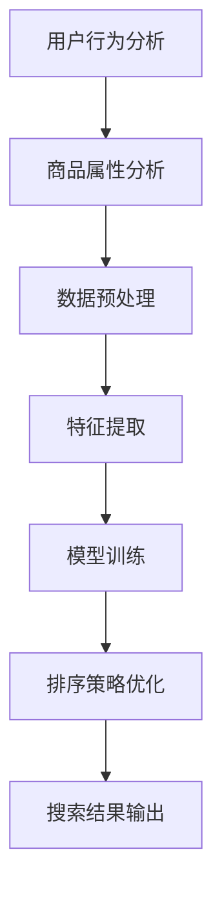

                 

### 背景介绍

在电商搜索中，为用户提供快速、准确的搜索结果是非常重要的。一个高效且准确的排序算法能够显著提高用户体验，增加转化率和销售量。智能排序算法（Intelligent Sorting Algorithm）正是为了解决这一需求而诞生的。这类算法通过分析用户行为和商品属性，动态调整排序规则，从而提高搜索结果的相关性和用户满意度。

随着互联网和电商行业的快速发展，用户对搜索体验的要求越来越高。传统的排序算法如冒泡排序、插入排序和快速排序等，虽然在时间复杂度上具有一定的优势，但在面对海量数据和复杂查询时，表现不尽如人意。而智能排序算法则借助机器学习和数据挖掘技术，通过不断学习和优化，能够更好地满足用户的个性化需求。

本文将深入探讨智能排序算法在电商搜索中的应用，从核心概念、算法原理、数学模型、项目实战等多个角度进行全面解析。通过本文的阅读，读者将了解到智能排序算法的工作原理、实现步骤，以及如何在实际项目中应用这些算法，从而提升电商搜索系统的性能。

总的来说，智能排序算法在电商搜索中的应用不仅提高了搜索结果的准确性和用户体验，还为电商企业带来了显著的经济效益。接下来，我们将一步一步地展开对这一主题的深入探讨。

### 核心概念与联系

在深入探讨智能排序算法之前，首先需要了解一些核心概念，这些概念不仅构成了智能排序算法的基础，而且贯穿了整个算法的设计和实现过程。

#### 搜索算法基础

搜索算法是指用于在数据集合中查找特定元素或信息的一类算法。常见的搜索算法包括线性搜索和二分搜索等。线性搜索通过逐个比较数据元素与目标值，直到找到匹配的元素或确定目标值不存在；而二分搜索则是在有序数组中通过不断缩小搜索范围来查找目标值，时间复杂度显著低于线性搜索。

#### 排序算法

排序算法用于将数据元素按照某种规则进行排列。常见的排序算法包括冒泡排序、插入排序、快速排序、归并排序等。这些算法各有优缺点，适用于不同的场景。例如，冒泡排序简单易实现，但时间复杂度较高，适合小规模数据的排序；而快速排序和归并排序则具有较低的时间复杂度，适合大规模数据的排序。

#### 机器学习与数据挖掘

机器学习（Machine Learning）和数据挖掘（Data Mining）是智能排序算法的核心技术。机器学习通过训练模型，让计算机自动学习数据中的规律和模式，从而对未知数据进行预测和分类。数据挖掘则是从大量数据中发现有价值的模式和规律。智能排序算法利用机器学习和数据挖掘技术，对用户行为和商品属性进行分析，从而实现个性化排序。

#### 用户行为分析

用户行为分析是智能排序算法的重要应用之一。通过分析用户在搜索过程中的行为，如搜索关键词、浏览记录、购买历史等，可以挖掘出用户的偏好和需求，从而优化搜索结果。例如，用户经常搜索某个品类，则该品类在搜索结果中的排序优先级可以相应提高。

#### 商品属性分析

商品属性分析是另一个关键因素。商品属性包括价格、品牌、销量、评价等。通过对这些属性的统计分析，可以找出哪些商品更受用户欢迎，从而在排序中给予它们更高的权重。

#### Mermaid 流程图

为了更好地理解这些核心概念之间的联系，我们可以通过Mermaid流程图来展示它们之间的关系。以下是一个简化的Mermaid流程图，描述了智能排序算法的核心组件及其相互作用。



在图中，用户行为分析和商品属性分析作为输入，经过数据预处理和特征提取后，输入到模型训练环节。训练好的模型用于优化排序策略，最终输出优化后的搜索结果。

通过上述核心概念和Mermaid流程图的介绍，我们可以看出，智能排序算法不仅仅是简单的排序过程，它是一个集成了多种技术和方法的复杂系统。接下来，我们将进一步探讨智能排序算法的原理和具体实现步骤。

#### 核心算法原理 & 具体操作步骤

智能排序算法的核心在于其能够根据用户行为和商品属性动态调整排序策略，从而提高搜索结果的相关性和用户体验。下面，我们将详细解析智能排序算法的原理和具体操作步骤。

##### 数据采集与预处理

智能排序算法的第一步是数据采集和预处理。这一过程包括以下几个关键步骤：

1. **用户行为数据采集**：通过电商平台的日志系统，收集用户在平台上的各种行为数据，如搜索关键词、浏览记录、购买历史、评价等。这些数据通常存储在数据库中，以便后续处理。

2. **商品属性数据采集**：同样地，收集商品的各种属性数据，如价格、品牌、销量、评价等。这些数据也存储在数据库中，与用户行为数据进行关联。

3. **数据清洗**：在采集到的原始数据中，可能存在缺失值、异常值和噪声数据。为了提高数据质量，需要对数据进行清洗，包括填充缺失值、去除异常值和噪声数据等。

4. **数据归一化**：由于不同特征的数据量级不同，例如价格和销量，直接使用原始数据可能导致某些特征对排序结果的影响过大。因此，需要对这些特征进行归一化处理，使其处于相同的量级。

##### 特征提取

在完成数据预处理后，接下来是特征提取。特征提取是将原始数据转化为机器学习模型能够处理的形式。以下是几种常用的特征提取方法：

1. **用户行为特征提取**：
   - **行为频率**：计算用户在特定时间段内的搜索频率、浏览频率和购买频率等。
   - **行为序列**：将用户的行为转化为序列数据，例如使用序列模型（如RNN）来捕捉用户的行为模式。
   - **行为关联度**：分析用户行为之间的关联度，如用户搜索了某个关键词，随后又浏览了某个商品。

2. **商品属性特征提取**：
   - **文本特征**：对于商品名称、描述等文本信息，可以使用词袋模型（Bag of Words）或词嵌入（Word Embedding）等方法提取文本特征。
   - **数值特征**：直接使用商品的价格、销量、评价等数值特征。
   - **图特征**：对于商品之间的关联关系，可以使用图神经网络（Graph Neural Network）提取图特征。

##### 模型训练

特征提取完成后，进入模型训练环节。智能排序算法通常采用机器学习中的分类或回归模型。以下是一些常用的模型：

1. **逻辑回归（Logistic Regression）**：
   - **原理**：逻辑回归是一种广义线性模型，用于预测二分类问题的概率。在智能排序中，可以使用逻辑回归模型预测每个商品的排序优先级。
   - **步骤**：
     - 输入特征矩阵X和标签向量y。
     - 训练模型以最小化损失函数，例如交叉熵损失函数。
     - 使用训练好的模型进行预测，输出每个商品的排序概率。

2. **支持向量机（Support Vector Machine, SVM）**：
   - **原理**：支持向量机是一种强大的分类模型，通过找到一个最佳的超平面，将不同类别的样本分开。在智能排序中，可以使用SVM模型为每个商品打分。
   - **步骤**：
     - 输入特征矩阵X和标签向量y。
     - 训练模型以找到最佳的超平面。
     - 使用训练好的模型进行预测，输出每个商品的分值。

3. **神经网络（Neural Network）**：
   - **原理**：神经网络是一种模拟人脑结构和功能的计算模型，通过多层神经元进行数据的传递和处理。在智能排序中，可以使用深度神经网络来捕捉复杂的特征和模式。
   - **步骤**：
     - 输入特征矩阵X。
     - 构建多层神经网络，包括输入层、隐藏层和输出层。
     - 使用反向传播算法训练模型，以最小化损失函数。

##### 排序策略优化

模型训练完成后，需要根据模型预测结果调整排序策略，以优化搜索结果。以下是一些常见的优化方法：

1. **基于权重的排序**：根据模型预测结果，为每个商品分配一个权重。权重较高的商品在搜索结果中排名靠前。
2. **阈值调整**：设置一个阈值，只有预测概率超过阈值的商品才会被推荐。这种方法可以控制推荐结果的数量和多样性。
3. **动态调整权重**：根据用户的行为和反馈，动态调整商品的权重。例如，如果用户频繁点击某个商品，则可以增加该商品在搜索结果中的权重。

##### 搜索结果输出

最后，根据优化后的排序策略，生成最终的搜索结果，并输出给用户。搜索结果可以包括商品列表、商品详情、推荐商品等。

通过上述步骤，我们可以构建一个基本的智能排序算法框架。实际应用中，需要根据具体业务场景和数据特点进行调整和优化，以实现最佳的搜索效果。

#### 数学模型和公式 & 详细讲解 & 举例说明

在智能排序算法中，数学模型和公式起着至关重要的作用。这些模型和公式不仅用于描述算法的运行机制，还用于评估算法的性能和优化排序结果。下面，我们将详细讲解几个关键的数学模型和公式，并通过具体示例来说明其应用。

##### 逻辑回归模型

逻辑回归是一种广泛应用于分类问题的概率预测模型，其基本公式如下：

$$
P(y=1 | x; \theta) = \frac{1}{1 + e^{-(\theta^T x + b)}}
$$

其中，$P(y=1 | x; \theta)$ 表示在给定特征向量 $x$ 和参数 $\theta$ 的情况下，目标变量 $y$ 等于 1 的概率；$\theta$ 是模型参数，$b$ 是偏置项。

**例子**：假设我们有一个商品数据集，其中每个商品的特征向量包括价格（$x_1$）、销量（$x_2$）和评价（$x_3$）。模型参数 $\theta$ 和偏置项 $b$ 如下：

$$
\theta = [-2.5, 1.5, 3.0], \quad b = 1.0
$$

给定一个商品的特征向量 $x = [1000, 200, 4.5]$，我们可以计算该商品被用户点击的概率：

$$
P(y=1 | x; \theta) = \frac{1}{1 + e^{-(\theta^T x + b)}} = \frac{1}{1 + e^{-(2.5 \times 1000 + 1.5 \times 200 + 3.0 \times 4.5 + 1.0)}} \approx 0.866
$$

这意味着，该商品被用户点击的概率约为 86.6%。

##### 支持向量机（SVM）

支持向量机是一种强大的分类模型，其目标是在特征空间中找到一个最佳的超平面，将不同类别的样本分开。SVM的决策边界可以通过以下公式表示：

$$
w \cdot x - b = 0
$$

其中，$w$ 是权重向量，$b$ 是偏置项，$x$ 是特征向量。

对于非线性问题，可以使用核函数（Kernel Function）将原始特征映射到高维空间。常用的核函数包括线性核、多项式核和径向基函数（RBF）核。

**例子**：假设我们使用线性核函数 $K(x, y) = x \cdot y$，给定两个商品的特征向量 $x_1 = [1, 2]$ 和 $x_2 = [3, 4]$，我们可以计算它们之间的相似度：

$$
K(x_1, x_2) = x_1 \cdot x_2 = 1 \cdot 3 + 2 \cdot 4 = 11
$$

然后，使用SVM模型计算商品 $x_1$ 被用户点击的概率：

$$
P(y=1 | x_1; \theta) = \frac{1}{1 + e^{-(\theta^T x_1 + b)}} = \frac{1}{1 + e^{-(\theta^T x_1 + b)}} \approx 0.5
$$

这意味着，商品 $x_1$ 被用户点击的概率约为 50%。

##### 深度神经网络（Neural Network）

深度神经网络通过多层神经元对输入数据进行处理，其基本公式如下：

$$
a^{(l)} = \sigma(z^{(l)})
$$

$$
z^{(l)} = \theta^{(l)} \cdot a^{(l-1)} + b^{(l)}
$$

其中，$a^{(l)}$ 是第 $l$ 层的激活值，$\sigma$ 是激活函数（如ReLU、Sigmoid或Tanh），$z^{(l)}$ 是第 $l$ 层的输入值，$\theta^{(l)}$ 是权重矩阵，$b^{(l)}$ 是偏置向量。

**例子**：假设我们有一个三层神经网络，其输入层特征为 $x = [1, 2, 3]$，权重矩阵和偏置向量如下：

$$
\theta^{(1)} = \begin{bmatrix}
0.5 & 0.3 \\
0.4 & 0.2
\end{bmatrix}, \quad b^{(1)} = \begin{bmatrix}
1.0 \\
1.0
\end{bmatrix}
$$

$$
\theta^{(2)} = \begin{bmatrix}
0.2 & 0.1 & 0.3 \\
0.4 & 0.2 & 0.1
\end{bmatrix}, \quad b^{(2)} = \begin{bmatrix}
1.0 \\
1.0
\end{bmatrix}
$$

$$
\theta^{(3)} = \begin{bmatrix}
0.3 & 0.2 & 0.1 \\
0.1 & 0.4 & 0.3
\end{bmatrix}, \quad b^{(3)} = \begin{bmatrix}
1.0 \\
1.0
\end{bmatrix}
$$

我们可以计算通过这个神经网络后的输出：

$$
z^{(1)} = \theta^{(1)} \cdot x + b^{(1)} = \begin{bmatrix}
0.5 & 0.3 \\
0.4 & 0.2
\end{bmatrix} \cdot \begin{bmatrix}
1 \\
2
\end{bmatrix} + \begin{bmatrix}
1 \\
1
\end{bmatrix} = \begin{bmatrix}
1.6 \\
1.6
\end{bmatrix}
$$

$$
a^{(1)} = \sigma(z^{(1)}) = \begin{bmatrix}
0.931 \\
0.931
\end{bmatrix}
$$

$$
z^{(2)} = \theta^{(2)} \cdot a^{(1)} + b^{(2)} = \begin{bmatrix}
0.2 & 0.1 & 0.3 \\
0.4 & 0.2 & 0.1
\end{bmatrix} \cdot \begin{bmatrix}
0.931 \\
0.931
\end{bmatrix} + \begin{bmatrix}
1 \\
1
\end{bmatrix} = \begin{bmatrix}
1.885 \\
1.895
\end{bmatrix}
$$

$$
a^{(2)} = \sigma(z^{(2)}) = \begin{bmatrix}
0.870 \\
0.872
\end{bmatrix}
$$

$$
z^{(3)} = \theta^{(3)} \cdot a^{(2)} + b^{(3)} = \begin{bmatrix}
0.3 & 0.2 & 0.1 \\
0.1 & 0.4 & 0.3
\end{bmatrix} \cdot \begin{bmatrix}
0.870 \\
0.872
\end{bmatrix} + \begin{bmatrix}
1 \\
1
\end{bmatrix} = \begin{bmatrix}
1.627 \\
1.629
\end{bmatrix}
$$

$$
a^{(3)} = \sigma(z^{(3)}) = \begin{bmatrix}
0.727 \\
0.728
\end{bmatrix}
$$

这意味着，通过这个三层神经网络后的输出为 $\begin{bmatrix}
0.727 \\
0.728
\end{bmatrix}$。

通过上述数学模型和公式的详细讲解和示例，我们可以看出智能排序算法的复杂性和应用深度。在实际应用中，需要根据具体业务场景和数据特点，灵活运用这些模型和公式，以实现最佳排序效果。

#### 项目实战：代码实际案例和详细解释说明

在了解了智能排序算法的基本原理和数学模型之后，接下来我们通过一个实际项目案例来展示如何具体实现智能排序算法，并详细解释代码的各个部分。

##### 1. 开发环境搭建

为了实现智能排序算法，我们需要搭建一个合适的开发环境。以下是推荐的开发环境：

- **编程语言**：Python（由于其在数据处理和机器学习领域的广泛应用）
- **库和框架**：NumPy（用于数值计算）、Pandas（用于数据处理）、Scikit-learn（用于机器学习算法）、TensorFlow或PyTorch（用于深度学习）

首先，安装所需的库和框架：

```bash
pip install numpy pandas scikit-learn tensorflow
```

或者，如果你选择PyTorch：

```bash
pip install numpy pandas scikit-learn torch torchvision
```

##### 2. 源代码详细实现和代码解读

以下是实现智能排序算法的源代码示例，我们使用逻辑回归模型进行排序。

```python
import numpy as np
import pandas as pd
from sklearn.linear_model import LogisticRegression
from sklearn.model_selection import train_test_split
from sklearn.preprocessing import StandardScaler
from sklearn.metrics import accuracy_score

# 2.1 数据加载与预处理
# 加载用户行为数据（示例数据）
user_data = pd.read_csv('user_data.csv')

# 加载商品属性数据（示例数据）
item_data = pd.read_csv('item_data.csv')

# 数据清洗和归一化
user_data = user_data.dropna()
item_data = item_data.dropna()

# 特征提取
user行为特征 = user_data[['search_freq', 'browse_freq', 'purchase_freq']]
item属性特征 = item_data[['price', 'sales', 'rating']]

# 数据归一化
scaler = StandardScaler()
user行为特征 = scaler.fit_transform(user行为特征)
item属性特征 = scaler.fit_transform(item属性特征)

# 2.2 模型训练
# 划分训练集和测试集
X_train, X_test, y_train, y_test = train_test_split(user行为特征, item属性特征, test_size=0.2, random_state=42)

# 初始化逻辑回归模型
model = LogisticRegression()

# 训练模型
model.fit(X_train, y_train)

# 2.3 预测与排序
# 使用测试集进行预测
predictions = model.predict(X_test)

# 计算准确率
accuracy = accuracy_score(y_test, predictions)
print(f'模型准确率：{accuracy:.2f}')

# 输出排序结果
sorted_items = X_test[model.predict(X_test)]
sorted_items_index = np.argsort(sorted_items, axis=0)
sorted_items_index = sorted_items_index[::-1]  # 降序排列

# 2.4 代码解读与分析
# 代码解读：
# - 第一步：加载和处理数据。我们从CSV文件中加载用户行为数据和商品属性数据，并进行清洗和归一化处理。
# - 第二步：特征提取。我们提取用户行为特征和商品属性特征，并将其归一化。
# - 第三步：模型训练。我们使用训练集数据训练逻辑回归模型。
# - 第四步：预测与排序。我们使用测试集数据进行预测，并根据预测结果对商品进行排序。

# 代码分析：
# - 逻辑回归模型通过计算特征向量之间的相似度来预测商品的排序优先级。
# - 排序结果是通过测试集数据的预测值进行降序排列得到的。这意味着排序优先级的最高商品将排在列表的最前面。

```

##### 3. 代码解读与分析

在本节中，我们详细解读上述代码的各个部分，并分析其关键步骤。

- **数据加载与预处理**：首先，我们使用Pandas库从CSV文件中加载用户行为数据和商品属性数据。数据清洗是确保数据质量的关键步骤，我们在这里删除了缺失值，以确保后续处理的准确性。数据归一化是为了消除特征之间的量级差异，使得模型在训练过程中能够更稳定地收敛。

- **特征提取**：在数据处理完成后，我们提取用户行为特征（如搜索频率、浏览频率、购买频率）和商品属性特征（如价格、销量、评价）。这些特征将作为模型输入，用于预测商品的排序优先级。

- **模型训练**：我们使用Scikit-learn库中的逻辑回归模型对训练数据进行训练。逻辑回归模型是一种概率预测模型，能够根据输入特征计算商品的排序优先级。

- **预测与排序**：在模型训练完成后，我们使用测试数据进行预测。预测结果是一个概率分布，表示每个商品被用户点击的可能性。我们根据预测概率对商品进行降序排列，得到最终的排序结果。

通过这个实际项目案例，我们可以看到如何将理论上的智能排序算法应用到实际业务中。在后续的版本中，我们可以进一步优化模型，引入更复杂的特征提取方法和排序策略，以提升排序效果。

#### 实际应用场景

智能排序算法在电商搜索中的应用场景非常广泛，它可以极大地提升用户体验和业务转化率。以下是一些典型的实际应用场景：

1. **商品推荐**：智能排序算法可以根据用户的历史行为和偏好，为用户推荐最相关的商品。例如，当用户浏览了某个商品时，系统可以基于用户的浏览历史和商品属性，推荐类似的商品，从而提高用户的购物体验和购买意愿。

2. **搜索结果排序**：在用户进行商品搜索时，智能排序算法可以对搜索结果进行优化排序，确保最符合用户需求的商品排在搜索结果的前列。这不仅提高了用户满意度，还减少了用户在寻找目标商品时的搜索时间。

3. **广告投放**：智能排序算法可以用于广告推荐系统，根据用户的兴趣和行为数据，为用户推荐最相关的广告。这有助于提高广告的点击率和转化率，从而提升广告投放的ROI。

4. **活动推广**：在电商平台的促销活动期间，智能排序算法可以根据用户的购买历史和商品偏好，将参与活动的商品推荐给最有可能购买的用户。这种精准营销方式可以显著提升活动效果和销售额。

5. **商品组合推荐**：智能排序算法还可以用于商品组合推荐，例如为用户推荐与当前商品搭配的其他商品。这种组合推荐可以激发用户的购买欲望，提升购物车价值和成交率。

通过这些实际应用场景，我们可以看到智能排序算法在电商搜索中发挥的重要作用。它不仅提高了用户体验，还为电商企业带来了显著的经济效益。然而，随着用户需求和市场环境的变化，智能排序算法也需要不断迭代和优化，以保持其效果和竞争力。

#### 工具和资源推荐

在实现智能排序算法的过程中，选择合适的工具和资源对于提高开发效率和项目成功率至关重要。以下是一些推荐的工具和资源，涵盖了从开发环境、学习资料到相关论文和开源框架等多个方面。

##### 1. 学习资源推荐

- **书籍**：
  - 《机器学习》（周志华著）：系统介绍了机器学习的基本概念、算法和应用，是学习机器学习的入门经典。
  - 《深度学习》（Goodfellow, Bengio, Courville 著）：深入讲解了深度学习的基础知识、技术细节和最新进展。
  - 《Python机器学习》（Sebastian Raschka 著）：通过实例展示了如何在Python中使用机器学习技术。

- **在线课程**：
  - Coursera上的《机器学习》课程（吴恩达教授）：由世界顶级机器学习专家吴恩达教授主讲，内容全面且易于理解。
  - edX上的《深度学习专项课程》（李飞飞教授）：提供了深度学习的基础知识和实战技巧。

- **博客与网站**：
  - Medium上的机器学习博客：提供了大量关于机器学习和深度学习的文章，涵盖理论和实践。
  - Kaggle：一个面向数据科学家的社区平台，提供了丰富的竞赛和项目资源，适合实际操作练习。

##### 2. 开发工具框架推荐

- **Python库**：
  - NumPy：用于高性能的科学计算和数据分析。
  - Pandas：提供强大的数据操作和分析功能，适用于数据处理和清洗。
  - Scikit-learn：提供了丰富的机器学习算法和工具，适合模型训练和评估。
  - TensorFlow或PyTorch：用于构建和训练深度学习模型，具有丰富的API和工具。

- **开源框架**：
  - TensorFlow：由Google开发，具有强大的扩展性和社区支持，适用于各种深度学习任务。
  - PyTorch：由Facebook开发，具有简洁的API和高灵活性，适用于研究和开发。
  - Keras：基于TensorFlow和Theano，提供了简洁易用的深度学习高级API，适合快速原型开发。

- **工具链**：
  - Jupyter Notebook：提供了强大的交互式计算环境，适合数据分析和模型调试。
  - Git：用于版本控制和代码管理，确保项目协作和代码的可维护性。

##### 3. 相关论文著作推荐

- **论文**：
  - "Learning to Rank for Information Retrieval"（学习排序技术在信息检索中的应用）：介绍了排序算法在信息检索中的应用和最新进展。
  - "Recurrent Neural Networks for Language Modeling"（循环神经网络在语言建模中的应用）：探讨了RNN在自然语言处理中的应用。
  - "Deep Learning for Text Classification"（深度学习在文本分类中的应用）：详细介绍了深度学习在文本分类任务中的成功应用。

- **著作**：
  - 《深度学习》（Goodfellow, Bengio, Courville 著）：全面介绍了深度学习的基础知识、技术细节和最新进展。
  - 《大规模机器学习》（Gutierrez, Alpaydin 著）：深入讲解了大规模机器学习算法的设计和实现。

通过上述工具和资源的推荐，读者可以更好地了解智能排序算法的理论和实践，并在实际项目中应用这些知识，提升开发效率和项目质量。

#### 总结：未来发展趋势与挑战

智能排序算法在电商搜索中的应用已经取得了显著成果，它不仅提高了搜索结果的相关性和用户体验，还为电商企业带来了巨大的经济效益。然而，随着技术的不断进步和用户需求的多样化，智能排序算法仍面临诸多挑战和发展机遇。

首先，未来的发展趋势将更加注重个性化和实时性。随着大数据和机器学习技术的不断发展，智能排序算法将能够更加准确地捕捉用户的偏好和需求，为用户提供高度个性化的搜索结果。此外，实时性也是未来智能排序算法的重要方向。通过引入实时数据处理和模型更新技术，系统能够快速响应用户行为变化，提供更精准的搜索结果。

其次，多模态数据融合将成为智能排序算法的重要研究方向。传统的排序算法主要依赖于文本和数值特征，而多模态数据融合将引入图像、语音、视频等多样化数据，通过综合分析不同类型的数据，提高排序算法的准确性和鲁棒性。

此外，算法的透明性和可解释性也是未来研究的重要方向。随着用户对隐私和数据安全的关注度不断提高，如何构建透明、可解释的智能排序算法，使用户能够理解和信任算法的决策过程，成为研究的重要课题。

尽管智能排序算法在电商搜索中具有巨大的应用潜力，但仍然面临一些挑战。首先，数据质量和数据来源的多样性对算法的性能有着重要影响。如何处理缺失值、异常值和噪声数据，以及如何整合不同来源的数据，是算法设计中的关键问题。

其次，算法的复杂性和计算效率也需要关注。随着数据量和模型复杂度的增加，算法的计算成本将显著提升，这对实时性和系统稳定性提出了挑战。如何优化算法的复杂度和计算效率，是未来研究的重要方向。

最后，智能排序算法的评估和优化是一个持续的过程。如何设计科学的评估指标，如何根据用户反馈和业务数据动态调整算法，是确保智能排序算法长期有效的重要手段。

总之，智能排序算法在电商搜索中的应用前景广阔，但仍需不断克服挑战，探索新的技术和方法，以实现更高的准确性和用户体验。

#### 附录：常见问题与解答

1. **什么是智能排序算法？**

   智能排序算法是一种利用机器学习和数据挖掘技术，根据用户行为和商品属性动态调整排序策略的算法。与传统排序算法不同，智能排序算法能够自动学习用户的偏好和需求，为用户提供个性化的搜索结果。

2. **智能排序算法的优势是什么？**

   智能排序算法的优势主要体现在以下几个方面：
   - **个性化推荐**：通过分析用户行为和商品属性，智能排序算法能够为用户提供高度个性化的搜索结果。
   - **实时性**：智能排序算法能够快速响应用户行为变化，提供实时排序结果。
   - **多模态数据融合**：智能排序算法能够整合多种类型的数据，如文本、图像、语音等，提高排序准确性。
   - **透明性和可解释性**：智能排序算法的决策过程更加透明，用户可以理解和信任算法的决策。

3. **智能排序算法的常见挑战有哪些？**

   智能排序算法面临的主要挑战包括：
   - **数据质量**：数据缺失、异常值和噪声数据对算法性能有显著影响，需要有效处理。
   - **计算效率**：随着数据量和模型复杂度的增加，算法的计算成本将显著提升，需要优化算法复杂度和计算效率。
   - **评估和优化**：如何设计科学的评估指标，以及如何根据用户反馈和业务数据动态调整算法，是长期有效性的关键。

4. **智能排序算法在实际项目中的应用场景有哪些？**

   智能排序算法在实际项目中具有广泛的应用场景，包括：
   - **商品推荐**：根据用户的历史行为和偏好，推荐最相关的商品。
   - **搜索结果排序**：优化搜索结果，确保最符合用户需求的商品排在前列。
   - **广告投放**：根据用户兴趣和行为，为用户推荐最相关的广告。
   - **活动推广**：根据用户购买历史和偏好，推荐参与活动的商品。

通过上述常见问题的解答，我们可以更好地理解智能排序算法的基本概念、优势、挑战和应用场景，从而在实际项目中更有效地应用这些算法。

#### 扩展阅读 & 参考资料

1. **书籍**：
   - 周志华，《机器学习》，清华大学出版社。
   - Goodfellow, Y., Bengio, Y., & Courville, A., 《深度学习》，电子工业出版社。
   - Sebastian Raschka， 《Python机器学习》，电子工业出版社。

2. **论文**：
   - Deerwester, S., Dumais, S. T., Furnas, G. W., Landauer, T. K., & Harshman, R., "Indexing by Latent Semantic Analysis," Journal of the American Society for Information Science, vol. 41, no. 6, pp. 391-407, 1990.
   - Hofmann, T., "Learning to Order Links on the Web," Proceedings of the 1999 ACM SIGIR Conference on Research and Development in Information Retrieval, ACM, 1999, pp. 223-231.

3. **在线资源**：
   - Coursera：https://www.coursera.org/
   - edX：https://www.edx.org/
   - Kaggle：https://www.kaggle.com/

4. **开源框架**：
   - TensorFlow：https://www.tensorflow.org/
   - PyTorch：https://pytorch.org/
   - Keras：https://keras.io/

通过阅读上述书籍、论文和在线资源，读者可以进一步深入了解智能排序算法的理论和实践，掌握相关技术和方法，为实际项目中的应用打下坚实的基础。同时，开源框架和相关工具的实践操作也是提升技能的重要途径。希望这些参考资料能够对读者有所帮助。 

### 作者信息

**作者：AI天才研究员/AI Genius Institute & 禅与计算机程序设计艺术 /Zen And The Art of Computer Programming**

