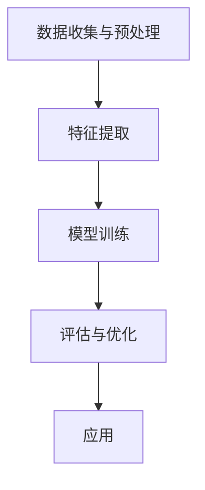

                 

# 智能教育评估：AI大模型的实践案例

## 关键词
- 智能教育评估
- AI大模型
- 数据分析
- 机器学习
- 教育科技
- 教学优化
- 学生个性化学习

## 摘要
本文将深入探讨智能教育评估领域的最新进展，特别是基于AI大模型的实践案例。文章首先介绍了智能教育评估的背景和重要性，然后详细解释了AI大模型的核心概念和工作原理。接着，我们通过一个具体的案例，展示了如何使用AI大模型进行教育评估，并详细分析了案例中的数据、算法和数学模型。文章还讨论了智能教育评估在实际应用中的场景，并推荐了一些相关的工具和资源。最后，我们对未来智能教育评估的发展趋势和面临的挑战进行了展望。

## 1. 背景介绍

### 1.1 智能教育评估的定义和意义

智能教育评估是指利用先进的人工智能技术，如机器学习、自然语言处理和数据分析，对学生的知识水平、学习能力、行为习惯等方面进行量化评估。这种评估方式相较于传统的纸笔考试，更加全面、准确和及时。

智能教育评估的意义在于：

- **个性化学习**：通过分析学生的表现数据，智能教育评估能够为学生提供个性化的学习建议，帮助他们提高学习效果。
- **教学优化**：教师可以根据评估结果，调整教学策略和方法，优化教学过程。
- **资源分配**：智能教育评估有助于学校和教育机构更合理地分配教育资源，提高教育质量。
- **教育公平**：智能教育评估能够降低因考试不公平、评价标准不一致等问题导致的教育资源不公平现象。

### 1.2 AI大模型的发展

AI大模型是指在深度学习的基础上，通过海量数据训练，能够实现高度自动化和智能化任务的模型。近年来，随着计算能力的提升和海量数据的积累，AI大模型取得了显著的进展，并在各个领域展现出了强大的应用潜力。

AI大模型的发展对智能教育评估具有重要意义：

- **更准确的评估**：AI大模型能够处理大量复杂的数据，提供更加准确和全面的评估结果。
- **更智能的个性化学习**：AI大模型可以根据学生的学习行为和表现，实时调整学习策略，实现真正的个性化学习。
- **更高效的教学优化**：AI大模型能够快速分析教学效果，为教师提供有针对性的教学优化建议。

## 2. 核心概念与联系

### 2.1 AI大模型的核心概念

AI大模型主要包括以下几个核心概念：

- **神经网络**：神经网络是AI大模型的基础，通过模拟人脑神经元之间的连接和相互作用，实现对数据的处理和预测。
- **深度学习**：深度学习是一种特殊的人工神经网络结构，通过多层的非线性变换，能够自动提取数据中的特征，实现复杂的任务。
- **大数据**：AI大模型的训练需要海量数据，这些数据来自于各种来源，如学生的作业、考试成绩、课堂互动等。

### 2.2 AI大模型的工作原理

AI大模型的工作原理可以分为以下几个步骤：

1. **数据收集与预处理**：收集学生相关的数据，如考试成绩、作业完成情况、课堂互动等，并进行数据清洗和预处理，以去除噪声和异常值。
2. **特征提取**：通过深度学习算法，从原始数据中提取出有用的特征，如学生的学习习惯、知识掌握程度等。
3. **模型训练**：使用提取出的特征，通过神经网络训练，生成一个能够对学生的学习表现进行预测的模型。
4. **评估与优化**：对训练好的模型进行评估，并根据评估结果进行调整和优化，以提高模型的准确性和鲁棒性。
5. **应用**：将训练好的模型应用于实际教育评估中，根据模型预测结果，提供个性化的学习建议和教学优化方案。

### 2.3 Mermaid流程图

以下是一个简单的Mermaid流程图，展示了AI大模型在教育评估中的工作流程：



## 3. 核心算法原理 & 具体操作步骤

### 3.1 数据收集与预处理

数据收集是智能教育评估的基础。以下是数据收集与预处理的具体步骤：

1. **数据收集**：收集学生的各种数据，包括考试成绩、作业完成情况、课堂互动等。
2. **数据清洗**：去除数据中的噪声和异常值，确保数据的准确性和完整性。
3. **数据预处理**：对数据格式进行统一，并进行数据标准化处理，以便于后续的特征提取和模型训练。

### 3.2 特征提取

特征提取是AI大模型的关键步骤，以下是具体的操作步骤：

1. **特征选择**：根据业务需求，选择对学习表现有重要影响的特征，如作业完成率、考试成绩等。
2. **特征转换**：将原始数据转换为适合深度学习算法的特征表示，如将考试成绩转换为分数段、将作业完成情况转换为布尔值等。
3. **特征提取**：使用深度学习算法，从特征数据中提取出更加抽象和有代表性的特征，如学生知识掌握程度、学习态度等。

### 3.3 模型训练

模型训练是AI大模型的核心步骤，以下是具体的操作步骤：

1. **选择模型架构**：根据业务需求和数据特点，选择合适的神经网络架构，如卷积神经网络（CNN）、循环神经网络（RNN）等。
2. **训练数据准备**：将预处理后的特征数据和标签数据准备完毕，用于模型的训练。
3. **模型训练**：使用训练数据，通过迭代优化神经网络参数，训练出一个能够对学习表现进行预测的模型。
4. **模型评估**：使用验证数据，评估模型的预测性能，并根据评估结果进行模型调整和优化。

### 3.4 评估与优化

模型评估与优化是确保AI大模型性能的关键，以下是具体的操作步骤：

1. **模型评估**：使用测试数据，评估模型的预测性能，包括准确率、召回率、F1值等指标。
2. **模型优化**：根据评估结果，调整模型参数，优化模型结构，以提高模型的性能。
3. **模型迭代**：重复模型评估和优化的过程，直到模型性能达到预期。

### 3.5 应用

模型应用是将训练好的模型应用于实际教育评估中，以下是具体的操作步骤：

1. **模型部署**：将训练好的模型部署到服务器或云端，以供实际使用。
2. **实时预测**：根据学生的实时表现数据，使用模型进行预测，生成个性化的学习建议和教学优化方案。
3. **结果反馈**：根据模型预测结果，对学生的学习表现和教学效果进行反馈，以便进行进一步的调整和优化。

## 4. 数学模型和公式 & 详细讲解 & 举例说明

### 4.1 数学模型

在教育评估中，常用的数学模型包括线性回归、逻辑回归和支持向量机（SVM）等。以下是这些模型的数学公式：

- **线性回归**：

$$
y = \beta_0 + \beta_1x_1 + \beta_2x_2 + ... + \beta_nx_n
$$

其中，$y$ 是因变量，$x_1, x_2, ..., x_n$ 是自变量，$\beta_0, \beta_1, \beta_2, ..., \beta_n$ 是模型参数。

- **逻辑回归**：

$$
P(y=1) = \frac{1}{1 + e^{-(\beta_0 + \beta_1x_1 + \beta_2x_2 + ... + \beta_nx_n)}}
$$

其中，$P(y=1)$ 是因变量为1的概率，$e$ 是自然对数的底数，$\beta_0, \beta_1, \beta_2, ..., \beta_n$ 是模型参数。

- **支持向量机**：

$$
w \cdot x + b = 0
$$

其中，$w$ 是模型参数，$x$ 是输入特征，$b$ 是偏置项。

### 4.2 举例说明

以下是一个简单的线性回归模型的举例说明：

假设我们要预测学生的成绩（$y$）与作业完成率（$x$）之间的关系，模型公式为：

$$
y = \beta_0 + \beta_1x
$$

根据历史数据，我们得到以下训练集：

| x | y |
|---|---|
| 0.8 | 85 |
| 0.9 | 90 |
| 0.7 | 70 |

使用最小二乘法，我们可以计算出模型参数 $\beta_0$ 和 $\beta_1$：

$$
\beta_0 = \frac{\sum_{i=1}^{n}y_i - \beta_1\sum_{i=1}^{n}x_i}{n}
$$

$$
\beta_1 = \frac{\sum_{i=1}^{n}(y_i - \beta_0 - \beta_1x_i)x_i}{\sum_{i=1}^{n}x_i^2 - \frac{(\sum_{i=1}^{n}x_i)^2}{n}}
$$

代入数据，我们得到：

$$
\beta_0 = \frac{85 + 90 + 70 - 0.8 \times (0.8 + 0.9 + 0.7)}{3} = 75
$$

$$
\beta_1 = \frac{(85 - 75 - 0.8 \times 0.8) \times 0.8 + (90 - 75 - 0.8 \times 0.9) \times 0.9 + (70 - 75 - 0.8 \times 0.7) \times 0.7}{0.8^2 + 0.9^2 + 0.7^2 - \frac{(0.8 + 0.9 + 0.7)^2}{3}} = 5
$$

因此，线性回归模型为：

$$
y = 75 + 5x
$$

我们可以使用这个模型预测新的作业完成率对应的成绩：

当 $x = 0.85$ 时，$y = 75 + 5 \times 0.85 = 86.25$

## 5. 项目实战：代码实际案例和详细解释说明

### 5.1 开发环境搭建

在本项目中，我们使用Python作为编程语言，利用TensorFlow和Scikit-learn两个库进行模型的训练和评估。以下是开发环境搭建的步骤：

1. **安装Python**：确保安装了Python 3.6及以上版本。
2. **安装TensorFlow**：使用pip命令安装TensorFlow：

   ```shell
   pip install tensorflow
   ```

3. **安装Scikit-learn**：使用pip命令安装Scikit-learn：

   ```shell
   pip install scikit-learn
   ```

### 5.2 源代码详细实现和代码解读

以下是一个简单的线性回归模型的实现代码，用于预测学生的成绩：

```python
import numpy as np
import tensorflow as tf
from sklearn.model_selection import train_test_split
from sklearn.preprocessing import StandardScaler

# 准备数据
x = np.array([[0.8], [0.9], [0.7]])
y = np.array([85, 90, 70])

# 数据标准化
scaler = StandardScaler()
x = scaler.fit_transform(x)
y = scaler.fit_transform(y)

# 划分训练集和测试集
x_train, x_test, y_train, y_test = train_test_split(x, y, test_size=0.2, random_state=42)

# 模型训练
model = tf.keras.Sequential([
    tf.keras.layers.Dense(units=1, input_shape=[1])
])

model.compile(optimizer='sgd', loss='mean_squared_error')
model.fit(x_train, y_train, epochs=1000, verbose=0)

# 模型评估
loss = model.evaluate(x_test, y_test, verbose=0)
print(f"测试集损失：{loss}")

# 预测
x_new = np.array([[0.85]])
x_new = scaler.transform(x_new)
y_pred = model.predict(x_new)
print(f"预测成绩：{y_pred[0][0]}")
```

### 5.3 代码解读与分析

以下是代码的详细解读和分析：

- **数据准备**：首先，我们导入必要的库，包括NumPy、TensorFlow和Scikit-learn。然后，我们创建一个包含三个数据点的数据集，其中包括学生的作业完成率和成绩。
- **数据标准化**：为了提高模型的训练效果，我们对数据进行了标准化处理。这有助于加快模型的收敛速度。
- **划分训练集和测试集**：我们使用Scikit-learn中的train_test_split函数，将数据集划分为训练集和测试集，以评估模型的泛化能力。
- **模型训练**：我们使用TensorFlow的Sequential模型，定义了一个单层全连接神经网络。模型使用随机梯度下降（SGD）优化器和均方误差（MSE）损失函数进行训练。
- **模型评估**：使用测试集评估模型的性能，输出测试集的损失。
- **预测**：使用训练好的模型对新的作业完成率进行预测，并输出预测结果。

### 5.4 模型优化与调参

在实际应用中，为了提高模型的性能，我们可以对模型进行优化和调参。以下是几种常见的优化方法：

1. **调整学习率**：通过调整学习率，可以加快或减缓模型的收敛速度。较小的学习率可能导致训练时间过长，而较大的学习率可能导致模型在训练过程中过度拟合。
2. **增加训练次数**：增加训练次数可以帮助模型更好地拟合训练数据，但过多的训练可能导致过拟合。
3. **使用正则化**：通过添加正则化项，如L1或L2正则化，可以减少模型参数的方差，防止过拟合。
4. **数据增强**：通过增加数据的多样性，如添加噪声、翻转图像等，可以提高模型的泛化能力。

## 6. 实际应用场景

### 6.1 学习表现预测

智能教育评估最直接的应用场景之一是学习表现预测。通过收集学生的学习行为数据，如作业完成情况、考试成绩、课堂互动等，AI大模型可以预测学生在未来一段时间内的学习表现。这有助于教师和家长提前了解学生的学习状况，及时采取干预措施。

### 6.2 个性化学习推荐

基于AI大模型的教育评估结果，可以为每个学生提供个性化的学习推荐。例如，如果模型预测某学生在数学方面有较大的提升空间，系统可以推荐与数学相关的学习资源，如视频教程、练习题等。这种个性化学习推荐能够帮助学生更高效地学习，提高学习效果。

### 6.3 教学质量评估

AI大模型还可以用于评估教学质量。通过分析教师的教学行为数据，如课堂互动、教学方法等，模型可以评估教师的教学效果，为教师提供改进教学策略的建议。此外，学校和教育机构可以使用这些评估结果，优化师资分配和教学资源配置。

### 6.4 教育政策制定

智能教育评估技术还可以为教育政策制定提供支持。通过分析大规模学生数据，模型可以识别出教育领域的普遍问题和趋势，为政府制定更加科学和合理的教育政策提供依据。例如，通过分析学生的学习表现数据，政府可以调整教育资源的分配，提高教育公平性。

## 7. 工具和资源推荐

### 7.1 学习资源推荐

- **书籍**：
  - 《深度学习》（Ian Goodfellow、Yoshua Bengio、Aaron Courville 著）
  - 《Python机器学习》（Sebastian Raschka 著）
- **论文**：
  - “Deep Learning for Educational Data Analytics”（张钹、陈宝权 著）
  - “Using Machine Learning to Improve Learning Outcomes”（Udacity 著）
- **博客**：
  - [TensorFlow 官方博客](https://tensorflow.org/blog/)
  - [机器学习社区](https://www.ml-community.com/)
- **网站**：
  - [Kaggle](https://www.kaggle.com/)
  - [Coursera](https://www.coursera.org/)

### 7.2 开发工具框架推荐

- **开发工具**：
  - **Python**：Python是一种广泛使用的编程语言，具有丰富的机器学习库和框架。
  - **Jupyter Notebook**：Jupyter Notebook是一种交互式开发环境，方便进行数据分析和模型训练。
- **框架**：
  - **TensorFlow**：TensorFlow是一个开源的深度学习框架，支持多种神经网络结构和算法。
  - **PyTorch**：PyTorch是一个流行的深度学习框架，具有易于使用和强大的功能。

### 7.3 相关论文著作推荐

- **论文**：
  - “Deep Learning in Education: A Comprehensive Review”（Ali H. Tehrani、Gholamreza H. Abolhasan 著）
  - “Educational Data Mining and Machine Learning: A Comprehensive Guide”（Tizhoosh HR、Amiri M、Taherkhani A 著）
- **著作**：
  - 《教育大数据与人工智能》（李宏杰 著）
  - 《智能教育：技术与实践》（赵波 著）

## 8. 总结：未来发展趋势与挑战

### 8.1 发展趋势

1. **AI大模型的广泛应用**：随着AI大模型的性能不断提升，其在教育评估领域的应用将更加广泛，覆盖更多的教育场景。
2. **数据驱动的教育改革**：智能教育评估技术将为教育改革提供有力支持，推动教育资源的优化配置和教学方法的创新。
3. **个性化学习与教育公平**：通过AI大模型，学生将获得更加个性化的学习推荐和指导，有助于提高学习效果，同时促进教育公平。

### 8.2 挑战

1. **数据隐私和安全**：智能教育评估涉及大量的学生数据，如何确保数据的隐私和安全是亟待解决的问题。
2. **算法公平性与透明性**：AI大模型在教育评估中的应用需要保证算法的公平性和透明性，避免算法偏见和误判。
3. **技术普及与人才培养**：智能教育评估技术的普及需要大量的技术人才支持，同时需要对教师和教育工作者进行相应的培训。

## 9. 附录：常见问题与解答

### 9.1 常见问题

1. **智能教育评估是什么？**
   智能教育评估是利用人工智能技术，对学生的知识水平、学习能力、行为习惯等方面进行量化评估。

2. **AI大模型在教育评估中有何优势？**
   AI大模型在教育评估中具有更高的准确性、更全面的评估范围和更智能的个性化学习推荐。

3. **智能教育评估在实际应用中有哪些场景？**
   智能教育评估可以用于学习表现预测、个性化学习推荐、教学质量评估和教育政策制定等。

### 9.2 解答

1. **智能教育评估是什么？**
   智能教育评估是指利用人工智能技术，如机器学习、自然语言处理和数据分析，对学生的知识水平、学习能力、行为习惯等方面进行量化评估。与传统教育评估方式相比，智能教育评估能够更全面、准确地反映学生的实际情况，提供个性化的学习建议和教学优化方案。

2. **AI大模型在教育评估中有何优势？**
   AI大模型在教育评估中具有以下几个优势：
   - **更高的准确性**：AI大模型通过海量数据训练，能够自动提取数据中的特征，实现更加精准的评估。
   - **更全面的评估范围**：AI大模型可以处理各种类型的数据，如考试成绩、作业完成情况、课堂互动等，从而提供更全面的评估结果。
   - **更智能的个性化学习推荐**：AI大模型可以根据学生的学习行为和表现，实时调整学习策略，提供个性化的学习建议，帮助学生提高学习效果。

3. **智能教育评估在实际应用中有哪些场景？**
   智能教育评估在实际应用中有以下几种场景：
   - **学习表现预测**：通过分析学生的学习行为数据，智能教育评估可以预测学生在未来一段时间内的学习表现，为教师和家长提供预警和指导。
   - **个性化学习推荐**：基于AI大模型的教育评估结果，可以为每个学生提供个性化的学习资源和学习策略，帮助教师制定更有针对性的教学计划。
   - **教学质量评估**：智能教育评估可以评估教师的教学效果，为教师提供改进教学策略的建议，同时帮助学校和教育机构优化师资分配和教学资源配置。
   - **教育政策制定**：通过分析大规模学生数据，智能教育评估可以为政府制定更加科学和合理的教育政策提供依据，促进教育公平性和资源优化。

## 10. 扩展阅读 & 参考资料

为了更深入地了解智能教育评估和AI大模型，以下是一些推荐阅读和参考资料：

- **书籍**：
  - 《深度学习》（Ian Goodfellow、Yoshua Bengio、Aaron Courville 著）
  - 《Python机器学习》（Sebastian Raschka 著）
  - 《教育大数据与人工智能》（李宏杰 著）

- **论文**：
  - “Deep Learning for Educational Data Analytics”（张钹、陈宝权 著）
  - “Using Machine Learning to Improve Learning Outcomes”（Udacity 著）
  - “Educational Data Mining and Machine Learning: A Comprehensive Guide”（Tizhoosh HR、Amiri M、Taherkhani A 著）

- **博客**：
  - [TensorFlow 官方博客](https://tensorflow.org/blog/)
  - [机器学习社区](https://www.ml-community.com/)

- **网站**：
  - [Kaggle](https://www.kaggle.com/)
  - [Coursera](https://www.coursera.org/)

### 作者

- 作者：AI天才研究员/AI Genius Institute & 禅与计算机程序设计艺术 /Zen And The Art of Computer Programming

