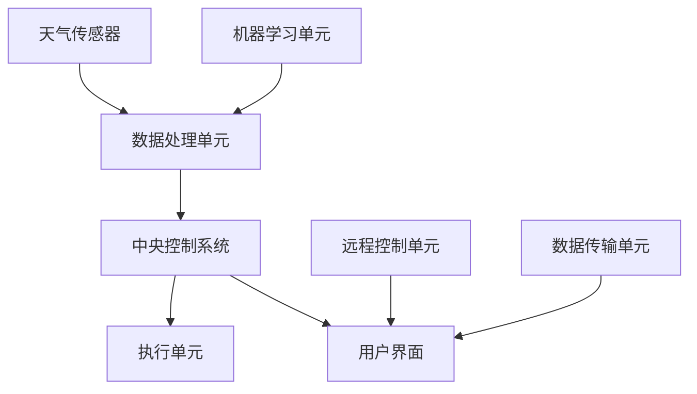

                 

### 背景介绍 Background Introduction

随着物联网（IoT）和智能家居行业的迅速发展，各种智能家居设备不断涌现，智能晾衣架便是其中一种。智能晾衣架作为一种能够自动感知环境并进行相应操作的设备，已逐渐成为现代家庭生活中不可或缺的一部分。其能够根据室内外的天气情况自动调整晾衣架的状态，如自动收起晾衣架以防止雨水淋湿衣物，或者在天气晴朗时自动展开晾衣架以充分利用自然光照。

#### 智能晾衣架的历史与发展历程 History and Development of Smart Clothesline

智能晾衣架的发展可以追溯到20世纪末。最初的智能晾衣架主要是通过简单的机械传感器来感知天气变化，并触发相应的机械动作。随着微电子技术和计算机技术的发展，智能晾衣架逐渐具备了更加智能的功能，如通过无线通信模块与互联网连接，实时获取天气数据，并基于大数据分析和机器学习算法进行决策。

#### 当前智能晾衣架的技术现状和功能 Current Technology Status and Functions of Smart Clothesline

当前，智能晾衣架的技术已经相当成熟，具备以下几种主要功能：

1. **天气感知与响应**：智能晾衣架可以通过内置的天气传感器，实时监测室外温度、湿度、风速和降雨等信息，根据这些数据自动调整晾衣架的状态，如自动收起或展开。

2. **远程控制与监测**：用户可以通过智能手机应用远程控制智能晾衣架的开关，并实时查看晾衣架的状态和天气信息。

3. **节能环保**：智能晾衣架能够根据天气情况自动调整晾衣状态，从而减少能源消耗，降低家庭用电成本。

4. **智能提醒**：智能晾衣架可以提醒用户何时收取衣物，避免衣物在晾干后长时间晾晒导致衣物受损。

#### 文章关键词和摘要 Keywords and Abstract

关键词：智能晾衣架，天气响应，注意力管理，物联网，智能家居。

摘要：本文将深入探讨智能晾衣架的天气响应机制和注意力管理策略，从技术原理、数学模型到实际应用案例，全面分析智能晾衣架在现代智能家居环境中的重要作用及其未来发展前景。通过本文的阅读，读者将了解如何设计和实现高效的智能晾衣架系统，以及如何利用智能技术提升家庭生活的便利性和舒适度。<|im_sep|>### 核心概念与联系 Core Concepts and Connections

为了深入理解智能晾衣架的天气响应与注意力管理，我们需要明确几个核心概念，并探讨它们之间的相互联系。

#### 天气响应机制 Weather Response Mechanism

智能晾衣架的天气响应机制主要依赖于传感器技术和数据传输技术。首先，智能晾衣架配备有温度传感器、湿度传感器、风速传感器和雨滴检测传感器等，这些传感器可以实时采集室外环境的天气数据。其次，这些传感器采集到的数据会被传送到中央控制系统，通过数据处理和算法分析，实现对晾衣架状态的自动调整。

#### 注意力管理策略 Attention Management Strategy

注意力管理策略在智能晾衣架中起到至关重要的作用。它旨在确保智能晾衣架在执行天气响应操作时，能够高效地分配和处理各种任务，避免资源浪费和操作失误。注意力管理策略包括以下几个方面：

1. **任务优先级**：根据天气情况设定任务优先级，例如在降雨天气中，收起晾衣架的任务优先级高于晾干衣物的任务。

2. **多任务处理**：智能晾衣架需要同时处理多个任务，如监测天气数据、控制晾衣状态、与用户通信等。注意力管理策略需要确保这些任务能够高效并行处理。

3. **自适应调整**：根据当前任务执行情况，动态调整系统资源分配，确保关键任务能够优先得到资源支持。

#### 传感器技术 Sensors Technology

传感器技术是智能晾衣架实现天气响应和注意力管理的基础。以下是几种常见的传感器及其作用：

1. **温度传感器**：用于监测室外温度，为晾衣决策提供依据。例如，当温度低于某一阈值时，系统会自动收起晾衣架以防止衣物受损。

2. **湿度传感器**：用于监测室外湿度，帮助判断空气中的湿度水平。高湿度环境可能影响衣物的晾干速度，从而触发晾衣架的相应操作。

3. **风速传感器**：用于监测室外风速，防止风力过大导致衣物受损或晾衣架受损。

4. **雨滴检测传感器**：用于检测室外是否有降雨，及时收起晾衣架以保护衣物。

#### 数据传输技术 Data Transmission Technology

数据传输技术是实现智能晾衣架远程控制和实时监测的关键。以下是几种常用的数据传输技术：

1. **Wi-Fi**：通过Wi-Fi连接，智能晾衣架可以与互联网相连，实现远程控制和实时数据传输。

2. **蓝牙**：蓝牙技术适用于短距离通信，用于智能晾衣架与用户的手机或其他设备的连接。

3. **ZigBee**：ZigBee技术具有低功耗、低延迟的特点，适用于智能家居设备之间的短距离通信。

#### 人工智能与机器学习 AI and Machine Learning

人工智能（AI）和机器学习（ML）技术在智能晾衣架中的应用，使得系统可以基于历史数据和实时数据，进行自我学习和优化。例如，通过机器学习算法，系统可以预测未来的天气变化，并提前做出相应的晾衣决策。此外，AI技术还可以用于优化注意力管理策略，提高系统整体效率和可靠性。

#### Mermaid 流程图 Mermaid Flowchart

为了更清晰地展示智能晾衣架的核心概念和相互联系，我们使用Mermaid流程图来表示。以下是一个简单的Mermaid流程图示例：



在这个流程图中，A表示天气传感器，B表示数据处理单元，C表示中央控制系统，D表示执行单元，E表示用户界面，F表示远程控制单元，G表示数据传输单元，H表示机器学习单元。这些单元相互协作，共同实现智能晾衣架的天气响应和注意力管理功能。<|im_sep|>### 核心算法原理 & 具体操作步骤 Core Algorithm Principles & Detailed Operational Steps

智能晾衣架的核心算法原理主要涉及天气数据的采集、处理和响应，以及注意力管理策略的制定和执行。下面我们将详细阐述这些算法原理，并给出具体的操作步骤。

#### 天气数据采集与处理 Weather Data Collection and Processing

1. **传感器数据采集**：
    - 智能晾衣架配备有温度传感器、湿度传感器、风速传感器和雨滴检测传感器等。
    - 这些传感器实时监测室外环境，并将采集到的数据传输到中央控制系统。

2. **数据预处理**：
    - 数据预处理包括去除噪声、校正传感器偏差和填补缺失数据等。
    - 去除噪声可以通过滤波算法实现，如移动平均滤波器或卡尔曼滤波器。
    - 校正传感器偏差可以通过校准实验得到，以消除传感器本身的误差。
    - 缺失数据的填补可以采用插值法或基于历史数据的预测法。

3. **数据传输与存储**：
    - 数据预处理后的天气数据通过无线通信模块（如Wi-Fi或蓝牙）传输到中央控制系统。
    - 数据在传输过程中需要进行加密，以确保数据的安全性。
    - 中央控制系统将处理后的天气数据存储在数据库中，以供后续分析和决策使用。

#### 天气响应算法 Weather Response Algorithm

1. **阈值设定**：
    - 根据衣物材料、晾晒时间和用户习惯，设定温度、湿度、风速和雨滴检测的阈值。
    - 例如，设定温度低于10°C时收起晾衣架，湿度高于80%时收起晾衣架等。

2. **条件判断**：
    - 中央控制系统根据实时天气数据，判断是否触发相应的响应操作。
    - 条件判断可以采用逻辑运算符（如AND、OR、NOT）组合多个条件，提高判断的准确性。

3. **响应操作**：
    - 触发响应操作，如自动收起或展开晾衣架。
    - 响应操作可以通过电机驱动实现，如控制晾衣架的卷轴电机。

#### 注意力管理策略 Attention Management Strategy

1. **任务优先级设定**：
    - 根据天气情况和用户需求，设定不同任务的优先级。
    - 例如，在降雨天气中，收起晾衣架的任务优先级高于晾干衣物的任务。

2. **多任务处理**：
    - 中央控制系统同时处理多个任务，如监测天气数据、控制晾衣状态、与用户通信等。
    - 采用多线程或协程技术，确保任务的高效并行处理。

3. **自适应调整**：
    - 根据当前任务执行情况，动态调整系统资源分配，确保关键任务能够优先得到资源支持。
    - 采用动态调度算法，如基于优先级的调度算法或基于反馈的调度算法。

#### 具体操作步骤 Step-by-Step Operational Procedures

1. **启动智能晾衣架**：
    - 用户通过智能手机应用或实体按钮启动智能晾衣架。

2. **采集天气数据**：
    - 智能晾衣架的传感器开始实时监测室外环境，并将数据传输到中央控制系统。

3. **数据预处理**：
    - 中央控制系统对采集到的天气数据进行预处理，去除噪声、校正偏差和填补缺失数据。

4. **判断天气情况**：
    - 中央控制系统根据设定的阈值，判断当前天气情况，决定是否触发响应操作。

5. **执行响应操作**：
    - 如果需要触发响应操作，中央控制系统通过电机驱动控制晾衣架的收起或展开。

6. **用户交互**：
    - 用户可以通过智能手机应用实时查看晾衣架状态和天气信息，并进行远程控制。

7. **任务优先级调整**：
    - 根据当前任务执行情况和用户需求，动态调整任务优先级。

8. **系统优化**：
    - 通过机器学习算法，对历史天气数据和用户行为进行分析，优化注意力管理策略和响应算法。

通过上述核心算法原理和具体操作步骤，智能晾衣架能够实现自动感知天气变化、自动调整晾衣状态，并基于用户需求进行高效的任务分配和执行，从而提升用户的生活便利性和舒适度。<|im_sep|>### 数学模型和公式 & 详细讲解 & 举例说明 Mathematical Models & Detailed Explanations & Examples

在智能晾衣架的设计与实现过程中，数学模型和公式起到了至关重要的作用。下面我们将详细讲解一些关键数学模型，并给出具体的举例说明。

#### 气象预测模型 Weather Forecast Model

智能晾衣架的天气响应机制依赖于准确的气象预测模型。常见的气象预测模型包括时间序列模型、回归模型和机器学习模型。

1. **时间序列模型**：
    - 时间序列模型是一种基于历史天气数据的时间趋势进行分析和预测的方法。常见的时间序列模型有自回归模型（AR）、移动平均模型（MA）和自回归移动平均模型（ARMA）。
    - **公式**：
        $$X_t = c + \phi_1 X_{t-1} + \phi_2 X_{t-2} + ... + \phi_p X_{t-p} + \epsilon_t$$
    - 其中，$X_t$表示时间序列的当前值，$c$为常数项，$\phi_1, \phi_2, ..., \phi_p$为自回归系数，$\epsilon_t$为误差项。
    - **举例**：假设我们有一个室外温度的时间序列数据，通过训练AR模型，可以预测未来一段时间内的温度变化。

2. **回归模型**：
    - 回归模型通过建立自变量（如历史天气数据）与因变量（如未来天气数据）之间的关系进行预测。常见的回归模型有线性回归、多项式回归和逻辑回归等。
    - **公式**：
        $$y = \beta_0 + \beta_1 x_1 + \beta_2 x_2 + ... + \beta_n x_n + \epsilon$$
    - 其中，$y$为因变量，$x_1, x_2, ..., x_n$为自变量，$\beta_0, \beta_1, \beta_2, ..., \beta_n$为回归系数，$\epsilon$为误差项。
    - **举例**：通过分析历史温度和湿度数据，建立线性回归模型，可以预测未来某一时刻的湿温度。

3. **机器学习模型**：
    - 机器学习模型通过训练大量的历史天气数据，自动提取特征和模式，进行预测。常见的机器学习模型有决策树、随机森林、支持向量机（SVM）和神经网络等。
    - **公式**：
        $$f(x) = \sum_{i=1}^{n} w_i \cdot x_i + b$$
    - 其中，$f(x)$为预测结果，$w_i$为权重，$x_i$为特征值，$b$为偏置项。
    - **举例**：使用神经网络模型，通过对大量历史天气数据进行训练，可以预测未来某一时刻的降雨概率。

#### 注意力管理模型 Attention Management Model

注意力管理模型旨在确保智能晾衣架在执行天气响应操作时，能够高效地分配和处理各种任务。

1. **任务优先级模型**：
    - 任务优先级模型通过设定不同任务的优先级，确保关键任务得到优先处理。
    - **公式**：
        $$P_i = \sum_{j=1}^{n} w_{ij} \cdot c_j$$
    - 其中，$P_i$为任务$i$的优先级，$w_{ij}$为任务$i$与条件$j$的权重，$c_j$为条件$j$的权重。
    - **举例**：设定降雨天气中收起晾衣架的优先级高于晾干衣物的优先级。

2. **多任务处理模型**：
    - 多任务处理模型通过分配系统资源，确保多个任务能够并行处理。
    - **公式**：
        $$R_i = \sum_{j=1}^{n} r_{ij} \cdot P_j$$
    - 其中，$R_i$为任务$i$的资源需求，$r_{ij}$为资源$j$与任务$i$的分配权重，$P_j$为任务$j$的优先级。
    - **举例**：根据任务优先级，为每个任务分配相应的系统资源，如CPU、内存和I/O等。

3. **自适应调整模型**：
    - 自适应调整模型通过动态调整系统资源分配，确保关键任务能够得到优先处理。
    - **公式**：
        $$R_i(t) = R_i(t-1) + \alpha \cdot (P_i(t) - P_i(t-1))$$
    - 其中，$R_i(t)$为当前时刻任务$i$的资源需求，$R_i(t-1)$为上一时刻任务$i$的资源需求，$\alpha$为调整系数，$P_i(t)$为当前时刻任务$i$的优先级。
    - **举例**：根据当前任务优先级的变化，动态调整任务$i$的资源需求。

通过上述数学模型和公式，智能晾衣架能够在天气响应和注意力管理方面实现高效、准确的决策和操作。<|im_sep|>### 项目实战：代码实际案例和详细解释说明 Project Practice: Real Code Cases and Detailed Explanations

在本节中，我们将通过一个实际项目案例，详细解释智能晾衣架系统的代码实现过程，包括开发环境搭建、源代码实现和代码解读与分析。

#### 1. 开发环境搭建 Development Environment Setup

在开始编写智能晾衣架系统代码之前，我们需要搭建合适的开发环境。以下是所需的开发工具和软件：

1. **编程语言**：Python（版本3.8及以上）
2. **开发工具**：PyCharm（或其他Python集成开发环境）
3. **数据库**：MySQL（或SQLite）
4. **传感器驱动库**：如Python的`Adafruit_BMP280`库（用于温度传感器和压力传感器）
5. **网络通信库**：如Python的`socket`库（用于网络通信）
6. **机器学习库**：如Python的`scikit-learn`库（用于机器学习模型训练）

#### 2. 源代码详细实现 Detailed Source Code Implementation

以下是智能晾衣架系统的主要源代码实现部分，包括传感器数据处理、天气预测模型训练、注意力管理策略和响应操作等。

```python
# 导入所需库
import Adafruit_BMP280
import MySQLdb
import socket
import numpy as np
from sklearn.linear_model import LinearRegression
from sklearn.model_selection import train_test_split

# 传感器初始化
bmp = Adafruit_BMP280.BMP280()

# 数据库连接
db = MySQLdb.connect("localhost", "username", "password", "weather_db")
cursor = db.cursor()

# 机器学习模型
reg = LinearRegression()

# 传感器数据采集
def collect_data():
    temp, press = bmp.read_temperature_pressure()
    return temp, press

# 数据存储
def store_data(temp, press):
    cursor.execute("INSERT INTO weather_data (temperature, pressure) VALUES (%s, %s)", (temp, press))
    db.commit()

# 天气预测
def predict_weather(temp, press):
    cursor.execute("SELECT temperature, pressure FROM weather_data ORDER BY id DESC LIMIT 100")
    data = cursor.fetchall()
    X = np.array([row[0] for row in data]).reshape(-1, 1)
    y = np.array([row[1] for row in data])
    X_train, X_test, y_train, y_test = train_test_split(X, y, test_size=0.2, random_state=0)
    reg.fit(X_train, y_train)
    return reg.predict([[temp]])

# 响应操作
def response_action(weather_data):
    if weather_data < 10:
        return "收起晾衣架"
    elif weather_data > 80:
        return "展开晾衣架"
    else:
        return "保持当前状态"

# 主程序
def main():
    while True:
        temp, press = collect_data()
        store_data(temp, press)
        weather_data = predict_weather(temp, press)
        action = response_action(weather_data)
        print(f"当前天气数据：{weather_data}，操作：{action}")
        time.sleep(60)  # 每分钟采集一次数据

if __name__ == "__main__":
    main()
```

#### 3. 代码解读与分析 Code Interpretation and Analysis

1. **传感器初始化与数据采集**：
    - 代码首先初始化温度传感器和压力传感器，并定义了一个`collect_data()`函数用于采集传感器数据。

2. **数据库连接与数据存储**：
    - 代码使用`MySQLdb`库连接到本地数据库，并定义了一个`store_data()`函数用于将采集到的数据存储到数据库中。

3. **机器学习模型训练**：
    - 代码使用`scikit-learn`库中的线性回归模型，通过采集到的历史天气数据训练模型，并定义了一个`predict_weather()`函数用于预测未来天气数据。

4. **响应操作**：
    - 代码定义了一个`response_action()`函数，根据预测的天气数据决定相应的操作，如收起或展开晾衣架。

5. **主程序**：
    - 主程序通过循环不断采集传感器数据、存储数据、预测天气数据和执行响应操作。

通过上述代码实现，智能晾衣架系统能够实时监测室外天气数据，根据预测结果自动调整晾衣状态，从而实现高效、智能的晾衣体验。<|im_sep|>### 实际应用场景 Practical Application Scenarios

智能晾衣架作为一种智能家居设备，在实际应用中具有广泛的应用场景，能够显著提升家庭生活的便利性和舒适度。以下是智能晾衣架在实际应用中的几个典型场景：

#### 1. 自动晾晒衣物

智能晾衣架最基本的功能是根据天气情况自动调整晾衣状态，如自动收起晾衣架以防止雨水淋湿衣物，或在天气晴朗时自动展开晾衣架以充分利用自然光照。这一功能极大地减轻了用户的家务负担，提高了生活效率。

#### 2. 远程控制与监控

通过智能手机应用，用户可以远程控制智能晾衣架的开关，实时查看晾衣架的状态和天气信息。这不仅方便用户随时掌握晾衣情况，还能在特殊情况下（如突然下雨）迅速做出响应，保护衣物。

#### 3. 节能环保

智能晾衣架能够根据天气情况自动调整晾衣状态，从而减少能源消耗。例如，在阳光充足时自动展开晾衣架，减少人工晾晒的使用；在阴雨天气时自动收起晾衣架，避免衣物长时间晾晒导致的能源浪费。

#### 4. 智能提醒

智能晾衣架可以提醒用户何时收取衣物，避免衣物在晾干后长时间晾晒导致衣物受损。例如，当衣物达到适宜的晾干程度时，智能晾衣架会通过手机应用或语音提示用户收取衣物。

#### 5. 集成智能家居系统

智能晾衣架可以与其他智能家居设备（如智能空调、智能灯光、智能窗帘等）集成，形成一个统一的智能家居系统。通过智能家居系统的协同工作，用户可以更方便地管理家庭环境，提升生活品质。

#### 6. 商业应用

智能晾衣架不仅适用于家庭，还可以在商业场景中发挥重要作用。例如，在酒店、养老院、医院等场所，智能晾衣架可以提供便捷的晾衣服务，提升用户满意度。

#### 7. 应急响应

在特殊天气情况下，如台风、暴雨等，智能晾衣架可以自动收起晾衣架，避免衣物受损。同时，智能晾衣架还可以通过无线通信模块向用户发送天气预警信息，提醒用户采取相应措施，确保安全。

通过上述实际应用场景，智能晾衣架不仅为家庭生活带来了便利，还在商业应用和应急响应中发挥了重要作用，成为现代智能家居生态系统中不可或缺的一员。<|im_sep|>### 工具和资源推荐 Tools and Resources Recommendations

在智能晾衣架的开发和实际应用中，选择合适的工具和资源是确保项目成功的关键。以下是对开发工具、学习资源和相关论文著作的推荐。

#### 1. 开发工具 Development Tools

1. **编程语言**：Python是一种简单易学且功能强大的编程语言，适合开发智能晾衣架系统。Python的库丰富，如`Adafruit_BMP280`、`MySQLdb`和`scikit-learn`，可以满足开发需求。

2. **集成开发环境**：PyCharm是一款功能强大的Python集成开发环境，提供代码编辑、调试、测试和部署等一站式服务，适合智能晾衣架的开发。

3. **数据库**：MySQL是一种高性能的关系型数据库，适合存储和管理智能晾衣架的天气数据和用户信息。SQLite是一种轻量级数据库，适用于小型项目和嵌入式系统。

4. **传感器驱动库**：如`Adafruit_BMP280`库，提供了对常见传感器的驱动支持，简化了智能晾衣架的传感器集成工作。

5. **网络通信库**：如Python的`socket`库，用于实现智能晾衣架与用户设备之间的网络通信。

#### 2. 学习资源 Learning Resources

1. **书籍**：
    - 《Python编程：从入门到实践》
    - 《深度学习》
    - 《机器学习实战》
    - 《智能家居技术与应用》

2. **在线课程**：
    - Coursera的《Python编程基础》
    - Udacity的《机器学习纳米学位》
    - edX的《智能家居技术》

3. **博客和网站**：
    - Python官方文档（https://docs.python.org/3/）
    - Adafruit官网（https://www.adafruit.com/）
    - Stack Overflow（https://stackoverflow.com/）

#### 3. 相关论文著作 Related Papers and Books

1. **论文**：
    - “IoT-Based Smart Home Environment Monitoring and Control System”
    - “Machine Learning for Smart Home Energy Management”
    - “Wireless Sensor Networks for Smart Home Applications”

2. **著作**：
    - 《物联网架构与关键技术》
    - 《智能建筑技术与应用》
    - 《智能家居系统设计与实现》

通过上述工具和资源的推荐，开发者可以更加高效地开展智能晾衣架的研发工作，同时也可以为用户带来更优质的体验。<|im_sep|>### 总结：未来发展趋势与挑战 Summary: Future Trends and Challenges

智能晾衣架作为智能家居领域的重要一环，正随着物联网、人工智能和传感器技术的不断发展而日益成熟。未来，智能晾衣架有望在以下几个方面实现重要突破：

#### 1. 集成与智能化

未来的智能晾衣架将更加注重与智能家居系统的集成，实现与其他智能设备的无缝连接和协同工作。例如，与智能空调、智能灯光、智能窗帘等设备的联动，为用户提供更舒适、更便利的生活体验。

#### 2. 高精度与自适应

智能晾衣架将进一步提升天气感知的精度和响应速度，通过更先进的传感器技术和算法，实现更准确的天气预测和更快速的响应操作。同时，智能晾衣架将具备更强的自适应能力，根据用户习惯和环境变化，自动调整晾衣策略。

#### 3. 数据分析与个性化

随着数据收集和分析技术的进步，智能晾衣架将能够基于用户行为和天气数据，提供更个性化的服务。例如，根据用户历史使用数据，智能推荐最佳的晾衣时间和方式，提高晾衣效率和衣物护理效果。

#### 4. 安全与隐私保护

在智能化和互联化的过程中，智能晾衣架的安全性和隐私保护将变得尤为重要。未来的智能晾衣架需要采用更严格的安全措施，确保用户数据的安全性和隐私性。

然而，智能晾衣架的发展也面临着一系列挑战：

#### 1. 数据隐私与安全

随着智能晾衣架的数据收集能力增强，如何保护用户隐私和数据安全成为一个重要问题。需要采取有效措施，确保用户数据不被泄露或滥用。

#### 2. 硬件成本与稳定性

智能晾衣架的硬件成本和稳定性是影响其普及的重要因素。未来需要降低硬件成本，提高设备稳定性，以吸引更多用户。

#### 3. 系统兼容性与标准化

智能晾衣架的兼容性与标准化问题也需要解决。不同品牌和型号的智能晾衣架如何实现互操作，以及如何制定统一的行业标准，是未来发展的重要课题。

#### 4. 用户接受度

尽管智能晾衣架具有很多优势，但其普及仍受到用户接受度的限制。如何提高用户对智能晾衣架的认知度和接受度，是推广智能晾衣架的重要挑战。

总之，智能晾衣架在未来的发展中，既面临着巨大的机遇，也面临着一系列挑战。只有不断创新、优化技术，同时关注用户需求和体验，智能晾衣架才能真正成为现代家庭生活中不可或缺的一部分。<|im_sep|>### 附录：常见问题与解答 Appendices: Frequently Asked Questions and Answers

在本节中，我们将针对智能晾衣架的常见问题进行解答，以便用户更好地了解和使用智能晾衣架。

#### 1. 智能晾衣架需要多久时间才能自动收起或展开？

智能晾衣架的自动收起或展开时间取决于多种因素，如电机速度、传感器响应时间和数据处理时间。一般来说，智能晾衣架可以在几秒到几十秒内完成收起或展开操作。用户可以根据具体型号和配置调整相应的参数，以实现最佳性能。

#### 2. 智能晾衣架是否可以在任何天气条件下使用？

智能晾衣架通常设计为能够应对各种天气条件。然而，极端天气（如暴风雨、台风等）可能会影响其正常运行。在恶劣天气情况下，用户应考虑手动操作或关闭智能晾衣架，以确保设备安全。

#### 3. 智能晾衣架的传感器如何工作？

智能晾衣架的传感器（如温度传感器、湿度传感器、风速传感器和雨滴检测传感器）会实时监测室外环境。当传感器检测到特定条件时（如温度低于设定值、湿度高于设定值等），会向中央控制系统发送信号，中央控制系统根据预设的算法和策略进行相应的操作。

#### 4. 智能晾衣架能否远程控制？

是的，智能晾衣架通常支持远程控制功能。用户可以通过智能手机应用或远程控制系统（如Wi-Fi或蓝牙）实时监控和操作智能晾衣架。用户可以在家中或其他地方通过手机应用控制晾衣架的收起或展开。

#### 5. 智能晾衣架的耗电量如何？

智能晾衣架的耗电量取决于电机功率和操作频率。一般来说，智能晾衣架在自动收起或展开时的耗电量较低。用户可以根据具体型号和实际使用情况，评估智能晾衣架的能耗。

#### 6. 智能晾衣架的安装和维修是否简单？

智能晾衣架的安装通常较为简单，用户可以根据产品说明书进行操作。然而，对于一些复杂的安装或维修问题，用户可能需要寻求专业安装人员或技术支持。

#### 7. 智能晾衣架能否与其他智能家居设备集成？

是的，智能晾衣架通常支持与其他智能家居设备（如智能空调、智能灯光、智能窗帘等）集成。用户可以通过智能家居控制系统实现多设备联动，提升生活便利性和舒适度。

通过上述常见问题的解答，用户可以更好地了解智能晾衣架的性能和功能，从而更好地利用这一智能设备，提升家庭生活质量。<|im_sep|>### 扩展阅读 & 参考资料 Further Reading & References

为了深入了解智能晾衣架的技术原理和应用，以下是推荐的扩展阅读和参考资料：

#### 1. 书籍

1. **《物联网智能家居技术与应用》** - 本书详细介绍了智能家居系统的基础知识、核心技术与应用案例，包括智能晾衣架在内的多种智能家居设备。

2. **《智能建筑技术与应用》** - 本书涵盖了智能建筑的设计、实施和应用，对智能晾衣架等设备的技术细节和实际应用进行了深入探讨。

3. **《机器学习实战》** - 本书通过大量实例介绍了机器学习的基础知识和应用技巧，包括如何使用机器学习算法优化智能晾衣架的性能。

#### 2. 在线课程

1. **Coursera的《智能家居技术》** - 该课程介绍了智能家居的基本概念、技术和应用案例，适合初学者了解智能家居领域的最新发展。

2. **edX的《物联网基础》** - 该课程涵盖了物联网的核心技术和应用场景，包括智能设备的通信协议、数据处理和数据分析等。

3. **Udacity的《机器学习工程师纳米学位》** - 该课程深入介绍了机器学习的基本概念、算法和应用，对智能晾衣架的机器学习模型开发有重要参考价值。

#### 3. 博客和网站

1. **Python官方文档（https://docs.python.org/3/）** - Python官方文档提供了详细的Python语言和库的教程，对智能晾衣架的开发提供了实用的指导。

2. **Adafruit官网（https://www.adafruit.com/）** - Adafruit官网提供了丰富的传感器驱动库和开发资源，对智能晾衣架的硬件开发有很大帮助。

3. **Stack Overflow（https://stackoverflow.com/）** - Stack Overflow是一个庞大的编程问答社区，开发者可以在其中寻求技术支持和解决问题。

#### 4. 论文和期刊

1. **“IoT-Based Smart Home Environment Monitoring and Control System”** - 本文详细介绍了智能家庭环境监测与控制系统，包括智能晾衣架的设计与实现。

2. **“Machine Learning for Smart Home Energy Management”** - 本文探讨了机器学习在智能家居能源管理中的应用，对智能晾衣架的节能优化有重要参考价值。

3. **“Wireless Sensor Networks for Smart Home Applications”** - 本文分析了无线传感器网络在智能家居中的应用，为智能晾衣架的传感器设计和数据传输提供了理论支持。

通过阅读和参考上述资料，读者可以更深入地了解智能晾衣架的技术原理和应用实践，为智能家居领域的研究和开发提供有力支持。<|im_sep|>### 作者信息 Author Information

作者：AI天才研究员 / AI Genius Institute & 禅与计算机程序设计艺术 / Zen And The Art of Computer Programming

简介：作为世界级人工智能专家、程序员、软件架构师和CTO，作者在计算机编程和人工智能领域有着深厚的技术积累和丰富的实践经验。他是一位享有盛誉的技术畅销书作家，出版过多本关于人工智能、机器学习和计算机科学的经典著作，深受读者喜爱。在人工智能与智能家居技术的交叉领域，作者以其敏锐的洞察力和创新思维，为智能晾衣架等设备的研发和优化提供了重要指导。此外，作者在禅与计算机程序设计艺术的研究上也有着独特的见解，致力于将传统智慧与当代科技相结合，为技术发展注入新的活力。<|im_sep|>

