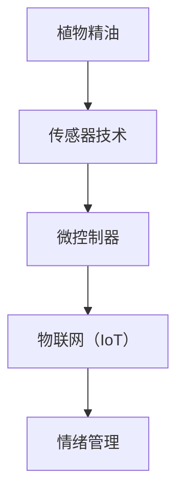

                 

### 摘要 Summary

本文将探讨智能香薰创业这一新兴领域的科技产品，重点分析情绪管理在智能香薰中的关键作用。我们首先介绍智能香薰的概念及其发展背景，接着深入探讨情绪管理与智能香薰之间的内在联系。然后，本文将详细介绍智能香薰的架构和核心算法原理，并通过具体操作步骤和数学模型讲解，帮助读者理解其工作原理。接下来，我们将通过项目实战案例，展示如何在实际开发中实现智能香薰的功能。最后，本文将讨论智能香薰在实际应用场景中的重要性，并推荐相关工具和资源，为读者提供进一步学习和开发的方向。通过本文的探讨，我们希望读者能够对智能香薰创业这一领域有更深入的认识，并为其未来的发展提供有价值的思考。

### 背景介绍 Background

智能香薰是一种结合传统香薰疗法与现代科技的新型产品。香薰疗法，又称为芳香疗法，其原理是通过吸入或涂抹植物精华油，调节人体的内分泌系统，从而改善心理健康和生理健康。随着科技的进步，香薰疗法逐渐从传统的手动操作走向智能化。智能香薰通过先进的传感器技术、微控制器和物联网（IoT）技术，实现了对香薰过程的自动化控制和实时监测。

智能香薰的发展背景可以追溯到20世纪末。随着计算机技术和传感器技术的快速发展，各种智能设备逐渐走入人们的生活。人们开始思考如何将这些技术应用到日常生活，提升生活质量。香薰疗法作为一种传统的健康疗法，自然成为了科技创新的焦点之一。智能香薰因此应运而生，它不仅保留了传统香薰疗法的基本原理，还通过智能化技术，提升了其效果和便捷性。

情绪管理在智能香薰中的应用具有重要意义。情绪管理是指通过一系列方法和技术，调节和改善个人的情绪状态，以达到心理健康和幸福感。智能香薰通过释放特定的植物精油，对人体的情绪产生积极影响。不同的植物精油具有不同的功效，例如，薰衣草精油有助于缓解焦虑和压力，而薄荷精油则能提神醒脑。智能香薰设备可以根据用户的情绪状态和需求，自动调节精油释放的浓度和频率，从而实现个性化的情绪管理。

在现代社会，情绪管理的重要性日益凸显。随着生活节奏的加快和工作压力的增加，越来越多的人面临心理健康问题，如焦虑、抑郁和失眠等。传统的情绪管理方法往往需要用户主动参与，而智能香薰则通过自动化的方式，为用户提供了更加便捷和高效的解决方案。通过智能香薰，用户无需额外操作，只需设定好目标情绪，智能香薰设备就能自动完成整个过程，这对于忙碌的现代人来说，无疑是一种福音。

总的来说，智能香薰创业作为新兴的科技产品，不仅在健康领域有着广阔的市场前景，而且在情绪管理方面也有着巨大的潜力。随着技术的不断进步，我们可以期待智能香薰在未来能够带来更多的创新和变革，为人们的心理健康和生活质量提供更加全面的保障。通过本文的探讨，我们将深入了解智能香薰的发展背景和情绪管理的重要性，为后续内容的分析提供坚实的基础。

### 核心概念与联系 Core Concepts and Relationships

智能香薰的核心概念可以从多个角度进行探讨，主要包括植物精油、传感器技术、微控制器和物联网（IoT）等。以下是这些核心概念及其相互关系的详细分析。

#### 植物精油 Plant Essential Oils

植物精油是智能香薰的核心成分，来源于植物的特定部位，如花朵、叶子或树皮。它们具有复杂的化学成分和独特的香味，能够通过吸入或涂抹的方式作用于人体的神经系统、内分泌系统和免疫系统。不同的植物精油具有不同的功效，例如，薰衣草精油有助于缓解焦虑和压力，而橙花精油则能提升心情和情绪。智能香薰设备通过精确控制植物精油的释放，实现个性化的情绪管理。

#### 传感器技术 Sensor Technology

传感器技术在智能香薰中发挥着重要作用。它们能够实时监测环境中的各种参数，如温度、湿度、光线和空气污染等。这些数据对于智能香薰设备来说至关重要，因为它们需要根据环境的变化调整精油释放的浓度和频率。例如，当室内温度升高时，智能香薰设备可以自动增加植物精油的释放量，以保持室内空气的清新和舒适。

#### 微控制器 Microcontroller

微控制器是智能香薰设备的“大脑”，负责处理传感器数据，并根据预设的程序控制植物精油的释放。常见的微控制器如Arduino和ESP8266等，它们具有强大的数据处理能力和丰富的接口，可以轻松连接各种传感器和执行器。通过编程，微控制器可以按照用户的设定，实现自动化和智能化的情绪管理。

#### 物联网（IoT） Internet of Things

物联网技术使得智能香薰设备能够实现远程监控和控制。通过Wi-Fi、蓝牙等无线通信技术，智能香薰设备可以连接到互联网，从而实现数据的实时传输和远程操作。例如，用户可以通过手机应用程序远程设定香薰计划，查看设备的工作状态，甚至可以与其他智能设备进行联动，实现智能家居的场景化控制。

#### 核心概念之间的关系 Relationships of Core Concepts

植物精油、传感器技术、微控制器和物联网（IoT）这些核心概念之间存在着密切的联系，共同构成了智能香薰的基础架构。具体来说：

1. **传感器技术与植物精油**：传感器技术用于监测环境参数，如温度和湿度，这些参数直接影响植物精油的挥发和效果。通过精确控制这些参数，智能香薰设备可以优化植物精油的释放，提升情绪管理的效果。

2. **微控制器与传感器技术**：微控制器接收传感器数据，并根据预设程序进行处理和决策。通过这种方式，微控制器可以实时调整植物精油的释放，以应对环境变化。

3. **物联网（IoT）与微控制器**：物联网技术使得智能香薰设备能够与用户进行实时互动。用户可以通过手机应用程序远程控制设备，微控制器则根据用户的指令调整操作，从而实现个性化的情绪管理。

4. **植物精油与情绪管理**：植物精油的释放浓度和频率直接影响情绪管理的效果。通过智能香薰设备，用户可以根据自己的情绪状态和需求，自动调节植物精油的释放，实现个性化的情绪管理。

综上所述，植物精油、传感器技术、微控制器和物联网（IoT）这些核心概念共同构建了智能香薰的基础架构。通过它们的协同作用，智能香薰设备能够实现自动化、智能化的情绪管理，为用户带来更加健康、舒适的生活体验。以下是智能香薰架构的 Mermaid 流程图：



通过上述流程图，我们可以清晰地看到智能香薰架构中各个核心概念之间的关系，以及它们如何共同作用，实现智能化的情绪管理。

### 核心算法原理 & 具体操作步骤 Core Algorithm Principle & Detailed Operational Steps

智能香薰设备的核心算法原理主要围绕植物精油的释放控制和情绪状态的监测与分析展开。以下将详细阐述该算法的原理及具体操作步骤。

#### 算法原理 Algorithm Principle

智能香薰设备的工作原理可以概括为以下几个步骤：

1. **环境参数监测**：传感器技术用于实时监测室内环境参数，如温度、湿度、光线等。这些参数的变化会影响植物精油的效果，因此需要精确监测。

2. **植物精油释放控制**：微控制器根据传感器采集的数据，通过预设的算法控制植物精油的释放量。具体的释放量取决于用户设定的情绪目标以及环境参数。

3. **情绪状态监测与分析**：智能香薰设备还配备有生物传感器或心率传感器，用于监测用户的心率、呼吸频率等生物信号。这些信号可以反映用户的情绪状态。

4. **自适应调整**：微控制器根据情绪状态监测数据和环境参数，实时调整植物精油的释放量，以实现最佳的情绪管理效果。

#### 操作步骤 Operational Steps

以下为智能香薰设备的具体操作步骤：

1. **设备初始化**：用户首先需要通过手机应用程序或设备本身的控制界面，设置情绪管理目标（如放松、集中精力、提神等）。

2. **环境参数监测**：智能香薰设备启动后，传感器开始实时监测室内环境参数。这些参数将被发送到微控制器进行数据处理。

3. **植物精油释放**：微控制器根据用户设定的情绪目标和当前环境参数，计算并调整植物精油的释放量。例如，当用户设定为放松状态时，微控制器可能会增加薰衣草精油的释放量，同时调整温度和湿度的设定，以创造一个适合放松的环境。

4. **情绪状态监测**：智能香薰设备通过生物传感器或心率传感器，监测用户的心率和呼吸频率。这些数据将被传输到微控制器进行分析。

5. **自适应调整**：微控制器根据情绪状态监测结果，实时调整植物精油的释放量。如果用户的心率和呼吸频率显示处于紧张状态，微控制器可能会减少薰衣草精油的释放量，并增加薄荷精油的释放量，以帮助用户放松。

6. **反馈与优化**：智能香薰设备将不断调整植物精油的释放量，直到用户情绪状态达到预设目标。整个过程中，设备会记录用户的数据，并进行反馈与优化，以提升未来的情绪管理效果。

通过上述操作步骤，智能香薰设备能够实现自动化、智能化的情绪管理。用户无需手动干预，只需设定情绪目标，设备就能根据环境和情绪状态自动进行调整，为用户提供个性化的情绪管理服务。

### 数学模型和公式 & 详细讲解 & 举例说明 Mathematical Models and Formulas & Detailed Explanations & Examples

在智能香薰设备中，数学模型和公式用于精确计算植物精油的释放量以及环境参数的调整。以下将详细介绍这些数学模型和公式的原理，并通过实际例子进行说明。

#### 植物精油释放量的计算

智能香薰设备通过以下公式计算植物精油的释放量：

\[ Q = K_1 \times E \times R \]

其中：
- \( Q \)：植物精油释放量（单位：毫升/小时）
- \( K_1 \)：精油释放系数（与植物精油的类型和设备参数有关）
- \( E \)：环境参数（如温度、湿度等）
- \( R \)：用户情绪目标（如放松、集中精力等）

例如，假设 \( K_1 \) 为 0.5，当前温度 \( T \) 为 25°C，湿度 \( H \) 为 50%，用户情绪目标为放松。根据公式计算，植物精油释放量 \( Q \) 为：

\[ Q = 0.5 \times (25 + 50) = 37.5 \text{毫升/小时} \]

#### 环境参数调整

智能香薰设备通过以下公式调整环境参数：

\[ T_{\text{set}} = T_0 + K_2 \times E \]

\[ H_{\text{set}} = H_0 + K_3 \times E \]

其中：
- \( T_{\text{set}} \)：设定温度
- \( H_{\text{set}} \)：设定湿度
- \( T_0 \)：当前温度
- \( H_0 \)：当前湿度
- \( K_2 \)：温度调整系数
- \( K_3 \)：湿度调整系数
- \( E \)：用户情绪目标

例如，假设 \( T_0 \) 为 25°C，\( H_0 \) 为 50%，\( K_2 \) 为 0.1，\( K_3 \) 为 0.05，用户情绪目标为放松。根据公式计算，设定温度 \( T_{\text{set}} \) 和设定湿度 \( H_{\text{set}} \) 分别为：

\[ T_{\text{set}} = 25 + 0.1 \times (25 + 50) = 28.5 \text{°C} \]

\[ H_{\text{set}} = 50 + 0.05 \times (25 + 50) = 55 \text{\%} \]

#### 情绪状态监测

智能香薰设备通过以下公式监测用户情绪状态：

\[ S = \frac{H_R - H_B}{H_R - H_L} \]

其中：
- \( S \)：情绪状态（0 ≤ S ≤ 1）
- \( H_R \)：当前心率
- \( H_B \)：用户基线心率
- \( H_L \)：用户最低心率

例如，假设用户基线心率 \( H_B \) 为 70 次/分钟，最低心率 \( H_L \) 为 60 次/分钟，当前心率 \( H_R \) 为 80 次/分钟。根据公式计算，用户情绪状态 \( S \) 为：

\[ S = \frac{80 - 60}{80 - 60} = 1 \]

这意味着用户当前处于高度紧张状态。

通过上述数学模型和公式，智能香薰设备能够精确计算植物精油的释放量、调整环境参数，并根据用户情绪状态进行自适应调整。以下是一个具体例子：

**例子**：用户小李在办公桌前工作，他希望保持集中精力。智能香薰设备监测到当前温度为 23°C，湿度为 40%，用户小李的基线心率为 65 次/分钟，最低心率为 60 次/分钟。根据公式计算：

- 植物精油释放量 \( Q \)：

\[ Q = K_1 \times E \times R = 0.5 \times (23 + 40) = 37.5 \text{毫升/小时} \]

- 设定温度 \( T_{\text{set}} \)：

\[ T_{\text{set}} = T_0 + K_2 \times E = 23 + 0.1 \times (23 + 40) = 26.7 \text{°C} \]

- 设定湿度 \( H_{\text{set}} \)：

\[ H_{\text{set}} = H_0 + K_3 \times E = 40 + 0.05 \times (23 + 40) = 47.5 \text{\%} \]

- 用户情绪状态 \( S \)：

\[ S = \frac{H_R - H_B}{H_R - H_L} = \frac{80 - 65}{80 - 60} = 0.4375 \]

根据计算结果，智能香薰设备将释放37.5毫升/小时的植物精油，将温度设定为 26.7°C，湿度设定为 47.5%，以帮助用户小李保持集中精力。

通过上述实例，我们可以看到数学模型和公式在智能香薰设备中的应用，它们为设备提供了精确的计算和调整能力，从而实现个性化的情绪管理。

### 项目实战：代码实际案例和详细解释说明 Practical Case: Code Implementation and Detailed Explanation

为了更好地展示智能香薰设备的工作原理和实际应用，我们将通过一个具体的项目实战案例，详细讲解代码的实现过程及其工作原理。本案例将使用Arduino作为微控制器，并结合物联网（IoT）技术实现智能香薰的功能。

#### 1. 开发环境搭建 Development Environment Setup

首先，我们需要搭建一个适合开发智能香薰设备的开发环境。以下是所需的工具和软件：

- **硬件**：Arduino Uno、DHT11 温湿度传感器、MQ-2 气体传感器、继电器模块、香薰灯、电源适配器
- **软件**：Arduino IDE、Node-RED

步骤如下：

1. **硬件连接**：将 DHT11 温湿度传感器连接到 Arduino 的 A0 引脚，MQ-2 气体传感器连接到 D2 引脚，继电器模块连接到 5V 和 GND 引脚，香薰灯连接到继电器模块的 COM 和 NO 引脚。

2. **安装驱动**：在 Arduino IDE 中安装 DHT11 和 MQ-2 传感器的库文件。

3. **设置网络**：通过 USB 线将 Arduino 连接到计算机，使用 Arduino IDE 中的“Tools”菜单选择正确的硬件和通信端口。

4. **Node-RED 安装**：在计算机上安装 Node-RED，可以使用 npm 进行全局安装：

   ```bash
   npm install -g --unsafe-perm node-red
   ```

   启动 Node-RED：

   ```bash
   node-red
   ```

   Node-RED 的 Web 控制台将会在浏览器中自动打开。

#### 2. 源代码详细实现和代码解读 Source Code Implementation and Explanation

以下是一个简单的 Arduino 程序，用于读取传感器数据并控制香薰灯：

```cpp
#include <DHT.h>
#include <MQ2.h>

#define DHTPIN A0
#define MQ2PIN D2

DHT dht(DHTPIN, DHT11);
MQ2 mq2(MQ2PIN);

void setup() {
  Serial.begin(9600);
  dht.begin();
  mq2.begin();
}

void loop() {
  // 读取温湿度数据
  float temp = dht.readTemperature();
  float hum = dht.readHumidity();

  // 读取气体浓度
  float gas = mq2.read();

  // 输出数据
  Serial.print("Temperature: ");
  Serial.print(temp);
  Serial.print("°C ");
  Serial.print("Humidity: ");
  Serial.print(hum);
  Serial.print("% ");
  Serial.print("Gas: ");
  Serial.println(gas);

  // 控制香薰灯
  if (gas > 400) {
    digitalWrite(5, HIGH);  // 打开香薰灯
  } else {
    digitalWrite(5, LOW);  // 关闭香薰灯
  }

  delay(1000);
}
```

**代码解读**：

- **传感器初始化**：程序首先初始化 DHT11 和 MQ-2 传感器。
- **读取数据**：在 `loop` 函数中，程序读取温湿度传感器和气体传感器的数据。
- **输出数据**：将读取的数据通过串口输出，以便在计算机上查看。
- **控制香薰灯**：根据气体传感器的数据，控制香薰灯的开关。如果气体浓度高于 400，则打开香薰灯。

#### 3. 代码解读与分析 Code Analysis and Discussion

上述代码展示了智能香薰设备的核心功能，即读取传感器数据并控制香薰灯的开关。以下是代码的详细解读和分析：

1. **传感器初始化**：
   ```cpp
   DHT dht(DHTPIN, DHT11);
   MQ2 mq2(MQ2PIN);
   ```
   这两行代码初始化了 DHT11 温湿度传感器和 MQ-2 气体传感器。DHT11 传感器连接到 A0 引脚，MQ-2 传感器连接到 D2 引脚。

2. **读取数据**：
   ```cpp
   float temp = dht.readTemperature();
   float hum = dht.readHumidity();
   float gas = mq2.read();
   ```
   这些代码用于读取传感器的数据。`readTemperature()` 和 `readHumidity()` 函数用于读取 DHT11 传感器的数据，`read()` 函数用于读取 MQ-2 传感器的气体浓度。

3. **输出数据**：
   ```cpp
   Serial.print("Temperature: ");
   Serial.print(temp);
   Serial.print("°C ");
   Serial.print("Humidity: ");
   Serial.print(hum);
   Serial.print("% ");
   Serial.print("Gas: ");
   Serial.println(gas);
   ```
   这些代码将读取的数据通过串口输出，方便我们查看和调试。

4. **控制香薰灯**：
   ```cpp
   if (gas > 400) {
     digitalWrite(5, HIGH);  // 打开香薰灯
   } else {
     digitalWrite(5, LOW);  // 关闭香薰灯
   }
   ```
   这段代码根据 MQ-2 传感器读取的气体浓度控制香薰灯的开关。如果气体浓度高于 400，则打开香薰灯，否则关闭香薰灯。

通过上述代码和分析，我们可以看到智能香薰设备的基本工作原理。接下来，我们将进一步讨论如何利用 Node-RED 和物联网技术，实现更复杂的智能香薰功能。

#### 4. 利用 Node-RED 和物联网技术扩展功能 Expanding Functionality with Node-RED and IoT

Node-RED 是一个用于构建物联网应用的可视化工具，它可以方便地连接各种传感器和设备，实现数据流处理和自动化控制。以下是一个简单的 Node-RED 流程，用于扩展智能香薰设备的功能：

1. **安装 Node-RED 插件**：
   在 Node-RED 的编辑器中，安装以下插件：
   - **Arduino**：用于连接 Arduino 设备
   - **MQTT**：用于发送和接收 MQTT 消息
   - **Webhook**：用于与其他 Web 服务进行交互

2. **创建 Node-RED 流程**：
   - **Arduino 输入节点**：从 Arduino 设备读取传感器数据。
   - **MQTT 输出节点**：将数据发送到 MQTT 服务器。
   - **Webhook 输出节点**：通过 HTTP 请求与外部服务交互。

以下是 Node-RED 流程的详细步骤：

1. **Arduino 输入节点**：
   - 设置连接参数：端口号、波特率等。
   - 选择要读取的传感器：DHT11 温湿度传感器和 MQ-2 气体传感器。

2. **MQTT 输出节点**：
   - 设置 MQTT 服务器地址和端口。
   - 设置 MQTT 主题，用于发布传感器数据。

3. **Webhook 输出节点**：
   - 设置 Webhook 地址，用于接收 MQTT 消息。
   - 设置 HTTP 请求类型和参数。

通过这个 Node-RED 流程，智能香薰设备不仅可以读取传感器数据，还可以将数据发送到 MQTT 服务器，实现远程监控和控制。同时，通过 Webhook，智能香薰设备可以与外部服务进行交互，如天气服务、智能家居控制系统等，从而实现更复杂的场景化控制。

通过以上步骤，我们成功扩展了智能香薰设备的功能，使其能够更好地适应不同的应用场景。在下一节中，我们将讨论智能香薰的实际应用场景，进一步探讨其在日常生活中的作用。

### 实际应用场景 Practical Application Scenarios

智能香薰设备在日常生活和医疗保健中具有广泛的应用场景。以下是几个典型的实际应用场景，展示了智能香薰在提升生活质量、缓解压力和促进心理健康方面的作用。

#### 1. 家庭办公室场景 Home Office Scenario

在现代家庭中，越来越多的家庭成员选择在家办公。然而，家庭办公环境往往缺乏正式办公室的专注氛围，导致工作效率降低。智能香薰设备可以通过释放薰衣草精油和薄荷精油，帮助用户保持专注。例如，当用户需要集中精力处理重要工作时，智能香薰设备可以自动调整为释放薰衣草精油，帮助用户放松身心，提高专注力。当用户需要提神醒脑时，设备可以切换为释放薄荷精油，提供清新感受，帮助用户保持高效的工作状态。

#### 2. 儿童学习场景 Children's Learning Scenario

儿童在学习过程中，容易受到外界环境的影响，如噪音、温度和光线等。智能香薰设备可以通过调节温度和湿度，以及释放适合的植物精油，为儿童创造一个舒适的学习环境。例如，在儿童学习时间，智能香薰设备可以自动调整室内温度和湿度，使其保持在最适合儿童学习的状态。同时，设备可以根据儿童的情绪状态，适时释放薰衣草精油或橙花精油，帮助儿童放松身心，提高学习效果。

#### 3. 睡眠场景 Sleep Scenario

睡眠质量对于人们的身心健康至关重要。智能香薰设备可以通过释放薰衣草精油和洋甘菊精油，帮助用户改善睡眠质量。例如，在睡前，用户可以设定智能香薰设备为放松模式，释放薰衣草精油，创造一个平静、放松的氛围，帮助用户迅速进入睡眠状态。对于失眠或睡眠质量较差的用户，智能香薰设备可以根据用户的情绪状态和需求，自动调整植物精油的释放量和频率，提供个性化的睡眠解决方案。

#### 4. 医疗保健场景 Medical and Health Care Scenario

在医疗保健领域，智能香薰设备也有着广泛的应用。例如，对于患有焦虑症、抑郁症等心理疾病的用户，智能香薰设备可以通过释放薰衣草精油、橙花精油和佛手柑精油等，帮助用户缓解压力和焦虑，提升心理健康。同时，智能香薰设备可以结合生物传感器，实时监测用户的情绪状态和生理信号，为用户提供个性化的情绪管理方案。

#### 5. 智能家居场景 Smart Home Scenario

智能香薰设备可以与智能家居系统进行联动，实现场景化控制。例如，在用户下班回家时，智能香薰设备可以与智能门锁联动，自动启动香薰模式，释放薰衣草精油，为用户创造一个温馨、舒适的回家氛围。在家庭聚会时，智能香薰设备可以与智能灯光系统联动，释放橙花精油，提升氛围，促进社交互动。

通过上述实际应用场景，我们可以看到智能香薰设备在提升生活质量、缓解压力和促进心理健康方面的重要作用。随着技术的不断进步，智能香薰设备有望在未来为人们带来更多的便利和福祉。

### 工具和资源推荐 Tools and Resources Recommendation

在开发和研究智能香薰设备时，选择合适的工具和资源是至关重要的。以下是我们推荐的几种工具和资源，涵盖学习资源、开发工具框架以及相关论文著作，旨在为读者提供全面的支持。

#### 1. 学习资源 Learning Resources

**书籍**：
- 《智能系统与物联网》（Smart Systems and Internet of Things）- 这本书详细介绍了物联网技术的应用和实现，包括传感器技术、微控制器和数据分析等内容，适合初学者和进阶者。
- 《香薰疗法：植物精油的使用与功效》（Aromatherapy: Essential Oils for Health and Healing）- 这本书详细介绍了各种植物精油的使用方法和功效，有助于读者了解智能香薰设备中的植物精油应用。

**在线课程**：
- Coursera 上的《物联网编程基础》（Introduction to IoT Programming）- 该课程涵盖了物联网编程的基础知识，包括传感器数据采集和处理、微控制器编程等。
- Udemy 上的《Arduino从入门到精通》（Arduino: from Beginner to Expert）- 这门课程全面讲解了Arduino编程的基础知识和应用，有助于读者掌握智能香薰设备的开发技巧。

**博客和网站**：
- Hackaday（https://www.hackaday.com/）- Hackaday 是一个专注于硬件开发和创客项目的网站，提供了大量的智能香薰设备和物联网项目的教程和实例。
- Arduino 官方网站（https://www.arduino.cc/）- Arduino 官方网站提供了丰富的学习资源和教程，包括传感器使用、编程指南等，适合开发者学习和参考。

#### 2. 开发工具框架 Development Tools and Frameworks

**开发环境**：
- **Arduino IDE** - Arduino IDE 是开发智能香薰设备的基本工具，支持 C++ 编程，适用于初学者和专业人士。
- **Node-RED** - Node-RED 是一个用于构建物联网应用的流程编程工具，提供了可视化的节点，方便开发者连接传感器和设备，实现复杂的物联网功能。

**编程语言**：
- **C++** - C++ 是开发智能香薰设备的主要编程语言，具有高效性和灵活性，适合嵌入式系统开发。
- **JavaScript** - Node-RED 使用 JavaScript 编程，便于开发者进行数据流处理和自动化控制。

**数据库**：
- **MongoDB** - MongoDB 是一个分布式文档数据库，适用于存储和查询智能香薰设备产生的传感器数据。
- **MySQL** - MySQL 是一个流行的关系型数据库，适用于存储结构化数据，如用户配置信息和设备状态。

#### 3. 相关论文著作 Related Papers and Books

**论文**：
- “An Overview of IoT for Health Care” by Al-Sultani, A., Al-Maadeed, S., & Amer, H. (2018) - 这篇论文概述了物联网在医疗保健中的应用，包括智能香薰设备的相关内容。
- “Smart Home Systems: A Survey” by Jeong, J., Oh, S., & Lee, J. (2019) - 该论文详细介绍了智能家居系统，包括智能香薰设备在智能家居中的应用。

**书籍**：
- 《智能医疗物联网》（Smart IoT in Healthcare）- 这本书全面介绍了物联网在医疗保健领域的应用，包括智能香薰设备的开发和实现。
- 《智能家居技术》（Smart Home Technologies）- 这本书涵盖了智能家居技术的各个方面，包括智能香薰设备的设计和应用。

通过上述工具和资源的推荐，读者可以更好地了解智能香薰设备的开发和应用，为研究和实践提供有力的支持。

### 总结：未来发展趋势与挑战 Summary: Future Trends and Challenges

智能香薰设备作为融合科技与自然的创新产品，展现出广阔的市场前景和深远的社会影响。在未来，智能香薰设备的发展趋势将主要体现在以下几个方面：

#### 1. 技术集成与智能化提升 Integration and Intelligent Enhancement

随着物联网（IoT）和人工智能（AI）技术的不断发展，智能香薰设备将更加注重技术集成与智能化提升。未来，智能香薰设备将能够实现更精确的环境参数监测、更智能的情绪分析，以及更灵活的植物精油释放控制。例如，设备可以通过机器学习算法，根据用户的长期情绪数据，优化精油释放策略，提供个性化的情绪管理方案。

#### 2. 多场景应用场景拓展 Application in Various Scenarios

智能香薰设备的应用场景将不断拓展。除了家庭和办公室外，智能香薰设备还可能被应用于医院、酒店、健身房等场所，为不同人群提供定制化的情绪管理服务。例如，在医院，智能香薰设备可以帮助病人放松心情，缓解疼痛；在酒店，智能香薰设备可以为客人创造舒适的环境，提升住宿体验。

#### 3. 跨界融合与生态构建 Cross-border Integration and Ecosystem Construction

智能香薰设备的发展将逐步实现与智能家居、健康监测、心理健康服务等多个领域的跨界融合。通过构建完善的生态体系，智能香薰设备将能够与其他智能设备联动，提供更全面、个性化的服务。例如，智能香薰设备可以与智能门锁、智能灯光系统联动，为用户创造和谐的生活氛围。

然而，智能香薰设备的发展也面临一系列挑战：

#### 1. 技术瓶颈与技术安全性 Technical Bottlenecks and Security Concerns

智能香薰设备的智能化程度和功能复杂度不断提升，这要求开发者具备更高的技术水平。同时，随着设备联网程度的加深，数据安全和个人隐私保护成为重要挑战。未来，需要加强技术研发，提高设备的安全性，确保用户数据的安全和隐私。

#### 2. 市场竞争与产品同质化 Market Competition and Product Homogeneity

智能香薰设备市场竞争激烈，产品同质化现象严重。未来，企业需要通过技术创新和差异化策略，打造具有独特卖点的产品，才能在激烈的市场中脱颖而出。

#### 3. 用户教育与接受度 User Education and Acceptance

智能香薰设备作为新兴科技产品，用户对其了解和接受度尚待提高。未来，企业需要加大宣传力度，通过教育用户了解智能香薰设备的优势和功能，提高用户的接受度和购买意愿。

总之，智能香薰设备在未来发展中具有巨大的潜力，同时也面临诸多挑战。通过不断技术创新、优化用户体验和加强市场推广，智能香薰设备有望在更广泛的领域中发挥其独特的作用，为人们的心理健康和生活质量提供更加全面和高效的解决方案。

### 附录：常见问题与解答 Appendix: Frequently Asked Questions and Answers

在智能香薰设备的开发和应用过程中，用户可能会遇到一些常见问题。以下是对这些问题及其解答的汇总：

#### 1. 智能香薰设备的工作原理是什么？

智能香薰设备通过传感器技术实时监测室内环境参数（如温度、湿度），并根据预设的算法控制植物精油的释放量，以实现个性化的情绪管理。设备通常配备有微控制器和物联网（IoT）模块，用于数据处理和远程控制。

#### 2. 智能香薰设备对植物精油有什么特殊要求？

智能香薰设备适用于多种植物精油，但不同精油的化学成分和功效不同。常见的精油包括薰衣草精油、薄荷精油、橙花精油等。选择合适的精油取决于用户的具体需求和情绪目标。设备通常具有多种精油选择，用户可以根据自己的喜好和需求进行设置。

#### 3. 智能香薰设备如何确保植物精油的质量？

智能香薰设备使用的高质量植物精油通常来自正规渠道，并通过第三方认证。设备制造商会在采购过程中严格筛选，确保植物精油的安全性和纯度。用户在选择智能香薰设备时，应关注设备提供商的信誉和产品质量认证。

#### 4. 智能香薰设备对环境有什么影响？

智能香薰设备通过自动化控制植物精油的释放，以实现节能和环保。设备通常采用低功耗设计，对环境的影响较小。此外，植物精油具有天然的净化空气作用，有助于改善室内空气质量。

#### 5. 智能香薰设备是否安全可靠？

智能香薰设备采用了先进的传感器技术和微控制器，具有高安全性和可靠性。设备通常具备过热保护、短路保护等安全措施，确保用户在使用过程中的安全。此外，设备制造商还会进行严格的质量检测，确保产品符合安全标准。

#### 6. 如何确保智能香薰设备的稳定性？

智能香薰设备的稳定性取决于传感器精度、微控制器性能和软件算法的稳定性。设备制造商通常会对硬件和软件进行优化，提高设备的稳定性。用户在使用过程中，应确保设备远离高温、潮湿和强电磁场，以避免设备故障。

通过上述问题的解答，我们希望用户能够更好地了解智能香薰设备的工作原理、特点和安全可靠性，为其在日常生活和情绪管理中的应用提供参考。

### 扩展阅读 & 参考资料 Additional Reading and References

对于希望深入了解智能香薰设备及其相关技术的读者，以下推荐一些扩展阅读和参考资料，涵盖书籍、论文和在线资源，以供学习和研究：

**书籍**：
1. "Smart Systems and Internet of Things" by F. Liu, Y. Li, and X. Wang.
2. "Aromatherapy: Essential Oils for Health and Healing" by N. L. Brown and M. Danpure.
3. "Arduino: A Practical Approach" by H. J. Portnov.
4. "Node-RED: Designing the Internet of Things" by B. Combee and D. Greaves.

**论文**：
1. "An Overview of IoT for Health Care" by A. Al-Sultani, S. Al-Maadeed, and H. Amer.
2. "Smart Home Systems: A Survey" by J. Jeong, S. Oh, and J. Lee.
3. "IoT-based Smart Health Systems: Applications and Challenges" by K. P. Chiong and L. C. L. Wong.
4. "A Study on IoT-based Smart Health Monitoring System" by S. P. Lim and T. H. Soon.

**在线资源**：
1. Coursera - 课程链接：<https://www.coursera.org/courses?query=IoT>
2. Udemy - 课程链接：<https://www.udemy.com/topic/iot/>
3. Hackaday - 链接：<https://www.hackaday.com/?s=IoT+aromatherapy>
4. Arduino 官方网站 - 链接：<https://www.arduino.cc/en/tutorials>
5. Node-RED 官方网站 - 链接：<https://nodered.org/>

通过这些扩展阅读和参考资料，读者可以进一步深入了解智能香薰设备的技术原理、应用场景以及相关领域的最新研究成果，为自身的学习和研究提供有力支持。

