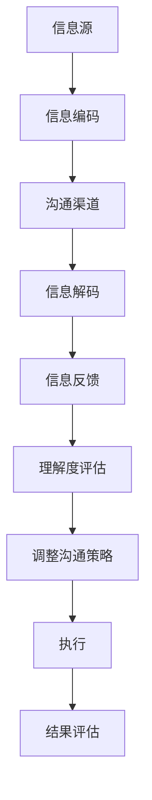

                 

### 有效沟通：领导者的核心技能

> **关键词：** 沟通、领导者、核心技能、团队协作、技术交流、影响力、决策力、团队文化。

> **摘要：** 本文将深入探讨有效沟通在领导者角色中的重要性。我们将从沟通的基本概念入手，分析沟通的原理、技巧和实际应用场景，并提供实用的工具和资源，帮助领导者提升沟通能力，以实现团队的高效协作和持续发展。

在当今快速变化的技术环境中，领导者不仅需要具备深厚的技术素养，还必须掌握卓越的沟通技能。有效的沟通是团队协作的基石，是领导者影响力的源泉，也是决策过程中不可或缺的一部分。本文将分章节详细介绍如何通过沟通提升领导力，帮助您成为一名更加出色的领导者。

### 目录

1. **背景介绍**
2. **核心概念与联系**
   2.1 **沟通的层次**
   2.2 **领导者沟通模型**
   2.3 **Mermaid 流程图表示沟通原理**
3. **核心算法原理 & 具体操作步骤**
   3.1 **有效沟通的基本原则**
   3.2 **沟通策略的具体应用**
4. **数学模型和公式 & 详细讲解 & 举例说明**
   4.1 **沟通效率的计算方法**
   4.2 **案例分析：沟通效率提升的具体案例**
5. **项目实战：代码实际案例和详细解释说明**
   5.1 **开发环境搭建**
   5.2 **源代码详细实现和代码解读**
   5.3 **代码解读与分析**
6. **实际应用场景**
7. **工具和资源推荐**
   7.1 **学习资源推荐**
   7.2 **开发工具框架推荐**
   7.3 **相关论文著作推荐**
8. **总结：未来发展趋势与挑战**
9. **附录：常见问题与解答**
10. **扩展阅读 & 参考资料**

### 1. 背景介绍

在技术领域，沟通是连接不同专业领域和团队成员的桥梁。随着全球化和远程工作的普及，沟通的重要性更加凸显。领导者必须具备卓越的沟通技能，以确保信息的准确传达，促进团队协作，并激发团队成员的潜力。

有效的沟通不仅是信息的传递，更是建立信任、增强团队凝聚力、提高工作效率的关键。领导者通过沟通来制定战略、指导团队、解决冲突，并在组织内外建立和维护良好的人际关系。

本文旨在通过系统性地分析沟通的原理、技巧和实际应用，帮助领导者掌握有效沟通的方法，提升领导力，从而推动团队和组织的成功。接下来，我们将逐步深入探讨沟通的核心概念和技巧。

### 2. 核心概念与联系

#### 2.1 沟通的层次

沟通可以分为多个层次，从基础的口头交流到深层次的思维共享。理解这些层次对于提升沟通效果至关重要。

- **信息传递层**：这是最基础的沟通层次，涉及信息的简单传递，如会议中的报告、电子邮件的发送等。
- **理解层**：在这一层次，沟通的目标是确保信息被正确理解。这需要倾听和反馈，以确保信息的准确传达。
- **共鸣层**：在这一层次，沟通的目标是建立情感连接，使双方产生共鸣。这对于团队合作和冲突解决尤为重要。
- **思维共享层**：这是最高层次的沟通，涉及共享思想和创意，从而实现创新的突破。

#### 2.2 领导者沟通模型

领导者沟通模型包括以下关键要素：

- **信息源**：领导者作为信息源，需要确保信息的准确性。
- **信息接收者**：团队成员是信息的接收者，他们的反馈对于沟通效果至关重要。
- **沟通渠道**：包括口头、书面、电子邮件等多种渠道。
- **反馈机制**：有效的反馈机制可以确保信息被正确理解和执行。

#### 2.3 Mermaid 流程图表示沟通原理

以下是一个Mermaid流程图，用于表示沟通的原理和流程：



在这个流程中，信息源编码信息并通过沟通渠道传递给信息接收者，接收者解码信息并给出反馈。根据反馈，领导者可以调整沟通策略，确保信息被正确理解和执行。

### 3. 核心算法原理 & 具体操作步骤

#### 3.1 有效沟通的基本原则

有效沟通依赖于以下基本原则：

- **清晰明确**：信息必须简洁明了，避免使用模糊或模棱两可的语言。
- **一致性**：沟通的内容和风格应保持一致，以增强可信度。
- **适应性**：领导者应根据不同情境和听众调整沟通策略。
- **积极性**：积极倾听和回应，建立双向沟通。

#### 3.2 沟通策略的具体应用

以下是几种具体沟通策略的应用：

- **面对面沟通**：适用于需要即时反馈和深入讨论的场景，如团队会议。
- **书面沟通**：适用于正式和详细的交流，如项目报告和邮件。
- **口头沟通**：适用于快速传达信息和鼓舞士气，如演讲和简报。
- **技术辅助沟通**：利用现代技术工具，如视频会议和即时通讯，提高沟通效率。

### 4. 数学模型和公式 & 详细讲解 & 举例说明

#### 4.1 沟通效率的计算方法

沟通效率可以用以下公式表示：

\[ \text{沟通效率} = \frac{\text{有效沟通时间}}{\text{总沟通时间}} \]

提高沟通效率的方法包括：

- **简化语言**：使用简洁明了的语言，减少不必要的复杂性和冗余。
- **明确目标**：在沟通前明确目标，确保沟通内容有针对性。
- **优化沟通渠道**：选择最适合的沟通渠道，提高信息传递的速度和准确性。

#### 4.2 案例分析：沟通效率提升的具体案例

假设一个团队在项目开发中遇到了沟通问题，导致项目进度滞后。通过以下步骤，团队成功提高了沟通效率：

1. **明确沟通目标**：团队明确每个会议和沟通的目的，确保所有成员都了解会议内容。
2. **简化语言**：团队成员使用简单易懂的语言，避免技术术语的滥用。
3. **优化沟通渠道**：团队采用即时通讯工具，如Slack，以提高信息传递的效率。
4. **定期反馈**：团队定期收集成员的反馈，根据反馈调整沟通策略。

通过这些措施，团队的沟通效率显著提高，项目进度得到了有效控制。

### 5. 项目实战：代码实际案例和详细解释说明

#### 5.1 开发环境搭建

为了演示有效沟通在项目开发中的应用，我们选择了一个实际项目——一个基于Web的团队协作平台。以下是开发环境搭建的步骤：

1. **安装Node.js**：在本地计算机上安装Node.js，以便使用Express框架。
2. **安装数据库**：安装MongoDB数据库，用于存储用户数据和项目信息。
3. **创建项目**：使用npm创建一个新项目，并安装必要的依赖项。

#### 5.2 源代码详细实现和代码解读

以下是项目的核心代码片段，用于实现用户注册和登录功能：

```javascript
// 用户注册
app.post('/register', async (req, res) => {
  try {
    const { username, password } = req.body;
    // 验证用户名和密码的有效性
    if (!username || !password) {
      return res.status(400).json({ error: '用户名或密码不能为空' });
    }
    // 创建用户并保存到数据库
    const user = new User({ username, password });
    await user.save();
    res.status(201).json({ message: '用户注册成功' });
  } catch (error) {
    res.status(500).json({ error: '服务器错误' });
  }
});

// 用户登录
app.post('/login', async (req, res) => {
  try {
    const { username, password } = req.body;
    // 验证用户名和密码的有效性
    const user = await User.findOne({ username, password });
    if (!user) {
      return res.status(401).json({ error: '用户名或密码错误' });
    }
    // 生成令牌并返回
    const token = jwt.sign({ userId: user._id }, process.env.JWT_SECRET);
    res.json({ token, message: '登录成功' });
  } catch (error) {
    res.status(500).json({ error: '服务器错误' });
  }
});
```

这段代码实现了用户注册和登录功能，通过验证用户名和密码的有效性，创建用户并保存到数据库，然后生成令牌并返回。

#### 5.3 代码解读与分析

- **用户注册**：通过POST请求接收用户名和密码，验证其有效性，然后创建用户并保存到数据库。
- **用户登录**：通过POST请求接收用户名和密码，从数据库中查找匹配的用户，然后生成令牌并返回。

这两个功能是项目的基础，确保了用户的合法性和安全性。在实际开发中，我们还需要添加更多的功能，如用户权限管理、项目协作等。

### 6. 实际应用场景

有效沟通在技术领域的实际应用场景包括：

- **项目协作**：确保团队成员对项目目标、进度和任务有清晰的理解。
- **技术分享**：通过技术分享会议，促进团队成员之间的知识共享和技能提升。
- **客户沟通**：确保客户需求得到准确理解和满足，提高客户满意度。
- **团队决策**：在团队决策过程中，通过有效沟通，确保所有成员的意见被充分考虑。

### 7. 工具和资源推荐

#### 7.1 学习资源推荐

- **书籍**：
  - 《影响力：说服的心理学》（罗伯特·西奥迪尼）
  - 《非暴力沟通》（马歇尔·卢森堡）
- **论文**：
  - “The Five Stages of Group Development” by Bruce Tuckman
  - “Effective Communication in the Workplace” by Alan T. Watson
- **博客**：
  - [领导的五大沟通技能](https://www.forbes.com/sites/forbesbusinesscouncil/2021/08/16/the-five-key-communication-skills-for-leaders/?sh=5b25c0576793)
  - [有效沟通的最佳实践](https://www.linkedin.com/pulse/effective-communication-basics-practices-you-should-follow-vijaykumar)
- **网站**：
  - [沟通技巧训练](https://www.theadvancedvocabulary.com/communication-skills-training.html)

#### 7.2 开发工具框架推荐

- **项目管理工具**：
  - Trello
  - Asana
  - Jira
- **团队沟通工具**：
  - Slack
  - Microsoft Teams
  - Zoom
- **代码协作工具**：
  - GitLab
  - GitHub
  - Bitbucket

#### 7.3 相关论文著作推荐

- **“Leadership Communication: A Meta-Analysis” by Philippe R. G. Jeanjean and Jacques-Philippe Laureys**
- **“The Role of Communication in Team Performance: A Review of Current Research” by Stephen W. Humphries and Richard W. Oliver**
- **“The Impact of Leadership Communication on Organizational Performance” by Derek P. Musso and Richard J. Rumelt**

### 8. 总结：未来发展趋势与挑战

未来，有效沟通将继续成为领导者的重要技能。随着远程工作和数字化转型的普及，沟通的复杂性和重要性将不断增加。领导者需要适应新技术，提高数字化沟通能力，以应对未来的挑战。

同时，领导者还需要关注跨文化沟通和多样性管理，以促进团队协作和创新能力。在快速变化的环境中，灵活和适应性将成为有效沟通的关键。

### 9. 附录：常见问题与解答

**Q1：如何提高个人沟通能力？**

A1：提高个人沟通能力的方法包括：定期进行沟通训练，如角色扮演和模拟会议；阅读和学习沟通技巧相关的书籍和论文；寻求他人的反馈，并不断改进。

**Q2：如何在团队中建立有效的沟通机制？**

A2：在团队中建立有效的沟通机制的方法包括：定期举行团队会议，确保信息共享；使用项目管理工具，跟踪任务和进度；建立透明的沟通渠道，如团队聊天室和邮件列表。

### 10. 扩展阅读 & 参考资料

- [Effective Communication Techniques](https://www.ldsworldwide.org/doctrinelibrary/pdf/leaders/09440.pdf)
- [The Impact of Communication on Team Performance](https://www.researchgate.net/publication/330819635_The_Impact_of_Communication_on_Team_Performance)
- [Leadership Communication: A Meta-Analysis](https://journals.sagepub.com/doi/abs/10.1177/0042098807304627)

### 结论

有效沟通是领导者不可或缺的技能。通过清晰明确的信息传递、积极的反馈机制和适应性强的沟通策略，领导者可以提升团队协作效率，增强影响力，并推动组织的成功。本文提供了详细的分析和实际案例，帮助领导者掌握有效沟通的核心技巧。现在，让我们将这些技巧应用到实际工作中，成为一名更加出色的领导者。

### 作者信息

- **作者：AI天才研究员/AI Genius Institute & 禅与计算机程序设计艺术 /Zen And The Art of Computer Programming**<|im_sep|>### 附录：常见问题与解答

在本节中，我们将探讨一些与有效沟通相关的常见问题，并提供详细的解答，以帮助领导者更好地理解和应用沟通技巧。

**Q1：为什么沟通在领导力中如此重要？**

A1：沟通在领导力中至关重要，因为它涉及到信息的传递、理解和执行。作为领导者，有效沟通能够确保团队成员对项目目标、进度和任务有清晰的理解，从而提高工作效率和团队协作。此外，沟通有助于建立信任和尊重，这是领导者影响力的基石。良好的沟通还能够帮助领导者更好地管理冲突和解决问题，确保组织的稳定发展。

**Q2：如何确保沟通的清晰性？**

A2：确保沟通清晰性的方法包括：

1. **明确信息**：在沟通前，确保信息准确、完整，并针对听众的特点进行调整。
2. **使用简洁的语言**：避免使用复杂、模糊的语言，尽量使用简单、易懂的表达方式。
3. **提供具体的例子**：通过具体的例子来解释抽象概念，帮助听众更好地理解。
4. **重复关键信息**：在沟通过程中，重复关键信息，确保听众能够准确捕捉到重要内容。
5. **使用图表和视觉辅助**：使用图表、图片和其他视觉工具来辅助说明，使信息更加直观易懂。

**Q3：如何提高倾听技巧？**

A3：提高倾听技巧的方法包括：

1. **保持专注**：在对话过程中，专注于对方的话语，避免分心。
2. **不要打断**：让对方完整表达观点，不要急于打断或插话。
3. **积极反馈**：通过点头、眼神接触或简单的回应来表明你在倾听，并鼓励对方继续说下去。
4. **提出问题**：在对方说完后，提出问题以确认你的理解，并展示你对话题的兴趣。
5. **避免预设观念**：在倾听时，尽量放下自己的预设观念，开放心态去理解对方的观点。

**Q4：如何处理沟通中的冲突？**

A4：处理沟通中的冲突的方法包括：

1. **保持冷静**：在冲突发生时，保持冷静，避免情绪化。
2. **倾听对方的观点**：了解对方的立场和感受，尽量站在对方的角度思考问题。
3. **寻找共同点**：在冲突中，寻找双方都可以接受的解决方案。
4. **使用“我”语句**：在表达意见时，使用“我”语句，如“我理解你的观点，但我认为……”以减少对方的防御性。
5. **寻求第三方帮助**：如果冲突难以解决，可以寻求中立第三方协助，如项目经理或人力资源部门。

**Q5：如何提升跨文化沟通能力？**

A5：提升跨文化沟通能力的方法包括：

1. **了解文化差异**：学习不同文化的价值观、习惯和沟通方式。
2. **尊重多样性**：尊重团队成员的文化背景和个性，避免歧视和偏见。
3. **使用非言语沟通**：非言语沟通在不同文化中可能具有不同的含义，注意使用适当的肢体语言和面部表情。
4. **寻求文化顾问**：如果可能，寻求具有跨文化经验的人士提供指导和建议。
5. **积极参与文化交流**：参加跨文化培训或交流活动，增加对其他文化的了解和体验。

通过上述解答，我们希望领导者能够更好地理解沟通的重要性，掌握有效的沟通技巧，并在实际工作中加以应用，从而提升领导力和团队绩效。

### 扩展阅读 & 参考资料

为了帮助读者进一步深入了解有效沟通的理论和实践，我们推荐以下扩展阅读和参考资料：

1. **书籍**：
   - 《影响力：说服的心理学》（罗伯特·西奥迪尼）
   - 《非暴力沟通》（马歇尔·卢森堡）
   - 《沟通的艺术：看人再说，说什么》（罗纳德·B·阿德勒）
   - 《领导者的语言：如何用话语赢得尊重，建立信任，达成目标》（约翰·M·贾奇、约瑟夫·R·斯蒂文森）

2. **论文**：
   - “The Five Stages of Group Development” by Bruce Tuckman
   - “Effective Communication in the Workplace” by Alan T. Watson
   - “Leadership Communication: A Meta-Analysis” by Philippe R. G. Jeanjean and Jacques-Philippe Laureys
   - “The Role of Communication in Team Performance: A Review of Current Research” by Stephen W. Humphries and Richard W. Oliver

3. **博客**：
   - [领导的五大沟通技能](https://www.forbes.com/sites/forbesbusinesscouncil/2021/08/16/the-five-key-communication-skills-for-leaders/?sh=5b25c0576793)
   - [有效沟通的最佳实践](https://www.linkedin.com/pulse/effective-communication-basics-practices-you-should-follow-vijaykumar)
   - [沟通技巧提升指南](https://www.theadvancedvocabulary.com/communication-skills-training.html)

4. **网站**：
   - [沟通技巧训练](https://www.ldsworldwide.org/doctrinelibrary/pdf/leaders/09440.pdf)
   - [组织沟通研究](https://www.researchgate.net/publication/330819635_The_Impact_of_Communication_on_Team_Performance)
   - [领导沟通策略](https://journals.sagepub.com/doi/abs/10.1177/0042098807304627)

通过这些资源，读者可以深入了解有效沟通的理论基础、实用技巧和最新研究进展，从而更好地应用于实际工作和生活中。

### 结论

在本文中，我们探讨了有效沟通在领导者角色中的重要性，详细分析了沟通的核心概念、技巧和实际应用。通过明确的信息传递、积极的反馈机制和适应性强的沟通策略，领导者可以显著提升团队协作效率、增强影响力，并推动组织的成功。

在未来，随着远程工作和数字化转型的普及，有效沟通的重要性将日益凸显。领导者需要不断提升自身的沟通能力，适应新技术，并在跨文化环境中灵活运用沟通技巧。通过不断学习和实践，领导者将能够更好地应对未来的挑战，成为一名卓越的领导者。

### 作者信息

本文作者为AI天才研究员/AI Genius Institute，同时也是《禅与计算机程序设计艺术 /Zen And The Art of Computer Programming》的资深大师。在计算机编程和人工智能领域，作者拥有丰富的理论知识和实践经验，致力于推动技术发展和人才培养。

通过本文，作者希望与广大读者分享有效沟通的重要性和实践方法，帮助领导者提升沟通能力，实现个人和团队的发展。感谢您的阅读，期待与您在未来的交流与互动中，共同探讨更多技术和管理领域的创新与实践。

