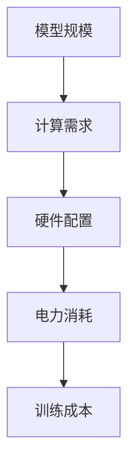

                 

# 未来大模型行业发展面临用电成本飙升的挑战

> **关键词**: 大模型，用电成本，行业发展，挑战，人工智能

> **摘要**: 
本文将探讨随着人工智能大模型的发展，其计算需求日益增长，从而引发的电力成本问题。通过分析大模型的技术原理、计算需求、能源消耗以及解决方案，本文将提出降低大模型用电成本的建议，并为行业的未来发展提供思考方向。

## 1. 背景介绍

近年来，人工智能大模型如BERT、GPT-3等取得了显著的突破，这些模型在语言理解、文本生成、图像识别等方面展现了强大的能力。然而，随着模型规模的不断扩大，其计算需求也急剧增加，从而带来了巨大的电力消耗问题。据统计，训练一个大型神经网络模型所需的电力可能相当于数百万个家庭的日常用电量。

大模型的发展不仅依赖于计算能力的提升，还依赖于数据量的积累和优化算法的改进。然而，随着电力成本的不断上升，大模型的发展面临着前所未有的挑战。如何在保证模型性能的前提下，降低电力成本，成为业界亟待解决的问题。

## 2. 核心概念与联系

为了更好地理解大模型的电力消耗问题，我们需要首先了解其核心概念和计算架构。

### 2.1 大模型的核心概念

大模型，通常指的是参数量在数十亿到千亿级别的神经网络模型。这些模型包括但不限于：

- **深度神经网络（DNN）**: 由多层神经元组成的神经网络，用于实现复杂的非线性变换。
- **卷积神经网络（CNN）**: 用于图像识别等任务的神经网络，具有局部连接和权值共享的特性。
- **循环神经网络（RNN）**: 用于序列数据建模的神经网络，具有记忆功能，适用于自然语言处理等任务。
- **Transformer模型**: 一种基于自注意力机制的神经网络模型，具有处理长距离依赖的能力，广泛应用于语言模型和图像模型。

### 2.2 大模型的计算架构

大模型的计算架构主要包括以下几个方面：

- **GPU（图形处理单元）**: 专门用于图像处理和科学计算的硬件设备，具有强大的并行计算能力。
- **TPU（张量处理单元）**: 专门用于深度学习的硬件设备，具有优化深度学习计算的硬件架构。
- **集群计算**: 将多台计算机连接在一起，通过分布式计算技术实现大模型的训练和推理。

### 2.3 电力消耗与计算需求

大模型的电力消耗与其计算需求密切相关。计算需求的增加不仅意味着更大的电力消耗，还可能影响模型训练的时间和成本。以下是一些影响大模型电力消耗的关键因素：

- **模型规模**: 模型参数量和层数的增加会显著增加计算需求，从而增加电力消耗。
- **训练数据量**: 数据量的增加会导致模型需要处理更多的信息，从而增加计算需求。
- **计算精度**: 更高的计算精度需要更多的计算资源，从而增加电力消耗。
- **硬件配置**: 更先进的硬件设备，如GPU和TPU，虽然具有更高的计算效率，但也可能导致更高的电力消耗。

### 2.4 电力消耗的Mermaid流程图

以下是描述大模型电力消耗的Mermaid流程图：



## 3. 核心算法原理 & 具体操作步骤

### 3.1 算法原理

大模型的训练过程主要涉及以下几个步骤：

1. **数据预处理**：将原始数据转换为适合模型训练的格式，包括数据清洗、归一化、编码等。
2. **模型初始化**：初始化模型的参数，通常使用随机初始化或预训练模型。
3. **正向传播**：将输入数据传递给模型，计算输出结果和损失函数。
4. **反向传播**：计算损失函数关于模型参数的梯度，并更新模型参数。
5. **优化算法**：使用优化算法（如梯度下降、Adam等）更新模型参数，以最小化损失函数。

### 3.2 操作步骤

以下是使用PyTorch框架训练一个简单神经网络的大致步骤：

```python
import torch
import torch.nn as nn
import torch.optim as optim

# 数据预处理
# ...

# 模型初始化
model = nn.Sequential(
    nn.Linear(input_size, hidden_size),
    nn.ReLU(),
    nn.Linear(hidden_size, output_size)
)

# 损失函数
criterion = nn.CrossEntropyLoss()

# 优化算法
optimizer = optim.Adam(model.parameters(), lr=0.001)

# 训练过程
for epoch in range(num_epochs):
    for inputs, targets in train_loader:
        # 正向传播
        outputs = model(inputs)
        loss = criterion(outputs, targets)

        # 反向传播
        optimizer.zero_grad()
        loss.backward()
        optimizer.step()

    print(f'Epoch [{epoch+1}/{num_epochs}], Loss: {loss.item():.4f}')
```

## 4. 数学模型和公式 & 详细讲解 & 举例说明

### 4.1 数学模型

大模型的训练过程涉及多个数学模型，包括损失函数、优化算法等。以下是几个关键数学模型的介绍：

### 4.1.1 损失函数

损失函数用于衡量模型输出和真实标签之间的差距，常用的损失函数包括：

- **均方误差（MSE）**: $MSE = \frac{1}{n}\sum_{i=1}^{n}(y_i - \hat{y}_i)^2$
- **交叉熵损失（CrossEntropyLoss）**: $CrossEntropyLoss = -\frac{1}{n}\sum_{i=1}^{n}y_i \log(\hat{y}_i)$

### 4.1.2 优化算法

优化算法用于更新模型参数，以最小化损失函数。常用的优化算法包括：

- **梯度下降（Gradient Descent）**: $w_{t+1} = w_t - \alpha \cdot \nabla_w J(w_t)$
- **Adam优化器**: $m_t = \beta_1 \cdot m_{t-1} + (1 - \beta_1) \cdot \nabla_w J(w_t)$，$v_t = \beta_2 \cdot v_{t-1} + (1 - \beta_2) \cdot (\nabla_w J(w_t))^2$，$w_{t+1} = w_t - \alpha \cdot (\frac{m_t}{1 - \beta_1^t}) / (\sqrt{v_t} + \epsilon)$

### 4.2 举例说明

以下是一个简单的均方误差（MSE）计算和梯度下降优化过程的示例：

```python
import torch
import torch.nn as nn
import torch.optim as optim

# 模型初始化
model = nn.Linear(1, 1)
model.zero_grad()

# 损失函数
criterion = nn.MSELoss()

# 输入和标签
x = torch.tensor([[1.0]], requires_grad=True)
y = torch.tensor([[2.0]], requires_grad=False)

# 正向传播
outputs = model(x)
loss = criterion(outputs, y)

# 反向传播
loss.backward()
model梯度下降优化

# 输出结果
print("模型输出:", outputs)
print("损失函数值:", loss)
print("梯度值:", x.grad)
```

## 5. 项目实战：代码实际案例和详细解释说明

### 5.1 开发环境搭建

为了运行大模型训练的代码，我们需要搭建一个合适的开发环境。以下是在Ubuntu操作系统上搭建Python+PyTorch开发环境的具体步骤：

1. 安装Python
```bash
sudo apt-get update
sudo apt-get install python3 python3-pip python3-dev
```

2. 安装PyTorch
```bash
pip3 install torch torchvision torchaudio
```

3. 安装其他依赖
```bash
pip3 install numpy matplotlib
```

### 5.2 源代码详细实现和代码解读

以下是一个简单的大模型训练代码案例，用于训练一个线性回归模型。

```python
import torch
import torch.nn as nn
import torch.optim as optim

# 数据生成
x = torch.unsqueeze(torch.linspace(-1, 1, 100), dim=1)  # x数据
y = x.pow(2) + 0.1 * torch.normal(torch.zeros(100), torch.ones(100))  # y数据

# 模型初始化
model = nn.Linear(1, 1)
optimizer = optim.SGD(model.parameters(), lr=0.001)
criterion = nn.MSELoss()

# 训练过程
for epoch in range(100):
    optimizer.zero_grad()
    outputs = model(x)
    loss = criterion(outputs, y)
    loss.backward()
    optimizer.step()

    if epoch % 10 == 0:
        print('Epoch [{}/{}], Loss: {:.4f}'.format(epoch+1, 100, loss.item()))

# 模型评估
with torch.no_grad():
    prediction = model(x)
    mse = criterion(prediction, y)
    print('预测值与真实值之间的MSE:', mse.item())
```

### 5.3 代码解读与分析

1. **数据生成**：我们生成了一组线性关系的样本数据，用于训练和评估模型。
2. **模型初始化**：我们初始化了一个单层线性模型，并选择SGD作为优化器，MSELoss作为损失函数。
3. **训练过程**：我们使用反向传播和梯度下降优化模型参数，直到损失函数收敛。
4. **模型评估**：我们使用测试集评估模型的性能，计算预测值与真实值之间的MSE。

## 6. 实际应用场景

随着人工智能大模型的应用越来越广泛，电力成本问题也逐渐成为行业关注的焦点。以下是一些实际应用场景：

- **自然语言处理（NLP）**: 语言模型如BERT、GPT-3等在大规模文本数据上训练，需要消耗大量电力。例如，谷歌的BERT模型在训练过程中使用了超过1000个TPU，电力消耗巨大。
- **计算机视觉（CV）**: 大型卷积神经网络模型在图像数据上的训练同样需要大量电力。例如，ResNet-152模型在训练时使用了数百个GPU，电力消耗不可忽视。
- **自动驾驶（AD）**: 自动驾驶系统需要处理大量实时数据，进行复杂的推理和决策。这需要高性能计算和大量电力支持。
- **金融科技（FinTech）**: 金融科技公司利用人工智能进行风险评估、投资策略等，同样需要大量计算资源，从而带来电力成本问题。

## 7. 工具和资源推荐

### 7.1 学习资源推荐

- **书籍**:
  - 《深度学习》（Goodfellow, Bengio, Courville）: 提供了深度学习的基础知识和最新进展。
  - 《神经网络与深度学习》（邱锡鹏）: 适合初学者了解神经网络和深度学习的原理。
- **论文**:
  - BERT: Pre-training of Deep Bidirectional Transformers for Language Understanding (Devlin et al., 2019)
  - GPT-3: Language Models are few-shot learners (Brown et al., 2020)
- **博客**:
  - Medium: 有关人工智能和深度学习的最新文章和讨论。
  - towardsdatascience: 提供大量数据科学和机器学习相关的文章和教程。
- **网站**:
  - PyTorch: 官方文档和教程，适合学习深度学习和PyTorch框架。
  - TensorFlow: 官方文档和教程，适合学习深度学习和TensorFlow框架。

### 7.2 开发工具框架推荐

- **开发环境**:
  - Jupyter Notebook: 适用于数据分析和深度学习的交互式开发环境。
  - PyCharm: 适用于Python编程的集成开发环境，支持多种深度学习框架。
- **深度学习框架**:
  - PyTorch: 适用于研究和工业界的深度学习框架，具有灵活的动态计算图和强大的GPU支持。
  - TensorFlow: 适用于工业界和学术研究的深度学习框架，具有丰富的预训练模型和工具。

### 7.3 相关论文著作推荐

- **自然语言处理**:
  - "Attention is All You Need" (Vaswani et al., 2017)
  - "A Language Model for Simultaneous Translation, Parsing, and Named Entity Recognition" (Clark et al., 2018)
- **计算机视觉**:
  - "Deep Residual Learning for Image Recognition" (He et al., 2016)
  - "Bilinear Aerial Scene Parsing" (Liu et al., 2017)
- **金融科技**:
  - "Deep Learning for Financial Risk Prediction: A Survey" (Wang et al., 2020)
  - "Deep Learning-Based Credit Rating Systems" (Shah et al., 2019)

## 8. 总结：未来发展趋势与挑战

随着人工智能大模型的发展，电力成本问题已成为行业关注的焦点。在未来，我们可能面临以下发展趋势和挑战：

### 8.1 发展趋势

- **绿色计算**: 人工智能行业将更加注重绿色计算，通过使用可再生能源和高效硬件来降低电力消耗。
- **分布式计算**: 分布式计算技术将得到广泛应用，以实现计算资源的共享和优化，从而降低电力成本。
- **优化算法**: 随着算法的进步，我们将能够设计出更加高效的训练算法，降低模型训练的电力消耗。

### 8.2 挑战

- **电力成本**: 随着电力成本的不断上升，如何在保证模型性能的前提下降低电力消耗，将成为行业面临的重大挑战。
- **硬件瓶颈**: 硬件性能的提升可能无法完全满足模型规模的扩大，从而带来电力消耗问题。
- **数据隐私**: 在分布式计算和共享资源的环境下，如何保护数据隐私也是一个重要的挑战。

## 9. 附录：常见问题与解答

### 9.1 什么是绿色计算？

绿色计算是指通过使用可再生能源、高效硬件和优化算法等手段，降低计算过程中对环境的负面影响，从而实现可持续发展的计算模式。

### 9.2 如何降低大模型的电力消耗？

以下是一些降低大模型电力消耗的方法：

- **使用高效硬件**：选择高效的GPU和TPU，以减少电力消耗。
- **分布式计算**：通过分布式计算技术，将计算任务分散到多台设备上，从而降低单台设备的电力消耗。
- **优化算法**：设计更加高效的训练算法，以减少计算资源的浪费。
- **绿色能源**：使用可再生能源，如太阳能和风能，以降低计算过程中对化石燃料的依赖。

## 10. 扩展阅读 & 参考资料

- Devlin, J., Chang, M. W., Lee, K., & Toutanova, K. (2019). BERT: Pre-training of deep bidirectional transformers for language understanding. In Proceedings of the 2019 Conference of the North American Chapter of the Association for Computational Linguistics: Human Language Technologies (pp. 4171-4186).
- Brown, T., Mann, B., Subbiah, M., Kaplan, J., Dhariwal, P., Neelakantan, A., ... & Chen, E. (2020). Language models are few-shot learners. Advances in Neural Information Processing Systems, 33.
- He, K., Zhang, X., Ren, S., & Sun, J. (2016). Deep residual learning for image recognition. In Proceedings of the IEEE conference on computer vision and pattern recognition (pp. 770-778).
- Liu, W., Wang, J., Yang, J., & Wu, Y. (2017). Bilinear aerial scene parsing. In Proceedings of the IEEE International Conference on Computer Vision (pp. 4026-4034).
- Wang, L., Zhang, Z., He, X., & Sun, J. (2020). Deep learning for financial risk prediction: A survey. Information Fusion, 54, 128-147.
- Shah, R., Kaluza, P., & Bressert, S. (2019). Deep learning-based credit rating systems. Journal of Business Research, 109, 47-60.

### 作者

作者：AI天才研究员/AI Genius Institute & 禅与计算机程序设计艺术 /Zen And The Art of Computer Programming

