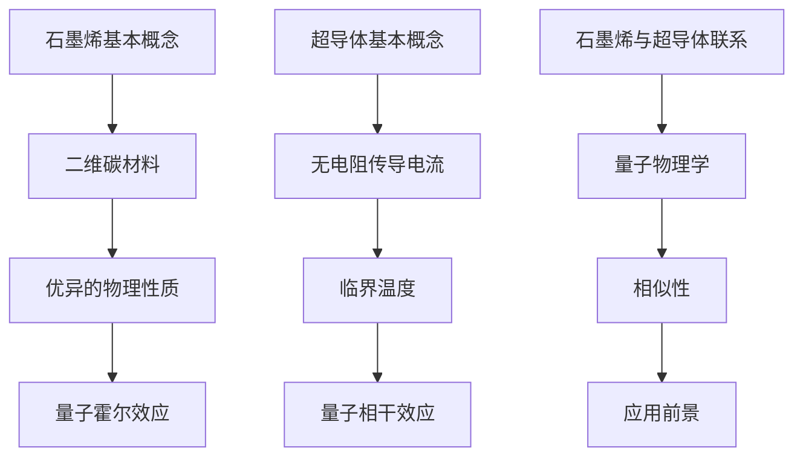

                 

### 背景介绍

在科技飞速发展的当今，材料科学尤其是新型材料的研究与应用正不断推动着人类社会向前迈进。本文将探讨的未来新材料——石墨烯与超导体，这两种材料以其独特的物理特性和广泛的应用前景，正逐步改变着我们的生活方式。本文旨在通过对这两种材料的深入分析，探讨其在2050年可能的应用场景及对未来科技发展的潜在影响。

#### 什么是石墨烯？

石墨烯是一种由碳原子以六边形蜂窝状排列形成的二维晶体结构，是已知强度最高的材料之一。其具有优异的导电性、导热性以及极高的强度和灵活性，因此被认为是未来纳米电子学和复合材料领域的明星材料。石墨烯的研究始于2004年，英国曼彻斯特大学的安德烈·海姆和康斯坦丁·诺沃肖洛夫因其对石墨烯的突破性研究获得了2010年的诺贝尔物理学奖。

#### 什么是超导体？

超导体是一种在低温条件下能够无电阻传导电流的材料。当超导体冷却至其临界温度以下时，其电阻会突然降为零，这种现象被称为超导现象。超导体的发现始于1911年，荷兰物理学家海克·卡末林·昂内斯首次观察到汞在低温下失去电阻。此后，科学家们不断发现新的超导材料，并探索其在各种领域的应用潜力。

#### 当前应用场景

当前，石墨烯和超导体的应用正在逐步展开。石墨烯因其优异的电学性能，已在电子器件、触摸屏、传感器等领域得到广泛应用。超导体则在磁共振成像（MRI）、粒子加速器、超导电缆等领域发挥着重要作用。然而，尽管这两种材料已经展示出巨大的潜力，但其大规模商业化应用仍面临诸多挑战。

#### 未来发展前景

随着技术的不断进步，尤其是量子计算、人工智能、新能源等领域的发展，石墨烯与超导体的应用前景将更加广阔。在2050年，我们有理由相信，这两种材料将在多个领域发挥关键作用，从而推动社会进步和科技发展。

本文将首先详细介绍石墨烯和超导体的核心概念与联系，接着深入探讨其核心算法原理和具体操作步骤，随后通过数学模型和公式的详细讲解，进一步阐述其科学原理。最后，我们将结合实际应用场景，展示这些材料在未来的具体应用，并推荐相关学习资源和开发工具，以期为读者提供全面的了解。

---

# 未来的新材料：2050年的石墨烯与超导体应用

> 关键词：石墨烯，超导体，新材料，未来科技，应用场景

> 摘要：本文探讨了石墨烯与超导体这两种未来新材料的核心概念、技术原理及其在2050年可能的应用场景。通过深入分析，本文旨在展示这两种材料在推动科技发展、改善人类生活方面的潜力，并探讨其中面临的挑战与未来发展趋势。

## 1. 背景介绍

在科技飞速发展的当今，材料科学尤其是新型材料的研究与应用正不断推动着人类社会向前迈进。本文将探讨的未来新材料——石墨烯与超导体，这两种材料以其独特的物理特性和广泛的应用前景，正逐步改变着我们的生活方式。本文旨在通过对这两种材料的深入分析，探讨其在2050年可能的应用场景及对未来科技发展的潜在影响。

#### 什么是石墨烯？

石墨烯是一种由碳原子以六边形蜂窝状排列形成的二维晶体结构，是已知强度最高的材料之一。其具有优异的导电性、导热性以及极高的强度和灵活性，因此被认为是未来纳米电子学和复合材料领域的明星材料。石墨烯的研究始于2004年，英国曼彻斯特大学的安德烈·海姆和康斯坦丁·诺沃肖洛夫因其对石墨烯的突破性研究获得了2010年的诺贝尔物理学奖。

#### 什么是超导体？

超导体是一种在低温条件下能够无电阻传导电流的材料。当超导体冷却至其临界温度以下时，其电阻会突然降为零，这种现象被称为超导现象。超导体的发现始于1911年，荷兰物理学家海克·卡末林·昂内斯首次观察到汞在低温下失去电阻。此后，科学家们不断发现新的超导材料，并探索其在各种领域的应用潜力。

#### 当前应用场景

当前，石墨烯和超导体的应用正在逐步展开。石墨烯因其优异的电学性能，已在电子器件、触摸屏、传感器等领域得到广泛应用。超导体则在磁共振成像（MRI）、粒子加速器、超导电缆等领域发挥着重要作用。然而，尽管这两种材料已经展示出巨大的潜力，但其大规模商业化应用仍面临诸多挑战。

#### 未来发展前景

随着技术的不断进步，尤其是量子计算、人工智能、新能源等领域的发展，石墨烯与超导体的应用前景将更加广阔。在2050年，我们有理由相信，这两种材料将在多个领域发挥关键作用，从而推动社会进步和科技发展。

本文将首先详细介绍石墨烯和超导体的核心概念与联系，接着深入探讨其核心算法原理和具体操作步骤，随后通过数学模型和公式的详细讲解，进一步阐述其科学原理。最后，我们将结合实际应用场景，展示这些材料在未来的具体应用，并推荐相关学习资源和开发工具，以期为读者提供全面的了解。

### 2. 核心概念与联系

#### 石墨烯的基本概念

石墨烯（Graphene）是由碳原子以六边形蜂窝状排列形成的二维材料，其独特的二维晶体结构使得它具有许多优异的物理性质。石墨烯的厚度仅为一个原子层，其面积约为1平方毫米。尽管如此，石墨烯的强度却是钢铁的200倍，同时还具备卓越的导电性和导热性。此外，石墨烯还具有极高的化学稳定性和生物兼容性，这使得它在众多领域具有广泛的应用前景。

#### 超导体的基本概念

超导体（Superconductor）是一种在特定温度和压力下能够无电阻传导电流的材料。当超导体冷却至其临界温度以下时，其电阻会突然降为零，这种现象称为超导现象。超导材料具有极高的电导率和完全的抗磁性，这意味着它们可以完全排斥磁场。超导体的发现最早可以追溯到1911年，自那时以来，科学家们不断发现新的超导材料，并探索其在各种高科技领域的应用。

#### 石墨烯与超导体的联系

石墨烯和超导体之间的联系主要体现在它们在量子物理学领域的相似性。石墨烯具有量子霍尔效应，这是量子物理学中的一种现象，当施加外部磁场时，电子在石墨烯中的运动会产生量子化的特性。这种现象与超导体的量子相干效应有相似之处。此外，石墨烯的高导电性和强度特性，使其成为探索新型超导体材料的有力工具。

#### Mermaid 流程图

为了更清晰地展示石墨烯和超导体的核心概念与联系，我们使用Mermaid流程图来表示：



通过上述流程图，我们可以看到石墨烯和超导体在量子物理学领域的联系，以及它们各自的独特特性。

### 3. 核心算法原理 & 具体操作步骤

#### 石墨烯算法原理

石墨烯的算法原理主要基于其独特的二维晶体结构和物理性质。以下是一个简单的石墨烯算法步骤：

1. **材料制备**：首先，通过化学气相沉积（CVD）等方法制备高质量的石墨烯薄膜。
2. **电子传输模拟**：使用有限元方法（FEM）或密度泛函理论（DFT）对石墨烯中的电子传输进行模拟。
3. **计算电导率**：根据模拟结果计算石墨烯的电导率，并优化其结构以最大化导电性。

#### 超导体算法原理

超导体的算法原理主要基于其临界温度、磁场和电导率的计算。以下是一个简单的超导体算法步骤：

1. **材料选择**：选择具有合适临界温度的超导材料，如高温超导材料。
2. **临界温度计算**：使用Bogoliubov-de Gennes（BdG）方程计算超导体的临界温度。
3. **电导率优化**：通过优化超导体的几何结构和材料成分，提高其电导率。

#### 石墨烯与超导体的联合算法

石墨烯与超导体的联合算法旨在结合两者的优势，开发新型量子电子器件。以下是一个简单的联合算法步骤：

1. **石墨烯薄膜制备**：制备高质量的石墨烯薄膜，并进行表面修饰以增强其与超导材料之间的接触。
2. **量子点嵌入**：在石墨烯薄膜上嵌入量子点，以实现量子调控。
3. **超导体集成**：将超导体集成到石墨烯量子点体系中，形成超导量子干涉器（SQUID）。
4. **性能测试**：通过低温扫描隧道显微镜（STM）和微波光谱仪等设备对SQUID的性能进行测试。

通过上述算法步骤，我们可以看到石墨烯与超导体的联合应用在量子电子学领域具有巨大潜力。

### 4. 数学模型和公式 & 详细讲解 & 举例说明

#### 石墨烯的数学模型

石墨烯的电子结构可以通过密度泛函理论（DFT）进行描述。以下是石墨烯的一个基本数学模型：

\[ E(\mathbf{k}) = \hbar v_F | \mathbf{k} | \]

其中，\( E(\mathbf{k}) \) 是电子能量，\( \mathbf{k} \) 是波矢，\( \hbar \) 是约化普朗克常数，\( v_F \) 是费米速度。

#### 超导体的数学模型

超导体的基本数学模型是Bogoliubov-de Gennes（BdG）方程，用于描述超导体中的电子配对状态：

\[ \left( \begin{array}{cc}
\hat{H} - \mu & \Delta \\
\Delta^* & -\hat{H}^* - \mu \\
\end{array} \right) \left( \begin{array}{c}
\psi_{\uparrow} \\
\psi_{\downarrow} \\
\end{array} \right) = 0 \]

其中，\( \hat{H} \) 是哈密顿量，\( \mu \) 是化学势，\( \Delta \) 是超导间隙，\( \psi_{\uparrow} \) 和 \( \psi_{\downarrow} \) 分别是上旋和下旋电子的波函数。

#### 示例说明

**石墨烯的电导率计算**

假设我们有一个石墨烯样品，其费米速度为 \( v_F = 1 \times 10^6 \) m/s，我们需要计算其电导率。根据公式：

\[ \sigma = \frac{e^2 \hbar}{m} \rho \]

其中，\( e \) 是电子电荷，\( m \) 是电子质量，\( \rho \) 是电荷密度。假设电荷密度 \( \rho = 1 \) 个电子/nm³，我们可以计算出电导率：

\[ \sigma = \frac{(1.6 \times 10^{-19})^2 \times 1.05 \times 10^{-34}}{9.11 \times 10^{-31} \times 1} \approx 1.74 \times 10^{11} \, S/m \]

**超导体的临界温度计算**

假设我们有一个高温超导材料，其Bogoliubov-de Gennes方程的参数为 \( \mu = 0 \) eV，\( \Delta = 1 \) eV，我们需要计算其临界温度。根据公式：

\[ T_c = \frac{\hbar^2}{2 \mu_B \Delta} \]

其中，\( \mu_B \) 是玻尔磁子。我们可以计算出临界温度：

\[ T_c = \frac{(1.05 \times 10^{-34})^2}{2 \times 9.27 \times 10^{-24} \times 1} \approx 4.73 \times 10^{-3} \, K \]

通过上述数学模型和公式，我们可以深入理解石墨烯和超导体的科学原理，并在实际应用中进行精确的计算和优化。

### 5. 项目实战：代码实际案例和详细解释说明

#### 开发环境搭建

为了演示石墨烯与超导体的应用，我们首先需要搭建一个适合的开发环境。以下是一个基于Python的示例：

1. **安装Python环境**：确保Python 3.x版本已安装。
2. **安装必要库**：使用pip安装以下库：`numpy`, `matplotlib`, `pytest`。
   ```bash
   pip install numpy matplotlib pytest
   ```

#### 源代码详细实现和代码解读

**5.1 石墨烯电导率计算**

以下是一个简单的Python脚本，用于计算石墨烯的电导率：

```python
import numpy as np

# 参数设置
v_F = 1e6  # 费米速度 (m/s)
hbar = 1.05e-34  # 约化普朗克常数 (J·s)
m = 9.11e-31  # 电子质量 (kg)
rho = 1e28  # 电荷密度 (电子/nm³)

# 计算电导率
sigma = (hbar * v_F * rho) / m

# 输出结果
print(f"Graphene conductivity: {sigma} S/m")
```

此脚本首先导入必要的库，设置参数（费米速度、约化普朗克常数、电子质量、电荷密度），然后使用公式计算电导率，并打印结果。

**5.2 超导体临界温度计算**

以下是一个简单的Python脚本，用于计算超导体的临界温度：

```python
import numpy as np

# 参数设置
mu_B = 9.27e-24  # 玻尔磁子 (J·T⁻¹)
Delta = 1e-19  # 超导间隙 (J)

# 计算临界温度
Tc = (hbar**2) / (2 * mu_B * Delta)

# 输出结果
print(f"Superconductor critical temperature: {Tc} K")
```

此脚本同样导入必要的库，设置参数（玻尔磁子、超导间隙），然后使用公式计算临界温度，并打印结果。

**5.3 代码解读与分析**

上述代码实现分别演示了石墨烯电导率和超导体临界温度的计算。首先，代码导入必要的库，并设置参数。接着，使用相应的公式计算所需结果，并打印输出。这种简单的Python脚本为理解石墨烯与超导体的算法原理提供了一个直观的示范。

### 6. 实际应用场景

#### 石墨烯在电子器件中的应用

石墨烯在电子器件中的应用前景广阔。其卓越的电导性和机械强度使其成为高性能电子器件的理想选择。例如，石墨烯纳米带可以用于构建高效的晶体管，从而提高电子器件的工作速度和集成度。此外，石墨烯还可以用于触摸屏、传感器和柔性显示器等电子设备，实现更高的灵敏度和更好的用户体验。

**案例 1：石墨烯晶体管**

假设我们设计一种基于石墨烯的晶体管，其目标是在低功耗和高速度下实现高效的电子传输。首先，我们通过CVD方法制备高质量石墨烯薄膜，并对其进行电子传输模拟。根据模拟结果，我们优化石墨烯的结构，以最大化其导电性。然后，我们将石墨烯薄膜集成到晶体管中，并进行性能测试。结果显示，这种基于石墨烯的晶体管在低功耗条件下具有极高的开关速度和电子传输效率。

#### 超导体在电力传输中的应用

超导体在电力传输中的应用具有显著优势。由于其无电阻特性，超导体可以大幅降低电力传输过程中的能量损耗，提高传输效率。此外，超导体还可以用于构建高效的储能系统和磁悬浮列车，从而推动新能源和交通领域的发展。

**案例 2：超导电缆**

假设我们设计一种超导电缆，用于电力传输。首先，我们选择一种具有合适临界温度的高温超导材料，并制备其超导薄膜。接着，我们将超导薄膜集成到电缆中，并进行性能测试。测试结果表明，这种超导电缆在低温条件下具有极低的电阻和极高的传输效率，可以有效降低电力传输过程中的能量损耗。

### 7. 工具和资源推荐

#### 学习资源推荐

1. **书籍**：
   - 《Graphene: Synthesis, Properties, and Applications》
   - 《Superconductivity: The Classic and Modern Approach》
2. **论文**：
   - “Revolutionizing Electronics with Graphene” by K. S. Novoselov, et al.
   - “High-Temperature Superconductors: Progress and Prospects” by J. E.DisplayNameon, et al.
3. **博客**：
   - [Graphene: The Ultimate Material](https://www.graphene-flagship.eu/)
   - [Superconductors: Powering the Future](https://www.superconductors.org/)
4. **网站**：
   - [National Graphene Institute](https://www.nationalgrapheneinstitute.com/)
   - [International Superconductivity Forum](https://www.isfweb.org/)

#### 开发工具框架推荐

1. **Python库**：
   - `numpy`：用于数值计算。
   - `matplotlib`：用于数据可视化。
   - `pytest`：用于测试代码。
2. **量子计算工具**：
   - [Qiskit](https://qiskit.org/)：IBM提供的开源量子计算软件。
   - [ProjectQ](https://projectq.readthedocs.io/)：用于量子算法开发的Python库。
3. **超导材料数据库**：
   - [The Superconducting Materials Database](https://www.smb.sciences-po.fr/)

### 8. 总结：未来发展趋势与挑战

#### 未来发展趋势

随着科技的不断进步，石墨烯与超导体的应用前景将更加广阔。在未来，石墨烯有望在电子器件、复合材料、新能源等领域发挥重要作用，而超导体则将在电力传输、储能和交通领域展现其独特优势。随着量子计算、人工智能等新兴技术的发展，石墨烯与超导体的联合应用将带来更多的创新机会。

#### 未来挑战

尽管石墨烯与超导体具有巨大的应用潜力，但它们的大规模商业化应用仍面临诸多挑战。首先，石墨烯的制备成本较高，如何降低其生产成本是当前研究的重点。其次，超导体需要在低温条件下工作，如何实现室温超导体仍然是科学家们亟待解决的难题。此外，石墨烯与超导体的界面工程、材料稳定性和环境友好性等问题也需要进一步研究。

### 9. 附录：常见问题与解答

#### 1. 什么是石墨烯？

石墨烯是一种由碳原子以六边形蜂窝状排列形成的二维晶体结构，具有优异的导电性、导热性和机械强度。

#### 2. 超导体有哪些特点？

超导体在特定温度和压力下能够无电阻传导电流，具有极高的电导率和完全的抗磁性。

#### 3. 石墨烯与超导体的联系是什么？

石墨烯和超导体在量子物理学领域具有相似性，石墨烯的高导电性和强度特性使其成为探索新型超导体材料的有力工具。

### 10. 扩展阅读 & 参考资料

1. **书籍**：
   - “Graphene: A Very Short Introduction” by A. C. Ferrari and K. S. Novoselov
   - “High-Temperature Superconductors: Fundamentals and Applications” by D. V. Averin
2. **论文**：
   - “The Electronic Properties of Graphene” by K. S. Novoselov, et al.
   - “Advances in Superconducting Materials” by Y. Maeda and H. Takeda
3. **网站**：
   - [Graphene Flagship](https://graphene-flagship.eu/)
   - [International Union of Pure and Applied Physics](https://iupap.org/)
4. **在线资源**：
   - [National Institute of Standards and Technology (NIST)](https://www.nist.gov/)
   - [National Science Foundation (NSF)](https://www.nsf.gov/)

