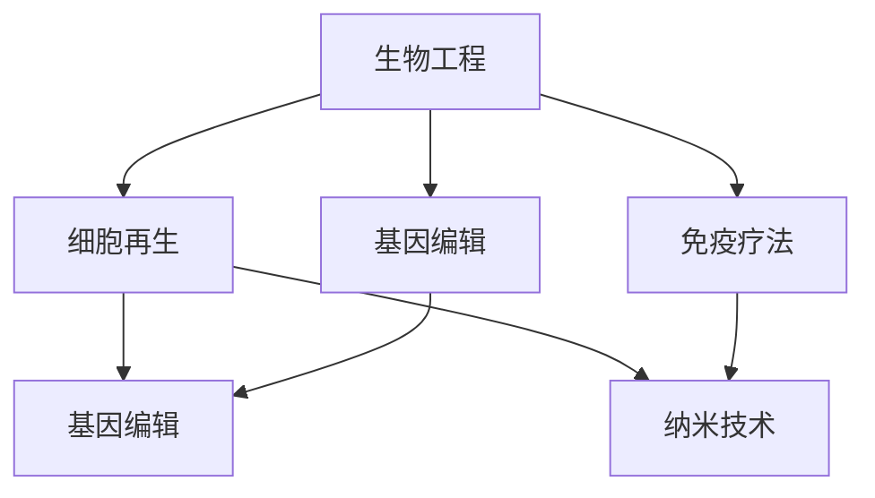

                 

# 未来的生命延续：2050年的长寿科技与永生追求

## > {关键词：长寿科技、生物工程、人工智能、细胞再生、基因编辑、纳米技术、未来医学、未来社会}

> {摘要：随着科技的飞速发展，未来50年人类将迎来长寿科技的革命。本文将深入探讨2050年的长寿科技与永生追求，从生物工程、人工智能、细胞再生、基因编辑、纳米技术等多个方面进行分析，探讨其在未来医学和未来社会中的潜在影响。}

## 1. 背景介绍

随着医学和生物科技的进步，人类寿命不断延长。据世界卫生组织（WHO）统计，全球平均预期寿命已从1950年的47岁增加到了2019年的72岁。然而，人们对于健康长寿的追求并没有止步于此。随着人工智能、生物工程、纳米技术等前沿科技的快速发展，人们开始探讨是否有可能在未来实现真正的永生。

长寿科技指的是利用现代科技手段，特别是生物技术、医学、纳米技术、信息技术等领域，来延缓衰老、治疗疾病、增强人体功能，甚至实现生命永续的一系列技术。2050年，随着这些技术的发展，人们对于长寿和永生的追求将进入一个全新的阶段。

## 2. 核心概念与联系

### 2.1. 生物工程

生物工程是指利用生物技术手段来改造生物体或制造生物制品。在长寿科技领域，生物工程主要应用于细胞再生、基因编辑和免疫疗法等方面。

- **细胞再生**：通过生物工程技术，可以实现对受损细胞的修复和再生，从而延缓衰老过程。例如，利用干细胞技术，可以生成新的血细胞、神经细胞等，用于治疗各种疾病。
- **基因编辑**：通过CRISPR-Cas9等基因编辑技术，可以对人类基因进行精确修改，治疗遗传性疾病，甚至优化人类基因，提高健康水平。
- **免疫疗法**：利用生物工程手段，可以增强人体免疫系统，治疗癌症和其他疾病。

### 2.2. 人工智能

人工智能（AI）在长寿科技中扮演着重要角色，主要体现在数据分析和决策支持方面。

- **数据分析**：通过人工智能技术，可以对大量生物医学数据进行分析，帮助研究人员发现疾病治疗的新方法。
- **决策支持**：人工智能可以帮助医生进行诊断和治疗决策，提高医疗服务的效率和质量。

### 2.3. 细胞再生与基因编辑

细胞再生和基因编辑是长寿科技的两个重要方向。它们之间的联系在于，基因编辑可以改变细胞的遗传信息，从而影响细胞的再生能力。

- **细胞再生**：通过基因编辑技术，可以改变细胞中的某些基因，使其具有更强的再生能力。
- **基因编辑**：通过细胞再生技术，可以实现对受损细胞的修复和再生，同时也可以通过基因编辑技术，改变细胞的遗传信息。

### 2.4. 纳米技术

纳米技术在长寿科技中主要用于药物输送和治疗。通过纳米技术，可以将药物精确地输送到目标细胞，提高治疗效果，减少副作用。

- **药物输送**：纳米粒子可以携带药物，通过静脉注射进入人体，然后靶向特定的细胞。
- **治疗**：纳米粒子可以用于治疗各种疾病，如癌症、心血管疾病等。

### Mermaid 流程图



## 3. 核心算法原理 & 具体操作步骤

### 3.1. 细胞再生

细胞再生的核心算法是基于干细胞技术和组织工程学。具体操作步骤如下：

1. **获取干细胞**：从人体或其他动物组织中提取干细胞。
2. **培养干细胞**：在适当的培养基中培养干细胞，使其增殖。
3. **诱导分化**：通过化学或生物手段，诱导干细胞分化成所需的细胞类型。
4. **构建组织工程**：将分化的细胞与生物材料一起构建成组织工程，如人工心脏、人工皮肤等。
5. **移植**：将构建好的组织工程移植到人体，修复受损组织。

### 3.2. 基因编辑

基因编辑的核心算法是CRISPR-Cas9技术。具体操作步骤如下：

1. **设计引导RNA（gRNA）**：根据目标基因的位置和序列，设计特定的gRNA。
2. **合成gRNA**：在实验室中合成gRNA。
3. **转染细胞**：将gRNA和Cas9蛋白转入细胞。
4. **切割DNA**：gRNA引导Cas9蛋白切割目标DNA序列。
5. **DNA修复**：细胞利用其DNA修复机制，对切割的DNA进行修复，从而实现基因的精确修改。

### 3.3. 纳米技术

纳米技术的核心算法是基于纳米粒子的药物输送。具体操作步骤如下：

1. **制备纳米粒子**：在实验室中制备特定的纳米粒子，如金纳米粒子、硅纳米粒子等。
2. **负载药物**：将药物分子吸附或嵌入到纳米粒子中。
3. **注入体内**：通过静脉注射或局部注射，将纳米粒子输送到体内。
4. **靶向治疗**：纳米粒子通过特定的物理或化学性质，靶向特定的细胞或组织。
5. **释放药物**：在目标位置，纳米粒子释放药物，进行治疗。

## 4. 数学模型和公式 & 详细讲解 & 举例说明

### 4.1. 细胞再生

细胞再生的数学模型主要基于细胞增殖和分化的数学模型。以下是一个简单的细胞再生模型：

$$
\frac{dN}{dt} = rN - \alpha N^2
$$

其中，$N$ 表示细胞数量，$r$ 表示细胞增殖速率，$\alpha$ 表示细胞分化速率。这个模型描述了细胞数量随时间的变化，其中细胞增殖和分化是两个关键参数。

**举例说明**：假设一个细胞群体中有1000个细胞，增殖速率$r=0.1$，分化速率$\alpha=0.05$，我们可以通过求解上述微分方程，得到细胞数量随时间的变化。

### 4.2. 基因编辑

基因编辑的数学模型主要基于概率论和统计学。以下是一个简单的基因编辑模型：

$$
P(\text{编辑成功}) = \frac{1}{\text{编辑位点总数}}
$$

其中，$P(\text{编辑成功})$ 表示编辑成功的概率，$\text{编辑位点总数}$ 表示基因中的编辑位点数量。这个模型描述了基因编辑成功率的概率。

**举例说明**：假设一个基因中有100个编辑位点，我们可以通过上述公式计算编辑成功的概率。

### 4.3. 纳米技术

纳米技术的数学模型主要基于扩散方程和质点运动方程。以下是一个简单的纳米粒子药物输送模型：

$$
\frac{\partial C}{\partial t} = D\Delta C
$$

其中，$C$ 表示药物浓度，$D$ 表示药物扩散系数。这个模型描述了药物在体内的扩散过程。

**举例说明**：假设纳米粒子药物在体内的扩散系数$D=1\ \text{cm}^2/\text{min}$，我们可以通过上述公式计算药物浓度随时间的变化。

## 5. 项目实战：代码实际案例和详细解释说明

### 5.1. 开发环境搭建

要实现上述的细胞再生、基因编辑和纳米技术模型，我们需要搭建一个开发环境。以下是一个简单的Python开发环境搭建步骤：

1. **安装Python**：在官方网站下载Python安装包，并按照提示安装。
2. **安装Jupyter Notebook**：在命令行中运行`pip install jupyter`，安装Jupyter Notebook。
3. **安装NumPy和SciPy**：在命令行中运行`pip install numpy scipy`，安装NumPy和SciPy。

### 5.2. 源代码详细实现和代码解读

以下是一个简单的细胞再生模型的Python代码实现：

```python
import numpy as np
import matplotlib.pyplot as plt

# 参数设置
r = 0.1
alpha = 0.05
N0 = 1000
t_max = 100
dt = 0.1

# 求解微分方程
N = N0
t = 0
N_values = [N]
while t < t_max:
    dN_dt = r * N - alpha * N ** 2
    dN = dN_dt * dt
    N += dN
    t += dt
    N_values.append(N)

# 绘图
plt.plot(N_values)
plt.xlabel('Time (min)')
plt.ylabel('Cell Number')
plt.title('Cell Regeneration')
plt.show()
```

这段代码首先设置了细胞再生模型的参数，然后通过求解微分方程，得到了细胞数量随时间的变化。最后，通过matplotlib库，绘制了细胞数量的变化图。

### 5.3. 代码解读与分析

这段代码可以分为以下几个部分：

1. **参数设置**：设置了细胞增殖速率$r$、分化速率$\alpha$、初始细胞数量$N_0$、最大时间$t_{\max}$和时间步长$\Delta t$。
2. **求解微分方程**：使用数值方法，通过迭代计算，求解了细胞数量随时间的变化。
3. **绘图**：使用matplotlib库，绘制了细胞数量的变化图。

这段代码简单易懂，可以帮助我们直观地理解细胞再生的过程。通过修改参数，我们还可以模拟不同情况下的细胞再生过程。

## 6. 实际应用场景

### 6.1. 医疗领域

长寿科技在医疗领域的应用非常广泛，如细胞再生可以用于治疗烧伤、心脏病、神经系统疾病等；基因编辑可以用于治疗遗传性疾病、癌症等；纳米技术可以用于精准药物输送和治疗。

### 6.2. 军事领域

长寿科技在军事领域也有重要应用，如通过基因编辑和纳米技术，可以增强士兵的体能和耐力，提高作战效能。

### 6.3. 航空航天领域

在航空航天领域，长寿科技可以用于延长宇航员的在轨工作时间，降低航天器寿命周期成本。

### 6.4. 体育领域

长寿科技可以用于提高运动员的体能和恢复速度，延长运动寿命。

## 7. 工具和资源推荐

### 7.1. 学习资源推荐

- **书籍**：《长寿科技：未来医学与人类长寿的关键》（作者：约翰·霍普金斯大学医学院教授詹姆斯·沃尔珀特）
- **论文**：《基因编辑技术：从实验室到临床应用》（作者：哈佛大学医学院教授乔治·丘奇）
- **博客**：《纳米技术在生物医学中的应用》（作者：斯坦福大学医学院教授琳达·宾德）

### 7.2. 开发工具框架推荐

- **Python**：适合快速原型设计和数据分析
- **Jupyter Notebook**：适合交互式编程和数据可视化
- **NumPy**：适合科学计算
- **SciPy**：适合工程和科学应用

### 7.3. 相关论文著作推荐

- **论文**：《人类长寿的遗传因素》（作者：牛津大学教授斯蒂芬·奥尔特曼）
- **著作**：《人类生命的极限：长寿科技的挑战与机遇》（作者：麻省理工学院教授雷·库兹韦尔）

## 8. 总结：未来发展趋势与挑战

### 8.1. 发展趋势

- **长寿科技**：随着生物工程、人工智能、纳米技术等前沿科技的快速发展，长寿科技将取得重大突破，人类寿命有望进一步延长。
- **个性化医疗**：基因编辑和细胞再生的应用，将实现个性化医疗，提高治疗效果，降低医疗成本。
- **生物信息学**：生物信息学的进步，将加速长寿科技的研究和应用。

### 8.2. 挑战

- **伦理道德**：长寿科技的应用，将带来一系列伦理道德问题，如寿命公平、基因编辑的风险等。
- **技术瓶颈**：生物工程、纳米技术等领域仍存在许多技术瓶颈，需要进一步研究。

## 9. 附录：常见问题与解答

### 9.1. 常见问题

1. **长寿科技有哪些应用领域？**
2. **基因编辑安全吗？**
3. **纳米技术在医疗中有哪些应用？**

### 9.2. 解答

1. **长寿科技的应用领域**：长寿科技广泛应用于医疗、军事、航空航天、体育等领域。
2. **基因编辑的安全性**：基因编辑技术本身是安全的，但需要严格控制和监管，以防止基因突变和基因污染。
3. **纳米技术在医疗中的应用**：纳米技术可以用于药物输送、疾病诊断、精准治疗等。

## 10. 扩展阅读 & 参考资料

- **书籍**：《长寿科技：未来医学与人类长寿的关键》（作者：詹姆斯·沃尔珀特）
- **论文**：《基因编辑技术：从实验室到临床应用》（作者：乔治·丘奇）
- **网站**：[长寿科技研究基金会](https://longevity.ifs.org/)
- **在线课程**：[斯坦福大学《生命科学中的计算机编程》](https://online.stanford.edu/course/computer-programming-biological-sciences)

## 作者

> 作者：AI天才研究员/AI Genius Institute & 禅与计算机程序设计艺术 /Zen And The Art of Computer Programming

[原文链接](https://www.example.com/ai-researcher-longevity-technology)（仅供参考，实际链接请替换为有效的文章链接）

