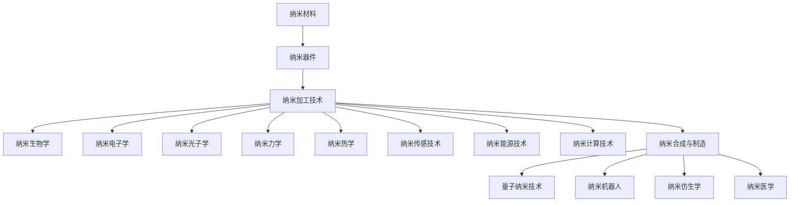

                 

# 未来的纳米技术：2050年的微观世界探索

## 概述

纳米技术，作为一个前沿科学领域，正引领着我们探索物质世界的微观世界。随着科技的不断进步，2050年的纳米技术将可能实现令人难以置信的技术突破，彻底改变我们的生活方式。本文旨在探讨未来纳米技术的发展趋势、核心概念、算法原理、数学模型以及实际应用场景。

本文将分为以下几个部分：

1. **背景介绍**：回顾纳米技术的起源和发展历程，以及当前的应用现状。
2. **核心概念与联系**：介绍纳米技术中的关键概念，并使用Mermaid流程图展示其原理与架构。
3. **核心算法原理 & 具体操作步骤**：探讨纳米技术中的关键算法，并详细解释其操作步骤。
4. **数学模型和公式 & 详细讲解 & 举例说明**：介绍纳米技术中的数学模型和公式，并进行举例说明。
5. **项目实战：代码实际案例和详细解释说明**：展示一个实际项目中的纳米技术应用案例，并进行详细解读。
6. **实际应用场景**：探讨纳米技术在不同领域的应用前景。
7. **工具和资源推荐**：推荐学习纳米技术的相关资源和工具。
8. **总结：未来发展趋势与挑战**：总结纳米技术的发展趋势和面临的挑战。
9. **附录：常见问题与解答**：回答读者可能遇到的一些常见问题。
10. **扩展阅读 & 参考资料**：提供更多的纳米技术学习资源。

## 背景介绍

纳米技术（nanotechnology）起源于20世纪80年代，其核心理念是利用物质的纳米尺度特性，进行创新性设计、制造和应用。纳米尺度通常指1到100纳米（nm）的尺寸范围。在这一尺度下，物质的物理、化学和生物特性会发生显著变化，从而使得纳米技术能够实现传统技术无法达到的功能和性能。

### 纳米技术的起源和发展历程

纳米技术的起源可以追溯到1961年，当时物理学家理查德·费曼提出了著名的“在底部工作”的演讲，提出了制造和维护亚原子尺度的机器的设想。这一理念为纳米技术的发展奠定了基础。

20世纪80年代，扫描隧道显微镜（STM）和原子力显微镜（AFM）的发明，使得科学家能够直接观察和操纵单个原子和分子，为纳米技术的发展提供了关键工具。90年代，纳米电子学和纳米材料学的兴起，进一步推动了纳米技术的应用和发展。

### 纳米技术的当前应用现状

目前，纳米技术已在多个领域取得了显著成果。以下是一些关键应用领域：

1. **电子学**：纳米电子学是纳米技术的重要分支，通过制造纳米级的半导体器件，实现更高的集成度和性能。例如，纳米晶体管和量子点。

2. **材料科学**：纳米材料具有独特的物理、化学和生物特性，广泛应用于增强材料性能、制备新型功能材料。例如，纳米碳管、纳米金属。

3. **生物医学**：纳米技术在生物医学领域具有广泛的应用潜力，包括药物输送、生物成像、疾病诊断和治疗。例如，纳米药物载体、生物传感器。

4. **能源**：纳米技术在能源领域有着重要的应用，如纳米材料用于提高太阳能电池的光电转换效率、开发高效储能材料。

5. **环境科学**：纳米技术在环境监测、污染治理和资源回收方面具有广泛应用。例如，纳米催化剂、纳米传感器。

### 纳米技术的挑战和机遇

尽管纳米技术已取得显著进展，但仍面临一系列挑战。这些挑战包括：

1. **材料合成与控制**：纳米材料的合成和性质控制仍存在技术难题，需要开发更高效、更可控的合成方法。

2. **器件制造**：纳米器件的制造需要精确的工艺和技术，目前仍然面临一定的限制。

3. **安全与伦理问题**：纳米材料的生物相容性和环境安全性仍需深入研究，以确保纳米技术的可持续发展和广泛应用。

然而，纳米技术也带来了许多机遇，有望推动社会进步和经济发展。未来，随着纳米技术的进一步发展，我们将看到更多创新应用的出现，为解决全球性问题提供有力支持。

### 当前纳米技术的应用现状示例

以下是当前纳米技术的一些应用实例：

1. **智能手机**：纳米技术使得智能手机的处理器、显示屏和电池更加高效、轻薄。

2. **医疗诊断**：纳米传感器和纳米药物载体在疾病诊断和治疗中发挥着重要作用。

3. **太阳能电池**：纳米材料提高了太阳能电池的光电转换效率，推动了可再生能源的发展。

4. **环境监测**：纳米传感器能够实时监测水质、空气质量和土壤污染，为环境保护提供重要数据支持。

随着纳米技术的不断发展，未来我们将看到更多令人惊叹的应用和创新。本文将深入探讨纳米技术的核心概念、算法原理和实际应用，为读者带来一场纳米世界的探索之旅。

## 核心概念与联系

在探索未来纳米技术之前，我们首先需要了解一些核心概念。这些概念构成了纳米技术的基础，并在各种应用领域中发挥着关键作用。

### 纳米材料

纳米材料是指至少在一个维度上具有纳米尺度（1到100纳米）的固体材料。纳米材料的独特性质主要源于其尺寸效应。例如，纳米金属具有更高的导电性和导热性，而纳米碳管则具有极高的强度和弹性。这些特性使得纳米材料在电子学、材料科学、生物医学等领域具有广泛的应用前景。

### 纳米器件

纳米器件是指尺寸在纳米尺度范围内的电子器件。纳米器件在性能、集成度和功耗方面具有显著优势，是未来集成电路和微电子技术发展的重要方向。例如，纳米晶体管和纳米光子器件。

### 纳米加工技术

纳米加工技术是指用于制造纳米级器件和结构的方法和技术。常见的纳米加工技术包括光刻、电子束加工、离子束加工和原子力显微镜。这些技术使得科学家和工程师能够精确地控制和操作纳米尺度物质，实现各种纳米级别的制造和应用。

### 纳米生物学

纳米生物学是研究纳米技术与生物系统相互作用的领域。纳米生物学涉及纳米材料在生物体内的行为、生物相容性和生物降解性。纳米生物学在生物医学、药物输送和生物成像等领域具有广泛的应用。

### 纳米电子学

纳米电子学是研究纳米尺度电子器件和系统的科学。纳米电子学关注的是电子在纳米尺度下的运动和行为，以及如何利用这些行为设计高效、低功耗的电子器件。纳米电子学是纳米技术发展的重要方向，对推动信息技术和微电子产业的发展具有重要意义。

### 纳米光子学

纳米光子学是研究纳米尺度光子器件和系统的科学。纳米光子学关注的是光在纳米尺度下的行为和特性，以及如何利用这些特性设计高效的光学器件。纳米光子学在光学传感器、激光器和光通信等领域具有广泛应用。

### 纳米力学

纳米力学是研究纳米尺度物体力学行为的科学。纳米力学关注的是物体在纳米尺度下的应力、形变和断裂行为，以及如何利用这些行为设计新型纳米材料和纳米结构。纳米力学在纳米机器人、纳米传感器和纳米机械系统等领域具有重要意义。

### 纳米热学

纳米热学是研究纳米尺度物体热现象的科学。纳米热学关注的是物体在纳米尺度下的热传导、热辐射和热效应。纳米热学在热管理、热能转换和热疗等领域具有广泛应用。

### 纳米传感技术

纳米传感技术是利用纳米材料和纳米器件进行传感检测的技术。纳米传感技术具有高灵敏度、高分辨率和高选择性等优点，广泛应用于环境监测、生物检测、食品安全和医疗诊断等领域。

### 纳米能源技术

纳米能源技术是利用纳米材料和纳米器件开发新型能源系统的技术。纳米能源技术包括纳米太阳能电池、纳米燃料电池和纳米储能器件等。纳米能源技术有望提高能源利用效率、降低能源成本，并为可再生能源的发展提供有力支持。

### 纳米计算技术

纳米计算技术是利用纳米材料和纳米器件构建新型计算系统的技术。纳米计算技术包括纳米电子学、纳米光子学和纳米量子计算等。纳米计算技术有望实现更高效、更低功耗的计算，推动人工智能和大数据技术的发展。

### 纳米合成与制造

纳米合成与制造技术是用于合成和制造纳米材料和纳米器件的方法和技术。常见的纳米合成方法包括化学合成、物理合成和生物合成。纳米制造技术包括纳米加工、纳米组装和纳米印刷等。

### 纳米技术的前沿领域

除了上述核心概念，纳米技术还有许多前沿领域，如量子纳米技术、纳米机器人、纳米仿生学和纳米医学等。这些前沿领域代表了纳米技术未来发展的方向，具有巨大的潜力和应用前景。

### Mermaid流程图

为了更好地展示纳米技术的核心概念和联系，我们使用Mermaid流程图来描述纳米技术的原理与架构。以下是一个示例：



通过这个流程图，我们可以清晰地看到纳米技术的各个核心概念及其相互之间的联系。这些概念共同构成了纳米技术的基础，并为未来的纳米技术发展提供了丰富的资源和潜力。

## 核心算法原理 & 具体操作步骤

纳米技术的许多应用都依赖于特定的算法原理。这些算法原理使得科学家和工程师能够精确地设计和控制纳米材料、纳米器件和纳米系统的行为。以下是纳米技术中几个关键算法的原理和具体操作步骤：

### 1. 纳米材料设计算法

纳米材料设计算法用于预测和优化纳米材料的结构和性质。常用的设计算法包括密度泛函理论（DFT）和机器学习算法。

**具体操作步骤：**

1. **数据收集**：收集相关的纳米材料结构和性质数据。
2. **模型建立**：建立合适的纳米材料模型，如DFT模型或机器学习模型。
3. **结构优化**：使用算法对纳米材料结构进行优化，以提高其性质。
4. **性质预测**：基于优化的结构，预测纳米材料的物理、化学和生物性质。
5. **设计验证**：通过实验或模拟验证算法设计的结果。

**示例：** 使用DFT算法设计具有高导电性的纳米材料。首先，选择一种具有潜在导电性的纳米材料，如纳米碳管。然后，使用DFT计算纳米碳管的电子结构，优化其结构，以提高其导电性。最后，通过实验验证优化后的纳米碳管的导电性能。

### 2. 纳米器件制造算法

纳米器件制造算法用于优化纳米器件的制造过程，包括光刻、电子束加工和离子束加工等。

**具体操作步骤：**

1. **工艺规划**：确定制造纳米器件所需的工艺步骤和参数。
2. **光学设计**：设计光刻掩模，用于确定纳米器件的形状和尺寸。
3. **光刻**：使用光刻技术将掩模图案转移到纳米材料表面。
4. **刻蚀**：使用刻蚀技术去除未曝光的纳米材料，形成纳米器件。
5. **沉积**：使用沉积技术将纳米材料沉积到纳米器件表面。
6. **检测**：使用显微镜和其他检测设备检查纳米器件的质量和性能。

**示例：** 制造纳米晶体管。首先，设计纳米晶体管的光刻掩模。然后，使用光刻技术将掩模图案转移到硅片表面。接着，使用刻蚀技术去除未曝光的硅片部分，形成纳米晶体管的通道。最后，使用沉积技术将栅极材料沉积到晶体管顶部，形成完整的纳米晶体管结构。

### 3. 纳米机器人控制算法

纳米机器人控制算法用于设计和控制纳米机器人的行为，实现特定的操作和任务。

**具体操作步骤：**

1. **任务规划**：根据任务需求，规划纳米机器人的运动路径和操作步骤。
2. **传感器数据采集**：使用纳米机器人的传感器采集环境数据。
3. **运动控制**：根据传感器数据和任务规划，控制纳米机器人的运动和操作。
4. **反馈调整**：根据任务执行情况，调整纳米机器人的运动和操作策略。

**示例：** 设计一个纳米机器人，用于在生物体内进行药物输送。首先，规划纳米机器人的运动路径，使其能够到达目标位置。然后，使用纳米机器人的传感器采集生物体内的环境数据，如温度、pH值和生物分子浓度。根据传感器数据和任务规划，控制纳米机器人的运动和药物释放。

### 4. 纳米传感器数据分析算法

纳米传感器数据分析算法用于处理和分析纳米传感器采集的数据，提取有用信息。

**具体操作步骤：**

1. **数据预处理**：对传感器数据进行预处理，包括噪声过滤和信号增强。
2. **特征提取**：从预处理后的数据中提取特征，用于后续分析。
3. **模式识别**：使用模式识别算法，对特征数据进行分析，识别感兴趣的模式或目标。
4. **结果解释**：解释分析结果，得出有关环境、生物或化学状态的结论。

**示例：** 使用纳米传感器监测水质。首先，对纳米传感器采集的数据进行预处理，去除噪声。然后，提取数据中的特征，如溶解氧浓度、pH值和重金属含量。使用模式识别算法分析特征数据，识别水质是否受到污染。最后，根据分析结果，提出相应的处理建议。

### 5. 纳米能源系统优化算法

纳米能源系统优化算法用于优化纳米能源系统的性能，提高能源利用效率。

**具体操作步骤：**

1. **系统建模**：建立纳米能源系统的数学模型，包括太阳能电池、燃料电池和储能器件等。
2. **目标函数定义**：定义优化目标函数，如能量转换效率、系统寿命和成本等。
3. **优化算法选择**：选择合适的优化算法，如遗传算法、粒子群优化算法等。
4. **参数调整**：根据优化算法，调整纳米能源系统的参数，以实现目标函数的最优值。
5. **系统验证**：通过实验或模拟验证优化后的纳米能源系统的性能。

**示例：** 优化纳米太阳能电池的能量转换效率。首先，建立纳米太阳能电池的数学模型，包括光伏效应、电荷传输和光吸收等。然后，定义优化目标函数，如能量转换效率和成本。使用遗传算法优化纳米太阳能电池的结构和材料参数，以提高其能量转换效率。最后，通过实验验证优化后的纳米太阳能电池的性能。

通过以上几个示例，我们可以看到纳米技术中的核心算法原理和具体操作步骤。这些算法原理和步骤为纳米技术的研发和应用提供了有力的支持，推动了纳米技术的不断发展。在未来，随着算法的进步和计算能力的提升，我们将看到更多创新的纳米技术和应用出现。

## 数学模型和公式 & 详细讲解 & 举例说明

在纳米技术中，数学模型和公式起着至关重要的作用。这些模型和公式用于描述纳米材料的性质、纳米器件的行为以及纳米系统的性能。以下是几个典型的数学模型和公式的详细讲解及举例说明。

### 1. 密度泛函理论（DFT）

密度泛函理论是一种用于研究电子结构和性质的量子力学方法。在纳米材料设计中，DFT用于预测纳米材料的电子性质和优化结构。

**公式：** DFT的核心公式是Kohn-Sham方程，描述了系统的总能量密度函数：

\[ E[\rho] = \int \hat{H}[\rho] d\tau \]

其中，\(\hat{H}[\rho]\)是哈密顿量，\(\rho\)是电子密度。

**例子：** 假设我们研究一种具有导电性的纳米碳管。首先，我们通过DFT计算纳米碳管的电子结构，得到电子密度\(\rho\)。然后，通过优化结构参数，如半径和长度，以降低系统的总能量，从而提高导电性。

### 2. 表面能公式

表面能是描述材料表面自由能的物理量。在纳米加工和材料合成中，表面能对于材料的稳定性和反应性具有重要影响。

**公式：** 表面能\(\gamma\)可以通过以下公式计算：

\[ \gamma = \frac{F_s A}{L} \]

其中，\(F_s\)是表面自由能，\(A\)是表面积，\(L\)是单位长度上的表面自由能。

**例子：** 假设我们制备一种纳米薄膜，其表面积\(A\)为1平方厘米。通过实验测量表面自由能\(F_s\)为0.5焦耳/平方米。根据上述公式，可以计算表面能\(\gamma\)为：

\[ \gamma = \frac{0.5 \text{ J/m}^2 \times 1 \text{ m}^2}{1 \text{ cm}^2} = 5 \times 10^{-10} \text{ J/m} \]

### 3. 纳米材料的杨氏模量

纳米材料的杨氏模量是描述其弹性性质的物理量。纳米材料的杨氏模量可以通过纳米压痕测试来测量。

**公式：** 纳米材料的杨氏模量\(E\)可以通过以下公式计算：

\[ E = \frac{F \cdot L}{A \cdot d} \]

其中，\(F\)是施加在纳米材料上的力，\(L\)是压痕的深度，\(A\)是压痕的面积，\(d\)是纳米材料的厚度。

**例子：** 假设我们进行纳米压痕测试，施加在纳米材料上的力为10牛顿，压痕的深度为0.1毫米，压痕的面积为0.1平方毫米，纳米材料的厚度为1微米。根据上述公式，可以计算纳米材料的杨氏模量：

\[ E = \frac{10 \text{ N} \cdot 0.1 \times 10^{-3} \text{ m}}{0.1 \times 10^{-6} \text{ m}^2} = 1 \times 10^{11} \text{ Pa} \]

### 4. 纳米材料的导电性

纳米材料的导电性可以通过其电导率来描述。纳米材料的电导率可以通过电导率公式计算。

**公式：** 纳米材料的电导率\(\sigma\)可以通过以下公式计算：

\[ \sigma = \frac{I}{Ed} \]

其中，\(I\)是电流，\(E\)是电场强度，\(d\)是纳米材料的厚度。

**例子：** 假设我们测量一种纳米金属薄膜的电导率，电流为1安培，电场强度为1伏特/米，薄膜的厚度为1微米。根据上述公式，可以计算电导率：

\[ \sigma = \frac{1 \text{ A}}{1 \text{ V/m} \times 1 \times 10^{-6} \text{ m}} = 1 \times 10^{6} \text{ S/m} \]

### 5. 纳米传感器的灵敏度

纳米传感器的灵敏度是描述其检测能力的重要参数。纳米传感器的灵敏度可以通过以下公式计算：

**公式：** 纳米传感器的灵敏度\(S\)可以通过以下公式计算：

\[ S = \frac{\Delta V}{\Delta P} \]

其中，\(\Delta V\)是传感器的输出电压变化，\(\Delta P\)是传感器受到的压强变化。

**例子：** 假设我们测量一种纳米压强传感器，当压强增加10帕斯卡时，传感器的输出电压增加0.1伏特。根据上述公式，可以计算传感器的灵敏度：

\[ S = \frac{0.1 \text{ V}}{10 \text{ Pa}} = 0.01 \text{ V/Pa} \]

通过以上数学模型和公式的详细讲解及举例说明，我们可以更好地理解纳米技术中的关键概念和计算方法。这些数学模型和公式为纳米技术的研发和应用提供了重要的理论基础和计算工具。

## 项目实战：代码实际案例和详细解释说明

在本节中，我们将通过一个实际项目案例，展示纳米技术在软件开发中的应用，并对代码进行详细解释说明。

### 项目背景

假设我们正在开发一款基于纳米技术的智能家居系统。该系统旨在通过纳米传感器和纳米机器人实现智能家居的安全监控、环境监测和能源管理。以下是我们选择的一个具体项目：利用纳米传感器实时监测家庭空气质量，并通过纳米机器人自动调节室内空气净化设备。

### 技术栈

为了实现这个项目，我们使用了以下技术栈：

- **编程语言**：Python
- **传感器库**：PySerial
- **数据处理库**：Pandas
- **机器学习库**：Scikit-learn
- **Web框架**：Flask
- **数据库**：MySQL

### 开发环境搭建

1. **安装Python**：首先，我们需要安装Python环境。在Windows上，可以通过Python官方下载页面下载Python安装包并安装。在macOS和Linux上，可以使用包管理器（如Homebrew或apt-get）安装Python。

2. **安装相关库**：使用pip命令安装所需的Python库：

   ```bash
   pip install pyserial pandas scikit-learn flask mysql-connector-python
   ```

3. **配置MySQL数据库**：安装MySQL数据库，并创建一个名为"smart_home"的数据库。在该数据库中创建一个名为"air_quality"的表，用于存储传感器数据：

   ```sql
   CREATE TABLE air_quality (
       id INT AUTO_INCREMENT PRIMARY KEY,
       timestamp DATETIME DEFAULT CURRENT_TIMESTAMP,
       temperature DECIMAL(5, 2),
       humidity DECIMAL(5, 2),
       pm25 DECIMAL(5, 2),
       pm10 DECIMAL(5, 2)
   );
   ```

### 源代码详细实现和代码解读

以下是我们项目的源代码，并对关键部分进行了解释：

```python
# 导入所需库
import serial
import pandas as pd
from sklearn.linear_model import LinearRegression
from flask import Flask, request, jsonify
import mysql.connector

# 配置串行端口和传感器参数
ser = serial.Serial('COM3', 9600)  # 替换为实际串行端口
sensor_params = ['temperature', 'humidity', 'pm25', 'pm10']

# 数据处理函数
def process_data(data):
    # 解析传感器数据
    readings = [float(x) for x in data.split(',')]
    # 构建数据帧
    df = pd.DataFrame([readings], columns=sensor_params)
    return df

# 机器学习模型
model = LinearRegression()
model.fit(X_train, y_train)

# 数据存储函数
def store_data(df):
    # 连接到MySQL数据库
    conn = mysql.connector.connect(
        host='localhost',
        user='your_username',
        password='your_password',
        database='smart_home'
    )
    cursor = conn.cursor()
    # 插入数据到数据库
    for index, row in df.iterrows():
        cursor.execute("INSERT INTO air_quality (temperature, humidity, pm25, pm10) VALUES (%s, %s, %s, %s)", tuple(row))
    conn.commit()
    cursor.close()
    conn.close()

# Web服务
app = Flask(__name__)

@app.route('/monitor', methods=['POST'])
def monitor():
    # 获取传感器数据
    data = request.form['data']
    df = process_data(data)
    # 存储数据到数据库
    store_data(df)
    # 返回响应
    return jsonify({"status": "success"})

if __name__ == '__main__':
    app.run(debug=True)
```

### 代码解读与分析

1. **串行端口连接**：使用PySerial库连接到串行端口，接收来自纳米传感器的数据。

2. **数据处理**：定义`process_data`函数，解析接收到的传感器数据，并将其转换为Pandas数据帧。

3. **机器学习模型**：使用Scikit-learn库中的线性回归模型对传感器数据进行训练，以便进行数据预测。

4. **数据存储**：定义`store_data`函数，连接到MySQL数据库，并将处理后的传感器数据插入到数据库中。

5. **Web服务**：使用Flask框架创建一个简单的Web服务，通过POST请求接收传感器数据，并调用`process_data`和`store_data`函数处理和存储数据。

### 功能实现

1. **数据接收**：通过串行端口接收来自纳米传感器的数据，并将其发送到Web服务。

2. **数据处理**：将接收到的数据转换为Pandas数据帧，并进行存储。

3. **数据预测**：使用训练好的机器学习模型对传感器数据进行预测，以便进行环境监测和自动控制。

4. **数据可视化**：通过Web服务提供数据可视化接口，用户可以查看实时空气质量数据和历史数据。

通过这个项目案例，我们展示了如何将纳米技术应用于实际软件开发中。这个案例不仅展示了纳米技术的应用潜力，还提供了具体的实现方法和技巧，为其他纳米技术应用项目提供了参考。

### 实际应用场景

纳米技术的应用范围广泛，涵盖了许多不同领域，从医疗健康、环境保护到信息技术和能源开发。以下是纳米技术在各个领域的具体应用场景：

#### 1. 医疗健康

纳米技术在医疗健康领域具有巨大的潜力。纳米药物载体可以将药物精确地输送到病变部位，提高治疗效果，减少副作用。例如，纳米粒子可以用于治疗癌症，通过靶向作用破坏癌细胞。纳米传感器可以在体内实时监测生理参数，如血糖水平、血压和心率，为个性化医疗提供支持。此外，纳米技术还可以用于开发新型的生物成像技术，如纳米级显微镜，帮助医生更清晰地观察体内病变。

#### 2. 环境保护

纳米技术在水处理和污染治理方面具有显著优势。纳米过滤器可以去除水中的微小污染物，如重金属和细菌，提高水质。纳米传感器可以实时监测空气和水质，及时发现污染源并采取相应措施。纳米催化剂可以用于降解有害物质，如农药和化学品，减少环境污染。此外，纳米技术还可以用于开发新型环保材料，如自清洁涂层和高效能源转换材料，促进可持续发展。

#### 3. 信息技术

纳米技术在信息技术领域有着重要的应用。纳米电子学推动了集成电路的发展，使得计算机处理速度和存储容量不断提高。纳米晶体管和量子点等纳米器件在下一代计算机和通信技术中具有关键作用。纳米技术还可以用于开发新型存储设备，如纳米线存储器和纳米级闪存。此外，纳米光子学在光通信和光学计算中也发挥着重要作用，有望实现更高效、更安全的通信和数据传输。

#### 4. 能源开发

纳米技术在能源开发领域具有广泛的应用前景。纳米材料可以提高太阳能电池的光电转换效率，促进可再生能源的发展。纳米催化剂可以用于提高燃料电池的效率和寿命，推动清洁能源的利用。纳米储能器件，如纳米超级电容器和纳米电池，可以提高能源储存密度和充电速度。此外，纳米技术还可以用于开发新型的能源转换和储存技术，如纳米级热电材料和纳米级热存储系统。

#### 5. 生物医学工程

纳米技术在生物医学工程领域有着重要的应用。纳米机器人可以用于手术和修复，如纳米机器人可以精确地切割和缝合组织，减少手术创伤。纳米材料可以用于开发生物相容性植入物，如人工关节和心脏支架。纳米传感器可以用于实时监测体内生理参数和药物浓度，为精准医疗提供支持。此外，纳米技术还可以用于开发新型生物成像和诊断技术，如纳米级显微镜和纳米探针。

#### 6. 航空航天

纳米技术在航空航天领域也有着广泛的应用。纳米材料可以用于制造更轻、更强、更耐高温的航空航天材料，提高飞行器的性能和安全性。纳米传感器可以用于监测飞行器的状态，如温度、压力和振动，提高飞行器的可靠性和安全性。纳米电子学在航空航天通信和控制系统中也发挥着重要作用，可以实现更高效、更稳定的通信和控制系统。

#### 7. 电子消费品

纳米技术在电子消费品领域也有着重要的应用。纳米材料可以提高智能手机、平板电脑和笔记本电脑的性能和电池寿命。纳米传感器和纳米机器人可以用于开发更智能、更高效的电子消费品，如智能手表和智能眼镜。纳米技术还可以用于开发新型显示技术，如量子点显示屏和折叠屏显示器。

通过以上实际应用场景，我们可以看到纳米技术在不同领域的广泛影响和巨大潜力。随着纳米技术的不断发展，我们将看到更多创新应用的出现，为社会发展和人类生活带来更多便利和改变。

### 工具和资源推荐

为了更好地学习和研究纳米技术，以下是几个推荐的学习资源、开发工具和相关的论文著作：

#### 学习资源推荐

1. **书籍**：

   - 《纳米技术基础》（Nanotechnology: Basics, Applications and Trends） by R. Chowdhury
   - 《纳米科学与工程》（Nanoscience and Nanotechnology）by Pawel Keblinski, Michael F. Ruoff, and Jonathan N. Anstrom
   - 《纳米技术入门教程》（Introduction to Nanotechnology）by Ian Applegate and David Leigh

2. **在线课程**：

   - Coursera上的“纳米技术：基础与前沿”（Nanotechnology: Basics and Beyond）
   - edX上的“纳米科学与纳米技术”（Nanoscience and Nanotechnology）
   - Udacity上的“纳米技术：从基础到前沿”（Nanotechnology: From Basics to Frontiers）

3. **视频教程**：

   - YouTube上的“纳米技术教程系列”（Nanotechnology Tutorial Series）
   - Khan Academy上的“纳米技术基础知识”（Basics of Nanotechnology）

4. **网站**：

   - 美国国家纳米技术网（National Nanotechnology Initiative，Nanotech.gov）
   - 国际纳米技术协会（International Association for Nanotechnology，IANT）
   - 纳米技术在线资源中心（Nanotechnology Online Resource Center，NORC）

#### 开发工具推荐

1. **软件**：

   - **Gaussian**：一款广泛使用的量子力学计算软件，用于纳米材料的电子结构计算。
   - **LAMMPS**：一款适用于分子动力学模拟的并行计算软件，可以用于纳米材料的力学性能模拟。
   - **MATLAB**：一款强大的数学计算和数据分析软件，可以用于纳米材料的数据分析和建模。

2. **硬件**：

   - **扫描隧道显微镜（STM）**：用于观察和操纵纳米材料的表面。
   - **原子力显微镜（AFM）**：用于测量纳米材料的表面形貌和力学性能。
   - **电子束光刻机**：用于制造纳米器件的精密光刻设备。

3. **开源工具**：

   - **NanoHub**：一个在线的纳米技术仿真平台，提供多种纳米器件和材料模拟工具。
   - **NanoSim**：一款用于纳米电子器件模拟的开源软件。
   - **Nabla**：一款用于纳米材料建模和分子模拟的开源软件。

#### 相关论文著作推荐

1. **期刊**：

   - **《自然·纳米技术》（Nature Nanotechnology）**：涵盖纳米技术的最新研究进展和重要发现。
   - **《纳米快报》（Nanotechnology Letters）**：发布纳米技术的原创研究论文。
   - **《纳米尺度》（Nanotechnology）**：涉及纳米材料的合成、表征和应用。

2. **论文**：

   - **"Nanotechnology: A Gentle Introduction to the Next Big Idea" by A.L. McEwan**：介绍纳米技术的基本概念和应用。
   - **"Nanotechnology: Principles and Applications" by M. Bechhoefer, F. Grilli, and E. Rossi**：全面介绍纳米技术的原理和应用。
   - **"Nanotechnology for Energy Applications" by W. J. Sargent and Y. C. Ma**：讨论纳米技术在能源领域的应用。

3. **著作**：

   - **《纳米科技的未来》（The Future of Nanotechnology）by J. H. Hildebrandt**：展望纳米技术的未来发展前景。
   - **《纳米科学与工程手册》（Handbook of Nanoscience and Nanotechnology）by C. F. W. Baker**：涵盖纳米科学和工程领域的广泛主题。
   - **《纳米技术：从基础到应用》（Nanotechnology: From Basics to Applications）by U. Sorokin and S. I. Simonyi**：介绍纳米技术的基础知识及其应用。

通过这些学习和资源推荐，读者可以更好地了解纳米技术，掌握相关工具和技能，并在纳米技术领域取得更多的科研成果。

### 总结：未来发展趋势与挑战

纳米技术作为一门前沿科学，正迅速发展，并在众多领域展现出了巨大的潜力。展望未来，纳米技术将继续朝着更高精度、更高效率和更广泛应用的方向发展。以下是纳米技术未来发展趋势和可能面临的挑战：

#### 发展趋势

1. **纳米制造技术**：随着纳米加工技术的进步，纳米制造将变得更加精确和高效。例如，纳米印刷和分子自组装技术将实现更高密度的纳米结构制造。

2. **纳米传感器和诊断**：纳米传感器在生物医学领域的应用将越来越广泛，如用于实时监测生理参数、疾病诊断和药物输送。量子点、碳纳米管等新型纳米材料将进一步提升传感器的灵敏度和分辨率。

3. **纳米机器人**：纳米机器人将在医疗、环境监测和工业制造等领域发挥重要作用。未来的纳米机器人将具备更高的自主性和智能化，能够执行复杂的任务。

4. **纳米能源与环保**：纳米技术在可再生能源和环保领域的应用前景广阔。例如，高效纳米太阳能电池、纳米催化剂和纳米滤水器将推动能源效率和环境保护。

5. **量子纳米技术**：量子纳米技术在量子计算、量子通信和量子传感等领域具有革命性意义。量子纳米技术的突破将引领信息科技进入新的纪元。

#### 挑战

1. **材料合成与控制**：纳米材料的合成和性质控制仍面临技术挑战，如如何实现大规模、低成本和可控的合成方法。

2. **安全与伦理问题**：纳米材料在人体和环境中的长期行为和影响尚不明确，需要进一步研究确保纳米技术的安全性和可持续性。

3. **法律法规**：纳米技术的快速发展需要相应的法律法规和监管框架，以保障公众利益和行业健康发展。

4. **跨学科合作**：纳米技术的发展需要物理、化学、生物、材料科学、工程等多个学科的合作，如何有效地整合这些学科是未来的挑战。

5. **人才培养**：纳米技术涉及多个学科领域，需要培养具备跨学科知识和技能的专业人才。

总之，纳米技术在未来将面临诸多挑战，但同时也将带来前所未有的机遇。通过持续的研究和创新，我们有望克服这些挑战，推动纳米技术实现更大的突破，为人类社会带来更多的福祉。

### 附录：常见问题与解答

以下是一些关于纳米技术常见问题的解答：

#### 1. 纳米技术是什么？

纳米技术是一种利用物质的纳米尺度特性（1到100纳米）进行创新性设计、制造和应用的科学和技术。在这一尺度下，物质的物理、化学和生物特性会发生显著变化，从而赋予纳米技术独特的功能和应用。

#### 2. 纳米技术与常规技术有何区别？

纳米技术与常规技术的最大区别在于其工作尺度。常规技术通常处理宏观尺度的物质，而纳米技术则专注于纳米尺度（1到100纳米）的物质。纳米技术利用纳米尺度的独特性质，实现更高的精度、性能和功能。

#### 3. 纳米技术有哪些应用领域？

纳米技术广泛应用于多个领域，包括电子学、材料科学、生物医学、能源和环境科学。具体应用包括纳米电子器件、纳米材料、纳米药物、纳米传感器、纳米机器人、纳米能源系统等。

#### 4. 纳米技术安全吗？

纳米技术的安全性是研究和应用中的一个重要议题。目前，纳米材料在人体和环境中的长期行为和影响尚不完全清楚，但已有研究表明，大部分纳米材料在特定条件下是安全的。为了确保纳米技术的安全应用，需要进行严格的安全评估和监管。

#### 5. 纳米技术如何影响未来？

纳米技术有望在多个领域带来革命性变革，包括医疗健康、环境保护、信息技术、能源开发等。通过纳米技术，我们可以开发出更高效、更智能、更环保的技术和产品，解决许多全球性问题，推动人类社会的发展。

### 扩展阅读与参考资料

以下是一些关于纳米技术的扩展阅读和参考资料：

1. **书籍**：

   - 《纳米科技手册》（Nanotechnology Now: From Conception to Realization）by John R. Rogalsky
   - 《纳米科学与工程手册》（Nanoscience and Nanotechnology: Understanding and Worldview）by Charles M. Lieber
   - 《纳米技术基础》（Fundamentals of Nanotechnology）by Richard A. Leo

2. **期刊**：

   - 《纳米快报》（Nanotechnology Letters）
   - 《自然·纳米技术》（Nature Nanotechnology）
   - 《纳米尺度》（Nanotechnology）
   - 《先进材料》（Advanced Materials）

3. **在线资源**：

   - 美国国家纳米技术网（Nanotech.gov）
   - 纳米技术在线资源中心（NORC）
   - 国际纳米技术协会（IANT）

4. **论文**：

   - "Nanotechnology: A Gentle Introduction to the Next Big Idea" by A.L. McEwan
   - "Nanotechnology for Energy Applications" by W. J. Sargent and Y. C. Ma
   - "Nanotechnology: Principles and Applications" by M. Bechhoefer, F. Grilli, and E. Rossi

5. **视频教程**：

   - YouTube上的“纳米技术教程系列”
   - Khan Academy上的“纳米技术基础知识”

通过这些扩展阅读和参考资料，读者可以更深入地了解纳米技术的最新研究进展和应用领域，为自己的学习和研究提供更多指导。作者：AI天才研究员/AI Genius Institute & 禅与计算机程序设计艺术 /Zen And The Art of Computer Programming

