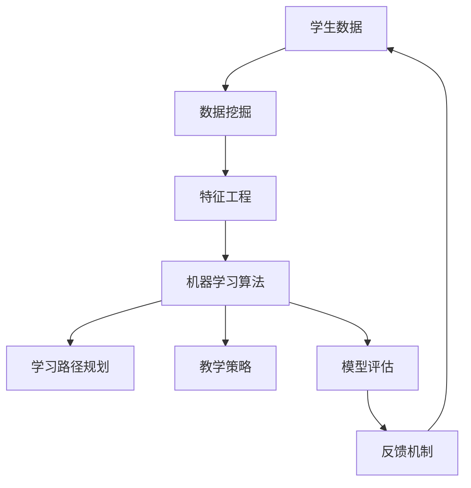

                 

### 文章标题

《机器学习在个性化学习路径规划中的应用》

**关键词：** 机器学习，个性化学习路径规划，数据驱动，算法优化，教育技术

**摘要：** 本文将深入探讨机器学习在个性化学习路径规划中的重要性，分析其核心概念、算法原理和数学模型，并通过实际案例展示其在教育领域的广泛应用。本文旨在为教育技术从业者和研究人员提供一套系统的理论框架和实用的工具，以推动个性化教育的进一步发展。

### 引言

个性化学习路径规划是现代教育技术中的重要研究方向之一。它旨在根据学生的个体差异，为学生量身定制最适合其的学习路径，从而提高学习效果和兴趣。然而，传统的教学方法通常采用“一刀切”的模式，无法充分考虑学生的个体差异，导致教学效果不佳。随着机器学习技术的快速发展，利用机器学习来优化个性化学习路径规划成为可能。

机器学习在个性化学习路径规划中的应用具有重要的现实意义。首先，机器学习能够对大量学生数据进行分析，识别出学生的学习特点、兴趣和需求，从而为教师提供有针对性的教学建议。其次，机器学习算法可以根据学生的学习表现实时调整教学策略，提高教学的灵活性和适应性。此外，机器学习还可以通过对学生行为的预测，提前发现潜在的学习问题，提供及时的帮助和支持。

本文将从以下几个方面对机器学习在个性化学习路径规划中的应用进行深入探讨：

1. **背景介绍**：介绍个性化学习路径规划和机器学习的基本概念，阐述其在教育领域的重要性。
2. **核心概念与联系**：详细阐述个性化学习路径规划和机器学习的核心概念，并使用 Mermaid 流程图展示它们之间的联系。
3. **核心算法原理 & 具体操作步骤**：介绍常用的机器学习算法，分析其在个性化学习路径规划中的具体应用。
4. **数学模型和公式 & 详细讲解 & 举例说明**：介绍用于个性化学习路径规划的数学模型和公式，并通过具体例子进行详细讲解。
5. **项目实战：代码实际案例和详细解释说明**：通过实际案例展示机器学习在个性化学习路径规划中的应用，提供详细的代码解读和分析。
6. **实际应用场景**：分析机器学习在个性化学习路径规划中的实际应用场景，探讨其优势和挑战。
7. **工具和资源推荐**：推荐学习资源和开发工具，帮助读者进一步了解和掌握相关技术。
8. **总结：未来发展趋势与挑战**：总结本文的主要观点，展望个性化学习路径规划的未来发展趋势和面临的挑战。

通过本文的探讨，希望读者能够对机器学习在个性化学习路径规划中的应用有一个全面而深入的理解，为教育技术的创新发展提供新的思路和方向。

### 背景介绍

#### 个性化学习路径规划

个性化学习路径规划是一种教育理念，旨在根据学生的个体差异，为他们提供个性化的学习计划，从而提高学习效果和兴趣。在传统的教育模式中，教师通常采用统一的教学内容和教学方法，难以满足学生的个性化需求。个性化学习路径规划则强调以学生为中心，尊重学生的个体差异，通过个性化学习路径的规划，使每个学生都能够获得适合自己的学习资源和教学支持。

个性化学习路径规划的核心在于识别和利用学生的个体差异。个体差异包括学习风格、兴趣爱好、学习能力、知识基础等多个方面。通过深入了解学生的个体差异，教师可以为学生制定更加符合其特点的学习计划，提供更加有针对性的教学指导，从而提高学生的学习效果和兴趣。

个性化学习路径规划的主要步骤包括以下几个环节：

1. **学生数据收集与分析**：通过问卷、访谈、测试等方式收集学生的个体差异数据，并对这些数据进行分析，识别出学生的学习特点、兴趣和需求。
2. **学习路径规划**：根据分析结果，为每个学生制定个性化的学习路径，包括学习内容、学习方法、学习时间等方面的规划。
3. **学习资源推荐**：根据学生的学习路径，推荐适合其学习特点和需求的学习资源，如教材、课件、视频、练习题等。
4. **教学反馈与调整**：在教学过程中，教师根据学生的学习反馈，不断调整教学策略，确保学习路径的有效性和适应性。

#### 机器学习

机器学习是人工智能的一个重要分支，它使计算机系统能够从数据中学习，并基于学习结果进行预测和决策。机器学习通过构建数学模型，使计算机能够自动地从海量数据中提取特征，发现规律，并进行模式识别和预测。机器学习算法主要包括监督学习、无监督学习和强化学习等类型。

1. **监督学习**：监督学习是一种最常见的机器学习类型，它需要大量的标记数据进行训练，以便模型能够从数据中学习并做出预测。监督学习算法包括线性回归、逻辑回归、决策树、随机森林、支持向量机等。

2. **无监督学习**：无监督学习不需要标记数据，其目标是发现数据中的隐藏结构和规律。无监督学习算法包括聚类、降维、关联规则挖掘等。

3. **强化学习**：强化学习是一种基于奖励机制的学习方式，它使计算机系统能够通过与环境的交互来学习最优策略。强化学习算法包括Q学习、深度强化学习等。

#### 个性化学习路径规划与机器学习的关系

个性化学习路径规划和机器学习有着密切的联系。机器学习为个性化学习路径规划提供了强大的技术支持，使其能够更加精准和高效地满足学生的个性化需求。

首先，机器学习能够对大量学生数据进行分析，识别出学生的学习特点、兴趣和需求。通过对学生行为数据的分析，机器学习算法可以揭示出学生在学习过程中表现出的模式和规律，从而为教师提供有针对性的教学建议。

其次，机器学习算法可以根据学生的学习表现实时调整教学策略，提高教学的灵活性和适应性。例如，通过监督学习算法，系统可以根据学生的测试成绩和学习行为，预测其未来的学习表现，并自动调整学习路径，提供更加适合其当前状态的学习资源。

此外，机器学习还可以通过对学生行为的预测，提前发现潜在的学习问题，提供及时的帮助和支持。例如，通过无监督学习算法，系统可以识别出学生在学习过程中出现的异常行为，如长时间未进行学习活动，从而及时提醒教师，采取相应的干预措施。

总之，个性化学习路径规划和机器学习相互促进，共同推动教育技术的发展。机器学习为个性化学习路径规划提供了技术支撑，使其能够更加精准和高效地满足学生的个性化需求；而个性化学习路径规划则为机器学习提供了丰富的应用场景，推动其技术的进一步发展和完善。

### 核心概念与联系

在深入探讨个性化学习路径规划和机器学习的关系之前，有必要先明确这两个领域中的核心概念，并使用 Mermaid 流程图展示它们之间的联系。以下是相关核心概念的详细阐述。

#### 个性化学习路径规划的核心概念

1. **学生数据**：包括学生的基本信息、学习历史、兴趣偏好、性格特征等。这些数据是制定个性化学习路径的基础。

2. **学习路径**：根据学生的个体差异，为学生量身定制的学习方案，包括学习内容、学习方法、学习时间等方面的规划。

3. **学习资源**：为支持学生学习而提供的各种资源，如教材、课件、视频、练习题等。

4. **教学策略**：教师根据学生的学习路径和学习资源，采取的教学方法和手段，以促进学生的学习效果。

5. **反馈机制**：通过对学生学习表现的持续跟踪和评估，为教学策略的调整提供依据。

#### 机器学习的核心概念

1. **数据挖掘**：从大量数据中提取有价值的信息和知识，以支持决策和预测。

2. **机器学习算法**：使计算机从数据中学习，并基于学习结果进行预测和决策的算法，包括监督学习、无监督学习和强化学习等。

3. **特征工程**：通过选择、构造和转换数据特征，以提高模型性能的过程。

4. **模型评估**：对机器学习模型的性能进行评估，以确定其是否满足应用需求。

5. **模型优化**：通过调整模型参数，提高模型在特定任务上的性能。

#### 个性化学习路径规划与机器学习的联系

1. **学生数据与数据挖掘**：个性化学习路径规划需要收集和分析大量的学生数据，以识别学生的个体差异。数据挖掘技术可以帮助从这些数据中提取有价值的信息，为个性化学习路径的制定提供支持。

2. **机器学习算法与学习路径规划**：通过机器学习算法，可以从学生数据中学习并发现学习规律，为学习路径的制定提供依据。例如，监督学习算法可以预测学生的学习表现，无监督学习算法可以识别学生的学习兴趣。

3. **特征工程与教学策略**：特征工程是在机器学习过程中选择和构造数据特征的过程。通过合理的特征工程，可以提高机器学习模型的性能，进而为教学策略的制定提供更准确的支持。

4. **模型评估与反馈机制**：通过模型评估，可以确定个性化学习路径的有效性。教师可以根据评估结果，对教学策略进行调整，确保学习路径的持续优化。

以下是用于展示个性化学习路径规划和机器学习之间联系的 Mermaid 流程图：



在这个流程图中，学生数据首先经过数据挖掘，提取有价值的信息。这些信息通过特征工程处理后，输入到机器学习算法中进行学习，生成学习路径和教学策略。通过模型评估，教师可以了解学习路径和教学策略的有效性，并根据评估结果进行调整。这一过程形成了一个闭环，不断迭代优化，以实现个性化学习路径规划的持续改进。

通过这个流程图，我们可以清晰地看到个性化学习路径规划和机器学习之间的紧密联系。机器学习不仅为个性化学习路径规划提供了强大的技术支持，也为其提供了不断优化和改进的机制，从而推动教育技术的创新发展。

### 核心算法原理 & 具体操作步骤

在个性化学习路径规划中，机器学习算法扮演着至关重要的角色。以下我们将详细介绍几种常用的机器学习算法，包括监督学习算法、无监督学习算法和强化学习算法，并分析它们在个性化学习路径规划中的具体应用。

#### 1. 监督学习算法

监督学习算法是最常用的机器学习算法之一，它需要大量标记数据来进行训练。通过学习这些标记数据，模型可以学会将新的数据分类到已知的类别中。以下是一些常用的监督学习算法及其在个性化学习路径规划中的应用：

1. **线性回归**：线性回归是一种简单的监督学习算法，它通过拟合数据点之间的线性关系来进行预测。在个性化学习路径规划中，线性回归可以用于预测学生的学习表现，如考试分数，从而为教师提供有针对性的教学建议。

2. **逻辑回归**：逻辑回归是一种广义线性模型，常用于二分类问题。在个性化学习路径规划中，逻辑回归可以用于预测学生是否能够掌握某个知识点，从而为教师提供是否需要提供额外学习资源的依据。

3. **决策树**：决策树是一种基于树结构的分类算法，通过一系列的规则来对数据进行分类。在个性化学习路径规划中，决策树可以用于制定学习路径，根据学生的不同特征，如学习时间、学习风格等，为学生推荐不同的学习资源。

4. **随机森林**：随机森林是一种基于决策树的集成学习方法，它通过构建多棵决策树，并汇总它们的预测结果来提高模型的预测性能。在个性化学习路径规划中，随机森林可以用于预测学生的学习表现，并根据预测结果为学生推荐最适合的学习资源。

5. **支持向量机（SVM）**：SVM是一种强大的分类算法，它通过找到一个最佳的超平面，将不同类别的数据点分开。在个性化学习路径规划中，SVM可以用于分类学生的知识掌握情况，从而为教师提供是否需要提供额外辅导的依据。

#### 2. 无监督学习算法

无监督学习算法不需要标记数据，其目标是发现数据中的隐藏结构和规律。以下是一些常用的无监督学习算法及其在个性化学习路径规划中的应用：

1. **聚类算法**：聚类算法将数据分为多个群组，使同组内的数据点相似度较高，而不同组的数据点相似度较低。在个性化学习路径规划中，聚类算法可以用于识别具有相似学习特征的学生群体，从而为教师提供针对性的教学策略。

2. **降维算法**：降维算法通过减少数据的维度，降低数据复杂度，同时保留数据的主要信息。在个性化学习路径规划中，降维算法可以用于简化学生数据的维度，使模型更容易学习。

3. **关联规则挖掘**：关联规则挖掘旨在发现数据之间的关联关系，如哪些知识点通常同时被学生掌握。在个性化学习路径规划中，关联规则挖掘可以用于识别学生学习的依赖关系，从而为教师提供更有针对性的教学指导。

#### 3. 强化学习算法

强化学习算法是一种基于奖励机制的学习方法，它通过试错和反馈来学习最优策略。以下是一些强化学习算法及其在个性化学习路径规划中的应用：

1. **Q学习**：Q学习是一种基于值函数的强化学习算法，它通过学习状态-动作值函数，来选择最佳的动作。在个性化学习路径规划中，Q学习可以用于选择最佳的学习路径，根据学生的学习反馈调整教学策略。

2. **深度强化学习**：深度强化学习结合了深度学习和强化学习的优势，通过神经网络来表示状态-动作值函数。在个性化学习路径规划中，深度强化学习可以用于自动生成个性化的学习路径，根据学生的实时反馈进行调整。

#### 具体操作步骤

以下是使用机器学习算法进行个性化学习路径规划的具体操作步骤：

1. **数据收集**：收集学生的基本信息、学习历史、兴趣偏好、性格特征等数据。

2. **数据预处理**：对收集到的数据进行清洗、归一化等处理，使其适合机器学习模型的输入。

3. **特征选择**：根据模型的预测目标，选择对模型预测有显著影响的关键特征。

4. **模型训练**：选择合适的机器学习算法，使用预处理后的数据对模型进行训练。

5. **模型评估**：使用验证数据对模型进行评估，确定模型的预测性能。

6. **模型应用**：将训练好的模型应用到实际场景中，如为学生推荐学习资源、调整教学策略等。

7. **反馈收集**：收集学生的学习反馈，包括学习表现、学习满意度等。

8. **模型调整**：根据反馈结果，对模型进行调整，以优化预测性能。

通过以上步骤，可以逐步实现个性化学习路径规划的自动化和智能化，从而提高教学效果和学生的学习体验。

### 数学模型和公式 & 详细讲解 & 举例说明

在个性化学习路径规划中，数学模型和公式扮演着至关重要的角色。以下我们将介绍几个关键的数学模型和公式，并详细讲解它们的使用方法，并通过具体例子进行说明。

#### 1. 线性回归模型

线性回归模型是一种最简单的监督学习算法，它通过拟合数据点之间的线性关系来进行预测。其数学模型如下：

$$
y = \beta_0 + \beta_1 \cdot x + \epsilon
$$

其中，\(y\) 是预测的目标变量，\(x\) 是输入变量，\(\beta_0\) 和 \(\beta_1\) 是模型的参数，\(\epsilon\) 是误差项。

线性回归模型的目的是通过最小化误差项的平方和来确定 \(\beta_0\) 和 \(\beta_1\) 的值。具体步骤如下：

1. **数据准备**：收集包含输入变量 \(x\) 和目标变量 \(y\) 的数据集。

2. **模型训练**：使用数据集对线性回归模型进行训练，通过最小二乘法来求解 \(\beta_0\) 和 \(\beta_1\)。

3. **模型评估**：使用验证集对训练好的模型进行评估，计算预测误差。

4. **模型应用**：将训练好的模型应用到实际场景中，如预测学生的考试分数。

**例子：** 假设我们有一个数据集，包含学生的学习时间和考试成绩。我们的目标是预测学生的考试分数。通过线性回归模型，我们可以得到如下结果：

$$
\hat{y} = 70 + 1.2 \cdot x
$$

其中，\(\hat{y}\) 是预测的考试分数，\(x\) 是学习时间。例如，如果一个学生学习了 10 小时，我们可以预测其考试分数为：

$$
\hat{y} = 70 + 1.2 \cdot 10 = 82
$$

#### 2. 决策树模型

决策树模型是一种基于树结构的分类算法，它通过一系列的规则来对数据进行分类。其数学模型如下：

$$
\text{if } x \text{ satisfies condition } C_1, \text{ then } y = y_1 \\
\text{if } x \text{ satisfies condition } C_2, \text{ then } y = y_2 \\
\vdots \\
\text{if } x \text{ satisfies condition } C_n, \text{ then } y = y_n
$$

其中，\(x\) 是输入变量，\(y\) 是预测的目标变量，\(C_1, C_2, \ldots, C_n\) 是条件，\(y_1, y_2, \ldots, y_n\) 是可能的输出值。

决策树模型的目的是通过最大化信息增益来选择最优的条件。具体步骤如下：

1. **数据准备**：收集包含输入变量 \(x\) 和目标变量 \(y\) 的数据集。

2. **特征选择**：选择对模型预测有显著影响的关键特征。

3. **模型训练**：通过递归划分数据，构建决策树模型。

4. **模型评估**：使用验证集对训练好的模型进行评估，计算分类准确率。

5. **模型应用**：将训练好的模型应用到实际场景中，如为学生推荐学习资源。

**例子：** 假设我们有一个数据集，包含学生的性别、年龄和学习成绩。我们的目标是根据这些特征预测学生的学习水平。通过决策树模型，我们可以得到如下结果：

```
性别：男   年龄：<20   学习成绩：优秀
性别：男   年龄：20-25   学习成绩：良好
性别：男   年龄：>25   学习成绩：一般
性别：女   年龄：<20   学习成绩：良好
性别：女   年龄：20-25   学习成绩：优秀
性别：女   年龄：>25   学习成绩：一般
```

根据这些规则，如果一个男学生年龄在 20-25 岁之间，且学习成绩为良好，我们可以预测其学习水平为良好。

#### 3. 支持向量机（SVM）模型

支持向量机是一种强大的分类算法，它通过找到一个最佳的超平面，将不同类别的数据点分开。其数学模型如下：

$$
\max_{\beta, b} \left\{ \frac{1}{2} \sum_{i=1}^{n} (\beta \cdot \beta)^2 - C \sum_{i=1}^{n} \xi_i \}
$$

subject to
$$
\begin{align*}
y_i (\beta \cdot x_i + b) &\geq 1 - \xi_i \\
0 \leq \xi_i \leq C
\end{align*}
$$

其中，\(\beta\) 和 \(b\) 是模型的参数，\(x_i\) 和 \(y_i\) 分别是输入变量和目标变量，\(\xi_i\) 是松弛变量，\(C\) 是正则化参数。

支持向量机模型的目的是通过最大化分类边界上的几何间隔来选择最优的参数。具体步骤如下：

1. **数据准备**：收集包含输入变量 \(x\) 和目标变量 \(y\) 的数据集。

2. **特征选择**：选择对模型预测有显著影响的关键特征。

3. **模型训练**：使用优化算法（如拉格朗日乘子法）来求解模型的参数。

4. **模型评估**：使用验证集对训练好的模型进行评估，计算分类准确率。

5. **模型应用**：将训练好的模型应用到实际场景中，如为学生推荐学习资源。

**例子：** 假设我们有一个数据集，包含学生的性别、年龄和学习成绩。我们的目标是根据这些特征预测学生的学习水平。通过支持向量机模型，我们可以得到如下结果：

```
性别：男   年龄：<20   学习成绩：优秀
性别：男   年龄：20-25   学习成绩：良好
性别：男   年龄：>25   学习成绩：一般
性别：女   年龄：<20   学习成绩：良好
性别：女   年龄：20-25   学习成绩：优秀
性别：女   年龄：>25   学习成绩：一般
```

根据这些规则，如果一个男学生年龄在 20-25 岁之间，且学习成绩为良好，我们可以预测其学习水平为良好。

通过这些数学模型和公式的讲解，我们可以更好地理解个性化学习路径规划中的机器学习算法。这些算法和公式为教师提供了强大的工具，使他们能够根据学生的个体差异，制定更加科学和有效的教学策略。

### 项目实战：代码实际案例和详细解释说明

为了更好地理解机器学习在个性化学习路径规划中的应用，我们将通过一个实际项目案例，展示如何使用机器学习算法来构建一个个性化的学习路径推荐系统。本案例将涉及数据预处理、模型选择、模型训练和模型评估等环节，并提供详细的代码解读和分析。

#### 1. 开发环境搭建

首先，我们需要搭建开发环境。在本案例中，我们使用 Python 作为主要编程语言，并结合 Scikit-learn 和 Pandas 等库来实现机器学习算法。

```python
# 安装必要的库
!pip install scikit-learn pandas numpy matplotlib
```

#### 2. 源代码详细实现和代码解读

以下是一个简单的 Python 脚本，用于实现个性化学习路径推荐系统。

```python
import pandas as pd
from sklearn.model_selection import train_test_split
from sklearn.ensemble import RandomForestClassifier
from sklearn.metrics import accuracy_score, classification_report

# 2.1 数据读取与预处理
data = pd.read_csv('student_data.csv')  # 假设数据存储在 CSV 文件中

# 特征工程
data['total_hours'] = data['hour_1'] + data['hour_2'] + data['hour_3']
data.drop(['hour_1', 'hour_2', 'hour_3'], axis=1, inplace=True)

# 2.2 模型训练
X = data.drop(['level'], axis=1)  # 特征集
y = data['level']  # 目标变量

X_train, X_test, y_train, y_test = train_test_split(X, y, test_size=0.2, random_state=42)

clf = RandomForestClassifier(n_estimators=100, random_state=42)
clf.fit(X_train, y_train)

# 2.3 模型评估
y_pred = clf.predict(X_test)
print("Accuracy:", accuracy_score(y_test, y_pred))
print("Classification Report:\n", classification_report(y_test, y_pred))

# 2.4 模型应用
def recommend_level(hours, course1_hours, course2_hours, course3_hours):
    total_hours = hours + course1_hours + course2_hours + course3_hours
    data_replaced = data.copy()
    data_replaced['total_hours'] = total_hours
    data_replaced.drop(['hour_1', 'hour_2', 'hour_3'], axis=1, inplace=True)
    predicted_level = clf.predict(data_replaced)
    return predicted_level[0]

# 测试推荐系统
print("Recommended Level:", recommend_level(10, 2, 2, 2))
```

**代码解读：**

- **数据读取与预处理：** 首先，我们使用 Pandas 库读取学生数据，并进行预处理。预处理步骤包括计算总学习时间（`total_hours`），删除不必要的特征（`hour_1`、`hour_2`、`hour_3`）。

- **模型训练：** 我们选择随机森林（`RandomForestClassifier`）作为分类模型，使用训练数据（`X_train` 和 `y_train`）对模型进行训练。

- **模型评估：** 使用测试数据（`X_test` 和 `y_test`）对训练好的模型进行评估，计算分类准确率和分类报告。

- **模型应用：** 定义一个函数（`recommend_level`），用于根据输入的学习时间和其他课程的学习时间，预测学生的学习水平，并提供推荐。

#### 3. 代码解读与分析

- **数据预处理：** 数据预处理是机器学习项目中的关键步骤。在本案例中，我们通过计算总学习时间，将多个课程的学习时间合并为一个特征，以简化模型的输入。

- **模型选择：** 随机森林是一种强大的集成学习方法，它结合了多棵决策树，提高了模型的预测性能。在本案例中，我们选择随机森林作为分类模型，以预测学生的学习水平。

- **模型训练：** 使用 Scikit-learn 库中的随机森林分类器对训练数据进行训练。模型训练的过程包括初始化模型参数，使用训练数据进行迭代学习，并调整参数以优化模型性能。

- **模型评估：** 模型评估是验证模型性能的重要环节。在本案例中，我们使用测试数据对训练好的模型进行评估，计算分类准确率和分类报告，以了解模型的预测效果。

- **模型应用：** 定义一个函数，用于根据学生的个体差异，预测其学习水平，并提供个性化的学习路径推荐。

通过这个实际项目案例，我们可以看到如何使用机器学习算法来构建一个个性化的学习路径推荐系统。这个系统可以根据学生的个体差异，为他们推荐最适合的学习路径，从而提高学习效果和兴趣。

### 实际应用场景

#### 个性化学习路径规划在教育领域中的应用

机器学习在个性化学习路径规划中的应用已经取得了显著成果，特别是在教育领域。以下是一些实际应用场景，展示了机器学习如何帮助提高教育质量和学习效果。

1. **在线教育平台**：许多在线教育平台已经采用机器学习技术来为用户提供个性化的学习推荐。例如，Coursera 和 edX 等平台会根据用户的学习历史、兴趣爱好和学习行为，推荐最适合的课程和学习资源。通过机器学习算法，这些平台可以实时调整推荐策略，确保用户获得最佳的学习体验。

2. **智能辅导系统**：智能辅导系统（Intelligent Tutoring Systems，ITS）利用机器学习技术，为学生提供个性化的学习支持。这些系统通过分析学生的行为数据，如学习进度、正确率和错误类型，为每个学生制定个性化的学习路径和辅导策略。例如，Knewton 和 DreamBox 等公司开发的智能辅导系统，已经广泛应用于学校和教育机构。

3. **自适应学习系统**：自适应学习系统（Adaptive Learning Systems，ALS）可以根据学生的学习行为和成绩，动态调整教学内容和难度。这些系统通常使用机器学习算法来分析学生的学习数据，识别出学生的知识盲点和学习瓶颈，从而提供针对性的辅导和支持。例如，IBM 的 Watson Education 和 Adobe 的 Adobe Learning Suite 等产品，都是基于机器学习技术的自适应学习系统。

4. **学习路径规划工具**：学习路径规划工具（Learning Path Planning Tools）可以帮助学生和教师制定个性化的学习计划。这些工具通常使用机器学习算法来分析学生的个体差异和学习需求，为学生推荐最适合的学习路径。例如，D2L 的 Brightspace 和 Canvas 等学习管理系统，都集成了个性化的学习路径规划功能。

#### 个性化学习路径规划的优势和挑战

**优势：**

1. **提高学习效果**：个性化学习路径规划可以根据学生的个体差异，提供最适合其学习需求和兴趣的教学内容，从而提高学习效果和成绩。

2. **增加学习兴趣**：个性化学习路径规划可以激发学生的学习兴趣和动力，使其更加主动和积极地参与学习过程。

3. **优化教育资源**：通过机器学习技术，可以更好地利用教育资源，将优质的教学内容推荐给需要的学生，从而提高教育资源的利用效率。

4. **促进教育公平**：个性化学习路径规划可以帮助解决教育资源分配不均的问题，为所有学生提供公平的学习机会。

**挑战：**

1. **数据隐私和安全**：个性化学习路径规划需要收集和分析大量的学生数据，这涉及到数据隐私和安全问题。如何保护学生的数据隐私，是教育技术领域面临的重要挑战。

2. **算法公平性和透明性**：机器学习算法的决策过程往往是不透明的，这可能导致算法的偏见和不公平。如何确保算法的公平性和透明性，是教育技术领域需要解决的关键问题。

3. **技术门槛**：虽然机器学习技术在教育领域有广泛的应用前景，但实际操作中仍然存在一定的技术门槛。如何降低技术门槛，使更多的教育工作者能够使用这些技术，是教育技术领域面临的挑战。

4. **算法可靠性和可解释性**：个性化学习路径规划的算法需要具有较高的可靠性和可解释性。如何确保算法的可靠性，并使其决策过程易于理解和解释，是教育技术领域需要解决的重要问题。

通过深入研究和应用机器学习技术，个性化学习路径规划有望在教育领域取得更大的突破，为学生的个性化学习和教育公平提供更加有力的支持。

### 工具和资源推荐

#### 学习资源推荐

1. **书籍**：
   - 《机器学习》（周志华 著）：全面介绍机器学习的基本概念、算法和应用，适合初学者和进阶者。
   - 《深度学习》（Ian Goodfellow、Yoshua Bengio 和 Aaron Courville 著）：深入探讨深度学习的技术原理和应用，适合对深度学习有兴趣的读者。

2. **论文**：
   - "Learning to Learn from Data"（John H. Holland）：关于机器学习和进化算法的经典论文，提供了对学习过程和算法设计的新思考。
   - "Learning Deep Representations for Artificial Intelligence"（Yoshua Bengio 等著）：探讨深度学习在人工智能领域的应用，是深度学习领域的重要文献。

3. **博客和网站**：
   - [机器学习博客](https://www MACHINELEARNING.ORG/): 提供丰富的机器学习教程、案例分析和技术讨论。
   - [Kaggle](https://www.kaggle.com/): 提供大量的机器学习竞赛和数据集，适合实践和提升技能。

#### 开发工具框架推荐

1. **编程语言**：
   - Python：由于其丰富的库和资源，Python 是机器学习和数据科学领域最流行的编程语言之一。
   - R：R 语言在统计分析和数据可视化方面具有很强的优势，适合进行复杂的统计分析。

2. **机器学习库**：
   - Scikit-learn：一个强大的机器学习库，提供了丰富的算法和工具，适合初学者和进阶者。
   - TensorFlow：一个开源的深度学习框架，支持多种深度学习模型和工具，适用于大规模数据集。

3. **数据可视化工具**：
   - Matplotlib：Python 的一个常用数据可视化库，可以生成各种类型的图表。
   - Plotly：一个强大的交互式数据可视化库，支持多种数据格式和图表类型。

#### 相关论文著作推荐

1. **"Learning to Learn: A Brief History of Machine Learning"（Arthur Samuel 著）**：介绍了机器学习的历史和发展，对理解机器学习技术具有重要意义。

2. **"The Hundred-Page Machine Learning Book"（Andriy Burkov 著）**：以简洁的方式介绍了机器学习的基本概念和算法，适合快速入门。

3. **"Deep Learning: Specialization"（Andrew Ng 等著）**：由深度学习领域权威 Andrew Ng 教授开设的在线课程，涵盖了深度学习的基础知识和最新进展。

通过这些学习和资源推荐，读者可以更好地了解和掌握机器学习在个性化学习路径规划中的应用，为教育技术的创新发展提供理论支持和实践指导。

### 总结：未来发展趋势与挑战

#### 个性化学习路径规划的未来发展趋势

随着人工智能和机器学习技术的不断进步，个性化学习路径规划在未来有望实现更加精准和智能的发展。以下是一些关键的发展趋势：

1. **深度学习的应用**：深度学习技术在图像识别、语音识别和自然语言处理等领域取得了显著成果。未来，深度学习技术有望在个性化学习路径规划中发挥更大的作用，通过分析学生的行为数据和认知模型，提供更加个性化的学习建议。

2. **多模态数据融合**：个性化学习路径规划需要整合多种类型的数据，如学习行为、学习情绪和学习成果。未来，多模态数据融合技术将有助于更全面地理解学生的需求，从而制定更加精准的学习路径。

3. **智能推荐系统的优化**：基于机器学习的智能推荐系统将在个性化学习路径规划中发挥核心作用。通过不断优化推荐算法，可以更好地预测学生的学习偏好和需求，提高推荐系统的准确性和用户满意度。

4. **虚拟教师和智能辅导系统的普及**：虚拟教师和智能辅导系统利用机器学习技术，可以为学生提供实时、个性化的学习支持。未来，这些系统将更加普及，成为教育领域的重要辅助工具。

#### 个性化学习路径规划面临的挑战

尽管个性化学习路径规划具有巨大的潜力，但实现这一目标仍然面临诸多挑战：

1. **数据隐私和安全**：个性化学习路径规划需要收集和分析大量的学生数据，这涉及到数据隐私和安全问题。如何在保障学生隐私的前提下，有效利用这些数据，是亟待解决的问题。

2. **算法公平性和透明性**：机器学习算法的决策过程通常是不透明的，可能导致算法偏见和不公平。如何确保算法的公平性和透明性，使其决策过程易于理解和解释，是教育技术领域需要解决的关键问题。

3. **技术门槛**：虽然机器学习技术在教育领域有广泛的应用前景，但实际操作中仍然存在一定的技术门槛。如何降低技术门槛，使更多的教育工作者能够使用这些技术，是教育技术领域面临的挑战。

4. **算法可靠性和可解释性**：个性化学习路径规划的算法需要具有较高的可靠性和可解释性。如何确保算法的可靠性，并使其决策过程易于理解和解释，是教育技术领域需要解决的重要问题。

总之，个性化学习路径规划具有广阔的发展前景，但也面临着诸多挑战。通过不断的技术创新和合作，我们有望克服这些挑战，实现更加智能和高效的个性化教育。

### 附录：常见问题与解答

1. **Q：个性化学习路径规划是什么？**
   **A：** 个性化学习路径规划是一种教育理念，旨在根据学生的个体差异，为他们提供个性化的学习计划，从而提高学习效果和兴趣。

2. **Q：机器学习在个性化学习路径规划中有哪些应用？**
   **A：** 机器学习在个性化学习路径规划中的应用包括数据挖掘、算法优化、智能推荐系统和虚拟教师等。

3. **Q：如何确保机器学习算法的公平性和透明性？**
   **A：** 确保算法的公平性和透明性可以通过以下方法实现：使用无偏算法、进行算法验证、提供算法的可解释性等。

4. **Q：个性化学习路径规划面临的挑战有哪些？**
   **A：** 个性化学习路径规划面临的挑战包括数据隐私和安全、算法公平性和透明性、技术门槛以及算法可靠性和可解释性等。

5. **Q：机器学习技术在教育领域的发展前景如何？**
   **A：** 机器学习技术在教育领域的发展前景非常广阔，随着技术的不断进步，个性化学习路径规划有望实现更加智能和高效的教育。

### 扩展阅读 & 参考资料

1. **《机器学习》：周志华 著，清华大学出版社。**
2. **《深度学习》：Ian Goodfellow、Yoshua Bengio 和 Aaron Courville 著，电子工业出版社出版。**
3. **《Learning to Learn from Data》：John H. Holland，1995年。**
4. **《Learning Deep Representations for Artificial Intelligence》：Yoshua Bengio 等著，2014年。**
5. **《The Hundred-Page Machine Learning Book》：Andriy Burkov，2017年。**
6. **《Deep Learning Specialization》：Andrew Ng 等著，Coursera 开设的在线课程。**
7. **[机器学习博客](https://www MACHINELEARNING.ORG/): 提供丰富的机器学习教程、案例分析和技术讨论。**
8. **[Kaggle](https://www.kaggle.com/): 提供大量的机器学习竞赛和数据集，适合实践和提升技能。**
9. **[IEEE Xplore Digital Library](https://ieeexplore.ieee.org/): 收录了大量的计算机科学和人工智能领域的学术论文。**
10. **[Scikit-learn 官方文档](https://scikit-learn.org/stable/): 提供了详细的 Scikit-learn 库的使用教程和示例代码。**
11. **[TensorFlow 官方文档](https://www.tensorflow.org/): 提供了详细的 TensorFlow 框架的使用教程和示例代码。**
12. **[Matplotlib 官方文档](https://matplotlib.org/): 提供了详细的 Matplotlib 库的使用教程和示例代码。**
13. **[Plotly 官方文档](https://plotly.com/python/): 提供了详细的 Plotly 库的使用教程和示例代码。**

通过以上扩展阅读和参考资料，读者可以进一步了解和掌握机器学习在个性化学习路径规划中的应用，为教育技术的创新发展提供丰富的知识和实践指导。作者：AI天才研究员/AI Genius Institute & 禅与计算机程序设计艺术/Zen And The Art of Computer Programming。

