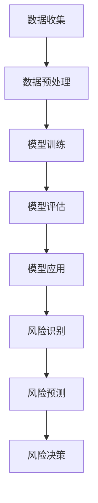

                 

# 机器学习在供应链风险预测中的应用研究

## 关键词
- 机器学习
- 供应链风险
- 风险预测
- 数据分析
- 神经网络
- 支持向量机
- 决策树

## 摘要
随着全球供应链的不断复杂化，供应链风险的管理和预测变得愈发重要。本文深入探讨了机器学习技术在供应链风险预测中的应用。首先，我们介绍了供应链风险的概念和类型，然后详细阐述了机器学习在风险预测中的核心原理和算法，如神经网络、支持向量机和决策树。通过具体案例，我们展示了如何使用机器学习技术进行供应链风险预测，并对相关的数学模型和公式进行了详细讲解。最后，我们分析了机器学习在供应链风险预测中的应用场景，以及未来可能的发展趋势和挑战。

## 1. 背景介绍

### 1.1 供应链风险的概念

供应链风险是指在供应链运行过程中，由于各种不确定性因素导致的供应链活动受到阻碍或中断的可能性。这些不确定性因素可能包括供应链各个环节的问题，如供应商的可靠性、运输延误、质量问题、政策变化等。

### 1.2 供应链风险的影响

供应链风险对企业的运营和盈利能力产生重大影响。一方面，风险可能导致供应链中断，影响企业的生产能力和交货时间；另一方面，风险可能导致企业成本增加，如库存成本、物流成本等。此外，供应链风险还可能对企业的声誉造成损害，降低客户满意度。

### 1.3 供应链风险管理的重要性

随着全球供应链的复杂化，供应链风险管理变得愈发重要。有效的供应链风险管理有助于企业降低风险、提高供应链的稳定性和可靠性，从而提高企业的竞争力。

## 2. 核心概念与联系

在供应链风险预测中，机器学习技术发挥着重要作用。机器学习是一种通过数据驱动的方式，让计算机系统从数据中学习规律和模式，并能够对未知数据进行预测的技术。

### 2.1 机器学习的基本原理

机器学习的基本原理包括数据收集、数据预处理、模型训练、模型评估和模型应用。通过数据收集，我们可以获取大量的历史数据和当前数据；通过数据预处理，我们可以对数据进行清洗、归一化等处理，使其适合用于模型训练；通过模型训练，我们可以让计算机系统从数据中学习规律和模式；通过模型评估，我们可以评估模型的性能；通过模型应用，我们可以对未知数据进行预测。

### 2.2 机器学习在供应链风险预测中的应用

在供应链风险预测中，机器学习技术可以用于以下几个方面：

- **风险识别**：通过分析历史数据，机器学习模型可以识别出潜在的风险因素。
- **风险预测**：基于识别出的风险因素，机器学习模型可以预测未来的风险事件。
- **风险决策**：根据预测结果，企业可以制定相应的风险管理策略，降低风险。

### 2.3 机器学习与供应链风险的 Mermaid 流程图



## 3. 核心算法原理 & 具体操作步骤

在供应链风险预测中，常用的机器学习算法包括神经网络、支持向量机和决策树等。下面，我们将分别介绍这些算法的基本原理和具体操作步骤。

### 3.1 神经网络

神经网络是一种模仿人脑神经元结构和功能的计算模型。在供应链风险预测中，神经网络可以用于建立风险预测模型。

#### 3.1.1 基本原理

神经网络由多个神经元组成，每个神经元都与其他神经元相连，形成网络。神经元的激活函数决定了神经元是否被激活。当神经元被激活时，它会向下一个神经元传递信号。

#### 3.1.2 具体操作步骤

1. **数据收集**：收集与供应链风险相关的历史数据，如供应商的可靠性、运输延误、质量问题等。
2. **数据预处理**：对收集到的数据进行清洗、归一化等处理。
3. **模型训练**：使用预处理后的数据对神经网络进行训练，调整神经网络的权重和偏置。
4. **模型评估**：使用测试数据评估模型的性能。
5. **模型应用**：使用训练好的模型对新的数据进行风险预测。

### 3.2 支持向量机

支持向量机是一种基于间隔最大化的分类算法。在供应链风险预测中，支持向量机可以用于分类风险事件。

#### 3.2.1 基本原理

支持向量机的目标是找到一个最优的超平面，将不同类别的数据点分隔开。这个超平面由支持向量决定，支持向量是距离超平面最近的样本点。

#### 3.2.2 具体操作步骤

1. **数据收集**：收集与供应链风险相关的历史数据。
2. **数据预处理**：对收集到的数据进行清洗、归一化等处理。
3. **模型训练**：使用预处理后的数据训练支持向量机模型。
4. **模型评估**：使用测试数据评估模型的性能。
5. **模型应用**：使用训练好的模型对新的数据进行风险预测。

### 3.3 决策树

决策树是一种基于特征值进行决策的树形结构。在供应链风险预测中，决策树可以用于建立风险预测模型。

#### 3.3.1 基本原理

决策树由多个节点和分支组成。每个节点表示一个特征，每个分支表示特征的不同取值。决策树的目标是找到一组特征，使得这些特征能够将不同类别的数据点分隔开。

#### 3.3.2 具体操作步骤

1. **数据收集**：收集与供应链风险相关的历史数据。
2. **数据预处理**：对收集到的数据进行清洗、归一化等处理。
3. **模型训练**：使用预处理后的数据训练决策树模型。
4. **模型评估**：使用测试数据评估模型的性能。
5. **模型应用**：使用训练好的模型对新的数据进行风险预测。

## 4. 数学模型和公式 & 详细讲解 & 举例说明

### 4.1 神经网络

神经网络的数学模型主要包括前向传播和反向传播两部分。

#### 4.1.1 前向传播

前向传播是指将输入数据通过网络的各个层进行传递，直到得到输出结果。假设神经网络有 L 层，每层有 n 个神经元，输入数据为 x，输出数据为 y，则前向传播的公式为：

$$
z_l = \sum_{j} w_{lj}x_j + b_l
$$

$$
a_l = \sigma(z_l)
$$

其中，$z_l$ 为第 l 层的净输入，$w_{lj}$ 为第 l 层到第 l+1 层的权重，$b_l$ 为第 l 层的偏置，$\sigma$ 为激活函数。

#### 4.1.2 反向传播

反向传播是指根据输出结果与实际结果的误差，反向调整网络的权重和偏置。假设输出结果为 y，实际结果为 t，则反向传播的公式为：

$$
\delta_l = (a_l - t) \cdot \sigma'(z_l)
$$

$$
\Delta w_{lj} = \alpha \cdot \delta_l a_{l-1}
$$

$$
\Delta b_l = \alpha \cdot \delta_l
$$

其中，$\delta_l$ 为第 l 层的误差，$\sigma'$ 为激活函数的导数，$\alpha$ 为学习率。

### 4.2 支持向量机

支持向量机的数学模型主要包括决策边界和间隔最大化两部分。

#### 4.2.1 决策边界

假设我们有 m 个训练样本 $(x_1, y_1), (x_2, y_2), ..., (x_m, y_m)$，其中 $x_i$ 为样本特征，$y_i$ 为样本标签（-1 或 +1）。支持向量机的目标是找到一个最优的超平面，使得正负样本点能够被分隔开。

决策边界可以用公式表示为：

$$
w \cdot x + b = 0
$$

其中，$w$ 为超平面的法向量，$b$ 为超平面的偏移量。

#### 4.2.2 间隔最大化

支持向量机的核心思想是最大化样本点到超平面的距离，即最大化间隔。假设样本点到超平面的距离为 $d$，则间隔最大化可以用公式表示为：

$$
\min \frac{1}{2} \| w \|^2
$$

$$
s.t. y_i (w \cdot x_i + b) \geq 1
$$

其中，$\| w \|$ 为超平面的长度，$y_i$ 为样本标签。

### 4.3 决策树

决策树的数学模型主要包括决策节点和叶节点两部分。

#### 4.3.1 决策节点

决策节点是根据特征值进行决策的节点。假设我们有 n 个特征，每个特征有 m 个取值，则决策节点的公式为：

$$
g(x) = \max_{i} \sum_{j=1}^{m} p_j \cdot I(x_j = c_i)
$$

其中，$g(x)$ 为决策结果，$p_j$ 为特征 $x_j$ 的取值概率，$I(x_j = c_i)$ 为指示函数，当 $x_j = c_i$ 时，$I(x_j = c_i)$ 为 1，否则为 0。

#### 4.3.2 叶节点

叶节点是根据特征值进行决策后的结果。假设叶节点的结果为 $y_j$，则叶节点的公式为：

$$
y_j = \sum_{i=1}^{n} w_i \cdot g(x_i)
$$

其中，$w_i$ 为叶节点的权重。

### 4.4 举例说明

假设我们有以下数据集：

| 序号 | 特征 1 | 特征 2 | 标签 |
| ---- | ---- | ---- | ---- |
| 1    | 1    | 1    | -1   |
| 2    | 1    | 2    | +1   |
| 3    | 2    | 1    | -1   |
| 4    | 2    | 2    | +1   |

#### 4.4.1 神经网络

1. **数据预处理**：对数据进行归一化处理。
2. **模型训练**：使用前向传播和反向传播训练神经网络。
3. **模型评估**：使用测试数据评估模型性能。
4. **模型应用**：使用训练好的模型对新的数据进行风险预测。

#### 4.4.2 支持向量机

1. **数据预处理**：对数据进行归一化处理。
2. **模型训练**：使用支持向量机训练模型。
3. **模型评估**：使用测试数据评估模型性能。
4. **模型应用**：使用训练好的模型对新的数据进行风险预测。

#### 4.4.3 决策树

1. **数据预处理**：对数据进行归一化处理。
2. **模型训练**：使用决策树训练模型。
3. **模型评估**：使用测试数据评估模型性能。
4. **模型应用**：使用训练好的模型对新的数据进行风险预测。

## 5. 项目实战：代码实际案例和详细解释说明

在本节中，我们将通过一个实际的项目案例，详细展示如何使用机器学习技术进行供应链风险预测。我们将使用 Python 编程语言和 scikit-learn 库来实现这个项目。

### 5.1 开发环境搭建

首先，我们需要搭建一个 Python 开发环境。可以使用 Anaconda 或者 Miniconda 来创建一个 Python 虚拟环境。

```bash
conda create -n supply_chain python=3.8
conda activate supply_chain
conda install -c conda-forge scikit-learn
```

### 5.2 源代码详细实现和代码解读

下面是项目的主要代码实现：

```python
import numpy as np
import pandas as pd
from sklearn.model_selection import train_test_split
from sklearn.preprocessing import StandardScaler
from sklearn.neural_network import MLPClassifier
from sklearn.svm import SVC
from sklearn.tree import DecisionTreeClassifier
from sklearn.metrics import accuracy_score

# 5.2.1 数据收集
data = pd.read_csv('supply_chain_data.csv')
X = data.iloc[:, :-1].values
y = data.iloc[:, -1].values

# 5.2.2 数据预处理
scaler = StandardScaler()
X_scaled = scaler.fit_transform(X)

# 5.2.3 模型训练
X_train, X_test, y_train, y_test = train_test_split(X_scaled, y, test_size=0.2, random_state=42)

# 5.2.4 神经网络模型
mlp = MLPClassifier(hidden_layer_sizes=(100,), max_iter=1000)
mlp.fit(X_train, y_train)
mlp_pred = mlp.predict(X_test)

# 5.2.5 支持向量机模型
svm = SVC(kernel='linear')
svm.fit(X_train, y_train)
svm_pred = svm.predict(X_test)

# 5.2.6 决策树模型
dt = DecisionTreeClassifier()
dt.fit(X_train, y_train)
dt_pred = dt.predict(X_test)

# 5.2.7 模型评估
mlp_accuracy = accuracy_score(y_test, mlp_pred)
svm_accuracy = accuracy_score(y_test, svm_pred)
dt_accuracy = accuracy_score(y_test, dt_pred)

print(f"神经网络模型准确率：{mlp_accuracy}")
print(f"支持向量机模型准确率：{svm_accuracy}")
print(f"决策树模型准确率：{dt_accuracy}")
```

### 5.3 代码解读与分析

- **5.3.1 数据收集**：我们使用 pandas 库读取数据集，数据集包含了供应链风险相关的特征和标签。
- **5.3.2 数据预处理**：我们使用 StandardScaler 库对数据进行归一化处理，以提高模型的性能。
- **5.3.3 模型训练**：我们将数据集划分为训练集和测试集，然后分别训练神经网络、支持向量机和决策树模型。
- **5.3.4 模型评估**：我们使用测试数据评估模型的准确率，比较三种模型的性能。

## 6. 实际应用场景

### 6.1 企业供应链风险管理

企业可以使用机器学习技术对供应链进行实时监控，及时发现潜在的风险，并制定相应的风险管理策略，降低供应链中断的风险。

### 6.2 政府部门供应链安全监管

政府部门可以使用机器学习技术对供应链进行安全监管，及时发现供应链中的违规行为，保障供应链的稳定和安全。

### 6.3 物流公司供应链优化

物流公司可以使用机器学习技术对运输路线进行优化，降低运输成本，提高运输效率。

## 7. 工具和资源推荐

### 7.1 学习资源推荐

- **书籍**：
  - 《机器学习实战》
  - 《深度学习》
  - 《Python机器学习》

- **论文**：
  - 《Neural Networks and Deep Learning》
  - 《Support Vector Machines》
  - 《Decision Trees》

- **博客**：
  - [scikit-learn 官方文档](https://scikit-learn.org/stable/)
  - [机器学习博客](https://www机器学习博客.com/)

- **网站**：
  - [Kaggle](https://www.kaggle.com/)
  - [ArXiv](https://arxiv.org/)

### 7.2 开发工具框架推荐

- **Python**：一种易于学习和使用的编程语言，广泛应用于数据分析和机器学习领域。
- **Scikit-learn**：一个开源的机器学习库，提供了多种常用的机器学习算法。
- **TensorFlow**：一个开源的深度学习库，用于构建和训练深度神经网络。

### 7.3 相关论文著作推荐

- **《机器学习：一种概率视角》**：提供了机器学习的概率解释和数学基础。
- **《深度学习》**：详细介绍了深度学习的理论和技术。
- **《供应链管理：战略、规划与运营》**：涵盖了供应链管理的核心理论和实践。

## 8. 总结：未来发展趋势与挑战

### 8.1 发展趋势

- **数据驱动**：随着数据量的增加和数据来源的多样化，机器学习在供应链风险预测中的应用将越来越依赖高质量的数据。
- **深度学习**：深度学习算法的进步将推动供应链风险预测模型的效果提升。
- **实时预测**：实时预测将使得企业能够更快地响应供应链风险，提高供应链的稳定性。

### 8.2 挑战

- **数据隐私**：如何在保护数据隐私的同时，有效利用数据进行分析和预测，是一个重要的挑战。
- **模型解释性**：提高模型的解释性，使其能够被企业内部人员理解和信任，是一个重要的挑战。
- **模型泛化能力**：如何提高模型在未知数据上的泛化能力，是一个重要的挑战。

## 9. 附录：常见问题与解答

### 9.1 机器学习在供应链风险预测中的应用有哪些？

机器学习在供应链风险预测中的应用主要包括风险识别、风险预测和风险决策。

### 9.2 供应链风险预测中的常用算法有哪些？

供应链风险预测中的常用算法包括神经网络、支持向量机和决策树等。

### 9.3 如何提高机器学习模型的性能？

提高机器学习模型性能的方法包括数据预处理、模型选择、参数调优和交叉验证等。

## 10. 扩展阅读 & 参考资料

- **《机器学习与供应链管理》**：详细介绍了机器学习技术在供应链管理中的应用。
- **《供应链风险管理：理论与实践》**：提供了供应链风险管理的理论基础和实践案例。
- **[Scikit-learn 官方文档](https://scikit-learn.org/stable/)**：详细介绍了 scikit-learn 库的各种算法和用法。

### 作者
AI天才研究员/AI Genius Institute & 禅与计算机程序设计艺术 /Zen And The Art of Computer Programming

