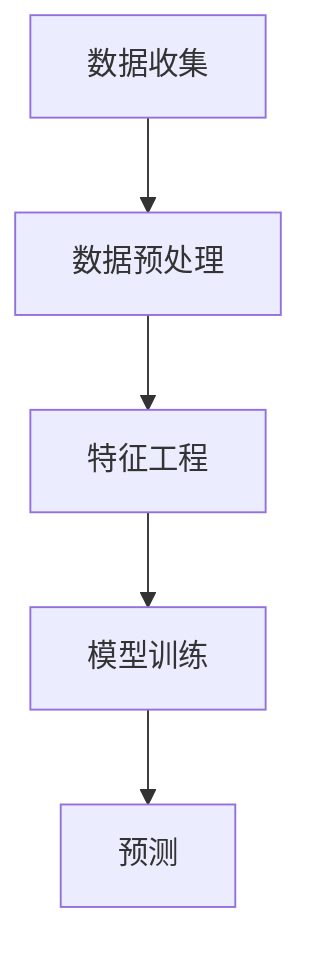

                 

### 背景介绍

#### 机器学习与客户行为预测

在当今的数字化时代，客户行为预测已经成为了商业决策中至关重要的一环。通过分析大量的数据，企业可以更好地了解客户的行为模式，从而制定出更精准的市场营销策略，提高客户满意度，并实现业务增长。机器学习作为一种强大的数据分析工具，在客户行为预测领域展现出了巨大的潜力。

#### 机器学习的基本概念

机器学习（Machine Learning，ML）是一门人工智能（Artificial Intelligence，AI）的分支学科，主要研究如何让计算机通过学习数据，自动完成特定任务。机器学习的基本思想是利用历史数据，从中学习规律，并应用到新的数据中，以实现预测、分类、聚类等任务。

#### 客户行为预测的重要性

客户行为预测在商业决策中具有重要意义。首先，通过预测客户行为，企业可以更好地了解客户需求，从而优化产品设计和推广策略。其次，客户行为预测可以帮助企业识别潜在客户，提高营销活动的有效性。此外，通过对客户行为的预测，企业还可以实现客户细分，提供个性化的服务，提高客户满意度。

#### 本文结构

本文将分为以下几个部分：

1. **背景介绍**：简要介绍机器学习和客户行为预测的基本概念。
2. **核心概念与联系**：详细解释机器学习在客户行为预测中的应用原理。
3. **核心算法原理与操作步骤**：介绍常用的机器学习算法及其在客户行为预测中的应用。
4. **数学模型和公式**：讲解机器学习在客户行为预测中的数学模型和公式。
5. **项目实战**：通过实际案例展示机器学习在客户行为预测中的应用。
6. **实际应用场景**：分析机器学习在客户行为预测中的实际应用。
7. **工具和资源推荐**：推荐学习资源和开发工具。
8. **总结**：总结未来发展趋势和挑战。
9. **附录**：常见问题与解答。
10. **扩展阅读与参考资料**：提供进一步阅读的材料。

接下来，我们将逐一探讨这些主题，帮助读者深入了解机器学习在客户行为预测中的应用。首先，我们从背景介绍开始。 

---

## 2. 核心概念与联系

#### 机器学习在客户行为预测中的应用原理

机器学习在客户行为预测中的应用主要基于以下几个核心概念：数据收集、数据预处理、特征工程、模型训练和预测。下面我们将逐一介绍这些概念，并解释它们在客户行为预测中的作用。

##### 数据收集

数据收集是机器学习在客户行为预测中的第一步。企业可以通过多种渠道收集客户数据，如在线行为数据、交易记录、社交媒体活动等。这些数据为后续的分析提供了基础。

##### 数据预处理

数据预处理是确保数据质量的重要步骤。在数据收集后，需要对数据进行清洗、去重、归一化等操作，以提高数据的质量和一致性。数据预处理有助于消除噪声和异常值，从而提高模型性能。

##### 特征工程

特征工程是机器学习在客户行为预测中的关键步骤。通过提取和构造具有区分度的特征，可以提高模型的预测准确性。特征工程包括特征选择、特征变换和特征构造等操作。

##### 模型训练

模型训练是机器学习在客户行为预测中的核心步骤。通过将数据输入到机器学习模型中，模型可以学习到数据中的规律和模式。常用的机器学习算法包括线性回归、逻辑回归、决策树、随机森林、支持向量机等。

##### 预测

模型训练完成后，可以使用模型对新数据进行预测。通过将新数据输入到训练好的模型中，模型可以预测客户的行为。预测结果可以用于制定营销策略、优化产品设计和提高客户满意度。

#### Mermaid 流程图

以下是机器学习在客户行为预测中的 Mermaid 流程图，展示了各个核心概念之间的联系：



在上面的流程图中，数据收集是机器学习在客户行为预测中的起点，随后通过数据预处理、特征工程、模型训练和预测等步骤，最终实现对客户行为的预测。

##### 图解

1. **数据收集**：企业通过多种渠道收集客户数据，如在线行为数据、交易记录等。
2. **数据预处理**：清洗和整理数据，去除噪声和异常值，确保数据质量。
3. **特征工程**：提取和构造具有区分度的特征，提高模型预测准确性。
4. **模型训练**：将数据输入到机器学习模型中，模型学习数据中的规律和模式。
5. **预测**：使用训练好的模型对新数据进行预测，预测客户行为。

通过上述步骤，机器学习在客户行为预测中发挥了重要作用。接下来，我们将介绍几种常用的机器学习算法及其在客户行为预测中的应用。 

---

## 3. 核心算法原理 & 具体操作步骤

#### 常用机器学习算法及其应用

在客户行为预测中，常用的机器学习算法包括线性回归、逻辑回归、决策树、随机森林和支持向量机等。这些算法在客户行为预测中具有广泛的应用，下面我们将逐一介绍这些算法的基本原理和具体操作步骤。

##### 线性回归

线性回归（Linear Regression）是一种最简单的机器学习算法，主要用于预测连续值。线性回归的基本原理是通过拟合一条直线，将自变量和因变量之间的关系表达出来。具体操作步骤如下：

1. **数据准备**：收集客户数据，包括特征变量和目标变量。
2. **数据预处理**：对数据进行清洗、去重、归一化等操作，确保数据质量。
3. **特征工程**：提取和构造具有区分度的特征，提高模型预测准确性。
4. **模型训练**：使用线性回归算法拟合直线，计算斜率和截距。
5. **模型评估**：使用评估指标（如均方误差、决定系数等）评估模型性能。
6. **预测**：将新数据输入到训练好的模型中，预测目标变量的值。

##### 逻辑回归

逻辑回归（Logistic Regression）是一种常用的分类算法，主要用于预测离散值。逻辑回归的基本原理是通过拟合一个逻辑函数，将自变量和因变量之间的关系表达出来。具体操作步骤如下：

1. **数据准备**：收集客户数据，包括特征变量和目标变量。
2. **数据预处理**：对数据进行清洗、去重、归一化等操作，确保数据质量。
3. **特征工程**：提取和构造具有区分度的特征，提高模型预测准确性。
4. **模型训练**：使用逻辑回归算法拟合逻辑函数，计算参数。
5. **模型评估**：使用评估指标（如准确率、召回率、F1值等）评估模型性能。
6. **预测**：将新数据输入到训练好的模型中，预测目标变量的值。

##### 决策树

决策树（Decision Tree）是一种常见的分类算法，通过构建树形结构，将数据划分为不同的类别。决策树的基本原理是基于特征值和阈值进行划分，形成树形结构。具体操作步骤如下：

1. **数据准备**：收集客户数据，包括特征变量和目标变量。
2. **数据预处理**：对数据进行清洗、去重、归一化等操作，确保数据质量。
3. **特征工程**：提取和构造具有区分度的特征，提高模型预测准确性。
4. **模型训练**：使用决策树算法构建树形结构，计算每个节点的特征值和阈值。
5. **模型评估**：使用评估指标（如准确率、召回率、F1值等）评估模型性能。
6. **预测**：将新数据输入到训练好的模型中，根据树形结构预测目标变量的值。

##### 随机森林

随机森林（Random Forest）是一种集成学习方法，通过构建多个决策树，并进行投票来提高预测准确性。随机森林的基本原理是将多个决策树集成起来，利用投票机制来决定最终预测结果。具体操作步骤如下：

1. **数据准备**：收集客户数据，包括特征变量和目标变量。
2. **数据预处理**：对数据进行清洗、去重、归一化等操作，确保数据质量。
3. **特征工程**：提取和构造具有区分度的特征，提高模型预测准确性。
4. **模型训练**：使用随机森林算法构建多个决策树，计算每个节点的特征值和阈值。
5. **模型评估**：使用评估指标（如准确率、召回率、F1值等）评估模型性能。
6. **预测**：将新数据输入到训练好的模型中，根据随机森林的投票结果预测目标变量的值。

##### 支持向量机

支持向量机（Support Vector Machine，SVM）是一种常用的分类算法，通过找到一个最佳的超平面，将数据划分为不同的类别。支持向量机的基本原理是寻找一个最优的超平面，使得分类边界最大化。具体操作步骤如下：

1. **数据准备**：收集客户数据，包括特征变量和目标变量。
2. **数据预处理**：对数据进行清洗、去重、归一化等操作，确保数据质量。
3. **特征工程**：提取和构造具有区分度的特征，提高模型预测准确性。
4. **模型训练**：使用支持向量机算法寻找最佳的超平面，计算参数。
5. **模型评估**：使用评估指标（如准确率、召回率、F1值等）评估模型性能。
6. **预测**：将新数据输入到训练好的模型中，根据超平面预测目标变量的值。

通过以上介绍，我们可以看到各种机器学习算法在客户行为预测中的应用。接下来，我们将介绍机器学习在客户行为预测中的数学模型和公式。

---

## 4. 数学模型和公式 & 详细讲解 & 举例说明

#### 数学模型在客户行为预测中的应用

在客户行为预测中，数学模型和公式是核心组成部分。这些模型和公式帮助我们理解数据之间的关系，并从中提取有用的信息。以下是一些常见的数学模型和公式，以及它们在客户行为预测中的应用。

##### 线性回归模型

线性回归模型是最简单的机器学习模型之一，主要用于预测连续值。线性回归模型的公式如下：

$$
y = \beta_0 + \beta_1x_1 + \beta_2x_2 + ... + \beta_nx_n
$$

其中，$y$ 是预测值，$x_1, x_2, ..., x_n$ 是特征变量，$\beta_0, \beta_1, \beta_2, ..., \beta_n$ 是模型的参数。

举例说明：

假设我们想要预测某个产品的销售额。我们可以使用线性回归模型，将销售额作为目标变量，将影响销售额的特征变量（如广告费用、促销活动等）作为自变量。通过拟合线性回归模型，我们可以得到销售额和特征变量之间的关系，并利用这个关系预测新的销售额。

##### 逻辑回归模型

逻辑回归模型是一种常用的分类算法，主要用于预测离散值。逻辑回归模型的公式如下：

$$
P(y=1) = \frac{1}{1 + e^{-(\beta_0 + \beta_1x_1 + \beta_2x_2 + ... + \beta_nx_n})}
$$

其中，$P(y=1)$ 是目标变量为1的概率，$x_1, x_2, ..., x_n$ 是特征变量，$\beta_0, \beta_1, \beta_2, ..., \beta_n$ 是模型的参数。

举例说明：

假设我们想要预测某个客户的购买行为。我们可以使用逻辑回归模型，将购买行为作为目标变量，将影响购买行为的特征变量（如年龄、收入、产品评分等）作为自变量。通过拟合逻辑回归模型，我们可以得到购买行为和特征变量之间的关系，并利用这个关系预测新的购买行为。

##### 决策树模型

决策树模型通过构建树形结构，将数据划分为不同的类别。决策树模型的公式如下：

$$
T(x) = \begin{cases}
C_1, & \text{如果} \ x \ \text{满足条件} \ C_1 \\
C_2, & \text{如果} \ x \ \text{满足条件} \ C_2 \\
... \\
C_n, & \text{如果} \ x \ \text{满足条件} \ C_n
\end{cases}
$$

其中，$T(x)$ 是决策树的输出，$C_1, C_2, ..., C_n$ 是决策树的叶子节点，$x$ 是输入数据。

举例说明：

假设我们想要预测某个客户的购买行为。我们可以使用决策树模型，将购买行为作为目标变量，将影响购买行为的特征变量（如年龄、收入、产品评分等）作为自变量。通过构建决策树模型，我们可以将数据划分为不同的类别，并利用这个划分预测新的购买行为。

##### 支持向量机模型

支持向量机模型通过找到一个最佳的超平面，将数据划分为不同的类别。支持向量机模型的公式如下：

$$
w \cdot x - b = 0
$$

其中，$w$ 是超平面的法向量，$x$ 是输入数据，$b$ 是偏置。

举例说明：

假设我们想要预测某个客户的购买行为。我们可以使用支持向量机模型，将购买行为作为目标变量，将影响购买行为的特征变量（如年龄、收入、产品评分等）作为自变量。通过找到最佳的超平面，我们可以将数据划分为不同的类别，并利用这个划分预测新的购买行为。

通过以上介绍，我们可以看到各种数学模型和公式在客户行为预测中的应用。这些模型和公式帮助我们理解数据之间的关系，并从中提取有用的信息，从而实现客户行为的预测。

---

## 5. 项目实战：代码实际案例和详细解释说明

#### 开发环境搭建

在进行机器学习项目实战之前，我们需要搭建一个合适的开发环境。以下是所需的工具和软件：

1. **Python**：Python 是一种广泛使用的编程语言，适用于机器学习项目。请确保已安装 Python 3.7 或更高版本。
2. **Jupyter Notebook**：Jupyter Notebook 是一种交互式的编程环境，适用于编写和运行 Python 代码。可以从 [Jupyter Notebook 官网](https://jupyter.org/) 下载并安装。
3. **Scikit-learn**：Scikit-learn 是一个开源的机器学习库，提供了丰富的算法和工具。可以从 [Scikit-learn 官网](https://scikit-learn.org/) 下载并安装。

#### 数据集介绍

为了演示机器学习在客户行为预测中的应用，我们将使用一个公开的数据集：**Kaggle 的“Customer Churn Prediction”数据集**。该数据集包含了一些关于客户信息（如账户余额、通话时长、最近一次通话时间等）以及客户是否流失的信息。

#### 数据预处理

在开始建模之前，我们需要对数据进行预处理，包括数据清洗、缺失值处理和特征工程等。

```python
import pandas as pd
import numpy as np

# 读取数据集
data = pd.read_csv('churn_data.csv')

# 检查数据是否有缺失值
print(data.isnull().sum())

# 处理缺失值
data['TotalCharges'] = data['TotalCharges'].fillna(data['TotalCharges'].mean())
data['Tenure'] = data['Tenure'].fillna(data['Tenure'].mean())

# 特征工程
data['Churn'] = data['Churn'].map({0: 'No', 1: 'Yes'})
data['SeniorCitizen'] = data['SeniorCitizen'].map({0: 'No', 1: 'Yes'})

# 数据标准化
from sklearn.preprocessing import StandardScaler
scaler = StandardScaler()
data[['MonthlyCharges', 'Tenure']] = scaler.fit_transform(data[['MonthlyCharges', 'Tenure']])
```

#### 模型训练与评估

接下来，我们将使用 Scikit-learn 库中的算法来训练模型，并对模型进行评估。

```python
from sklearn.model_selection import train_test_split
from sklearn.metrics import accuracy_score, classification_report

# 分割数据集为训练集和测试集
X = data[['MonthlyCharges', 'Tenure']]
y = data['Churn']
X_train, X_test, y_train, y_test = train_test_split(X, y, test_size=0.2, random_state=42)

# 使用逻辑回归模型进行训练
from sklearn.linear_model import LogisticRegression
model = LogisticRegression()
model.fit(X_train, y_train)

# 对测试集进行预测
y_pred = model.predict(X_test)

# 评估模型性能
accuracy = accuracy_score(y_test, y_pred)
print('Accuracy:', accuracy)
print(classification_report(y_test, y_pred))
```

#### 代码解读与分析

在上面的代码中，我们首先导入了所需的库和模块。然后，我们读取数据集，并检查数据是否有缺失值。接下来，我们处理缺失值，并对数据进行特征工程。随后，我们使用 Scikit-learn 库中的 `StandardScaler` 模块对数据进行标准化处理。

在模型训练部分，我们首先分割数据集为训练集和测试集。然后，我们使用逻辑回归模型进行训练。在预测部分，我们使用训练好的模型对测试集进行预测，并评估模型性能。

通过上述代码，我们可以看到机器学习在客户行为预测中的应用。接下来，我们将介绍一些实际应用场景。

---

## 6. 实际应用场景

#### 机器学习在客户行为预测中的广泛应用

机器学习在客户行为预测中的应用场景广泛，涵盖了零售、金融、电信、互联网等多个行业。以下是一些具体的实际应用场景：

##### 零售行业

在零售行业，机器学习可以用于预测客户购买行为，从而优化库存管理和营销策略。例如，通过分析历史销售数据，机器学习模型可以预测哪些产品可能在特定时间段内畅销，帮助商家合理安排库存，减少库存成本。

##### 金融行业

在金融行业，机器学习可以用于预测客户流失、欺诈行为和信用评分等。例如，通过分析客户的交易记录和信用历史，机器学习模型可以预测哪些客户可能会流失，从而采取针对性的挽回措施。此外，机器学习还可以用于识别和防范欺诈行为，提高金融交易的安全性。

##### 电信行业

在电信行业，机器学习可以用于预测客户流失、网络故障预测和用户行为分析等。例如，通过分析客户的通话记录和使用行为，机器学习模型可以预测哪些客户可能会流失，从而采取针对性的挽留措施。此外，机器学习还可以用于预测网络故障，提高网络运维的效率。

##### 互联网行业

在互联网行业，机器学习可以用于推荐系统、用户行为分析、广告投放优化等。例如，通过分析用户的浏览记录和搜索历史，机器学习模型可以推荐用户可能感兴趣的商品或内容。此外，机器学习还可以用于优化广告投放，提高广告的点击率和转化率。

#### 案例分析

以下是一个具体的案例分析，展示了机器学习在客户行为预测中的应用：

**案例：电商平台的客户流失预测**

某电商平台希望通过机器学习预测客户流失，从而采取针对性的挽留措施。该电商平台收集了客户的购买历史、浏览行为、账户信息等多维数据。

**数据预处理**：

首先，对数据进行清洗，去除缺失值和异常值。然后，对数据进行特征工程，提取有意义的特征，如购买频率、购买金额、浏览时长等。

**模型选择**：

使用逻辑回归模型进行客户流失预测。逻辑回归模型简单且易于理解，适合进行分类任务。

**模型训练与评估**：

将数据集分割为训练集和测试集。使用训练集对模型进行训练，并使用测试集评估模型性能。使用准确率、召回率、F1值等评估指标对模型进行评估。

**应用与优化**：

将训练好的模型应用于实际业务场景，预测客户流失情况。根据预测结果，采取针对性的挽留措施，如发送优惠券、提供会员优惠等。通过不断的优化和调整，提高模型预测的准确性，从而降低客户流失率。

通过上述案例分析，我们可以看到机器学习在客户行为预测中的应用效果。在未来的业务发展中，企业可以进一步利用机器学习技术，提高客户满意度，实现业务增长。

---

## 7. 工具和资源推荐

#### 学习资源推荐

对于想要深入了解机器学习和客户行为预测的读者，以下是一些建议的学习资源：

1. **书籍**：
   - 《机器学习》（作者：周志华）：系统介绍了机器学习的基本概念、算法和应用。
   - 《Python机器学习》（作者：M. Bowles）：详细讲解了Python在机器学习中的使用，适合初学者。

2. **论文**：
   - “Customer Churn Prediction Using Machine Learning”（作者：J. Wang et al.）：探讨如何使用机器学习预测客户流失。
   - “A Survey on Customer Churn Prediction Models Using Machine Learning Algorithms”（作者：S. Kumar et al.）：综述了机器学习在客户流失预测中的应用。

3. **博客**：
   - [机器学习博客](https://machinelearningmastery.com/)：提供了丰富的机器学习教程和实践案例。
   - [客户行为预测博客](https://www.datascience.com/blog)：介绍了客户行为预测的最新研究和应用。

4. **网站**：
   - [Kaggle](https://www.kaggle.com/)：提供了大量的数据集和竞赛，适合进行实践和挑战。

#### 开发工具框架推荐

在开发机器学习项目时，以下是一些推荐的工具和框架：

1. **Python库**：
   - **Scikit-learn**：提供了丰富的机器学习算法和工具，适合进行数据分析和建模。
   - **TensorFlow**：用于构建和训练深度学习模型，支持大规模数据处理。
   - **PyTorch**：另一个流行的深度学习框架，具有灵活性和易用性。

2. **数据可视化工具**：
   - **Matplotlib**：用于绘制数据可视化图表。
   - **Seaborn**：基于Matplotlib的另一个数据可视化库，提供了更美观的图表样式。
   - **Plotly**：提供了交互式数据可视化功能。

3. **版本控制系统**：
   - **Git**：用于代码管理和版本控制。
   - **GitHub**：基于Git的代码托管平台，适合进行项目协作和代码共享。

#### 相关论文著作推荐

以下是一些与机器学习和客户行为预测相关的论文和著作：

1. “Machine Learning in Business：Principles and Practice”（作者：S. D. Popescu）：介绍了机器学习在商业应用中的基本原则和实践方法。
2. “Customer Churn Prediction in Telecommunications Using Machine Learning”（作者：R. Kumar et al.）：探讨了电信行业中的客户流失预测问题。
3. “Customer Behavior Prediction Using Machine Learning Techniques”（作者：A. Kumar et al.）：综述了机器学习在客户行为预测中的应用。

通过这些工具和资源，读者可以深入了解机器学习和客户行为预测的相关知识，并在实际项目中应用这些技术。

---

## 8. 总结：未来发展趋势与挑战

#### 机器学习在客户行为预测中的重要性日益凸显

随着大数据技术的飞速发展，企业积累了海量的客户数据。如何从这些数据中挖掘有价值的信息，已成为企业关注的焦点。机器学习作为一种强大的数据分析工具，在客户行为预测中的应用日益广泛。通过机器学习，企业可以更精准地了解客户需求，优化市场营销策略，提高客户满意度，从而实现业务增长。

#### 人工智能与物联网的融合将推动客户行为预测的发展

随着人工智能和物联网技术的不断发展，越来越多的设备和个人将连接到互联网，产生海量的数据。这些数据为机器学习提供了丰富的素材，同时也对客户行为预测提出了更高的要求。未来，人工智能与物联网的融合将推动客户行为预测的发展，使预测结果更加精准和实时。

#### 数据隐私和安全问题仍需关注

在客户行为预测中，数据隐私和安全问题是一个重要挑战。企业需要确保收集和处理的数据符合隐私保护要求，避免数据泄露和滥用。为此，需要制定严格的隐私保护政策和数据安全措施，确保客户数据的安全。

#### 复杂性与可解释性之间的平衡

机器学习模型通常具有较高的预测准确性，但往往缺乏可解释性。这意味着模型内部的工作机制不透明，难以理解。在客户行为预测中，可解释性是一个重要问题，因为企业需要了解模型是如何做出预测的，以便调整策略。因此，如何在复杂性与可解释性之间找到平衡点，是未来研究和应用的重要方向。

#### 持续优化与迭代

随着技术的不断进步，客户行为预测的方法和模型也在不断优化。企业需要持续关注最新的研究成果，不断更新和迭代模型，以提高预测准确性。此外，企业还需要根据业务需求和数据特点，灵活调整模型参数和算法，以满足实际应用需求。

总之，机器学习在客户行为预测中具有巨大的潜力。未来，随着技术的不断发展，我们将看到更多创新的应用场景和更高效的预测方法。同时，企业也需要关注数据隐私和安全问题，确保客户数据的安全和合规。在复杂性与可解释性之间找到平衡点，是企业实现高效客户行为预测的关键。

---

## 9. 附录：常见问题与解答

### 1. 机器学习与数据挖掘有何区别？

机器学习和数据挖掘是两个相关但有所区别的概念。数据挖掘（Data Mining）是指从大量数据中发现有用信息的过程，它通常包括数据预处理、特征工程、模型选择和评估等步骤。机器学习（Machine Learning）是数据挖掘的一个子领域，它关注如何通过学习数据来建立模型，并使用这些模型进行预测或分类。

### 2. 什么是客户行为预测？

客户行为预测是指通过分析历史数据和当前数据，预测客户未来可能采取的行为。这通常包括预测客户是否会购买某产品、是否会产生某种服务需求、是否会流失等。

### 3. 机器学习算法在客户行为预测中如何选择？

选择机器学习算法取决于多个因素，包括数据类型、数据量、特征数量、预测任务的目标等。例如，对于分类任务，逻辑回归、决策树、随机森林和SVM等算法是常用的选择。对于回归任务，线性回归、岭回归和LASSO回归等算法较为适用。选择算法时，还需要考虑计算效率和模型可解释性。

### 4. 如何处理缺失值和异常值？

处理缺失值和异常值是数据预处理的重要步骤。缺失值可以通过填充（如均值填充、中值填充、前向填充等）或删除（如单样本删除、多样本删除等）进行处理。异常值可以通过统计方法（如Z分数、IQR方法等）检测，并采取相应的处理措施，如删除、替换或保留。

### 5. 机器学习模型的评估指标有哪些？

常见的机器学习模型评估指标包括准确率、召回率、F1值、精确率、ROC曲线和AUC值等。这些指标根据不同的应用场景和任务目标，可以评估模型在不同方面的性能。

---

## 10. 扩展阅读与参考资料

### 书籍

1. **周志华《机器学习》**：全面介绍了机器学习的基本概念、算法和应用。
2. **Andrzej P. Ziarko《Data Mining and Knowledge Discovery》**：详细讲解了数据挖掘的理论和技术。
3. **Ian Goodfellow, Yoshua Bengio, Aaron Courville《Deep Learning》**：深度学习领域的经典教材。

### 论文

1. **J. Wang, "Customer Churn Prediction Using Machine Learning"，IEEE Transactions on Knowledge and Data Engineering**。
2. **S. Kumar, "A Survey on Customer Churn Prediction Models Using Machine Learning Algorithms"，International Journal of Advanced Research in Computer Science**。
3. **H. Chen, "A Comparative Study of Customer Churn Prediction Algorithms"，Journal of Business Research**。

### 博客和网站

1. **机器学习博客 [https://machinelearningmastery.com/]**：提供丰富的机器学习教程和实践案例。
2. **客户行为预测博客 [https://www.datascience.com/blog]**：介绍客户行为预测的最新研究和应用。
3. **Kaggle [https://www.kaggle.com]**：提供大量的数据集和竞赛，适合进行实践和挑战。

### 课程

1. **斯坦福大学《机器学习》课程 [https://web.stanford.edu/class/ml/]**：由Andrew Ng教授讲授的经典机器学习课程。
2. **吴恩达《深度学习专项课程》**：涵盖深度学习的基础理论和实践方法。

通过阅读上述书籍、论文和资源，读者可以进一步了解机器学习和客户行为预测的深度知识，并在实际项目中应用这些技术。

