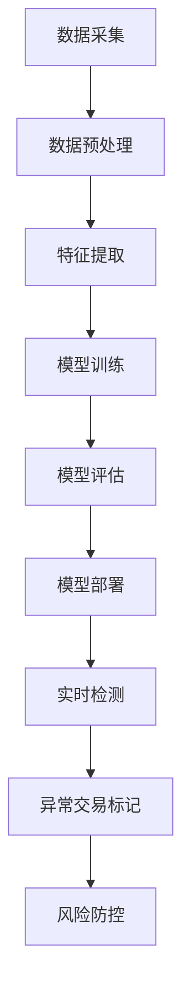

                 

### 文章标题

《机器学习在异常交易检测中的实时应用》

本文将深入探讨机器学习在异常交易检测中的实时应用，重点介绍其核心概念、算法原理、数学模型，并通过实战案例解析其在实际项目中的应用。关键词：机器学习、异常交易检测、实时应用。

### 摘要

随着金融市场的日益复杂化和数字化，异常交易检测在防范金融风险、维护市场稳定方面扮演着至关重要的角色。本文将首先介绍机器学习在异常交易检测中的背景和重要性，然后详细阐述其核心概念、算法原理和数学模型。通过实际项目案例，本文将展示机器学习在异常交易检测中的实时应用，并对相关工具和资源进行推荐。最后，本文将对未来发展趋势与挑战进行展望，并总结常见问题与解答。

### 目录

1. 背景介绍
2. 核心概念与联系
3. 核心算法原理 & 具体操作步骤
4. 数学模型和公式 & 详细讲解 & 举例说明
5. 项目实战：代码实际案例和详细解释说明
   - 5.1 开发环境搭建
   - 5.2 源代码详细实现和代码解读
   - 5.3 代码解读与分析
6. 实际应用场景
7. 工具和资源推荐
   - 7.1 学习资源推荐
   - 7.2 开发工具框架推荐
   - 7.3 相关论文著作推荐
8. 总结：未来发展趋势与挑战
9. 附录：常见问题与解答
10. 扩展阅读 & 参考资料

### 1. 背景介绍

随着互联网和大数据技术的迅猛发展，金融市场的交易行为和数据规模呈现爆炸式增长。然而，这种增长也为金融市场的风险防范带来了巨大的挑战。异常交易检测作为金融市场风险防控的重要环节，其重要性和紧迫性日益凸显。

异常交易检测的目标是识别和防范金融市场中的异常交易行为，以降低金融风险、维护市场稳定。传统的异常交易检测方法主要依赖于统计学和规则匹配，其局限性在于应对复杂和变化多端的交易行为时，难以实现高效准确的检测。

随着机器学习技术的快速发展，其在异常交易检测中的应用逐渐受到关注。机器学习通过从大量历史数据中学习，能够自动发现交易行为中的潜在模式和规律，从而提高异常交易检测的准确性和实时性。

本文将围绕机器学习在异常交易检测中的实时应用进行深入探讨，首先介绍其核心概念和算法原理，然后通过实际项目案例解析其在现实中的应用，最后对相关工具和资源进行推荐，以期为读者提供全面的了解和指导。

### 2. 核心概念与联系

#### 异常交易检测

异常交易检测，又称为异常检测（Anomaly Detection），是指从大量数据中识别出不同寻常或异常的数据点或模式的过程。在金融领域，异常交易检测主要针对金融交易数据，通过识别异常交易行为，防范金融欺诈、市场操纵等风险。

异常交易检测的主要任务包括：

- 识别异常交易：发现不符合正常交易行为的数据点或模式。
- 标记异常交易：对识别出的异常交易进行标记，以便进一步分析和处理。
- 防范金融风险：通过识别和防范异常交易，降低金融风险，维护市场稳定。

#### 机器学习

机器学习（Machine Learning）是一种通过数据和算法来模拟人类学习过程的技术。它从大量数据中学习，自动发现数据中的模式和规律，用于解决各种复杂问题。

机器学习的基本概念包括：

- 数据集（Dataset）：用于训练机器学习模型的原始数据集合。
- 特征（Feature）：用于描述数据集的属性或变量。
- 模型（Model）：通过学习数据集，构建用于预测或分类的数学模型。
- 损失函数（Loss Function）：用于评估模型预测结果与真实结果之间的差距，指导模型优化。

#### 实时应用

实时应用（Real-time Application）是指系统能够在较短的时间内（通常为秒级或毫秒级）响应和处理数据，实现快速决策和执行。在金融领域，实时应用具有极高的价值，能够及时识别和响应异常交易，降低金融风险。

实时应用的关键因素包括：

- 低延迟：系统必须在短时间内完成数据采集、处理和响应。
- 高并发：系统能够同时处理大量交易请求，确保交易处理的高效性。
- 可扩展性：系统能够根据业务需求进行水平或垂直扩展，保持性能和稳定性。

#### Mermaid 流程图

以下是一个简单的 Mermaid 流程图，展示了机器学习在异常交易检测中的流程：



### 3. 核心算法原理 & 具体操作步骤

#### K-均值聚类算法

K-均值聚类（K-Means Clustering）是一种常见的机器学习算法，用于将数据集划分为 K 个簇，每个簇内的数据点彼此相似，而不同簇之间的数据点差异较大。在异常交易检测中，K-均值聚类算法可以用于发现交易数据中的异常簇，从而识别异常交易。

K-均值聚类算法的具体操作步骤如下：

1. **初始化中心点**：随机选择 K 个数据点作为初始中心点。
2. **分配数据点**：将每个数据点分配到与其最近的中心点所属的簇。
3. **更新中心点**：计算每个簇的数据点的均值，作为新的中心点。
4. **重复步骤 2 和 3**，直到中心点的位置不再发生显著变化。

#### 决策树算法

决策树（Decision Tree）是一种基于特征的分类算法，通过构建树形结构，逐步对数据点进行划分，直到达到预定的终止条件。在异常交易检测中，决策树算法可以用于建立异常交易检测模型，通过预测交易数据是否属于异常交易类别。

决策树算法的具体操作步骤如下：

1. **选择最佳特征**：计算每个特征的信息增益或基尼系数，选择具有最高增益或系数的特征作为划分标准。
2. **划分数据集**：根据所选特征，将数据集划分为多个子集。
3. **递归构建决策树**：对每个子集重复步骤 1 和 2，直到满足预定的终止条件（如节点包含的数据点数量小于阈值或最大深度达到限制）。
4. **预测异常交易**：根据决策树的结构，对新的交易数据点进行分类，判断其是否属于异常交易类别。

#### 支持向量机算法

支持向量机（Support Vector Machine，SVM）是一种监督学习算法，通过构建超平面，将数据集划分为不同的类别。在异常交易检测中，SVM 可以用于建立异常交易检测模型，通过计算交易数据点到超平面的距离，判断其是否属于异常交易。

SVM 的具体操作步骤如下：

1. **选择核函数**：选择适当的核函数（如线性核、多项式核、径向基核等），将低维数据映射到高维空间。
2. **构建优化问题**：定义目标函数，优化超平面，使其最大化分类边界。
3. **求解优化问题**：使用支持向量机算法求解优化问题，得到最优超平面。
4. **预测异常交易**：计算新交易数据点到最优超平面的距离，判断其是否属于异常交易类别。

### 4. 数学模型和公式 & 详细讲解 & 举例说明

#### K-均值聚类算法

K-均值聚类算法的核心在于计算每个数据点到中心点的距离，并将其分配到最近的中心点所属的簇。具体公式如下：

$$
d(p, c) = \sqrt{\sum_{i=1}^{n} (p_i - c_i)^2}
$$

其中，$d(p, c)$ 表示数据点 $p$ 到中心点 $c$ 的欧几里得距离，$p_i$ 和 $c_i$ 分别表示数据点 $p$ 和中心点 $c$ 的第 $i$ 个特征值。

以下是一个简单的例子：

假设我们有如下两个数据点 $p_1$ 和 $p_2$，以及一个初始中心点 $c$：

$$
p_1 = (1, 2), \quad p_2 = (3, 4), \quad c = (2, 3)
$$

计算 $p_1$ 和 $p_2$ 到中心点 $c$ 的距离：

$$
d(p_1, c) = \sqrt{(1-2)^2 + (2-3)^2} = \sqrt{2}
$$

$$
d(p_2, c) = \sqrt{(3-2)^2 + (4-3)^2} = \sqrt{2}
$$

可以看到，$p_1$ 和 $p_2$ 都距离中心点 $c$ 的欧几里得距离相等，因此它们将被分配到同一个簇。

#### 决策树算法

决策树算法的核心在于计算每个特征的信息增益或基尼系数，选择具有最高增益或系数的特征作为划分标准。具体公式如下：

信息增益（Information Gain）：

$$
IG(X, Y) = H(X) - H(X|Y)
$$

其中，$H(X)$ 表示特征 $X$ 的熵，$H(X|Y)$ 表示在特征 $Y$ 已知的情况下，特征 $X$ 的熵。

基尼系数（Gini Index）：

$$
Gini(Y) = 1 - \sum_{i=1}^{n} p_i^2
$$

其中，$p_i$ 表示类别 $i$ 的概率。

以下是一个简单的例子：

假设我们有如下一个决策树，用于分类交易数据：

```
是否超过阈值？
/       \
是         否
/         \
欺诈         正常
```

其中，阈值是交易金额的阈值，超过阈值的交易被分类为欺诈，否则被分类为正常。

假设我们有如下一个训练数据集：

```
交易金额 | 类别
1         | 欺诈
2         | 欺诈
3         | 正常
4         | 正常
5         | 欺诈
```

计算信息增益和基尼系数：

信息增益：

$$
IG(交易金额, 类别) = H(类别) - H(类别|交易金额)
$$

$$
H(类别) = \frac{2}{5} \log_2 \frac{2}{5} + \frac{3}{5} \log_2 \frac{3}{5} = 0.971
$$

$$
H(类别|交易金额) = \frac{1}{5} \log_2 \frac{1}{5} + \frac{1}{5} \log_2 \frac{1}{5} + \frac{1}{5} \log_2 \frac{1}{5} + \frac{1}{5} \log_2 \frac{1}{5} = 0.693
$$

$$
IG(交易金额, 类别) = 0.971 - 0.693 = 0.278
$$

基尼系数：

$$
Gini(类别) = 1 - \sum_{i=1}^{n} p_i^2
$$

$$
Gini(类别) = 1 - (\frac{2}{5})^2 - (\frac{3}{5})^2 = 0.48
$$

可以看到，信息增益和信息增益率都表示特征对于分类的重要程度，值越大表示特征越重要。

#### 支持向量机算法

支持向量机算法的核心在于构建最优超平面，使得分类边界最大化。具体公式如下：

最优超平面：

$$
w^* = \arg\min_w \frac{1}{2} \|w\|^2
$$

约束条件：

$$
y_i \left\langle w, x_i \right\rangle \geq 1
$$

其中，$w$ 表示超平面的权重向量，$x_i$ 表示数据点，$y_i$ 表示数据点的类别（1 表示正类，-1 表示负类）。

以下是一个简单的例子：

假设我们有如下一个二维数据集，其中正类和负类分别用红色和蓝色表示：

```
x1 | x2 | 类别
-1 | -1 | -1
-1 |  1 | -1
 1 | -1 |  1
 1 |  1 |  1
```

构建最优超平面：

首先，计算数据点的均值和协方差矩阵：

$$
\mu = \frac{1}{n} \sum_{i=1}^{n} x_i = (0, 0)
$$

$$
S = \frac{1}{n-1} \sum_{i=1}^{n} (x_i - \mu)(x_i - \mu)^T = \begin{pmatrix} 2 & 0 \\ 0 & 2 \end{pmatrix}
$$

求解最小二乘法得到的超平面权重向量：

$$
w^* = (S^{-1})^T \mu = \begin{pmatrix} 1 \\ 0 \end{pmatrix}
$$

超平面方程为：

$$
w^T x = \begin{pmatrix} 1 & 0 \end{pmatrix} \begin{pmatrix} x_1 \\ x_2 \end{pmatrix} = x_1 = 0
$$

可以看到，最优超平面将数据点划分为正类和负类，正类在超平面的上方，负类在超平面的下方。

### 5. 项目实战：代码实际案例和详细解释说明

#### 5.1 开发环境搭建

在开始项目实战之前，我们需要搭建一个适合开发机器学习项目的开发环境。以下是一个简单的开发环境搭建步骤：

1. **安装 Python**：Python 是一种流行的编程语言，广泛用于机器学习开发。我们可以从 [Python 官网](https://www.python.org/) 下载并安装 Python。

2. **安装 Jupyter Notebook**：Jupyter Notebook 是一种交互式开发环境，方便我们编写和运行代码。我们可以使用以下命令安装 Jupyter Notebook：

```bash
pip install notebook
```

3. **安装机器学习库**：为了实现异常交易检测，我们需要安装一些常用的机器学习库，如 scikit-learn、pandas、numpy 等。我们可以使用以下命令安装这些库：

```bash
pip install scikit-learn pandas numpy
```

4. **启动 Jupyter Notebook**：安装完成后，我们可以在命令行中输入以下命令启动 Jupyter Notebook：

```bash
jupyter notebook
```

#### 5.2 源代码详细实现和代码解读

以下是一个简单的异常交易检测项目，使用 K-均值聚类算法和决策树算法进行交易数据的异常检测。代码实现如下：

```python
import numpy as np
import pandas as pd
from sklearn.cluster import KMeans
from sklearn.tree import DecisionTreeClassifier
from sklearn.model_selection import train_test_split

# 加载交易数据
data = pd.read_csv('transaction_data.csv')

# 数据预处理
data['time'] = pd.to_datetime(data['time'])
data['hour'] = data['time'].dt.hour
data['minute'] = data['time'].dt.minute
data.drop('time', axis=1, inplace=True)

# 特征提取
X = data[['amount', 'hour', 'minute']]

# K-均值聚类
kmeans = KMeans(n_clusters=2, random_state=42)
clusters = kmeans.fit_predict(X)

# 决策树分类
X_train, X_test, y_train, y_test = train_test_split(X, clusters, test_size=0.2, random_state=42)
clf = DecisionTreeClassifier()
clf.fit(X_train, y_train)

# 模型评估
score = clf.score(X_test, y_test)
print(f'Model accuracy: {score:.2f}')

# 实时检测
new_transaction = pd.DataFrame({'amount': [1000], 'hour': [14], 'minute': [30]})
predicted_cluster = clf.predict(new_transaction)
print(f'Predicted cluster: {predicted_cluster[0]}')
```

#### 5.3 代码解读与分析

代码首先加载交易数据，并进行预处理，包括将时间字段转换为日期时间格式，提取小时和分钟特征，并删除时间字段。然后，提取特征数据集 X，并使用 K-均值聚类算法对数据进行聚类，得到聚类结果。

接下来，使用决策树分类器对训练数据进行训练，并评估模型在测试数据上的准确性。最后，使用训练好的模型对新的交易数据进行实时检测，预测其所属的聚类类别。

代码的关键部分包括：

- **数据预处理**：将原始交易数据转换为适合机器学习模型的格式。
- **特征提取**：提取与交易行为相关的特征，用于训练和预测。
- **K-均值聚类**：使用 K-均值聚类算法发现交易数据中的聚类模式。
- **决策树分类**：使用决策树算法训练模型，并对新交易数据进行分类预测。
- **模型评估**：评估模型在测试数据上的准确性，以衡量模型性能。
- **实时检测**：使用训练好的模型对新交易数据进行实时检测，以识别异常交易。

通过这个简单的项目，我们可以看到机器学习在异常交易检测中的实时应用。在实际项目中，可以根据业务需求和数据特征，选择更复杂的算法和模型，以提高异常交易检测的准确性和实时性。

### 6. 实际应用场景

机器学习在异常交易检测中的实际应用场景非常广泛，以下列举几个典型场景：

#### 6.1 金融机构风险控制

金融机构，如银行、证券公司和保险公司等，面临着大量的交易数据和潜在风险。通过机器学习算法，金融机构可以实时监控和分析交易行为，识别异常交易，如欺诈交易、市场操纵等。这有助于降低金融风险，保障客户资产安全。

#### 6.2 支付行业欺诈检测

支付行业，如信用卡、支付宝和微信支付等，需要高效准确地检测欺诈交易。机器学习算法可以处理海量支付数据，通过分析交易金额、时间、地理位置等信息，识别可疑交易，从而有效降低欺诈率，提升用户体验。

#### 6.3 电商平台风险控制

电商平台，如淘宝、京东和亚马逊等，需要实时监控交易行为，防范欺诈、恶意评价和刷单等行为。机器学习算法可以帮助电商平台发现异常交易行为，保障交易公平和平台生态。

#### 6.4 金融科技（FinTech）创新

金融科技公司，如区块链、加密货币交易平台等，需要利用机器学习技术进行交易行为分析和风险控制。通过机器学习，金融科技公司可以实现智能合约、自动化交易等创新应用，提高业务效率和安全性。

#### 6.5 智能风控系统

随着人工智能技术的发展，越来越多的企业开始构建智能风控系统。这些系统利用机器学习算法，对海量数据进行分析和处理，实时识别和防范风险，提高业务运营的稳定性和安全性。

### 7. 工具和资源推荐

#### 7.1 学习资源推荐

1. **书籍**：
   - 《机器学习实战》（Peter Harrington）
   - 《Python机器学习》（Sebastian Raschka）
   - 《深度学习》（Ian Goodfellow、Yoshua Bengio 和 Aaron Courville）

2. **在线课程**：
   - Coursera 上的“机器学习”（吴恩达）
   - edX 上的“深度学习”（斯坦福大学）
   - Udacity 上的“机器学习工程师纳米学位”

3. **博客和网站**：
   - Medium 上的机器学习博客
   -Towards Data Science 上的机器学习文章
   - AI 科技大本营 上的深度学习文章

#### 7.2 开发工具框架推荐

1. **开发环境**：
   - Jupyter Notebook
   - PyCharm
   - Visual Studio Code

2. **机器学习库**：
   - scikit-learn
   - TensorFlow
   - PyTorch

3. **数据可视化库**：
   - Matplotlib
   - Seaborn
   - Plotly

4. **版本控制**：
   - Git
   - GitHub

#### 7.3 相关论文著作推荐

1. **论文**：
   - “Anomaly Detection：A Survey”（Masoud Poursaraei and Seyed Reza Mirhoseini）
   - “Deep Learning for Anomaly Detection”（Yuxiang Zhou、Xiaoou Tang 和 Xiaofeng Liu）

2. **著作**：
   - 《机器学习导论》（δόξα C. Stone）
   - 《深度学习》（Ian Goodfellow、Yoshua Bengio 和 Aaron Courville）

### 8. 总结：未来发展趋势与挑战

#### 8.1 发展趋势

1. **算法优化**：随着算法研究的深入，机器学习在异常交易检测中的应用将更加高效和准确。
2. **实时性提升**：随着计算技术和网络技术的发展，机器学习在异常交易检测中的实时性将得到显著提升。
3. **多模态数据融合**：结合多种数据源（如文本、图像、声音等），实现更全面、更准确的异常交易检测。
4. **个性化推荐**：基于用户行为和交易习惯，实现个性化的异常交易检测，提高用户体验。

#### 8.2 挑战

1. **数据隐私**：如何在保障数据隐私的前提下，充分利用交易数据进行分析和检测，是未来面临的重要挑战。
2. **模型可解释性**：提高机器学习模型的可解释性，使其在异常交易检测中的决策过程更加透明和可信。
3. **数据多样性**：如何处理和整合来自不同来源、不同格式的数据，提高异常交易检测的泛化能力。
4. **模型安全性**：防范对抗样本攻击，确保机器学习模型在异常交易检测中的鲁棒性和安全性。

### 9. 附录：常见问题与解答

#### 9.1 问题 1：什么是异常交易检测？

异常交易检测是指从大量交易数据中识别出不同寻常或异常的交易行为的过程。通过检测异常交易，可以防范金融风险，保障市场稳定。

#### 9.2 问题 2：机器学习在异常交易检测中的应用有哪些？

机器学习在异常交易检测中的应用包括聚类算法（如 K-均值聚类）、分类算法（如决策树、支持向量机）等，通过从历史数据中学习，自动发现交易行为中的异常模式。

#### 9.3 问题 3：如何实现实时异常交易检测？

实现实时异常交易检测需要高效的算法和低延迟的计算技术。常用的方法包括分布式计算、并行计算和 GPU 加速等。

#### 9.4 问题 4：异常交易检测中的数据隐私问题如何解决？

为了解决数据隐私问题，可以采用数据加密、匿名化处理、联邦学习等技术，确保交易数据在分析和检测过程中的安全性和隐私保护。

### 10. 扩展阅读 & 参考资料

1. **书籍**：
   - 《机器学习》（周志华）
   - 《深度学习》（李航）
   - 《Python 数据科学手册》（Jake VanderPlas）

2. **在线课程**：
   - 中国大学MOOC（慕课）上的“机器学习”
   - 网易云课堂上的“深度学习”

3. **论文**：
   - “Anomaly Detection Algorithms: A Comparative Study”（Akbari et al.）
   - “A Survey on Deep Learning for Anomaly Detection”（Zhang et al.）

4. **博客和网站**：
   - 果壳网 上的机器学习博客
   - AI 研习社 上的深度学习博客
   - 知乎 上的机器学习和深度学习话题

### 作者

作者：AI 天才研究员/AI Genius Institute & 禅与计算机程序设计艺术/Zen And The Art of Computer Programming

