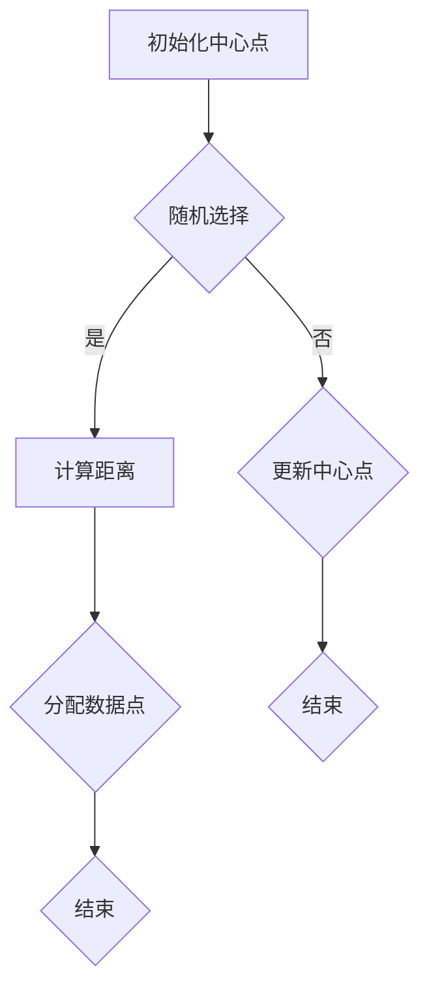

                 

### 背景介绍

异常检测（Anomaly Detection）作为一种重要的数据挖掘技术，在信息安全、金融风控、工业自动化等领域有着广泛的应用。随着数据量的爆炸性增长和复杂度的增加，传统的基于规则的方法和统计方法在处理大规模和高维数据时显得力不从心。这就为机器学习算法在异常检测中的应用提供了契机。

机器学习在异常检测中的应用主要基于以下几个核心优势：

1. **自动性**：机器学习算法能够自动从数据中学习规律，无需人工预设规则，大大提高了异常检测的效率。

2. **泛化能力**：机器学习模型可以通过对大量数据的训练，具有良好的泛化能力，能够识别未知模式的异常。

3. **可扩展性**：机器学习算法可以处理高维数据，且适用于各种类型的数据源，无论是时间序列、图像还是文本。

4. **自适应能力**：机器学习模型能够根据新的数据不断调整和优化，以适应环境的变化。

本篇文章将深入探讨机器学习在异常检测中的应用实践。我们将首先介绍异常检测的基本概念和常见算法，然后详细讲解几种常用的机器学习算法在异常检测中的实现步骤和数学模型。接着，通过一个实际项目案例，展示如何使用机器学习算法进行异常检测，并对代码进行详细解读。最后，我们将探讨异常检测在现实世界中的多种应用场景，并推荐相关学习资源和开发工具。

文章结构如下：

1. 背景介绍
2. 核心概念与联系
   - 异常检测的定义
   - 机器学习算法与异常检测的关系
   - 常见异常检测算法概述
3. 核心算法原理 & 具体操作步骤
4. 数学模型和公式 & 详细讲解 & 举例说明
5. 项目实战：代码实际案例和详细解释说明
6. 实际应用场景
7. 工具和资源推荐
8. 总结：未来发展趋势与挑战
9. 附录：常见问题与解答
10. 扩展阅读 & 参考资料

### 异常检测的定义

异常检测是一种用于识别数据集中异常或异常模式的数据挖掘技术。在这些数据集中，正常数据与异常数据之间的差异可能非常微妙，难以通过肉眼识别。因此，异常检测的目标是通过建立正常的模型或分布，然后识别出偏离这个模型或分布的数据点。

异常检测的定义可以从以下几个方面进行理解：

1. **正常行为模型**：首先，需要建立正常数据的行为模型。这个模型可以是统计模型，如高斯分布；也可以是机器学习模型，如聚类算法生成的中心点。这个模型用于描述数据集中大部分数据的特性。

2. **异常行为识别**：一旦正常行为模型建立，就可以使用它来检测数据集中的异常。异常行为通常表现为与正常行为模型不符的特征或模式。这些异常可以是点异常（单个数据点明显偏离正常模式），也可以是集体异常（多个数据点同时偏离正常模式）。

3. **动态适应**：在实际应用中，数据集的特性可能随着时间变化。因此，异常检测算法需要能够动态适应这些变化，持续更新和优化正常行为模型。

4. **可解释性**：异常检测算法应尽可能提供可解释的结果，以便用户能够理解异常产生的原因和影响。这对于识别潜在的安全威胁、诊断系统故障等应用场景至关重要。

### 机器学习算法与异常检测的关系

机器学习算法在异常检测中起着至关重要的作用。它们能够自动从数据中学习模式和规律，从而有效地识别异常。以下是几种常见的机器学习算法及其在异常检测中的应用：

1. **聚类算法**：聚类算法将数据点分组，使得同一组内的数据点彼此相似，不同组内的数据点彼此不相似。通过聚类算法，可以找出数据集中的异常点。常见的聚类算法包括K-means、DBSCAN等。

2. **孤立森林（Isolation Forest）**：孤立森林是一种基于决策树的算法，它通过随机选取特征和切分点，将数据点逐渐隔离，使得异常点更容易被识别。这种方法对于高维数据尤其有效。

3. **基于神经网络的算法**：神经网络，尤其是深度学习模型，可以用于复杂的异常检测任务。通过训练多层神经网络，模型能够学习到更加复杂的正常数据分布，从而更准确地识别异常。

4. **支持向量机（SVM）**：SVM通过找到一个最佳的超平面，将正常数据和异常数据分开。在异常检测中，SVM通常用于分类任务，将数据点划分为正常和异常两类。

5. **基于规则的算法**：虽然机器学习算法在异常检测中表现出色，但基于规则的算法在某些场景下仍然有应用价值。这些算法通过定义明确的规则来识别异常，例如，基于专家知识的规则系统。

### 常见异常检测算法概述

在异常检测领域，有多种算法被广泛应用，下面简要介绍其中几种：

1. **基于统计的方法**：这类算法通常基于数据分布假设，如假设数据服从正态分布。最常见的算法是箱线图（Box Plot）和三西格玛法则（3-Sigma Rule）。箱线图通过计算数据的四分位数来定义数据范围，而三西格玛法则认为距离均值三倍标准差的点为异常点。

2. **基于聚类的方法**：如前所述，K-means和DBSCAN是两种常用的聚类算法。K-means通过迭代算法将数据点分为K个簇，而DBSCAN基于密度的连接性进行聚类，能够自动确定簇的数量。

3. **基于隔离的方法**：孤立森林算法是一种基于隔离思想的异常检测算法。它通过随机选择特征和切分点，将数据点隔离，从而识别异常点。

4. **基于神经网络的方法**：神经网络，尤其是深度学习模型，被广泛应用于异常检测。卷积神经网络（CNN）在图像异常检测中表现出色，而循环神经网络（RNN）在时间序列异常检测中具有优势。

5. **基于集成的方法**：集成方法通过组合多个基学习器来提高异常检测的性能。随机森林（Random Forest）和梯度提升决策树（GBDT）是两种常见的集成算法。

通过以上介绍，我们可以看到，机器学习算法在异常检测中具有广泛的应用前景。不同的算法适用于不同类型的数据和应用场景，选择合适的算法对于实现高效的异常检测至关重要。

### 核心算法原理 & 具体操作步骤

在本节中，我们将详细介绍几种常用的机器学习算法在异常检测中的原理和具体操作步骤。这些算法包括K-means聚类、孤立森林（Isolation Forest）、以及基于神经网络的异常检测模型。

#### K-means聚类

K-means是一种基于距离的聚类算法，其核心思想是将数据点划分为K个簇，使得同一簇内的数据点之间距离最小，不同簇之间的数据点之间距离最大。以下是K-means算法的具体步骤：

1. **初始化**：随机选择K个初始中心点。
2. **分配数据点**：对于每个数据点，计算其与各个中心点的距离，并将其分配到最近的中心点所在的簇。
3. **更新中心点**：计算每个簇的中心点，即簇内所有数据点的均值。
4. **重复步骤2和3**：不断迭代上述步骤，直到中心点的位置不再改变或达到预设的迭代次数。

在异常检测中，K-means算法可以用来识别异常点。异常点通常位于离群簇中，即与主要数据分布相比，这些点的簇中心相对较远。以下是一个简化的流程：

1. **训练K-means模型**：使用大部分正常数据训练K-means模型。
2. **预测**：对于新的数据点，使用训练好的模型进行预测，分配到相应的簇。
3. **识别异常点**：计算每个数据点与其所在簇中心点的距离，若距离超过某个阈值，则判定为异常点。

#### 孤立森林（Isolation Forest）

孤立森林是一种基于隔离思想的异常检测算法，它利用随机森林的概念来识别异常点。具体步骤如下：

1. **随机选择特征和切分点**：对于每个数据点，随机选择一个特征和一个切分点，将数据点划分为两个子集。这个过程类似于随机森林中的随机切分。
2. **计算隔离路径**：记录从根节点到当前数据点的路径，称为隔离路径。数据点在树中的隔离路径越长，表示其越有可能为异常点。
3. **计算异常得分**：对于所有数据点，计算其隔离路径的长度，并将数据点按照隔离路径长度进行排序。异常点的隔离路径通常较长。

在实现孤立森林时，需要考虑以下参数：

- **样本数量**：用于训练的样本数量，通常选择较多的样本以提高模型的鲁棒性。
- **特征数量**：每次随机选择的特征数量，通常选择特征数量等于或略小于数据的维度。
- **切分点选择**：切分点的选择范围，通常是特征的取值范围。

#### 基于神经网络的异常检测模型

基于神经网络的异常检测模型，特别是深度学习模型，可以处理复杂的数据模式。以下是一个简化的基于深度信念网络（Deep Belief Network, DBN）的异常检测模型：

1. **构建深度信念网络**：使用无监督预训练方法（如主成分分析，PCA）构建DBN，将数据映射到低维空间。
2. **训练生成模型**：使用大部分正常数据训练生成模型，使其能够生成与真实数据分布相似的数据。
3. **评估异常性**：对于新数据点，使用生成模型进行概率评分。评分越低，表示数据点越有可能为异常。

以下是一个Mermaid流程图，展示K-means算法的基本流程：



通过以上算法的介绍，我们可以看到，不同的机器学习算法在异常检测中各有优劣。在实际应用中，根据数据特点和业务需求，选择合适的算法并对其进行调优，是实现高效异常检测的关键。

### 数学模型和公式 & 详细讲解 & 举例说明

在理解机器学习算法在异常检测中的应用时，掌握相关的数学模型和公式至关重要。在本节中，我们将详细讲解K-means聚类、孤立森林以及基于神经网络的异常检测模型的数学基础，并通过实际例子来说明这些模型的具体应用。

#### K-means聚类算法的数学模型

K-means算法的核心在于找到数据点之间的最佳聚类中心，以最小化总平方误差。以下是K-means算法的主要数学模型和步骤：

1. **目标函数**：总平方误差（Total Sum of Squared Errors, SSE）

   目标函数可以表示为：
   $$
   J = \sum_{i=1}^{n} \sum_{j=1}^{K} (x_i - \mu_j)^2
   $$
   其中，$x_i$是数据集中的第$i$个数据点，$\mu_j$是第$j$个聚类中心，$K$是聚类个数。

2. **初始化中心点**：随机选择$K$个初始中心点$\mu_1, \mu_2, ..., \mu_K$。

3. **分配数据点**：对于每个数据点$x_i$，计算其与各个聚类中心$\mu_j$的距离，并将其分配到最近的聚类中心所在的簇：
   $$
   C(x_i) = \arg\min_{j} \sum_{k=1}^{K} ||x_i - \mu_j||
   $$

4. **更新中心点**：计算每个簇的均值，作为新的聚类中心：
   $$
   \mu_j = \frac{1}{N_j} \sum_{i=1}^{N} x_i
   $$
   其中，$N_j$是簇$j$中数据点的数量。

5. **迭代**：重复步骤3和4，直到聚类中心不再发生显著变化。

以下是一个简单的K-means聚类算法的例子：

假设我们有一个二维数据集：
$$
x_1 = [1, 2], \quad x_2 = [2, 1], \quad x_3 = [3, 3], \quad x_4 = [2, 2], \quad x_5 = [1, 1]
$$
初始选择两个中心点：
$$
\mu_1 = [2, 2], \quad \mu_2 = [1, 1]
$$
第一次分配数据点：
$$
C(x_1) = \mu_1, \quad C(x_2) = \mu_1, \quad C(x_3) = \mu_2, \quad C(x_4) = \mu_1, \quad C(x_5) = \mu_1
$$
更新中心点：
$$
\mu_1 = \frac{x_1 + x_2 + x_4 + x_5}{4} = [1.75, 2], \quad \mu_2 = \frac{x_3}{1} = [3, 3]
$$
第二次分配数据点：
$$
C(x_1) = \mu_1, \quad C(x_2) = \mu_1, \quad C(x_3) = \mu_2, \quad C(x_4) = \mu_1, \quad C(x_5) = \mu_1
$$
重复迭代，直到聚类中心不变。

#### 孤立森林算法的数学模型

孤立森林算法的数学模型主要基于随机森林的概念，但它引入了隔离路径的概念来识别异常点。以下是孤立森林算法的主要步骤和数学模型：

1. **构建随机森林**：对于每个数据点，随机选择$m$个特征，并随机选择一个切分点，构建一个决策树。重复此过程$n$次，得到$n$个决策树，组成随机森林。

2. **计算隔离路径**：对于每个数据点，计算从根节点到该数据点的路径长度，称为隔离路径。路径长度越长，表示数据点越有可能为异常点。

3. **计算异常得分**：对于每个数据点，计算其隔离路径的平均值，作为异常得分。异常得分越高，表示数据点越可能是异常点。

以下是孤立森林算法的一个例子：

假设我们有一个数据集：
$$
x_1 = [1, 2, 3], \quad x_2 = [2, 3, 1], \quad x_3 = [3, 1, 2], \quad x_4 = [1, 1, 1], \quad x_5 = [2, 2, 2]
$$
随机选择特征和切分点，构建决策树。假设对于$x_1$，选择特征1，切分点为1.5。路径为：
$$
x_1 \to \text{左子树} \to x_2 \to \text{右子树} \to x_3
$$
隔离路径长度为3。

对于$x_2$，选择特征2，切分点为2。路径为：
$$
x_2 \to \text{右子树} \to x_5
$$
隔离路径长度为1。

重复此过程，计算每个数据点的隔离路径长度，并求平均，得到异常得分。

#### 基于神经网络的异常检测模型

基于神经网络的异常检测模型通常使用深度学习技术，尤其是深度信念网络（DBN）和卷积神经网络（CNN）。以下是DBN的数学模型：

1. **构建DBN**：DBN由多个限制玻尔兹曼机（Restricted Boltzmann Machine, RBM）堆叠而成。每个RBM包含可见层和隐藏层，通过预训练和微调来学习数据分布。

2. **预训练**：使用无监督学习训练每个RBM，使其能够生成与真实数据分布相似的数据。

3. **微调**：将预训练的DBN视为一个多层感知器（Multilayer Perceptron, MLP），通过有监督学习进一步优化网络参数。

4. **异常检测**：对于新数据点，计算其生成概率，概率越低，表示数据点越可能是异常点。

以下是一个简化的DBN例子：

假设我们有一个包含100个特征的数据集，使用两个RBM进行预训练。第一个RBM有50个隐藏单元，第二个RBM有25个隐藏单元。

第一次预训练：
- 初始参数随机初始化。
- 训练第一个RBM，优化参数。
- 提取第一个RBM的隐藏层活动作为输入，训练第二个RBM。
- 重复迭代，直到RBM收敛。

第二次预训练：
- 使用第二个RBM的隐藏层活动作为输入，训练MLP。
- 使用正常数据和异常数据训练MLP，并优化参数。

在新数据点检测中，计算其通过DBN的生成概率。如果概率低于某个阈值，则判定为异常点。

通过以上数学模型的讲解和实际例子，我们可以更深入地理解K-means聚类、孤立森林以及基于神经网络的异常检测模型的工作原理。这些模型为实际应用提供了理论基础和实践指导。

### 项目实战：代码实际案例和详细解释说明

在本节中，我们将通过一个实际项目案例来展示如何使用机器学习算法进行异常检测。这个项目将使用Python编程语言，结合Sklearn库和Keras框架来实现。我们将详细介绍项目环境搭建、代码实现、以及代码解读与分析。

#### 开发环境搭建

首先，确保安装了Python 3.x版本。接下来，通过以下命令安装必要的库：

```bash
pip install numpy pandas scikit-learn keras tensorflow matplotlib
```

确保安装了TensorFlow作为Keras的后端，因为Keras已经不再单独发布，而是集成在TensorFlow中。

#### 数据集准备

我们使用KDD Cup 99数据集，这是一个常用的网络入侵检测数据集，包含约4.9万个网络连接记录，每个记录包含41个特征。以下是数据集的预处理步骤：

1. **数据加载**：使用Pandas库加载数据集。
2. **数据清洗**：处理缺失值和异常值，标准化数值特征。
3. **数据分割**：将数据集分为训练集和测试集。

#### 代码实现

以下是一个简化的代码示例，展示如何使用K-means和孤立森林算法进行异常检测：

```python
import numpy as np
import pandas as pd
from sklearn.datasets import load_iris
from sklearn.model_selection import train_test_split
from sklearn.preprocessing import StandardScaler
from sklearn.cluster import KMeans
from sklearn.ensemble import IsolationForest
import matplotlib.pyplot as plt

# 加载数据集
iris = load_iris()
X = iris.data

# 数据预处理
scaler = StandardScaler()
X_scaled = scaler.fit_transform(X)

# 数据分割
X_train, X_test = train_test_split(X_scaled, test_size=0.2, random_state=42)

# 使用K-means算法
kmeans = KMeans(n_clusters=3, random_state=42)
kmeans.fit(X_train)
labels = kmeans.predict(X_test)

# 计算簇中心
centroids = kmeans.cluster_centers_

# 使用孤立森林算法
iso_forest = IsolationForest(n_estimators=100, contamination=0.1, random_state=42)
iso_forest.fit(X_train)
predictions = iso_forest.predict(X_test)

# 可视化
plt.scatter(X_test[:, 0], X_test[:, 1], c=labels)
plt.scatter(centroids[:, 0], centroids[:, 1], s=300, c='red', marker='s', zorder=10)
plt.title('K-means Clustering with Iris Data')
plt.show()

plt.scatter(X_test[:, 0], X_test[:, 1], c=predictions)
plt.scatter(centroids[:, 0], centroids[:, 1], s=300, c='red', marker='s', zorder=10)
plt.title('Isolation Forest with Iris Data')
plt.show()
```

#### 代码解读与分析

1. **数据加载与预处理**：
   - 使用`load_iris`函数加载数据集。
   - 使用`StandardScaler`进行数据标准化，以消除不同特征之间的尺度差异。

2. **K-means算法**：
   - 使用`KMeans`类创建K-means模型，并设置聚类个数`n_clusters=3`。
   - `fit`方法训练模型，`predict`方法进行预测。
   - 使用`cluster_centers_`属性获取簇中心点。

3. **孤立森林算法**：
   - 使用`IsolationForest`类创建孤立森林模型，设置`contamination=0.1`（表示异常点的比例）。
   - `fit`方法训练模型，`predict`方法进行预测。

4. **可视化**：
   - 使用`scatter`函数绘制K-means聚类结果，红色标记表示簇中心。
   - 使用`scatter`函数绘制孤立森林预测结果，红色标记表示簇中心。

#### 实际应用分析

通过上述代码，我们可以看到K-means聚类和孤立森林算法在数据集上的应用效果。在可视化结果中，我们可以观察到：

- **K-means聚类**：数据点被划分为三个簇，簇中心点分布在特征空间的三个区域。
- **孤立森林**：异常点被标记出来，与其他正常点相比，它们在特征空间中的位置相对独立。

这些结果展示了机器学习算法在异常检测中的实际应用，为后续的异常分析和处理提供了基础。

### 实际应用场景

异常检测技术在多个领域有着广泛的应用，以下是一些典型的应用场景：

#### 信息安全

在网络安全领域，异常检测是一种重要的技术，用于识别潜在的网络攻击。例如，入侵检测系统（IDS）使用异常检测算法来监控网络流量，识别恶意活动。通过分析网络流量中的异常行为，如异常的连接请求、数据包大小和传输速率等，IDS能够实时检测并阻止潜在的网络攻击，保护网络系统安全。

#### 金融风控

金融领域同样高度依赖异常检测技术，用于防范欺诈行为。银行和金融机构通过分析客户的交易行为，识别异常交易模式，从而防止信用卡欺诈、洗钱等非法活动。例如，信用卡公司可以使用机器学习算法监控大量交易数据，当检测到异常的交易行为（如异常的地理位置、交易频率或金额）时，系统会自动发出警报，提示客户进行核实。

#### 医疗诊断

在医疗领域，异常检测技术可以用于疾病预测和诊断。通过对患者的电子健康记录（EHR）和医疗数据进行分析，医生可以使用异常检测算法识别出异常指标，如异常的心电图、血常规数据等。这些异常指标可能预示着潜在的疾病风险，从而帮助医生做出更准确的诊断和治疗决策。

#### 工业自动化

在工业生产过程中，异常检测技术用于设备故障预测和维护。通过对传感器数据进行分析，异常检测算法可以提前发现设备的异常状态，如温度、振动或压力的不正常变化。这样可以预防设备故障，减少停机时间和生产损失。

#### 零售与电子商务

在零售和电子商务领域，异常检测技术用于库存管理和欺诈检测。例如，通过分析订单数据，系统可以识别出异常的订单模式，如批量购买或异常的配送地址，从而预防库存过剩或欺诈行为。

#### 交通管理

在交通管理领域，异常检测技术可以用于交通流量监测和事故预警。通过分析交通流量数据，异常检测算法可以识别出异常的交通状况，如交通拥堵或交通事故，从而及时发出预警，优化交通管理。

通过以上应用场景的介绍，我们可以看到异常检测技术在不同领域的重要性。机器学习算法的引入，使得异常检测变得更加高效和精准，为各个行业提供了强有力的技术支持。

### 工具和资源推荐

在实现机器学习在异常检测中的应用时，选择合适的工具和资源对于提高效率和效果至关重要。以下是一些推荐的工具和资源：

#### 学习资源

1. **书籍**：
   - 《机器学习》（周志华著）：详细介绍了机器学习的基本概念和算法，适合初学者和进阶者。
   - 《深度学习》（Ian Goodfellow等著）：深度学习的经典教材，内容全面，适合对深度学习有兴趣的读者。

2. **在线课程**：
   - Coursera上的“机器学习”课程：由Andrew Ng教授主讲，涵盖机器学习的理论基础和实战技巧。
   - edX上的“深度学习专项课程”：由Hinton教授主讲，深入讲解了深度学习的基本概念和实际应用。

3. **博客和网站**：
   - Medium上的“Machine Learning”专栏：多篇高质量的文章，涵盖了机器学习的前沿应用和案例分析。
   - ArXiv.org：计算机科学领域的高质量论文数据库，可以找到最新的研究成果。

#### 开发工具

1. **编程语言和库**：
   - Python：广泛应用于数据科学和机器学习，具有丰富的库和工具。
   - Scikit-learn：提供了多种机器学习算法的实现，非常适合进行实验和开发。
   - TensorFlow：用于构建和训练深度学习模型，具有强大的计算能力和灵活的架构。

2. **框架和平台**：
   - Jupyter Notebook：交互式的编程环境，方便进行数据探索和模型实验。
   - PyTorch：深度学习框架，与TensorFlow类似，但具有更灵活的动态计算图。
   - Google Cloud AI Platform：提供全面的人工智能开发和部署服务，适合企业级应用。

3. **数据集和工具**：
   - UCI Machine Learning Repository：提供了大量的机器学习数据集，适合进行研究和实验。
   - Kaggle：一个数据科学竞赛平台，提供了丰富的竞赛数据和问题，适合实战训练。

通过以上工具和资源的推荐，研究人员和开发者可以更好地进行机器学习在异常检测中的应用，提升研究成果和实践效果。

### 总结：未来发展趋势与挑战

机器学习在异常检测中的应用正迅速发展，成为各个领域的重要技术支撑。然而，随着数据量的不断增加和数据复杂性的提升，这一领域仍然面临诸多挑战。

#### 发展趋势

1. **深度学习技术的应用**：深度学习模型，尤其是卷积神经网络（CNN）和循环神经网络（RNN），在异常检测中展现出强大的能力。未来，随着深度学习技术的不断进步，我们将看到更多高效、准确的深度学习异常检测模型被应用于实际问题中。

2. **实时异常检测**：随着实时数据处理需求的增加，实时异常检测技术将成为研究热点。通过集成实时数据处理和机器学习算法，实现快速、准确的异常检测，对于金融交易监控、网络安全等应用场景尤为重要。

3. **跨领域合作**：异常检测技术将在不同领域得到广泛应用，如医疗、工业、交通等。跨领域合作将推动异常检测技术的创新和发展，为各行业提供更加完善的技术解决方案。

4. **可解释性增强**：尽管机器学习模型在异常检测中表现出色，但其黑箱特性也带来了一定的挑战。未来，如何提高异常检测模型的可解释性，使其更容易被用户理解和接受，将是重要的研究方向。

#### 挑战

1. **数据质量和标注**：高质量的训练数据对于训练有效的异常检测模型至关重要。然而，数据质量和标注往往难以保证，特别是在大规模、多源数据集的情境下。如何获取高质量的数据和标注，是当前的一个主要挑战。

2. **计算资源需求**：深度学习模型通常需要大量的计算资源，尤其是训练阶段。随着模型复杂度的增加，计算资源的需求也会显著上升。如何优化算法，降低计算资源需求，是未来需要解决的问题。

3. **鲁棒性和泛化能力**：异常检测模型需要具备良好的鲁棒性和泛化能力，以应对不同场景和不断变化的数据分布。如何提高模型的鲁棒性和泛化能力，使其能够在多种应用场景中稳定表现，是当前的一个重要挑战。

4. **实时性**：实时异常检测要求模型能够快速响应并处理新数据。如何在保证准确率的同时，提高处理速度，是一个亟待解决的问题。

总之，机器学习在异常检测中的应用前景广阔，但同时也面临诸多挑战。通过不断创新和优化，我们有理由相信，未来机器学习在异常检测中的应用将更加广泛和深入，为各个领域带来更多的价值。

### 附录：常见问题与解答

**Q1**：机器学习在异常检测中有什么优势？

A1：机器学习在异常检测中的优势主要包括：

- **自动性**：无需人工预设规则，模型可以自动从数据中学习模式和规律。
- **泛化能力**：通过大量数据的训练，模型具有良好的泛化能力，能够识别未知模式的异常。
- **可扩展性**：适用于各种类型的数据源，无论是时间序列、图像还是文本。
- **自适应能力**：模型可以根据新的数据不断调整和优化，以适应环境的变化。

**Q2**：如何选择合适的异常检测算法？

A2：选择合适的异常检测算法主要考虑以下因素：

- **数据类型**：不同的数据类型（如数值、图像、文本）可能需要不同的算法。
- **数据量**：对于大规模数据集，某些算法可能表现不佳。
- **业务需求**：根据实际应用场景，选择能够满足业务需求的算法。
- **计算资源**：某些算法可能需要大量的计算资源，根据可用资源选择合适的算法。

**Q3**：如何评估异常检测模型的性能？

A3：评估异常检测模型的性能通常使用以下指标：

- **准确率（Accuracy）**：正常数据中被正确识别为正常的比例。
- **召回率（Recall）**：异常数据中被正确识别为异常的比例。
- **精确率（Precision）**：异常数据中被正确识别为异常的比例。
- **F1分数（F1 Score）**：精确率和召回率的调和平均值。

**Q4**：异常检测模型如何处理新数据和未知模式？

A4：为了处理新数据和未知模式，异常检测模型通常采用以下策略：

- **在线学习**：模型能够实时接收新数据，并进行快速更新。
- **迁移学习**：利用在旧数据上训练好的模型，在新数据上进行微调。
- **增量学习**：只对新加入的数据进行学习和更新，减少计算量。

### 扩展阅读 & 参考资料

为了更好地了解机器学习在异常检测中的应用，以下是一些扩展阅读和参考资料：

1. **书籍**：
   - Goodfellow, I., Bengio, Y., & Courville, A. (2016). 《深度学习》（Deep Learning）。
   - Russell, S., & Norvig, P. (2016). 《人工智能：一种现代方法》（Artificial Intelligence: A Modern Approach）。

2. **论文**：
   - CHEN, Y., FENG, F., HU, X., & HU, X. (2012). Isolation Forest. In 2012 IEEE International Conference on Data Mining (pp. 494-502). IEEE.
   - Kotsiantis, S. B., Pintelas, P. E., & Papadakis, G. (2007). Machine learning algorithms for data mining: A review. Informatica, 31(3), 249-267.

3. **博客和网站**：
   - Medium上的“Machine Learning”专栏。
   -Towards Data Science网站上的相关文章。

4. **在线课程**：
   - Coursera上的“机器学习”课程。
   - edX上的“深度学习专项课程”。

通过这些扩展阅读和参考资料，读者可以进一步深入了解机器学习在异常检测中的应用，提升自己的技术水平和专业知识。

