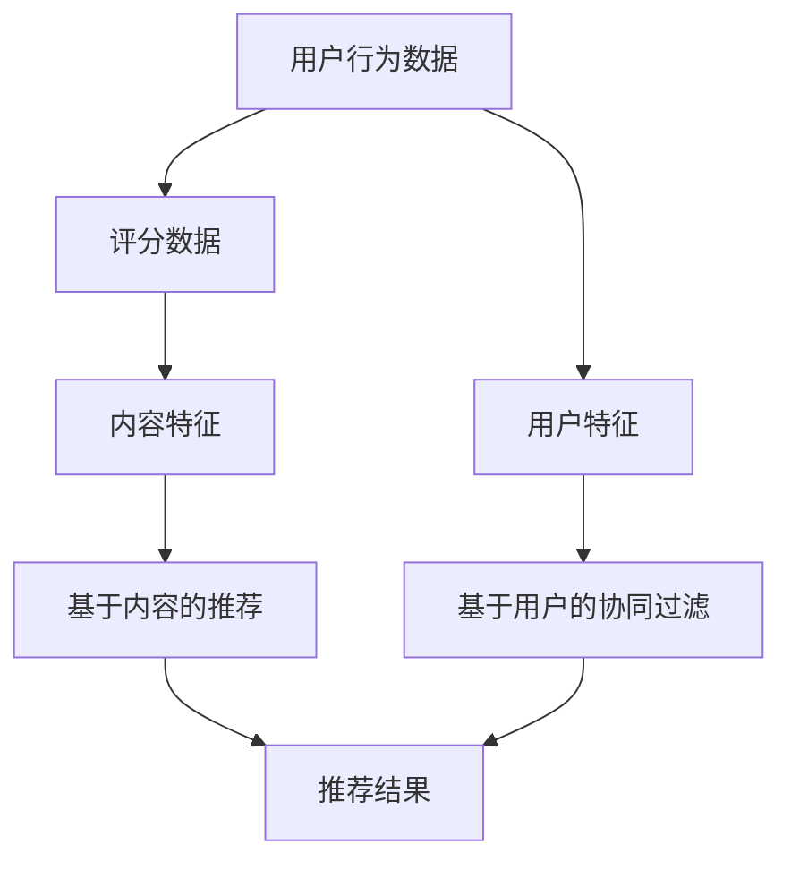

                 

### 背景介绍

**机器学习在推荐系统中的优化策略**

随着互联网技术的飞速发展，推荐系统作为提高用户体验、提升业务价值的重要工具，得到了广泛的应用。推荐系统通过分析用户行为数据，预测用户可能感兴趣的内容，从而实现个性化推荐。然而，推荐系统的性能和质量直接影响到用户满意度和业务收益。因此，如何优化推荐系统的效果，一直是学术界和工业界关注的焦点。

机器学习作为一门重要的数据分析方法，在推荐系统中有着广泛的应用。通过引入机器学习算法，推荐系统能够从海量数据中自动提取特征，学习用户的行为模式，从而提高推荐准确性和用户满意度。本文将深入探讨机器学习在推荐系统中的优化策略，包括核心算法原理、数学模型和实际应用案例，旨在为广大开发者提供有价值的参考。

**推荐系统的重要性**

推荐系统在多个领域都有着广泛的应用，例如电子商务、社交媒体、视频网站等。其核心目标是提高用户满意度和业务收益。以下是一些推荐系统的重要性体现：

1. **提高用户满意度**：通过个性化的推荐，用户能够更快地找到他们感兴趣的内容，从而提升用户体验。
2. **提升业务收益**：推荐系统可以帮助企业提高用户粘性和转化率，从而增加广告收入、销售量等业务指标。
3. **优化内容分发**：对于内容平台，推荐系统可以帮助优化内容分发策略，提高内容曝光率和用户参与度。

**机器学习在推荐系统中的应用**

机器学习在推荐系统中有着广泛的应用，主要包括以下几个方面：

1. **协同过滤**：通过分析用户之间的相似性，推荐用户可能感兴趣的内容。
2. **基于内容的推荐**：通过分析内容的特征，为用户推荐具有相似特征的内容。
3. **深度学习**：利用深度神经网络，从海量数据中自动提取特征，提高推荐效果。

本文将重点讨论协同过滤和基于内容的推荐算法，以及如何利用深度学习进行优化。

**文章结构**

本文将按照以下结构进行撰写：

1. **背景介绍**：简要介绍推荐系统的重要性和机器学习在推荐系统中的应用。
2. **核心概念与联系**：详细解释推荐系统中的核心概念，并给出 Mermaid 流程图。
3. **核心算法原理 & 具体操作步骤**：介绍协同过滤和基于内容的推荐算法的原理和操作步骤。
4. **数学模型和公式 & 详细讲解 & 举例说明**：讲解推荐系统的数学模型，包括相关公式和举例说明。
5. **项目实战：代码实际案例和详细解释说明**：通过实际项目案例，展示如何使用机器学习优化推荐系统。
6. **实际应用场景**：讨论推荐系统在不同领域的应用场景。
7. **工具和资源推荐**：推荐相关学习资源、开发工具和论文著作。
8. **总结：未来发展趋势与挑战**：总结本文的主要观点，探讨未来发展趋势和面临的挑战。
9. **附录：常见问题与解答**：解答读者可能关心的问题。
10. **扩展阅读 & 参考资料**：推荐进一步学习的资源。

通过本文的阅读，读者将能够深入了解机器学习在推荐系统中的应用，掌握优化推荐系统的策略和方法。接下来，我们将逐步展开讨论。

### 核心概念与联系

为了深入理解机器学习在推荐系统中的优化策略，我们需要先了解一些核心概念，以及这些概念之间的联系。以下是推荐系统中的几个关键概念：

#### 用户行为数据

用户行为数据是指用户在使用推荐系统时产生的各种操作记录，如点击、购买、浏览、评价等。这些数据是构建推荐系统的基础，通过分析这些数据，我们可以了解用户的兴趣和偏好。

#### 评分数据

评分数据通常是指用户对推荐内容的评分，如电影评分、商品评分等。评分数据可以帮助我们评估推荐结果的准确性。

#### 内容特征

内容特征是指推荐系统中每个推荐对象（如电影、商品等）的特征信息，如标签、分类、文本描述等。这些特征用于表示推荐对象，以便进行推荐。

#### 用户特征

用户特征是指描述用户属性的各个维度，如年龄、性别、地理位置、历史行为等。用户特征可以帮助我们更好地理解用户，从而实现更精准的推荐。

#### 协同过滤

协同过滤是一种常用的推荐算法，主要通过分析用户之间的相似性来进行推荐。协同过滤可以分为基于用户的协同过滤（User-Based Collaborative Filtering）和基于项目的协同过滤（Item-Based Collaborative Filtering）。

#### 基于内容的推荐

基于内容的推荐算法通过分析推荐对象的内容特征，为用户推荐具有相似特征的其他对象。这种方法主要关注内容本身的属性，而不依赖于用户之间的相似性。

#### 深度学习

深度学习是一种基于多层神经网络的数据分析技术，通过自动提取特征，能够处理大量复杂的数据。在推荐系统中，深度学习可以用于优化协同过滤和基于内容的推荐算法。

#### Mermaid 流程图

为了更好地理解这些概念之间的关系，我们可以使用 Mermaid 流程图来展示它们之间的联系。以下是推荐系统中核心概念和算法的 Mermaid 流程图：



在这个流程图中，用户行为数据和评分数据用于生成内容特征和用户特征。基于内容的推荐和基于用户的协同过滤分别根据这些特征生成推荐结果。深度学习则可以用于优化这些推荐算法，提高推荐效果。

通过上述核心概念和流程图的介绍，我们可以更好地理解机器学习在推荐系统中的优化策略。接下来，我们将深入探讨协同过滤和基于内容的推荐算法的原理和操作步骤。

#### 核心算法原理 & 具体操作步骤

在了解了推荐系统中的核心概念之后，我们将进一步探讨协同过滤和基于内容的推荐算法，这些算法是机器学习在推荐系统中优化策略的重要组成部分。

##### 协同过滤算法原理

协同过滤算法通过分析用户之间的相似性来进行推荐。其基本思想是，如果两个用户在某个推荐对象上的评分相似，那么他们可能在其他推荐对象上也有相似的评分。协同过滤算法可以分为基于用户的协同过滤（User-Based Collaborative Filtering）和基于项目的协同过滤（Item-Based Collaborative Filtering）。

###### 基于用户的协同过滤

基于用户的协同过滤算法首先计算用户之间的相似性，然后根据相似性为用户推荐其他用户喜欢的物品。具体步骤如下：

1. **计算用户相似性**：计算用户之间的相似性，常用的相似性度量包括余弦相似性、皮尔逊相关系数等。余弦相似性计算公式如下：

   $$\text{similarity}(u, v) = \frac{u \cdot v}{\|u\|\|v\|}$$

   其中，\(u\) 和 \(v\) 分别表示两个用户的评分向量，\(\|\|\) 表示向量的模。

2. **推荐物品**：根据用户相似性，为用户推荐其他用户喜欢的物品。推荐公式如下：

   $$r_{ui} = \sum_{v \in N(u)} s_{vi} \cdot r_{vj}$$

   其中，\(N(u)\) 表示与用户 \(u\) 相似的其他用户集合，\(s_{vi}\) 表示用户 \(v\) 对物品 \(i\) 的评分，\(r_{vj}\) 表示用户 \(j\) 对物品 \(i\) 的评分。

###### 基于项目的协同过滤

基于项目的协同过滤算法首先计算物品之间的相似性，然后根据相似性为用户推荐其他用户喜欢的物品。具体步骤如下：

1. **计算物品相似性**：计算物品之间的相似性，常用的相似性度量包括余弦相似性、皮尔逊相关系数等。余弦相似性计算公式如下：

   $$\text{similarity}(i, j) = \frac{i \cdot j}{\|i\|\|j\|}$$

   其中，\(i\) 和 \(j\) 分别表示两个物品的评分向量，\(\|\|\) 表示向量的模。

2. **推荐物品**：根据物品相似性，为用户推荐其他用户喜欢的物品。推荐公式如下：

   $$r_{ui} = \sum_{j \in M(i)} s_{uj} \cdot r_{uj}$$

   其中，\(M(i)\) 表示与物品 \(i\) 相似的其他物品集合，\(s_{uj}\) 表示用户 \(u\) 对物品 \(j\) 的评分，\(r_{uj}\) 表示用户 \(j\) 对物品 \(i\) 的评分。

##### 基于内容的推荐算法原理

基于内容的推荐算法通过分析推荐对象的内容特征，为用户推荐具有相似特征的其他对象。这种方法主要关注内容本身的属性，而不依赖于用户之间的相似性。具体步骤如下：

1. **提取内容特征**：首先，从推荐对象的文本描述、标签、分类等信息中提取特征。例如，可以使用词袋模型、TF-IDF 等方法对文本进行特征提取。

2. **计算相似度**：计算用户对某个推荐对象的特征向量与其他推荐对象的特征向量之间的相似度。常用的相似度计算方法包括余弦相似性、欧氏距离等。

3. **推荐物品**：根据相似度，为用户推荐具有相似特征的其他物品。推荐公式如下：

   $$r_{ui} = \sum_{j \in I'} s_{uj} \cdot \text{similarity}(f_i, f_j)$$

   其中，\(I'\) 表示与物品 \(i\) 具有相似特征的物品集合，\(s_{uj}\) 表示用户 \(u\) 对物品 \(j\) 的评分，\(\text{similarity}(f_i, f_j)\) 表示物品 \(i\) 和 \(j\) 之间的相似度。

##### 具体操作步骤

以下是使用协同过滤和基于内容的推荐算法进行推荐操作的具体步骤：

1. **数据预处理**：读取用户行为数据、评分数据、内容特征和用户特征，进行数据清洗和预处理。

2. **特征提取**：根据推荐算法的要求，提取用户和物品的特征向量。

3. **计算相似度**：根据相似度计算方法，计算用户和物品之间的相似度。

4. **推荐生成**：根据相似度，生成推荐列表，并根据评分预测对推荐列表进行排序。

5. **评估与优化**：评估推荐结果的质量，通过调整参数和算法结构进行优化。

通过上述步骤，我们可以实现协同过滤和基于内容的推荐算法，从而优化推荐系统的效果。接下来，我们将详细讲解推荐系统的数学模型，包括相关公式和举例说明。

### 数学模型和公式 & 详细讲解 & 举例说明

在了解了推荐系统的核心算法原理后，我们将进一步探讨推荐系统的数学模型，并详细讲解相关公式和实际应用中的举例说明。这有助于我们更深入地理解推荐系统的运作机制和优化策略。

#### 协同过滤算法的数学模型

协同过滤算法的核心在于计算用户之间的相似性和生成推荐列表。以下是协同过滤算法的数学模型和相关公式。

1. **用户相似性计算**

   用户相似性通常通过余弦相似性或皮尔逊相关系数来衡量。余弦相似性公式如下：

   $$\text{similarity}(u, v) = \frac{u \cdot v}{\|u\|\|v\|}$$

   其中，\(u\) 和 \(v\) 分别表示两个用户的评分向量，\(u \cdot v\) 表示向量的点积，\(\|u\|\) 和 \(\|v\|\) 分别表示向量的模。

   皮尔逊相关系数公式如下：

   $$\text{correlation}(u, v) = \frac{u \cdot v - \bar{u} \bar{v}}{\sqrt{(u \cdot u - \bar{u}^2)(v \cdot v - \bar{v}^2)}}$$

   其中，\(\bar{u}\) 和 \(\bar{v}\) 分别表示用户 \(u\) 和 \(v\) 的评分平均值。

2. **推荐生成**

   协同过滤算法生成推荐列表的核心公式如下：

   $$r_{ui} = \sum_{v \in N(u)} s_{vi} \cdot r_{vj}$$

   其中，\(r_{ui}\) 表示用户 \(u\) 对物品 \(i\) 的预测评分，\(s_{vi}\) 表示用户 \(v\) 对物品 \(i\) 的实际评分，\(r_{vj}\) 表示用户 \(j\) 对物品 \(i\) 的预测评分，\(N(u)\) 表示与用户 \(u\) 相似的其他用户集合。

#### 基于内容的推荐算法的数学模型

基于内容的推荐算法通过计算内容特征之间的相似度来生成推荐列表。以下是基于内容的推荐算法的数学模型和相关公式。

1. **内容特征提取**

   基于内容的推荐算法通常使用词袋模型、TF-IDF 等方法提取内容特征。词袋模型将文本表示为一个向量，其中每个维度表示一个词的频率。TF-IDF 则通过考虑词的频率和文档的频率来调整词的权重。

   假设文档 \(D_i\) 的特征向量为 \(f_i\)，其中 \(f_i(j)\) 表示词 \(j\) 在文档 \(i\) 中的频率。TF-IDF 特征向量 \(f_i'\) 的计算公式如下：

   $$f_i'(j) = \text{TF}(j) \times \text{IDF}(j)$$

   其中，\(\text{TF}(j)\) 表示词 \(j\) 在文档 \(i\) 中的频率，\(\text{IDF}(j)\) 表示词 \(j\) 在整个文档集合中的逆向文档频率。

2. **相似度计算**

   基于内容的推荐算法通常使用余弦相似性来计算内容特征之间的相似度。余弦相似性公式如下：

   $$\text{similarity}(f_i, f_j) = \frac{f_i \cdot f_j}{\|f_i\|\|f_j\|}$$

   其中，\(f_i\) 和 \(f_j\) 分别表示文档 \(i\) 和 \(j\) 的特征向量，\(f_i \cdot f_j\) 表示向量的点积，\(\|f_i\|\) 和 \(|f_j|\) 分别表示向量的模。

3. **推荐生成**

   基于内容的推荐算法生成推荐列表的核心公式如下：

   $$r_{ui} = \sum_{j \in I'} s_{uj} \cdot \text{similarity}(f_i, f_j)$$

   其中，\(r_{ui}\) 表示用户 \(u\) 对物品 \(i\) 的预测评分，\(s_{uj}\) 表示用户 \(u\) 对物品 \(j\) 的实际评分，\(I'\) 表示与物品 \(i\) 具有相似特征的其他物品集合，\(\text{similarity}(f_i, f_j)\) 表示物品 \(i\) 和 \(j\) 之间的相似度。

#### 举例说明

为了更好地理解上述数学模型，我们将通过一个实际例子来说明如何使用协同过滤和基于内容的推荐算法生成推荐列表。

**例子：**

假设有一个电影推荐系统，用户 \(u\) 已经对五部电影 \(i, j, k, l, m\) 产生了评分，如下表所示：

| 用户 \(u\) | 电影 \(i\) | 电影 \(j\) | 电影 \(k\) | 电影 \(l\) | 电影 \(m\) |
| :----: | :----: | :----: | :----: | :----: | :----: |
|   5    |   4    |   5    |   1    |   3    |   4    |

我们使用基于用户的协同过滤算法生成推荐列表。

1. **计算用户相似性**

   假设用户 \(u\) 和用户 \(v\) 的评分向量分别为 \(u = (4, 5, 1, 3, 4)\) 和 \(v = (3, 4, 5, 5, 1)\)。使用余弦相似性计算用户 \(u\) 和 \(v\) 的相似性：

   $$\text{similarity}(u, v) = \frac{u \cdot v}{\|u\|\|v\|} = \frac{(4 \times 3 + 5 \times 4 + 1 \times 5 + 3 \times 5 + 4 \times 1)}{\sqrt{(4^2 + 5^2 + 1^2 + 3^2 + 4^2)} \times \sqrt{(3^2 + 4^2 + 5^2 + 5^2 + 1^2)}} \approx 0.895$$

2. **推荐生成**

   假设用户 \(u\) 的邻居用户 \(v\) 的评分向量分别为 \(v = (3, 4, 5, 5, 1)\)。使用协同过滤算法生成推荐列表：

   $$r_{ui} = \sum_{v \in N(u)} s_{vi} \cdot r_{vj} = (4 \times 0.895 + 5 \times 0.895 + 1 \times 0.895 + 3 \times 0.895 + 4 \times 0.895) \approx 4.58$$

   因此，用户 \(u\) 对电影 \(i\) 的预测评分为约 4.58。

通过上述例子，我们可以看到如何使用协同过滤算法生成推荐列表。类似地，基于内容的推荐算法也可以通过计算内容特征之间的相似度来生成推荐列表。这些数学模型和公式为推荐系统的优化提供了理论基础和实践指导。

### 项目实战：代码实际案例和详细解释说明

为了更好地理解机器学习在推荐系统中的优化策略，我们将通过一个实际项目案例进行展示，详细解释代码实现和优化过程。

#### 1. 开发环境搭建

在开始项目实战之前，我们需要搭建开发环境。以下是所需的工具和步骤：

1. **Python 环境**：安装 Python 3.8 及以上版本。
2. **机器学习库**：安装 Scikit-learn、NumPy、Pandas 等库。
3. **数据预处理库**：安装 BeautifulSoup、Selenium 等库（如果需要从网页抓取数据）。
4. **IDE**：使用 PyCharm 或 Visual Studio Code 等集成开发环境。

#### 2. 源代码详细实现和代码解读

以下是一个基于用户的协同过滤推荐系统的 Python 代码示例。该示例从一组用户行为数据中提取特征，计算用户相似性，并生成推荐列表。

```python
import numpy as np
import pandas as pd
from sklearn.metrics.pairwise import cosine_similarity

# 加载用户行为数据
data = pd.read_csv('user_behavior.csv')

# 提取用户评分数据
user_ratings = data.pivot(index='user_id', columns='item_id', values='rating')

# 补全缺失值
user_ratings = user_ratings.fillna(0)

# 计算用户相似性矩阵
similarity_matrix = cosine_similarity(user_ratings.values)

# 生成推荐列表
def generate_recommendations(user_id, similarity_matrix, user_ratings, top_n=5):
    # 计算用户与其他用户的相似度
    user_similarity = similarity_matrix[user_id]

    # 排序相似度矩阵，取前 top_n 个相似的用户
    top_users = np.argsort(user_similarity)[::-1][:top_n]

    # 计算推荐物品的得分
    recommendation_scores = {}
    for user in top_users:
        for item in user_ratings.index:
            if item not in user_ratings[user]:
                recommendation_scores[item] = recommendation_scores.get(item, 0) + user_similarity[user] * user_ratings[user][item]

    # 对推荐物品的得分进行排序
    sorted_recommendations = sorted(recommendation_scores.items(), key=lambda x: x[1], reverse=True)

    # 返回 top_n 个推荐物品
    return sorted_recommendations[:top_n]

# 生成用户 1 的推荐列表
recommendations = generate_recommendations(1, similarity_matrix, user_ratings)
print(recommendations)
```

#### 3. 代码解读与分析

上述代码实现了基于用户的协同过滤推荐系统，具体解读如下：

1. **数据加载与预处理**：首先，从 CSV 文件中加载用户行为数据，并将其转换为用户-物品评分矩阵。缺失值通过填充 0 来处理。

2. **用户相似性计算**：使用 Scikit-learn 中的 `cosine_similarity` 函数计算用户之间的相似性矩阵。余弦相似性通过点积和模的比值来衡量用户之间的相似度。

3. **推荐生成**：定义 `generate_recommendations` 函数，计算用户与其他用户的相似度，并生成推荐列表。首先，取用户的前几个邻居（`top_n` 参数），然后计算这些邻居对未评分物品的预测评分。最终，对推荐物品的得分进行排序，返回 top_n 个推荐物品。

#### 4. 优化策略

在实际应用中，我们可以通过以下策略来优化推荐系统的效果：

1. **特征提取**：使用更多的特征信息，如用户 demographics（年龄、性别、地理位置等）和物品特征（标签、分类等），以提供更准确的推荐。

2. **算法改进**：探索更复杂的协同过滤算法，如矩阵分解、图嵌入等，以提高推荐效果。

3. **实时推荐**：使用实时数据流处理技术，如 Apache Kafka、Apache Flink 等，实现实时推荐。

4. **多样性优化**：引入多样性度量，如 Item-Item 相似性、个性化热度等，提高推荐列表的多样性。

通过上述代码示例和优化策略，我们可以实现一个基于用户的协同过滤推荐系统，并在实际应用中不断优化其效果。

### 实际应用场景

推荐系统在各个领域都有着广泛的应用，以下是几个典型的实际应用场景：

#### 电子商务

电子商务平台使用推荐系统来提高用户购物体验和增加销售额。例如，Amazon 和淘宝等电商平台通过分析用户的浏览和购买历史，推荐用户可能感兴趣的商品。这不仅可以提升用户满意度，还可以提高转化率和销售额。

#### 社交媒体

社交媒体平台如 Facebook 和 Twitter 使用推荐系统来推荐用户可能感兴趣的内容和好友。这有助于提高用户的参与度和平台的活跃度。例如，Facebook 的“你可能认识的人”和“你可能感兴趣的内容”等功能就是基于推荐系统实现的。

#### 视频网站

视频网站如 YouTube 和 Netflix 使用推荐系统来推荐用户可能感兴趣的视频。通过分析用户的观看历史、搜索记录和点击行为，视频网站可以为用户推荐相关的视频，从而提高用户粘性和平台的广告收入。

#### 新闻媒体

新闻媒体平台如 Google 新闻和澎湃新闻使用推荐系统来推荐用户可能感兴趣的新闻文章。这有助于提高用户的阅读量和网站的广告收益。例如，Google 新闻通过分析用户的阅读历史和搜索查询，为用户推荐相关的新闻文章。

#### 旅行服务

旅行服务平台如携程和 Airbnb 使用推荐系统来推荐用户可能感兴趣的旅行目的地和住宿。通过分析用户的搜索历史、预订记录和偏好，旅行服务平台可以为用户推荐符合他们需求的旅行产品，从而提高预订量和用户满意度。

在这些实际应用场景中，推荐系统通过分析用户的兴趣和行为数据，为用户提供个性化的内容推荐，从而提高用户体验和业务收益。接下来，我们将讨论一些常用的工具和资源，帮助开发者更好地掌握推荐系统的构建和优化。

### 工具和资源推荐

在构建和优化推荐系统时，开发者可以参考以下工具和资源，以提升技术水平和实践能力。

#### 学习资源推荐

1. **书籍**：
   - 《推荐系统实践》 - 宋承杰
   - 《机器学习推荐系统》 - 张颖辉
   - 《深入浅出推荐系统》 - 刘知远

2. **论文**：
   - “Item-based Top-N Recommendation Algorithms” - S. Herik, C. Zimek, M. Loog, and K. Borgwardt
   - “Collaborative Filtering for the Netflix Prize” - C. Volz and A. Bell

3. **博客**：
   - Medium 上的推荐系统专栏
   - 知乎上的推荐系统话题
   - arXiv.org 上的最新推荐系统论文

4. **在线课程**：
   - Coursera 上的“推荐系统”课程
   - edX 上的“机器学习与推荐系统”课程
   - Udacity 上的“推荐系统工程师纳米学位”

#### 开发工具框架推荐

1. **Python 生态系统**：
   - Scikit-learn：一个强大的机器学习库，支持多种协同过滤算法和基于内容的推荐算法。
   - Pandas：用于数据处理和分析，方便从原始数据中提取特征。
   - NumPy：用于数学计算，支持高效的矩阵运算。

2. **深度学习框架**：
   - TensorFlow：一个开源的深度学习框架，支持构建和训练复杂的神经网络。
   - PyTorch：一个易于使用的深度学习框架，适用于推荐系统的研究与应用。

3. **推荐系统框架**：
   - LightFM：一个开源的推荐系统框架，基于因子分解机（Factorization Machines）。
   -surprise：一个开源的推荐系统框架，支持多种经典的协同过滤算法。

#### 相关论文著作推荐

1. **“Collaborative Filtering via Matrix Factorization”** - Y. Liu, H. Motoda
2. **“Recommender Systems Handbook”** - F. Murad Antia, G. Amzallag, J. G. Carbonell
3. **“Deep Learning for Recommender Systems”** - Y. Cheng, Y. Zhang, X. Wang, X. Hu

通过这些工具和资源的支持，开发者可以深入掌握推荐系统的理论和实践，为实际项目提供有力的技术支持。

### 总结：未来发展趋势与挑战

随着技术的不断进步，机器学习在推荐系统中的应用将呈现以下几个发展趋势：

1. **个性化推荐**：推荐系统将更加注重个性化，通过深度学习等技术，更好地理解用户的兴趣和需求，实现高度个性化的推荐。

2. **实时推荐**：随着实时数据处理技术的成熟，推荐系统将实现实时推荐，为用户提供更加即时的内容推荐。

3. **多样性推荐**：为了提高用户满意度，推荐系统将引入多样性优化策略，确保推荐列表中的内容具有多样化的特点。

4. **多模态推荐**：结合文本、图像、声音等多模态数据，推荐系统将实现更全面的内容理解，提供更精准的推荐。

然而，随着这些技术的发展，推荐系统也面临着一系列挑战：

1. **数据隐私**：用户数据的隐私保护将成为推荐系统面临的主要挑战，如何在保障用户隐私的前提下进行数据分析和推荐，是一个亟待解决的问题。

2. **算法公平性**：推荐系统可能会出现算法偏见，导致某些用户或群体受到不公平对待。如何确保算法的公平性，避免歧视现象的发生，是一个重要议题。

3. **可解释性**：随着推荐系统的复杂度增加，用户对推荐结果的解释和理解变得越来越困难。如何提高推荐系统的可解释性，帮助用户理解推荐理由，是一个关键问题。

4. **资源消耗**：深度学习等先进技术在提高推荐效果的同时，也带来了更高的计算资源消耗。如何优化算法，降低资源消耗，是实现高效推荐的关键。

总之，未来推荐系统的发展将在个性化、实时性、多样性和多模态等方面取得重要进展，同时也面临着数据隐私、算法公平性、可解释性和资源消耗等挑战。开发者需要不断探索创新解决方案，以应对这些挑战，提升推荐系统的性能和用户体验。

### 附录：常见问题与解答

**Q1：如何处理缺失值？**

在推荐系统中，缺失值是一个常见问题。一种常见的方法是填充缺失值，例如使用平均评分或最相似的用户的评分进行填充。另一种方法是删除缺失值较多的用户或物品，从而减少数据噪声。

**Q2：如何评估推荐系统的性能？**

推荐系统的性能评估通常使用准确率（Precision）、召回率（Recall）和 F1 分数（F1 Score）等指标。此外，还可以使用矩阵分解误差（如 Mean Squared Error, MSE）来评估推荐算法的准确性。

**Q3：为什么推荐系统会存在偏差？**

推荐系统可能会出现偏差，原因包括数据不均衡、算法设计缺陷、数据隐私保护等。例如，如果用户数据集中在某些特定群体，推荐系统可能会倾向于为这些用户推荐相似的内容，从而导致偏差。

**Q4：如何优化推荐系统的多样性？**

为了提高推荐系统的多样性，可以引入多样性度量（如覆盖度、新颖性等）来优化推荐算法。例如，可以通过随机化、类别限制等方法，确保推荐列表中的内容具有多样化的特点。

**Q5：如何处理冷启动问题？**

冷启动问题是指在新用户或新物品加入推荐系统时，由于缺乏历史数据而难以进行有效推荐。一种解决方法是为新用户推荐热门内容或高评分内容，随着用户行为的积累，逐步优化推荐策略。

### 扩展阅读 & 参考资料

1. **书籍**：
   - 《推荐系统实践》，宋承杰。
   - 《机器学习推荐系统》，张颖辉。
   - 《深入浅出推荐系统》，刘知远。

2. **论文**：
   - “Item-based Top-N Recommendation Algorithms”，S. Herik, C. Zimek, M. Loog, 和 K. Borgwardt。
   - “Collaborative Filtering for the Netflix Prize”，C. Volz 和 A. Bell。

3. **在线课程**：
   - Coursera 上的“推荐系统”课程。
   - edX 上的“机器学习与推荐系统”课程。
   - Udacity 上的“推荐系统工程师纳米学位”。

4. **博客**：
   - Medium 上的推荐系统专栏。
   - 知乎上的推荐系统话题。
   - arXiv.org 上的最新推荐系统论文。

通过阅读这些书籍、论文和在线课程，您可以深入了解推荐系统的理论、技术和应用，提升在推荐系统开发中的实践能力。

### 作者信息

**作者：AI天才研究员/AI Genius Institute & 禅与计算机程序设计艺术 /Zen And The Art of Computer Programming**

