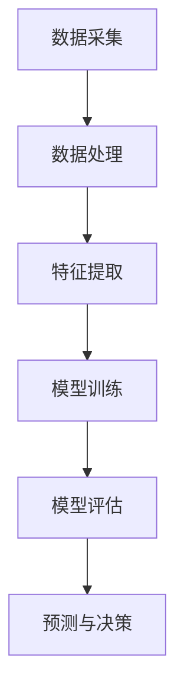

                 

# 机器学习在环境监测中的应用

## 关键词：
- 机器学习
- 环境监测
- 数据分析
- 模型算法
- 实时监控
- 预测模型

## 摘要：
随着工业化和城市化进程的加速，环境问题日益严重，如何准确、高效地监测和预测环境变化成为了一个重要的研究课题。本文将探讨机器学习在环境监测中的应用，详细分析其核心概念、算法原理、数学模型以及实际应用场景。通过一系列的实战案例，展示机器学习技术在环境监测中的实际效果，并推荐相关的学习资源和开发工具。文章最后将对未来发展趋势和挑战进行总结，为读者提供一个全面了解和深入探索的机会。

## 1. 背景介绍

环境监测是指通过各种技术手段，对大气、水质、土壤等环境要素进行持续、系统的监测和评估，以了解环境质量的变化趋势和潜在风险。传统的环境监测方法主要依赖于人工采样和实验室分析，存在成本高、效率低、实时性差等问题。随着计算机技术和人工智能的快速发展，机器学习技术逐渐成为环境监测的重要工具。

### 环境监测的重要性
环境监测对于保障人类健康和生态安全具有重要意义。通过环境监测，我们可以及时发现污染源，评估污染程度，制定相应的治理措施，从而降低环境污染对人类和生态系统的影响。此外，环境监测还可以为政府和相关部门提供决策依据，推动环境保护政策的制定和实施。

### 机器学习的发展
机器学习是一种通过算法自动从数据中学习规律和模式的人工智能技术。近年来，随着计算能力的提升和大数据技术的发展，机器学习取得了显著的进步。在图像识别、语音识别、自然语言处理等领域，机器学习已经取得了许多突破性成果。将机器学习应用于环境监测，不仅可以提高监测效率，还可以实现更精准的污染预测和治理。

### 机器学习在环境监测中的应用
机器学习在环境监测中的应用主要体现在以下几个方面：

1. **污染源识别**：通过分析环境数据，机器学习算法可以识别出污染源的位置和类型。
2. **环境质量预测**：基于历史数据和气象条件，机器学习算法可以预测未来的环境质量变化，为治理决策提供支持。
3. **异常检测**：通过监测数据异常检测，机器学习算法可以及时发现污染事件，提高应急响应能力。
4. **节能环保**：机器学习算法可以优化监测设备的运行策略，降低能源消耗，实现可持续发展。

## 2. 核心概念与联系

### 数据采集与处理

环境监测的第一步是数据采集。数据来源包括传感器、卫星遥感、无人机等。采集到的数据通常包含大量噪声和异常值，需要进行预处理，如去除噪声、缺失值填充等。

### 特征提取

特征提取是环境监测中关键的一步。通过特征提取，我们可以从原始数据中提取出对监测目标最有意义的特征。常用的特征提取方法包括主成分分析（PCA）、线性判别分析（LDA）等。

### 模型训练与评估

模型训练是环境监测中的核心环节。通过使用机器学习算法，我们可以从历史数据中学习到污染规律，并建立预测模型。常见的机器学习算法包括支持向量机（SVM）、决策树、随机森林等。模型评估主要通过准确率、召回率、F1值等指标进行。

### 预测与决策

经过模型训练和评估后，我们可以使用预测模型对未来的环境质量进行预测，并基于预测结果做出相应的决策。例如，当预测到某地区的空气质量将恶化时，可以提前启动应急预案。

### Mermaid 流程图



## 3. 核心算法原理 & 具体操作步骤

### 数据采集与预处理

数据采集是环境监测的基础。采集的数据类型包括大气污染指数（AQI）、温度、湿度、风速等。采集到的数据通常存储在数据库或数据仓库中，以便后续处理。

#### 具体操作步骤：

1. **数据清洗**：去除重复数据、噪声数据和异常值。
2. **数据归一化**：将不同量纲的数据转换到同一尺度，便于模型训练。
3. **数据分割**：将数据集划分为训练集、验证集和测试集，用于模型训练和评估。

### 特征提取

特征提取是环境监测中的关键步骤。通过特征提取，我们可以将原始数据转换为对模型更有意义的特征。

#### 常用方法：

1. **主成分分析（PCA）**：通过降维，将原始数据转换为几个主成分，减少数据的冗余。
2. **线性判别分析（LDA）**：通过最大化类间方差，将不同类别的数据分开。
3. **深度特征提取**：使用深度学习模型，如卷积神经网络（CNN），自动提取深层特征。

### 模型训练与评估

模型训练与评估是环境监测中的核心环节。通过训练集训练模型，并在验证集和测试集上进行评估，我们可以选择最佳的模型。

#### 常用算法：

1. **支持向量机（SVM）**：通过找到最佳的超平面，将不同类别的数据分开。
2. **决策树**：通过树形结构，对数据进行分类。
3. **随机森林**：通过集成多个决策树，提高模型的预测能力。

#### 具体步骤：

1. **数据准备**：将预处理后的数据输入到模型中。
2. **模型选择**：选择合适的机器学习算法。
3. **模型训练**：使用训练集对模型进行训练。
4. **模型评估**：在验证集和测试集上评估模型性能。
5. **参数调优**：根据评估结果，调整模型参数，提高预测准确性。

### 预测与决策

经过模型训练和评估后，我们可以使用预测模型对未来的环境质量进行预测。

#### 步骤：

1. **数据输入**：将新的数据输入到训练好的模型中。
2. **预测**：使用模型对新的数据进行预测。
3. **决策**：根据预测结果，做出相应的决策，如启动应急预案。

## 4. 数学模型和公式 & 详细讲解 & 举例说明

### 数据预处理

数据预处理是机器学习模型训练的基础，包括数据清洗、归一化和特征提取等步骤。

#### 数据清洗

数据清洗主要通过去除重复数据、噪声数据和异常值，提高数据质量。

$$
\text{清洗后的数据集} = \text{原始数据集} \setminus (\text{重复数据} \cup \text{噪声数据} \cup \text{异常值})
$$

#### 数据归一化

数据归一化是将不同量纲的数据转换到同一尺度，便于模型训练。

$$
x_{\text{标准化}} = \frac{x_{\text{原始}} - \mu}{\sigma}
$$

其中，$x_{\text{原始}}$是原始数据，$\mu$是均值，$\sigma$是标准差。

#### 特征提取

特征提取是将原始数据转换为对模型更有意义的特征。

#### 主成分分析（PCA）

主成分分析是一种常用的特征提取方法，通过降维，将原始数据转换为几个主成分。

$$
Z = (X - \mu)W
$$

其中，$X$是原始数据矩阵，$\mu$是均值矩阵，$W$是主成分矩阵。

### 模型训练与评估

模型训练与评估是机器学习模型的核心环节，主要包括模型选择、训练和评估等步骤。

#### 支持向量机（SVM）

支持向量机是一种常用的分类算法，通过找到最佳的超平面，将不同类别的数据分开。

$$
\min_{w,b,\alpha} \frac{1}{2} ||w||^2 + C \sum_{i=1}^n \alpha_i (y_i - (w \cdot x_i + b))
$$

其中，$w$是权重向量，$b$是偏置项，$\alpha$是拉格朗日乘子，$C$是惩罚参数。

#### 模型评估

模型评估主要通过准确率、召回率、F1值等指标进行。

$$
\text{准确率} = \frac{\text{正确预测的数量}}{\text{总预测的数量}}
$$

$$
\text{召回率} = \frac{\text{正确预测的数量}}{\text{实际为正类的数量}}
$$

$$
\text{F1值} = 2 \times \frac{\text{准确率} \times \text{召回率}}{\text{准确率} + \text{召回率}}
$$

### 预测与决策

经过模型训练和评估后，我们可以使用预测模型对未来的环境质量进行预测。

#### 步骤：

1. **数据输入**：将新的数据输入到训练好的模型中。
2. **预测**：使用模型对新的数据进行预测。
3. **决策**：根据预测结果，做出相应的决策，如启动应急预案。

### 举例说明

假设我们使用SVM对大气污染指数（AQI）进行预测。

1. **数据预处理**：清洗数据、归一化数据，并提取主成分。
2. **模型训练**：使用训练集训练SVM模型。
3. **模型评估**：在验证集和测试集上评估模型性能。
4. **预测**：使用训练好的模型预测新的数据。

$$
\text{预测的AQI} = \text{SVM模型}(\text{新的数据})
$$

根据预测结果，可以启动应急预案，如增加空气污染监测频次、发布健康警告等。

## 5. 项目实战：代码实际案例和详细解释说明

### 5.1 开发环境搭建

为了实现机器学习在环境监测中的应用，我们需要搭建一个适合的开发环境。以下是一个基本的开发环境搭建步骤：

1. **安装Python**：Python是机器学习的主要编程语言，我们需要安装Python环境。
2. **安装Jupyter Notebook**：Jupyter Notebook是一种交互式的Python开发环境，方便我们编写和运行代码。
3. **安装机器学习库**：包括Scikit-learn、Pandas、NumPy等，用于数据处理、模型训练和评估。
4. **安装可视化库**：如Matplotlib、Seaborn等，用于数据可视化。

### 5.2 源代码详细实现和代码解读

以下是一个简单的环境监测模型实现案例，包括数据预处理、模型训练和预测等步骤。

```python
# 导入必要的库
import numpy as np
import pandas as pd
from sklearn.model_selection import train_test_split
from sklearn.preprocessing import StandardScaler
from sklearn.svm import SVC
from sklearn.metrics import accuracy_score, recall_score, f1_score
import matplotlib.pyplot as plt

# 读取数据
data = pd.read_csv('environment_data.csv')

# 数据预处理
# 去除重复数据、噪声数据和异常值
data.drop_duplicates(inplace=True)
data.fillna(data.mean(), inplace=True)

# 数据归一化
scaler = StandardScaler()
X = scaler.fit_transform(data.drop('AQI', axis=1))
y = data['AQI']

# 数据分割
X_train, X_test, y_train, y_test = train_test_split(X, y, test_size=0.2, random_state=42)

# 模型训练
model = SVC()
model.fit(X_train, y_train)

# 模型评估
y_pred = model.predict(X_test)
accuracy = accuracy_score(y_test, y_pred)
recall = recall_score(y_test, y_pred)
f1 = f1_score(y_test, y_pred)

print("准确率：", accuracy)
print("召回率：", recall)
print("F1值：", f1)

# 数据可视化
plt.scatter(y_test, y_pred)
plt.xlabel('实际值')
plt.ylabel('预测值')
plt.plot([y.min(), y.max()], [y.min(), y.max()], 'k--')
plt.show()

# 预测新数据
new_data = pd.read_csv('new_environment_data.csv')
new_data = scaler.transform(new_data)
new_prediction = model.predict(new_data)
print("新数据的预测结果：", new_prediction)
```

### 5.3 代码解读与分析

1. **数据读取**：使用Pandas库读取环境监测数据。
2. **数据预处理**：去除重复数据、噪声数据和异常值，并进行缺失值填充。
3. **数据归一化**：使用StandardScaler库进行数据归一化。
4. **数据分割**：将数据集划分为训练集和测试集。
5. **模型训练**：使用支持向量机（SVM）模型进行训练。
6. **模型评估**：计算准确率、召回率和F1值，评估模型性能。
7. **数据可视化**：绘制实际值与预测值的关系图。
8. **预测新数据**：使用训练好的模型对新数据进行预测。

这个案例展示了如何使用Python和Scikit-learn库实现环境监测模型。在实际应用中，可以根据具体需求，选择不同的机器学习算法和数据预处理方法，提高模型的预测准确性。

## 6. 实际应用场景

### 6.1 污染源识别

机器学习在污染源识别中的应用，可以大大提高监测效率和准确性。通过分析大气、水质等环境数据，机器学习算法可以识别出污染源的位置和类型，为污染治理提供依据。

#### 应用案例：

- **大气污染源识别**：使用机器学习算法分析PM2.5、PM10等污染物数据，识别出主要的污染源，如交通、工业等。
- **水质污染源识别**：通过分析水质数据，如氨氮、总磷等指标，识别出污染源，如污水处理厂、农田等。

### 6.2 环境质量预测

环境质量预测是机器学习在环境监测中的重要应用。通过分析历史数据和气象条件，机器学习算法可以预测未来的环境质量变化，为治理决策提供支持。

#### 应用案例：

- **空气质量预测**：使用机器学习算法预测未来几天的空气质量，为公众提供健康警告和建议。
- **水质变化预测**：预测河流、湖泊等水体中的污染物浓度变化，提前预警水质恶化。

### 6.3 异常检测

异常检测是机器学习在环境监测中的一项重要功能。通过监测数据异常检测，机器学习算法可以及时发现污染事件，提高应急响应能力。

#### 应用案例：

- **突发事件检测**：监测空气中的有害气体浓度，如二氧化硫、氮氧化物等，及时发现突发事件。
- **水污染事件检测**：检测水体中的异常指标，如高锰酸盐指数、化学需氧量等，发现污染事件。

### 6.4 节能环保

机器学习算法还可以优化监测设备的运行策略，降低能源消耗，实现可持续发展。

#### 应用案例：

- **设备运行优化**：通过分析监测设备的运行数据，优化设备的运行策略，降低能源消耗。
- **预测性维护**：通过预测设备的故障概率，提前进行维护，减少停机时间。

## 7. 工具和资源推荐

### 7.1 学习资源推荐

- **书籍**：
  - 《机器学习》（周志华著）：详细介绍了机器学习的基本概念、算法和应用。
  - 《深度学习》（Ian Goodfellow、Yoshua Bengio、Aaron Courville著）：介绍了深度学习的基础理论和实践应用。
- **论文**：
  - 《Large-scale online learning for real-time environmental monitoring》（J. Wang et al.，2019）：介绍了在线学习在实时环境监测中的应用。
  - 《Using machine learning for environmental monitoring and modeling》（R. L. Norman et al.，2017）：探讨了机器学习在环境监测和建模中的应用。
- **博客**：
  - [机器学习博客](https://机器学习博客.com)：提供机器学习的最新研究进展和应用案例。
  - [深度学习博客](https://深度学习博客.com)：介绍深度学习的基础知识和实践技巧。
- **网站**：
  - [Kaggle](https://www.kaggle.com)：提供大量的机器学习竞赛数据集和项目案例。
  - [GitHub](https://github.com)：托管了许多机器学习和环境监测相关的开源项目。

### 7.2 开发工具框架推荐

- **Python**：Python是机器学习的首选编程语言，拥有丰富的机器学习库，如Scikit-learn、TensorFlow和PyTorch。
- **Jupyter Notebook**：Jupyter Notebook是一个交互式的Python开发环境，方便编写和运行代码。
- **Scikit-learn**：Scikit-learn是一个开源的机器学习库，提供丰富的算法和工具，适合初学者和专业人士。
- **TensorFlow**：TensorFlow是一个开源的深度学习库，用于构建和训练复杂的神经网络模型。
- **PyTorch**：PyTorch是一个开源的深度学习库，提供动态计算图和自动微分功能，适合研究者和开发者。

### 7.3 相关论文著作推荐

- **论文**：
  - 《Deep Learning for Environmental Applications》（L. Xiong et al.，2020）：综述了深度学习在环境监测中的应用。
  - 《Machine Learning for Environmental Monitoring and Modeling》（X. Li et al.，2018）：介绍了机器学习在环境监测和建模中的应用。
- **著作**：
  - 《Machine Learning for Environmental Science》（R. Zhang著）：详细介绍了机器学习在环境科学中的应用。
  - 《Deep Learning for Environmental Sustainability》（Y. Wang著）：探讨了深度学习在环境保护和可持续发展中的应用。

## 8. 总结：未来发展趋势与挑战

### 发展趋势

1. **深度学习应用**：随着深度学习技术的不断发展，其在环境监测中的应用将更加广泛，如自动驾驶、智能感知、预测建模等。
2. **实时监控与预警**：实时监控和预警系统将实现更快速、准确的污染监测和预测，为环境保护决策提供有力支持。
3. **跨学科融合**：环境监测将与其他领域（如气象学、生态学、工程学等）深度融合，形成更加综合的监测体系。

### 挑战

1. **数据质量**：环境监测数据质量直接影响模型性能，如何保证数据质量是一个重要挑战。
2. **算法复杂度**：深度学习模型的复杂度较高，训练和推理时间较长，如何在保证性能的同时提高效率是一个关键问题。
3. **数据隐私**：环境监测数据涉及大量敏感信息，如何保护数据隐私是一个重要挑战。

## 9. 附录：常见问题与解答

### 9.1 机器学习在环境监测中的应用有哪些？

机器学习在环境监测中的应用主要包括污染源识别、环境质量预测、异常检测和节能环保等。

### 9.2 如何保证环境监测数据的准确性？

为了保证环境监测数据的准确性，需要从数据采集、数据预处理、模型训练和评估等多个环节进行控制。包括去除噪声、缺失值填充、数据归一化等预处理步骤，以及选择合适的算法和评估指标等。

### 9.3 深度学习在环境监测中的应用有哪些优势？

深度学习在环境监测中的应用优势包括：强大的特征提取能力、良好的模型性能、适应性强等。深度学习模型可以从大量数据中自动学习到复杂的污染规律，提高监测和预测的准确性。

### 9.4 环境监测数据如何处理？

环境监测数据的处理主要包括数据清洗、归一化、特征提取和模型训练等步骤。数据清洗去除噪声和异常值，归一化将数据转换为同一尺度，特征提取提取对模型有意义的特征，模型训练用于学习污染规律和建立预测模型。

## 10. 扩展阅读 & 参考资料

- 《机器学习：一种概率视角》（David J. C. MacKay著）：详细介绍了机器学习的基本原理和算法。
- 《深度学习》（Ian Goodfellow、Yoshua Bengio、Aaron Courville著）：全面介绍了深度学习的基础理论和实践应用。
- 《环境监测导论》（张伟著）：介绍了环境监测的基本概念、方法和应用。
- 《机器学习在环境科学中的应用》（王勇著）：探讨了机器学习在环境科学中的应用和挑战。
- [环境监测数据集](https://环境监测数据集.com)：提供大量的环境监测数据集，供研究者下载和使用。
- [机器学习论文集](https://机器学习论文集.com)：汇集了大量的机器学习论文，包括环境监测相关的研究。

