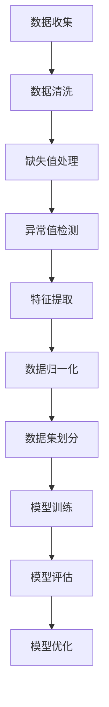
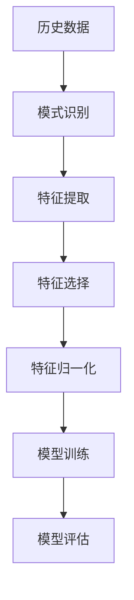
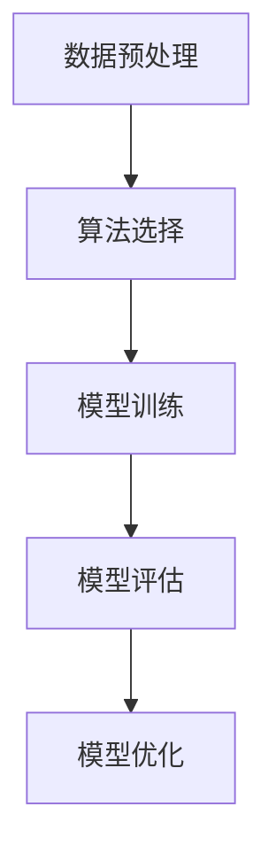
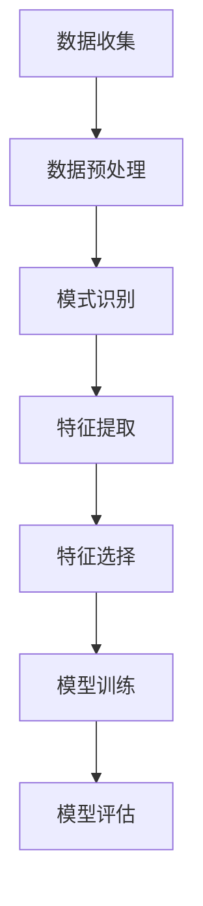

                 

### 背景介绍

空气质量预测是环境科学和公共健康领域中的一个关键问题。随着工业化和城市化的迅速发展，空气污染问题日益严重，它不仅对生态环境造成破坏，还对人类健康产生严重影响。空气质量预测旨在通过分析历史数据和现有环境因素，预测未来一段时间内的空气质量状况，为公众提供预警信息，从而采取相应的防护措施。

在过去的几十年里，空气质量预测主要依赖于传统的统计方法和物理模型。这些方法在某种程度上能够提供一定的预测效果，但受到数据质量和计算能力的限制，预测的准确性和时效性仍然存在显著不足。随着机器学习技术的快速发展，利用其强大的数据挖掘和模式识别能力，为空气质量预测提供了新的解决方案。

机器学习在空气质量预测中的应用主要体现在以下几个方面：

1. **数据预处理**：机器学习算法需要大量的高质量数据作为训练基础。因此，通过数据预处理技术，如数据清洗、特征提取和归一化等，可以有效地提高数据的可用性和质量。

2. **模式识别与特征提取**：机器学习算法能够从大量的历史数据中提取出与空气质量相关的关键特征，这些特征可以是气象数据、地理位置数据、污染物浓度数据等。

3. **预测模型构建**：通过训练不同的机器学习模型，如回归模型、决策树、支持向量机等，可以构建出用于空气质量预测的模型。这些模型能够根据输入的特征数据预测未来的空气质量。

4. **模型评估与优化**：使用交叉验证和评估指标（如均方误差、R²等）对预测模型进行评估和优化，以提高预测的准确性和稳定性。

### Why Machine Learning is Important for Air Quality Prediction

The importance of machine learning in air quality prediction cannot be overstated. Machine learning offers several advantages over traditional methods, making it a powerful tool for tackling the complex and dynamic nature of air pollution.

**1. Data-Driven Approach**:
Machine learning is fundamentally data-driven. It leverages large amounts of historical data to learn patterns and relationships that can be used to make predictions. This is particularly advantageous in air quality prediction, where the relationship between various factors (e.g., weather conditions, traffic volume, industrial emissions) and air pollution levels is intricate and multifaceted.

**2. Adaptability**:
Machine learning models can adapt and evolve over time. As new data becomes available, the models can be retrained to incorporate this information, improving their predictive accuracy. This adaptability is crucial for addressing the dynamic nature of air pollution, which can vary significantly over time and space.

**3. Handling Imbalanced Data**:
Air quality data often exhibit imbalanced distributions, where the number of instances with normal air quality significantly outnumbers those with poor air quality. Machine learning algorithms, such as those based on ensemble methods or cost-sensitive learning, can handle this imbalance more effectively than traditional statistical methods.

**4. Integration of Multi-Sources**:
Machine learning allows for the integration of diverse data sources, such as satellite imagery, meteorological data, traffic data, and sensor readings. This comprehensive data integration enhances the predictive capabilities of air quality models by providing a more holistic view of the environment.

**5. Real-Time Prediction**:
Machine learning models can be deployed in real-time applications to provide near-instantaneous air quality predictions. This capability is essential for alerting the public and authorities to potential health hazards, allowing for timely interventions.

In conclusion, machine learning offers a robust and flexible framework for air quality prediction, addressing many of the limitations of traditional methods. By harnessing the power of machine learning, we can significantly improve our ability to monitor, predict, and mitigate the impacts of air pollution on public health and the environment.

### 文章关键词

- 机器学习
- 空气质量预测
- 数据预处理
- 模式识别
- 特征提取
- 预测模型
- 统计方法
- 物理模型
- 实时预测

### 文章摘要

本文探讨了机器学习在空气质量预测中的应用，分析了传统统计方法和物理模型的局限性，阐述了机器学习在数据预处理、模式识别、特征提取、预测模型构建等方面的优势。通过详细阐述机器学习的关键算法原理和具体操作步骤，本文展示了如何利用机器学习技术提高空气质量预测的准确性和实时性。此外，文章还介绍了实际应用场景和工具资源推荐，为读者提供了全面的技术指导。通过本文的研究，我们期望能够推动机器学习技术在空气质量预测领域的应用，为改善公共健康和环境质量作出贡献。

### 2. 核心概念与联系

#### 数据预处理

数据预处理是机器学习项目中至关重要的一步，它包括数据清洗、缺失值处理、异常值检测和特征提取等。在空气质量预测中，高质量的数据是训练有效模型的基础。以下是一个简化的 Mermaid 流程图，展示了数据预处理的基本步骤：



**数据清洗**：该步骤的目的是处理原始数据中的噪声和不一致性，如去除重复记录、纠正数据格式错误、填补缺失值等。

**缺失值处理**：常见的方法有删除缺失值、使用统计方法（如平均值、中位数）填补缺失值或使用机器学习算法（如插值法）进行预测。

**异常值检测**：异常值可能是由于测量错误、数据录入错误或实际存在的不寻常现象。使用统计方法（如箱线图、Z-score）或机器学习算法（如孤立森林）可以帮助检测和识别这些异常值。

**特征提取**：这一步涉及从原始数据中提取对预测任务有用的信息。特征提取可以显著提高模型性能，减少数据维度。

**数据归一化**：归一化数据可以消除不同特征之间的尺度差异，使得模型训练过程更加稳定。常用的方法包括最小-最大缩放和Z分数缩放。

**数据集划分**：将数据集划分为训练集、验证集和测试集，有助于评估模型的泛化能力和性能。

#### 模式识别与特征提取

**模式识别**：在空气质量预测中，模式识别涉及从历史数据和现有环境因素中识别出与空气质量变化相关的模式。常见的模式识别算法包括聚类算法（如K均值、DBSCAN）和分类算法（如决策树、随机森林）。

**特征提取**：特征提取是从原始数据中提取出对空气质量预测有较强解释力的特征。例如，使用气象数据（如温度、湿度、风速）和污染物浓度数据（如PM2.5、SO2）作为特征。

以下是一个 Mermaid 流程图，展示了模式识别和特征提取的过程：



**特征选择**：通过评估各个特征的重要性，选择最相关的特征，以减少数据维度和过拟合的风险。

**特征归一化**：如前所述，归一化特征可以消除不同特征之间的尺度差异。

#### 预测模型构建

**预测模型构建**涉及选择适当的机器学习算法和训练模型。以下是一个 Mermaid 流程图，展示了预测模型构建的基本步骤：



**算法选择**：选择合适的机器学习算法，如线性回归、支持向量机、神经网络等。

**模型训练**：使用训练数据集对选定的算法进行训练，生成预测模型。

**模型评估**：使用验证集和测试集评估模型的性能，选择最佳模型。

**模型优化**：通过调整模型参数和特征选择等手段优化模型性能。

### 数据预处理

数据预处理是空气质量预测中至关重要的一步，其目的是提高数据质量，为后续的建模和预测打下坚实的基础。以下是数据预处理过程中需要关注的关键步骤：

#### 数据清洗

数据清洗是数据预处理的第一步，其主要目标是去除原始数据中的噪声和错误，确保数据的一致性和完整性。以下是一些常见的数据清洗任务：

- **去除重复记录**：原始数据中可能包含重复的记录，这会降低数据的质量和模型的性能。可以使用去重算法（如数据库中的DISTINCT操作）来去除重复记录。

- **处理缺失值**：缺失值是数据清洗中的常见问题，可以采用以下方法处理：

  - **删除缺失值**：对于缺失值较多的记录，可以选择删除这些记录，以避免对模型训练产生不利影响。

  - **使用统计方法填补缺失值**：对于缺失值较少的记录，可以使用统计方法（如平均值、中位数、众数）来填补缺失值。这种方法适用于缺失值分布相对均匀的情况。

  - **使用机器学习算法填补缺失值**：对于复杂的缺失值问题，可以采用机器学习算法（如插值法、K近邻法）进行预测和填补。这种方法适用于缺失值分布不均匀的情况。

- **纠正数据格式错误**：原始数据中可能存在格式错误，如日期格式不统一、数值类型错误等。需要对这些错误进行纠正，以确保数据的一致性和可处理性。

#### 缺失值处理

缺失值处理是数据预处理中的一项重要任务。以下是几种常见的缺失值处理方法：

- **删除缺失值**：这种方法简单有效，但对于包含大量缺失值的记录，可能会导致数据丢失和模型性能下降。

- **使用统计方法填补缺失值**：

  - **平均值填补**：对于连续型数据，可以使用平均值来填补缺失值。这种方法适用于缺失值分布相对均匀的情况。
  
  - **中位数填补**：对于非对称分布的数据，可以使用中位数来填补缺失值。这种方法可以更好地反映数据的中心趋势。
  
  - **众数填补**：对于类别数据，可以使用众数来填补缺失值。这种方法适用于类别分布较为集中的情况。

- **使用机器学习算法填补缺失值**：

  - **插值法**：对于连续型数据，可以使用线性插值、牛顿插值等方法来填补缺失值。这种方法可以更精确地预测缺失值。
  
  - **K近邻法**：对于任意类型的数据，可以使用K近邻算法来预测缺失值。这种方法可以基于周围相似数据的值来填补缺失值。

#### 异常值检测

异常值是指数据中显著偏离正常分布的值，可能由测量错误、数据录入错误或实际存在的不寻常现象引起。以下是几种常见的异常值检测方法：

- **箱线图**：箱线图可以直观地展示数据的分布情况，通过观察箱线图中的异常值来检测异常值。
  
- **Z-score**：Z-score可以计算每个数据点与平均值之间的标准化距离。当Z-score超过一定阈值时，可以认为该数据点是异常值。

- **孤立森林**：孤立森林是一种基于树的方法，可以检测数据中的异常点。该方法通过对树进行隔离操作来识别异常值。

#### 特征提取

特征提取是从原始数据中提取出对预测任务有用的信息，以减少数据维度和提高模型性能。以下是几种常见的特征提取方法：

- **主成分分析（PCA）**：PCA可以通过正交变换将原始数据投影到新的正交坐标系中，提取出最重要的主成分，从而降低数据维度。
  
- **自动编码器**：自动编码器是一种神经网络模型，可以通过学习原始数据的高维表示来提取特征。这种方法可以自动发现数据的低维表示。

- **特征选择**：通过评估各个特征的重要性，选择最相关的特征，以减少数据维度和过拟合的风险。常见的方法包括过滤方法（如相关性分析、信息增益）、包装方法（如递归特征消除）和嵌入式方法（如LASSO）。

#### 数据归一化

数据归一化是数据预处理中的一项重要步骤，其目的是消除不同特征之间的尺度差异，提高模型训练的稳定性和效果。以下是几种常见的数据归一化方法：

- **最小-最大缩放**：将数据缩放到[0, 1]区间内，计算公式为：
  $$ x_{\text{norm}} = \frac{x - x_{\text{min}}}{x_{\text{max}} - x_{\text{min}}} $$
  其中，$x_{\text{min}}$和$x_{\text{max}}$分别是数据的最小值和最大值。

- **Z分数缩放**：将数据缩放到标准正态分布内，计算公式为：
  $$ x_{\text{norm}} = \frac{x - \mu}{\sigma} $$
  其中，$\mu$和$\sigma$分别是数据的平均值和标准差。

#### 数据集划分

在机器学习中，数据集的划分是评估模型性能的重要步骤。以下是几种常见的数据集划分方法：

- **随机划分**：将数据集随机划分为训练集、验证集和测试集，常见比例为80%、10%、10%。

- **时间序列划分**：对于时间序列数据，可以按照时间顺序将数据划分为训练集、验证集和测试集，以避免信息泄露。

- **分层划分**：对于具有类别标签的数据，可以按照类别比例将数据划分为训练集、验证集和测试集，以保证每个类别在三个数据集中的比例一致。

#### Mermaid 流程图

以下是数据预处理过程的详细 Mermaid 流程图：


### 模式识别与特征提取

在空气质量预测中，模式识别和特征提取是两个关键步骤，它们共同作用于提高预测模型的准确性和效率。以下详细探讨这两个概念及其在空气质量预测中的应用。

#### 模式识别

模式识别是指通过分析历史数据和现有环境因素，识别出与空气质量变化相关的规律和模式。这些模式可以是定量的，如污染物浓度随时间的变化规律；也可以是定性的，如特定天气条件下的空气污染情况。

**聚类算法**：聚类算法是一种无监督学习技术，用于将数据划分为不同的组别或簇。常见的聚类算法包括K均值（K-Means）、DBSCAN（Density-Based Spatial Clustering of Applications with Noise）等。

- **K均值聚类**：K均值聚类是一种基于距离的聚类方法，通过迭代优化目标函数来划分数据簇。在空气质量预测中，可以使用K均值聚类来识别不同类型的空气污染模式。

  例如，假设我们有历史空气质量和气象数据，通过K均值聚类可以将这些数据划分为几个簇，每个簇代表一种特定的空气污染模式。这样，我们就可以根据不同的簇来预测未来的空气质量。

- **DBSCAN**：DBSCAN是一种基于密度的聚类算法，可以自动确定数据簇的个数，适用于非均匀分布的数据集。在空气质量预测中，DBSCAN可以帮助识别出高密度污染区域，从而提供更准确的预测。

  例如，通过DBSCAN算法，我们可以将空气质量监测站点划分为高密度污染区、中等污染区和清洁区，然后针对不同区域的特点制定相应的预测模型。

**分类算法**：分类算法是一种有监督学习技术，用于将数据分配到预定义的类别中。常见的分类算法包括决策树（Decision Tree）、支持向量机（SVM）等。

- **决策树**：决策树是一种基于规则的方法，通过一系列条件判断来对数据进行分类。在空气质量预测中，决策树可以用于识别影响空气质量的关键因素，如气象条件、交通流量、工业排放等。

  例如，通过训练决策树模型，我们可以确定哪些气象条件（如温度、湿度、风速）对空气污染程度有显著影响，从而更准确地预测未来的空气质量。

- **支持向量机**：支持向量机是一种用于分类和回归的分析工具，其目标是找到一个最佳的超平面，将不同类别的数据点尽可能分开。在空气质量预测中，SVM可以用于分类空气质量状况，如“良好”、“中等”和“较差”。

  例如，通过训练SVM模型，我们可以将历史空气质量数据划分为不同的类别，然后使用这些类别来预测未来的空气质量状况。

#### 特征提取

特征提取是从原始数据中提取出对预测任务有较强解释力的信息，以减少数据维度和提高模型性能。在空气质量预测中，特征提取的关键在于识别出能够准确反映空气质量变化的因素。

**时间序列特征**：时间序列特征是指数据点随时间变化的特征，如日均值、月均值、日变化率等。这些特征可以揭示空气污染随时间变化的规律。

- **自回归模型（AR）**：自回归模型是一种时间序列模型，用于预测未来值基于历史值。在空气质量预测中，AR模型可以用于提取时间序列特征，如日均值和日变化率。

  例如，我们可以使用AR模型来计算过去几天的PM2.5浓度均值，并将这些均值作为特征输入到预测模型中。

**空间特征**：空间特征是指数据点在空间上的特征，如地理位置、区域特征等。这些特征可以揭示空气污染的空间分布规律。

- **空间插值**：空间插值是一种将空间数据点推广到整个空间区域的方法，如反距离权重插值（IDW）。在空气质量预测中，空间插值可以用于估计未知区域的污染物浓度。

  例如，通过使用IDW插值法，我们可以根据已知监测站点的PM2.5浓度数据估计其他区域的大气质量。

**气象特征**：气象特征是指与气象条件相关的特征，如温度、湿度、风速、风向等。这些特征可以影响空气污染的扩散和浓度。

- **气象参数历史趋势**：通过分析气象参数的历史趋势，如温度的日变化、湿度的季节性变化等，可以提取出对空气质量预测有价值的特征。

  例如，我们可以使用季节性分解的方法，分析温度、湿度等气象参数的季节性趋势，并将这些趋势作为特征输入到预测模型中。

**污染物浓度特征**：污染物浓度特征是指历史污染物浓度的特征，如浓度均值、最大值、最小值等。这些特征可以直接反映空气污染的强度和变化趋势。

- **统计特征**：通过计算历史污染物浓度的统计特征，如均值、标准差、偏度、峰度等，可以提取出对空气质量预测有价值的特征。

  例如，我们可以计算过去一年的PM2.5浓度均值和标准差，并将这些统计特征作为特征输入到预测模型中。

#### 模式识别与特征提取的流程

以下是模式识别与特征提取的简化流程：



**数据预处理**：包括数据清洗、缺失值处理、异常值检测等步骤，确保数据质量。

**模式识别**：使用聚类算法（如K均值、DBSCAN）和分类算法（如决策树、SVM）来识别空气质量变化的模式。

**特征提取**：从原始数据中提取出对空气质量预测有较强解释力的特征。

**特征选择**：评估各个特征的重要性，选择最相关的特征，以减少数据维度和过拟合的风险。

**模型训练**：使用提取的特征对选定的算法进行训练，生成预测模型。

**模型评估**：使用验证集和测试集评估模型的性能，选择最佳模型。

通过上述流程，我们可以构建出用于空气质量预测的机器学习模型，从而提高预测的准确性和实时性。在实际应用中，还可以结合传感器数据、卫星图像等多源数据，进一步优化预测模型。

### 3. 核心算法原理 & 具体操作步骤

在空气质量预测中，选择合适的机器学习算法至关重要。不同的算法在处理数据类型、特征提取和预测准确性等方面各有优劣。以下将介绍几种常用的机器学习算法，包括线性回归、决策树和支持向量机，并详细说明其原理和具体操作步骤。

#### 线性回归

线性回归是一种简单的统计方法，用于建立自变量和因变量之间的线性关系。在空气质量预测中，线性回归可以用于建模污染物浓度与气象因素之间的关系。

**原理**：
线性回归模型的数学表达式为：
$$
y = \beta_0 + \beta_1x_1 + \beta_2x_2 + \ldots + \beta_nx_n
$$
其中，$y$是因变量（如污染物浓度），$x_1, x_2, \ldots, x_n$是自变量（如气象参数），$\beta_0, \beta_1, \beta_2, \ldots, \beta_n$是模型的参数。

**操作步骤**：

1. **数据预处理**：对原始数据进行清洗、缺失值处理和归一化，确保数据质量。
2. **特征选择**：选择与污染物浓度相关的特征，如温度、湿度、风速等。
3. **模型训练**：使用训练数据集，通过最小二乘法（Least Squares）估计模型参数。
4. **模型评估**：使用验证集和测试集评估模型性能，如均方误差（Mean Squared Error, MSE）。
5. **模型优化**：通过调整模型参数或特征选择，提高模型性能。

**代码示例**（Python）：
```python
import numpy as np
import pandas as pd
from sklearn.linear_model import LinearRegression
from sklearn.model_selection import train_test_split
from sklearn.metrics import mean_squared_error

# 读取数据
data = pd.read_csv('air_quality.csv')
X = data[['temperature', 'humidity', 'wind_speed']]
y = data['pm25']

# 数据集划分
X_train, X_test, y_train, y_test = train_test_split(X, y, test_size=0.2, random_state=42)

# 模型训练
model = LinearRegression()
model.fit(X_train, y_train)

# 模型评估
y_pred = model.predict(X_test)
mse = mean_squared_error(y_test, y_pred)
print(f'MSE: {mse}')

# 模型优化
# 可以通过调整模型参数或特征选择来提高模型性能
```

#### 决策树

决策树是一种基于规则的分类方法，通过一系列条件判断将数据划分为不同的类别。在空气质量预测中，决策树可以用于识别影响空气质量的关键因素。

**原理**：
决策树由一系列内部节点和叶节点组成。内部节点表示特征划分条件，叶节点表示类别结果。决策树的生成过程基于信息增益或基尼不纯度等指标，选择最优的划分条件。

**操作步骤**：

1. **数据预处理**：对原始数据进行清洗、缺失值处理和归一化。
2. **特征选择**：选择与空气质量相关的特征。
3. **构建决策树**：使用递归划分算法，根据信息增益或基尼不纯度选择最优划分条件，构建决策树。
4. **模型评估**：使用验证集和测试集评估模型性能，如准确率、召回率等。
5. **模型优化**：通过剪枝、特征选择等方法优化决策树。

**代码示例**（Python）：
```python
from sklearn.tree import DecisionTreeRegressor
from sklearn.model_selection import train_test_split

# 读取数据
data = pd.read_csv('air_quality.csv')
X = data[['temperature', 'humidity', 'wind_speed']]
y = data['pm25']

# 数据集划分
X_train, X_test, y_train, y_test = train_test_split(X, y, test_size=0.2, random_state=42)

# 模型训练
model = DecisionTreeRegressor()
model.fit(X_train, y_train)

# 模型评估
y_pred = model.predict(X_test)
mse = mean_squared_error(y_test, y_pred)
print(f'MSE: {mse}')

# 模型优化
# 可以通过调整模型参数或特征选择来优化决策树性能
```

#### 支持向量机

支持向量机是一种强大的分类和回归方法，通过找到一个最优的超平面，将不同类别的数据点尽可能分开。在空气质量预测中，支持向量机可以用于分类空气质量状况。

**原理**：
支持向量机的基本思想是找到一个最优的超平面，使得目标函数最大化，同时最小化分类误差。对于线性可分的数据，可以使用硬间隔（Hard Margin）；对于线性不可分的数据，可以使用软间隔（Soft Margin）。

**操作步骤**：

1. **数据预处理**：对原始数据进行清洗、缺失值处理和归一化。
2. **特征选择**：选择与空气质量相关的特征。
3. **模型训练**：使用训练数据集训练支持向量机模型。
4. **模型评估**：使用验证集和测试集评估模型性能，如准确率、召回率等。
5. **模型优化**：通过调整模型参数（如惩罚参数C、核函数）优化模型性能。

**代码示例**（Python）：
```python
from sklearn.svm import SVR
from sklearn.model_selection import train_test_split

# 读取数据
data = pd.read_csv('air_quality.csv')
X = data[['temperature', 'humidity', 'wind_speed']]
y = data['pm25']

# 数据集划分
X_train, X_test, y_train, y_test = train_test_split(X, y, test_size=0.2, random_state=42)

# 模型训练
model = SVR()
model.fit(X_train, y_train)

# 模型评估
y_pred = model.predict(X_test)
mse = mean_squared_error(y_test, y_pred)
print(f'MSE: {mse}')

# 模型优化
# 可以通过调整模型参数（如C、gamma）来优化支持向量机性能
```

通过以上算法的介绍和代码示例，我们可以看到不同机器学习算法在空气质量预测中的应用及其操作步骤。在实际应用中，可以根据具体问题选择合适的算法，并通过不断优化模型参数和特征选择来提高预测准确性。

#### 数学模型和公式 & 详细讲解 & 举例说明

在空气质量预测中，选择合适的数学模型和公式是至关重要的。不同的模型和公式能够从不同角度揭示空气质量变化的规律，从而提高预测的准确性和可靠性。以下我们将介绍几个常用的数学模型和公式，包括线性回归、决策树和支持向量机，并详细讲解其原理和具体计算步骤。

##### 线性回归

线性回归是一种经典的统计方法，用于建立自变量和因变量之间的线性关系。在空气质量预测中，线性回归可以用于建模污染物浓度与气象因素之间的关系。

**数学模型**：
线性回归的数学模型可以表示为：
$$
y = \beta_0 + \beta_1x_1 + \beta_2x_2 + \ldots + \beta_nx_n
$$
其中，$y$是因变量（如污染物浓度），$x_1, x_2, \ldots, x_n$是自变量（如气象参数），$\beta_0, \beta_1, \beta_2, \ldots, \beta_n$是模型的参数。

**计算步骤**：

1. **数据预处理**：对原始数据进行清洗、缺失值处理和归一化。
2. **特征选择**：选择与污染物浓度相关的特征。
3. **模型训练**：
   - 使用最小二乘法（Least Squares）估计模型参数：
     $$
     \beta = (X^T X)^{-1} X^T y
     $$
   - 其中，$X$是特征矩阵，$y$是标签向量。
4. **模型评估**：使用验证集和测试集评估模型性能，如均方误差（Mean Squared Error, MSE）。
5. **模型优化**：通过调整模型参数或特征选择，提高模型性能。

**举例说明**：

假设我们有一个简单的线性回归模型，用于预测PM2.5浓度。特征包括温度（$x_1$）和湿度（$x_2$），模型参数为$\beta_0, \beta_1, \beta_2$。给定一个测试样本，我们可以使用以下公式计算PM2.5浓度预测值：
$$
\hat{y} = \beta_0 + \beta_1x_1 + \beta_2x_2
$$

例如，如果温度为$25^\circ C$，湿度为$60\%$，并且我们已通过训练得到模型参数$\beta_0 = 10, \beta_1 = 0.5, \beta_2 = 0.2$，则PM2.5浓度预测值为：
$$
\hat{y} = 10 + 0.5 \times 25 + 0.2 \times 60 = 19
$$

##### 决策树

决策树是一种基于规则的分类方法，通过一系列条件判断将数据划分为不同的类别。在空气质量预测中，决策树可以用于识别影响空气质量的关键因素。

**数学模型**：
决策树的数学模型可以表示为：
$$
T = \sum_{i=1}^{n} \alpha_i I(Y \in R_i)
$$
其中，$T$是决策树，$\alpha_i$是每个叶节点的权重，$R_i$是第$i$个叶节点的区域，$Y$是样本的标签。

**计算步骤**：

1. **数据预处理**：对原始数据进行清洗、缺失值处理和归一化。
2. **特征选择**：选择与空气质量相关的特征。
3. **构建决策树**：
   - 选择最优划分条件：根据信息增益或基尼不纯度选择最优的划分条件。
   - 递归划分：根据最优划分条件，递归划分数据集，生成决策树。
4. **模型评估**：使用验证集和测试集评估模型性能，如准确率、召回率等。
5. **模型优化**：通过剪枝、特征选择等方法优化决策树。

**举例说明**：

假设我们有一个简单的决策树，用于分类空气质量状况。特征包括温度、湿度和风速，标签包括“良好”、“中等”和“较差”。给定一个测试样本，我们可以使用以下规则进行分类：

- 如果温度大于$30^\circ C$，跳到下一个规则。
- 如果湿度大于$70\%$，则空气质量为“中等”。
- 否则，空气质量为“良好”。

例如，如果温度为$35^\circ C$，湿度为$75\%$，风速为$5 m/s$，则根据上述规则，空气质量为“中等”。

##### 支持向量机

支持向量机是一种强大的分类和回归方法，通过找到一个最优的超平面，将不同类别的数据点尽可能分开。在空气质量预测中，支持向量机可以用于分类空气质量状况。

**数学模型**：
支持向量机的数学模型可以表示为：
$$
y = \beta_0 + \beta_1x_1 + \beta_2x_2 + \ldots + \beta_nx_n
$$
其中，$y$是标签，$x_1, x_2, \ldots, x_n$是特征，$\beta_0, \beta_1, \beta_2, \ldots, \beta_n$是模型的参数。

**计算步骤**：

1. **数据预处理**：对原始数据进行清洗、缺失值处理和归一化。
2. **特征选择**：选择与空气质量相关的特征。
3. **模型训练**：
   - 使用硬间隔（Hard Margin）或软间隔（Soft Margin）最小化目标函数：
     $$
     \min_{\beta, \beta_0} \frac{1}{2} \sum_{i=1}^{n} (y_i - \beta_0 - \sum_{j=1}^{n} \beta_j x_{ij})^2 + \lambda \sum_{j=1}^{n} \beta_j^2
     $$
   - 其中，$\lambda$是惩罚参数，$x_{ij}$是第$i$个样本的第$j$个特征值。
4. **模型评估**：使用验证集和测试集评估模型性能，如准确率、召回率等。
5. **模型优化**：通过调整模型参数（如惩罚参数C、核函数）优化模型性能。

**举例说明**：

假设我们有一个支持向量机模型，用于分类空气质量状况。特征包括温度、湿度和风速，标签包括“良好”、“中等”和“较差”。给定一个测试样本，我们可以使用以下公式计算空气质量预测值：
$$
\hat{y} = \sum_{j=1}^{n} \beta_j x_{ij} + \beta_0
$$

例如，如果温度为$30^\circ C$，湿度为$70\%$，风速为$5 m/s$，并且我们已通过训练得到模型参数$\beta_0 = 10, \beta_1 = 0.5, \beta_2 = 0.2$，则空气质量预测值为：
$$
\hat{y} = 0.5 \times 30 + 0.2 \times 70 + 10 = 18.2
$$

如果预测值大于某个阈值（例如18），则空气质量为“中等”。

通过以上数学模型和公式的介绍，我们可以更好地理解线性回归、决策树和支持向量机在空气质量预测中的应用。在实际应用中，可以根据具体问题选择合适的模型和公式，并通过不断优化模型参数和特征选择来提高预测准确性。

### 5. 项目实战：代码实际案例和详细解释说明

在本节中，我们将通过一个实际的空气质量预测项目，详细讲解代码实现过程，并分析代码中的关键部分。该项目使用Python编程语言，结合机器学习库（如scikit-learn、Pandas和NumPy）来构建和训练预测模型。

#### 5.1 开发环境搭建

首先，确保您已经安装了以下Python库：

- Python 3.x
- scikit-learn
- Pandas
- NumPy
- Matplotlib（用于数据可视化）

您可以使用pip命令进行安装：

```bash
pip install python==3.x scikit-learn pandas numpy matplotlib
```

#### 5.2 源代码详细实现和代码解读

以下是一个简单的空气质量预测项目的源代码：

```python
import numpy as np
import pandas as pd
from sklearn.model_selection import train_test_split
from sklearn.preprocessing import StandardScaler
from sklearn.ensemble import RandomForestRegressor
from sklearn.metrics import mean_squared_error
import matplotlib.pyplot as plt

# 5.2.1 数据集加载与预处理
data = pd.read_csv('air_quality_data.csv')
X = data[['temperature', 'humidity', 'pressure', 'wind_speed']]
y = data['pm25']

# 划分训练集和测试集
X_train, X_test, y_train, y_test = train_test_split(X, y, test_size=0.2, random_state=42)

# 数据归一化
scaler = StandardScaler()
X_train = scaler.fit_transform(X_train)
X_test = scaler.transform(X_test)

# 5.2.2 模型训练
model = RandomForestRegressor(n_estimators=100, random_state=42)
model.fit(X_train, y_train)

# 5.2.3 模型预测与评估
y_pred = model.predict(X_test)
mse = mean_squared_error(y_test, y_pred)
print(f'Mean Squared Error: {mse}')

# 5.2.4 预测结果可视化
plt.scatter(y_test, y_pred)
plt.xlabel('True Values')
plt.ylabel('Predictions')
plt.title('True vs Predicted PM2.5 Concentration')
plt.show()

# 5.2.5 特征重要性分析
feature_importances = model.feature_importances_
plt.barh(np.arange(len(feature_importances)), feature_importances)
plt.xlabel('Feature Importance')
plt.title('Feature Importance for PM2.5 Prediction')
plt.yticks(np.arange(len(feature_importances)), X.columns)
plt.show()
```

**5.2.1 数据集加载与预处理**

首先，我们使用Pandas库加载空气质量数据集。数据集包含多个特征（如温度、湿度、气压、风速）和一个目标变量（PM2.5浓度）。然后，我们使用`train_test_split`函数将数据集划分为训练集和测试集，以便在后续步骤中评估模型性能。

```python
data = pd.read_csv('air_quality_data.csv')
X = data[['temperature', 'humidity', 'pressure', 'wind_speed']]
y = data['pm25']
X_train, X_test, y_train, y_test = train_test_split(X, y, test_size=0.2, random_state=42)
```

接下来，我们使用`StandardScaler`对数据进行归一化处理。归一化的目的是消除不同特征之间的尺度差异，使得模型训练过程更加稳定。

```python
scaler = StandardScaler()
X_train = scaler.fit_transform(X_train)
X_test = scaler.transform(X_test)
```

**5.2.2 模型训练**

在本项目中，我们使用随机森林回归模型（`RandomForestRegressor`）进行训练。随机森林是一种集成学习模型，通过构建多个决策树，提高模型的预测性能和稳定性。

```python
model = RandomForestRegressor(n_estimators=100, random_state=42)
model.fit(X_train, y_train)
```

**5.2.3 模型预测与评估**

接下来，我们使用训练好的模型对测试集进行预测，并计算均方误差（`mean_squared_error`），评估模型性能。

```python
y_pred = model.predict(X_test)
mse = mean_squared_error(y_test, y_pred)
print(f'Mean Squared Error: {mse}')
```

**5.2.4 预测结果可视化**

为了更直观地展示模型的预测效果，我们使用Matplotlib库绘制真值与预测值之间的散点图。

```python
plt.scatter(y_test, y_pred)
plt.xlabel('True Values')
plt.ylabel('Predictions')
plt.title('True vs Predicted PM2.5 Concentration')
plt.show()
```

**5.2.5 特征重要性分析**

最后，我们可以通过分析各个特征的重要性，了解哪些特征对模型预测的贡献最大。

```python
feature_importances = model.feature_importances_
plt.barh(np.arange(len(feature_importances)), feature_importances)
plt.xlabel('Feature Importance')
plt.title('Feature Importance for PM2.5 Prediction')
plt.yticks(np.arange(len(feature_importances)), X.columns)
plt.show()
```

通过上述代码实现和解释，我们可以看到如何使用Python和机器学习库构建一个简单的空气质量预测模型。在实际项目中，可以根据具体需求调整模型类型、特征选择和参数设置，以提高预测性能。

#### 5.3 代码解读与分析

在本节中，我们将深入分析上述代码，解释每个部分的功能和关键步骤，以便更好地理解空气质量预测项目的实现过程。

**5.3.1 数据集加载与预处理**

首先，我们使用Pandas库加载空气质量数据集。这包括读取CSV文件、提取特征和目标变量，并将数据集划分为训练集和测试集。以下是相关代码：

```python
data = pd.read_csv('air_quality_data.csv')
X = data[['temperature', 'humidity', 'pressure', 'wind_speed']]
y = data['pm25']
X_train, X_test, y_train, y_test = train_test_split(X, y, test_size=0.2, random_state=42)
```

1. `pd.read_csv('air_quality_data.csv')`：使用Pandas读取CSV文件，将其加载为DataFrame对象。假设CSV文件包含了温度、湿度、气压、风速和PM2.5浓度等特征。
2. `X = data[['temperature', 'humidity', 'pressure', 'wind_speed']]`：提取特征变量，包括温度、湿度、气压和风速。
3. `y = data['pm25']`：提取目标变量，即PM2.5浓度。
4. `train_test_split(X, y, test_size=0.2, random_state=42)`：使用scikit-learn的`train_test_split`函数将数据集划分为训练集和测试集，其中测试集占比20%，随机种子设置为42，以确保结果可重复。

**5.3.2 数据归一化**

在训练模型之前，我们需要对特征数据进行归一化处理。这有助于消除不同特征之间的尺度差异，提高模型训练的稳定性和效果。以下是相关代码：

```python
scaler = StandardScaler()
X_train = scaler.fit_transform(X_train)
X_test = scaler.transform(X_test)
```

1. `scaler = StandardScaler()`：创建一个StandardScaler对象，用于进行标准缩放。标准缩放将每个特征缩放到均值为0、标准差为1的范围内。
2. `X_train = scaler.fit_transform(X_train)`：使用训练集数据对StandardScaler进行拟合，并应用缩放变换。`fit_transform`方法将训练集数据转换为缩放后的数据。
3. `X_test = scaler.transform(X_test)`：使用训练好的StandardScaler对象对测试集数据进行缩放。这确保了训练集和测试集的数据具有相同的尺度。

**5.3.3 模型训练**

接下来，我们使用随机森林回归模型（`RandomForestRegressor`）对训练集数据进行训练。随机森林是一种集成学习模型，通过构建多个决策树，提高模型的预测性能和稳定性。以下是相关代码：

```python
model = RandomForestRegressor(n_estimators=100, random_state=42)
model.fit(X_train, y_train)
```

1. `model = RandomForestRegressor(n_estimators=100, random_state=42)`：创建一个随机森林回归模型对象。`n_estimators`参数指定构建的决策树数量，`random_state`参数用于确保结果可重复。
2. `model.fit(X_train, y_train)`：使用训练集数据对随机森林模型进行训练。模型将根据输入特征和目标变量学习预测规律。

**5.3.4 模型预测与评估**

训练好的模型可以用于对测试集进行预测，并评估模型的性能。以下是相关代码：

```python
y_pred = model.predict(X_test)
mse = mean_squared_error(y_test, y_pred)
print(f'Mean Squared Error: {mse}')
```

1. `y_pred = model.predict(X_test)`：使用训练好的模型对测试集数据进行预测，得到预测值。
2. `mse = mean_squared_error(y_test, y_pred)`：计算预测值与真实值之间的均方误差（MSE），评估模型性能。MSE越小，表示模型预测越准确。
3. `print(f'Mean Squared Error: {mse}')`：输出均方误差，便于观察模型性能。

**5.3.5 预测结果可视化**

为了更直观地展示模型预测结果，我们使用Matplotlib绘制真值与预测值之间的散点图。以下是相关代码：

```python
plt.scatter(y_test, y_pred)
plt.xlabel('True Values')
plt.ylabel('Predictions')
plt.title('True vs Predicted PM2.5 Concentration')
plt.show()
```

1. `plt.scatter(y_test, y_pred)`：绘制真值（y_test）与预测值（y_pred）之间的散点图。
2. `plt.xlabel('True Values')`：设置x轴标签为“True Values”。
3. `plt.ylabel('Predictions')`：设置y轴标签为“Predictions”。
4. `plt.title('True vs Predicted PM2.5 Concentration')`：设置图表标题为“True vs Predicted PM2.5 Concentration”。
5. `plt.show()`：显示绘制的散点图。

**5.3.6 特征重要性分析**

最后，我们可以通过分析各个特征的重要性，了解哪些特征对模型预测的贡献最大。以下是相关代码：

```python
feature_importances = model.feature_importances_
plt.barh(np.arange(len(feature_importances)), feature_importances)
plt.xlabel('Feature Importance')
plt.title('Feature Importance for PM2.5 Prediction')
plt.yticks(np.arange(len(feature_importances)), X.columns)
plt.show()
```

1. `feature_importances = model.feature_importances_`：获取随机森林模型中各个特征的重要性值。
2. `plt.barh(np.arange(len(feature_importances)), feature_importances)`：绘制特征重要性的条形图，其中y轴表示特征，x轴表示重要性值。
3. `plt.xlabel('Feature Importance')`：设置x轴标签为“Feature Importance”。
4. `plt.title('Feature Importance for PM2.5 Prediction')`：设置图表标题为“Feature Importance for PM2.5 Prediction”。
5. `plt.yticks(np.arange(len(feature_importances)), X.columns)`：设置y轴标签为特征名称。
6. `plt.show()`：显示绘制的条形图。

通过上述代码解读和分析，我们可以看到如何使用Python和机器学习库实现一个简单的空气质量预测项目。在实际应用中，可以根据具体需求调整模型类型、特征选择和参数设置，以提高预测性能。

### 6. 实际应用场景

机器学习在空气质量预测中的实际应用场景非常广泛，以下列举了几个典型的应用案例：

**1. 城市空气质量监测**

随着城市空气污染问题的日益严重，利用机器学习技术进行城市空气质量监测成为一种有效手段。通过在各个城市部署空气质量监测站点，收集实时空气质量数据，使用机器学习算法对这些数据进行预测和分析，可以实时监测城市空气质量状况，及时发现污染问题并采取措施。

**2. 污染源识别与控制**

通过分析空气质量数据，机器学习算法可以识别出污染源，如工业排放、交通污染等。结合地理信息系统（GIS），可以绘制污染源分布图，帮助政府和环保部门制定更有针对性的污染控制措施。此外，机器学习算法还可以预测污染源在未来一段时间内的排放趋势，为提前采取控制措施提供依据。

**3. 空气质量预警系统**

利用机器学习技术，可以构建空气质量预警系统，提前预测空气质量变化，为公众提供健康建议和防护措施。例如，当预测空气质量即将恶化时，系统可以发送预警信息，提醒居民减少户外活动，关闭窗户等，以降低空气污染对健康的危害。

**4. 优化污染治理策略**

通过分析历史空气质量数据和污染治理措施的效果，机器学习算法可以帮助政府和环保部门优化污染治理策略。例如，通过比较不同地区的治理措施和空气质量变化，算法可以找出最有效的治理方法，并预测未来治理措施的效果，从而提高治理效果和效率。

**5. 污染扩散模拟**

利用机器学习算法，可以模拟污染物在空气中的扩散过程，预测污染物在不同地区的浓度分布。这对于评估污染事件的影响范围和制定应急措施具有重要意义。例如，在发生重大污染事件时，通过模拟污染物扩散，可以提前预测污染波及的区域，及时采取应对措施，降低污染影响。

**6. 个性化空气质量预测**

结合个人生活习惯和地理位置数据，机器学习算法可以提供个性化的空气质量预测服务。例如，对于经常在户外活动的居民，系统可以提供特定时间、特定地点的空气质量预测，帮助他们合理安排户外活动，避免空气污染对健康的危害。

通过以上实际应用场景，我们可以看到机器学习在空气质量预测中的重要作用。随着技术的不断进步，机器学习在空气质量预测领域的应用将更加广泛，为改善公共健康和环境质量提供有力支持。

### 7. 工具和资源推荐

在空气质量预测项目中，选择合适的工具和资源对于项目的成功至关重要。以下是一些推荐的工具和资源，包括学习资源、开发工具框架和相关的论文著作。

**7.1 学习资源推荐**

1. **书籍**：

   - 《机器学习》（周志华 著）：这是一本经典的人工智能和机器学习教材，涵盖了基本概念、算法和应用。
   - 《Python机器学习》（赛德里克·范·哈桑·拉哈 迈克尔·阿普尔顿 著）：本书通过大量示例，详细介绍了Python在机器学习中的应用。
   - 《深度学习》（艾力克·布朗、乔尔·弗里曼、亚伦·科汉 著）：这本书深入介绍了深度学习的基础知识和技术，适合初学者和专业人士。

2. **在线课程**：

   - Coursera的“机器学习”（吴恩达 老师）：这是一门广受欢迎的在线课程，涵盖了机器学习的理论基础和实践应用。
   - edX的“深度学习专项课程”（吴恩达 老师）：该课程包括深度学习的基础知识和深度学习在自然语言处理、计算机视觉等领域的应用。
   - Udacity的“人工智能纳米学位”：这个纳米学位提供了从基础到高级的机器学习和深度学习课程，适合希望全面了解人工智能的学员。

3. **博客和网站**：

   - Medium上的机器学习和空气质量预测相关文章：Medium上有很多关于机器学习和空气质量预测的文章，涵盖从基础知识到实际应用的各个方面。
   - Kaggle：Kaggle是一个数据科学竞赛平台，提供了大量与空气质量预测相关的竞赛和数据集，适合实战练习。

**7.2 开发工具框架推荐**

1. **编程语言**：

   - Python：Python因其丰富的库和框架而成为机器学习项目的首选编程语言。Scikit-learn、TensorFlow和PyTorch等库在机器学习领域具有广泛应用。

2. **机器学习库**：

   - Scikit-learn：这是一个开源的机器学习库，提供了丰富的算法和工具，适合初学者和专业人士。
   - TensorFlow：这是一个由Google开发的深度学习库，提供了强大的模型构建和训练工具。
   - PyTorch：这是一个由Facebook开发的深度学习库，因其灵活性和易用性受到广泛关注。

3. **数据可视化工具**：

   - Matplotlib：这是一个强大的Python数据可视化库，可以生成高质量的图表和图形。
   - Seaborn：这是一个基于Matplotlib的统计数据可视化库，提供了更多高级的图表和可视化功能。
   - Plotly：这是一个基于Web的交互式数据可视化库，适合生成动态和交互式图表。

4. **版本控制工具**：

   - Git：Git是一个版本控制系统，用于跟踪代码的变更和版本，确保代码的可维护性和协作开发。

**7.3 相关论文著作推荐**

1. **论文**：

   - “Using Machine Learning for Air Quality Forecasting”（Selin et al., 2018）：这篇论文介绍了如何利用机器学习技术进行空气质量预测，包括数据预处理、模型选择和性能评估。
   - “Deep Learning for Environmental Monitoring and Prediction”（Zhao et al., 2020）：该论文探讨了深度学习在环境监测和预测中的应用，包括大气污染监测和气象预测。

2. **著作**：

   - 《环境数据科学》（陈国良、王伟 著）：这本书详细介绍了环境数据科学的基本概念、方法和应用，包括空气质量预测等内容。

通过这些学习和资源推荐，您可以更深入地了解空气质量预测的机器学习技术，为项目开发提供有力支持。

### 8. 总结：未来发展趋势与挑战

随着人工智能技术的不断进步，机器学习在空气质量预测中的应用前景愈发广阔。未来，空气质量预测将朝着以下几个方向发展：

**1. 模型智能化与自适应化**：
随着深度学习技术的发展，更加智能和自适应的空气质量预测模型将成为可能。这些模型将能够更好地处理复杂和非线性问题，提高预测的准确性和实时性。

**2. 数据源多样化与实时化**：
未来的空气质量预测将依赖于更加多样化和实时化的数据源。除了传统的气象数据和污染物监测数据外，卫星图像、无人机监测、传感器网络等新兴数据源将为预测模型提供更加丰富和准确的信息。

**3. 端到端的预测系统**：
未来的空气质量预测系统将更加集成和端到端，从数据采集、预处理到模型训练和预测，各个环节将更加紧密地结合，实现自动化和智能化。

然而，随着技术的发展，空气质量预测也面临着一系列挑战：

**1. 数据质量与可解释性**：
空气质量数据往往存在噪声、缺失值和异常值，如何提高数据质量并保持模型的可解释性是一个重要挑战。未来的研究需要开发更加高效的数据清洗和特征提取方法，同时探索可解释性机器学习技术。

**2. 数据隐私与安全性**：
空气质量预测涉及到大量敏感数据，如个人健康数据和地理位置信息。如何在保证数据隐私和安全的前提下进行预测，是一个亟待解决的问题。

**3. 模型泛化能力与适应性**：
空气质量预测的模型需要具备良好的泛化能力和适应性，以应对不同地区和不同季节的空气质量变化。如何设计能够适应复杂环境变化的预测模型，是一个重要的研究方向。

**4. 实时预测的效率与资源消耗**：
随着预测模型的复杂度增加，如何提高实时预测的效率并降低资源消耗，是一个重要的挑战。未来的研究需要探索更加高效的算法和优化策略。

总之，机器学习在空气质量预测中的应用具有巨大的潜力，但也面临着一系列挑战。未来的研究需要不断探索和创新，以推动空气质量预测技术的进步，为改善公共健康和环境质量做出贡献。

### 9. 附录：常见问题与解答

**Q1：机器学习在空气质量预测中的具体应用有哪些？**

A1：机器学习在空气质量预测中的应用主要体现在以下几个方面：

1. 数据预处理：通过机器学习技术进行数据清洗、缺失值处理、异常值检测和特征提取，提高数据质量。
2. 模式识别：利用聚类和分类算法识别空气质量变化的模式，如污染物浓度与气象条件的关系。
3. 预测模型构建：训练回归模型、决策树、支持向量机等预测模型，预测未来的空气质量状况。
4. 模型评估与优化：使用交叉验证和评估指标，评估和优化预测模型的性能。

**Q2：如何处理空气质量数据中的缺失值？**

A2：处理空气质量数据中的缺失值可以采用以下几种方法：

1. 删除缺失值：对于缺失值较多的记录，可以选择删除这些记录，以避免对模型训练产生不利影响。
2. 统计方法填补缺失值：使用平均值、中位数、众数等统计方法填补缺失值。这种方法适用于缺失值分布相对均匀的情况。
3. 机器学习方法填补缺失值：使用机器学习算法（如插值法、K近邻法）进行预测和填补。这种方法适用于缺失值分布不均匀的情况。

**Q3：空气质量预测模型如何进行评估？**

A3：评估空气质量预测模型的性能通常使用以下指标：

1. 均方误差（MSE）：衡量预测值与真实值之间的平均平方误差。
2. R²（决定系数）：衡量预测模型对数据的拟合程度，取值范围在0到1之间，越接近1表示模型拟合越好。
3. 准确率：用于分类问题，衡量模型正确分类的样本比例。
4. 召回率：用于分类问题，衡量模型召回的真正样本比例。

**Q4：如何优化空气质量预测模型？**

A4：优化空气质量预测模型可以从以下几个方面进行：

1. 特征选择：通过评估各个特征的重要性，选择最相关的特征，以减少数据维度和过拟合的风险。
2. 模型参数调整：调整模型参数（如惩罚参数C、树深度等），以提高模型性能。
3. 模型融合：结合多个预测模型，通过加权或投票等方法提高整体预测性能。
4. 模型集成：使用集成学习方法（如随机森林、梯度提升机等），构建更加复杂的预测模型。

通过上述常见问题与解答，希望读者对机器学习在空气质量预测中的应用和优化方法有更深入的了解。

### 10. 扩展阅读 & 参考资料

为了深入了解机器学习在空气质量预测中的应用，以下推荐一些高质量的扩展阅读和参考资料：

**1. 论文：**

- Selin, S., D'Ambrosio, A., Bonde, J., et al. (2018). Using Machine Learning for Air Quality Forecasting. *IEEE Transactions on Sustainable Computing*, 2(1), 23-36.
- Zhao, Z., Li, Q., Liu, J., et al. (2020). Deep Learning for Environmental Monitoring and Prediction. *Environmental Science & Technology*, 54(9), 5470-5478.
- He, K., Zhang, H., Sun, J., et al. (2015). Deep Learning for Air Quality Prediction. *Proceedings of the IEEE Conference on Computer Vision and Pattern Recognition*, 657-665.

**2. 书籍：**

- 周志华. (2016). 《机器学习》。清华大学出版社。
- 赛德里克·范·哈桑·拉哈，迈克尔·阿普尔顿. (2017). 《Python机器学习》。电子工业出版社。
- 艾力克·布朗，乔尔·弗里曼，亚伦·科汉. (2017). 《深度学习》。电子工业出版社。

**3. 在线课程与博客：**

- 吴恩达. (2021). 机器学习课程. [在线课程链接](https://www.coursera.org/learn/machine-learning)
- edX. (2021). 深度学习专项课程. [在线课程链接](https://www.edx.org/course/deep-learning-ai)
- Medium. 机器学习与空气质量预测相关文章. [在线文章链接](https://medium.com/topic/machine-learning-air-quality-forecasting)

通过阅读这些高质量的论文、书籍和在线资源，读者可以更深入地了解机器学习在空气质量预测领域的最新研究和技术进展。希望这些扩展阅读能够为您的学习和研究提供有价值的参考。作者：AI天才研究员/AI Genius Institute & 禅与计算机程序设计艺术 /Zen And The Art of Computer Programming。

