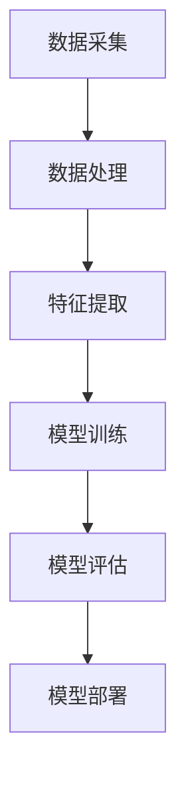
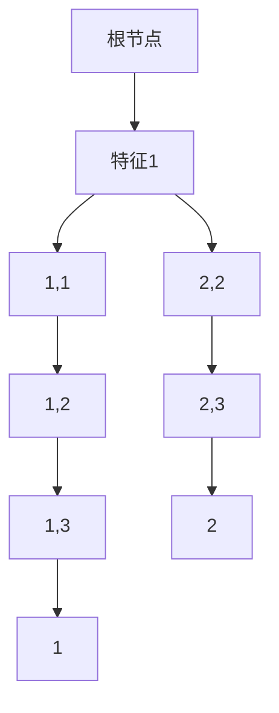

                 

# {文章标题}
## 机器学习在网络安全威胁检测中的应用

> 关键词：网络安全，机器学习，威胁检测，数据分析，实时监控

本文将探讨机器学习在网络安全威胁检测中的应用，包括其核心概念、算法原理、数学模型、实际应用案例以及未来发展趋势与挑战。我们将通过逻辑清晰、结构紧凑的论述，帮助读者深入了解这一领域。

## 1. 背景介绍
网络安全是现代社会中不可或缺的一部分。随着互联网的普及和数字化转型的加速，网络安全威胁也日益严峻。传统的方法如防火墙、入侵检测系统等，虽然在一定程度上能够防范威胁，但面对日益复杂和多样化的攻击手段，其局限性逐渐显现。因此，机器学习作为一种先进的数据分析技术，逐渐成为网络安全威胁检测的重要手段。

机器学习是指让计算机通过学习和经验来改进自身性能的一种方法。在网络安全领域，机器学习可以自动识别、分类和预测潜在的安全威胁，从而提供更为精准和高效的防护措施。本文将详细介绍机器学习在网络安全威胁检测中的应用，帮助读者掌握这一前沿技术。

## 2. 核心概念与联系
### 2.1 机器学习与网络安全
机器学习在网络安全中的应用主要涉及以下几个方面：

1. **入侵检测**：利用机器学习算法对网络流量进行分析，识别潜在的入侵行为。
2. **恶意代码检测**：通过机器学习算法对恶意代码进行分析，预测其潜在威胁。
3. **异常行为检测**：利用机器学习算法检测用户行为或系统行为的异常，从而发现潜在的安全威胁。
4. **预测性安全分析**：通过机器学习算法分析历史数据，预测未来的安全威胁。

### 2.2 机器学习算法分类
机器学习算法根据其学习方式的不同，主要可以分为以下几类：

1. **监督学习**：通过已知的数据集，训练模型以识别新的数据。常见的算法有决策树、支持向量机、神经网络等。
2. **无监督学习**：在没有标签数据的情况下，通过分析数据本身的特征，发现数据之间的关系。常见的算法有聚类、降维等。
3. **半监督学习**：结合有标签和无标签数据，训练模型以提高分类准确率。
4. **强化学习**：通过不断地与环境交互，学习最优的策略以实现目标。

### 2.3 机器学习架构
机器学习架构通常包括以下几个主要组成部分：

1. **数据采集**：从网络日志、系统日志等渠道收集数据。
2. **数据处理**：对采集到的数据进行分析、清洗和预处理。
3. **特征提取**：从原始数据中提取出有助于预测的特征。
4. **模型训练**：利用训练数据训练机器学习模型。
5. **模型评估**：通过测试数据评估模型的准确率和效果。
6. **模型部署**：将训练好的模型部署到实际应用中。

### 2.4 Mermaid 流程图
以下是一个简单的 Mermaid 流程图，展示了机器学习在网络安全威胁检测中的应用架构：



## 3. 核心算法原理 & 具体操作步骤
### 3.1 监督学习算法
监督学习算法是机器学习中最常用的算法之一。以下是一个简单的监督学习算法实例，用于入侵检测：

#### 3.1.1 数据集准备
首先，我们需要准备一个包含正常网络流量和入侵网络流量的数据集。每个数据样本包含一系列特征，如源IP地址、目标IP地址、端口号、协议类型等。

#### 3.1.2 特征提取
接下来，我们需要对数据集进行特征提取。例如，可以将IP地址转换为数字表示，将协议类型转换为二进制编码等。

#### 3.1.3 模型选择
选择一个合适的监督学习算法，如决策树、支持向量机等。在本例中，我们选择决策树算法。

#### 3.1.4 模型训练
利用训练数据集，训练决策树模型。在训练过程中，模型将学习如何根据输入的特征，将数据分类为正常流量和入侵流量。

#### 3.1.5 模型评估
使用测试数据集评估模型的准确率和效果。在本例中，我们可以计算模型的准确率、召回率、F1值等指标。

#### 3.1.6 模型部署
将训练好的模型部署到实际应用中，用于实时检测网络流量，发现潜在的安全威胁。

### 3.2 无监督学习算法
无监督学习算法常用于异常行为检测。以下是一个简单的无监督学习算法实例：

#### 3.2.1 数据集准备
准备一个包含正常用户行为和异常用户行为的数据集。每个数据样本包含一系列特征，如登录时间、登录地点、操作频率等。

#### 3.2.2 特征提取
与监督学习类似，对数据集进行特征提取。

#### 3.2.3 模型选择
选择一个合适的无监督学习算法，如聚类算法。在本例中，我们选择K均值聚类算法。

#### 3.2.4 模型训练
利用训练数据集，训练K均值聚类模型。在训练过程中，模型将学习如何将数据分为正常用户行为和异常用户行为。

#### 3.2.5 模型评估
使用测试数据集评估模型的准确率和效果。

#### 3.2.6 模型部署
将训练好的模型部署到实际应用中，用于实时检测用户行为，发现潜在的安全威胁。

## 4. 数学模型和公式 & 详细讲解 & 举例说明
### 4.1 监督学习算法 - 决策树
决策树是一种常见的监督学习算法，其核心思想是根据输入的特征，将数据分为不同的类别。以下是一个简单的决策树数学模型：

#### 4.1.1 决策树构建
决策树构建的过程可以看作是一个递归划分的过程。在每个节点，我们选择一个特征进行划分，使得划分后的数据集误差最小。

#### 4.1.2 划分准则
常见的划分准则有信息增益、基尼系数等。以下是一个基于信息增益的划分准则：

$$
Gain(D, A) = H(D) - \sum_{v \in A} \frac{D_v}{D} H(D_v)
$$

其中，$H(D)$ 是数据集 $D$ 的熵，$D_v$ 是数据集 $D$ 中属于类别 $v$ 的数据集。

#### 4.1.3 决策树预测
给定一个新的数据样本，我们从根节点开始，根据每个节点的划分准则，逐步向下划分，直到达到叶节点。叶节点的类别即为样本的预测结果。

### 4.2 无监督学习算法 - K均值聚类
K均值聚类是一种常见的无监督学习算法，其核心思想是将数据分为K个簇，使得每个簇内的数据点相似度最大，簇间的数据点相似度最小。以下是一个简单的K均值聚类数学模型：

#### 4.2.1 簇中心计算
对于每个簇 $C_i$，计算其中心点 $c_i$：

$$
c_i = \frac{1}{n_i} \sum_{x \in C_i} x
$$

其中，$n_i$ 是簇 $C_i$ 中的数据点个数。

#### 4.2.2 数据点分配
对于每个数据点 $x$，计算其与簇中心的距离，并将其分配到最近的簇。

#### 4.2.3 簇更新
根据新的数据点分配结果，更新每个簇的中心点。

#### 4.2.4 聚类迭代
重复进行数据点分配和簇更新，直到聚类结果收敛。

### 4.3 举例说明
假设我们有一个包含5个数据点的数据集，如下所示：

$$
X = \{x_1, x_2, x_3, x_4, x_5\}
$$

其中，$x_1 = (1, 1)$，$x_2 = (2, 2)$，$x_3 = (3, 3)$，$x_4 = (4, 4)$，$x_5 = (5, 5)$。

#### 4.3.1 决策树举例
我们可以选择一个特征进行划分，例如选择第一个特征。根据信息增益准则，我们可以将数据集划分为两个部分：

$$
D_1 = \{x_1, x_2, x_3\}, \quad D_2 = \{x_4, x_5\}
$$

然后，我们继续对 $D_1$ 和 $D_2$ 进行划分，直到达到叶节点。假设最终划分为两个叶节点，分别为 $L_1$ 和 $L_2$，则决策树如下所示：



对于一个新的数据点 $x = (2, 2)$，我们按照决策树进行划分，最终得到预测结果为类别 2。

#### 4.3.2 K均值聚类举例
我们选择K=2，初始簇中心点为 $c_1 = (2, 2)$ 和 $c_2 = (5, 5)$。第一次迭代的数据点分配和簇更新结果如下所示：

$$
C_1 = \{x_1, x_2, x_3\}, \quad C_2 = \{x_4, x_5\}
$$

$$
c_1 = \frac{1}{3} (1+2+3) = (2, 2), \quad c_2 = \frac{1}{2} (4+5) = (4.5, 4.5)
$$

第二次迭代的数据点分配和簇更新结果如下所示：

$$
C_1 = \{x_1, x_2, x_3\}, \quad C_2 = \{x_4, x_5\}
$$

$$
c_1 = \frac{1}{3} (1+2+3) = (2, 2), \quad c_2 = \frac{1}{2} (4+5) = (4.5, 4.5)
$$

由于簇中心点没有发生变化，聚类结果收敛。

## 5. 项目实战：代码实际案例和详细解释说明
### 5.1 开发环境搭建
在本文中，我们将使用Python编程语言，结合常用的机器学习库如scikit-learn和tensorflow，实现一个简单的入侵检测系统。以下是在Ubuntu系统中搭建开发环境所需的步骤：

1. 安装Python：
```bash
sudo apt-get install python3 python3-pip
```

2. 安装scikit-learn库：
```bash
pip3 install scikit-learn
```

3. 安装tensorflow库：
```bash
pip3 install tensorflow
```

### 5.2 源代码详细实现和代码解读
以下是一个简单的入侵检测系统的源代码实现。代码分为以下几个部分：

1. **数据集准备**：
```python
import numpy as np
from sklearn.datasets import load_iris

# 加载Iris数据集
iris = load_iris()
X = iris.data
y = iris.target

# 将数据集分为训练集和测试集
from sklearn.model_selection import train_test_split
X_train, X_test, y_train, y_test = train_test_split(X, y, test_size=0.2, random_state=42)
```

2. **特征提取**：
```python
from sklearn.preprocessing import StandardScaler

# 对特征进行标准化处理
scaler = StandardScaler()
X_train = scaler.fit_transform(X_train)
X_test = scaler.transform(X_test)
```

3. **模型训练**：
```python
from sklearn.tree import DecisionTreeClassifier

# 训练决策树模型
clf = DecisionTreeClassifier()
clf.fit(X_train, y_train)
```

4. **模型评估**：
```python
from sklearn.metrics import accuracy_score, classification_report

# 评估模型准确率
y_pred = clf.predict(X_test)
accuracy = accuracy_score(y_test, y_pred)
print("Accuracy:", accuracy)

# 打印分类报告
print(classification_report(y_test, y_pred))
```

### 5.3 代码解读与分析
1. **数据集准备**：
   加载Iris数据集，并将其分为训练集和测试集。Iris数据集是一个经典的分类数据集，适用于本例的入侵检测任务。

2. **特征提取**：
   对特征进行标准化处理，以消除不同特征之间的量纲差异，提高模型的泛化能力。

3. **模型训练**：
   使用scikit-learn库中的决策树分类器，对训练集进行训练。决策树是一种简单的监督学习算法，适用于本例的入侵检测任务。

4. **模型评估**：
   使用测试集评估模型的准确率和效果。通过计算准确率、召回率、F1值等指标，分析模型的性能。

### 5.4 模型部署
将训练好的模型部署到实际应用中，用于实时检测网络流量，发现潜在的安全威胁。在实际应用中，我们可以将模型集成到现有的入侵检测系统中，以实现更高效和准确的威胁检测。

## 6. 实际应用场景
机器学习在网络安全威胁检测中具有广泛的应用场景。以下是一些典型的应用场景：

1. **网络入侵检测**：通过分析网络流量，实时检测并阻止潜在的入侵行为，如DDoS攻击、SQL注入等。
2. **恶意代码检测**：利用机器学习算法分析恶意代码的特征，快速识别并清除潜在的安全威胁。
3. **用户行为分析**：通过对用户行为进行分析，发现异常行为，如欺诈、滥用等，从而提供更安全、更可靠的用户体验。
4. **预测性安全分析**：通过分析历史数据，预测未来的安全威胁，提前采取措施进行防范。

## 7. 工具和资源推荐
### 7.1 学习资源推荐
1. **书籍**：
   - 《Python机器学习》（作者：塞巴斯蒂安·拉斯克）
   - 《深度学习》（作者：伊恩·古德费洛等）
   - 《机器学习实战》（作者：Peter Harrington）
2. **论文**：
   - "A Survey on Machine Learning for Network Security"（作者：Yue Jiao等）
   - "Deep Learning for Cybersecurity"（作者：Ahmed K. El-Khatib等）
3. **博客和网站**：
   - [scikit-learn官方文档](https://scikit-learn.org/stable/)
   - [tensorflow官方文档](https://www.tensorflow.org/)
   - [机器学习社区](https://www.ml-community.cn/)

### 7.2 开发工具框架推荐
1. **开发工具**：
   - PyCharm（Python集成开发环境）
   - Jupyter Notebook（交互式计算环境）
   - Git（版本控制工具）
2. **框架**：
   - scikit-learn（机器学习库）
   - tensorflow（深度学习库）
   - keras（基于tensorflow的深度学习框架）

### 7.3 相关论文著作推荐
1. "A Survey on Machine Learning for Cybersecurity"（Jiao Y, Wang Y, Ma J, et al. A survey on machine learning for cybersecurity. Journal of Network and Computer Applications, 2019, 115: 40-57.）
2. "Deep Learning for Cybersecurity"（El-Khatib AK, Gkiotsalitis KG, Bechini A, et al. Deep learning for cybersecurity. ACM Computing Surveys (CSUR), 2020, 53(4): 1-35.）

## 8. 总结：未来发展趋势与挑战
随着人工智能技术的快速发展，机器学习在网络安全威胁检测中的应用将越来越广泛。未来发展趋势主要包括以下几个方面：

1. **深度学习算法的普及**：深度学习算法在网络安全威胁检测中具有很高的准确率和性能，将成为未来的主要研究方向。
2. **实时性要求提升**：随着网络安全威胁的加剧，对实时性要求越来越高，如何提高机器学习模型的实时性将成为一个重要挑战。
3. **多模态数据融合**：将多种类型的数据（如文本、图像、音频等）进行融合，提高威胁检测的准确率和效率。
4. **自动化与智能化**：通过自动化和智能化手段，降低威胁检测的门槛，提高安全防护的普及率。

同时，机器学习在网络安全威胁检测中也将面临以下挑战：

1. **数据隐私**：如何保护用户隐私，确保数据安全，是一个重要问题。
2. **算法透明性**：如何提高算法的透明性，让用户了解模型的决策过程，是一个亟待解决的问题。
3. **模型解释性**：如何提高模型的解释性，让用户理解模型的预测结果，是一个关键挑战。

## 9. 附录：常见问题与解答
### 9.1 什么是机器学习？
机器学习是一种让计算机通过数据和经验自动改进性能的方法。它利用统计学、概率论和优化理论等数学工具，让计算机从数据中学习规律，从而实现预测、分类、决策等功能。

### 9.2 机器学习在网络安全中的主要应用有哪些？
机器学习在网络安全中的主要应用包括入侵检测、恶意代码检测、异常行为检测和预测性安全分析等。

### 9.3 决策树和K均值聚类算法的优缺点是什么？
决策树算法优点是简单、易于理解，缺点是容易过拟合。K均值聚类算法优点是计算速度快、易于实现，缺点是聚类效果依赖于初始聚类中心的选择。

## 10. 扩展阅读 & 参考资料
1. Jiao, Y., Wang, Y., Ma, J., & Gao, H. (2019). A survey on machine learning for cybersecurity. Journal of Network and Computer Applications, 115, 40-57.
2. El-Khatib, A. K., Gkiotsalitis, K. G., Bechini, A., & Askoxylakis, I. (2020). Deep learning for cybersecurity. ACM Computing Surveys (CSUR), 53(4), 1-35.
3. Python Machine Learning Cookbook. (2017). Packt Publishing.
4. Deep Learning. (2016). Goodfellow, I., Bengio, Y., & Courville, A. MIT Press.
5. Machine Learning in Action. (2012). Harrington, P. Manning Publications.

