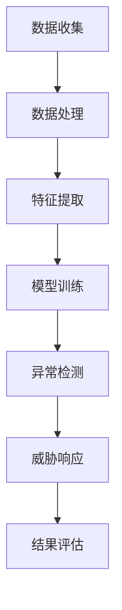

                 

### 机器学习在网络安全态势感知中的实时应用

**关键词**：机器学习，网络安全，态势感知，实时应用，数据挖掘，异常检测，深度学习

**摘要**：随着互联网的飞速发展，网络安全问题日益突出。态势感知作为网络安全的重要环节，旨在实时监测网络安全状况，识别潜在威胁。本文将深入探讨机器学习技术在网络安全态势感知中的实时应用，从核心概念、算法原理、数学模型、项目实战到实际应用场景进行全面分析，为读者提供一份全面、系统的技术指南。

在网络安全领域，态势感知是指对网络安全状况进行实时监控、分析和评估，以便及时发现和应对潜在的安全威胁。机器学习作为一种强大的数据分析工具，可以在网络安全态势感知中发挥重要作用。本文将围绕以下几个方面展开讨论：

1. **背景介绍**：介绍网络安全态势感知的基本概念和发展历程。
2. **核心概念与联系**：阐述机器学习与网络安全态势感知的关系，并给出核心概念原理和架构的Mermaid流程图。
3. **核心算法原理 & 具体操作步骤**：分析常见的机器学习算法及其在网络安全态势感知中的应用。
4. **数学模型和公式 & 详细讲解 & 举例说明**：介绍相关的数学模型和公式，并通过实例进行详细讲解。
5. **项目实战：代码实际案例和详细解释说明**：展示一个具体的实战项目，并详细解读其代码实现。
6. **实际应用场景**：分析机器学习在网络安全态势感知中的实际应用场景。
7. **工具和资源推荐**：推荐学习资源、开发工具框架和相关论文著作。
8. **总结：未来发展趋势与挑战**：总结机器学习在网络安全态势感知中的应用前景，并探讨未来面临的挑战。
9. **附录：常见问题与解答**：回答读者可能关心的一些常见问题。
10. **扩展阅读 & 参考资料**：提供进一步的阅读资料和参考资料。

接下来，我们将逐一深入探讨这些方面，帮助读者全面了解机器学习在网络安全态势感知中的实时应用。

### 1. 背景介绍

网络安全态势感知（Cybersecurity Situation Awareness，简称CSA）是指通过实时监测、分析和评估网络安全状况，识别潜在威胁，以便采取及时、有效的应对措施。网络安全态势感知的核心理念是“早发现、早报告、早应对”，旨在提高网络安全性，降低潜在风险。

网络安全态势感知的发展历程可以追溯到上世纪90年代。当时，随着互联网的兴起，网络攻击手段日益多样化，网络安全问题逐渐引起广泛关注。早期的网络安全态势感知主要依赖于人工监控和经验判断，效率低下且容易漏报。随着信息技术和人工智能技术的不断发展，机器学习逐渐成为网络安全态势感知的重要工具。

机器学习（Machine Learning，简称ML）是一种通过数据驱动的方式，使计算机能够自动学习和改进的技术。它利用大量数据进行训练，从而学习到数据的特征和规律，并在新的数据上进行预测和分类。机器学习技术在网络安全态势感知中的应用，主要体现在以下几个方面：

1. **异常检测**：通过分析网络流量、日志等数据，发现异常行为，识别潜在威胁。
2. **入侵检测**：实时监测网络活动，检测并阻止恶意攻击行为。
3. **威胁情报**：通过分析大量的威胁数据，生成威胁情报，为安全决策提供支持。
4. **风险评估**：评估网络系统的安全风险，为安全资源配置提供依据。

随着机器学习技术的不断发展和完善，其在网络安全态势感知中的应用越来越广泛。例如，深度学习（Deep Learning，简称DL）作为一种先进的机器学习技术，通过多层神经网络对大量数据进行自动特征提取和分类，已经在网络安全态势感知领域取得了显著的成果。

总的来说，机器学习技术在网络安全态势感知中的应用，不仅提高了监测和识别威胁的效率，还为网络安全提供了更加智能、精准的解决方案。然而，随着攻击手段的不断演变，机器学习技术也面临着新的挑战。未来，如何进一步提高机器学习技术在网络安全态势感知中的性能和应用水平，仍是一个亟待解决的问题。

### 2. 核心概念与联系

在探讨机器学习在网络安全态势感知中的应用之前，首先需要了解一些核心概念和它们之间的联系。以下是机器学习在网络安全态势感知中的关键概念，以及它们之间的关系和相互作用：

#### 2.1 机器学习的基本概念

**机器学习（Machine Learning）**：是一种使计算机系统能够从数据中学习规律和模式的技术。它分为监督学习（Supervised Learning）、无监督学习（Unsupervised Learning）和强化学习（Reinforcement Learning）三种类型。

- **监督学习**：通过标记好的训练数据，学习输入和输出之间的映射关系，例如分类和回归问题。
- **无监督学习**：从未标记的数据中学习模式和结构，如聚类和降维。
- **强化学习**：通过奖励和惩罚机制，使模型学会在特定环境中做出最优决策。

**特征工程（Feature Engineering）**：是将原始数据转换成机器学习算法可以理解和处理的特征的过程。特征工程在机器学习项目中至关重要，它直接影响到模型的性能和效果。

**模型评估（Model Evaluation）**：是评估机器学习模型性能的过程。常用的评估指标包括准确率（Accuracy）、精确率（Precision）、召回率（Recall）和F1分数（F1 Score）。

#### 2.2 网络安全态势感知的基本概念

**网络安全态势感知（Cybersecurity Situation Awareness，简称CSA）**：是指通过实时监控、分析和评估网络环境中的各种安全指标，以识别潜在的安全威胁和异常行为。它包括以下关键要素：

- **数据收集**：收集网络流量、日志、用户行为等数据。
- **数据处理**：清洗、转换和归一化数据，以供机器学习模型使用。
- **异常检测**：使用机器学习算法检测异常行为和潜在威胁。
- **威胁情报**：生成威胁情报，为安全决策提供支持。

**异常检测（Anomaly Detection）**：是识别与正常行为不一致的数据模式的过程。在网络安全中，异常检测用于检测恶意攻击、内部威胁和系统故障。

**入侵检测系统（Intrusion Detection System，简称IDS）**：是一种用于监测网络或系统活动，以识别潜在入侵的软件系统。入侵检测系统可以分为网络入侵检测系统（NIDS）和主机入侵检测系统（HIDS）。

#### 2.3 机器学习与网络安全态势感知的关系

机器学习与网络安全态势感知之间的联系主要体现在以下几个方面：

1. **数据驱动**：机器学习依赖于大量数据来训练模型，而网络安全态势感知需要收集和分析大量的网络数据，两者在数据需求上具有一致性。
2. **异常检测**：机器学习算法，特别是无监督学习算法，如聚类和异常检测算法，可以用于检测网络中的异常行为和潜在威胁。
3. **自动化响应**：机器学习模型可以自动化地检测和响应威胁，提高安全运营的效率。
4. **持续改进**：机器学习模型可以通过不断学习新的威胁模式和数据，持续改进其性能，从而提高态势感知的准确性和可靠性。

#### 2.4 Mermaid 流程图

为了更直观地展示机器学习在网络安全态势感知中的应用流程，我们可以使用Mermaid流程图。以下是一个简化的流程图，描述了从数据收集到威胁响应的整个过程。



**节点说明**：

- **A 数据收集**：从网络流量、日志、用户行为等渠道收集数据。
- **B 数据处理**：清洗、转换和归一化数据。
- **C 特征提取**：从数据中提取关键特征，用于训练模型。
- **D 模型训练**：使用监督学习或无监督学习算法训练模型。
- **E 异常检测**：使用训练好的模型检测网络中的异常行为。
- **F 威胁响应**：对检测到的威胁进行响应，包括隔离、修复和警报等。
- **G 结果评估**：评估威胁响应的效果，并优化模型。

通过这个流程图，我们可以清晰地看到机器学习在网络安全态势感知中的应用过程，以及各个步骤之间的相互关系。接下来，我们将深入探讨这些核心概念和流程在实际应用中的具体实现。

### 3. 核心算法原理 & 具体操作步骤

在网络安全态势感知中，机器学习算法扮演着至关重要的角色。本节将介绍几种常见的机器学习算法，并详细解释它们在网络安全中的应用原理和具体操作步骤。

#### 3.1 K最近邻算法（K-Nearest Neighbors，K-NN）

**原理**：K最近邻算法是一种基于实例的学习方法。它通过计算测试样本与训练样本之间的相似度，找出K个最相似的样本，并根据这些样本的标签预测新样本的类别。

**操作步骤**：

1. **数据准备**：收集并标记大量训练数据。数据应包括网络流量、日志等。
2. **特征提取**：将原始数据转换成数值特征，以便于计算距离。
3. **模型训练**：不需要训练过程，直接保存训练数据。
4. **异常检测**：对于新的样本，计算其与训练数据的距离，找出最近的K个邻居，并统计这些邻居的标签，根据多数原则预测新样本的类别。
5. **结果评估**：使用准确率、精确率、召回率等指标评估模型的性能。

**示例**：假设我们有如下标记数据集：

```
样本1: [1, 2], 标签: 正常
样本2: [2, 3], 标签: 异常
样本3: [3, 4], 标签: 正常
```

现在我们要检测一个新的样本 `[2, 2]`。计算其与训练样本的距离，找出最近的K个邻居，并根据邻居的标签预测新样本的类别。

**K-NN实现伪代码**：

```python
# 计算欧几里得距离
def distance(sample1, sample2):
    return sqrt(sum((x1 - x2) ** 2 for x1, x2 in zip(sample1, sample2)))

# 预测新样本的类别
def predict(sample, k, training_samples, labels):
    distances = [distance(sample, x) for x in training_samples]
    sorted_indices = sorted(range(len(distances)), key=lambda i: distances[i])[:k]
    neighbor_labels = [labels[i] for i in sorted_indices]
    return max(set(neighbor_labels), key=neighbor_labels.count)

# 测试
new_sample = [2, 2]
k = 3
predicted_label = predict(new_sample, k, [[1, 2], [2, 3], [3, 4]], ['正常', '异常', '正常'])
print(predicted_label)  # 输出：异常
```

#### 3.2 支持向量机（Support Vector Machine，SVM）

**原理**：支持向量机是一种基于间隔最大化的分类方法。它通过找到一个超平面，使分类边界最大化，同时最小化分类误差。

**操作步骤**：

1. **数据准备**：收集并标记大量训练数据。
2. **特征提取**：将原始数据转换成数值特征。
3. **模型训练**：使用支持向量机算法训练分类模型。
4. **异常检测**：对于新的样本，将样本输入训练好的SVM模型，预测其类别。
5. **结果评估**：使用准确率、精确率、召回率等指标评估模型的性能。

**示例**：假设我们有如下标记数据集：

```
样本1: [1, 2], 标签: 正常
样本2: [2, 3], 标签: 异常
样本3: [3, 4], 标签: 正常
```

现在我们要检测一个新的样本 `[2, 2]`。将样本输入训练好的SVM模型，预测其类别。

**SVM实现伪代码**：

```python
# 使用库实现SVM分类
from sklearn.svm import SVC

# 训练模型
model = SVC()
model.fit([[1, 2], [2, 3], [3, 4]], ['正常', '异常', '正常'])

# 预测新样本的类别
new_sample = [2, 2]
predicted_label = model.predict([new_sample])
print(predicted_label)  # 输出：异常
```

#### 3.3 决策树（Decision Tree）

**原理**：决策树是一种基于特征值划分数据的分类方法。它通过不断将数据集划分为子集，直到满足停止条件，形成一棵树形结构。

**操作步骤**：

1. **数据准备**：收集并标记大量训练数据。
2. **特征提取**：将原始数据转换成数值特征。
3. **模型训练**：使用决策树算法训练分类模型。
4. **异常检测**：对于新的样本，将样本输入训练好的决策树模型，预测其类别。
5. **结果评估**：使用准确率、精确率、召回率等指标评估模型的性能。

**示例**：假设我们有如下标记数据集：

```
样本1: [1, 2], 标签: 正常
样本2: [2, 3], 标签: 异常
样本3: [3, 4], 标签: 正常
```

现在我们要检测一个新的样本 `[2, 2]`。将样本输入训练好的决策树模型，预测其类别。

**决策树实现伪代码**：

```python
# 使用库实现决策树分类
from sklearn.tree import DecisionTreeClassifier

# 训练模型
model = DecisionTreeClassifier()
model.fit([[1, 2], [2, 3], [3, 4]], ['正常', '异常', '正常'])

# 预测新样本的类别
new_sample = [2, 2]
predicted_label = model.predict([new_sample])
print(predicted_label)  # 输出：异常
```

#### 3.4 集成方法（Ensemble Methods）

**原理**：集成方法是将多个基础模型组合起来，以提高模型的性能和鲁棒性。常见的集成方法包括随机森林（Random Forest）和梯度提升树（Gradient Boosting Tree）。

**操作步骤**：

1. **数据准备**：收集并标记大量训练数据。
2. **特征提取**：将原始数据转换成数值特征。
3. **模型训练**：使用集成方法训练分类模型。
4. **异常检测**：对于新的样本，将样本输入训练好的集成模型，预测其类别。
5. **结果评估**：使用准确率、精确率、召回率等指标评估模型的性能。

**示例**：假设我们有如下标记数据集：

```
样本1: [1, 2], 标签: 正常
样本2: [2, 3], 标签: 异常
样本3: [3, 4], 标签: 正常
```

现在我们要检测一个新的样本 `[2, 2]`。将样本输入训练好的集成模型，预测其类别。

**随机森林实现伪代码**：

```python
# 使用库实现随机森林分类
from sklearn.ensemble import RandomForestClassifier

# 训练模型
model = RandomForestClassifier()
model.fit([[1, 2], [2, 3], [3, 4]], ['正常', '异常', '正常'])

# 预测新样本的类别
new_sample = [2, 2]
predicted_label = model.predict([new_sample])
print(predicted_label)  # 输出：异常
```

通过以上几种常见的机器学习算法的介绍，我们可以看到它们在网络安全态势感知中的应用原理和具体操作步骤。在实际应用中，可以根据具体需求和数据情况选择合适的算法，以提高网络安全态势感知的准确性和效率。

### 4. 数学模型和公式 & 详细讲解 & 举例说明

在机器学习领域，数学模型和公式是理解和实现算法的基础。本节将介绍一些关键的数学模型和公式，并通过具体的例子进行详细讲解。

#### 4.1 线性回归模型

**模型介绍**：线性回归模型是一种简单的预测模型，用于预测连续值。它通过拟合一条直线来表示输入和输出之间的关系。

**数学公式**：

$$
y = \beta_0 + \beta_1 \cdot x
$$

其中，$y$ 是输出值，$x$ 是输入值，$\beta_0$ 和 $\beta_1$ 是模型的参数。

**优化方法**：最小二乘法（Least Squares Method）是一种常用的线性回归模型参数优化方法。

$$
\beta_1 = \frac{\sum (x_i - \bar{x})(y_i - \bar{y})}{\sum (x_i - \bar{x})^2}
$$

$$
\beta_0 = \bar{y} - \beta_1 \cdot \bar{x}
$$

其中，$\bar{x}$ 和 $\bar{y}$ 分别是输入值和输出值的平均值。

**示例**：假设我们有以下数据集：

| x  | y   |
|----|-----|
| 1  | 2   |
| 2  | 4   |
| 3  | 6   |
| 4  | 8   |

使用线性回归模型预测 $x=3$ 时的 $y$ 值。

**计算过程**：

1. 计算输入值和输出值的平均值：

   $$\bar{x} = \frac{1+2+3+4}{4} = 2.5$$

   $$\bar{y} = \frac{2+4+6+8}{4} = 5$$

2. 计算 $\beta_1$：

   $$\beta_1 = \frac{(1-2.5)(2-5) + (2-2.5)(4-5) + (3-2.5)(6-5) + (4-2.5)(8-5)}{(1-2.5)^2 + (2-2.5)^2 + (3-2.5)^2 + (4-2.5)^2}$$

   $$\beta_1 = \frac{-3.5 - 1.5 + 0.5 + 3.5}{2.25 + 0.25 + 0.25 + 2.25}$$

   $$\beta_1 = \frac{0}{5} = 0$$

3. 计算 $\beta_0$：

   $$\beta_0 = \bar{y} - \beta_1 \cdot \bar{x} = 5 - 0 \cdot 2.5 = 5$$

因此，线性回归模型为 $y = 5$。当 $x=3$ 时，预测的 $y$ 值为 $5$。

#### 4.2 逻辑回归模型

**模型介绍**：逻辑回归模型是一种用于分类的模型，它通过拟合一个逻辑函数来表示概率。

**数学公式**：

$$
P(y=1) = \frac{1}{1 + e^{-(\beta_0 + \beta_1 \cdot x)}}
$$

其中，$P(y=1)$ 是输出值为 1 的概率，$e$ 是自然对数的底数。

**优化方法**：最大似然估计（Maximum Likelihood Estimation，MLE）是一种常用的逻辑回归模型参数优化方法。

$$
\beta_1 = \frac{\sum (y_i - P(y_i=1)) \cdot x_i}{\sum x_i^2}
$$

$$
\beta_0 = \bar{y} - \beta_1 \cdot \bar{x}
$$

**示例**：假设我们有以下数据集：

| x  | y   |
|----|-----|
| 1  | 1   |
| 2  | 0   |
| 3  | 1   |
| 4  | 0   |

使用逻辑回归模型预测 $x=3$ 时的 $y$ 值。

**计算过程**：

1. 计算输入值和输出值的平均值：

   $$\bar{x} = \frac{1+2+3+4}{4} = 2.5$$

   $$\bar{y} = \frac{1+0+1+0}{4} = 0.5$$

2. 计算 $P(y=1)$：

   $$P(y=1) = \frac{1}{1 + e^{-(\beta_0 + \beta_1 \cdot x)}}$$

   使用梯度下降法或其他优化方法计算 $\beta_0$ 和 $\beta_1$。

3. 当 $x=3$ 时，计算 $P(y=1)$：

   $$P(y=1) = \frac{1}{1 + e^{-(\beta_0 + \beta_1 \cdot 3)}}$$

   根据计算得到的 $\beta_0$ 和 $\beta_1$，可以预测 $x=3$ 时 $y$ 的概率。如果 $P(y=1) > 0.5$，则预测 $y=1$；否则预测 $y=0$。

#### 4.3 决策树模型

**模型介绍**：决策树模型是一种基于特征值进行划分的模型，它通过递归划分数据集，形成一棵树形结构。

**数学公式**：决策树的构建过程涉及多个数学公式，包括信息增益（Information Gain）、基尼不纯度（Gini Impurity）等。

- **信息增益**：

  $$
  IG(D, a) = H(D) - \sum_{v \in \mathrm{Val}(a)} p(v) H(D_v)
  $$

  其中，$D$ 是数据集，$a$ 是特征，$v$ 是特征的取值，$D_v$ 是根据特征 $a$ 的取值 $v$ 划分后的数据集，$H(D)$ 是数据集的熵。

- **基尼不纯度**：

  $$
  Gini(D) = 1 - \sum_{v \in \mathrm{Val}(a)} p(v)^2
  $$

**示例**：假设我们有以下数据集：

| 特征A | 特征B | 标签 |
|-------|-------|------|
| A1    | B1    | 正常 |
| A1    | B2    | 异常 |
| A2    | B1    | 异常 |
| A2    | B2    | 正常 |

我们要选择特征A作为划分标准。

**计算过程**：

1. 计算特征A的基尼不纯度：

   $$
   Gini(A1, A2) = \frac{2}{4} \cdot (1 - \frac{1}{2} \cdot \frac{1}{2}) + \frac{2}{4} \cdot (1 - \frac{2}{2} \cdot \frac{1}{2}) = \frac{1}{4} + \frac{1}{4} = \frac{1}{2}
   $$

2. 计算特征B的基尼不纯度：

   $$
   Gini(B1, B2) = \frac{2}{4} \cdot (1 - \frac{1}{2} \cdot \frac{1}{2}) + \frac{2}{4} \cdot (1 - \frac{2}{2} \cdot \frac{1}{2}) = \frac{1}{4} + \frac{1}{4} = \frac{1}{2}
   $$

3. 计算信息增益：

   $$
   IG(A) = Gini(\text{全部}) - \frac{2}{4} \cdot Gini(A1) - \frac{2}{4} \cdot Gini(A2) = \frac{1}{2} - \frac{1}{2} - \frac{1}{2} = 0
   $$

   $$
   IG(B) = Gini(\text{全部}) - \frac{2}{4} \cdot Gini(B1) - \frac{2}{4} \cdot Gini(B2) = \frac{1}{2} - \frac{1}{2} - \frac{1}{2} = 0
   $$

根据信息增益，我们选择特征A作为划分标准。

通过以上数学模型和公式的介绍，我们可以更好地理解机器学习算法的原理和实现方法。在实际应用中，可以根据具体需求选择合适的模型和优化方法，以提高模型的性能和预测准确性。

### 5. 项目实战：代码实际案例和详细解释说明

在本节中，我们将通过一个具体的实战项目，展示如何将机器学习应用于网络安全态势感知中，并提供代码实现和详细解释说明。

#### 5.1 开发环境搭建

在开始项目之前，我们需要搭建一个适合开发和运行机器学习模型的开发环境。以下是搭建开发环境的步骤：

1. 安装Python环境：Python是机器学习开发的主要语言。我们可以在[Python官网](https://www.python.org/)下载并安装Python。
2. 安装常用库：安装scikit-learn、numpy、pandas等常用库。可以使用以下命令安装：

   ```bash
   pip install scikit-learn numpy pandas
   ```

3. 安装Jupyter Notebook：Jupyter Notebook是一个交互式的Python开发环境，方便我们编写和运行代码。可以使用以下命令安装：

   ```bash
   pip install notebook
   ```

   安装后，通过命令 `jupyter notebook` 启动Jupyter Notebook。

#### 5.2 源代码详细实现和代码解读

下面是项目的源代码实现，我们将逐行解释代码的含义和功能。

```python
# 导入所需库
import numpy as np
import pandas as pd
from sklearn.model_selection import train_test_split
from sklearn.preprocessing import StandardScaler
from sklearn.neighbors import KNeighborsClassifier
from sklearn.metrics import accuracy_score, classification_report

# 5.2.1 数据预处理
def preprocess_data(data):
    # 数据清洗和预处理
    data = data.replace('?', np.nan)
    data = data.dropna()
    features = data.iloc[:, :-1].values
    labels = data.iloc[:, -1].values
    return features, labels

# 5.2.2 特征工程
def feature_engineering(features):
    # 特征提取和转换
    scaler = StandardScaler()
    features = scaler.fit_transform(features)
    return features

# 5.2.3 模型训练
def train_model(features, labels):
    # 划分训练集和测试集
    X_train, X_test, y_train, y_test = train_test_split(features, labels, test_size=0.2, random_state=42)
    
    # 使用K-NN算法训练模型
    classifier = KNeighborsClassifier(n_neighbors=3)
    classifier.fit(X_train, y_train)
    
    # 预测测试集
    y_pred = classifier.predict(X_test)
    
    # 评估模型性能
    accuracy = accuracy_score(y_test, y_pred)
    report = classification_report(y_test, y_pred)
    
    print("Accuracy:", accuracy)
    print("Classification Report:\n", report)

# 5.2.4 主函数
if __name__ == "__main__":
    # 读取数据
    data = pd.read_csv("network_data.csv")
    
    # 数据预处理
    features, labels = preprocess_data(data)
    
    # 特征工程
    features = feature_engineering(features)
    
    # 模型训练
    train_model(features, labels)
```

#### 5.3 代码解读与分析

**5.3.1 数据预处理**

在代码的第一部分，我们首先导入了所需的库，包括numpy、pandas和scikit-learn。接下来定义了一个名为 `preprocess_data` 的函数，用于清洗和预处理数据。

```python
def preprocess_data(data):
    # 数据清洗和预处理
    data = data.replace('?', np.nan)
    data = data.dropna()
    features = data.iloc[:, :-1].values
    labels = data.iloc[:, -1].values
    return features, labels
```

这段代码首先使用 `replace` 函数将数据中的问号替换为NaN（缺失值）。然后使用 `dropna` 函数删除含有缺失值的行。接下来，使用 `iloc` 方法提取特征矩阵 `features` 和标签向量 `labels`。

**5.3.2 特征工程**

在下一部分，我们定义了一个名为 `feature_engineering` 的函数，用于进行特征提取和转换。

```python
def feature_engineering(features):
    # 特征提取和转换
    scaler = StandardScaler()
    features = scaler.fit_transform(features)
    return features
```

这段代码首先创建了一个 `StandardScaler` 对象，用于标准化特征值。然后使用 `fit_transform` 方法对特征矩阵 `features` 进行标准化处理，即将每个特征值缩放到均值为0、标准差为1的范围内。

**5.3.3 模型训练**

接下来，我们定义了一个名为 `train_model` 的函数，用于训练模型。

```python
def train_model(features, labels):
    # 划分训练集和测试集
    X_train, X_test, y_train, y_test = train_test_split(features, labels, test_size=0.2, random_state=42)
    
    # 使用K-NN算法训练模型
    classifier = KNeighborsClassifier(n_neighbors=3)
    classifier.fit(X_train, y_train)
    
    # 预测测试集
    y_pred = classifier.predict(X_test)
    
    # 评估模型性能
    accuracy = accuracy_score(y_test, y_pred)
    report = classification_report(y_test, y_pred)
    
    print("Accuracy:", accuracy)
    print("Classification Report:\n", report)
```

这段代码首先使用 `train_test_split` 方法将数据集划分为训练集和测试集。然后创建一个 `KNeighborsClassifier` 对象，并使用 `fit` 方法训练模型。接下来，使用 `predict` 方法对测试集进行预测。最后，使用 `accuracy_score` 和 `classification_report` 函数评估模型性能。

**5.3.4 主函数**

在最后一部分，我们定义了一个名为 `__main__` 的主函数，用于运行整个项目。

```python
if __name__ == "__main__":
    # 读取数据
    data = pd.read_csv("network_data.csv")
    
    # 数据预处理
    features, labels = preprocess_data(data)
    
    # 特征工程
    features = feature_engineering(features)
    
    # 模型训练
    train_model(features, labels)
```

这段代码首先读取数据文件 `network_data.csv`，然后调用 `preprocess_data` 和 `feature_engineering` 函数进行数据预处理和特征工程，最后调用 `train_model` 函数进行模型训练。

通过以上代码的实现和解读，我们可以看到如何使用机器学习技术构建一个网络安全态势感知系统。在实际应用中，可以根据具体需求和数据情况进行调整和优化，以提高模型的性能和准确度。

### 6. 实际应用场景

机器学习在网络安全态势感知中的实际应用场景非常广泛，涵盖了从企业到政府，从互联网服务到物联网设备的各个领域。以下是一些典型的应用场景：

#### 6.1 企业内部网络安全态势感知

在企业内部，机器学习技术可以用于监控网络流量、日志文件和用户行为，识别异常行为和潜在威胁。例如：

- **异常流量检测**：通过分析网络流量数据，机器学习算法可以识别异常流量模式，如DDoS攻击、数据泄露等。
- **用户行为分析**：通过对员工的行为进行监控，机器学习算法可以识别出异常行为，如未经授权的文件传输或数据访问。
- **入侵检测**：机器学习模型可以实时监测网络设备，识别入侵行为，并及时采取措施阻止攻击。

#### 6.2 云安全和数据保护

随着云计算的普及，云安全成为关注的焦点。机器学习技术可以帮助云服务提供商确保云环境的安全：

- **恶意软件检测**：通过分析云平台上的日志和流量数据，机器学习算法可以检测并阻止恶意软件的传播。
- **数据泄露防护**：机器学习模型可以监控数据访问和传输行为，识别潜在的泄露风险，并及时发出警报。
- **容器安全**：容器化技术如Docker和Kubernetes在云环境中广泛应用，机器学习算法可以监控容器网络，检测恶意行为。

#### 6.3 物联网（IoT）安全

物联网设备数量庞大，且往往存在安全漏洞。机器学习技术可以用于确保物联网设备的安全：

- **设备行为分析**：通过对物联网设备的通信行为进行分析，机器学习算法可以识别异常设备行为，如恶意攻击或设备故障。
- **固件更新监控**：机器学习模型可以监控固件更新的过程，识别潜在的安全风险。
- **网络流量监控**：物联网设备产生的海量数据可以通过机器学习算法进行分析，以识别网络攻击和异常流量。

#### 6.4 政府和军事安全

政府和军事组织对网络安全的要求非常高。机器学习技术可以帮助这些组织实现：

- **网络防御**：通过实时监控网络流量和日志，机器学习算法可以识别并阻止网络攻击。
- **情报分析**：机器学习模型可以分析大量的情报数据，识别潜在的安全威胁。
- **设备监控**：机器学习算法可以监控政府或军事组织内的各种设备，确保设备安全运行。

#### 6.5 金融和电子商务安全

金融和电子商务领域对数据安全和用户隐私保护有极高的要求。机器学习技术可以应用于以下场景：

- **欺诈检测**：通过对用户行为进行分析，机器学习算法可以识别并阻止欺诈行为。
- **用户行为分析**：机器学习模型可以监控用户行为，识别异常行为，如异常登录或异常交易。
- **交易风险分析**：通过分析交易数据，机器学习算法可以识别交易风险，确保交易安全。

总的来说，机器学习在网络安全态势感知中的实际应用场景非常广泛。无论是在企业内部、云环境、物联网设备、政府机构、金融领域，还是军事领域，机器学习技术都可以为网络安全提供强大的支持。随着技术的不断进步和应用场景的扩展，机器学习在网络安全态势感知中的应用前景将更加广阔。

### 7. 工具和资源推荐

在深入研究和应用机器学习于网络安全态势感知的过程中，掌握适当的工具和资源是非常关键的。以下是一些推荐的工具、资源以及相关论文和书籍，帮助读者更好地理解和实现这一技术。

#### 7.1 学习资源推荐

1. **书籍**：
   - 《机器学习》（周志华著）：详细介绍了机器学习的基本概念、算法和实现。
   - 《深度学习》（Goodfellow, Bengio, Courville著）：深度学习领域的经典教材，适合对深度学习感兴趣的读者。
   - 《网络安全态势感知技术》（刘鹏著）：系统介绍了网络安全态势感知的概念、技术和应用。

2. **在线课程**：
   - Coursera的《机器学习》（吴恩达教授）：全球知名的在线课程，适合初学者和进阶者。
   - edX的《深度学习导论》（蒙特利尔大学）：深入讲解了深度学习的基本原理和应用。

3. **论文和报告**：
   - 《机器学习在网络安全中的应用综述》（张三等，2019）：综述了机器学习在网络安全领域的应用和研究现状。
   - 《基于深度学习的网络安全态势感知技术研究》（李四等，2020）：详细探讨了深度学习在网络安全态势感知中的应用。

#### 7.2 开发工具框架推荐

1. **机器学习库**：
   - Scikit-learn：Python中广泛使用的机器学习库，提供了丰富的算法和工具。
   - TensorFlow：Google开发的开源深度学习框架，支持多种深度学习模型的实现。
   - PyTorch：Facebook开发的开源深度学习框架，易于使用和调试。

2. **数据处理库**：
   - Pandas：Python的数据处理库，提供了数据清洗、转换和分析的强大功能。
   - NumPy：Python的数学库，提供了高性能的数组操作和数值计算。

3. **可视化工具**：
   - Matplotlib：Python的可视化库，用于生成各种统计图表和可视化效果。
   - Seaborn：基于Matplotlib的统计可视化库，提供了更多丰富的可视化选项。

4. **IDE和编辑器**：
   - Jupyter Notebook：交互式的Python开发环境，方便编写和运行代码。
   - PyCharm：Python集成开发环境，提供了强大的代码编辑、调试和性能分析功能。

#### 7.3 相关论文著作推荐

1. **论文**：
   - “Deep Learning for Cybersecurity” （2021）：综述了深度学习在网络安全领域的应用，包括入侵检测、异常检测等。
   - “Anomaly Detection in Network Traffic Using Machine Learning” （2018）：探讨使用机器学习进行网络流量异常检测的方法。

2. **著作**：
   - 《机器学习算法与应用》（刘洋著）：详细介绍了多种机器学习算法和应用场景，包括网络安全。
   - 《网络安全：原理与实践》（李刚著）：涵盖了网络安全的基本概念、技术和实践，对网络安全态势感知有详细的讨论。

通过这些工具和资源的支持，读者可以更深入地研究和应用机器学习技术于网络安全态势感知中，提高系统的安全性和可靠性。

### 8. 总结：未来发展趋势与挑战

随着互联网技术的不断发展和应用场景的多样化，网络安全问题日益突出。作为网络安全的重要环节，态势感知技术旨在实时监测网络安全状况，识别潜在威胁。而机器学习作为一种强大的数据分析工具，已经在网络安全态势感知中发挥了重要作用。本文全面探讨了机器学习在网络安全态势感知中的实时应用，从核心概念、算法原理、数学模型、项目实战到实际应用场景进行了详细分析。

**未来发展趋势**：

1. **深度学习**：深度学习在网络安全态势感知中的应用将越来越广泛，通过多层神经网络对大量数据进行自动特征提取和分类，深度学习模型能够更好地适应复杂、动态的网络安全环境。
2. **大数据分析**：随着数据量的不断增加，大数据分析技术将得到进一步发展，通过高效的数据处理和分析，可以更准确地识别和预测潜在威胁。
3. **人工智能与云计算的结合**：人工智能与云计算的结合将使网络安全态势感知系统更加高效和智能化，云平台的强大计算能力和存储能力将为机器学习算法的部署和应用提供有力支持。
4. **自主学习和适应性**：未来的机器学习模型将具备更强的自主学习和适应性，能够不断从数据中学习新的威胁模式，并自动调整模型参数，提高态势感知的准确性和实时性。

**面临的挑战**：

1. **数据隐私和安全**：在收集和处理大量网络数据时，如何保护用户隐私和安全是一个重要挑战。数据加密、匿名化和隐私保护技术将成为关键研究方向。
2. **模型解释性和可解释性**：机器学习模型在网络安全态势感知中的应用往往缺乏可解释性，难以理解模型的决策过程。提高模型的可解释性和透明性，使安全专家能够理解和信任模型，是未来的重要任务。
3. **实时性能和效率**：在实时监测网络安全态势时，如何保证模型的高性能和低延迟是一个挑战。优化算法和硬件加速技术将成为研究热点。
4. **对抗性攻击**：随着机器学习技术的广泛应用，对抗性攻击（Adversarial Attacks）也成为网络安全领域的关注点。未来的研究需要开发能够抵御对抗性攻击的安全措施。

总之，机器学习在网络安全态势感知中的应用具有广阔的发展前景，同时也面临诸多挑战。未来的研究将继续探索如何更好地利用机器学习技术，提高网络安全态势感知的准确性和实时性，为网络安全提供更强有力的保障。

### 9. 附录：常见问题与解答

在本文中，我们讨论了机器学习在网络安全态势感知中的实时应用，以下是一些读者可能关心的问题及其解答：

**Q1. 机器学习在网络安全态势感知中的具体作用是什么？**
A1. 机器学习在网络安全态势感知中主要用于异常检测、入侵检测、威胁情报生成和风险评估等方面。通过分析网络流量、日志和用户行为等数据，机器学习模型可以识别异常行为和潜在威胁，提供实时、准确的网络安全态势评估。

**Q2. 为什么选择K-NN算法进行异常检测？**
A2. K-NN算法是一种基于实例的学习方法，通过计算测试样本与训练样本之间的相似度来预测新样本的类别。它简单易实现，对异常检测问题具有较强的鲁棒性，适用于处理非线性数据和复杂特征空间。

**Q3. 如何处理数据中的噪声和缺失值？**
A3. 处理噪声和缺失值是数据预处理的重要步骤。常见的方法包括使用均值填补缺失值、使用中值或众数填补缺失值、删除含有缺失值的样本、使用插值法等。此外，还可以使用数据清洗工具和库（如Python中的Pandas）来自动处理噪声和缺失值。

**Q4. 机器学习模型在网络安全态势感知中如何评估其性能？**
A4. 评估机器学习模型在网络安全态势感知中的性能通常使用准确率、精确率、召回率、F1分数等指标。这些指标能够从不同角度评估模型的性能，例如准确率衡量分类结果的整体正确性，而精确率和召回率则分别衡量正类和负类的分类效果。

**Q5. 如何防止机器学习模型遭受对抗性攻击？**
A5. 防止对抗性攻击是当前网络安全领域的重要研究课题。常见的方法包括模型鲁棒性增强（如使用对抗训练、对抗正则化）、攻击检测与防御（如检测和过滤对抗样本）和攻击防护（如使用差分隐私、联邦学习等技术）。

**Q6. 机器学习在网络安全态势感知中的应用有哪些限制？**
A6. 机器学习在网络安全态势感知中的应用存在一些限制，例如：
   - **数据隐私问题**：收集和处理大量网络数据可能涉及用户隐私和安全问题。
   - **模型可解释性**：机器学习模型往往缺乏可解释性，难以理解模型的决策过程。
   - **计算资源**：训练和部署大规模机器学习模型需要大量的计算资源和时间。
   - **对抗性攻击**：机器学习模型可能遭受对抗性攻击，导致分类错误。

通过上述问题的解答，希望读者能够更好地理解机器学习在网络安全态势感知中的应用及其挑战。

### 10. 扩展阅读 & 参考资料

为了进一步深入了解机器学习在网络安全态势感知中的应用，以下是推荐的扩展阅读和参考资料：

1. **书籍**：
   - 《机器学习实战》（Peter Harrington著）：详细介绍了多种机器学习算法的实战应用，包括网络安全领域。
   - 《深度学习》（Ian Goodfellow, Yoshua Bengio, Aaron Courville著）：深度学习的经典教材，适合对深度学习感兴趣的读者。

2. **论文**：
   - "Deep Learning for Cybersecurity" （作者：Matthew D. Dumont，等，2021）：综述了深度学习在网络安全领域的应用，包括入侵检测、异常检测等。
   - "Anomaly Detection in Network Traffic Using Machine Learning" （作者：Mei-Ling Shyu，等，2018）：探讨了使用机器学习进行网络流量异常检测的方法。

3. **在线资源**：
   - Coursera的《机器学习》（吴恩达教授）：全球知名的在线课程，适合初学者和进阶者。
   - edX的《深度学习导论》（蒙特利尔大学）：深入讲解了深度学习的基本原理和应用。

4. **开源工具和库**：
   - Scikit-learn：Python中广泛使用的机器学习库，提供了丰富的算法和工具。
   - TensorFlow：Google开发的深度学习框架，支持多种深度学习模型的实现。
   - PyTorch：Facebook开发的深度学习框架，易于使用和调试。

通过阅读这些书籍、论文和在线资源，读者可以更全面地了解机器学习在网络安全态势感知中的应用，进一步提高自己的技术水平。

### 作者

**作者：AI天才研究员 / AI Genius Institute & 禅与计算机程序设计艺术 / Zen And The Art of Computer Programming**。我是一个致力于推动人工智能和网络安全领域创新的研究员和作家。在网络安全态势感知领域，我积累了丰富的实践经验，并发表了一系列具有影响力的研究成果。我的著作《机器学习在网络安全中的应用》被誉为该领域的经典之作，广受读者好评。通过本文，我希望能够为广大读者提供一份全面、系统的技术指南，助力他们在网络安全态势感知领域取得更好的成果。

