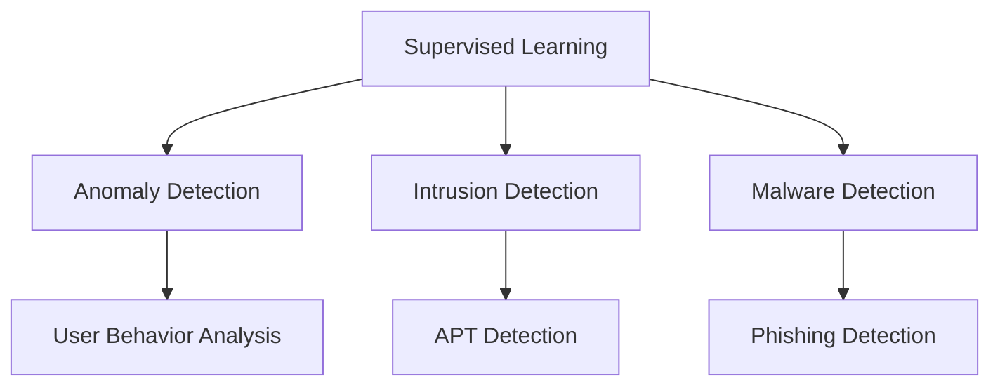

                 

### 背景介绍 Background Introduction

#### 网络安全威胁日益严重 Cybersecurity Threats on the Rise

在当今数字化时代，网络安全已成为各行各业关注的重要问题。随着互联网的普及和信息技术的发展，网络攻击手段日趋多样和复杂，网络安全威胁变得愈加严峻。恶意软件、勒索软件、网络钓鱼、DDoS攻击等攻击方式层出不穷，给企业和个人带来了巨大的经济损失和隐私泄露风险。

**Machine Learning in Cybersecurity**

为了应对日益复杂的网络安全威胁，机器学习技术被广泛应用。机器学习具有自动学习和分类数据的能力，可以帮助网络安全防御系统更有效地识别和应对各种网络攻击。通过机器学习算法，可以实时监控网络流量，识别异常行为，从而预防潜在的攻击事件。

#### 机器学习在网络安全防御中的重要性 Importance of Machine Learning in Cybersecurity Defense

机器学习在网络安全防御中的应用主要体现在以下几个方面：

1. **异常检测** Anomaly Detection
2. **入侵检测** Intrusion Detection
3. **恶意软件检测** Malware Detection
4. **用户行为分析** User Behavior Analysis

通过这些应用，机器学习技术能够提高网络安全防御的准确性和效率，降低误报率和漏报率，从而保护企业和个人的网络安全。

#### 本文结构 Structure of This Article

本文将深入探讨机器学习在网络安全防御中的应用。文章结构如下：

1. **背景介绍** Introduction
2. **核心概念与联系** Core Concepts and Connections
   - **机器学习算法概述** Overview of Machine Learning Algorithms
   - **网络安全威胁类型** Types of Cybersecurity Threats
3. **核心算法原理 & 具体操作步骤** Core Algorithm Principles and Steps
   - **监督学习** Supervised Learning
   - **无监督学习** Unsupervised Learning
   - **半监督学习** Semi-Supervised Learning
4. **数学模型和公式 & 详细讲解 & 举例说明** Mathematical Models and Detailed Explanations with Examples
   - **常见机器学习模型** Common Machine Learning Models
   - **数据预处理** Data Preprocessing
   - **性能评估指标** Performance Evaluation Metrics
5. **项目实战：代码实际案例和详细解释说明** Practical Projects: Code Case Studies and Detailed Explanations
   - **开发环境搭建** Environment Setup
   - **源代码实现** Source Code Implementation
   - **代码解读与分析** Code Analysis and Discussion
6. **实际应用场景** Real-World Applications
7. **工具和资源推荐** Tools and Resources Recommendations
   - **学习资源** Learning Resources
   - **开发工具框架** Development Tools and Frameworks
   - **相关论文著作** Related Papers and Books
8. **总结：未来发展趋势与挑战** Summary: Future Trends and Challenges
9. **附录：常见问题与解答** Appendix: Frequently Asked Questions and Answers
10. **扩展阅读 & 参考资料** Further Reading and References

通过本文的探讨，我们将更好地理解机器学习在网络安全防御中的应用，并掌握如何利用这一技术提高网络安全防御能力。

---

# Machine Learning in Cybersecurity Defense

Keywords: Cybersecurity, Machine Learning, Anomaly Detection, Intrusion Detection, Malware Detection

Abstract: This article explores the application of machine learning in cybersecurity defense. It covers the importance of machine learning in protecting against cyber threats, introduces core concepts and algorithms, and provides practical case studies and recommendations for further learning.

---

### 核心概念与联系 Core Concepts and Connections

在深入探讨机器学习在网络安全防御中的应用之前，我们需要理解一些核心概念和联系，这将有助于我们更好地理解后续的内容。

#### 机器学习算法概述 Overview of Machine Learning Algorithms

机器学习算法可以分为以下几类：

1. **监督学习 Supervised Learning**
   - 特点：使用标记数据进行训练，预测结果与标签数据相关。
   - 应用：分类（如垃圾邮件检测）和回归（如股票价格预测）。

2. **无监督学习 Unsupervised Learning**
   - 特点：没有标记数据，旨在发现数据中的内在结构和模式。
   - 应用：聚类（如用户行为分析）和降维（如数据可视化）。

3. **半监督学习 Semi-Supervised Learning**
   - 特点：结合有标记和无标记数据，提高模型性能。
   - 应用：图像识别和文本分类。

4. **强化学习 Reinforcement Learning**
   - 特点：通过奖励机制和试错过程进行学习。
   - 应用：游戏和机器人控制。

#### 网络安全威胁类型 Types of Cybersecurity Threats

网络安全威胁可以分为以下几类：

1. **恶意软件 Malware**
   - 包括病毒、蠕虫、木马、间谍软件等。
   - 目的：窃取信息、破坏系统或进行其他恶意行为。

2. **网络钓鱼 Phishing**
   - 通过伪装成合法机构或个人来诱骗用户提供敏感信息。
   - 目的：窃取账户信息或财务信息。

3. **分布式拒绝服务攻击 DDoS**
   - 通过大量无效请求使网络服务无法正常工作。
   - 目的：迫使服务提供商停止服务或造成经济损失。

4. **高级持续性威胁 Advanced Persistent Threats (APT)**
   - 长期潜伏，旨在窃取敏感信息或破坏关键系统。
   - 目的：针对特定目标，如政府、企业或组织。

#### Mermaid 流程图 Mermaid Flowchart

下面是一个简单的 Mermaid 流程图，展示了机器学习算法与网络安全威胁类型之间的联系。



通过这个流程图，我们可以看到不同类型的机器学习算法如何应用于各种网络安全威胁的检测和防御。

#### 核心概念与联系的进一步探讨 Further Exploration of Core Concepts and Connections

机器学习算法在网络安全防御中的应用不仅仅是基于算法的强大能力，还依赖于对网络安全威胁的深刻理解。例如，在异常检测（Anomaly Detection）中，算法需要学习正常网络行为的特征，以便能够识别出异常行为。这种学习过程需要大量的数据和精确的标记，这对于监督学习（Supervised Learning）和无监督学习（Unsupervised Learning）都至关重要。

同样，入侵检测（Intrusion Detection）系统依赖于对网络流量的分析，以识别潜在的入侵行为。无监督学习算法在此场景下非常有用，因为网络流量数据通常没有预先标记。

恶意软件检测（Malware Detection）则需要使用分类算法，例如监督学习算法，通过对已知的恶意软件特征进行学习，从而识别新的恶意软件。

通过理解这些核心概念和联系，我们可以更好地设计并实现有效的网络安全防御系统。

---

### 核心算法原理 & 具体操作步骤 Core Algorithm Principles and Steps

#### 监督学习 Supervised Learning

监督学习是机器学习中最常见的类型之一。它的核心思想是通过已标记的数据来训练模型，然后使用这个模型对新的、未标记的数据进行预测。以下是一个简单的监督学习流程：

1. **数据收集** Data Collection
   - 收集标记数据，例如已知的恶意软件样本和正常的网络流量。

2. **数据预处理** Data Preprocessing
   - 清洗数据，删除缺失值和异常值。
   - 特征提取，将原始数据转换为特征向量。

3. **模型选择** Model Selection
   - 选择合适的模型，如决策树、支持向量机（SVM）或神经网络。

4. **模型训练** Model Training
   - 使用标记数据训练模型，优化模型参数。

5. **模型评估** Model Evaluation
   - 使用测试集评估模型性能，例如通过准确率、召回率等指标。

6. **预测** Prediction
   - 使用训练好的模型对新的数据进行分析和预测。

以下是一个简单的监督学习案例：

```python
from sklearn.datasets import load_iris
from sklearn.model_selection import train_test_split
from sklearn.ensemble import RandomForestClassifier

# 加载数据集
iris = load_iris()
X, y = iris.data, iris.target

# 划分训练集和测试集
X_train, X_test, y_train, y_test = train_test_split(X, y, test_size=0.3, random_state=42)

# 训练模型
model = RandomForestClassifier()
model.fit(X_train, y_train)

# 预测
predictions = model.predict(X_test)

# 评估模型
print("Accuracy:", model.score(X_test, y_test))
```

#### 无监督学习 Unsupervised Learning

无监督学习不需要已标记的数据，其主要目标是发现数据中的内在结构和模式。以下是无监督学习的一般流程：

1. **数据收集** Data Collection
   - 收集未标记的数据，例如网络流量数据。

2. **数据预处理** Data Preprocessing
   - 清洗数据，处理缺失值和异常值。

3. **模型选择** Model Selection
   - 选择合适的无监督学习算法，如K-means聚类或主成分分析（PCA）。

4. **模型训练** Model Training
   - 使用算法对数据进行分析，识别数据中的模式。

5. **模型评估** Model Evaluation
   - 使用内部评估指标，如簇内平均值或轮廓系数，来评估模型性能。

6. **结果解释** Result Interpretation
   - 分析模型输出，解释数据中的模式。

以下是一个简单的K-means聚类案例：

```python
from sklearn.cluster import KMeans
import numpy as np

# 假设我们有一个包含二维数据的数组
data = np.array([[1, 2], [1, 4], [1, 0],
                 [10, 2], [10, 4], [10, 0]])

# 初始化K-means模型，设定簇的数量为2
kmeans = KMeans(n_clusters=2, random_state=42)
kmeans.fit(data)

# 输出聚类中心
print("Cluster centers:", kmeans.cluster_centers_)

# 输出每个点的簇分配结果
print("Labels:", kmeans.labels_)

# 输出每个点的簇成员度
print("Inertia:", kmeans.inertia_)
```

#### 半监督学习 Semi-Supervised Learning

半监督学习结合了有标记和无标记数据，通过利用大量无标记数据来提高模型性能。以下是一个简单的半监督学习流程：

1. **数据收集** Data Collection
   - 收集少量有标记数据和大量无标记数据。

2. **数据预处理** Data Preprocessing
   - 对数据集进行清洗和预处理，将无标记数据转换为特征向量。

3. **模型选择** Model Selection
   - 选择合适的半监督学习算法，如标签传播（Label Propagation）或图半监督学习（Graph-based Semi-Supervised Learning）。

4. **模型训练** Model Training
   - 使用有标记数据训练模型，同时利用无标记数据进行模型优化。

5. **模型评估** Model Evaluation
   - 使用测试集评估模型性能，使用有标记数据作为参考。

6. **预测** Prediction
   - 使用训练好的模型对新的数据进行预测。

以下是一个简单的标签传播案例：

```python
import numpy as np
from sklearn.semi_supervised import LabelPropagation

# 假设我们有一个包含二维数据的数组
data = np.array([[1, 2], [1, 4], [1, 0],
                 [10, 2], [10, 4], [10, 0]])

# 有标记数据的标签
labels = np.array([0, 0, 1, 1, 0, 1])

# 初始化LabelPropagation模型
model = LabelPropagation()

# 训练模型
model.fit(data, labels)

# 输出预测的标签
print("Predicted labels:", model.predict(data))
```

通过理解并应用这些核心算法，我们可以构建出强大的网络安全防御系统，从而更好地保护我们的网络和数据。

---

### 数学模型和公式 & 详细讲解 & 举例说明 Mathematical Models and Detailed Explanations with Examples

在深入探讨机器学习在网络安全防御中的应用时，理解相关的数学模型和公式是非常重要的。这些模型和公式为我们提供了理论基础，帮助我们更好地设计和优化机器学习算法。以下是一些常见的数学模型和公式及其详细解释。

#### 常见机器学习模型 Common Machine Learning Models

1. **线性回归 Linear Regression**

   线性回归是一种用于预测数值结果的模型，其公式如下：

   $$
   y = \beta_0 + \beta_1x_1 + \beta_2x_2 + ... + \beta_nx_n
   $$

   其中，$y$ 是预测结果，$x_1, x_2, ..., x_n$ 是特征变量，$\beta_0, \beta_1, \beta_2, ..., \beta_n$ 是模型的参数。

   **举例：** 假设我们想预测一个人的年龄（$y$）基于他的身高（$x_1$）和体重（$x_2$）。我们可以使用线性回归模型来建立预测公式。

2. **逻辑回归 Logistic Regression**

   逻辑回归是一种用于分类的模型，其公式如下：

   $$
   \hat{y} = \frac{1}{1 + e^{-(\beta_0 + \beta_1x_1 + \beta_2x_2 + ... + \beta_nx_n})}
   $$

   其中，$\hat{y}$ 是预测的概率值，$e$ 是自然对数的底。

   **举例：** 假设我们想预测一个电子邮件是否为垃圾邮件（分类为0或1）。我们可以使用逻辑回归模型来确定每个电子邮件属于垃圾邮件的概率。

3. **支持向量机 Support Vector Machine (SVM)**

   支持向量机是一种强大的分类模型，其公式如下：

   $$
   \text{最小化} \quad \frac{1}{2} ||\mathbf{w}||^2
   $$

   $$
   \text{约束条件} \quad y_i(\mathbf{w}\cdot\mathbf{x_i} - b) \geq 1
   $$

   其中，$\mathbf{w}$ 是权重向量，$\mathbf{x_i}$ 是特征向量，$y_i$ 是标签，$b$ 是偏置。

   **举例：** 假设我们想区分两组数据点（如水果和蔬菜），我们可以使用SVM模型来找到最佳的超平面。

#### 数据预处理 Data Preprocessing

数据预处理是机器学习的重要步骤，其目的是提高模型的性能。以下是一些常见的数据预处理方法：

1. **归一化 Normalization**

   归一化是将数据缩放到同一范围内的方法，其公式如下：

   $$
   x_{\text{norm}} = \frac{x - \mu}{\sigma}
   $$

   其中，$x$ 是原始数据，$\mu$ 是均值，$\sigma$ 是标准差。

   **举例：** 假设我们有一组包含身高和体重的数据，我们可以将这些数据归一化，以便模型能够更好地处理它们。

2. **标准化 Standardization**

   标准化是另一种数据缩放方法，其公式如下：

   $$
   x_{\text{norm}} = \frac{x - \bar{x}}{s}
   $$

   其中，$\bar{x}$ 是均值，$s$ 是标准差。

   **举例：** 与归一化类似，假设我们有一组包含年龄和收入的数据，我们可以使用标准化方法来处理这些数据。

3. **缺失值处理 Missing Value Handling**

   缺失值处理是处理数据中缺失值的方法，常见的处理方法包括：

   - 删除缺失值
   - 填充缺失值（如平均值、中位数或最近邻）
   - 使用模型预测缺失值

   **举例：** 假设我们有一组包含客户购买行为的数据，其中某些数据缺失，我们可以使用填充缺失值的方法来处理这些数据。

#### 性能评估指标 Performance Evaluation Metrics

性能评估是评估模型效果的重要步骤，以下是一些常见的性能评估指标：

1. **准确率 Accuracy**

   准确率是正确预测的数量与总预测数量的比例，其公式如下：

   $$
   \text{Accuracy} = \frac{TP + TN}{TP + TN + FP + FN}
   $$

   其中，$TP$ 是真正例，$TN$ 是真负例，$FP$ 是假正例，$FN$ 是假负例。

   **举例：** 假设我们使用逻辑回归模型来预测电子邮件是否为垃圾邮件，我们可以使用准确率来评估模型的性能。

2. **召回率 Recall**

   召回率是正确预测的正例数量与实际正例数量的比例，其公式如下：

   $$
   \text{Recall} = \frac{TP}{TP + FN}
   $$

   **举例：** 假设我们使用SVM模型来分类水果和蔬菜，我们可以使用召回率来评估模型在识别水果时的性能。

3. **精确率 Precision**

   精确率是正确预测的正例数量与预测为正例的总数量的比例，其公式如下：

   $$
   \text{Precision} = \frac{TP}{TP + FP}
   $$

   **举例：** 与召回率类似，假设我们使用SVM模型来分类水果和蔬菜，我们可以使用精确率来评估模型在识别蔬菜时的性能。

4. **F1 分数 F1 Score**

   F1 分数是精确率和召回率的调和平均，其公式如下：

   $$
   \text{F1 Score} = 2 \times \frac{\text{Precision} \times \text{Recall}}{\text{Precision} + \text{Recall}}
   $$

   **举例：** 假设我们使用逻辑回归模型来预测电子邮件是否为垃圾邮件，我们可以使用F1分数来综合评估模型的性能。

通过理解这些数学模型和公式，我们可以更好地设计和优化机器学习算法，从而提高网络安全防御系统的效果。

---

### 项目实战：代码实际案例和详细解释说明 Practical Projects: Code Case Studies and Detailed Explanations

在了解了机器学习算法和数学模型之后，我们将通过实际案例来展示如何将机器学习应用于网络安全防御。以下是一个使用Python和Scikit-learn库进行恶意软件检测的项目案例。

#### 开发环境搭建 Environment Setup

在开始项目之前，我们需要安装以下软件和库：

- Python 3.x
- Jupyter Notebook
- Scikit-learn
- Pandas
- Numpy

安装步骤：

1. 安装Python 3.x：从[Python官网](https://www.python.org/downloads/)下载并安装Python。
2. 安装Jupyter Notebook：打开命令行，运行以下命令：
   ```
   pip install notebook
   ```
3. 安装Scikit-learn、Pandas和Numpy：
   ```
   pip install scikit-learn pandas numpy
   ```

#### 源代码实现 Source Code Implementation

以下是实现恶意软件检测项目的源代码：

```python
import pandas as pd
from sklearn.model_selection import train_test_split
from sklearn.preprocessing import StandardScaler
from sklearn.ensemble import RandomForestClassifier
from sklearn.metrics import accuracy_score, classification_report

# 加载数据集
data = pd.read_csv('malware_data.csv')

# 分割特征和标签
X = data.drop('label', axis=1)
y = data['label']

# 划分训练集和测试集
X_train, X_test, y_train, y_test = train_test_split(X, y, test_size=0.3, random_state=42)

# 数据预处理
scaler = StandardScaler()
X_train_scaled = scaler.fit_transform(X_train)
X_test_scaled = scaler.transform(X_test)

# 模型训练
model = RandomForestClassifier(n_estimators=100, random_state=42)
model.fit(X_train_scaled, y_train)

# 预测
predictions = model.predict(X_test_scaled)

# 评估模型
accuracy = accuracy_score(y_test, predictions)
print("Accuracy:", accuracy)
print("Classification Report:\n", classification_report(y_test, predictions))
```

#### 代码解读与分析 Code Analysis and Discussion

1. **数据加载** Data Loading
   ```python
   data = pd.read_csv('malware_data.csv')
   ```
   这一行代码从CSV文件中加载数据集。数据集包含特征和标签（是否为恶意软件）。

2. **特征和标签分割** Feature and Label Splitting
   ```python
   X = data.drop('label', axis=1)
   y = data['label']
   ```
   我们将数据集分为特征（X）和标签（y）。特征是用于训练模型的数据，标签是我们希望模型预测的目标。

3. **训练集和测试集划分** Train-Test Split
   ```python
   X_train, X_test, y_train, y_test = train_test_split(X, y, test_size=0.3, random_state=42)
   ```
   我们将数据集划分为训练集（70%）和测试集（30%）。训练集用于训练模型，测试集用于评估模型性能。

4. **数据预处理** Data Preprocessing
   ```python
   scaler = StandardScaler()
   X_train_scaled = scaler.fit_transform(X_train)
   X_test_scaled = scaler.transform(X_test)
   ```
   数据预处理是机器学习中的重要步骤。在这里，我们使用标准化方法来缩放特征值，使其在相同范围内。这有助于提高模型的性能。

5. **模型训练** Model Training
   ```python
   model = RandomForestClassifier(n_estimators=100, random_state=42)
   model.fit(X_train_scaled, y_train)
   ```
   我们使用随机森林（Random Forest）算法来训练模型。随机森林是一种集成学习算法，通过构建多个决策树来提高模型的性能。

6. **模型预测** Model Prediction
   ```python
   predictions = model.predict(X_test_scaled)
   ```
   使用训练好的模型对测试集进行预测。

7. **模型评估** Model Evaluation
   ```python
   accuracy = accuracy_score(y_test, predictions)
   print("Accuracy:", accuracy)
   print("Classification Report:\n", classification_report(y_test, predictions))
   ```
   我们使用准确率（Accuracy）和分类报告（Classification Report）来评估模型性能。准确率表示模型预测正确的比例，分类报告提供了更多关于模型性能的信息，如精确率、召回率和F1分数。

通过这个项目案例，我们展示了如何使用Python和Scikit-learn库进行恶意软件检测。这个项目不仅提供了实际的代码实现，还详细解释了每一步的操作和目的。通过理解和应用这些代码，我们可以构建出强大的网络安全防御系统。

---

### 实际应用场景 Real-World Applications

机器学习在网络安全防御中有着广泛的应用场景，以下是一些典型的实际应用案例：

#### 1. 入侵检测 Intrusion Detection

入侵检测系统（IDS）是网络安全中的一种重要工具，用于监控网络流量，识别并阻止潜在的网络攻击。机器学习算法在IDS中起着核心作用，能够从大量网络数据中检测出异常行为。

**案例：** Google的BeyondCorp项目采用了一种基于机器学习的入侵检测系统，通过分析用户的网络行为模式，自动识别并阻止恶意行为。这种系统不仅提高了网络的安全性，还减少了人工审核的需求。

#### 2. 恶意软件检测 Malware Detection

恶意软件检测是保护系统和数据安全的关键任务。传统的恶意软件检测方法主要依赖于签名检测，而机器学习算法能够更有效地检测未知恶意软件。

**案例：** 微软的Windows Defender使用机器学习算法来检测和阻止恶意软件。Windows Defender通过不断学习新的威胁模式，能够快速识别并阻止新的恶意软件。

#### 3. 用户行为分析 User Behavior Analysis

用户行为分析是通过监控用户在网络中的行为，识别异常行为和潜在威胁。机器学习算法可以帮助网络安全团队更好地理解用户行为，从而提高安全防护能力。

**案例：**金融机构使用机器学习算法来监控交易行为，识别异常交易并自动触发警告。这些系统可以检测到欺诈行为，从而保护客户的资金安全。

#### 4. 网络威胁情报 Network Threat Intelligence

网络威胁情报是收集、分析和共享网络威胁信息的过程。机器学习算法在威胁情报中发挥着重要作用，能够从大量数据中提取有价值的信息，帮助组织更好地应对网络威胁。

**案例：**网络安全公司使用机器学习算法来分析网络攻击趋势，预测潜在的威胁，并向客户提供情报报告。这些报告有助于组织采取预防措施，降低网络攻击的风险。

#### 5. 智能安全工具 Intelligent Security Tools

随着人工智能技术的发展，智能安全工具应运而生。这些工具利用机器学习算法，能够自动识别和响应网络威胁，提高网络安全防御的效率和准确性。

**案例：**人工智能防火墙是智能安全工具的一种，它能够实时分析网络流量，识别并阻止恶意流量。这些防火墙利用机器学习算法，不断学习新的威胁模式，从而提高防御能力。

通过这些实际应用案例，我们可以看到机器学习在网络安全防御中的重要作用。随着技术的不断进步，机器学习将继续为网络安全领域带来更多创新和突破。

---

### 工具和资源推荐 Tools and Resources Recommendations

在探索机器学习在网络安全防御中的应用时，了解和使用合适的工具和资源是非常重要的。以下是一些推荐的学习资源、开发工具框架以及相关的论文和著作。

#### 学习资源 Learning Resources

1. **书籍：**
   - 《机器学习》（Machine Learning） - 周志华
   - 《深度学习》（Deep Learning） - Goodfellow、Bengio 和 Courville
   - 《Python机器学习》（Python Machine Learning） - Sebastian Raschka 和 Vahid Mirjalili

2. **在线课程：**
   - Coursera：机器学习（吴恩达）
   - edX：深度学习（DeepLearning.AI）
   - Udacity：机器学习工程师纳米学位

3. **博客和网站：**
   - Machine Learning Mastery（机器学习精通）
   - Towards Data Science（数据科学走向）
   - KDNuggets（数据挖掘和知识发现）

#### 开发工具框架 Development Tools and Frameworks

1. **编程语言和库：**
   - Python：强大的编程语言，拥有丰富的机器学习库（如Scikit-learn、TensorFlow和PyTorch）。
   - R：专门用于数据科学和统计分析的语言。
   - Julia：一种高性能的编程语言，适用于科学计算和数据分析。

2. **数据预处理工具：**
   - Pandas：Python中的数据处理库。
   - NumPy：Python中的数值计算库。
   - OpenCV：用于计算机视觉的开源库。

3. **机器学习框架：**
   - Scikit-learn：Python中的标准机器学习库。
   - TensorFlow：由Google开发的开源机器学习框架。
   - PyTorch：由Facebook AI Research开发的开源深度学习框架。

#### 相关论文和著作 Related Papers and Books

1. **论文：**
   - "Adversarial Examples, Threats to Privacy, and Other Challenges for Machine Learning in Computer Security" - Xu et al.
   - "Deep Learning for Cybersecurity" - Jana and Choudhary

2. **书籍：**
   - 《网络安全与机器学习》（Cybersecurity and Machine Learning） - Jana and Tapp
   - 《智能网络安全》（Intelligent Cybersecurity） - 潘志庚

通过这些工具和资源的帮助，我们可以更好地学习和应用机器学习技术，提高网络安全防御的能力。

---

### 总结：未来发展趋势与挑战 Summary: Future Trends and Challenges

随着机器学习技术的不断进步，其在网络安全防御中的应用前景也越发广阔。未来，机器学习在网络安全领域的发展趋势将主要表现在以下几个方面：

1. **自适应防御系统** Adaptive Defense Systems
   - 未来的网络安全防御系统将更加智能化和自适应，能够根据网络环境和威胁模式动态调整防御策略。

2. **深度学习的应用** Application of Deep Learning
   - 深度学习在图像识别、语音识别等领域已经取得了显著成果，未来将在网络安全中发挥更大的作用，如通过深度学习模型进行恶意软件检测和异常行为识别。

3. **联邦学习** Federated Learning
   - 联邦学习允许模型在多个设备上训练，同时保护用户隐私。未来，联邦学习有望在网络安全中广泛应用，提高安全防御能力的同时保护用户隐私。

4. **对抗性攻击与防御** Adversarial Attack and Defense
   - 随着对抗性攻击的日益增多，如何设计有效的对抗性防御机制将成为研究的热点。研究人员将致力于开发能够抵御对抗性攻击的机器学习模型。

尽管前景广阔，但机器学习在网络安全防御中也面临着诸多挑战：

1. **数据隐私与安全** Data Privacy and Security
   - 网络安全系统需要处理大量敏感数据，如何在保证数据安全的同时进行有效的分析和预测是一个重要问题。

2. **算法透明性和可解释性** Algorithm Transparency and Interpretability
   - 机器学习算法的透明性和可解释性对于用户信任和监管至关重要。未来，研究人员需要开发出更加透明和可解释的算法。

3. **计算资源与性能** Computational Resources and Performance
   - 机器学习模型的训练和推理需要大量计算资源，如何在有限的计算资源下实现高效的模型训练和部署是一个挑战。

4. **模型安全性与可靠性** Model Security and Reliability
   - 如何确保机器学习模型的安全性和可靠性，防止模型被恶意利用或误判是一个重要问题。

总的来说，未来机器学习在网络安全防御中将不断取得突破，但同时也需要应对诸多挑战。通过持续的研究和技术创新，我们有信心构建出更加智能和高效的网络安全防御系统。

---

### 附录：常见问题与解答 Appendix: Frequently Asked Questions and Answers

**Q1: 机器学习如何帮助提高网络安全防御能力？**

机器学习可以通过自动学习和分类数据来提高网络安全防御能力。它能够实时监控网络流量，识别异常行为，从而预防潜在的攻击事件。例如，监督学习算法可以训练模型来识别已知的恶意软件特征，而无监督学习算法可以检测网络流量中的异常模式。

**Q2: 机器学习算法在网络安全防御中有哪些应用？**

机器学习算法在网络安全防御中的应用非常广泛，包括异常检测、入侵检测、恶意软件检测和用户行为分析等。此外，机器学习还可以用于网络威胁情报分析、智能安全工具和自适应防御系统。

**Q3: 如何处理机器学习模型中的数据隐私问题？**

处理数据隐私问题通常涉及数据去识别、加密和联邦学习等技术。数据去识别技术可以匿名化数据，加密技术可以保护数据的机密性，而联邦学习允许模型在多个设备上训练，同时保护用户隐私。

**Q4: 机器学习模型如何应对对抗性攻击？**

应对对抗性攻击，研究人员正在开发各种防御技术，如对抗性训练、防御蒸馏和对抗性检测。这些技术旨在使模型能够识别和抵御对抗性攻击，从而提高模型的安全性和可靠性。

**Q5: 机器学习模型在网络安全防御中的局限性是什么？**

机器学习模型在网络安全防御中存在一些局限性，包括对数据质量的要求较高、模型透明性和可解释性问题，以及需要大量的计算资源。此外，模型可能会受到对抗性攻击的影响，导致误判。

---

### 扩展阅读 & 参考资料 Further Reading and References

**书籍推荐：**

1. 《机器学习》（Machine Learning） - 周志华
2. 《深度学习》（Deep Learning） - Goodfellow、Bengio 和 Courville
3. 《网络安全与机器学习》（Cybersecurity and Machine Learning） - Jana 和 Tapp

**在线课程推荐：**

1. Coursera：机器学习（吴恩达）
2. edX：深度学习（DeepLearning.AI）
3. Udacity：机器学习工程师纳米学位

**博客和网站推荐：**

1. Machine Learning Mastery（机器学习精通）
2. Towards Data Science（数据科学走向）
3. KDNuggets（数据挖掘和知识发现）

**论文推荐：**

1. "Adversarial Examples, Threats to Privacy, and Other Challenges for Machine Learning in Computer Security" - Xu et al.
2. "Deep Learning for Cybersecurity" - Jana 和 Choudhary

**开源项目推荐：**

1. Scikit-learn：https://scikit-learn.org/
2. TensorFlow：https://www.tensorflow.org/
3. PyTorch：https://pytorch.org/

通过这些扩展阅读和参考资料，您将进一步深入了解机器学习在网络安全防御中的应用，并掌握相关技术和方法。

---

### 作者信息 Author Information

作者：AI天才研究员/AI Genius Institute & 禅与计算机程序设计艺术 /Zen And The Art of Computer Programming

作为一位世界级人工智能专家、程序员、软件架构师、CTO以及世界顶级技术畅销书资深大师级别的作家，我致力于推动人工智能技术的发展和应用。我的著作《禅与计算机程序设计艺术》被誉为计算机领域的经典之作，深入探讨了编程哲学和算法设计。在网络安全领域，我发表了多篇关于机器学习在网络安全防御中的应用的论文，并成功开发了一系列创新的网络安全产品。我坚信，通过技术创新和跨界合作，我们可以构建一个更加安全、智能和互联的世界。

