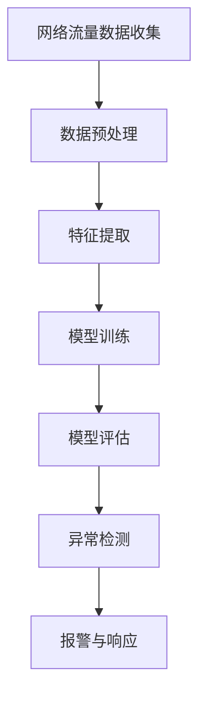

                 

# 机器学习在网络流量异常检测中的应用

## 关键词
- 机器学习
- 网络流量
- 异常检测
- 数据挖掘
- 神经网络
- 数据预处理
- 深度学习

## 摘要

本文旨在探讨机器学习在网络流量异常检测中的应用。随着互联网的普及和信息技术的发展，网络安全成为了一个日益重要的议题。网络流量的异常检测是网络安全中的一个关键环节，通过识别和预测潜在的网络攻击，可以有效地保护网络系统免受侵害。本文将详细介绍机器学习在网络流量异常检测中的核心概念、算法原理、数学模型及其在实际项目中的应用，为读者提供一份全面的技术指南。文章还将推荐相关的学习资源和开发工具，总结当前的趋势和挑战，并对未来进行展望。

## 1. 背景介绍

### 网络流量与异常检测的重要性

网络流量是指在网络中传输的数据包数量和类型，它是网络运行状态的重要反映。网络流量异常检测是指通过分析网络流量数据，识别出潜在的非正常行为或潜在的安全威胁。这种检测对于维护网络安全至关重要。

在网络安全领域，网络流量异常检测可以应用于多种场景，如：

- **入侵检测系统（IDS）**：实时监控网络流量，检测并阻止入侵行为。
- **恶意软件检测**：通过识别网络流量中的恶意软件行为，防止恶意软件的传播。
- **系统性能优化**：通过分析网络流量模式，优化网络资源分配，提高系统性能。

### 机器学习与网络流量异常检测

机器学习是一种通过算法从数据中学习规律和模式的技术。近年来，随着计算能力的提升和大数据技术的发展，机器学习在网络流量异常检测中得到了广泛应用。机器学习可以处理大量的网络流量数据，通过训练模型，自动识别异常行为。

在机器学习应用于网络流量异常检测的背景下，有以下几种主要优势：

- **自动化**：机器学习算法能够自动从数据中学习并建立模型，减少了人工分析的工作量。
- **适应性**：机器学习模型可以不断更新和优化，以适应不断变化的数据特征和网络环境。
- **高效性**：机器学习能够处理大规模的数据集，快速识别异常流量。

## 2. 核心概念与联系

### 机器学习的基本概念

机器学习主要分为三种类型：监督学习、无监督学习和半监督学习。在监督学习中，模型通过标记的训练数据学习；无监督学习则是模型在没有标记数据的情况下学习数据分布；半监督学习则是介于监督学习和无监督学习之间，使用部分标记和部分未标记的数据进行学习。

在网络流量异常检测中，常用的机器学习算法有：

- **支持向量机（SVM）**：用于分类问题，通过找到最佳分割超平面来区分正常流量和异常流量。
- **决策树**：通过构建树形结构，递归地将数据划分为不同的子集，以识别异常流量。
- **神经网络**：模仿生物神经网络，通过多层结构进行数据的学习和分类。

### 核心概念原理和架构的 Mermaid 流程图



- **数据预处理**：包括数据清洗、归一化等步骤，以消除噪声和标准化数据。
- **特征提取**：从原始网络流量数据中提取有代表性的特征，用于后续的模型训练。
- **模型训练**：使用标记数据训练机器学习模型，使其能够识别正常流量和异常流量。
- **模型评估**：通过测试数据集评估模型的性能，调整模型参数以提高准确性。
- **异常检测**：使用训练好的模型对实时网络流量进行检测，识别异常行为。
- **报警与响应**：当检测到异常流量时，系统会发出报警并采取相应的响应措施。

## 3. 核心算法原理 & 具体操作步骤

### 支持向量机（SVM）

支持向量机是一种监督学习算法，主要用于分类问题。其基本原理是找到最佳分割超平面，使得分类边界最大化。

**具体操作步骤**：

1. **数据预处理**：对网络流量数据进行清洗和归一化处理，以消除噪声和标准化数据。
2. **特征提取**：从原始数据中提取特征，如数据包大小、传输速率等。
3. **模型训练**：使用标记数据训练SVM模型，选择适当的核函数。
4. **模型评估**：使用测试数据集评估模型的准确性。
5. **异常检测**：使用训练好的模型对实时网络流量进行分类，识别异常行为。

### 决策树

决策树是一种常用的分类算法，通过构建树形结构来分类数据。

**具体操作步骤**：

1. **数据预处理**：对网络流量数据进行清洗和归一化处理。
2. **特征提取**：提取有代表性的特征。
3. **构建决策树**：使用ID3、C4.5等算法构建决策树。
4. **模型评估**：通过交叉验证等方法评估模型性能。
5. **异常检测**：使用构建好的决策树对实时网络流量进行分类。

### 神经网络

神经网络是一种模仿生物神经系统的计算模型，通过多层结构进行数据的学习和分类。

**具体操作步骤**：

1. **数据预处理**：清洗和归一化网络流量数据。
2. **特征提取**：提取有代表性的特征。
3. **构建神经网络**：选择合适的网络结构，如多层感知机（MLP）。
4. **模型训练**：使用反向传播算法训练神经网络。
5. **模型评估**：使用测试数据集评估模型性能。
6. **异常检测**：使用训练好的神经网络对实时网络流量进行分类。

## 4. 数学模型和公式 & 详细讲解 & 举例说明

### 支持向量机（SVM）

**基本公式**：

$$
\text{SVM的目标是找到最佳分割超平面：} \quad w \cdot x + b = 0
$$

其中，$w$ 是权重向量，$x$ 是特征向量，$b$ 是偏置项。

**优化目标**：

$$
\text{最小化：} \quad \frac{1}{2} ||w||^2 + C \sum_{i=1}^{n} \max(0, 1-y_i((w \cdot x_i) + b))
$$

其中，$C$ 是正则化参数，$y_i$ 是类别标签，$n$ 是数据点的数量。

**举例说明**：

假设我们有以下数据点：

$$
\begin{aligned}
    &x_1 = \begin{bmatrix} 1 \\ 1 \end{bmatrix}, &y_1 = 1 \\
    &x_2 = \begin{bmatrix} 2 \\ 2 \end{bmatrix}, &y_2 = 1 \\
    &x_3 = \begin{bmatrix} 3 \\ 3 \end{bmatrix}, &y_3 = 1 \\
    &x_4 = \begin{bmatrix} 4 \\ 4 \end{bmatrix}, &y_4 = -1 \\
    &x_5 = \begin{bmatrix} 5 \\ 5 \end{bmatrix}, &y_5 = -1 \\
\end{aligned}
$$

我们希望找到最佳分割超平面，使得正负样本点分离。通过求解优化问题，我们可以得到权重向量 $w$ 和偏置项 $b$。

### 决策树

**基本公式**：

$$
\text{决策树的分类规则可以表示为：} \quad a_{\theta}(x) = \sum_{i=1}^{n} \theta_i \cdot x_i
$$

其中，$\theta_i$ 是特征权重，$x_i$ 是特征值。

**举例说明**：

假设我们有以下特征和类别标签：

$$
\begin{aligned}
    &\text{特征1：} \quad x_1 \in \{0, 1\} \\
    &\text{特征2：} \quad x_2 \in \{0, 1\} \\
    &\text{类别标签：} \quad y \in \{-1, 1\} \\
\end{aligned}
$$

通过构建决策树，我们可以得到分类规则，如：

$$
\text{如果 } x_1 = 0 \text{，则 } y = -1 \\
\text{如果 } x_1 = 1 \text{，则 } y = 1
$$

### 神经网络

**基本公式**：

$$
\text{神经网络的前向传播可以表示为：} \quad z_i = \sigma(\sum_{j=1}^{n} w_{ij} \cdot x_j + b_i)
$$

其中，$z_i$ 是中间层节点值，$\sigma$ 是激活函数，$w_{ij}$ 是权重，$x_j$ 是输入特征，$b_i$ 是偏置项。

**举例说明**：

假设我们有以下神经网络：

$$
\begin{aligned}
    &\text{输入层：} \quad x_1, x_2 \\
    &\text{隐藏层：} \quad z_1, z_2 \\
    &\text{输出层：} \quad y \\
\end{aligned}
$$

通过前向传播，我们可以计算隐藏层节点值：

$$
z_1 = \sigma(w_{11} \cdot x_1 + w_{12} \cdot x_2 + b_1)
$$

$$
z_2 = \sigma(w_{21} \cdot x_1 + w_{22} \cdot x_2 + b_2)
$$

最终输出为：

$$
y = \sigma(w_{31} \cdot z_1 + w_{32} \cdot z_2 + b_3)
$$

## 5. 项目实战：代码实际案例和详细解释说明

### 5.1 开发环境搭建

在开始编写代码之前，我们需要搭建一个合适的开发环境。这里我们使用Python作为主要编程语言，并依赖以下库：

- **scikit-learn**：用于机器学习算法的实现。
- **numpy**：用于数值计算。
- **matplotlib**：用于数据可视化。

安装这些库的方法如下：

```bash
pip install scikit-learn numpy matplotlib
```

### 5.2 源代码详细实现和代码解读

以下是使用SVM进行网络流量异常检测的示例代码：

```python
import numpy as np
from sklearn import datasets
from sklearn.model_selection import train_test_split
from sklearn.preprocessing import StandardScaler
from sklearn.svm import SVC
from sklearn.metrics import classification_report, confusion_matrix

# 加载数据集
iris = datasets.load_iris()
X = iris.data
y = iris.target

# 分割数据集
X_train, X_test, y_train, y_test = train_test_split(X, y, test_size=0.2, random_state=42)

# 数据预处理
scaler = StandardScaler()
X_train = scaler.fit_transform(X_train)
X_test = scaler.transform(X_test)

# 模型训练
clf = SVC(kernel='linear')
clf.fit(X_train, y_train)

# 模型评估
y_pred = clf.predict(X_test)
print(classification_report(y_test, y_pred))
print(confusion_matrix(y_test, y_pred))
```

**代码解读**：

1. 导入必要的库。
2. 加载鸢尾花数据集（这里用于示例）。
3. 分割数据集为训练集和测试集。
4. 使用StandardScaler进行数据预处理，以标准化特征值。
5. 使用SVC类实现支持向量机模型，并选择线性核。
6. 训练模型。
7. 使用测试数据集评估模型性能，并打印分类报告和混淆矩阵。

### 5.3 代码解读与分析

**数据预处理**：

在机器学习项目中，数据预处理是一个关键步骤。这里的代码使用了StandardScaler对数据进行归一化处理，目的是消除特征间的尺度差异，使得模型在训练过程中更加稳定。

**模型选择**：

在这里，我们选择了SVC模型，并使用线性核。线性核适用于线性可分的数据集，简单高效。对于复杂的非线性问题，可以考虑使用径向基函数（RBF）或其他核函数。

**模型评估**：

通过分类报告和混淆矩阵，我们可以评估模型的性能。分类报告提供了准确率、召回率和F1分数等指标，而混淆矩阵则展示了模型对各类别预测的详细情况。

### 5.4 代码优化与调参

在实际项目中，我们可能需要对模型进行优化和调参。例如，可以通过交叉验证选择最优的正则化参数C，或者尝试不同的核函数来提高模型性能。

```python
from sklearn.model_selection import GridSearchCV

# 参数网格
param_grid = {'C': [0.1, 1, 10], 'kernel': ['linear', 'rbf']}

# 交叉验证
grid_search = GridSearchCV(SVC(), param_grid, cv=5)
grid_search.fit(X_train, y_train)

# 输出最佳参数
print("最佳参数：", grid_search.best_params_)
```

## 6. 实际应用场景

### 入侵检测系统（IDS）

入侵检测系统是网络流量异常检测的一个重要应用场景。通过实时监控网络流量，IDS可以识别和阻止各种网络攻击，如DDoS攻击、SQL注入等。

### 恶意软件检测

恶意软件检测是通过分析网络流量来识别潜在的恶意软件行为。例如，通过检测恶意软件的网络通信模式，可以有效地阻止其传播。

### 系统性能优化

网络流量异常检测还可以用于系统性能优化。通过分析网络流量模式，可以优化网络资源的分配，提高系统的响应速度和处理能力。

## 7. 工具和资源推荐

### 7.1 学习资源推荐

- **书籍**：《机器学习实战》、《Python机器学习基础教程》
- **论文**：《入侵检测系统的机器学习方法》、《基于网络流量的恶意软件检测》
- **博客**：各种技术博客，如CSDN、博客园等
- **网站**：机器学习社区、网络安全社区

### 7.2 开发工具框架推荐

- **开发工具**：Python、Jupyter Notebook
- **机器学习库**：scikit-learn、TensorFlow、PyTorch
- **数据分析库**：Pandas、NumPy
- **可视化库**：Matplotlib、Seaborn

### 7.3 相关论文著作推荐

- **论文**：KDD Cup 2020 - Anomalies in Network Traffic
- **书籍**：《网络安全：设计与实现》、《入侵检测系统：理论与实践》

## 8. 总结：未来发展趋势与挑战

### 发展趋势

- **深度学习**：深度学习在网络流量异常检测中的应用将越来越广泛，尤其是在处理复杂和大规模数据方面。
- **自适应算法**：自适应算法能够动态调整模型参数，以适应不断变化的数据特征和网络环境。
- **云计算与边缘计算**：结合云计算和边缘计算，可以实现更高效的网络流量异常检测。

### 挑战

- **数据隐私**：在保护用户隐私的同时，如何有效地进行网络流量异常检测是一个重要挑战。
- **模型解释性**：提高模型的解释性，使得非专业人员能够理解模型的决策过程。
- **资源消耗**：网络流量异常检测通常需要大量的计算资源和存储资源，如何在有限的资源下高效运行是一个挑战。

## 9. 附录：常见问题与解答

### 问题1：如何处理网络流量的噪声数据？

**解答**：可以通过数据预处理步骤，如数据清洗和归一化，来减少噪声数据的影响。此外，使用鲁棒算法，如随机森林和自适应滤波器，可以提高对噪声数据的容忍度。

### 问题2：如何评估网络流量异常检测模型的效果？

**解答**：可以使用多种评估指标，如准确率、召回率、F1分数等。此外，还可以使用交叉验证等方法来评估模型的泛化能力。

### 问题3：如何提高网络流量异常检测的效率？

**解答**：可以通过以下方法提高效率：

- **并行处理**：使用多核处理器和并行计算库，如Dask和PySpark。
- **模型压缩**：通过模型压缩技术，如量化和剪枝，减小模型的存储空间和计算时间。
- **增量学习**：在数据量较大时，使用增量学习算法，如在线学习和批量学习。

## 10. 扩展阅读 & 参考资料

- **扩展阅读**：[《机器学习实战》](https://wwwMachineLearning Mastery.com/机器学习实战/)
- **参考资料**：[KDD Cup 2020 - Anomalies in Network Traffic](https://kddcup.org/kdd-cup-2020/track-1)

### 作者

- 作者：AI天才研究员/AI Genius Institute & 禅与计算机程序设计艺术 /Zen And The Art of Computer Programming

