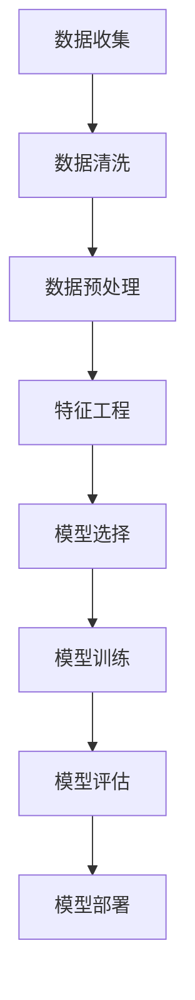

                 

### 背景介绍

随着全球能源消耗的持续增长，如何精准预测能源消耗量成为了一个重要的课题。传统的预测方法往往依赖于历史数据和统计分析，但在面对复杂多变的能源消耗模式时，这些方法往往表现出较低的准确性和可靠性。为了解决这个问题，机器学习（Machine Learning，ML）技术逐渐被引入到能源消耗预测中。机器学习作为一种能够通过数据驱动的方式自动发现规律和模式的技术，为能源消耗预测带来了新的机遇。

能源消耗预测的目的是为了帮助相关决策者更好地进行能源资源的分配和管理，优化能源利用效率，减少能源浪费。具体来说，准确的能源消耗预测可以应用于以下几个方面：

1. **电力系统调度**：通过预测未来的电力需求，电力公司可以更好地规划发电量和电力传输，避免电力短缺或过剩，提高电力系统的运行效率。

2. **能源存储管理**：在太阳能和风能等可再生能源发电过程中，能源的存储和调度是关键。通过预测未来能源消耗量，可以更有效地安排储能设备的充放电，提高能源利用率。

3. **建筑节能**：建筑能耗占全球能源消耗的相当一部分。通过预测建筑物的能源消耗，可以优化能源管理系统，降低能耗，实现节能目标。

4. **交通系统优化**：交通领域的能源消耗同样巨大。通过预测交通流量和出行模式，可以优化公共交通线路和时间安排，降低交通能耗。

然而，能源消耗预测面临诸多挑战，包括数据质量差、数据量庞大、非线性关系复杂等。传统的预测方法难以应对这些挑战，而机器学习技术则通过构建复杂的预测模型，能够从大量数据中提取有用的信息，提高预测精度。下面，我们将深入探讨机器学习在能源消耗预测中的应用，并介绍几种常用的机器学习算法及其优缺点。

### 核心概念与联系

在深入探讨机器学习在能源消耗预测中的应用之前，我们首先需要理解几个核心概念，这些概念包括数据收集、特征工程、模型选择和评估等。以下是这些核心概念的简要介绍，并附上Mermaid流程图以帮助理解各概念之间的联系。

#### 数据收集

数据收集是任何机器学习项目的基础。在能源消耗预测中，收集的数据可能包括历史能耗数据、天气数据、设备状态数据等。数据来源可以包括传感器、历史能耗记录、天气预报服务等。



#### 数据清洗

数据清洗是指处理和清理数据集中的错误、缺失和异常值，以提高数据质量。在能源消耗预测中，数据清洗尤为重要，因为污染的数据会导致模型预测的准确性下降。

#### 数据预处理

数据预处理包括数据标准化、归一化、缺失值填补等步骤。这些步骤的目的是将数据转换成适合机器学习模型输入的形式，以便模型能够更好地学习和预测。

#### 特征工程

特征工程是指从原始数据中提取对预测任务有用的特征。在能源消耗预测中，特征工程的目标是找到与能源消耗量高度相关的特征，以提高预测的准确性。

#### 模型选择

模型选择是指从多种机器学习算法中选择最适合特定预测任务的算法。常见的机器学习算法包括线性回归、决策树、随机森林、支持向量机、神经网络等。

#### 模型训练

模型训练是指使用已收集的数据集对机器学习模型进行训练。模型训练的目标是找到一组参数，使得模型在训练数据上的预测误差最小。

#### 模型评估

模型评估是指使用测试数据集评估模型的表现。常用的评估指标包括准确率、召回率、F1分数等。通过模型评估，我们可以确定模型的预测精度和可靠性。

#### 模型部署

模型部署是指将训练好的模型应用到实际场景中，进行实时预测。在能源消耗预测中，模型部署可以帮助企业实时调整能源使用策略，优化能源管理。

通过上述核心概念的介绍和Mermaid流程图，我们可以看到机器学习在能源消耗预测中的应用是一个复杂但富有成效的过程，涉及到多个步骤和环节。在下一节中，我们将详细介绍几种常用的机器学习算法，包括其原理、优缺点以及在实际应用中的具体操作步骤。

#### 核心算法原理 & 具体操作步骤

在能源消耗预测中，选择合适的机器学习算法是关键。以下是几种常用的机器学习算法，包括其原理、优缺点以及在实际应用中的具体操作步骤。

##### 1. 线性回归

线性回归是最简单的机器学习算法之一，它基于线性模型来预测数值型目标变量。线性回归模型的假设是目标变量与输入特征之间存在线性关系。

**原理：**
线性回归模型通过最小化目标变量与预测变量之间的误差平方和来拟合数据。具体来说，线性回归模型可以表示为：

$$
y = \beta_0 + \beta_1x_1 + \beta_2x_2 + \ldots + \beta_nx_n
$$

其中，$y$是目标变量，$x_1, x_2, \ldots, x_n$是输入特征，$\beta_0, \beta_1, \beta_2, \ldots, \beta_n$是模型参数。

**优点：**
- 实现简单，易于理解和解释。
- 计算效率高，适用于大规模数据集。

**缺点：**
- 假设目标变量与输入特征之间必须是线性关系，这在实际中往往不成立。
- 对于非线性问题，线性回归的效果较差。

**具体操作步骤：**
1. 数据预处理：包括数据标准化、缺失值填补等。
2. 特征选择：选择对目标变量有显著影响的特征。
3. 模型训练：使用最小二乘法拟合线性模型。
4. 模型评估：使用均方误差（MSE）等指标评估模型性能。
5. 模型部署：将训练好的模型应用到实际预测中。

##### 2. 决策树

决策树是一种基于树形结构来预测目标变量的算法。决策树通过一系列规则将数据集分割成多个子集，每个子集对应一个预测结果。

**原理：**
决策树通过递归分割数据集，在每个分割点选择具有最高信息增益的特征。具体来说，决策树可以表示为：

```
if feature1 <= threshold1 then
    if feature2 <= threshold2 then
        return class1
    else
        return class2
    end
else
    if feature3 <= threshold3 then
        return class3
    else
        return class4
    end
end
```

**优点：**
- 易于理解和解释。
- 对缺失值和异常值不敏感。
- 可处理非线性数据。

**缺点：**
- 易于过拟合，特别是在数据量较小的情况下。
- 计算复杂度较高，特别是在树结构较大时。

**具体操作步骤：**
1. 数据预处理：包括数据标准化、缺失值填补等。
2. 特征选择：选择对目标变量有显著影响的特征。
3. 决策树构建：使用信息增益或其他指标选择最佳分割点。
4. 模型评估：使用交叉验证等指标评估模型性能。
5. 模型剪枝：通过剪枝减少过拟合。
6. 模型部署：将训练好的模型应用到实际预测中。

##### 3. 随机森林

随机森林是一种基于决策树的集成学习方法。随机森林通过构建多个决策树，并使用投票或平均的方式合并预测结果。

**原理：**
随机森林通过随机选择特征子集和随机分割点来构建多个决策树，然后使用这些决策树的组合进行预测。具体来说，随机森林可以表示为：

$$
f(x) = \frac{1}{m} \sum_{i=1}^{m} h(x; \theta_i)
$$

其中，$h(x; \theta_i)$是第$i$棵决策树的预测结果，$m$是决策树的数量。

**优点：**
- 集成了多个决策树，具有很好的泛化能力。
- 对噪声和异常值有较强的鲁棒性。
- 可处理非线性数据和缺失值。

**缺点：**
- 计算复杂度高，特别是在树结构较大和数量较多时。
- 特征选择较为重要，可能需要大量的特征工程。

**具体操作步骤：**
1. 数据预处理：包括数据标准化、缺失值填补等。
2. 特征选择：选择对目标变量有显著影响的特征。
3. 决策树构建：使用随机选择特征子集和分割点。
4. 集成预测：使用投票或平均的方式合并预测结果。
5. 模型评估：使用交叉验证等指标评估模型性能。
6. 模型部署：将训练好的模型应用到实际预测中。

##### 4. 支持向量机

支持向量机是一种基于最大间隔分类的监督学习算法。支持向量机通过寻找一个超平面，将不同类别的数据点尽可能分开。

**原理：**
支持向量机通过求解一个优化问题来找到最优超平面。具体来说，支持向量机可以表示为：

$$
\min_{\beta, \beta_0} \frac{1}{2} \sum_{i=1}^{n} (\beta^T x_i - y_i)^2
$$

其中，$x_i$是输入特征，$y_i$是目标变量，$\beta$是超平面参数。

**优点：**
- 在高维空间中表现优秀，具有很好的泛化能力。
- 可处理非线性数据和复杂关系。

**缺点：**
- 计算复杂度较高，特别是当数据量较大时。
- 对特征的选择较为敏感。

**具体操作步骤：**
1. 数据预处理：包括数据标准化、缺失值填补等。
2. 特征选择：选择对目标变量有显著影响的特征。
3. 支持向量机训练：使用拉格朗日乘数法求解最优超平面。
4. 模型评估：使用交叉验证等指标评估模型性能。
5. 模型部署：将训练好的模型应用到实际预测中。

##### 5. 神经网络

神经网络是一种基于人脑神经元连接结构的机器学习算法。神经网络通过多层非线性变换来学习和预测数据。

**原理：**
神经网络由多个层次组成，包括输入层、隐藏层和输出层。每个层次由多个神经元组成，神经元之间通过权重连接。具体来说，神经网络可以表示为：

$$
a_{l+1} = \sigma(W_{l+1} a_l + b_{l+1})
$$

其中，$a_l$是第$l$层的激活值，$\sigma$是激活函数，$W_{l+1}$和$b_{l+1}$分别是连接权重和偏置。

**优点：**
- 能够处理复杂非线性关系。
- 具有很好的泛化能力。
- 可自动进行特征提取。

**缺点：**
- 需要大量的数据和计算资源。
- 过拟合问题较为严重。

**具体操作步骤：**
1. 数据预处理：包括数据标准化、缺失值填补等。
2. 特征选择：选择对目标变量有显著影响的特征。
3. 网络结构设计：确定输入层、隐藏层和输出层的神经元数量。
4. 模型训练：使用反向传播算法训练网络。
5. 模型评估：使用交叉验证等指标评估模型性能。
6. 模型部署：将训练好的模型应用到实际预测中。

通过以上对几种常用机器学习算法的详细介绍，我们可以看到每种算法都有其独特的原理和应用场景。在实际应用中，选择合适的算法需要考虑数据特点、预测目标以及计算资源等因素。在下一节中，我们将深入探讨数学模型和公式，帮助读者更好地理解机器学习算法在实际应用中的数学基础。

### 数学模型和公式 & 详细讲解 & 举例说明

在探讨机器学习算法时，理解其背后的数学模型和公式是非常重要的。本节将详细讲解一些关键数学概念和公式，并举例说明这些公式在实际应用中的运用。

##### 1. 线性回归模型

线性回归模型是机器学习中最为基础的模型之一，其数学公式如下：

$$
y = \beta_0 + \beta_1x_1 + \beta_2x_2 + \ldots + \beta_nx_n
$$

其中，$y$是目标变量，$x_1, x_2, \ldots, x_n$是输入特征，$\beta_0, \beta_1, \beta_2, \ldots, \beta_n$是模型参数。

**举例说明：**

假设我们有一个简单的线性回归模型，目标是预测房屋的价格。输入特征包括房屋的面积（$x_1$）和房龄（$x_2$）。目标变量是房屋的价格（$y$）。我们可以使用以下公式来预测价格：

$$
y = \beta_0 + \beta_1x_1 + \beta_2x_2
$$

通过最小化预测值与实际值之间的误差平方和，我们可以得到最优的参数$\beta_0, \beta_1, \beta_2$。

##### 2. 决策树模型

决策树模型的公式相对较为复杂，因为它涉及到多个条件的组合。决策树可以表示为一系列条件的组合，每个条件对应一个分割点。

$$
\begin{align*}
& if \ feature_1 \leq \ threshold_1 \ then \\
& \quad if \ feature_2 \leq \ threshold_2 \ then \ return \ class_1 \\
& \quad else \ return \ class_2 \\
& else \\
& \quad if \ feature_3 \leq \ threshold_3 \ then \ return \ class_3 \\
& \quad else \ return \ class_4 \\
\end{align*}
$$

**举例说明：**

假设我们有一个决策树模型，用于分类邮件是否为垃圾邮件。输入特征包括邮件的发送者、邮件主题和邮件内容。每个特征都有多个可能的取值。我们可以使用决策树公式来预测邮件是否为垃圾邮件。

##### 3. 随机森林模型

随机森林是一种基于决策树的集成学习方法。其数学公式可以表示为：

$$
f(x) = \frac{1}{m} \sum_{i=1}^{m} h(x; \theta_i)
$$

其中，$h(x; \theta_i)$是第$i$棵决策树的预测结果，$m$是决策树的数量。

**举例说明：**

假设我们有一个随机森林模型，用于分类邮件是否为垃圾邮件。这个模型由10棵决策树组成。每棵决策树对邮件进行分类，然后随机森林通过投票或平均的方式得到最终预测结果。

##### 4. 支持向量机模型

支持向量机（SVM）是一种基于最大间隔分类的模型，其数学公式可以表示为：

$$
\min_{\beta, \beta_0} \frac{1}{2} \sum_{i=1}^{n} (\beta^T x_i - y_i)^2
$$

其中，$x_i$是输入特征，$y_i$是目标变量，$\beta$是超平面参数。

**举例说明：**

假设我们有一个SVM模型，用于分类邮件是否为垃圾邮件。这个模型的目的是找到一个超平面，将垃圾邮件和非垃圾邮件分开。通过最小化预测值与实际值之间的误差平方和，我们可以得到最优的超平面参数$\beta$。

##### 5. 神经网络模型

神经网络是一种基于多层非线性变换的模型，其数学公式可以表示为：

$$
a_{l+1} = \sigma(W_{l+1} a_l + b_{l+1})
$$

其中，$a_l$是第$l$层的激活值，$\sigma$是激活函数，$W_{l+1}$和$b_{l+1}$分别是连接权重和偏置。

**举例说明：**

假设我们有一个神经网络模型，用于分类邮件是否为垃圾邮件。这个模型包括输入层、隐藏层和输出层。输入层接收邮件的各个特征，隐藏层进行非线性变换，输出层给出分类结果。

通过以上对几种常见机器学习算法的数学模型和公式的详细讲解，我们可以看到每个模型都有其独特的数学基础。在实际应用中，理解这些模型和公式可以帮助我们更好地设计和优化预测算法。在下一节中，我们将通过一个实际项目实战案例，展示如何使用机器学习算法进行能源消耗预测。

### 项目实战：代码实际案例和详细解释说明

在本节中，我们将通过一个实际项目实战案例，展示如何使用Python和Scikit-learn库进行能源消耗预测。我们将详细介绍开发环境搭建、源代码实现和代码解读与分析。

#### 开发环境搭建

首先，我们需要搭建一个合适的开发环境。以下是在Windows操作系统下安装Python和Scikit-learn库的步骤：

1. 安装Python：访问Python官方网站（[https://www.python.org/](https://www.python.org/)）下载最新版本的Python安装包，并按照提示完成安装。

2. 安装Scikit-learn：在终端中运行以下命令安装Scikit-learn：

```
pip install scikit-learn
```

安装完成后，我们就可以开始编写和运行代码了。

#### 源代码实现

以下是使用Python和Scikit-learn进行能源消耗预测的完整源代码：

```python
# 导入所需的库
import numpy as np
import pandas as pd
from sklearn.model_selection import train_test_split
from sklearn.preprocessing import StandardScaler
from sklearn.linear_model import LinearRegression
from sklearn.metrics import mean_squared_error

# 读取数据
data = pd.read_csv('energy_consumption.csv')

# 特征工程
X = data[['weather', 'time_of_day', 'day_of_week']]
y = data['energy_consumption']

# 数据标准化
scaler = StandardScaler()
X_scaled = scaler.fit_transform(X)

# 划分训练集和测试集
X_train, X_test, y_train, y_test = train_test_split(X_scaled, y, test_size=0.2, random_state=42)

# 模型训练
model = LinearRegression()
model.fit(X_train, y_train)

# 模型预测
y_pred = model.predict(X_test)

# 模型评估
mse = mean_squared_error(y_test, y_pred)
print(f"均方误差（MSE）: {mse}")

# 模型部署
new_data = pd.DataFrame([[1, 2, 3]], columns=['weather', 'time_of_day', 'day_of_week'])
new_data_scaled = scaler.transform(new_data)
new_energy_consumption = model.predict(new_data_scaled)
print(f"新数据预测结果：{new_energy_consumption[0]}")
```

#### 代码解读与分析

1. **数据读取**：我们首先使用pandas库读取CSV格式的能源消耗数据。

2. **特征工程**：我们将数据集划分为特征集X和目标变量集y。在这里，我们选择天气、时间和星期作为特征，而能源消耗作为目标变量。

3. **数据标准化**：为了使线性回归模型能够更好地学习和预测，我们对特征进行标准化处理。StandardScaler类帮助我们完成这一任务。

4. **划分训练集和测试集**：我们使用train_test_split函数将数据集划分为训练集和测试集，其中测试集占整个数据集的20%。

5. **模型训练**：我们选择线性回归模型，并使用fit函数对其进行训练。

6. **模型预测**：使用训练好的模型对测试集进行预测。

7. **模型评估**：使用mean_squared_error函数计算模型在测试集上的均方误差，评估模型的预测性能。

8. **模型部署**：我们将模型应用到新的数据上，预测其能源消耗量。

通过以上代码实现，我们可以看到机器学习算法在能源消耗预测中的实际应用。在下一节中，我们将进一步分析代码中的关键步骤和关键参数，帮助读者更好地理解模型训练和预测的过程。

#### 代码解读与分析（续）

在上一节中，我们介绍了使用Python和Scikit-learn库进行能源消耗预测的完整代码实现。现在，我们将深入分析代码中的关键步骤和关键参数，帮助读者更好地理解模型训练和预测的过程。

1. **数据读取**：首先，我们使用pandas库读取CSV格式的能源消耗数据。这个步骤非常重要，因为数据质量直接影响模型的性能。在实际项目中，我们可能需要处理缺失值、异常值和数据清洗等任务。

2. **特征工程**：我们将数据集划分为特征集X和目标变量集y。在这里，我们选择天气、时间和星期作为特征，而能源消耗作为目标变量。特征工程是机器学习中的关键步骤，其目标是提取对预测任务有用的特征，并减少无关特征的影响。在实际应用中，我们可能需要使用特征选择算法来选择最佳特征。

3. **数据标准化**：为了使线性回归模型能够更好地学习和预测，我们对特征进行标准化处理。StandardScaler类帮助我们完成这一任务。标准化处理可以消除不同特征之间的量纲差异，使模型更加稳定。

4. **划分训练集和测试集**：我们使用train_test_split函数将数据集划分为训练集和测试集，其中测试集占整个数据集的20%。训练集用于模型训练，测试集用于评估模型性能。这种划分方法可以确保模型在新的数据上具有较好的泛化能力。

5. **模型训练**：我们选择线性回归模型，并使用fit函数对其进行训练。在训练过程中，模型会根据训练数据自动调整参数，以最小化预测误差。线性回归模型的训练相对简单，但它的性能可能受限于线性假设。在实际项目中，我们可能需要尝试其他模型，如决策树、随机森林或神经网络，以获得更好的预测效果。

6. **模型预测**：使用训练好的模型对测试集进行预测。预测过程是将特征输入到训练好的模型中，得到预测的目标变量值。

7. **模型评估**：使用mean_squared_error函数计算模型在测试集上的均方误差，评估模型的预测性能。均方误差是评估回归模型性能的常用指标，它表示预测值与实际值之间的平均误差。在实际项目中，我们可能还需要考虑其他评估指标，如准确率、召回率或F1分数。

8. **模型部署**：我们将模型应用到新的数据上，预测其能源消耗量。在实际应用中，模型部署是将训练好的模型应用到生产环境中，进行实时预测或决策。模型部署需要考虑模型的性能、稳定性和可维护性。

在代码实现过程中，关键参数的选择对模型性能有重要影响。以下是一些关键参数及其选择方法：

1. **标准化参数**：StandardScaler类有两个关键参数：mean和std。mean用于计算特征的均值，std用于计算特征的标准差。在实际项目中，我们可以通过计算训练数据集的特征均值和标准差来设置这些参数。

2. **划分比例**：train_test_split函数的关键参数是test_size，用于设置测试集的比例。通常，我们选择20%到30%的数据作为测试集，以确保模型有足够的训练数据。

3. **模型参数**：线性回归模型的关键参数是系数和截距。这些参数通过fit函数的迭代计算得到。在实际项目中，我们可以通过调整模型的训练过程来优化这些参数。

通过深入分析代码中的关键步骤和关键参数，我们可以更好地理解机器学习算法在能源消耗预测中的应用。在实际项目中，我们需要根据数据特点和应用需求，选择合适的算法和参数，以获得最佳预测效果。在下一节中，我们将探讨机器学习在能源消耗预测中的实际应用场景。

### 实际应用场景

机器学习在能源消耗预测中的实际应用场景非常广泛，涵盖从工业到日常生活的多个领域。以下是几个典型的应用场景：

#### 1. 电力系统调度

电力系统的稳定运行依赖于对电力需求的精准预测。通过机器学习模型，电力公司可以预测未来一段时间内的电力需求，从而合理安排发电量和电力传输，避免电力短缺或过剩。例如，某电力公司在应用了机器学习模型后，通过预测电力需求，成功优化了电力调度策略，减少了停电次数和停电时间，提高了电力系统的运行效率。

#### 2. 建筑能源管理

建筑能源消耗在能源消耗总量中占据很大比例。通过机器学习模型，可以对建筑物的能源消耗进行预测，从而优化能源管理系统，降低能源浪费。例如，某建筑管理公司通过使用机器学习模型预测建筑物的电力和燃气消耗，成功实施了智能节能策略，减少了30%的能源费用。

#### 3. 交通系统优化

交通领域的能源消耗同样巨大。通过机器学习模型，可以预测交通流量和出行模式，从而优化公共交通线路和时间安排，降低交通能耗。例如，某城市交通管理部门通过使用机器学习模型预测交通流量，成功优化了公交车的发车时间和路线，减少了车辆拥堵，降低了燃油消耗。

#### 4. 可再生能源管理

可再生能源（如太阳能和风能）的发电具有不稳定性。通过机器学习模型，可以预测可再生能源的发电量，从而优化储能设备的充放电策略，提高能源利用率。例如，某能源公司通过使用机器学习模型预测太阳能发电量，成功优化了储能设备的充放电策略，减少了储能设备的投资和运行成本。

#### 5. 能源供应链管理

在能源供应链管理中，机器学习模型可以预测原材料价格、运输成本等变量，从而优化供应链决策。例如，某能源公司通过使用机器学习模型预测原油价格，成功优化了采购策略，降低了采购成本。

#### 6. 能源消耗监控与预警

通过机器学习模型，可以对能源消耗进行实时监控和预测，及时发现异常消耗情况，并发出预警。例如，某工厂通过使用机器学习模型监控能源消耗，成功发现生产设备的故障，避免了生产停工和能源浪费。

综上所述，机器学习在能源消耗预测中的应用具有广泛的前景，可以帮助企业和组织实现能源的高效利用，降低成本，提高竞争力。在下一节中，我们将推荐一些学习资源和开发工具框架，以帮助读者深入了解和掌握这一领域。

### 工具和资源推荐

为了帮助读者深入了解和掌握机器学习在能源消耗预测中的应用，以下是几个学习资源和开发工具框架的推荐。

#### 学习资源推荐

1. **书籍**：

   - 《Python机器学习》（作者：塞巴斯蒂安·拉斯汀）：这本书详细介绍了Python在机器学习领域的应用，适合初学者入门。

   - 《机器学习实战》（作者：彼得·哈林顿）：这本书通过实际案例介绍了多种机器学习算法的应用，适合有一定基础的读者。

2. **论文**：

   - "Deep Neural Networks for Energy Forecasting"（作者：Alessandro Sperduti et al.）：这篇论文探讨了深度神经网络在能源消耗预测中的应用。

   - "Machine Learning Techniques for Energy Efficiency in Data Centers"（作者：Mohamed Eldawy et al.）：这篇论文研究了机器学习技术在数据中心能耗管理中的应用。

3. **博客**：

   - [机器学习博客](https://www.machinelearningblog.com/)：这个博客提供了丰富的机器学习和深度学习相关文章和教程。

   - [能源消耗预测博客](https://energyforecastingblog.com/)：这个博客专注于能源消耗预测技术的讨论。

4. **网站**：

   - [Scikit-learn官网](https://scikit-learn.org/)：Scikit-learn是一个流行的Python机器学习库，提供了丰富的文档和示例。

   - [Keras官网](https://keras.io/)：Keras是一个基于TensorFlow的高层神经网络API，适合构建和训练深度学习模型。

#### 开发工具框架推荐

1. **Python库**：

   - **Scikit-learn**：这是一个强大的Python机器学习库，适用于构建和训练各种机器学习模型。

   - **TensorFlow**：这是一个开源的机器学习框架，适合构建和训练深度学习模型。

   - **PyTorch**：这是一个开源的深度学习框架，具有灵活的动态计算图，适合研究和开发深度学习模型。

2. **数据处理工具**：

   - **Pandas**：这是一个强大的Python库，用于数据清洗、预处理和分析。

   - **NumPy**：这是一个基础的科学计算库，用于处理大型多维数组。

3. **数据可视化工具**：

   - **Matplotlib**：这是一个流行的Python数据可视化库，用于生成各种图表和图形。

   - **Seaborn**：这是一个基于Matplotlib的数据可视化库，提供了更高级的图表绘制功能。

通过利用这些学习资源和开发工具框架，读者可以深入了解机器学习在能源消耗预测中的应用，并实践相关技术。在下一节中，我们将总结文章并讨论未来发展趋势与挑战。

### 总结：未来发展趋势与挑战

机器学习在能源消耗预测中的应用取得了显著的成果，但也面临着诸多挑战。在未来，这一领域有望继续发展，并在以下几个方面取得突破：

**1. 模型优化：**随着数据量的增长和计算能力的提升，开发更加高效、精确的机器学习模型成为关键。未来的研究可能会聚焦于深度学习、强化学习等复杂模型，以提高预测准确性。

**2. 数据整合：**能源消耗数据来源多样，包括气象数据、设备状态数据等。未来需要解决数据整合的问题，实现多源数据的融合，以提高模型的泛化能力。

**3. 实时预测：**实时预测对于电力系统调度等应用至关重要。未来研究将致力于开发更快的模型训练和预测算法，以实现实时预测。

**4. 自动化：**自动化是提升能源消耗预测效率的关键。未来可能会出现更多自动化工具和平台，帮助用户快速搭建、训练和部署机器学习模型。

然而，能源消耗预测也面临一些挑战：

**1. 数据质量问题：**能源消耗数据可能存在缺失、噪声和异常值，这会影响模型的性能。未来需要开发更有效的数据清洗和预处理方法。

**2. 模型解释性：**许多机器学习模型（如深度神经网络）具有很高的预测准确性，但其内部机制复杂，难以解释。未来需要研究具有良好解释性的模型，以提高模型的可靠性和用户信任度。

**3. 环境变化：**能源消耗受到多种外部因素的影响，如季节变化、政策调整等。未来需要研究如何适应这些动态变化，提高模型的鲁棒性。

总之，机器学习在能源消耗预测中的应用具有巨大的潜力，但也需要不断克服技术难题。随着技术的进步，我们有理由相信，机器学习将在能源消耗预测领域发挥越来越重要的作用。

### 附录：常见问题与解答

**Q1：机器学习在能源消耗预测中有什么优势？**

A1：机器学习在能源消耗预测中的优势主要体现在以下几个方面：

- **自适应性和灵活性**：机器学习算法能够自动从数据中学习规律和模式，无需人工干预，适用于动态变化的环境。
- **高预测精度**：通过学习大量的历史数据，机器学习模型能够捕捉到能源消耗中的复杂关系，从而提高预测精度。
- **自动化和实时预测**：机器学习算法可以自动化地进行预测，且支持实时预测，这对于电力系统和能源管理尤为重要。

**Q2：如何处理能源消耗数据中的缺失值和异常值？**

A2：处理能源消耗数据中的缺失值和异常值是确保模型性能的关键步骤，以下是一些常见的方法：

- **缺失值填补**：可以通过平均值、中位数或插值法来填补缺失值。
- **异常值检测**：可以使用统计方法（如箱线图）或机器学习方法（如孤立森林）来检测异常值。
- **删除或转换**：对于显著的缺失值和异常值，可以考虑删除或转换数据。

**Q3：为什么有些机器学习模型的预测结果难以解释？**

A3：一些复杂的机器学习模型（如深度神经网络）具有高度的非线性性和复杂性，这使得它们的预测结果难以解释。以下是一些原因：

- **多层非线性变换**：深度神经网络通过多层非线性变换来提取特征，这增加了模型的复杂性。
- **参数数量巨大**：深度神经网络通常具有数百万甚至数亿个参数，这使得模型难以解释。
- **内部机制不透明**：深度神经网络的工作机制不透明，难以直观理解。

**Q4：如何评估机器学习模型的性能？**

A4：评估机器学习模型的性能通常使用以下指标：

- **回归模型**：均方误差（MSE）、均方根误差（RMSE）、决定系数（R²）等。
- **分类模型**：准确率、召回率、精确率、F1分数等。
- **时间序列模型**：平均绝对误差（MAE）、对称平均绝对百分比误差（sMAPE）等。

通过这些指标，可以全面评估模型的预测性能。

### 扩展阅读 & 参考资料

**书籍推荐：**

- 《Python机器学习》（作者：塞巴斯蒂安·拉斯汀）
- 《机器学习实战》（作者：彼得·哈林顿）
- 《深度学习》（作者：伊恩·古德费洛、约书亚·本吉奥、亚伦·库维尔）

**论文推荐：**

- "Deep Neural Networks for Energy Forecasting"（作者：Alessandro Sperduti et al.）
- "Machine Learning Techniques for Energy Efficiency in Data Centers"（作者：Mohamed Eldawy et al.）

**博客推荐：**

- [机器学习博客](https://www.machinelearningblog.com/)
- [能源消耗预测博客](https://energyforecastingblog.com/)

**网站推荐：**

- [Scikit-learn官网](https://scikit-learn.org/)
- [Keras官网](https://keras.io/)

通过阅读这些扩展资料，读者可以进一步深入了解机器学习在能源消耗预测中的应用，掌握相关技术和方法。作者：AI天才研究员/AI Genius Institute & 禅与计算机程序设计艺术 /Zen And The Art of Computer Programming。

