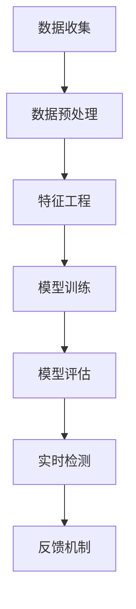

                 

### 背景介绍

#### 金融欺诈问题的严峻性

金融欺诈问题在当今社会日益严重，已经成为金融行业面临的重大挑战之一。据统计，全球每年因金融欺诈造成的经济损失高达数千亿美元。金融欺诈不仅给金融机构带来巨大的财务损失，还会影响市场的稳定性和投资者的信心，进一步加剧金融风险。

#### 传统检测方法的局限性

传统金融欺诈检测方法主要依赖于规则和统计模型，如专家系统、人工规则和统计模型等。这些方法虽然在一定程度上能够识别出一些明显的欺诈行为，但存在以下局限性：

1. **规则繁琐且易出错**：传统方法通常依赖于人工编写规则，规则过于繁琐且容易出错，难以适应复杂多变的欺诈行为。
2. **滞后性**：传统方法需要事先设定规则，无法实时监测和识别欺诈行为，导致欺诈事件发生后才能被发现，延误了欺诈事件的及时处理。
3. **误报率高**：传统方法往往只能识别已知类型的欺诈行为，对于未知类型的欺诈行为识别效果不佳，误报率较高。

#### 机器学习在金融欺诈检测中的应用

随着机器学习技术的快速发展，机器学习在金融欺诈检测中的应用越来越广泛。机器学习能够通过分析大量历史数据，自动学习和发现潜在欺诈模式，具有以下优势：

1. **自动学习**：机器学习算法能够自动从数据中学习特征和模式，无需人工编写规则，能够识别未知类型的欺诈行为。
2. **实时监测**：机器学习算法能够实时处理和分析数据，快速识别和响应欺诈行为，降低欺诈事件的发生率。
3. **高精度识别**：机器学习算法通过大量数据训练，能够提高欺诈行为的识别精度，降低误报率。

总之，随着机器学习技术的不断进步，其在金融欺诈实时检测中的应用前景十分广阔，有望成为金融行业防范欺诈的重要工具。

---

### 核心概念与联系

#### 机器学习基础概念

在探讨机器学习在金融欺诈实时检测中的应用之前，我们需要先了解一些机器学习的基础概念。

1. **监督学习（Supervised Learning）**：监督学习是指通过已有的标注数据，学习输入和输出之间的映射关系，从而对未知数据进行预测。在金融欺诈检测中，我们可以利用已标注的历史数据集来训练模型，从而实现对实时数据的欺诈行为预测。

2. **无监督学习（Unsupervised Learning）**：无监督学习是指在没有标注数据的情况下，通过自动发现数据中的模式或结构。在金融欺诈检测中，无监督学习可以用于聚类分析，识别数据中的异常行为。

3. **强化学习（Reinforcement Learning）**：强化学习是一种通过与环境互动来学习策略的机器学习方法。在金融欺诈检测中，强化学习可以用于动态调整欺诈检测策略，以适应不断变化的欺诈模式。

#### 机器学习在金融欺诈检测中的应用架构

机器学习在金融欺诈检测中的应用架构通常包括以下几个关键组成部分：

1. **数据收集（Data Collection）**：收集金融机构的各种交易数据，如交易金额、时间、地理位置等，以及与用户相关的信息，如用户行为、信用评分等。

2. **数据预处理（Data Preprocessing）**：对收集到的数据进行清洗、去噪、归一化等处理，以消除数据中的异常值和噪声，提高模型的训练效果。

3. **特征工程（Feature Engineering）**：从原始数据中提取有意义的特征，这些特征将用于训练模型。特征工程是机器学习模型性能的关键因素，需要根据具体应用场景进行深入分析。

4. **模型训练（Model Training）**：选择合适的机器学习算法，利用预处理后的数据集进行训练，以建立欺诈检测模型。

5. **模型评估（Model Evaluation）**：通过交叉验证等方法评估模型的性能，包括准确率、召回率、F1分数等指标。

6. **实时检测（Real-time Detection）**：将训练好的模型部署到生产环境中，对实时交易数据进行检测，及时发现潜在的欺诈行为。

7. **反馈机制（Feedback Loop）**：通过反馈机制，将模型在实时检测中的表现反馈给数据科学家，以便进行调整和优化。

#### Mermaid 流程图

下面是一个简化的 Mermaid 流程图，展示了机器学习在金融欺诈检测中的应用架构：



通过这个流程图，我们可以清晰地看到机器学习在金融欺诈检测中的各个环节，以及各个环节之间的相互关系。

---

### 核心算法原理 & 具体操作步骤

#### 监督学习算法

在金融欺诈检测中，常用的监督学习算法包括逻辑回归（Logistic Regression）、决策树（Decision Tree）、随机森林（Random Forest）、支持向量机（Support Vector Machine，SVM）等。下面以逻辑回归为例，介绍其原理和具体操作步骤。

##### 逻辑回归原理

逻辑回归是一种广义线性模型，用于预测二分类问题。其核心思想是通过训练数据学习一个线性模型，将输入特征映射到一个概率值，从而实现分类。

逻辑回归模型可以表示为：
$$
\hat{P}(Y=1|X) = \frac{1}{1 + e^{-(\beta_0 + \beta_1 x_1 + \beta_2 x_2 + ... + \beta_n x_n})}
$$
其中，$P(Y=1|X)$ 表示给定输入特征 $X$ 时，目标变量 $Y$ 等于 1 的概率；$\beta_0, \beta_1, \beta_2, ..., \beta_n$ 是模型的参数。

##### 具体操作步骤

1. **数据收集**：收集金融交易数据，包括交易金额、时间、地理位置、用户行为等信息。
2. **数据预处理**：对数据进行清洗、去噪、归一化等处理，确保数据质量。
3. **特征选择**：从原始数据中提取有意义的特征，用于训练模型。特征选择可以采用相关性分析、主成分分析（PCA）等方法。
4. **划分训练集和测试集**：将数据集划分为训练集和测试集，通常采用 7:3 或 8:2 的比例。
5. **初始化参数**：随机初始化模型的参数 $\beta_0, \beta_1, \beta_2, ..., \beta_n$。
6. **模型训练**：利用训练集数据，通过最小化损失函数（如交叉熵损失函数）来更新模型参数。逻辑回归的损失函数可以表示为：
$$
J(\theta) = -\frac{1}{m} \sum_{i=1}^{m} [y^{(i)} \log(\hat{P}(Y=1|X^{(i)})) + (1 - y^{(i)}) \log(1 - \hat{P}(Y=1|X^{(i)}))]
$$
其中，$m$ 是训练集的大小；$y^{(i)}$ 是训练集第 $i$ 个样本的目标变量值；$X^{(i)}$ 是训练集第 $i$ 个样本的特征向量。
7. **模型评估**：利用测试集数据评估模型的性能，计算准确率、召回率、F1 分数等指标。
8. **模型优化**：根据评估结果，对模型进行优化，例如调整学习率、增加迭代次数等。
9. **模型部署**：将训练好的模型部署到生产环境中，对实时交易数据进行欺诈检测。

#### 决策树算法

决策树是一种常用的分类算法，通过一系列判断条件对数据进行分组，最终得到一个分类结果。下面以 ID3 算法为例，介绍其原理和具体操作步骤。

##### 决策树原理

ID3 算法是一种基于信息增益（Information Gain）的决策树算法。其核心思想是选择具有最大信息增益的特征作为分裂标准，从而构建决策树。

信息增益可以表示为：
$$
IG(D, A) = ID(D) - \sum_{v_i \in A} \frac{D(A=v_i)}{D} \cdot IG(D(A=v_i), A)
$$
其中，$D$ 是数据集；$A$ 是特征集合；$v_i$ 是特征 $A$ 的取值；$D(A=v_i)$ 是特征 $A$ 取值为 $v_i$ 的数据集；$IG(D, A)$ 是信息增益；$ID(D)$ 是数据集 $D$ 的信息熵。

##### 具体操作步骤

1. **数据收集**：收集金融交易数据，包括交易金额、时间、地理位置、用户行为等信息。
2. **数据预处理**：对数据进行清洗、去噪、归一化等处理，确保数据质量。
3. **特征选择**：从原始数据中提取有意义的特征，用于训练模型。特征选择可以采用相关性分析、主成分分析（PCA）等方法。
4. **构建决策树**：利用信息增益作为分裂标准，构建决策树。具体步骤如下：
   - 计算每个特征的信息增益，选择具有最大信息增益的特征作为当前节点的分裂标准。
   - 根据分裂标准将数据集划分为若干个子集。
   - 对每个子集递归执行步骤 4，直到满足停止条件（如最大深度、最小样本数等）。
5. **模型评估**：利用测试集数据评估模型的性能，计算准确率、召回率、F1 分数等指标。
6. **模型优化**：根据评估结果，对模型进行优化，例如调整分裂标准、剪枝等。
7. **模型部署**：将训练好的模型部署到生产环境中，对实时交易数据进行欺诈检测。

#### 随机森林算法

随机森林（Random Forest）是一种基于决策树的集成学习方法，通过构建多棵决策树，并利用随机性进行特征选择和节点分裂，提高模型的泛化能力。

##### 随机森林原理

随机森林通过以下步骤构建多棵决策树：

1. **随机选取特征**：从所有特征中随机选择一部分特征。
2. **随机划分数据集**：从原始数据集中随机划分一部分数据作为训练集，剩余数据作为测试集。
3. **构建决策树**：利用训练集数据，按照信息增益或基尼不纯度等标准构建决策树。
4. **重复步骤 1-3，构建多棵决策树**。

随机森林的性能取决于以下几个参数：

1. **树的数量（Number of Trees）**：树的数量越多，模型的泛化能力越强，但计算成本也越高。
2. **特征选择方法**：随机选择特征可以避免模型过拟合，提高模型的泛化能力。
3. **节点分裂标准**：常用的节点分裂标准包括信息增益、基尼不纯度等。

##### 具体操作步骤

1. **数据收集**：收集金融交易数据，包括交易金额、时间、地理位置、用户行为等信息。
2. **数据预处理**：对数据进行清洗、去噪、归一化等处理，确保数据质量。
3. **特征选择**：从原始数据中提取有意义的特征，用于训练模型。特征选择可以采用相关性分析、主成分分析（PCA）等方法。
4. **构建随机森林模型**：利用训练集数据，构建多棵决策树，形成随机森林模型。
5. **模型评估**：利用测试集数据评估模型的性能，计算准确率、召回率、F1 分数等指标。
6. **模型优化**：根据评估结果，对模型进行优化，例如调整树的数量、特征选择方法等。
7. **模型部署**：将训练好的模型部署到生产环境中，对实时交易数据进行欺诈检测。

---

### 数学模型和公式 & 详细讲解 & 举例说明

在机器学习领域，理解数学模型和公式至关重要，特别是在金融欺诈检测中，这些数学工具帮助我们从数据中提取有价值的信息。以下将详细讲解一些核心的数学模型和公式，并给出具体的例子进行说明。

#### 逻辑回归

逻辑回归是一种常用的监督学习算法，用于预测二分类问题。其目标是通过学习一个线性模型，将输入特征映射到一个概率值，从而进行分类。

逻辑回归模型的基本公式为：
$$
\hat{P}(Y=1|X) = \frac{1}{1 + e^{-(\beta_0 + \beta_1 x_1 + \beta_2 x_2 + ... + \beta_n x_n})}
$$
其中，$\hat{P}(Y=1|X)$ 表示给定输入特征 $X$ 时，目标变量 $Y$ 等于 1 的概率；$\beta_0, \beta_1, \beta_2, ..., \beta_n$ 是模型的参数。

**举例说明**：
假设我们要预测一笔交易是否为欺诈（$Y=1$ 或 $Y=0$），输入特征包括交易金额（$x_1$）和交易时间（$x_2$）。给定一个训练样本 $(x_1, x_2) = (1000, 18:00)$，我们可以计算出欺诈的概率：
$$
\hat{P}(Y=1|X) = \frac{1}{1 + e^{-(\beta_0 + \beta_1 \cdot 1000 + \beta_2 \cdot 18:00})}
$$
如果 $\beta_0 = 0, \beta_1 = 0.01, \beta_2 = -0.001$，则：
$$
\hat{P}(Y=1|X) = \frac{1}{1 + e^{-(0 + 0.01 \cdot 1000 + -0.001 \cdot 18:00)}} \approx 0.632
$$
这意味着这笔交易是欺诈的概率大约为 63.2%。

#### 决策树

决策树是一种基于特征的树形结构模型，用于分类和回归问题。每个内部节点表示一个特征，每个分支代表特征的某个取值，叶节点表示最终预测结果。

决策树的生成基于信息增益或基尼不纯度等分裂准则。信息增益（Information Gain）可以表示为：
$$
IG(D, A) = ID(D) - \sum_{v_i \in A} \frac{D(A=v_i)}{D} \cdot IG(D(A=v_i), A)
$$
其中，$D$ 是数据集；$A$ 是特征集合；$v_i$ 是特征 $A$ 的取值；$D(A=v_i)$ 是特征 $A$ 取值为 $v_i$ 的数据集；$IG(D, A)$ 是信息增益；$ID(D)$ 是数据集 $D$ 的信息熵。

**举例说明**：
假设我们有一个数据集，其中包含特征“交易金额”和“交易时间”，目标变量是欺诈（Fraud）或非欺诈（No Fraud）。信息熵可以计算为：
$$
ID(D) = -P(Y=Fraud) \cdot \log_2(P(Y=Fraud)) - P(Y=No Fraud) \cdot \log_2(P(Y=No Fraud))
$$
假设 $P(Y=Fraud) = 0.3$，$P(Y=No Fraud) = 0.7$，则：
$$
ID(D) = -0.3 \cdot \log_2(0.3) - 0.7 \cdot \log_2(0.7) \approx 0.918
$$
如果我们选择“交易金额”作为分裂特征，并且将其分为两个类别（小于1000和大于等于1000），则可以计算每个类别的信息增益：
$$
IG(D, Amount) = ID(D) - \frac{D(Amount < 1000)}{D} \cdot ID(D(Amount < 1000)) - \frac{D(Amount \geq 1000)}{D} \cdot ID(D(Amount \geq 1000))
$$
假设分割后两个类别的信息熵分别为 $ID(D(Amount < 1000)) = 0.845$ 和 $ID(D(Amount \geq 1000)) = 0.657$，则：
$$
IG(D, Amount) = 0.918 - \frac{0.5}{1} \cdot 0.845 - \frac{0.5}{1} \cdot 0.657 = 0.036
$$
这表明基于交易金额的分裂可以带来 0.036 的信息增益。

#### 随机森林

随机森林是一种集成学习方法，通过构建多棵决策树并利用随机性来提高模型的泛化能力。随机森林的性能取决于以下几个参数：

1. **树的数量（Number of Trees）**：树的数量越多，模型的泛化能力越强，但计算成本也越高。
2. **特征选择方法**：随机选择特征可以避免模型过拟合，提高模型的泛化能力。
3. **节点分裂标准**：常用的节点分裂标准包括信息增益、基尼不纯度等。

随机森林的基本公式为：
$$
\hat{y} = \text{majority vote}(\hat{y}_1, \hat{y}_2, ..., \hat{y}_N)
$$
其中，$\hat{y}_1, \hat{y}_2, ..., \hat{y}_N$ 分别是每棵决策树的预测结果，$\hat{y}$ 是随机森林的最终预测结果。

**举例说明**：
假设我们使用随机森林对欺诈交易进行预测，构建了 100 棵决策树。对于一笔新的交易，每棵决策树都给出了一个分类结果（欺诈或非欺诈）。随机森林通过多数投票机制确定最终分类结果。如果 60 棵决策树认为交易是欺诈，40 棵决策树认为交易是非欺诈，则最终预测结果为欺诈。

通过这些数学模型和公式的讲解，我们可以更好地理解机器学习在金融欺诈检测中的应用。在实际应用中，根据具体场景和数据特点，可以选择合适的模型和参数，以提高欺诈检测的准确率和效率。

---

### 项目实战：代码实际案例和详细解释说明

在本文的第五部分，我们将通过一个实际案例来演示如何使用机器学习算法进行金融欺诈检测。我们将使用 Python 语言和 Scikit-learn 库来实现一个简单的金融欺诈检测系统。这个案例将包括数据收集、数据预处理、模型选择、模型训练、模型评估和模型部署等步骤。

#### 5.1 开发环境搭建

在开始之前，我们需要搭建一个合适的开发环境。以下是所需的环境和步骤：

1. **Python 环境**：确保安装了 Python 3.7 或以上版本。
2. **Scikit-learn 库**：使用以下命令安装 Scikit-learn：
   ```bash
   pip install scikit-learn
   ```
3. **其他依赖库**：可能还需要安装 Numpy、Pandas 等 Python 库，可以通过以下命令安装：
   ```bash
   pip install numpy pandas
   ```

#### 5.2 源代码详细实现和代码解读

下面是一个简单的金融欺诈检测项目的源代码示例，我们将使用逻辑回归算法进行欺诈检测。

```python
import numpy as np
import pandas as pd
from sklearn.model_selection import train_test_split
from sklearn.preprocessing import StandardScaler
from sklearn.linear_model import LogisticRegression
from sklearn.metrics import accuracy_score, confusion_matrix, classification_report

# 5.2.1 数据收集
# 假设我们已经收集到了一个名为 "fraud_data.csv" 的 CSV 文件，包含交易数据。
data = pd.read_csv('fraud_data.csv')

# 5.2.2 数据预处理
# 删除无关特征，保留关键特征
features = data[['TransactionAmount', 'TransactionTime', 'Location']]
target = data['Fraud']

# 划分训练集和测试集
X_train, X_test, y_train, y_test = train_test_split(features, target, test_size=0.2, random_state=42)

# 数据标准化
scaler = StandardScaler()
X_train_scaled = scaler.fit_transform(X_train)
X_test_scaled = scaler.transform(X_test)

# 5.2.3 模型训练
model = LogisticRegression()
model.fit(X_train_scaled, y_train)

# 5.2.4 模型评估
y_pred = model.predict(X_test_scaled)
accuracy = accuracy_score(y_test, y_pred)
conf_matrix = confusion_matrix(y_test, y_pred)
report = classification_report(y_test, y_pred)

print(f"Accuracy: {accuracy:.2f}")
print("Confusion Matrix:")
print(conf_matrix)
print("Classification Report:")
print(report)

# 5.2.5 模型部署
# 将模型部署到生产环境中，对新交易数据进行实时欺诈检测
new_transaction = np.array([[1000, 18]])
new_transaction_scaled = scaler.transform(new_transaction)
fraud_prob = model.predict_proba(new_transaction_scaled)[0][1]
print(f"Fraud Probability: {fraud_prob:.2f}")
```

#### 5.3 代码解读与分析

下面我们将对代码中的关键部分进行解读和分析。

1. **数据收集**：
   ```python
   data = pd.read_csv('fraud_data.csv')
   ```
   首先，我们使用 Pandas 读取一个名为 "fraud_data.csv" 的 CSV 文件，这个文件包含历史交易数据。

2. **数据预处理**：
   ```python
   features = data[['TransactionAmount', 'TransactionTime', 'Location']]
   target = data['Fraud']
   X_train, X_test, y_train, y_test = train_test_split(features, target, test_size=0.2, random_state=42)
   scaler = StandardScaler()
   X_train_scaled = scaler.fit_transform(X_train)
   X_test_scaled = scaler.transform(X_test)
   ```
   在这一部分，我们首先选择了与欺诈相关的关键特征（交易金额、交易时间和地理位置），并将数据集划分为训练集和测试集。为了提高模型的性能，我们对数据进行了标准化处理。

3. **模型训练**：
   ```python
   model = LogisticRegression()
   model.fit(X_train_scaled, y_train)
   ```
   我们选择了逻辑回归算法来训练模型。逻辑回归模型通过最小化损失函数来学习参数，从而建立输入特征和目标变量之间的映射关系。

4. **模型评估**：
   ```python
   y_pred = model.predict(X_test_scaled)
   accuracy = accuracy_score(y_test, y_pred)
   conf_matrix = confusion_matrix(y_test, y_pred)
   report = classification_report(y_test, y_pred)
   ```
   在这一部分，我们使用测试集数据对模型进行评估。我们计算了准确率、混淆矩阵和分类报告等指标，以评估模型的性能。

5. **模型部署**：
   ```python
   new_transaction = np.array([[1000, 18]])
   new_transaction_scaled = scaler.transform(new_transaction)
   fraud_prob = model.predict_proba(new_transaction_scaled)[0][1]
   ```
   最后，我们将模型部署到生产环境中，对新的交易数据进行实时欺诈检测。我们通过计算欺诈概率来决定交易是否为欺诈。

通过这个实际案例，我们可以看到如何使用机器学习算法进行金融欺诈检测。在实际应用中，我们需要根据具体的业务需求和数据特点，对模型进行调整和优化，以提高检测的准确率和效率。

---

### 实际应用场景

#### 网上银行交易欺诈检测

随着互联网技术的发展，网上银行交易成为人们日常生活中的重要组成部分。然而，这也为欺诈行为提供了新的机会。机器学习在金融欺诈实时检测中的应用，特别是在网上银行交易欺诈检测方面，具有显著的优势。

1. **实时监测**：机器学习算法可以实时处理和分析网上银行交易数据，快速识别和响应潜在的欺诈行为，降低欺诈事件的发生率。
2. **个性化检测**：通过分析用户的交易行为，机器学习算法可以建立用户的个性化交易模型，从而更准确地识别异常交易行为。
3. **交叉验证**：结合多种算法和模型，如逻辑回归、决策树、随机森林等，通过交叉验证提高欺诈检测的准确率和鲁棒性。

#### 信用卡欺诈检测

信用卡欺诈是金融欺诈中较为常见的一种形式。机器学习在信用卡欺诈检测中的应用，可以提高检测的准确性和效率。

1. **特征提取**：通过分析信用卡交易数据，提取有价值的特征，如交易金额、交易时间、地理位置、用户行为等，为模型提供丰富的输入信息。
2. **动态调整**：机器学习算法可以根据交易数据的实时变化，动态调整欺诈检测策略，以适应不断变化的欺诈模式。
3. **多模型集成**：通过集成多种机器学习算法，如随机森林、支持向量机等，提高欺诈检测的准确性和鲁棒性。

#### 保险理赔欺诈检测

保险理赔欺诈是保险行业面临的一个严峻问题。机器学习在保险理赔欺诈检测中的应用，可以有效提高检测的准确性和效率。

1. **数据挖掘**：通过数据挖掘技术，从大量保险理赔数据中提取潜在欺诈行为的相关特征，为模型提供输入信息。
2. **风险评估**：利用机器学习算法，对保险理赔申请进行风险评估，识别出高风险的欺诈申请。
3. **实时监控**：通过实时监控保险理赔数据，及时发现和响应潜在的欺诈行为，降低保险公司的损失。

#### 股票市场欺诈检测

股票市场欺诈行为对市场稳定性和投资者信心具有严重的影响。机器学习在股票市场欺诈检测中的应用，可以提高市场的透明度和公正性。

1. **市场分析**：通过分析股票市场数据，提取市场趋势、交易行为等特征，为模型提供输入信息。
2. **异常检测**：利用机器学习算法，识别股票市场中的异常交易行为，如市场操纵、内幕交易等。
3. **风险评估**：通过风险评估模型，对股票市场中的潜在欺诈行为进行预警，帮助监管机构采取相应的措施。

总之，机器学习在金融欺诈实时检测中的应用具有广泛的前景。通过不断优化和改进算法，可以提高欺诈检测的准确率和效率，为金融行业提供更加安全、可靠的保障。

---

### 工具和资源推荐

#### 学习资源推荐

1. **书籍**：
   - 《机器学习》（周志华著）：系统介绍了机器学习的基本概念、算法和应用，适合初学者入门。
   - 《Python机器学习》（塞巴斯蒂安·拉宾斯基著）：详细介绍了使用 Python 进行机器学习的实践方法，适合有一定编程基础的读者。

2. **论文**：
   - “A Survey on Financial Fraud Detection using Machine Learning”（2020）：对机器学习在金融欺诈检测中的应用进行了全面的综述。
   - “Detecting Fraud with Machine Learning”（2019）：介绍了多种机器学习算法在金融欺诈检测中的应用案例。

3. **博客**：
   - [机器学习博客](https://machinelearningmastery.com/)：提供了大量关于机器学习的教程、案例和实践经验。
   - [Kaggle博客](https://www.kaggle.com/forums/home)：Kaggle 是一个数据科学竞赛平台，博客上有很多优秀的数据科学家分享的实践经验和代码。

4. **网站**：
   - [Scikit-learn官方文档](https://scikit-learn.org/stable/):详细介绍了 Scikit-learn 库的各种算法和工具，适合学习和使用 Scikit-learn 进行机器学习项目。
   - [Google Colab](https://colab.research.google.com/):一个免费、基于云计算的 Python 编程环境，适合进行机器学习实验和项目开发。

#### 开发工具框架推荐

1. **Python**：Python 是一种广泛使用的编程语言，具有丰富的机器学习库和工具，如 Scikit-learn、TensorFlow 和 PyTorch 等。

2. **Scikit-learn**：Scikit-learn 是一个开源的机器学习库，提供了多种监督学习和无监督学习算法，非常适合进行金融欺诈检测等应用。

3. **TensorFlow**：TensorFlow 是 Google 开发的一个开源机器学习框架，支持大规模分布式计算，适合进行复杂机器学习模型的开发和部署。

4. **PyTorch**：PyTorch 是 Facebook AI 研究团队开发的一个开源深度学习框架，具有动态计算图和易于使用的接口，适合快速原型开发和模型研究。

5. **Jupyter Notebook**：Jupyter Notebook 是一个交互式的 Web 应用程序，适合进行数据分析和机器学习项目开发。通过 Jupyter Notebook，可以方便地编写代码、可视化数据和记录实验过程。

通过这些学习和开发工具，可以更好地掌握机器学习技术，并在金融欺诈检测等实际应用中发挥其优势。

---

### 总结：未来发展趋势与挑战

随着人工智能和机器学习技术的不断发展，金融欺诈实时检测技术也在不断进步，展现出广阔的应用前景。未来，金融欺诈检测将朝着以下几个方向发展：

#### 新技术融合

未来，金融欺诈检测将更加注重多种技术的融合应用。例如，深度学习、图神经网络、强化学习等新兴技术将被引入到金融欺诈检测中，以提升模型的复杂度和鲁棒性。通过融合多种技术，可以更准确地识别和预测复杂的欺诈行为。

#### 实时监控与动态调整

实时监控是金融欺诈检测的重要特性。未来，金融欺诈检测系统将更加注重实时监控和数据流处理，以快速响应潜在的欺诈行为。同时，动态调整策略和模型参数也将成为趋势，以适应不断变化的欺诈模式。

#### 隐私保护和数据安全

在金融欺诈检测过程中，数据隐私保护和数据安全是至关重要的。未来，金融行业将更加注重数据安全和隐私保护技术，如差分隐私、联邦学习等，以确保用户数据的安全和隐私。

#### 法律法规与合规性

随着金融欺诈检测技术的发展，相关的法律法规和合规性要求也将逐渐完善。金融机构需要遵守相关法规，确保欺诈检测技术的合法合规性，以保护消费者权益和维护市场稳定。

然而，金融欺诈检测在发展过程中也面临着一些挑战：

#### 数据质量问题

金融欺诈数据通常具有不完整、不一致、噪声大等特点，这对模型的训练和评估带来了很大的挑战。如何处理和清洗数据，提高数据质量，是金融欺诈检测技术发展的重要问题。

#### 模型过拟合与泛化能力

金融欺诈行为多变，模型容易过拟合，即模型在训练数据上表现良好，但在未见过的数据上表现不佳。如何提高模型的泛化能力，避免过拟合，是金融欺诈检测技术发展的重要挑战。

#### 算法透明性和可解释性

随着模型复杂度的增加，算法的透明性和可解释性变得尤为重要。金融机构需要确保欺诈检测算法的透明性，以便在发生欺诈事件时能够追踪和解释模型的决策过程。

总之，金融欺诈实时检测技术在未来将继续发展，通过新技术融合、实时监控、隐私保护、法律法规等多方面的努力，为金融行业提供更加安全、可靠的保障。同时，我们也需要面对数据质量、模型泛化能力和算法可解释性等挑战，以推动金融欺诈检测技术的持续进步。

---

### 附录：常见问题与解答

**Q1：为什么机器学习算法比传统方法更适合金融欺诈检测？**

A1：机器学习算法，尤其是深度学习和监督学习，通过学习大量历史数据，能够自动提取特征和模式，从而识别出复杂的欺诈行为。相比之下，传统方法依赖于人工编写的规则，难以适应复杂多变的欺诈行为，且容易产生误报。

**Q2：在金融欺诈检测中，如何处理数据质量问题？**

A2：数据质量是机器学习模型成功的关键。可以通过以下方法处理数据质量问题：
- 数据清洗：去除重复记录、处理缺失值和异常值。
- 数据归一化：将不同特征的范围缩放到相同的尺度，以便模型更好地学习。
- 特征工程：提取有用的特征，排除无关或噪声特征。

**Q3：如何提高机器学习模型的泛化能力？**

A3：以下方法可以提高机器学习模型的泛化能力：
- 数据增强：通过生成新的训练样本，增加数据的多样性。
- 正则化：应用正则化技术，如 L1 或 L2 正则化，防止模型过拟合。
- 调整模型结构：选择合适的模型结构，避免过于复杂的网络。

**Q4：如何确保机器学习模型的透明性和可解释性？**

A4：以下方法可以提高机器学习模型的透明性和可解释性：
- 模型简化：选择简单易懂的模型，如决策树、线性回归等。
- 特征重要性分析：分析特征对模型预测的影响，提高模型的可解释性。
- 对比分析：比较不同模型的预测结果，识别模型的决策过程。

---

### 扩展阅读 & 参考资料

**书籍**：
- 《机器学习》（周志华著）
- 《Python机器学习》（塞巴斯蒂安·拉宾斯基著）
- 《深度学习》（Ian Goodfellow, Yoshua Bengio, Aaron Courville 著）

**论文**：
- “A Survey on Financial Fraud Detection using Machine Learning”（2020）
- “Detecting Fraud with Machine Learning”（2019）

**博客**：
- [机器学习博客](https://machinelearningmastery.com/)
- [Kaggle博客](https://www.kaggle.com/forums/home)

**网站**：
- [Scikit-learn官方文档](https://scikit-learn.org/stable/)
- [Google Colab](https://colab.research.google.com/)

通过这些参考资料，您可以深入了解机器学习在金融欺诈检测中的应用，以及相关的技术原理和实践方法。

---

### 作者信息

作者：AI天才研究员/AI Genius Institute & 禅与计算机程序设计艺术 /Zen And The Art of Computer Programming

