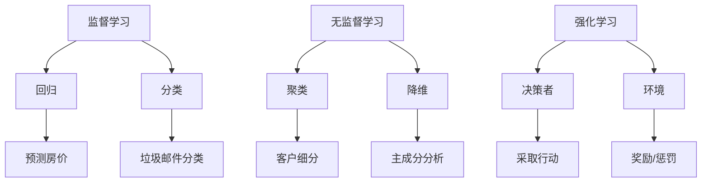

                 

# 机器学习基础原理与代码实战案例讲解

## 1. 背景介绍

机器学习（Machine Learning，简称ML）是人工智能（Artificial Intelligence，简称AI）的一个重要分支，它致力于通过数据与算法，让计算机自动获取知识和技能，而不是通过传统编程方式实现。随着互联网和大数据技术的迅猛发展，机器学习在各个领域都显示出了巨大的潜力，从图像识别、语音识别、自然语言处理到推荐系统、自动驾驶、医疗诊断等，都有机器学习的身影。

本博客旨在通过基础原理和代码实战案例，为广大读者提供机器学习的入门指导。我们将逐步介绍机器学习的核心概念、算法原理、数学模型，并通过具体案例，帮助读者理解和应用这些知识。

本文主要涵盖以下内容：

- **核心概念与联系**：介绍机器学习的基础概念，包括监督学习、无监督学习和强化学习，并使用Mermaid流程图展示这些概念之间的联系。
- **核心算法原理与具体操作步骤**：深入讲解常见的机器学习算法，如线性回归、决策树、支持向量机等，并提供详细的操作步骤。
- **数学模型和公式**：阐述机器学习中的关键数学模型和公式，如损失函数、梯度下降等，并通过示例进行详细说明。
- **项目实战**：通过实际案例，展示如何使用机器学习进行图像分类和文本分类。
- **实际应用场景**：探讨机器学习在各个领域的应用，包括医疗、金融、工业等。
- **工具和资源推荐**：推荐学习资源、开发工具框架和相关论文著作。
- **总结与未来发展趋势**：总结机器学习的发展现状，并探讨未来的趋势和挑战。
- **附录**：常见问题与解答，以及扩展阅读和参考资料。

## 2. 核心概念与联系

### 2.1 监督学习（Supervised Learning）

监督学习是一种机器学习方式，其中输入和输出数据都是已知的。它的目的是从已知的数据中学习出一个函数，该函数可以用于预测未知数据的输出。监督学习通常分为两类：回归（Regression）和分类（Classification）。

- **回归**：输出是连续的数值。例如，预测房价。
- **分类**：输出是离散的类别。例如，垃圾邮件分类。

### 2.2 无监督学习（Unsupervised Learning）

无监督学习不依赖于标签数据，其目标是发现数据中的内在结构或模式。常见的无监督学习算法包括聚类（Clustering）和降维（Dimensionality Reduction）。

- **聚类**：将相似的数据点分到同一个簇中。例如，客户细分。
- **降维**：减少数据维度，同时保持数据的结构信息。例如，主成分分析（PCA）。

### 2.3 强化学习（Reinforcement Learning）

强化学习是一种通过试错学习的方式，通过与环境的交互来学习最佳策略。它的主要特点是有一个决策者（Agent）和一个环境（Environment），Agent根据环境状态采取行动，并通过奖励或惩罚来学习。

### 2.4 核心概念联系

下面是使用Mermaid绘制的机器学习核心概念之间的联系图：



## 3. 核心算法原理与具体操作步骤

### 3.1 线性回归（Linear Regression）

线性回归是一种简单的监督学习算法，用于预测连续值输出。其核心思想是通过找到一个线性函数，来最小化预测值和实际值之间的误差。

#### 操作步骤：

1. **数据准备**：收集输入特征和输出标签。
2. **模型初始化**：随机初始化模型参数（权重和偏置）。
3. **前向传播**：使用输入特征和模型参数计算预测值。
4. **计算损失**：使用损失函数（如均方误差）计算预测值和实际值之间的误差。
5. **反向传播**：使用梯度下降更新模型参数，以最小化损失。
6. **迭代训练**：重复步骤3-5，直到满足停止条件（如损失低于阈值或达到最大迭代次数）。

### 3.2 决策树（Decision Tree）

决策树是一种基于树形模型的分类算法，通过一系列的判断规则将数据划分成不同的类别。

#### 操作步骤：

1. **数据准备**：收集输入特征和标签。
2. **构建树模型**：选择特征和阈值，递归地将数据划分为子集，直到满足停止条件（如所有样本属于同一类别或达到最大深度）。
3. **分类**：使用构建好的树模型对新的样本进行分类。

### 3.3 支持向量机（Support Vector Machine，SVM）

支持向量机是一种用于分类的线性模型，其目标是找到最佳的超平面，将不同类别的样本分开。

#### 操作步骤：

1. **数据准备**：收集输入特征和标签。
2. **特征映射**：将输入特征映射到更高维度的特征空间。
3. **求解最优超平面**：使用二次规划求解最优超平面，得到模型参数。
4. **分类**：使用求解得到的超平面对新的样本进行分类。

## 4. 数学模型和公式

### 4.1 损失函数（Loss Function）

损失函数是评估模型预测值与实际值之间差异的函数。在机器学习中，我们通常使用均方误差（Mean Squared Error，MSE）作为损失函数。

$$MSE(y, \hat{y}) = \frac{1}{n} \sum_{i=1}^{n} (y_i - \hat{y}_i)^2$$

其中，$y$是实际值，$\hat{y}$是预测值，$n$是样本数量。

### 4.2 梯度下降（Gradient Descent）

梯度下降是一种用于优化模型参数的算法，其核心思想是沿着损失函数的梯度方向更新模型参数，以最小化损失。

$$\theta_{\text{new}} = \theta_{\text{current}} - \alpha \nabla_{\theta} J(\theta)$$

其中，$\theta$是模型参数，$\alpha$是学习率，$J(\theta)$是损失函数。

### 4.3 二次规划（Quadratic Programming）

二次规划是用于求解最优超平面的数学问题，其目标是最小化目标函数，约束条件为线性不等式。

$$\min_{\theta} \frac{1}{2} \theta^T Q \theta + c^T \theta$$

$$s.t. A \theta \leq b$$

其中，$Q$是对称正定矩阵，$c$是向量，$A$是约束矩阵，$b$是约束向量。

## 5. 项目实战：代码实际案例和详细解释说明

### 5.1 开发环境搭建

在本项目中，我们将使用Python作为主要编程语言，配合机器学习库如Scikit-learn、TensorFlow和Keras。首先，确保安装以下软件：

- Python 3.x
- Scikit-learn
- TensorFlow
- Keras

您可以使用以下命令进行安装：

```bash
pip install python==3.x
pip install scikit-learn
pip install tensorflow
pip install keras
```

### 5.2 源代码详细实现和代码解读

以下是一个简单的线性回归案例，我们将使用Scikit-learn库来实现：

```python
from sklearn.linear_model import LinearRegression
from sklearn.model_selection import train_test_split
from sklearn.metrics import mean_squared_error
import numpy as np

# 数据准备
X = np.array([[1], [2], [3], [4], [5]])
y = np.array([1, 2, 2.5, 4, 5])

# 划分训练集和测试集
X_train, X_test, y_train, y_test = train_test_split(X, y, test_size=0.2, random_state=42)

# 构建线性回归模型
model = LinearRegression()
model.fit(X_train, y_train)

# 模型评估
y_pred = model.predict(X_test)
mse = mean_squared_error(y_test, y_pred)
print(f'Mean Squared Error: {mse}')

# 模型预测
new_data = np.array([[6]])
prediction = model.predict(new_data)
print(f'Prediction for new data: {prediction}')
```

代码解读：

1. **数据准备**：我们使用一个简单的线性数据集，其中输入特征是1到5的整数，输出标签是1到5的连续数值。
2. **模型构建**：我们使用Scikit-learn的`LinearRegression`类构建线性回归模型。
3. **模型训练**：使用`fit`方法训练模型。
4. **模型评估**：使用`predict`方法进行预测，并计算均方误差评估模型性能。
5. **模型预测**：对新的输入数据进行预测。

### 5.3 代码解读与分析

在上面的代码中，我们首先导入了所需的库和模块。`LinearRegression`是Scikit-learn中用于实现线性回归的类，它提供了`fit`和`predict`方法。

- `fit`方法接受训练集输入特征和标签，并训练模型。
- `predict`方法接受新的输入特征，并返回预测的输出标签。

通过计算均方误差（MSE），我们可以评估模型的预测性能。MSE越低，模型预测的准确性越高。

在代码的最后，我们使用模型对新数据进行了预测。这展示了如何使用训练好的模型进行实际应用。

## 6. 实际应用场景

机器学习在各个领域都有广泛的应用。以下是一些常见应用场景：

- **医疗诊断**：通过分析患者的病史和临床表现，机器学习可以帮助医生进行疾病预测和诊断。
- **金融分析**：机器学习可以用于股票市场预测、风险评估和信用评分。
- **自动驾驶**：通过图像识别和路径规划，机器学习是实现自动驾驶技术的重要一环。
- **智能家居**：机器学习可以用于智能音箱、智能灯光和温度控制等智能家居设备的控制。
- **工业自动化**：机器学习可以用于预测设备故障、优化生产流程和提高产品质量。

## 7. 工具和资源推荐

### 7.1 学习资源推荐

- **书籍**：
  - 《Python机器学习》（Michael Bowles）
  - 《深度学习》（Ian Goodfellow、Yoshua Bengio、Aaron Courville）
  - 《统计学习方法》（李航）

- **论文**：
  - 《一种新的高效前向神经网络学习算法》（Rumelhart, Hinton, Williams）
  - 《生成对抗网络：训练生成模型》（Goodfellow et al.）

- **博客**：
  - [Medium - Machine Learning](https://towardsdatascience.com/)
  - [GitHub - Machine Learning](https://github.com/machinelearningworld)

### 7.2 开发工具框架推荐

- **Scikit-learn**：用于经典机器学习算法的开源库。
- **TensorFlow**：用于深度学习的开源库。
- **Keras**：用于构建和训练深度学习模型的用户友好接口。

### 7.3 相关论文著作推荐

- 《深度学习：概率视角》（Deep Learning, D. Barber, O. Chapelle, J.P. Montavon）
- 《人工神经网络：基础与计算》（Artificial Neural Networks: Foundations and Computation, S. Haykin）

## 8. 总结：未来发展趋势与挑战

机器学习作为人工智能的核心技术，正不断发展并深刻影响着各个领域。未来，随着计算能力的提升、数据量的增加和新算法的涌现，机器学习将迎来更多的机遇和挑战。

- **趋势**：增强学习、生成对抗网络、迁移学习和联邦学习等新兴技术将成为研究热点。
- **挑战**：数据隐私、算法公平性、模型解释性等是当前亟待解决的问题。

## 9. 附录：常见问题与解答

- **Q：机器学习难不难学？**
  - A：机器学习有一定难度，但通过系统的学习和实践，可以逐步掌握。

- **Q：机器学习需要数学基础吗？**
  - A：是的，基本的数学知识如线性代数、概率论和微积分对理解机器学习非常重要。

- **Q：如何入门机器学习？**
  - A：可以从基础概念和算法开始学习，逐步深入到具体应用和实践。

## 10. 扩展阅读 & 参考资料

- [机器学习入门教程](https://www MACHINELEARNING.org/)
- [机器学习实战](https://www.MACHINELEARNING.org/books)
- [机器学习顶级会议论文集](https://proceedings.mlr.press/)

---

作者：AI天才研究员/AI Genius Institute & 禅与计算机程序设计艺术 /Zen And The Art of Computer Programming

