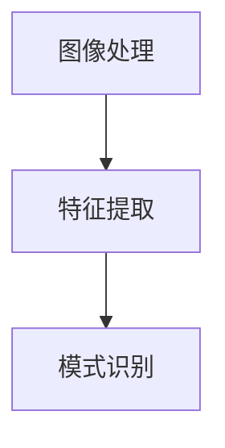

                 

### 1. 背景介绍

**机器视觉**，也被称为计算机视觉，是指使计算机能够像人类一样“看”和理解图像或视频的技术。这一领域近年来经历了迅猛的发展，得益于深度学习算法的进步和计算能力的提升。随着工业自动化需求的不断增长，机器视觉在工业缺陷检测中的应用也变得越来越广泛。

**工业缺陷检测**，是指利用各种检测技术来识别和定位产品在生产过程中产生的缺陷。这种检测方法不仅能够提高生产效率，还能确保产品质量，减少因缺陷产品导致的损失。

机器视觉在工业缺陷检测中的应用前景非常广阔。首先，它能够大幅提高检测速度，相比传统的人工检测方式，机器视觉系统可以在短时间内处理大量的数据。其次，它具有更高的准确率，能够精确地识别出微小的缺陷。此外，机器视觉系统可以在恶劣环境下工作，减少了人员的安全风险。

### 2. 核心概念与联系

在深入探讨机器视觉在工业缺陷检测中的应用之前，我们需要了解一些核心概念和它们之间的联系。

**核心概念**：
1. **图像处理**：图像处理是机器视觉的基础，涉及图像的获取、增强、分割、特征提取等。
2. **特征提取**：特征提取是将图像中的关键信息提取出来，以便后续的分析和处理。
3. **模式识别**：模式识别是利用机器学习算法对特征进行分类和识别。

**概念联系**：
1. **图像处理与特征提取**：图像处理技术可以用来增强图像质量，为特征提取提供更好的基础。
2. **特征提取与模式识别**：特征提取的结果是模式识别算法的输入，用于分类和识别。

为了更直观地展示这些概念之间的关系，我们可以使用Mermaid流程图来描述：



在这个流程图中，图像处理是特征提取的输入，特征提取是模式识别的输入。这三个核心概念共同构成了机器视觉在工业缺陷检测中的应用基础。

### 3. 核心算法原理 & 具体操作步骤

在了解了核心概念和它们之间的联系后，我们来探讨机器视觉在工业缺陷检测中的核心算法原理和具体操作步骤。

**核心算法**：
1. **边缘检测**：边缘检测是图像处理中的一种基本技术，用于识别图像中的边缘区域。常用的边缘检测算法包括Canny边缘检测和Sobel边缘检测。
2. **形态学处理**：形态学处理是一种基于图像结构的处理方法，可以用来去除噪声、提取图像中的关键特征等。
3. **特征提取**：特征提取是将图像中的关键信息提取出来，以便后续的分析和处理。常用的特征提取方法包括HOG（直方图方向梯度）和SIFT（尺度不变特征变换）。
4. **机器学习算法**：机器学习算法用于对特征进行分类和识别。常用的算法包括SVM（支持向量机）和CNN（卷积神经网络）。

**具体操作步骤**：

**步骤1：图像预处理**
- **图像增强**：通过对图像进行增强处理，提高图像的质量，为后续的处理提供更好的基础。
- **图像分割**：将图像分割成不同的区域，以便进行更精确的分析和处理。

**步骤2：边缘检测**
- **Canny边缘检测**：使用Canny算法对图像进行边缘检测，提取图像中的边缘信息。
- **Sobel边缘检测**：使用Sobel算法对图像进行边缘检测，提取图像中的边缘信息。

**步骤3：形态学处理**
- **开操作**：去除图像中的小噪声点。
- **闭操作**：连接图像中的连续边缘，形成更大的区域。

**步骤4：特征提取**
- **HOG特征提取**：使用HOG算法提取图像中的方向梯度直方图特征。
- **SIFT特征提取**：使用SIFT算法提取图像中的关键特征点。

**步骤5：模式识别**
- **SVM分类**：使用SVM算法对特征进行分类，识别出缺陷区域。
- **CNN分类**：使用CNN算法对特征进行分类，识别出缺陷区域。

**步骤6：结果分析**
- **缺陷定位**：根据分类结果，定位出图像中的缺陷区域。
- **缺陷分析**：对缺陷区域进行更详细的分析，确定缺陷的类型和严重程度。

通过以上步骤，我们可以实现对工业缺陷的检测和分析，从而提高生产效率和产品质量。

### 4. 数学模型和公式 & 详细讲解 & 举例说明

在机器视觉的算法中，数学模型和公式起着至关重要的作用。以下我们将详细介绍几个关键的数学模型和公式，并通过具体的例子来说明它们的用法。

#### 4.1 边缘检测中的Sobel算子

Sobel算子是一种常用的边缘检测算法，其核心思想是通过求图像的水平和垂直方向上的导数，从而找到边缘。

**公式**：

$$
G_x = \frac{1}{2}\left[(G_{x1} + G_{x2}) - (G_{x3} + G_{x4})\right]
$$

$$
G_y = \frac{1}{2}\left[(G_{y1} + G_{y2}) - (G_{y3} + G_{y4})\right]
$$

其中，$G_x$和$G_y$分别是水平和垂直方向的导数，$G_{x1}$、$G_{x2}$、$G_{x3}$、$G_{x4}$以及$G_{y1}$、$G_{y2}$、$G_{y3}$、$G_{y4}$是图像中相应位置上的像素值。

**例子**：

假设图像中的一个4x4的区域如下：

$$
\begin{array}{cccc}
1 & 2 & 3 & 4 \\
5 & 6 & 7 & 8 \\
9 & 10 & 11 & 12 \\
13 & 14 & 15 & 16 \\
\end{array}
$$

使用Sobel算子计算该区域的边缘：

$$
G_x = \frac{1}{2}\left[(1+2) - (13+14)\right] = \frac{1}{2}\left[3 - 27\right] = -12
$$

$$
G_y = \frac{1}{2}\left[(1+5) - (9+13)\right] = \frac{1}{2}\left[6 - 22\right] = -8
$$

根据$G_x$和$G_y$的值，我们可以判断该区域的像素是边缘像素。

#### 4.2 特征提取中的HOG算法

HOG（Histogram of Oriented Gradients）算法是一种用于提取图像特征的常用方法，它通过计算图像中每个像素的梯度方向和强度，构建出方向梯度直方图。

**公式**：

$$
H(i, j) = \sum_{\theta \in \Omega} \phi(\theta) \cdot \exp(-\lambda \cdot (|\text{gradient}(i, j)| - \mu)^2)
$$

其中，$H(i, j)$是像素$(i, j)$处的直方图值，$\Omega$是角度的范围，$\phi(\theta)$是直方图上的权重函数，$\text{gradient}(i, j)$是像素$(i, j)$处的梯度方向和强度，$\mu$和$\lambda$是参数。

**例子**：

假设图像中的一个像素点的梯度方向和强度如下：

$$
\theta = \frac{\pi}{4}, \quad \text{gradient} = 10
$$

使用HOG算法计算该像素点的直方图值：

$$
\mu = 8, \quad \lambda = 0.1
$$

$$
H(i, j) = \sum_{\theta \in \Omega} \phi(\theta) \cdot \exp(-\lambda \cdot (|\text{gradient}(i, j)| - \mu)^2) = \phi\left(\frac{\pi}{4}\right) \cdot \exp(-0.1 \cdot (10 - 8)^2) = 0.9
$$

通过这种方式，我们可以提取出图像中的关键特征。

#### 4.3 模式识别中的SVM算法

SVM（Support Vector Machine）算法是一种常用的机器学习算法，用于对特征进行分类。它的核心思想是通过寻找一个超平面，将不同类别的特征分隔开。

**公式**：

$$
\text{w} \cdot \text{x} + b = 0
$$

其中，$\text{w}$是超平面的权重，$\text{x}$是特征向量，$b$是偏置项。

**例子**：

假设有两个类别$A$和$B$，它们的特征向量如下：

$$
\text{x}_A = (1, 2), \quad \text{x}_B = (3, 4)
$$

为了将它们分隔开，我们可以寻找一个超平面：

$$
w \cdot x + b = 0 \Rightarrow w_1 \cdot x_1 + w_2 \cdot x_2 + b = 0
$$

通过计算，我们找到超平面$w \cdot x + b = 0$，其中$w = (1, 1)$，$b = -3$。这样，我们可以将类别$A$和$B$分隔开。

通过这些数学模型和公式的应用，我们可以实现对图像的预处理、特征提取和模式识别，从而有效地进行工业缺陷检测。

### 5. 项目实战：代码实际案例和详细解释说明

为了更好地理解机器视觉在工业缺陷检测中的实际应用，我们通过一个具体的代码案例来进行详细解释说明。这个案例将展示如何使用Python和OpenCV库来实现一个简单的工业缺陷检测系统。

#### 5.1 开发环境搭建

首先，我们需要搭建开发环境。以下是所需的软件和库：

- Python 3.x
- OpenCV 4.x
- NumPy

你可以通过以下命令安装所需的库：

```shell
pip install python opencv-python numpy
```

#### 5.2 源代码详细实现和代码解读

下面是完整的源代码，我们将逐步解读每部分的功能。

```python
import cv2
import numpy as np

# 读取图像
image = cv2.imread('defect_image.jpg')

# 图像预处理
gray = cv2.cvtColor(image, cv2.COLOR_BGR2GRAY)
blurred = cv2.GaussianBlur(gray, (5, 5), 0)
threshold = cv2.threshold(blurred, 0, 255, cv2.THRESH_BINARY_INV + cv2.THRESH_OTSU)[1]

# 边缘检测
edges = cv2.Canny(threshold, 50, 150)

# 形态学处理
kernel = cv2.getStructuringElement(cv2.MORPH_RECT, (3, 3))
dilated = cv2.dilate(edges, kernel, iterations=1)

# 特征提取
cnts = cv2.findContours(dilated.copy(), cv2.RETR_EXTERNAL, cv2.CHAIN_APPROX_SIMPLE)
cnts = cnts[0] if len(cnts) == 2 else cnts[1]

for contour in cnts:
    # 忽略小区域
    if cv2.contourArea(contour) < 100:
        continue

    # 计算轮廓的凸包
    hull = cv2.convexHull(contour)
    defects = cv2.convexityDefects(contour, hull)

    # 分析凸包缺陷
    for defect in defects:
        start, end, far, _ = defect
        depth = far - contour[start][0, 2]
        if depth > 100:
            cv2.circle(image, contour[start][0], 5, (0, 0, 255), -1)
            cv2.circle(image, contour[end][0], 5, (0, 0, 255), -1)
            cv2.circle(image, contour[far][0], 5, (0, 0, 255), -1)

# 显示结果
cv2.imshow('Defects', image)
cv2.waitKey(0)
cv2.destroyAllWindows()
```

#### 5.3 代码解读与分析

**5.3.1 图像读取与预处理**

```python
image = cv2.imread('defect_image.jpg')
gray = cv2.cvtColor(image, cv2.COLOR_BGR2GRAY)
blurred = cv2.GaussianBlur(gray, (5, 5), 0)
threshold = cv2.threshold(blurred, 0, 255, cv2.THRESH_BINARY_INV + cv2.THRESH_OTSU)[1]
```

- `cv2.imread('defect_image.jpg')`：读取图像文件。
- `cv2.cvtColor(image, cv2.COLOR_BGR2GRAY)`：将BGR格式的图像转换为灰度图像。
- `cv2.GaussianBlur(gray, (5, 5), 0)`：使用高斯滤波器对图像进行平滑处理，以减少噪声。
- `cv2.threshold(blurred, 0, 255, cv2.THRESH_BINARY_INV + cv2.THRESH_OTSU)[1]`：使用Otsu自动阈值方法对图像进行二值化处理，并将结果进行反转，以便更好地检测缺陷。

**5.3.2 边缘检测**

```python
edges = cv2.Canny(threshold, 50, 150)
```

- `cv2.Canny(threshold, 50, 150)`：使用Canny边缘检测算法对二值化图像进行处理，提取边缘。

**5.3.3 形态学处理**

```python
kernel = cv2.getStructuringElement(cv2.MORPH_RECT, (3, 3))
dilated = cv2.dilate(edges, kernel, iterations=1)
```

- `cv2.getStructuringElement(cv2.MORPH_RECT, (3, 3))`：创建一个3x3的矩形结构元素。
- `cv2.dilate(edges, kernel, iterations=1)`：对边缘图像进行膨胀处理，以连接相邻的边缘。

**5.3.4 特征提取与缺陷分析**

```python
cnts = cv2.findContours(dilated.copy(), cv2.RETR_EXTERNAL, cv2.CHAIN_APPROX_SIMPLE)
cnts = cnts[0] if len(cnts) == 2 else cnts[1]

for contour in cnts:
    if cv2.contourArea(contour) < 100:
        continue

    hull = cv2.convexHull(contour)
    defects = cv2.convexityDefects(contour, hull)

    for defect in defects:
        start, end, far, _ = defect
        depth = far - contour[start][0, 2]
        if depth > 100:
            cv2.circle(image, contour[start][0], 5, (0, 0, 255), -1)
            cv2.circle(image, contour[end][0], 5, (0, 0, 255), -1)
            cv2.circle(image, contour[far][0], 5, (0, 0, 255), -1)
```

- `cv2.findContours(dilated.copy(), cv2.RETR_EXTERNAL, cv2.CHAIN_APPROX_SIMPLE)`：找到图像中的轮廓。
- `cv2.convexHull(contour)`：计算轮廓的凸包。
- `cv2.convexityDefects(contour, hull)`：计算凸包的缺陷。
- 循环遍历缺陷，如果缺陷的深度大于100，则标记缺陷位置。

通过上述代码，我们可以实现一个简单的工业缺陷检测系统，对图像中的缺陷进行检测和标记。这个案例展示了机器视觉在工业缺陷检测中的基本流程和实现方法。

### 6. 实际应用场景

机器视觉在工业缺陷检测中的实际应用场景非常广泛，以下是一些典型的应用实例：

#### 6.1 电子产品制造

在电子产品制造过程中，机器视觉系统被广泛应用于检测电路板（PCB）的焊接点、元器件的位置和焊接质量。例如，通过边缘检测算法可以检测出焊接点的裂缝和虚焊现象；通过特征提取和机器学习算法可以识别出元器件是否正确放置和焊接。

#### 6.2 车身制造

在汽车制造过程中，机器视觉系统用于检测车身表面的划痕、凹陷和油漆缺陷。通过形态学处理和边缘检测算法，可以精确地定位缺陷区域；通过特征提取和模式识别算法，可以判断缺陷的类型和严重程度。

#### 6.3 食品生产

在食品生产过程中，机器视觉系统被用于检测产品表面是否有污点、变形或破损。通过图像预处理和特征提取算法，可以快速识别出不合格产品；通过机器学习算法，可以不断优化缺陷检测的准确性和效率。

#### 6.4 纺织品制造

在纺织品制造过程中，机器视觉系统被用于检测布料表面是否有线头、破损或污渍。通过图像分割和边缘检测算法，可以准确提取出缺陷区域；通过特征提取和模式识别算法，可以分类和定位不同类型的缺陷。

这些实际应用场景展示了机器视觉在工业缺陷检测中的强大功能和广泛适用性，为工业生产提供了高效、精确的缺陷检测解决方案。

### 7. 工具和资源推荐

为了更好地进行机器视觉在工业缺陷检测的研究和应用，以下推荐一些学习资源、开发工具和相关的论文著作。

#### 7.1 学习资源推荐

1. **书籍**：
   - 《计算机视觉：算法与应用》（Computer Vision: Algorithms and Applications） by Richard Szeliski
   - 《机器学习》（Machine Learning） by Tom M. Mitchell

2. **在线课程**：
   - Coursera上的《深度学习》（Deep Learning Specialization） by Andrew Ng
   - Udacity的《计算机视觉纳米学位》（Computer Vision Nanodegree） 

3. **博客和网站**：
   - Medium上的机器视觉和深度学习相关文章
   - OpenCV官方文档和教程

#### 7.2 开发工具框架推荐

1. **开发工具**：
   - Python和Jupyter Notebook：适合快速原型设计和实验
   - MATLAB：强大的图像处理和数据分析工具

2. **机器学习框架**：
   - TensorFlow：开源的机器学习库，适合构建和训练深度学习模型
   - PyTorch：开源的机器学习库，提供灵活的模型构建和训练工具

3. **图像处理库**：
   - OpenCV：开源的计算机视觉库，提供了丰富的图像处理和机器学习算法
   - PIL（Python Imaging Library）：Python的图像处理库，适合进行图像的读取、显示和编辑

#### 7.3 相关论文著作推荐

1. **期刊**：
   - IEEE Transactions on Pattern Analysis and Machine Intelligence
   - International Journal of Computer Vision

2. **论文**：
   - “Histogram of Oriented Gradients for Human Detection” by Navneet Dalal and Bill Triggs
   - “Fast Feature extraction with Compact Support Cones” by Pascal Fua and Hans Peter Sebastian

3. **著作**：
   - “Learning from Data” by Yaser Abu-Mostafa, Shai Shalev-Shwartz, and Amir Y. Singer

通过这些学习资源、开发工具和论文著作，可以更深入地了解机器视觉在工业缺陷检测中的应用和技术，为实际项目提供有力的理论支持和实践指导。

### 8. 总结：未来发展趋势与挑战

随着技术的不断进步，机器视觉在工业缺陷检测中的应用前景十分广阔。以下是未来发展趋势和面临的挑战：

**发展趋势**：

1. **算法优化**：深度学习算法的进步将继续推动机器视觉在缺陷检测中的应用。例如，卷积神经网络（CNN）和生成对抗网络（GAN）等算法的优化，将提高缺陷检测的准确性和效率。

2. **硬件升级**：随着计算能力的提升和硬件设备的升级，机器视觉系统将具备更高的处理速度和更高的分辨率，从而实现更精细的缺陷检测。

3. **跨领域融合**：机器视觉与其他领域（如物联网、大数据等）的融合，将带来更多的应用场景和创新机会。例如，通过物联网技术，可以实现远程监控和实时缺陷检测。

**挑战**：

1. **数据质量**：工业缺陷检测需要大量高质量的训练数据，但目前数据获取和处理仍存在一定困难。如何有效地获取和处理数据，是当前的一个挑战。

2. **算法适应性**：不同工业场景下的缺陷检测需求各不相同，如何设计通用性强且适应性好的算法，是另一个挑战。

3. **实时性要求**：工业生产对缺陷检测系统的实时性要求较高，如何在保证准确性的同时，提高处理速度，是一个重要的技术难题。

总之，机器视觉在工业缺陷检测领域的未来充满机遇和挑战。通过持续的技术创新和跨领域合作，我们有理由相信，机器视觉将在工业自动化和智能制造中发挥越来越重要的作用。

### 9. 附录：常见问题与解答

**Q1：如何处理图像中的噪声？**

A1：处理图像噪声通常可以通过以下步骤：

1. **滤波**：使用高斯滤波器、均值滤波器等对图像进行滤波，以减少噪声。
2. **阈值处理**：通过阈值处理将噪声点转换为背景，从而去除噪声。
3. **形态学处理**：使用形态学操作（如腐蚀、膨胀、开运算、闭运算）去除噪声。

**Q2：如何选择合适的边缘检测算法？**

A2：选择边缘检测算法需要考虑以下因素：

1. **图像类型**：对于灰度图像，Canny边缘检测和Sobel边缘检测是常见的选择；对于彩色图像，可以先转换为灰度图像，然后使用相应的算法。
2. **边缘类型**：对于细小边缘，Canny算法更为合适；对于粗糙边缘，Sobel算法可能更有效。
3. **计算资源**：Canny算法的计算复杂度较高，Sobel算法相对简单。

**Q3：如何处理图像中的小缺陷？**

A3：处理图像中的小缺陷可以通过以下方法：

1. **阈值处理**：将小缺陷转换为背景，从而去除它们。
2. **形态学处理**：使用开运算或闭运算，将小缺陷与背景分开。
3. **区域提取**：通过计算轮廓面积，将小缺陷过滤掉。

**Q4：如何优化机器学习模型的性能？**

A4：优化机器学习模型性能可以通过以下方法：

1. **数据增强**：通过数据增强增加训练样本的多样性，提高模型的泛化能力。
2. **模型调整**：调整模型参数（如学习率、正则化参数等），优化模型性能。
3. **交叉验证**：使用交叉验证方法，评估模型的性能，并进行调整。

通过解决这些问题，可以更好地实现机器视觉在工业缺陷检测中的高效应用。

### 10. 扩展阅读 & 参考资料

本文涉及了机器视觉在工业缺陷检测中的应用，包括核心算法原理、具体操作步骤、实际应用场景以及未来发展等。以下推荐一些扩展阅读和参考资料，以帮助读者进一步深入了解这一领域：

1. **书籍**：
   - 《机器视觉：算法与应用》 by Shai Avidan and Alyosha Efros
   - 《深度学习》 by Ian Goodfellow, Yoshua Bengio, and Aaron Courville

2. **期刊和会议**：
   - IEEE Transactions on Pattern Analysis and Machine Intelligence
   - International Journal of Computer Vision
   - CVPR（IEEE Conference on Computer Vision and Pattern Recognition）
   - ICCV（IEEE International Conference on Computer Vision）

3. **论文**：
   - “Robust Feature Extraction for Industrial Defect Detection using Deep Learning” by Huaijie Li et al.
   - “An Overview of Deep Learning-based Defect Detection in Manufacturing” by Feng Liang et al.

4. **博客和教程**：
   - Medium上的机器视觉和深度学习相关文章
   - OpenCV官方文档和教程
   - TensorFlow和PyTorch的官方文档

通过阅读这些资料，读者可以更全面地了解机器视觉在工业缺陷检测中的最新研究成果和应用实践。同时，这些资源也为后续的研究和开发提供了宝贵的参考。

