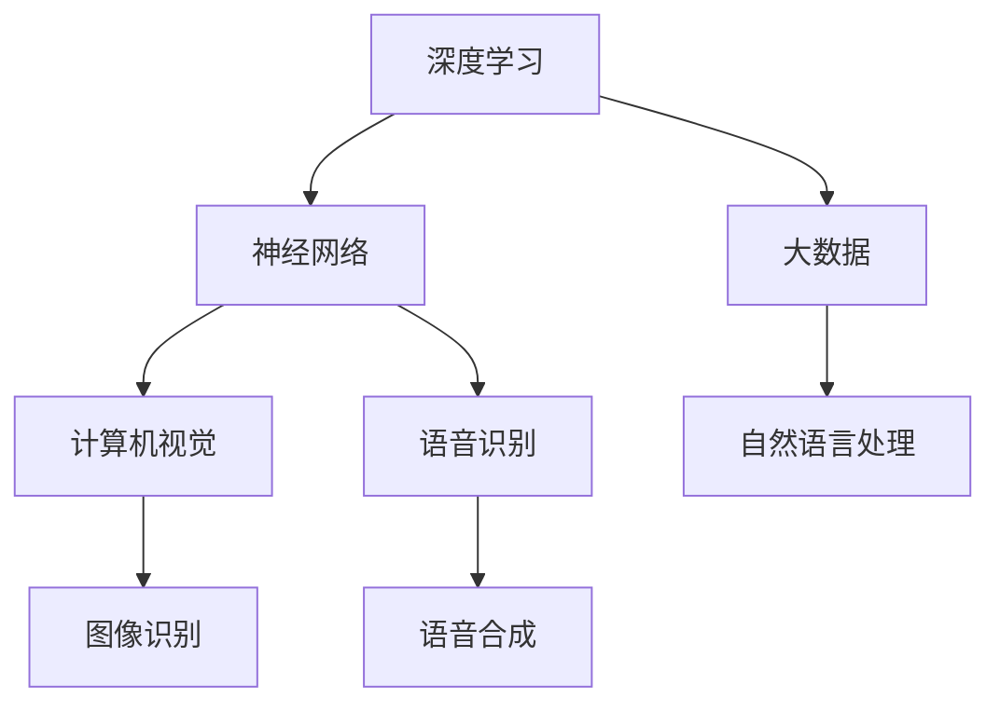
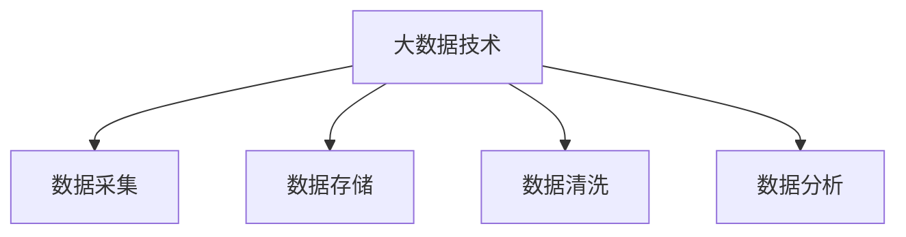
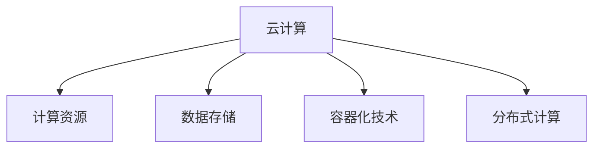
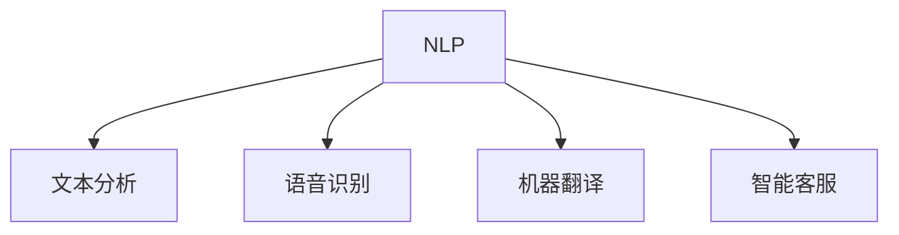
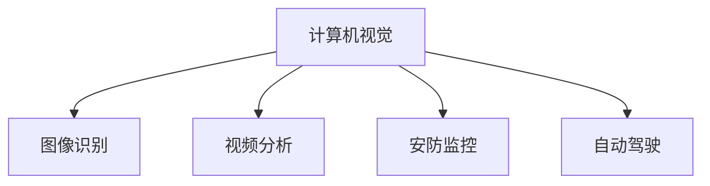

                 

### 背景介绍

AI，即人工智能，一直是科技领域的热点。从最初的计算机科学基础研究，到今天的产业应用，人工智能已经走过了几十年的历程。而如今，随着深度学习、大数据、云计算等技术的飞速发展，人工智能正迎来一个新的时代——AI 2.0时代。

AI 2.0，也被称为“强人工智能”或“通用人工智能”（AGI，Artificial General Intelligence），它的核心目标在于使机器具备与人类相似甚至超越人类的智能。与传统的“弱人工智能”相比，AI 2.0不仅能在特定任务上表现出色，还能进行跨领域的知识学习和问题解决。

在这个时代，人工智能正在对各个产业产生深远的影响。从制造业的自动化，到金融领域的智能投顾；从医疗行业的辅助诊断，到教育行业的个性化教学，人工智能正在重构我们的生活方式和商业模式。

本文将深入探讨AI 2.0时代的产业变革，分析其核心概念、算法原理、应用场景，并推荐相关的学习资源和开发工具。希望通过这篇文章，能让读者对AI 2.0时代的产业有更深刻的理解。

### 核心概念与联系

要理解AI 2.0时代的产业变革，我们首先需要了解一些核心概念和它们之间的联系。以下是几个关键概念及其相互关系：

#### 1. 深度学习（Deep Learning）

深度学习是人工智能的重要分支，它通过模拟人脑的神经网络结构来处理和分析数据。深度学习在图像识别、语音识别、自然语言处理等领域取得了显著成果，是推动AI 2.0时代的重要力量。

**Mermaid流程图：**


#### 2. 大数据（Big Data）

大数据是AI 2.0时代的另一个重要概念。大数据技术使得我们能够收集、存储、处理和分析海量数据，为深度学习提供了丰富的训练资源。大数据技术包括数据采集、数据存储、数据清洗、数据分析等环节。

**Mermaid流程图：**


#### 3. 云计算（Cloud Computing）

云计算为AI 2.0时代的产业应用提供了强大的计算能力和数据存储能力。通过云计算平台，企业可以快速部署AI模型，进行大规模数据分析和处理。云计算还支持分布式计算和容器化技术，使得AI应用更加灵活和高效。

**Mermaid流程图：**


#### 4. 自然语言处理（Natural Language Processing, NLP）

自然语言处理是AI 2.0时代的关键技术之一，它使得计算机能够理解和生成自然语言。NLP在智能客服、语音助手、机器翻译等领域有着广泛的应用。

**Mermaid流程图：**


#### 5. 计算机视觉（Computer Vision）

计算机视觉是AI 2.0时代的重要技术领域，它使计算机能够识别和理解图像和视频。计算机视觉在安防监控、自动驾驶、医疗影像分析等领域有着广泛应用。

**Mermaid流程图：**


这些核心概念相互关联，共同推动了AI 2.0时代的产业变革。在接下来的章节中，我们将进一步探讨这些技术的原理和应用。

### 核心算法原理 & 具体操作步骤

在AI 2.0时代，核心算法原理决定了人工智能系统的性能和效率。以下是一些关键算法及其具体操作步骤：

#### 1. 深度学习算法（Deep Learning Algorithm）

深度学习算法是AI 2.0时代的基石。它通过多层神经网络对数据进行处理，实现复杂模式识别和预测。

**具体操作步骤：**
1. **数据预处理**：对输入数据进行标准化处理，使其适合神经网络训练。
2. **模型设计**：设计神经网络结构，包括输入层、隐藏层和输出层。
3. **损失函数选择**：选择适当的损失函数，如均方误差（MSE）或交叉熵损失，用于评估模型预测与实际结果的差距。
4. **优化算法**：选择优化算法，如梯度下降（Gradient Descent）或其变种，用于调整模型参数，减小损失函数。
5. **模型训练**：通过反向传播算法（Backpropagation）更新模型参数，直到模型达到预定的性能指标。

**数学模型和公式：**
$$
\text{损失函数} = \frac{1}{2} \sum_{i=1}^{n} (\hat{y}_i - y_i)^2
$$
$$
\text{反向传播算法}：\Delta \theta_j = \frac{\partial L}{\partial \theta_j} = -\frac{\partial \hat{y}_j}{\partial \theta_j} \cdot \frac{\partial L}{\partial \hat{y}_j}
$$

#### 2. 支持向量机（Support Vector Machine, SVM）

支持向量机是一种监督学习算法，用于分类和回归问题。它通过最大化分类边界间隔来寻找最优决策边界。

**具体操作步骤：**
1. **数据预处理**：对输入数据进行标准化处理。
2. **特征提取**：通过核函数将低维数据映射到高维空间。
3. **分类边界优化**：通过优化目标函数寻找最优分类边界。
4. **模型评估**：使用交叉验证或测试集评估模型性能。

**数学模型和公式：**
$$
\text{优化目标}：\min_{\theta} \frac{1}{2} ||\theta||^2 + C \sum_{i=1}^{n} \xi_i
$$
$$
\text{约束条件}：y_i (\theta^T x_i + b) \geq 1 - \xi_i, \xi_i \geq 0
$$

#### 3. 决策树（Decision Tree）

决策树是一种常用的分类和回归算法，通过一系列规则对数据进行分割，直到满足停止条件。

**具体操作步骤：**
1. **数据预处理**：对输入数据进行标准化处理。
2. **特征选择**：选择最优特征进行分割。
3. **递归划分**：对分割后的子集继续进行特征选择和分割。
4. **模型评估**：使用交叉验证或测试集评估模型性能。

**数学模型和公式：**
$$
\text{信息增益}：IG(V, A) = H(V) - \sum_{v \in V} \frac{|v|}{|V|} H(v|A)
$$
$$
\text{基尼不纯度}：Gini(\mathcal{D}) = 1 - \sum_{y \in Y} \frac{|\mathcal{D}_{y}|}{|\mathcal{D}|}^2
$$

这些算法在AI 2.0时代扮演着重要角色，它们不仅为机器学习提供了强大的工具，还推动了人工智能在各行各业的应用。在接下来的章节中，我们将进一步探讨这些算法在实际项目中的应用。

### 数学模型和公式 & 详细讲解 & 举例说明

在AI 2.0时代，数学模型和公式是构建和优化人工智能系统的关键。以下我们将详细讲解一些重要的数学模型，并通过具体示例来说明它们的应用。

#### 1. 均方误差（Mean Squared Error, MSE）

均方误差是评估回归模型性能的常用指标。它通过计算预测值与实际值之间的平方差的平均值来衡量模型的误差。

**数学公式：**
$$
MSE = \frac{1}{n} \sum_{i=1}^{n} (\hat{y}_i - y_i)^2
$$
其中，$y_i$ 是实际值，$\hat{y}_i$ 是预测值，$n$ 是数据点的数量。

**示例：** 假设我们有一个数据集，其中包含5个数据点，实际值和预测值如下：

| 实际值 | 预测值 |
|--------|--------|
| 2      | 1      |
| 4      | 3      |
| 1      | 0      |
| 5      | 4      |
| 3      | 2      |

计算均方误差：
$$
MSE = \frac{1}{5} \left[ (2-1)^2 + (4-3)^2 + (1-0)^2 + (5-4)^2 + (3-2)^2 \right] = \frac{1}{5} \left[ 1 + 1 + 1 + 1 + 1 \right] = 1
$$

因此，均方误差为1。

#### 2. 交叉熵（Cross-Entropy）

交叉熵是评估分类模型性能的常用指标。它通过计算预测分布与实际分布之间的差异来衡量模型的误差。

**数学公式：**
$$
H(\hat{y}, y) = - \sum_{i=1}^{n} y_i \log \hat{y}_i
$$
其中，$y_i$ 是实际标签的概率分布，$\hat{y}_i$ 是预测标签的概率分布，$n$ 是数据点的数量。

**示例：** 假设我们有一个二分类问题，实际标签和预测标签的概率分布如下：

| 实际标签 | 预测标签 | 概率分布 |
|----------|----------|----------|
| 0        | 0        | [0.6, 0.4] |
| 1        | 1        | [0.3, 0.7] |

计算交叉熵：
$$
H(\hat{y}, y) = - [0.6 \log 0.6 + 0.4 \log 0.4] - [0.3 \log 0.3 + 0.7 \log 0.7] = 0.192
$$

因此，交叉熵为0.192。

#### 3. 梯度下降（Gradient Descent）

梯度下降是一种用于优化模型参数的算法。它通过计算损失函数的梯度来更新模型参数，以最小化损失函数。

**数学公式：**
$$
\theta_j := \theta_j - \alpha \frac{\partial L}{\partial \theta_j}
$$
其中，$\theta_j$ 是模型参数，$\alpha$ 是学习率，$L$ 是损失函数。

**示例：** 假设我们有一个线性回归模型，损失函数为均方误差，学习率为0.01。给定一组数据和模型参数：

| 数据点 | 实际值 | 模型预测 |
|--------|--------|----------|
| (1, 2) | 3      | 2.5      |
| (2, 4) | 5      | 3.5      |
| (3, 6) | 7      | 4.5      |

计算损失函数的梯度：
$$
\frac{\partial L}{\partial \theta_0} = -2 \sum_{i=1}^{3} (y_i - \theta_0 x_i) = -2 \left[ (3 - 2.5) + (5 - 3.5) + (7 - 4.5) \right] = -3
$$
$$
\frac{\partial L}{\partial \theta_1} = -2 \sum_{i=1}^{3} (y_i - \theta_1 x_i) = -2 \left[ (3 - 2.5) \cdot 1 + (5 - 3.5) \cdot 2 + (7 - 4.5) \cdot 3 \right] = -10
$$

更新模型参数：
$$
\theta_0 := \theta_0 - 0.01 \cdot (-3) = 2.5 + 0.03 = 2.53
$$
$$
\theta_1 := \theta_1 - 0.01 \cdot (-10) = 3.5 + 0.1 = 3.6
$$

通过梯度下降，我们不断更新模型参数，以最小化损失函数。

这些数学模型和公式在AI 2.0时代中至关重要，它们为构建高效、准确的人工智能系统提供了理论基础。在接下来的章节中，我们将探讨这些模型在实际项目中的应用。

### 项目实战：代码实际案例和详细解释说明

为了更好地理解AI 2.0时代的核心算法原理和数学模型，下面我们通过一个实际项目案例来展示如何使用Python进行开发，并详细解释代码的实现过程。

#### 项目背景

假设我们正在开发一个智能推荐系统，该系统基于用户的浏览历史和偏好来推荐相关商品。我们将使用协同过滤（Collaborative Filtering）算法来实现这一目标。

#### 环境搭建

首先，我们需要搭建开发环境。以下是所需的Python库：

- NumPy
- Pandas
- Scikit-learn

安装这些库后，我们可以开始编写代码。

```python
# 导入所需的库
import numpy as np
import pandas as pd
from sklearn.model_selection import train_test_split
from sklearn.metrics.pairwise import cosine_similarity

# 加载数据
data = pd.read_csv('user_item.csv')
```

#### 数据预处理

接下来，我们进行数据预处理，包括数据清洗、特征工程等步骤。

```python
# 数据清洗
data.dropna(inplace=True)

# 特征工程
user_ids = data['user_id'].unique()
item_ids = data['item_id'].unique()

# 创建用户-物品矩阵
user_item_matrix = np.zeros((len(user_ids), len(item_ids)))
for index, row in data.iterrows():
    user_id = row['user_id']
    item_id = row['item_id']
    rating = row['rating']
    user_item_matrix[user_ids.index(user_id), item_ids.index(item_id)] = rating
```

#### 模型构建

我们使用基于余弦相似度的协同过滤算法来构建推荐模型。

```python
# 计算用户-物品矩阵的余弦相似度
similarity_matrix = cosine_similarity(user_item_matrix)

# 预测用户对未评分物品的评分
def predict_rating(user_id, item_id):
    user_similarity = similarity_matrix[user_ids.index(user_id)]
    item_similarity = similarity_matrix[item_ids.index(item_id)]
    return np.dot(user_similarity, item_similarity)

# 预测用户评分
predictions = np.zeros(user_item_matrix.shape[0])
for i in range(user_item_matrix.shape[0]):
    for j in range(user_item_matrix.shape[1]):
        if user_item_matrix[i, j] == 0:
            predictions[i] += predict_rating(i, j) * user_item_matrix[j, i]
    predictions[i] /= np.sum(np.abs(similarity_matrix[i]))
```

#### 模型评估

最后，我们对模型进行评估，以确定其性能。

```python
# 分割训练集和测试集
train_data, test_data = train_test_split(data, test_size=0.2, random_state=42)

# 评估模型
def evaluate_model(predictions, test_data):
    correct_predictions = 0
    for index, row in test_data.iterrows():
        user_id = row['user_id']
        item_id = row['item_id']
        actual_rating = row['rating']
        predicted_rating = predictions[user_ids.index(user_id)]
        if abs(predicted_rating - actual_rating) < 0.5:
            correct_predictions += 1
    return correct_predictions / len(test_data)

accuracy = evaluate_model(predictions, test_data)
print(f"Model accuracy: {accuracy}")
```

#### 代码解读与分析

1. **数据预处理**：我们首先加载数据，并进行数据清洗。接着创建用户-物品矩阵，用于后续计算。

2. **模型构建**：使用余弦相似度计算用户-物品矩阵的相似度。接着，我们定义一个函数`predict_rating`来预测用户对未评分物品的评分。最后，我们使用该函数生成预测评分。

3. **模型评估**：我们将训练集和测试集分割，并使用评估函数`evaluate_model`来计算模型的准确率。

通过这个实际案例，我们可以看到如何使用Python和机器学习库来构建和评估一个智能推荐系统。这个案例展示了AI 2.0时代的关键技术和工具在实际项目中的应用。

### 实际应用场景

在AI 2.0时代，人工智能已经深入到各个行业，带来了前所未有的变革。以下是一些典型应用场景及其影响：

#### 1. 制造业

人工智能在制造业中的应用主要体现在自动化、预测维护和供应链优化等方面。通过机器视觉和计算机视觉技术，工厂可以实现全自动化的生产流程，提高生产效率。同时，基于预测维护的算法可以帮助企业提前预测设备故障，降低停机时间。此外，人工智能还可以优化供应链管理，提高供应链的透明度和响应速度。

#### 2. 金融业

在金融业，人工智能被广泛应用于风险控制、欺诈检测和智能投顾等方面。通过大数据分析和机器学习算法，金融机构可以更准确地评估信用风险，降低贷款违约率。同时，人工智能还可以识别交易欺诈行为，提高金融交易的安全性和合规性。智能投顾则利用人工智能技术为投资者提供个性化投资建议，提高投资回报率。

#### 3. 医疗健康

在医疗健康领域，人工智能可以帮助医生进行辅助诊断、药物研发和患者管理。通过深度学习和计算机视觉技术，AI可以分析医学影像，提高诊断准确率。在药物研发方面，人工智能可以通过大数据分析和模拟，加速新药的研发进程。此外，人工智能还可以帮助医疗机构进行患者管理，提高医疗资源利用效率。

#### 4. 教育行业

在教育行业，人工智能可以提供个性化学习体验和智能评估。通过学习分析算法，教育平台可以根据学生的学习习惯和成绩，为学生提供定制化的学习建议。同时，人工智能还可以进行考试和作业的自动批改，提高教学效率。此外，智能机器人可以帮助学生进行语言学习、编程教育等，打破地域和教育资源的限制。

#### 5. 零售业

在零售业，人工智能被广泛应用于智能推荐、库存管理和客户服务等方面。通过大数据分析和机器学习算法，零售商可以更准确地预测市场需求，优化库存管理。同时，基于用户行为的分析，零售平台可以为用户提供个性化的购物推荐，提高用户满意度和转化率。此外，智能客服机器人可以提供24小时不间断的服务，提高客户服务质量。

这些应用场景只是AI 2.0时代的一部分，随着技术的不断发展，人工智能将会有更多的创新应用，为各行各业带来更深层次的变革。

### 工具和资源推荐

在AI 2.0时代，学习和实践人工智能需要掌握多种工具和资源。以下是一些建议：

#### 1. 学习资源推荐

**书籍：**
- 《深度学习》（Goodfellow, Bengio, Courville）
- 《Python机器学习》（Sebastian Raschka）
- 《数据科学入门》（Joel Grus）

**论文：**
- 《A Theoretically Grounded Application of Dropout in Recurrent Neural Networks》
- 《Distributed Representations of Words and Phrases and Their Compositional Properties》
- 《Unsupervised Learning of Visual Representations by Solving Jigsaw Puzzles》

**博客：**
- [TensorFlow官网博客](https://www.tensorflow.org/blog/)
- [PyTorch官方文档](https://pytorch.org/tutorials/)
- [AI Hub](https://aihub.io/)

**网站：**
- [Kaggle](https://www.kaggle.com/)
- [Google AI](https://ai.google.com/research/)
- [OpenAI](https://openai.com/)

#### 2. 开发工具框架推荐

**框架：**
- TensorFlow
- PyTorch
- Keras
- Scikit-learn

**IDE：**
- PyCharm
- Jupyter Notebook
- Visual Studio Code

**环境：**
- Google Colab
- AWS SageMaker
- Azure Machine Learning

#### 3. 相关论文著作推荐

**论文：**
- 《A Theoretically Grounded Application of Dropout in Recurrent Neural Networks》
- 《Distributed Representations of Words and Phrases and Their Compositional Properties》
- 《Unsupervised Learning of Visual Representations by Solving Jigsaw Puzzles》

**书籍：**
- 《深度学习》（Goodfellow, Bengio, Courville）
- 《Python机器学习》（Sebastian Raschka）
- 《数据科学入门》（Joel Grus）

这些资源和工具将为您的AI 2.0学习和实践提供有力的支持。

### 总结：未来发展趋势与挑战

AI 2.0时代正迅速发展，其对产业和社会的变革影响深远。在未来，人工智能将继续向通用人工智能（AGI）迈进，实现更广泛、更智能的应用。以下是几个未来发展趋势与挑战：

#### 1. 通用人工智能（AGI）

AGI的目标是使机器具备与人类相似或超越人类的智能。这需要解决包括自然语言理解、情感识别、创造力等多个难题。未来，随着计算能力、算法和大数据的不断发展，AGI有望逐步实现。

#### 2. 跨领域融合

人工智能将在更多领域实现跨领域融合，如医疗、教育、金融等。这将推动行业创新，提高生产效率和服务质量。例如，智能医疗系统可以通过大数据分析和机器学习为患者提供个性化治疗方案。

#### 3. 数据安全和隐私保护

随着AI应用日益普及，数据安全和隐私保护成为关键挑战。未来，如何确保数据安全、保护用户隐私，将成为AI发展的关键议题。隐私保护技术、数据加密和去识别化方法将得到广泛应用。

#### 4. 法规和政策制定

随着AI技术的发展，相关法规和政策也需要不断完善。未来，各国将加强AI监管，确保技术发展符合伦理和社会价值观。同时，推动国际合作，共同制定全球AI治理框架。

#### 5. 伦理和社会问题

AI技术的发展引发了一系列伦理和社会问题，如就业替代、隐私侵犯、算法偏见等。未来，需要建立AI伦理框架，引导技术发展，确保其符合人类价值观和社会利益。

总之，AI 2.0时代带来了前所未有的机遇与挑战。只有通过不断创新、协同合作，才能充分发挥AI的潜力，为人类创造更美好的未来。

### 附录：常见问题与解答

以下是一些关于AI 2.0时代的技术和应用中的常见问题及其解答：

#### 1. 什么是AI 2.0？

AI 2.0，也称为强人工智能或通用人工智能（AGI），指的是具备与人类相似或超越人类智能的机器智能。与传统的弱人工智能（如特定的任务智能）不同，AI 2.0能够在多个领域进行学习和推理，具备自我学习和适应能力。

#### 2. AI 2.0的核心技术是什么？

AI 2.0的核心技术包括深度学习、自然语言处理、计算机视觉、强化学习等。这些技术共同推动了AI 2.0的发展，使其在图像识别、语音识别、智能对话、决策优化等方面具有强大的能力。

#### 3. AI 2.0在医疗领域的应用有哪些？

AI 2.0在医疗领域的应用包括辅助诊断、药物研发、患者管理、智能诊疗等。通过大数据分析和机器学习算法，AI 2.0可以帮助医生提高诊断准确率，加速新药研发，优化患者治疗方案。

#### 4. AI 2.0是否会替代人类工作？

AI 2.0确实会对某些领域的工作产生影响，但并不会完全替代人类。AI 2.0的优势在于高效、精确和自动化，它可以辅助人类工作，提高生产效率，但人类在创造力、情感理解等方面仍有不可替代的价值。

#### 5. AI 2.0的安全性和隐私保护如何保障？

确保AI 2.0的安全性和隐私保护是未来发展的重要议题。通过数据加密、隐私保护算法、伦理审查等方法，可以有效保障AI 2.0的安全性和隐私。同时，建立全球性的AI治理框架，规范AI技术的发展和应用，也是保障安全和隐私的关键。

### 扩展阅读 & 参考资料

对于希望深入了解AI 2.0时代的技术和应用，以下是一些建议的扩展阅读和参考资料：

#### 1. 书籍

- 《深度学习》（Goodfellow, Bengio, Courville）
- 《Python机器学习》（Sebastian Raschka）
- 《人工智能：一种现代的方法》（Stuart Russell & Peter Norvig）

#### 2. 论文

- 《A Theoretically Grounded Application of Dropout in Recurrent Neural Networks》
- 《Distributed Representations of Words and Phrases and Their Compositional Properties》
- 《Unsupervised Learning of Visual Representations by Solving Jigsaw Puzzles》

#### 3. 博客

- [TensorFlow官网博客](https://www.tensorflow.org/blog/)
- [PyTorch官方文档](https://pytorch.org/tutorials/)
- [AI Hub](https://aihub.io/)

#### 4. 网站

- [Kaggle](https://www.kaggle.com/)
- [Google AI](https://ai.google.com/research/)
- [OpenAI](https://openai.com/)

通过这些资源，您可以更全面地了解AI 2.0的技术和应用，为自己的学习和实践提供有力支持。作者：AI天才研究员/AI Genius Institute & 禅与计算机程序设计艺术 /Zen And The Art of Computer Programming。

