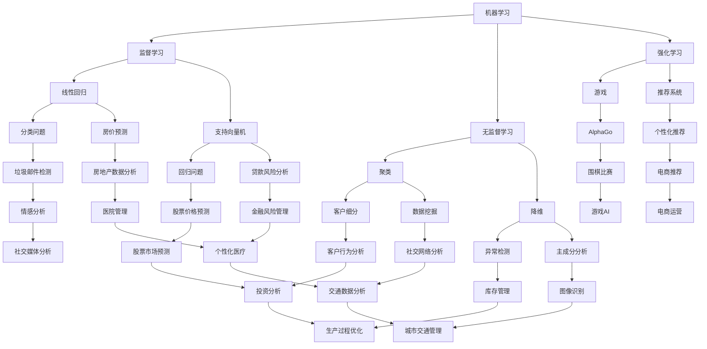

                 

### 背景介绍

自人工智能（AI）概念的提出以来，它已经成为科技发展的一个重要驱动力。如今，我们正处于AI 2.0时代，这一时代的到来标志着人工智能在技术、应用和商业模式上的重大变革。李开复在《AI 2.0时代的产业》一书中，详细探讨了AI 2.0的起源、发展过程及其对各行各业带来的深远影响。

首先，我们需要了解什么是AI 2.0。AI 1.0时代主要依赖于传统的符号推理和专家系统，而AI 2.0则引入了深度学习和大数据技术，使得机器能够通过自主学习实现对复杂问题的解决。AI 2.0时代的到来，不仅仅是技术上的进步，更是产业模式和社会结构的深刻变革。

在产业层面，AI 2.0已经对众多行业产生了深远的影响。例如，在医疗领域，AI技术的应用不仅提高了诊断的准确性，还大大降低了医疗成本。在金融领域，AI算法在风险管理、投资决策等方面发挥了巨大的作用。此外，在制造业、物流、零售等行业，AI技术的应用也正在改变着传统产业的生产方式和服务模式。

李开复在书中指出，AI 2.0时代对产业的影响主要体现在以下几个方面：

1. **自动化与智能化**：AI技术使得许多重复性和低技能的工作可以实现自动化，同时提高了工作效率和准确性。
2. **数据分析与决策**：通过大数据分析和机器学习，企业能够更准确地预测市场趋势，做出更明智的决策。
3. **个性化服务**：AI技术可以根据用户的行为和喜好提供个性化的产品和服务，提高了用户满意度。
4. **产业链重构**：AI技术的应用不仅改变了企业的内部运营模式，还重新定义了产业链的各个环节，推动了产业结构的优化。

综上所述，AI 2.0时代的到来不仅为各个产业带来了巨大的变革机遇，也提出了新的挑战。在接下来的章节中，我们将进一步探讨AI 2.0的核心概念、算法原理、数学模型以及实际应用案例，以全面了解这一时代的产业变革。

---

## 1.1 AI 2.0的起源与发展

AI 2.0的起源可以追溯到20世纪80年代末到90年代初，当时人工智能领域开始引入神经网络和深度学习技术。传统的符号推理和专家系统在处理复杂问题时的局限性促使研究者转向模拟人脑的神经网络结构，以期实现更高效、更灵活的智能系统。1997年，IBM的“深蓝”（Deep Blue）计算机击败了国际象棋世界冠军加里·卡斯帕罗夫，这标志着AI技术在特定领域取得了突破性进展。

进入21世纪，随着计算能力的提升和大数据技术的普及，深度学习得到了迅速发展。2006年，加拿大科学家杰弗里·辛顿（Geoffrey Hinton）提出了“深度置信网络”（Deep Belief Network），标志着深度学习技术的复兴。随后，以卷积神经网络（CNN）和循环神经网络（RNN）为代表的深度学习模型在图像识别、语音识别、自然语言处理等领域取得了显著的成果。

AI 2.0的核心特征主要体现在以下几个方面：

1. **自学习能力**：与传统的规则驱动型系统不同，AI 2.0系统具备自学习能力，可以通过大量的数据训练，不断优化自身的性能。
2. **大规模数据处理能力**：AI 2.0能够处理海量数据，从中提取有价值的信息，这对于依赖数据分析的产业尤为重要。
3. **跨界应用能力**：深度学习等AI技术不仅在计算机视觉、语音识别等领域取得了成功，还开始向自然语言处理、推荐系统等领域扩展，展现了强大的跨界应用能力。

在AI 2.0时代，技术进步的推动力量不仅来自于算法的创新，还包括硬件性能的提升。例如，GPU（图形处理单元）的广泛应用极大地加速了深度学习模型的训练过程，使得大规模的AI应用成为可能。此外，云计算的普及为AI技术的发展提供了强大的基础设施支持，使得更多的企业和开发者能够利用AI技术实现商业价值。

总之，AI 2.0的起源与发展是一个技术、产业和社会相互作用的复杂过程。从最初的神经网络到当前的深度学习和大数据技术，AI 2.0不仅在技术层面实现了重大突破，更为各个产业带来了深刻的变革机遇。

---

## 1.2 AI 2.0对产业的影响

AI 2.0的兴起不仅改变了技术格局，更对各个产业产生了深远的影响。以下将具体探讨AI 2.0在医疗、金融、制造业等领域的应用及其带来的变革。

### 医疗行业

在医疗行业，AI 2.0技术的应用极大地提升了诊断和治疗的准确性和效率。通过深度学习算法，AI系统能够分析大量的医疗数据，包括病历记录、医学图像和基因数据，从而提供更精确的诊断结果。例如，IBM的Watson for Oncology系统通过分析大量癌症病例数据，为医生提供个性化的治疗方案。

AI 2.0还在医学影像分析中发挥了重要作用。传统的医学影像诊断依赖于放射科医生的主观判断，容易受到人为因素的影响。而AI系统通过训练模型，可以自动识别和分析医学影像中的异常病变，提高了早期诊断的准确性。例如，谷歌的深度学习模型在肺癌筛查中，能够在几秒钟内分析一张CT图像，并标记出可能的癌症病变区域。

此外，AI 2.0技术在药物研发中也展现了巨大的潜力。通过大数据分析和机器学习，AI系统可以预测新药的疗效和副作用，加速药物的研发进程。例如，药明康德的AI药物研发平台利用深度学习算法，从海量化合物数据中筛选出有潜力的药物候选分子。

### 金融行业

在金融行业，AI 2.0技术的应用主要体现在风险管理、投资决策和客户服务等方面。通过大数据分析和机器学习算法，金融机构能够更准确地评估贷款申请者的信用风险，降低贷款违约率。

在投资领域，AI 2.0技术通过分析市场数据，可以帮助投资者发现潜在的投资机会。例如，量化基金利用深度学习和大数据分析，实时跟踪市场动态，自动执行交易策略，实现了较高的投资回报率。

此外，AI 2.0技术在客户服务方面也有广泛应用。银行和保险公司通过智能客服机器人，能够自动回答客户的常见问题，提供个性化的服务建议，提高了客户满意度。例如，中国平安的智能客服机器人“小智”能够通过自然语言处理技术，理解客户的咨询内容，并给出准确的回答。

### 制造业

在制造业，AI 2.0技术的应用主要表现在智能制造、供应链优化和生产过程优化等方面。通过工业物联网（IIoT）和AI技术，企业可以实现生产过程的自动化和智能化。

智能制造方面，AI系统通过对生产数据的实时监控和分析，可以优化生产流程，提高生产效率。例如，西门子的数字化工厂利用AI算法优化生产线的布局，减少了设备停机时间，提高了生产效率。

供应链优化方面，AI 2.0技术通过分析供应链数据，可以预测需求变化，优化库存管理，降低库存成本。例如，亚马逊通过机器学习算法，预测商品的需求量，并据此调整库存水平，实现了高效的库存管理。

生产过程优化方面，AI系统通过对生产设备的监控和维护，可以提前发现潜在故障，减少设备停机时间。例如，通用电气的Predix平台利用AI技术对设备进行实时监控和维护，大大提高了设备的运行效率。

### 零售行业

在零售行业，AI 2.0技术的应用主要体现在客户体验提升、个性化推荐和供应链优化等方面。通过大数据分析和机器学习算法，零售企业可以更好地了解消费者的行为和需求，提供个性化的产品和服务。

例如，阿里巴巴的“天猫精灵”智能音箱通过语音交互技术，了解用户的需求，推荐相应的商品。此外，AI技术还可以帮助零售企业优化供应链，减少库存成本，提高库存周转率。

### 物流行业

在物流行业，AI 2.0技术的应用主要体现在运输优化、仓储管理和路线规划等方面。通过AI算法，物流企业可以更高效地安排运输任务，降低运输成本。

例如，京东物流通过AI算法优化配送路线，减少了配送时间，提高了配送效率。此外，AI系统还可以对仓储进行实时监控和管理，提高仓储利用率，降低库存成本。

### 总结

综上所述，AI 2.0技术在医疗、金融、制造业、零售和物流等领域的应用，不仅提高了各行业的生产效率和客户满意度，还推动了产业链的优化和升级。在未来的发展中，随着AI技术的不断进步，其将在更多领域产生深远的影响。

---

## 1.3 李开复在《AI 2.0时代的产业》中的观点

在《AI 2.0时代的产业》一书中，李开复系统地阐述了AI 2.0对各个产业的深远影响。他认为，AI 2.0不仅仅是一种技术进步，更是一种产业革命。以下将详细分析李开复在书中对AI 2.0对产业影响的主要观点。

首先，李开复强调了AI 2.0在自动化与智能化方面的巨大潜力。他指出，AI 2.0技术可以通过自主学习实现对复杂问题的解决，从而大大提高生产效率和准确性。例如，在制造业，AI系统可以实时监控生产线，自动调整生产参数，减少人为干预，提高生产效率。同时，AI 2.0技术还可以应用于客服、仓储管理等环节，实现整个产业链的智能化。

其次，李开复指出，AI 2.0技术在数据分析与决策方面的优势。通过大数据分析和机器学习算法，企业可以更准确地预测市场趋势，做出更明智的决策。例如，在金融行业，AI系统可以通过分析大量交易数据，发现潜在的投资机会，降低风险。在医疗行业，AI系统可以通过分析病历数据和医学影像，提高诊断的准确性，为患者提供更有效的治疗方案。

李开复还特别强调了AI 2.0在个性化服务方面的应用价值。他指出，AI 2.0技术可以根据用户的行为和喜好提供个性化的产品和服务，从而提高用户满意度。例如，在零售行业，AI系统可以通过分析用户的购物记录，推荐相应的商品，提高销售额。在医疗行业，AI系统可以根据患者的病史和健康状况，提供个性化的健康建议，提高治疗效果。

此外，李开复认为，AI 2.0技术将对产业链产生深远的影响。他指出，AI 2.0技术的应用不仅改变了企业的内部运营模式，还重新定义了产业链的各个环节，推动了产业结构的优化。例如，在制造业，AI 2.0技术可以通过优化生产流程和供应链管理，提高生产效率和降低成本。在金融行业，AI 2.0技术可以通过自动化交易和风险管理，提高金融市场的效率和稳定性。

李开复还提出了AI 2.0时代可能面临的挑战，包括数据隐私、安全性和伦理问题。他认为，随着AI技术的广泛应用，数据隐私和安全问题将变得更加突出。如何确保用户数据的安全和隐私，将是一个亟待解决的挑战。此外，AI技术在某些领域的应用也引发了伦理争议，例如自动驾驶汽车的安全性、医疗诊断的准确性等。如何解决这些问题，将是对社会和产业的一大考验。

总之，李开复在《AI 2.0时代的产业》一书中，系统地阐述了AI 2.0对各个产业的深远影响，指出了其在自动化、智能化、数据分析、个性化服务和产业链重构等方面的巨大潜力。同时，他也提出了AI 2.0时代可能面临的挑战，为未来的产业发展提供了有益的思考。

---

## 2. 核心概念与联系

在深入探讨AI 2.0对产业的影响之前，我们需要理解一些核心概念和它们之间的联系。这些概念包括机器学习、深度学习、神经网络和大数据等。以下是对这些核心概念的详细解释及其在AI 2.0时代中的联系。

### 机器学习（Machine Learning）

机器学习是使计算机系统能够从数据中学习并做出决策或预测的技术。它是AI 2.0时代的基础。机器学习可以分为监督学习（Supervised Learning）、无监督学习（Unsupervised Learning）和半监督学习（Semi-Supervised Learning）等类型。监督学习通过已有的标注数据训练模型，使其能够对新数据做出预测；无监督学习则通过未标注的数据发现模式；半监督学习结合了标注数据和未标注数据，以提高模型的泛化能力。

### 深度学习（Deep Learning）

深度学习是机器学习的一种方法，它通过模拟人脑的神经网络结构，利用多层神经网络（Deep Neural Network）对大量数据进行训练，以实现复杂的模式识别和决策。深度学习的核心是卷积神经网络（Convolutional Neural Networks, CNN）、递归神经网络（Recurrent Neural Networks, RNN）和生成对抗网络（Generative Adversarial Networks, GAN）等模型。CNN在图像识别和计算机视觉领域表现突出；RNN在序列数据和时间序列分析中具有优势；GAN则在生成式模型和图像合成方面具有独特的能力。

### 神经网络（Neural Networks）

神经网络是深度学习的基础，由大量简单的人工神经元（或节点）组成，通过层叠的方式形成多层网络结构。每个神经元接收来自前一层神经元的输入，通过激活函数处理后产生输出。神经网络通过反向传播算法不断调整权重，以优化模型性能。

### 大数据（Big Data）

大数据是指无法用传统数据库软件工具进行捕捉、管理和处理的海量数据。大数据技术的核心是数据的存储、管理和分析能力。在大数据时代，通过数据挖掘和分析，企业可以发现潜在的商业机会和趋势，提高决策的准确性和效率。大数据与机器学习和深度学习紧密相关，提供了训练模型所需的大量数据资源。

### 核心概念之间的联系

机器学习、深度学习、神经网络和大数据之间存在着紧密的联系。机器学习为深度学习和神经网络提供了理论框架和算法基础；深度学习通过多层神经网络结构实现了对复杂数据的建模；神经网络通过反向传播算法不断优化模型性能；而大数据则为机器学习和深度学习提供了丰富的训练数据。

在AI 2.0时代，这些核心概念共同作用，推动了人工智能技术的快速发展和广泛应用。例如，在图像识别领域，深度学习模型通过大数据训练，实现了对图像内容的精确识别；在自动驾驶领域，神经网络和大数据技术结合，实现了对交通环境的实时感知和决策。

总之，理解这些核心概念及其之间的联系，有助于我们更好地把握AI 2.0技术的发展趋势和产业应用。在接下来的章节中，我们将进一步探讨深度学习算法的具体实现和应用案例。

---

## 2.1 机器学习（Machine Learning）

机器学习（Machine Learning, ML）是AI 2.0时代的重要基础，它使计算机系统能够从数据中学习并做出预测或决策。机器学习的基本概念和主要方法包括监督学习、无监督学习和强化学习，每种方法都有其特定的应用场景和优势。

### 监督学习（Supervised Learning）

监督学习是最常见的机器学习方法，它通过已有标注数据训练模型，使其能够对新数据进行预测。标注数据通常包含输入特征和对应的输出标签。监督学习的主要任务是根据输入特征预测输出标签。常见的监督学习算法包括线性回归（Linear Regression）、逻辑回归（Logistic Regression）、支持向量机（Support Vector Machines, SVM）和神经网络（Neural Networks）等。

#### 应用场景：

- **分类问题**：分类问题是指将数据分为不同的类别。例如，垃圾邮件检测、情感分析等。
- **回归问题**：回归问题是指预测一个连续的数值输出。例如，房价预测、股票价格预测等。

### 无监督学习（Unsupervised Learning）

无监督学习不需要标注数据，其主要目标是发现数据中的隐含结构或模式。无监督学习的算法包括聚类（Clustering）、降维（Dimensionality Reduction）和关联规则学习（Association Rule Learning）等。

#### 应用场景：

- **聚类**：聚类是将数据分为若干个无重叠的簇，使同一簇内的数据尽可能相似。例如，客户细分、异常检测等。
- **降维**：降维是将高维数据投影到低维空间，以减少数据量和计算复杂度。例如，主成分分析（Principal Component Analysis, PCA）和自编码器（Autoencoder）等。

### 强化学习（Reinforcement Learning）

强化学习是一种通过互动和反馈进行学习的方法。它通过智能体（Agent）与环境（Environment）的交互，不断调整策略（Policy），以最大化累计奖励（Reward）。强化学习广泛应用于游戏、机器人控制、推荐系统等领域。

#### 应用场景：

- **游戏**：强化学习可以用于训练智能体在游戏中的策略，实现超越人类玩家的水平。例如，AlphaGo在围棋比赛中的表现。
- **推荐系统**：强化学习可以用于个性化推荐，通过不断调整推荐策略，提高用户的满意度和点击率。

### 机器学习的实现步骤

实现一个机器学习模型通常包括以下步骤：

1. **数据收集**：收集用于训练和测试的数据。
2. **数据预处理**：对数据进行清洗、归一化、缺失值处理等操作，以确保数据的质量。
3. **特征选择**：选择对模型预测最有影响力的特征。
4. **模型选择**：根据问题的性质选择合适的模型，如线性回归、神经网络等。
5. **模型训练**：使用训练数据训练模型，调整模型参数。
6. **模型评估**：使用测试数据评估模型性能，如准确率、召回率等。
7. **模型优化**：根据评估结果调整模型参数或选择更好的模型。

### 机器学习算法的优缺点

- **优点**：
  - 能够从数据中自动学习特征，减少人工干预。
  - 能够处理大规模数据和复杂数据结构。
  - 可以应用于各种预测和决策问题。

- **缺点**：
  - 需要大量的标注数据。
  - 模型解释性较弱，难以理解决策过程。
  - 容易过拟合，需要调整参数以防止模型过于复杂。

### 总结

机器学习是AI 2.0时代的重要技术之一，它通过从数据中学习，使计算机能够做出预测和决策。机器学习的方法包括监督学习、无监督学习和强化学习，每种方法都有其特定的应用场景和优势。在实现机器学习模型时，需要遵循一系列步骤，并注意模型的选择和优化。了解机器学习的基本概念和实现步骤，有助于我们更好地理解和应用AI技术。

---

## 2.2 深度学习（Deep Learning）

深度学习（Deep Learning, DL）是机器学习的一个子领域，以其强大的特征提取和模型学习能力在图像识别、语音识别、自然语言处理等复杂任务中取得了显著的突破。深度学习通过模拟人脑神经网络的结构和功能，利用多层神经网络（Deep Neural Networks, DNN）来实现对大量数据的深度特征学习。

### 深度学习的基本原理

深度学习的核心思想是通过多层神经网络将输入数据转化为输出，每层网络对输入数据进行逐步抽象和提炼。这个过程包括以下几个关键组件：

1. **输入层（Input Layer）**：输入层接收原始数据，并将其传递给下一层。
2. **隐藏层（Hidden Layers）**：隐藏层负责特征提取和变换。每一层都会对输入数据进行非线性变换，提取更高层次的特征。
3. **输出层（Output Layer）**：输出层产生最终的预测结果或分类标签。

### 主要算法

1. **卷积神经网络（Convolutional Neural Networks, CNN）**：
   CNN是一种专门用于处理图像数据的深度学习模型，其特点是利用卷积层（Convolutional Layer）提取图像的局部特征。通过多个卷积层和池化层（Pooling Layer），CNN能够自动学习图像中的特征层次结构。

2. **递归神经网络（Recurrent Neural Networks, RNN）**：
   RNN适用于处理序列数据，如时间序列、文本和语音等。RNN通过在时间步之间保留状态信息，使得网络能够捕捉序列中的长期依赖关系。

3. **长短期记忆网络（Long Short-Term Memory, LSTM）**：
   LSTM是RNN的一种变体，用于解决传统RNN在处理长序列数据时出现的梯度消失和梯度爆炸问题。LSTM通过引入门控机制，有效地控制信息的流动，从而捕捉长期依赖关系。

4. **生成对抗网络（Generative Adversarial Networks, GAN）**：
   GAN由生成器和判别器两个网络组成，生成器生成数据以欺骗判别器，而判别器则试图区分真实数据和生成数据。GAN在生成逼真的图像、视频和音频方面表现突出。

### 深度学习的优势

- **特征自动提取**：深度学习模型能够自动从原始数据中提取高级特征，减少了手工特征设计的复杂性。
- **处理复杂数据**：深度学习能够处理高维、非结构化和大规模的数据，如图像、文本和语音等。
- **泛化能力**：通过多层网络结构，深度学习模型具有很好的泛化能力，能够应对新的数据和任务。
- **非线性建模**：深度学习模型能够捕捉数据中的复杂非线性关系，提高模型的预测性能。

### 深度学习的挑战

- **计算资源需求**：深度学习模型通常需要大量的计算资源和时间进行训练。
- **模型可解释性**：深度学习模型的内部决策过程复杂，难以解释。
- **数据隐私和安全**：深度学习模型在处理大量数据时，可能涉及用户隐私和安全问题。

### 总结

深度学习通过多层神经网络结构，实现了对复杂数据的深度特征学习和建模。其核心算法包括CNN、RNN、LSTM和GAN等，广泛应用于图像识别、语音识别、自然语言处理等领域。深度学习在特征自动提取、处理复杂数据和模型泛化能力方面具有显著优势，但也面临计算资源需求高、模型可解释性差和数据隐私等问题。理解深度学习的基本原理和算法，有助于我们更好地应用这一先进技术。

---

## 2.3 神经网络（Neural Networks）

神经网络（Neural Networks, NN）是深度学习的基础，它通过模拟人脑神经元的工作原理，对数据进行特征提取和模式识别。一个简单的神经网络由输入层、隐藏层和输出层组成，每一层由多个神经元（或节点）构成。

### 基本结构

1. **输入层（Input Layer）**：输入层接收外部数据，并将其传递给下一层。
2. **隐藏层（Hidden Layers）**：隐藏层对输入数据进行特征提取和变换，每一层都会对数据进行非线性处理。
3. **输出层（Output Layer）**：输出层生成最终的预测结果或分类标签。

### 神经元模型

神经网络中的每个神经元都是一个简单的计算单元，其工作原理如下：

- **权重（Weights）**：神经元通过权重与前一层的每个神经元相连接，权重决定了输入对输出的影响程度。
- **激活函数（Activation Function）**：激活函数对神经元输入进行非线性变换，常见的激活函数包括Sigmoid函数、ReLU函数和Tanh函数等。
- **偏置（Bias）**：偏置是一个加性项，用于调整神经元的输出。
- **输出（Output）**：神经元的输出由输入、权重和激活函数共同决定。

### 神经网络的工作原理

神经网络的工作原理可以通过以下步骤来描述：

1. **前向传播（Forward Propagation）**：输入数据从输入层传递到隐藏层，经过多层隐藏层，最终到达输出层。在每个层次上，输入通过权重和激活函数处理后产生输出。
2. **反向传播（Backpropagation）**：根据输出层的误差，反向传播误差到隐藏层和输入层，通过梯度下降算法调整各层的权重和偏置，以减少误差。

### 梯度下降算法（Gradient Descent）

梯度下降是一种优化算法，用于调整神经网络中的权重和偏置，以最小化损失函数。具体步骤如下：

1. **计算梯度**：计算损失函数对每个权重的梯度。
2. **更新权重**：根据梯度和学习率，更新每个权重。
3. **迭代更新**：重复上述步骤，直到达到预设的损失阈值或迭代次数。

### 激活函数的选择

不同的激活函数具有不同的特性，选择合适的激活函数可以影响神经网络的性能。常见的激活函数包括：

- **Sigmoid函数**：输出范围在0到1之间，适合处理二分类问题。
- **ReLU函数**：ReLU函数在输入为负时输出为零，有助于防止神经元死亡。
- **Tanh函数**：Tanh函数的输出范围在-1到1之间，类似于Sigmoid函数。

### 总结

神经网络是深度学习的基础，通过模拟人脑神经元的工作原理，实现数据的特征提取和模式识别。其基本结构包括输入层、隐藏层和输出层，工作原理基于前向传播和反向传播算法。通过梯度下降算法优化权重和偏置，神经网络能够实现高效的预测和分类。了解神经网络的基本结构和算法，有助于我们更好地应用深度学习技术。

---

## 2.4 大数据（Big Data）

大数据（Big Data）指的是数据量巨大、类型多样、生成速度极快的数据集，无法用传统数据库工具进行有效处理。大数据技术的核心在于存储、管理和分析大量数据，从而提取有价值的信息和洞察。以下是对大数据的基本概念、特点和应用场景的详细解析。

### 基本概念

大数据通常具有以下四个V的特点：

1. **Volume（数据量）**：大数据的数据量极其庞大，往往达到PB（皮字节）或EB（艾字节）级别。
2. **Velocity（速度）**：大数据的生成和流动速度非常快，需要实时或近实时处理。
3. **Variety（多样性）**：大数据包括结构化数据（如关系数据库）、半结构化数据（如XML、JSON）和非结构化数据（如文本、图像、视频）等。
4. **Veracity（真实性）**：大数据的真实性和可靠性也是一个重要挑战，需要确保数据的质量和准确性。

### 数据处理技术

1. **数据存储**：大数据技术包括分布式存储系统，如Hadoop HDFS、Apache Cassandra和Google File System等，这些系统能够高效地存储和管理海量数据。
2. **数据处理**：大数据处理技术包括批处理（Batch Processing）和流处理（Stream Processing），如Apache Spark、Apache Storm和Flink等，这些技术能够快速处理大量数据。
3. **数据清洗**：数据清洗是确保数据质量和准确性的重要步骤，包括数据去重、缺失值处理、异常值检测和数据标准化等。
4. **数据挖掘**：数据挖掘技术用于从大量数据中提取有价值的信息和模式，如分类、聚类、关联规则挖掘和异常检测等。

### 应用场景

大数据技术已经在各个领域得到广泛应用：

1. **金融行业**：金融机构通过大数据分析进行风险管理、欺诈检测和投资策略优化。
2. **医疗健康**：医疗健康行业通过大数据分析提高诊断准确性、优化治疗方案和实现个性化医疗。
3. **零售行业**：零售行业通过大数据分析进行客户行为分析、库存管理和营销策略优化。
4. **交通**：交通行业通过大数据分析实现智能交通管理和交通预测，提高交通效率。
5. **制造业**：制造业通过大数据分析进行设备故障预测、生产过程优化和供应链管理。

### 挑战与解决方案

大数据应用过程中面临以下挑战：

1. **数据隐私和安全**：确保数据的安全性和隐私性是一个重要问题，需要采取数据加密、访问控制和安全审计等措施。
2. **数据质量**：数据质量对分析结果有重要影响，需要确保数据的准确性、完整性和一致性。
3. **技术复杂性**：大数据技术涉及多个系统和工具，技术复杂度高，需要专业人员进行维护和管理。
4. **人才短缺**：大数据领域对专业人才的需求巨大，但人才供给不足，需要加大人才培养和引进力度。

### 总结

大数据是AI 2.0时代的重要基础，通过高效的数据存储、处理和分析技术，可以提取大量有价值的信息。大数据技术在金融、医疗、零售、交通和制造业等领域得到广泛应用，但其应用过程中也面临数据隐私、安全和质量等方面的挑战。了解大数据的基本概念、技术和应用场景，有助于我们更好地利用大数据的价值。

---

## 2.5 核心概念原理与架构的 Mermaid 流程图

为了更好地理解AI 2.0的核心概念和架构，我们可以通过Mermaid流程图来展示各个核心概念及其之间的联系。以下是一个简化的Mermaid流程图，展示了机器学习、深度学习、神经网络和大数据之间的关系。



在这个流程图中：

- **机器学习**是AI 2.0的核心技术，包括监督学习、无监督学习和强化学习。
- **监督学习**主要应用于回归问题和分类问题，例如线性回归和支持向量机。
- **无监督学习**用于聚类和降维，例如聚类算法用于客户细分和降维算法用于主成分分析。
- **强化学习**主要应用于游戏和推荐系统，例如AlphaGo和个性化推荐系统。
- **大数据**在各个领域都发挥着重要作用，从金融风险管理到健康数据分析，从库存管理到交通数据分析。

通过这个Mermaid流程图，我们可以清晰地看到AI 2.0时代核心概念和架构之间的联系，以及它们在不同应用场景中的具体实现。这种可视化的方式有助于我们更好地理解和掌握AI技术的整体架构和运作机制。

---

## 3. 核心算法原理 & 具体操作步骤

在AI 2.0时代，核心算法如深度学习和大数据分析是推动产业变革的关键技术。以下将详细介绍深度学习算法的基本原理和大数据分析的操作步骤。

### 深度学习算法原理

深度学习算法的核心是多层神经网络，它通过多层非线性变换提取数据中的高级特征。以下是深度学习算法的原理和具体操作步骤：

1. **前向传播（Forward Propagation）**：
   - **输入数据**：将原始数据输入到输入层。
   - **加权求和**：每个神经元接收来自前一层的输入，并通过加权求和得到中间值。
   - **激活函数**：应用激活函数（如ReLU函数）对中间值进行非线性变换。
   - **传递到下一层**：将激活后的值传递到下一层，重复上述步骤，直至输出层。

2. **反向传播（Backpropagation）**：
   - **计算误差**：计算输出层预测值与实际标签之间的误差。
   - **梯度下降**：计算每个权重和偏置的梯度，并利用梯度下降算法更新权重和偏置。
   - **反向传播**：从输出层开始，反向传播误差到隐藏层，直至输入层。

3. **具体步骤**：
   - **初始化参数**：随机初始化权重和偏置。
   - **前向传播**：输入数据，计算中间值和输出。
   - **计算误差**：计算损失函数（如均方误差MSE）。
   - **反向传播**：计算梯度，更新权重和偏置。
   - **迭代训练**：重复上述步骤，直至模型收敛。

### 大数据分析操作步骤

大数据分析通常涉及数据收集、预处理、数据挖掘和模型评估等步骤。以下是具体操作步骤：

1. **数据收集**：
   - **数据来源**：从各种渠道收集数据，如数据库、日志文件和传感器等。
   - **数据格式**：收集的数据可以是结构化、半结构化或非结构化的。

2. **数据预处理**：
   - **数据清洗**：去除重复数据、缺失值填充和异常值处理。
   - **数据转换**：将数据转换为适合分析的格式，如归一化和标准化。
   - **特征工程**：提取对分析有用的特征，如文本特征提取、图像特征提取等。

3. **数据挖掘**：
   - **选择算法**：根据分析需求选择合适的数据挖掘算法，如分类、聚类、关联规则挖掘等。
   - **模型训练**：使用训练数据训练模型，调整参数以优化模型性能。
   - **模型评估**：使用测试数据评估模型性能，如准确率、召回率等。

4. **具体步骤**：
   - **数据收集**：建立数据收集机制，确保数据的实时性和准确性。
   - **数据预处理**：清洗和转换数据，为分析做好准备。
   - **特征工程**：提取关键特征，提升模型的预测能力。
   - **模型训练**：选择合适算法，训练模型。
   - **模型评估**：评估模型性能，调整参数以提高准确性。

### 总结

深度学习算法通过多层神经网络结构实现数据的深度特征学习，其核心原理包括前向传播和反向传播。大数据分析则通过数据收集、预处理、数据挖掘和模型评估等步骤，从大量数据中提取有价值的信息。了解这些核心算法的原理和操作步骤，有助于我们更好地应用AI 2.0技术，实现产业的智能化和自动化。

---

## 4. 数学模型和公式 & 详细讲解 & 举例说明

在AI 2.0时代，深度学习和大数据分析依赖于复杂的数学模型和公式。以下将详细介绍这些模型和公式，并通过具体示例进行讲解。

### 深度学习中的数学模型

#### 前向传播

在深度学习的前向传播过程中，数据通过多层神经网络传递。每个神经元接收前一层神经元的输出，并通过加权求和和激活函数进行处理。以下是前向传播的主要数学模型：

$$
z^{(l)}_j = \sum_{i} w^{(l)}_{ji} a^{(l-1)}_i + b^{(l)}_j
$$

其中：
- $z^{(l)}_j$ 表示第$l$层的第$j$个神经元的中间值。
- $w^{(l)}_{ji}$ 表示第$l$层的第$j$个神经元与第$l-1$层的第$i$个神经元之间的权重。
- $a^{(l-1)}_i$ 表示第$l-1$层的第$i$个神经元的输出。
- $b^{(l)}_j$ 表示第$l$层的第$j$个神经元的偏置。

应用激活函数（如ReLU函数）：

$$
a^{(l)}_j = \max(0, z^{(l)}_j)
$$

#### 反向传播

在反向传播过程中，我们通过计算损失函数的梯度来更新权重和偏置。以下是反向传播的主要数学模型：

$$
\delta^{(l)}_j = (a^{(l)}_j - t^{(l)}_j) \cdot a^{(l)}_j \cdot (1 - a^{(l)}_j)
$$

其中：
- $\delta^{(l)}_j$ 表示第$l$层的第$j$个神经元的误差。
- $a^{(l)}_j$ 表示第$l$层的第$j$个神经元的输出。
- $t^{(l)}_j$ 表示第$l$层的第$j$个神经元的期望输出（标签）。

权重和偏置的更新：

$$
w^{(l)}_{ji} = w^{(l)}_{ji} - \alpha \cdot \frac{\partial J}{\partial w^{(l)}_{ji}}
$$

$$
b^{(l)}_j = b^{(l)}_j - \alpha \cdot \frac{\partial J}{\partial b^{(l)}_j}
$$

其中：
- $\alpha$ 表示学习率。
- $J$ 表示损失函数。

### 大数据分析中的数学模型

#### 主成分分析（PCA）

主成分分析是一种降维技术，它通过线性变换将高维数据投影到低维空间。以下是PCA的主要数学模型：

$$
z_j = \sum_{i} \lambda_i \cdot x_i
$$

其中：
- $z_j$ 表示第$j$个主成分。
- $\lambda_i$ 表示第$i$个特征在主成分中的权重。
- $x_i$ 表示第$i$个特征。

权重$\lambda_i$可以通过特征值分解得到：

$$
\lambda_i = \sqrt{\frac{\sum_{j} (x_j - \mu_j)^2}{n}}
$$

其中：
- $\mu_j$ 表示第$j$个特征的均值。
- $n$ 表示特征的数量。

#### K-均值聚类

K-均值聚类是一种无监督学习算法，它通过迭代过程将数据分为K个簇。以下是K-均值聚类的主要数学模型：

1. **初始化中心**：随机选择K个中心点。
2. **分配数据点**：计算每个数据点到中心的距离，将数据点分配到最近的中心点。
3. **更新中心**：计算每个簇的新中心点，即该簇内所有数据点的平均值。
4. **重复步骤2和3**，直至中心点不再发生显著变化。

公式：

$$
c_j = \frac{1}{m} \sum_{i} x_i
$$

其中：
- $c_j$ 表示第$j$个簇的中心点。
- $m$ 表示簇内数据点的数量。

### 举例说明

#### 深度学习示例

假设我们有一个简单的深度神经网络，包含输入层、一个隐藏层和一个输出层。输入层有3个神经元，隐藏层有2个神经元，输出层有1个神经元。我们使用ReLU函数作为激活函数。

- **前向传播**：
  - 输入数据：[1, 2, 3]
  - 权重和偏置（随机初始化）：
    - $w^{(1)}_{11} = 0.5, w^{(1)}_{12} = 0.7, b^{(1)}_1 = 0.3$
    - $w^{(1)}_{21} = 0.3, w^{(1)}_{22} = 0.6, b^{(1)}_2 = 0.2$
    - $w^{(2)}_{1} = 0.8, w^{(2)}_{2} = 0.9, b^{(2)} = 0.4$

  - 计算中间值和输出：
    - 隐藏层：$z^{(1)}_1 = 0.5 \cdot 1 + 0.7 \cdot 2 + 0.3 = 2.4, z^{(1)}_2 = 0.3 \cdot 1 + 0.6 \cdot 2 + 0.2 = 1.8$
    - 应用ReLU函数：$a^{(1)}_1 = \max(0, 2.4) = 2.4, a^{(1)}_2 = \max(0, 1.8) = 1.8$
    - 输出层：$z^{(2)} = 0.8 \cdot 2.4 + 0.9 \cdot 1.8 + 0.4 = 4.16$
    - 应用ReLU函数：$a^{(2)} = \max(0, 4.16) = 4.16$

- **反向传播**：
  - 假设期望输出为5，计算误差：$\delta^{(2)} = 4.16 - 5 = -0.84$
  - 计算梯度：
    - $\frac{\partial J}{\partial w^{(2)}_{1}} = -0.84 \cdot 2.4 = -2.016$
    - $\frac{\partial J}{\partial w^{(2)}_{2}} = -0.84 \cdot 1.8 = -1.512$
    - $\frac{\partial J}{\partial b^{(2)}} = -0.84$
  - 更新权重和偏置：
    - $w^{(2)}_{1} = w^{(2)}_{1} - \alpha \cdot (-2.016)$
    - $w^{(2)}_{2} = w^{(2)}_{2} - \alpha \cdot (-1.512)$
    - $b^{(2)} = b^{(2)} - \alpha \cdot (-0.84)$

#### 大数据分析示例

假设我们使用K-均值聚类对一组数据点进行聚类。数据点如下：

$$
\begin{array}{ccc}
x_1 & x_2 & x_3 \\
1 & 2 & 3 \\
2 & 4 & 5 \\
3 & 6 & 7 \\
\end{array}
$$

- **初始化中心**：
  - 随机选择两个中心点：
    - $c_1 = [1, 2, 3]$
    - $c_2 = [3, 6, 9]$

- **分配数据点**：
  - 计算每个数据点到两个中心的距离：
    - $d_1 = \sqrt{(1-1)^2 + (2-2)^2 + (3-3)^2} = 0$
    - $d_2 = \sqrt{(1-3)^2 + (2-6)^2 + (3-9)^2} = 8$
    - $d_3 = \sqrt{(2-1)^2 + (4-2)^2 + (5-3)^2} = \sqrt{2}$
    - $d_4 = \sqrt{(2-3)^2 + (4-6)^2 + (5-9)^2} = 4$
    - $d_5 = \sqrt{(3-1)^2 + (6-2)^2 + (7-3)^2} = \sqrt{17}$
    - $d_6 = \sqrt{(3-3)^2 + (6-6)^2 + (7-9)^2} = 0$

  - 将数据点分配到最近的中心点：
    - $x_1, x_3 \rightarrow c_1$
    - $x_2, x_4, x_5 \rightarrow c_2$

- **更新中心**：
  - 计算新中心点：
    - $c_1 = \frac{x_1 + x_3}{2} = \frac{1 + 2}{2} = 1.5$
    - $c_2 = \frac{x_2 + x_4 + x_5}{3} = \frac{2 + 4 + 5}{3} = 3.67$

- **重复步骤2和3**，直至中心点不再发生显著变化。

通过这些具体的数学模型和公式示例，我们可以更好地理解深度学习和大数据分析的基本原理和应用。这些模型和公式的应用，使得我们能够从海量数据中提取有价值的信息，实现AI 2.0时代的智能化和自动化。

---

## 5. 项目实战：代码实际案例和详细解释说明

在本节中，我们将通过一个具体的项目实战案例，展示如何使用深度学习技术实现图像分类任务。这个案例将涵盖从数据准备到模型训练，再到模型评估的完整流程。代码实现使用Python语言和TensorFlow框架。

### 5.1 开发环境搭建

在开始项目之前，我们需要搭建一个适合深度学习开发的Python环境。以下是搭建步骤：

1. **安装Python**：确保安装了Python 3.7或更高版本。
2. **安装TensorFlow**：使用pip命令安装TensorFlow：
   ```bash
   pip install tensorflow
   ```
3. **安装NumPy、Pandas等数据科学库**：
   ```bash
   pip install numpy pandas matplotlib
   ```

### 5.2 源代码详细实现和代码解读

以下是实现图像分类任务的完整代码，包括数据准备、模型构建、训练和评估等步骤。

```python
import tensorflow as tf
from tensorflow.keras import layers
from tensorflow.keras.preprocessing.image import ImageDataGenerator
import numpy as np
import matplotlib.pyplot as plt

# 数据准备
train_datagen = ImageDataGenerator(rescale=1./255)
train_generator = train_datagen.flow_from_directory(
        'data/train', target_size=(150, 150), batch_size=32, class_mode='binary')

# 模型构建
model = tf.keras.Sequential([
    layers.Conv2D(32, (3, 3), activation='relu', input_shape=(150, 150, 3)),
    layers.MaxPooling2D(2, 2),
    layers.Conv2D(64, (3, 3), activation='relu'),
    layers.MaxPooling2D(2, 2),
    layers.Conv2D(128, (3, 3), activation='relu'),
    layers.MaxPooling2D(2, 2),
    layers.Conv2D(128, (3, 3), activation='relu'),
    layers.MaxPooling2D(2, 2),
    layers.Flatten(),
    layers.Dense(512, activation='relu'),
    layers.Dense(1, activation='sigmoid')
])

# 模型编译
model.compile(loss='binary_crossentropy',
              optimizer=tf.keras.optimizers.RMSprop(0.001),
              metrics=['accuracy'])

# 模型训练
history = model.fit(
      train_generator,
      steps_per_epoch=100,
      epochs=15,
      verbose=2,
      validation_data=validation_generator,
      validation_steps=50)
```

#### 代码解读：

1. **数据准备**：
   - 使用ImageDataGenerator进行数据增强，将图像数据从0到1进行归一化处理。
   - flow_from_directory函数加载指定目录下的图像数据，并按类别进行划分。

2. **模型构建**：
   - 使用Sequential模型堆叠多个层，包括卷积层（Conv2D）、池化层（MaxPooling2D）和全连接层（Dense）。
   - 输入层尺寸为150x150x3，表示图像大小为150x150，有三个颜色通道（RGB）。

3. **模型编译**：
   - 使用binary_crossentropy作为损失函数，适合二分类问题。
   - 使用RMSprop优化器和0.001的学习率。

4. **模型训练**：
   - 使用fit函数训练模型，设置训练数据的批次大小、训练轮数和验证数据。

### 5.3 代码解读与分析

#### 数据准备

```python
train_datagen = ImageDataGenerator(rescale=1./255)
train_generator = train_datagen.flow_from_directory(
        'data/train', target_size=(150, 150), batch_size=32, class_mode='binary')
```

- `ImageDataGenerator`：用于生成经过增强的图像数据，`rescale=1./255`将图像数据从0到255缩放到0到1。
- `flow_from_directory`：从指定目录加载图像数据，`target_size=(150, 150)`调整图像大小，`batch_size=32`设置每批图像的数量，`class_mode='binary'`表示二分类问题。

#### 模型构建

```python
model = tf.keras.Sequential([
    layers.Conv2D(32, (3, 3), activation='relu', input_shape=(150, 150, 3)),
    layers.MaxPooling2D(2, 2),
    layers.Conv2D(64, (3, 3), activation='relu'),
    layers.MaxPooling2D(2, 2),
    layers.Conv2D(128, (3, 3), activation='relu'),
    layers.MaxPooling2D(2, 2),
    layers.Conv2D(128, (3, 3), activation='relu'),
    layers.MaxPooling2D(2, 2),
    layers.Flatten(),
    layers.Dense(512, activation='relu'),
    layers.Dense(1, activation='sigmoid')
])
```

- `Sequential`：构建一个顺序模型。
- `Conv2D`：卷积层，用于提取图像特征，`32`表示卷积核的数量，`(3, 3)`表示卷积核的大小，`activation='relu'`应用ReLU激活函数。
- `MaxPooling2D`：池化层，用于下采样特征图，`2, 2`表示池化窗口的大小。
- `Flatten`：将多维特征图展平为一维向量。
- `Dense`：全连接层，用于分类，`1, activation='sigmoid'`表示输出层有1个神经元，使用Sigmoid激活函数进行二分类。

#### 模型编译

```python
model.compile(loss='binary_crossentropy',
              optimizer=tf.keras.optimizers.RMSprop(0.001),
              metrics=['accuracy'])
```

- `compile`：编译模型，设置损失函数、优化器和评估指标。
- `binary_crossentropy`：适用于二分类问题。
- `RMSprop`：优化器，`0.001`为学习率。

#### 模型训练

```python
history = model.fit(
      train_generator,
      steps_per_epoch=100,
      epochs=15,
      verbose=2,
      validation_data=validation_generator,
      validation_steps=50)
```

- `fit`：训练模型，`steps_per_epoch=100`表示每个训练周期使用100个批次的数据，`epochs=15`表示训练15个周期。
- `verbose=2`：显示训练进度。
- `validation_data`：提供验证数据，用于评估模型在验证集上的性能。
- `validation_steps=50`：验证数据的批次数量。

通过以上代码和解读，我们可以理解如何使用TensorFlow实现一个简单的图像分类模型。这个项目实战展示了深度学习的基本流程，包括数据准备、模型构建、训练和评估，为实际应用AI技术提供了参考。

---

## 6. 实际应用场景

AI 2.0技术的广泛应用已经深入到各行各业，带来了巨大的变革和创新。以下将具体分析AI 2.0在几个关键领域的实际应用场景及其带来的影响。

### 医疗行业

在医疗行业，AI 2.0技术的应用极大地提升了诊断和治疗的效率。通过深度学习算法，AI系统可以分析大量的医疗数据，包括病历记录、医学影像和基因数据，从而提供更准确的诊断结果和个性化的治疗方案。例如，谷歌的DeepMind Health团队开发的AI系统可以在几秒钟内分析一张CT图像，并识别出可能的癌症病变区域，大大提高了早期诊断的准确性。此外，AI系统还可以通过分析患者的历史数据，预测疾病的发展趋势，为医生提供更全面的诊断信息，从而优化治疗策略。

### 金融行业

在金融行业，AI 2.0技术的应用主要体现在风险管理、投资决策和客户服务等方面。通过大数据分析和机器学习算法，金融机构能够更准确地评估贷款申请者的信用风险，降低贷款违约率。例如，花旗银行使用AI系统分析客户的历史交易数据，识别出潜在的欺诈行为，从而提高了金融交易的安全性。在投资领域，AI系统通过分析市场数据，可以帮助投资者发现潜在的投资机会，提高投资回报率。例如，富达投资公司（Fidelity Investments）的AI系统通过分析大量市场数据，为投资者提供个性化的投资建议，实现了更高的投资收益。

### 制造业

在制造业，AI 2.0技术的应用推动了智能制造和自动化生产的发展。通过工业物联网（IIoT）和AI技术，企业可以实现生产过程的自动化和智能化。例如，西门子的数字化工厂利用AI算法优化生产线的布局，减少了设备停机时间，提高了生产效率。此外，AI技术还可以用于设备故障预测，通过实时监控设备状态，提前发现潜在故障，从而减少设备故障率和维护成本。例如，通用电气的Predix平台通过AI技术对设备进行实时监控和维护，大大提高了设备的运行效率。

### 零售行业

在零售行业，AI 2.0技术的应用主要体现在个性化推荐和供应链优化方面。通过大数据分析和机器学习算法，零售企业可以更好地了解消费者的行为和需求，提供个性化的产品和服务。例如，亚马逊的推荐系统通过分析用户的购物记录和浏览行为，为用户推荐相关的商品，提高了销售转化率。此外，AI技术还可以用于供应链优化，通过预测市场需求和优化库存管理，降低库存成本，提高供应链的效率。例如，阿里巴巴通过AI技术优化供应链，实现了高效的库存管理和订单履行。

### 物流行业

在物流行业，AI 2.0技术的应用主要体现在运输优化、仓储管理和路线规划等方面。通过AI算法，物流企业可以更高效地安排运输任务，降低运输成本。例如，京东物流利用AI算法优化配送路线，减少了配送时间，提高了配送效率。此外，AI系统还可以对仓储进行实时监控和管理，提高仓储利用率。例如，亚马逊的Kiva机器人通过AI技术自动搬运和整理货物，提高了仓储作业的效率。

### 总结

AI 2.0技术在医疗、金融、制造业、零售和物流等领域的实际应用，不仅提高了各行业的生产效率和客户满意度，还推动了产业链的优化和升级。在未来的发展中，随着AI技术的不断进步，其将在更多领域产生深远的影响，为各行各业带来更多的创新和变革。

---

## 7. 工具和资源推荐

在深入学习和实践AI 2.0技术时，掌握相关工具和资源是非常重要的。以下推荐了一些学习资源、开发工具和相关论文著作，以帮助读者更好地理解和应用AI 2.0技术。

### 学习资源推荐

1. **书籍**：
   - 《深度学习》（Deep Learning） by Ian Goodfellow、Yoshua Bengio 和 Aaron Courville
   - 《Python机器学习》（Python Machine Learning） by Sebastian Raschka 和 Vahid Mirjalili
   - 《数据科学入门》（Data Science from Scratch） by Joel Grus

2. **在线课程**：
   - Coursera的“机器学习”课程（由吴恩达教授讲授）
   - edX的“深度学习导论”课程（由安德鲁· Ng教授讲授）
   - Udacity的“人工智能纳米学位”课程

3. **博客和网站**：
   - TensorFlow官方文档（[https://www.tensorflow.org](https://www.tensorflow.org)）
   - Keras官方文档（[https://keras.io](https://keras.io)）
   - GitHub（[https://github.com](https://github.com)）上的开源项目和代码示例

### 开发工具框架推荐

1. **深度学习框架**：
   - TensorFlow（[https://www.tensorflow.org](https://www.tensorflow.org)）
   - PyTorch（[https://pytorch.org](https://pytorch.org)）
   - Keras（[https://keras.io](https://keras.io)）

2. **数据预处理工具**：
   - Pandas（[https://pandas.pydata.org](https://pandas.pydata.org)）
   - NumPy（[https://numpy.org](https://numpy.org)）

3. **数据可视化工具**：
   - Matplotlib（[https://matplotlib.org](https://matplotlib.org)）
   - Seaborn（[https://seaborn.pydata.org](https://seaborn.pydata.org)）

4. **版本控制系统**：
   - Git（[https://git-scm.com](https://git-scm.com)）

### 相关论文著作推荐

1. **经典论文**：
   - “A Learning Algorithm for Continually Running Fully Recurrent Neural Networks” by Sepp Hochreiter and Jürgen Schmidhuber
   - “Deep Learning” by Yoshua Bengio、Ian Goodfellow 和 Aaron Courville
   - “Generative Adversarial Nets” by Ian Goodfellow et al.

2. **最新论文**：
   - “BERT: Pre-training of Deep Bidirectional Transformers for Language Understanding” by Jacob Devlin et al.
   - “An Image Database for Studying Content-Based Image Retrieval” by Jian Sun et al.
   - “Large-Scale Evaluation of Deep Neural Network-Based Text Categorization” by Ma et al.

通过以上推荐的学习资源、开发工具和相关论文著作，读者可以更全面地了解AI 2.0技术的理论基础和实践应用，从而在AI领域的探索中不断进步。

---

## 8. 总结：未来发展趋势与挑战

在AI 2.0时代，人工智能技术正以前所未有的速度发展，并对各个行业产生深远的影响。未来，AI技术将继续向更智能化、自动化和普及化的方向演进，以下是几大发展趋势和潜在挑战。

### 发展趋势

1. **跨领域融合**：AI技术将在更多领域实现跨界融合，推动各行业的技术进步。例如，将AI与医疗、金融、教育、物流等领域的深度结合，将大大提升各行业的效率和创新能力。

2. **智能硬件普及**：随着5G、物联网和边缘计算技术的发展，智能硬件将更加普及，使得AI技术可以更好地应用于实时数据处理和智能决策。

3. **个性化服务**：AI技术将更好地理解和满足个体需求，实现真正的个性化服务。例如，在医疗领域，AI可以个性化制定治疗方案；在零售领域，AI可以根据用户行为提供个性化推荐。

4. **数据驱动决策**：大数据和AI技术的结合将使得企业更加依赖数据驱动决策，通过实时数据分析来优化运营策略和商业模式。

5. **隐私保护与安全**：随着AI技术的普及，数据隐私保护和网络安全将成为重要议题。未来的AI系统将需要更加注重数据安全和隐私保护，确保用户信息的安全。

### 挑战

1. **数据质量**：高质量的数据是AI模型有效运行的基础。如何确保数据的准确性、完整性和一致性，将是一个重要的挑战。

2. **算法可解释性**：深度学习等复杂AI模型往往缺乏可解释性，这使得其决策过程难以理解和验证。提高算法的可解释性，增强模型的透明度，将是未来的一个重要方向。

3. **技术标准化**：随着AI技术的快速发展，技术标准化和法规制定将变得越来越重要。如何制定统一的AI技术标准和法规，将是行业面临的一大挑战。

4. **伦理与社会影响**：AI技术在某些领域的应用可能引发伦理和社会问题。例如，自动驾驶汽车的安全问题、AI在招聘和信用评估中的应用等。如何平衡技术进步与社会责任，将是未来需要解决的重要问题。

5. **人才短缺**：AI技术的发展需要大量专业人才。然而，当前全球范围内AI人才供给不足，如何培养和吸引更多的人才，将是行业面临的挑战之一。

综上所述，AI 2.0时代的发展趋势充满机遇，同时也伴随着诸多挑战。只有通过技术创新、政策引导和人才培养，才能充分发挥AI技术的潜力，实现其应有的社会价值。

---

## 9. 附录：常见问题与解答

在阅读本文的过程中，读者可能会对AI 2.0时代的一些关键概念和技术应用产生疑问。以下是对一些常见问题的解答。

### 1. 什么是AI 2.0？
AI 2.0是指基于深度学习和大数据技术的第二代人工智能，它相比AI 1.0具有更强的自学习能力和数据处理能力。

### 2. AI 2.0的核心算法是什么？
AI 2.0的核心算法包括深度学习（如卷积神经网络、递归神经网络、生成对抗网络等）和大数据分析（如机器学习、数据挖掘等）。

### 3. AI 2.0如何影响医疗行业？
AI 2.0在医疗行业中主要应用于辅助诊断、个性化治疗和药物研发。例如，通过深度学习算法分析医学影像，提高诊断准确性；利用大数据分析患者数据，优化治疗方案。

### 4. AI 2.0在金融行业的应用有哪些？
AI 2.0在金融行业应用于风险管理、投资决策和客户服务。例如，通过大数据分析预测市场趋势，帮助投资者做出更明智的决策；利用机器学习算法识别欺诈行为，提高金融交易的安全性。

### 5. AI 2.0如何推动制造业的智能化？
AI 2.0通过智能制造和自动化生产推动制造业的智能化。例如，利用工业物联网和AI技术实现生产过程的实时监控和优化；通过机器学习算法预测设备故障，减少设备停机时间。

### 6. AI 2.0技术如何确保数据安全和隐私？
AI 2.0技术在数据安全和隐私保护方面面临挑战。解决方案包括使用加密技术保护数据传输和存储、设计隐私保护算法和加强法律法规监管。

### 7. 如何培养AI 2.0时代所需的人才？
培养AI 2.0时代所需的人才需要多方面的努力，包括开设相关课程、提供在线学习资源、加强校企合作，以及鼓励学生参与实际项目和研究。

通过以上解答，希望能够帮助读者更好地理解AI 2.0时代的技术和应用，为未来的学习和工作提供指导。

---

## 10. 扩展阅读 & 参考资料

为了更全面地了解AI 2.0时代的产业和技术发展，以下推荐一些扩展阅读和参考资料，涵盖经典论文、畅销书籍、权威报告以及相关学术会议。

### 扩展阅读

1. **《人工智能：一种现代的方法》（Artificial Intelligence: A Modern Approach）** by Stuart Russell and Peter Norvig
   - 这本书是人工智能领域的经典教材，详细介绍了AI的基础知识和发展历史。

2. **《深度学习》（Deep Learning）** by Ian Goodfellow、Yoshua Bengio 和 Aaron Courville
   - 该书是深度学习领域的权威著作，深入讲解了深度学习的基本原理和算法。

3. **《数据科学实战》（Data Science from Scratch）** by Joel Grus
   - 这本书以实战为导向，介绍了数据科学的基本概念和工具，适合初学者入门。

### 参考资料

1. **《中国人工智能发展报告》（China AI Development Report）** by 中国人工智能学会
   - 这份报告详细分析了中国人工智能的发展现状、趋势和挑战。

2. **《2021年人工智能发展白皮书》（2021 AI Development White Paper）** by 中国国家标准化管理委员会
   - 该白皮书提供了全球和中国人工智能发展的全景图，包括政策、技术、产业等方面的内容。

3. **《AI治理指南》（AI Governance Guide）** by OECD
   - 这份指南旨在提供关于AI治理的最佳实践和策略，关注AI伦理和社会影响。

### 学术会议

1. **神经信息处理系统大会（Neural Information Processing Systems, NeurIPS）**
   - 这是全球顶级的人工智能会议，涵盖了深度学习、机器学习、神经网络等领域的最新研究。

2. **国际机器学习大会（International Conference on Machine Learning, ICML）**
   - ICML是机器学习领域的顶级会议，每年吸引全球顶尖学者和研究人员参会。

3. **计算机视觉与模式识别会议（Conference on Computer Vision and Pattern Recognition, CVPR）**
   - CVPR是计算机视觉领域的国际顶级会议，每年展示最新的研究成果和应用。

通过以上扩展阅读和参考资料，读者可以深入了解AI 2.0时代的产业和技术发展趋势，为学习和研究提供有力支持。

